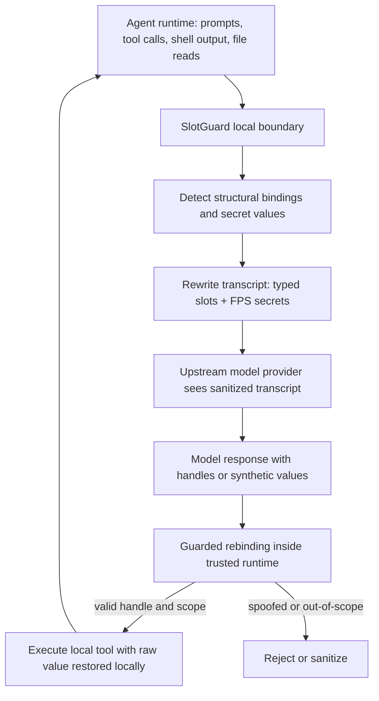

# SlotGuard：把 Coding Agent 的隐私防线放在 provider-bound transcript 之前

### 元信息与 TL;DR

- **原文**：[SlotGuard: Stop Oversharing Private Local Context in LLM Agent Transcripts](https://arxiv.org/abs/2607.17147)
- **作者**：Haocheng Xia、Yongjoo Park
- **机构**：University of Illinois Urbana-Champaign
- **日期**：2026-07-19 提交到 arXiv
- **会议/场景**：ICML 2026 AIWILD workshop
- **代码**：[illinoisdata/SlotGuard](https://github.com/illinoisdata/SlotGuard)
- **类型**：AI 安全 / Agent 隐私边界 / Coding Agent transcript 防护

**TL;DR：**

- 这篇论文关注一个容易被忽视的 Agent 隐私泄漏面：coding agent 会把 tool output、shell log、file read、process listing、路径、邮箱、host、branch、环境变量和凭据形状字符串追加进后续 provider-bound transcript；即使用户没有主动输入这些内容，它们也可能离开本地信任边界。
- 作者提出 SlotGuard：一个本地 transcript boundary，位于 agent runtime 与 upstream model provider 之间；它在 transcript 发送前把结构性绑定改写成 typed、suffix-aware slots，把 secret values 替换成 format-preserving synthetic values，并只在 trusted runtime 内做 guarded rebinding。
- SlotGuard 的关键不是“把敏感值涂黑”，而是“保护原值，同时保留模型完成工具工作所需的结构线索”：路径仍像路径，文件扩展名和安全 suffix 仍存在，credential surrogate 仍满足格式语法，但原始用户名、项目名、客户名、密钥字符不会发给 provider。
- 实验覆盖 30-session structural corpus、9,229 paths、20,814 annotated sensitive characters、200-session credential corpus、852 planted credential values、12-task local workflow probe、200-task multi-model probe，以及从 TheAgentCompany 派生的 TAC-lite replay。
- 主要数字很明确：SlotGuard 将 20,814 个结构敏感字符的 provider-visible leakage 降到 0，将 852 个 planted credential values 的 credential leakage 降到 0.0%；generic redaction 在四个模型的 200-task workflow probe 上降到 2.5% task success，而 SlotGuard 接近 raw transcript。
- 性能上，核心 deterministic rewrite 很轻：path abstraction median 1.690 微秒，path rebinding median 0.398 微秒，full agent turn rewriting median 14.424 微秒；可选 semantic detector 明显慢得多，warm median 742 ms，所以只作为 advisory proposal。
- 局限也清楚：评测主要是 synthetic 与 replay-style workloads，尚未在生产 Agent trace 上验证；semantic entity graph 仍是 keyword/pattern-based 的早期实现；论文未评估强攻击者从剩余上下文中做 adversarial reconstruction。

### 研究问题：为什么普通 redaction 不适合 Agent transcript？

论文要回答的问题不是“如何检测 API key”，而是：

> 在不破坏 coding agent 工作流的前提下，如何阻止本地路径、实体名和凭据进入 provider-bound transcript？

传统 redaction 在 Agent 里会遇到三类失败。

- **漏检位置复杂**：
  - secret 可能不出现在 `api_key = ...` 这种规则容易匹配的位置。
  - 它可能被 shell parameter expansion、process listing、URI credential、authorization header、config snippet 或 tool stderr 间接带出。
  - path、workspace root、客户名、项目名、敏感文件名不是传统 secret scanner 的主要目标。

- **过度替换破坏执行结构**：
  - 把路径替换成 `PATH` 会丢掉 file extension、repo-relative suffix、目录角色和路径形状。
  - 把 credential 替换成 `API_KEY` 会让模型误以为配置缺失，或生成语法无效的命令。
  - coding agent 的推理依赖“这个东西像 Python 文件、像数据库 URI、像配置路径、像 token”，不是只依赖自然语言语义。

- **跨轮引用会绕过精确匹配**：
  - 第一轮出现完整路径，第二轮可能只出现文件名、suffix、客户代号或派生形式。
  - 单轮正则替换不能保证后续 transcript 中的 indirect reference 仍被保护。
  - 如果 placeholder 自身包含类型标签，还可能产生 categorical leakage：值被隐藏了，但 provider 仍知道这里是某种 secret。

SlotGuard 的目标因此是 compatibility-preserving privacy：原值不离开本地，但 workflow-level signals 仍被保留。

### 论文主张与论证路线

| Claim | Mechanism | Evidence | Boundary |
|---|---|---|---|
| Agent transcript 有两个不同隐私面 | 区分 structural bindings 与 secret values | 结构语料含 9,229 paths；credential 语料含 852 planted values | 没覆盖所有企业 trace 中的自然敏感语义 |
| 普通 placeholder redaction 会破坏任务 | generic redaction 擦掉路径形状、扩展名、URI/credential grammar | 200-task probe 中 generic redaction 在四模型上都是 2.5% success | task success 指标主要围绕 repo/task handle，非全类型 Agent |
| SlotGuard 可兼顾隐藏与可用性 | typed suffix-aware slots + FPS + SEG + guarded rebinding | structural leakage 100% 到 0%；credential leak 23.5% 到 0%；SlotGuard 接近 raw success | SEG 对 paraphrase 和多跳隐含引用仍有限 |
| 本地边界开销可接受 | deterministic fast path，不依赖远程模型 | agent-turn rewriting median 14.424 微秒；6 KB turn 低于 100 微秒 median | optional semantic detector warm median 742 ms，不能放在同步热路径 |
| 安全边界不只是检测器 | raw value 只在 trusted runtime 内恢复，未知 handle、越界路径和 shell metacharacters 被拒绝 | 9,229 path round-trip 零 mismatch；64 crafted invalid rebindings 全部拒绝 | 本地 runtime 被攻破时 SlotGuard 不提供保护 |

### Threat model：它防什么，不防什么？

SlotGuard 的 threat model 很清楚。

| 组件 | 信任状态 | 说明 |
|---|---|---|
| local runtime | trusted | agent harness、tools、filesystem、SlotGuard boundary 被信任 |
| upstream provider | honest-but-curious | 正确执行推理，但 provider-bound transcript 可能被保留、记录、缓存或用于训练设置 |
| protected sink | provider-bound transcript | 目标是减少离开本地的敏感值，不是阻止本地程序访问 |
| protected values | structural bindings + secret values | path、workspace root、host、email、branch、entity name、credential、token、password、DB credential 等 |
| non-goal | full anonymization | 无法阻止从剩余上下文做语义推断，也无法防 compromised local runtime |

这个 threat model 对 coding agent 特别现实。

- Agent 为了工作会频繁调用 shell、读取文件、列目录、查看 git diff、跑测试。
- 这些 observation 会被 append 到下一轮 prompt。
- upstream model provider 看到的是完整 transcript，而不是只看到用户主动输入的自然语言。
- 本地路径、公司名、客户文件名和 credentials 可能在“普通调试输出”中被顺手带出。

所以 SlotGuard 不是 UI 层的隐私提示，也不是事后日志清洗，而是在 transcript 边界上做主动重写。

### 方法机制：SlotGuard 的四个核心组件

SlotGuard 的架构可以拆成四个组件。

| 组件 | 做什么 | 为什么不能省 |
|---|---|---|
| slot identification | 用同步 heuristic 和可选本地 semantic detector 找出 protected spans | 没有检测就无法建立边界；但 semantic detector 只能提议，不能直接改写 |
| compatibility-preserving rewriting | structural values 变 typed suffix-aware slots；secrets 变 format-preserving synthetic values | 保留路径/凭据形状，让模型还能生成有效工具调用 |
| semantic entity graph (SEG) | 在 session 内追踪 embedded、derived、cross-turn references | 精确字符串替换无法处理分裂和跨轮泄漏 |
| guarded rebinding | upstream 只见 handle；raw value 只在 trusted runtime 内恢复 | 防止模型伪造 handle、路径穿越、越界访问或把 raw secret 写回 transcript |

流程图如下。



这个闭环的重点是：

- 发送给 provider 的是 sanitized transcript。
- 本地执行前才恢复 raw value。
- 恢复不是无条件替换，而是要验证 handle 是否存在、类型是否匹配、路径是否在允许 scope 内、是否包含危险 shell metacharacters。

### 公式：typed slot 与 format-preserving synthetic value

论文给 structural bindings 定义了 session-scoped slot table。

```text
T: V -> H

V = protected raw values
H = upstream-visible handles

h(v) = HMAC_k_s(type(v) || v)
```

变量解释：

- `v`：一个原始受保护值，例如 workspace root、邮箱、敏感文件名或路径。
- `type(v)`：SlotGuard 给它分配的 slot type，例如 repo root、email、sensitive document。
- `k_s`：per-session secret key。
- `h(v)`：发送给模型的 stable handle。
- `T`：本地 session slot table，用于后续 guarded rebinding。

这个设计带来两个性质。

- 同一 session 内同一个 raw value 可以稳定映射，模型能跨轮引用。
- 不同 session 使用不同 secret key，同一 raw value 的 handle 不可跨 session 链接。

对 secret values，SlotGuard 使用 FPS。

```text
synthetic(v) ~ Uniform(F_type(v))

F_type(v) = valid strings for the same credential format class
I(synthetic(v); v | type(v)) = 0
```

这表示：

- synthetic value 满足同类格式，例如仍像某种 token、URI credential 或环境变量值。
- synthetic value 不包含原始 secret 的字符。
- 模型看到“这里有一个格式合理的凭据值”，但无法从字符层恢复原值。

这比 `API_KEY` 这种泛化标签更适合 coding agent，因为工具调用经常要求字符串在语法上仍然成立。

### Suffix-aware path abstraction：为什么路径不能全涂黑？

路径是 coding agent 的核心工作材料。

一个路径同时携带多类信息。

| 路径成分 | 对隐私的风险 | 对 Agent 的效用 |
|---|---|---|
| user home prefix | 暴露用户名、组织或机器布局 | 通常不需要给模型知道 |
| workspace root | 暴露项目或客户名 | 需要让模型知道相对范围 |
| middle components | 可能暴露敏感客户、法律事项、内部代号 | 有时是语义线索，但风险高 |
| suffix and extension | 表示文件类型和任务目标 | 通常对工具调用和推理很重要 |

SlotGuard 的策略不是把整条路径变成不透明 token，而是：

- 替换最长 trusted root。
- 抑制敏感 middle components。
- 保留有限且安全的 task-relevant suffix。
- 保留文件扩展名。
- 让重写后的值仍是 path-shaped。

论文中的结构结果也支持这个选择。

| 指标 | Baseline | SlotGuard |
|---|---:|---:|
| Sensitive chars visible upstream | 20,814 | 0 |
| Structural leakage | 100.0% | 0.0% |
| Paths retaining file extension | - | 93.6% |
| Paths retaining at least one safe suffix component | - | 100.0% |
| Fully opaque paths | - | 0.0% |

这里的关键判断是：隐私保护不等于信息全毁。对 Agent 来说，保留“可执行形状”本身是安全机制的一部分，因为模型生成错误路径、错误命令或不可 rebind handle 时，系统可能产生更多 retry、更多日志、更多泄漏面。

### Semantic entity graph：解决 embedded / split / cross-turn 泄漏

SlotGuard 引入 SEG，不是为了做完整语义理解，而是为了处理 agent transcript 中常见的传播模式。

SEG 节点包括：

- raw protected values。
- rewritten handles。
- embedded occurrences。
- derived forms。
- later indirect references。

SEG 边包括：

- coreference。
- embedding。
- derivation。
- keyword-based relation。
- pattern-based relation。

它的作用可以用伪代码表示。

```text
Input:
  transcript turn x
  slot table T
  semantic entity graph G

for span in detect_high_precision_spans(x):
  handle = rewrite(span)
  T[span] = handle
  G.add_node(span)
  G.add_node(handle)
  G.add_edge(span, handle, "rewrite")

for proposal in optional_local_semantic_detector(x):
  if proposal.span appears verbatim in x and proposal.type is allowed:
    handle = rewrite(proposal.span)
    T[proposal.span] = handle
    G.add_edge(proposal.span, handle, "semantic_proposal_verified")

for later_reference in detect_keyword_or_pattern_links(x, G):
  protect(later_reference)
  G.add_edge(later_reference, matched_entity, "cross_turn_link")

Output:
  sanitized transcript
  updated T and G
```

论文也承认 SEG 的边界。

- 它目前可靠处理 keyword 与 pattern links。
- 它不做困难的 paraphrased coreference。
- 它不做多跳隐含推理链。
- 作者把它称作 conservative first step，而不是完整语义隐私系统。

这点很重要，因为很多隐私论文容易把“语义泄漏”说得过满。SlotGuard 的 claim 更克制：它处理常见 transcript 泄漏路径，并保留未来扩展到 richer coreference 的空间。

### 实验设置：语料、任务和 baseline

论文评测四个问题。

| RQ | 问题 | 对应实验 |
|---|---|---|
| RQ1 | 是否移除 structural leakage | 30-session structural corpus，9,229 paths，20,814 sensitive chars |
| RQ2 | 是否移除 credential leakage | 200-session credential corpus，852 planted values |
| RQ3 | 是否保留 workflow compatibility | 12-task local probe、200-task four-model shared probe、TAC-lite replay |
| RQ4 | hot path 是否实际可用 | microbenchmark、6 KB turn、semantic detector latency、invalid rebinding cases |

对比对象包括：

- `Raw`：不做保护，作为 task success 上限和 leakage 下限的反面。
- `Generic redaction`：普通泛化替换。
- `VibeGuard-style typed placeholder`：restore-aware typed placeholders。
- `Full SlotGuard`：typed suffix-aware structural slots + FPS + SEG + guarded rebinding。

代码仓也说明了工程结构。

| 目录 | 职责 |
|---|---|
| `crates/slotguard-core` | core abstraction、rebinding、credential sanitization、FPS、SEG |
| `crates/slotguard-cli` | 本地 inspection 和 demo commands |
| `crates/slotguard-experiments` | 论文 benchmark harness |
| `scripts` | reproduction 与 verification helpers |

复现入口是 `scripts/repro_paper.sh`。默认只跑 deterministic experiments；local model、multi-model generalization、TAC-lite replay 通过环境变量显式开启，避免没有模型 endpoint 的读者被阻塞。

### 主结果一：隐私泄漏被降到 0，但不是靠全擦除

结构隐私结果：

| 指标 | Raw / Baseline | Full SlotGuard |
|---|---:|---:|
| sensitive chars visible upstream | 20,814 | 0 |
| structural char leakage | 100.0% | 0.0% |
| paths retaining file extension | - | 93.6% |
| paths retaining safe suffix | - | 100.0% |
| fully opaque paths | - | 0.0% |

Credential 结果：

| 方法 | Session leak | Credential leak | Categorical leak |
|---|---:|---:|---:|
| No protection | 100.0% | 100.0% | 0.0% |
| Typed placeholder baseline | 100.0% | 23.5% | 100.0% |
| FPS only | 100.0% | 23.5% | 0.0% |
| SlotGuard (FPS + SEG) | 0.0% | 0.0% | 0.0% |

这张 credential 表非常关键。

- typed placeholder 会泄露类别：provider 虽然不知道原值，但知道这里是某类 credential。
- FPS only 避免类别标签，但 split / embedded exposure 仍会泄漏。
- FPS + SEG 才把 session leak、credential leak、categorical leak 同时降到 0。

换句话说，SlotGuard 的贡献不是某个单独技巧，而是把三层约束组合起来。

- 语法保留：模型还知道字符串在格式上是什么。
- 原值隔离：provider 看不到真实值。
- 跨轮追踪：派生、嵌入和后续引用不会轻易漏出。

### 主结果二：通用 redaction 让 Agent 几乎不能工作

200-task shared workflow probe 覆盖四个 upstream models。

| Model | Raw | Generic | VG-style | SlotGuard |
|---|---:|---:|---:|---:|
| DeepSeek-V3.2 | 100.0% | 2.5% | 38.5% | 89.5% |
| gpt-5.4 | 100.0% | 2.5% | 20.5% | 98.0% |
| Kimi-K2.6 | 100.0% | 2.5% | 21.5% | 100.0% |
| Llama-3.3-70B | 93.5% | 2.5% | 31.5% | 93.5% |

TAC-lite replay 也呈现同样顺序。

| Model | Raw | VG-style | SlotGuard |
|---|---:|---:|---:|
| DeepSeek-V3.2 | 95.0% | 34.4% | 87.5% |
| gpt-5.4 | 92.5% | 36.9% | 92.5% |
| Kimi-K2.6 | 95.0% | 35.6% | 95.0% |
| Llama-3.3-70B | 90.0% | 26.9% | 90.0% |

这里要读出的不是“SlotGuard 永远等于 raw”，而是：

- generic redaction 在 Agent 工具任务中几乎不可用。
- typed placeholder 有帮助，但仍丢掉太多 execution cue。
- suffix-aware path shape 与 format-preserving credential surrogate 是任务成功率的关键。

局限也要保留：

- TAC-lite 不运行 TheAgentCompany 的完整 Dockerized online environment。
- 它抽取 repo-centric local handles，并在随机 workspace roots 下实例化。
- 这降低了工程成本，也意味着它测的是 local handle replay，不是完整企业 Agent 环境。

### 主结果三：hot path 很快，semantic detector 只能 advisory

SlotGuard 的运行开销分两部分。

| 操作 | Median latency |
|---|---:|
| path abstraction | 1.690 微秒 |
| path rebinding | 0.398 微秒 |
| full agent turn rewriting | 14.424 微秒 |
| 6 KB turn rewriting | 低于 100 微秒 median |
| optional local semantic detector warm | 742 ms |
| optional local semantic detector cold first call | 919 ms |
| optional local semantic detector p95 | 929 ms |

这说明系统设计有一个清晰分层。

- 同步 fast path 依赖 deterministic heuristic、parser、slot table、FPS 和 guarded rebinding。
- 本地 semantic model 只做 proposal。
- proposal 必须通过 verbatim span 与 allowed slot type 验证。
- semantic detector 不能直接修改 transcript，因为它太慢且可能误判。

这个分层比“用一个本地小模型检测隐私”更工程化：

- 小模型提高 sensitive filename probe 的 recall 和 F1。
- 但核心安全边界不把权力交给小模型。
- 模型只是建议者，SlotGuard 的规则层才是执行者。

### 主结果四：guarded rebinding 让 placeholder 不只是文本替换

SlotGuard 的安全性还体现在 rebinding。

| 测试 | 结果 |
|---|---|
| 9,229 rewritten paths round-trip | zero mismatches, zero unexpected errors |
| 64 crafted invalid rebindings | all rejected |
| traversal attempts | rejected |
| spoofed placeholder not in slot table | rejected |
| shell metacharacter injection | rejected |
| pathological large paths | sanitized |
| mixed encoding / non-UTF-8 fragments | sanitized |

这意味着 SlotGuard 不把 upstream model 当成可信 command generator。

- 模型可以输出一个 handle。
- 但 handle 必须存在于 session slot table。
- handle 的 type 必须符合预期。
- path 必须 rebind 到 allowed scope。
- fabricated credential-shaped strings 若没有注册，只是 untrusted literals。
- raw secret 只在本地执行需要时被注入，不写回 provider-bound transcript。

这个点对 Agent 安全很重要：

- 许多 redaction 工具只处理“发出去的文本”。
- SlotGuard 同时处理“模型返回的 handle 如何变回本地动作参数”。
- transcript privacy 与 tool access boundary 被放在同一个系统里考虑。

### Figure / Table 证据逐项解读

| 原文证据 | 支撑什么 | 不能证明什么 |
|---|---|---|
| Figure 1 | SlotGuard 位于 user/agent runtime 与 model provider 之间，发送前替换，本地执行前 rebind | 不能说明所有 agent framework 都能无侵入集成 |
| Figure 2 | sanitized transcript 上行，raw values 只在 local trusted runtime 恢复 | 不能防 compromised local runtime |
| Table 1 | structural leakage 与 credential leakage 主结果，显示 20,814 chars、852 credentials 均降到 0 | 这些是 controlled corpora，不是生产 trace |
| Table 2 | 四模型 200-task workflow probe，说明 SlotGuard 比 generic/VG placeholder 更保留任务能力 | 任务主要是 repo/workflow handle，不代表所有 Agent 任务 |
| Table 3 | TAC-lite replay 中 SlotGuard 接近 raw，VG-style 明显落后 | TAC-lite 不复现完整 TAC 服务栈 |
| Table 4/5 | 结构隐私与 credential ablation 更细，说明 FPS+SEG 才解决 split exposure | SEG 对 paraphrase 和复杂 indirect references 仍未充分验证 |
| Table 6 | local 12-task probe 的 ablation，No FPS 与 No suffix preservation 都掉分 | 12-task probe 样本小，只能做机制解释 |
| Table 8 | latency 差异主要来自模型与 placeholder 表示的交互，而非本地 rewrite | end-to-end latency 受 endpoint、retry 和 JSON parse 影响 |
| Table 9 | adversarial rebinding case 说明 fail-closed 行为 | 仍有一个 out-of-scope absolute path edge case |

### 与相关工作的关系

SlotGuard 不是从零发明每个组件，而是把几个成熟思想按 Agent transcript 边界重新组合。

| 相关方向 | 典型做法 | SlotGuard 的差异 |
|---|---|---|
| plugin-level redaction | regex / category hash placeholder | 增加 suffix-aware paths、FPS、SEG、guarded rebinding |
| network-level proxy | HTTPS 或 gateway 层统一改写 provider request | 更靠近 agent harness，能看到 tool call、tool output、execution intent |
| PII anonymization | 检测人名、邮箱、电话等实体并替换 | Agent 需要保留路径、URI、header、credential grammar 这类执行线索 |
| information flow control | 跟踪 sensitive values 的传播 | protected sink 被定义为 provider-bound transcript |
| contextual integrity | 判断信息流在具体上下文中是否合适 | raw value 在本地 runtime 合适，进入 remote provider transcript 不合适 |

最值得注意的是 network proxy 的边界。

- proxy 适合作为 last-line defense。
- 但它看不到 agent 对本地 scope 的理解。
- 它不自然知道某个 path 是否允许 rebind。
- 它也不适合把 sanitized handle 安全恢复成 local tool argument。

所以 SlotGuard 的 primary design point 是 harness，而不是纯网络代理。

### 局限与失败边界

论文没有把 SlotGuard 说成完整隐私系统，这一点值得肯定。

| 局限 | 具体含义 |
|---|---|
| synthetic / replay-style workloads | 语料有 ground truth，方便测泄漏，但不等于真实企业 trace |
| no adversarial reconstruction study | 没有测试强攻击者是否能从剩余上下文恢复语义 |
| SEG early implementation | 主要处理 keyword/pattern links，未覆盖 paraphrase、implicit coreference、多跳推理 |
| local runtime trusted | 如果本地 runtime 或工具链被攻破，SlotGuard 不是隔离沙箱 |
| semantic inference remains | 即使原值隐藏，文件上下文、任务描述或相邻文本仍可能暗示敏感信息 |
| production baseline comparison insufficient | 尚未系统比较企业 DLP、secret scanner、LLM guardrail 产品 |

这些边界影响部署判断。

- SlotGuard 适合作为“provider-bound transcript 最小化”层。
- 它不替代权限控制、secret manager、sandbox、policy engine、人类审批或企业 DLP。
- 它尤其适合 coding agent、数据分析 agent、企业自动化 agent，因为这些系统高频处理本地文件与 shell output。

### 细读：为什么“发送给模型的上下文”应被当成一等安全对象？

很多 Agent 安全讨论把注意力放在模型输出上，例如：

- 模型是否生成有害代码。
- 模型是否泄露用户明确询问的秘密。
- 模型是否调用了危险工具。
- 模型是否遵守系统提示和工具策略。

SlotGuard 提醒我们，输入侧同样是安全边界。

- Agent runtime 为了让模型继续规划，会把上一轮工具观察追加进 transcript。
- 这些观察通常不是用户主动写的，而是本地系统运行时自然产生的。
- 一旦进入 provider-bound transcript，信息就从“本地执行状态”变成“远程推理上下文”。
- 即使 provider 不训练模型，服务端日志、缓存、调试系统、事故恢复链路也可能扩大暴露面。

这对 coding agent 尤其明显。

| 本地信息 | 为什么会进入 transcript | 为什么敏感 |
|---|---|---|
| 绝对路径 | `ls`、报错栈、测试输出、编辑器定位 | 用户名、客户名、项目代号、目录结构 |
| shell 命令 | agent 记录执行命令和 stdout/stderr | 环境变量、参数、服务名、内部 endpoint |
| process listing | 调试长任务、检查运行状态 | 命令行里可能有 fallback secret 或 token |
| git branch | 版本控制状态、CI 输出 | 功能代号、客户交付计划、漏洞修复分支 |
| 文件名 | read/search/list 操作 | 法务、裁员、合同、事故报告等语义 |
| URI / header | 调试 API 请求和配置 | credential、host、tenant、数据库名 |

普通聊天机器人里，用户大多知道自己输入了什么；coding agent 里，用户未必知道本轮 transcript 里混进了什么工具输出。SlotGuard 的研究意义就在这里：它把 transcript minimization 放到 Agent runtime 内部，而不是依赖用户自己判断哪些内容能发给模型。

### 细读：SlotGuard 的设计取舍不是“越少越安全”

一个容易误解的方向是：既然担心泄漏，那就把所有路径、变量和文件名都改成不透明 ID。论文的实验恰好反驳了这个直觉。

对 Agent 来说，结构信息有双重身份。

- **隐私风险**：
  - `/Users/...` 可能暴露用户和组织。
  - 中间目录可能暴露客户、案件、内部项目。
  - credential-shaped string 可能直接授予权限。

- **执行线索**：
  - `.py`、`.toml`、`.json`、`.md` 告诉模型该用什么解析或编辑方式。
  - repo-relative suffix 告诉模型文件在项目中的职责。
  - URI grammar 告诉模型命令是否仍能被工具接受。
  - stable handle 告诉模型跨轮引用的是同一个对象。

所以 SlotGuard 选择的是“选择性保留可执行结构”。

| 设计问题 | 粗暴做法 | SlotGuard 做法 |
|---|---|---|
| 路径保护 | 全部替换成 `PATH` | root 和敏感中段抽象，保留安全 suffix 与扩展名 |
| secret 保护 | 替换成 `API_KEY` 标签 | 生成同格式但不含原字符的 synthetic value |
| 跨轮一致性 | 每次重新替换 | session slot table 保持同一会话内稳定 |
| 间接引用 | 只看精确字符串 | SEG 记录 embedded、derived、keyword/pattern links |
| 工具执行 | 让模型直接输出 raw path | 本地验证 handle 后 rebind |

这组取舍的研究价值在于：隐私系统不只要降低泄漏率，还要维持任务可完成性。否则用户为了让 Agent 能工作，会绕过防线，最后隐私保护在实践中失效。

### Detail inventory：方法、数据、指标与消融

为了便于复查，可以把论文细节列成如下 inventory。

| 项目 | 具体内容 |
|---|---|
| 方法名 | SlotGuard |
| 核心对象 | provider-bound LLM agent transcript |
| 受保护值 | structural bindings 与 secret values |
| 结构保护 | typed slots、HMAC session handles、suffix-aware path abstraction |
| 凭据保护 | format-preserving synthetic substitution |
| 跨轮保护 | session-scoped semantic entity graph |
| 执行保护 | guarded local rebinding、scope/type validation、reject unknown handles |
| 结构语料 | 30 randomized repository-like sessions、9,229 paths、20,814 sensitive characters |
| 凭据语料 | 200 sessions、852 planted credentials，覆盖 direct、embedded、split、derived、cross-turn |
| workflow probe | 12-task local probe、200-task four-model probe |
| replay benchmark | TAC-lite：33 task families、40 grounded handles、160 replay tasks |
| 上游模型 | DeepSeek-V3.2、gpt-5.4、Kimi-K2.6、Llama-3.3-70B 等 |
| baseline | Raw、Generic redaction、VibeGuard-style typed placeholder、component ablations |
| 关键指标 | literal leakage、categorical leakage、credential leak、task success、tool-valid rate、invalid-handle rate、rewrite latency |
| 主要消融 | No FPS、No suffix preservation、FPS-only、typed placeholder、optional semantic detector |
| 失败案例 | root-owned absolute path edge case、SEG 对 paraphrase/multi-hop reference 不充分 |

这些细节说明，SlotGuard 是一个系统论文而不是纯检测论文。

- 它定义了 threat model。
- 它提出了边界层。
- 它有可执行代码和复现脚本。
- 它把 privacy 与 utility 一起测。
- 它把 local execution rebinding 作为安全面的一部分。

### 研究者如何复验这篇论文？

从代码仓的 REPRO 看，复验被拆成 deterministic core 与需要模型端点的 optional stages。

| 复验层 | 需要什么 | 产物 |
|---|---|---|
| workspace verify | Rust toolchain、cargo、python3 | shell syntax、cargo fmt、cargo test |
| deterministic core | 不需要远程模型 endpoint | corpus、credentials、placement、privacy results、microbench summary |
| local-model experiments | Ollama/vLLM/OpenAI-compatible local endpoint | local probe results |
| model generalization | Azure/OpenAI-compatible model specs 和 API key | 200-task multi-model probe |
| TAC-lite replay | TheAgentCompany checkout 与 local/remote model endpoint | TAC-lite data 和 replay results |

这套复验设计有两个优点。

- 没有模型端点的读者仍能复查 deterministic privacy 和 microbench 部分。
- 需要付费或本地模型的实验被环境变量 gate 住，不会把复现门槛混在一起。

但它也留下几个复验风险。

- 多模型 probe 依赖外部模型部署，未来模型版本漂移会影响 task success。
- TAC-lite 依赖 TheAgentCompany checkout，任务抽取脚本和上游任务变化会影响样本。
- 公开仓库忽略 raw generated corpora 与 JSON artifacts，因为 synthetic secret-shaped strings 可能触发 secret scanners；读者必须本地重生成。
- 没有生产 trace 意味着复现实验能证明机制正确，但不能证明企业分布上的覆盖率。

### 部署判断：SlotGuard 应放在哪一层？

论文提到三个可能部署点。

| 部署点 | 优点 | 缺点 |
|---|---|---|
| agent harness | 能看到 prompts、tool calls、tool outputs、shell observations、execution intent；能做 guarded rebinding | 需要集成具体 Agent framework |
| filesystem-facing path layer | 可以从源头虚拟化 raw paths | 不一定看到 credential、process listing、model transcript 结构 |
| model gateway / LiteLLM layer | 可作为跨模型 backend 的 last-line defense | 难以理解本地 scope，也难以安全 rebind 到工具执行 |

研究上最合理的结论是：

- harness 层最适合做主边界，因为它最了解 Agent 的本地语义。
- gateway 层适合兜底，但不应被期待完成 scope-aware rebinding。
- filesystem 层可以减少路径暴露，但不能覆盖所有 transcript leakage。
- 真正生产部署可能需要多层组合，而不是单点拦截。

这也给 Agent framework 提出一个接口问题：未来框架应把 transcript boundary 当成标准扩展点，而不是让隐私工具事后解析一大段拼好的 prompt。

### 评测指标不能混用

读这篇论文时还要区分三类指标。

- **泄漏指标**回答“原始敏感值是否离开本地”：它关注 provider-visible 字符、credential value、类别标签和可重构引用。
- **兼容性指标**回答“模型是否还能完成任务”：它关注 exact handle、tool-valid、execution-ready 和 task success。
- **边界指标**回答“模型输出能否安全回到本地执行”：它关注 unknown handle、路径越界、shell 注入、伪造 placeholder 和 round-trip mismatch。

如果只看泄漏率，最强方案可能是全量擦除；如果只看任务成功率，raw transcript 最好但隐私最差。SlotGuard 的贡献正是在三类指标之间建立可审计折中。

### 对 Agent 安全研究的启发

这篇论文把一个常见但模糊的问题具体化了：

> Agent 的隐私泄漏不只发生在模型回答里，也发生在发送给模型的上下文里。

未来研究可以沿四个方向推进。

- **更真实的生产 trace**：
  - 在企业 coding agent、IDE assistant、CI assistant、data notebook agent 中收集经过脱敏标注的真实 transcript。
  - 衡量 structural bindings、secret values、semantic entity names 的自然出现频率。
  - 比较 SlotGuard、DLP、secret scanner、network proxy 的 coverage。

- **更强 adversarial reconstruction**：
  - 给攻击者 sanitized transcript 和相邻上下文。
  - 测试它能否恢复用户名、项目名、客户名、secret 类型、文件语义或组织结构。
  - 把 literal leakage 扩展成 semantic leakage 风险分层。

- **和 tool policy 联合设计**：
  - SlotGuard 已经有 guarded rebinding。
  - 下一步可以把 rebinding 与 allowlist、capability token、human confirmation、sandbox policy 连起来。
  - 这样 transcript boundary 就能同时控制“发给模型什么”和“模型能让本地执行什么”。

- **跨 Agent 框架集成**：
  - 仓库目前强调非 MCP transcript-boundary implementation。
  - 未来可以比较 harness-level、filesystem-level、gateway-level 三种部署点。
  - 不同部署点的 trade-off 应包括可见上下文、重绑定能力、框架侵入性、失败模式和性能。

### 结论：SlotGuard 的关键贡献是什么？

SlotGuard 的核心贡献不是“又一个脱敏器”，而是把 Agent transcript 视为一个本地到远程的安全边界。

- 它识别了 structural bindings 和 secret values 两类不同泄漏面。
- 它避免 generic redaction 破坏 Agent workflow。
- 它用 suffix-aware slots 保留路径结构。
- 它用 format-preserving synthetic values 保留 credential grammar。
- 它用 session graph 追踪常见跨轮引用。
- 它用 guarded rebinding 把 raw value 限定在 trusted runtime。

对研究者来说，这篇论文最有价值的判断是：

- 隐私保护不能只看“是否隐藏原字符串”。
- 对 Agent 系统，还必须看隐藏后模型是否仍能正确使用工具。
- 如果保护机制让任务成功率崩溃，用户会关闭它；如果保护机制只做弱替换，provider-bound transcript 仍会泄漏。
- SlotGuard 提供的路径是在两者之间建立一个可执行边界：上游只看 sanitized-but-structured transcript，本地才拥有真实绑定和凭据。

这正是 Agent 安全从 prompt-level guardrail 走向 runtime boundary 的方向。
