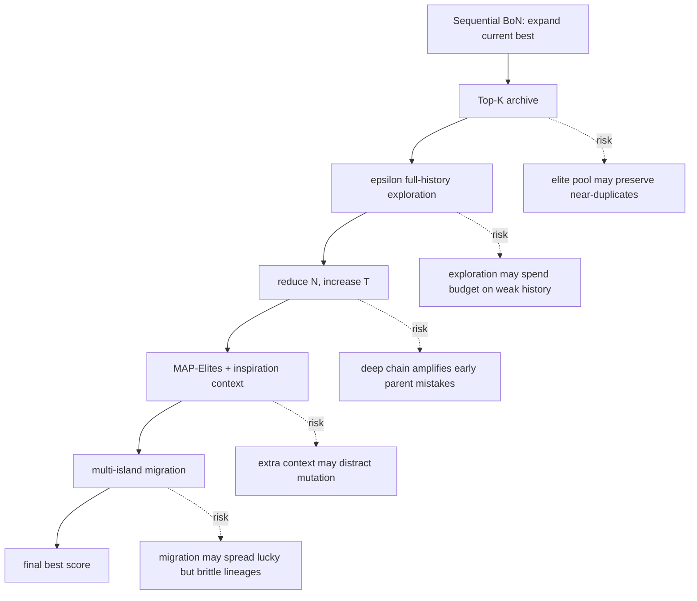

# Automated Discovery Has No Universally Superior Harness：自动发现系统的 harness 不是通用配方，而是在线分配问题

### 元信息

| 字段 | 内容 |
|---|---|
| 论文 | Automated Discovery Has No Universally Superior Harness |
| 作者 | Akshat Gupta、Jermaine Lei、Alexander Lu、Gopala Anumanchipalli、Leshem Choshen |
| 机构 | UC Berkeley、MIT-IBM Watson AI Lab |
| 类型 | arXiv 论文 + 公开实验代码 |
| 发布日期 | 2026-07-20 17:59:37 UTC |
| 原始链接 | https://arxiv.org/abs/2607.18235 |
| 代码仓库 | https://github.com/akshat57/harness-generalization |
| 本文关注 | 大模型 Agent / 自动发现 / coding-agent harness 评测 |

### TL;DR

1. 这篇论文研究的不是“LLM 自动发现系统能不能找到好解”，而是更细的诊断问题：OpenEvolve、TTT-Discover 这类系统里的 harness 设计，究竟是不是可以跨模型、跨问题迁移的通用方法。
2. 作者把两类代表性 harness 拆成组件：Sequential Best-of-N、Top-K archive、epsilon-greedy 全历史探索、深度/广度预算分配、MAP-Elites、multi-island、UCT、PUCT、多 parent 扩展。
3. 实验规模很大：30 个预算匹配的 harness，12 个 model-problem pair，4 个模型从 Qwen2.5-3B、Qwen3-4B 到 GPT-OSS-20B、GPT-OSS-120B，3 个任务是 circle packing、Heilbronn triangle、second autocorrelation inequality，总计超过 310 万次 LLM rollout。
4. 核心结论是“没有固定 harness 显著优于简单基线”：最强的固定配置在 cross-pair majority-win 上看起来是 `K=1, epsilon=20%`，`Pmaj=0.914`、原始 `pcross=0.023`，但 Holm 校正后 `pholm=0.678`，不能支持通用优越性。
5. 论文最反直觉的数字来自 OpenEvolve 分支：完整 OpenEvolve-style 配置在最大值统计下的 `Pmaj=0.033`、`pcross=0.978`，也就是复杂 recipe 经常低于把组件拆掉后的轻量探索或 PUCT/UCT 中间态。
6. 作者提出的正向替代不是再选一个“新通用 harness”，而是把 harness 当作在线资源分配对象：先跑多个 harness 的部分轨迹，看 25%、50%、75% checkpoint 的早期得分，再剪枝弱轨迹，把剩余预算给强 survivor。
7. 关键证据是早期表现确实可预测最终表现：10% checkpoint 的 Spearman 相关较弱到中等，范围是 0.000 到 0.474；到 50% checkpoint，12 个 pair 中 11 个超过 0.70，剩下一个 GPT-OSS-120B on second autocorrelation inequality 也有 0.651。
8. 最强 adaptive schedule 是 `12 -> 5 -> 2 -> 1`，在五个 full-run equivalent 的相同预算下，平均分 85.75%，高于 Sequential BoN 的 84.35%、single-harness 的 82.49%、unpruned portfolio 的 84.54%；局限是任务集中在 3 个数学/程序发现任务，run pools 下载链接在仓库 README 里仍标注 coming soon，且结论不等于所有 agent 任务都应使用同一剪枝策略。

### 研究问题：为什么 harness 本身需要被审计？

这篇论文的切入点很重要，因为很多自动发现系统的论文会把下面几个层次混在一起：

| 层次 | 常见说法 | 这篇论文要拆开的部分 |
|---|---|---|
| 生成器能力 | 模型会不会提出有用程序 | 模型固定后，搜索规则还剩多少贡献 |
| 评价器质量 | evaluator 能不能给正确分数 | evaluator 固定后，parent 选择如何影响轨迹 |
| harness recipe | OpenEvolve / TTT-Discover 整体有效 | archive、tree policy、budget、island 等组件是否单独有效 |
| 统计证据 | 跑几次看到更好结果 | 是否超过重复 BoN 基线的经验 null distribution |
| 部署策略 | 选一个默认 harness | 是否应在线探索多个 harness 再分配预算 |

作者质疑的是一种研究习惯：

1. 把一个复杂 harness 当作整体系统发布。
2. 用少量随机种子展示它比旧系统更强。
3. 默认把这个系统当作可迁移的通用 recipe。

论文的重新表述是：

> 当自动发现系统成功时，我们不应马上把成功归因给整套 harness；应该问每个 harness 选择是否跨模型、跨问题转移，还是只是在某个分布上碰巧有效。

### 统一视角：harness 是“选择旧 artifact 继续扩展”的规则

论文把 discovery harness 写成一个生成-评价-选择循环。变量可以这样读：

| 符号 | 含义 | 在 coding/discovery agent 中的直观解释 |
|---|---|---|
| `x` | 候选程序或解 | 一段被模型生成或修改后的代码/构造 |
| `S(x)` | evaluator 给出的分数 | 编译、测试、几何目标、数学目标或 benchmark 分数 |
| `H_t` | 第 `t` 步之前所有已评价候选的历史 | agent 的搜索轨迹和所有中间产物 |
| `E_t^K` | `H_t` 中分数最高的 Top-K archive | 当前 elite pool |
| `p_t` | 当前要扩展的 parent | 下一轮 prompt 里主要给模型修改的对象 |
| `N` | 每次 parent 生成的 child 数 | 一次扩展的广度 |
| `T` | 搜索迭代步数 | 连续 refinement 的深度 |
| `B=N T` | 总 rollout 预算 | 总共调用模型生成候选的次数 |

基础的 Sequential Best-of-N 非常贪心：

```text
p_t = argmax_{x in H_t} S(x)
```

也就是说，它总是扩展目前最高分程序。这个简单基线不是随便选的，因为它让研究者能问清楚：

1. 如果加入 Top-K archive，有没有比只追当前最好解更强？
2. 如果偶尔从全历史采样，有没有避免 premature convergence？
3. 如果把预算从 `N` 个 child 的广度转到 `T` 步深度，有没有更适合长链 refinement？
4. 如果引入 UCT/PUCT，把 subtree 信息和访问次数纳入 parent 选择，是否真的稳定优于贪心？
5. 如果再叠上 MAP-Elites、inspiration sampling、multi-island，收益是组件带来的，还是复杂度本身带来的？

### Figure 1：整篇论文的主图在说什么？


Figure 1 左边把两个系统家族拆到共同起点：

| 分支 | 从 Sequential BoN 加的组件 | 机制含义 |
|---|---|---|
| OpenEvolve-style | Top-K archive | 不只扩展唯一最高分程序，而是保留多个 elite |
| OpenEvolve-style | Full-history exploration | 以 `epsilon` 概率从全历史采样 parent |
| OpenEvolve-style | Reduce `N`, increase `T` | 固定预算下从广度转向深度 |
| OpenEvolve-style | MAP-Elites + inspiration | 给模型更多历史优秀程序作为上下文 |
| OpenEvolve-style | Multiple islands | 多个搜索进程并行，周期性交换 elite |
| TTT-Discover-style | Subtree value estimate | parent 价值来自其子树最好后代 |
| TTT-Discover-style | UCT bonus | 用访问次数鼓励未充分探索分支 |
| TTT-Discover-style | PUCT prior | 给高排名节点更高先验 |
| TTT-Discover-style | Multiple parents | 同一步扩展多个 parent |

Figure 1 右边更关键：它不是展示某个任务上最好看的分数，而是展示跨 12 个 pair 的 normalized win-rate。

| 路径 | 中间状态 | 观察到的趋势 |
|---|---|---|
| Sequential BoN -> OpenEvolve | 加 epsilon-greedy 时上升到 `+0.828` | 轻量探索有时有帮助 |
| Sequential BoN -> OpenEvolve | 加 depth 后降到 `-1.514` | 更深 refinement 不等于更好 |
| Sequential BoN -> OpenEvolve | MAP-Elites 后 `-0.247`，islands 后 `-0.067` | 完整复杂 recipe 没有稳定保住早期收益 |
| Sequential BoN -> TTT-Discover | UCT 为 `+0.288`，PUCT 为 `+0.467` | tree policy 中间态有正向迹象 |
| Sequential BoN -> TTT-Discover | depth 后 `-0.347`，multiple parents 后 `-0.476` | 继续堆完整 TTT-Discover-style 组件会反转收益 |

这张图的意义不是“OpenEvolve 差、PUCT 好”这么简单，而是：

1. 组件的边际贡献不单调。
2. 同一个组件在不同模型、不同任务上的方向可能相反。
3. 完整系统名不应替代组件级因果分析。
4. “复杂”不是免费变量，复杂 recipe 会改变预算分配和搜索分布。

### 实验设置：为什么作者强调 budget-matched？

自动发现系统最容易出现的评测错觉是：

1. 一个方法生成更多候选。
2. 或者运行更长 refinement。
3. 或者重复次数更多。
4. 最后只报告最好分数。

这样得到的提升可能只是预算提升，而不是 harness 提升。作者因此固定 rollout budget：

| 模型 | 每个 independent run 的 rollout budget | Sequential BoN 实现方式 | baseline pool |
|---|---:|---|---:|
| Qwen2.5-3B-Instruct | 1600 | 100 iterations x 16 children | 100 runs |
| Qwen3-4B-Instruct-2507 | 1600 | 100 iterations x 16 children | 100 runs |
| GPT-OSS-20B | 320 | 40 iterations x 8 children | 30 runs |
| GPT-OSS-120B | 160 | 40 iterations x 4 children | 30 runs |

任务也不是单一 benchmark：

| 任务 | 目标 | 为什么适合看 harness |
|---|---|---|
| Circle Packing | 在单位正方形内放 26 个不重叠圆，最大化半径和 | 几何结构直观，能观察模板、局部搜索、LP 解半径等策略跃迁 |
| Heilbronn Triangle | 在等边三角形内放点，最大化任意三点形成三角形的最小面积 | 全局耦合强，一个点移动会影响很多三元组 |
| Second Autocorrelation Inequality | 构造非负离散函数，使自卷积目标表现更好 | 更抽象，测试几何任务上的搜索偏好能否迁移 |

这里的研究设计有两个好处：

1. 同一模型跨 3 个任务，能看任务结构是否改变 harness 排名。
2. 同一任务跨 4 个模型，能看模型能力是否改变 harness 适配关系。

### 统计检验：不是看一次最好结果，而是和经验 null distribution 比

论文的 pair-level test 采用 best-of-five maximum。对某个 model-problem pair `g` 和候选 harness `h`：

```text
s_0 = (s_1^0, ..., s_{n0}^0)       # Sequential BoN baseline pool
s_h = (s_1^h, ..., s_5^h)          # candidate harness 的 5 次独立运行
M(s) = max(s_1, ..., s_5)
T_h = M(s_h)
```

作者用 baseline pool 重采样 5 个 baseline run，形成 best-of-five null distribution：

```text
H0: T_h 来自 Sequential BoN 的 best-of-five maximum 分布
H1: T_h 大于该分布下的期望

p_hat_h = (1 + sum_{r=1}^R 1{T_r^0 >= T_h}) / (R + 1)
R = 100000
```

这个选择有三层含义：

1. **避免正态假设**：final-score 分布可能偏斜、厚尾、不连续。
2. **对齐常见报告习惯**：很多 discovery 论文会报告少量 seed 中最好的结果，best-of-five 是更严格的相同口径。
3. **把“没显著”解释清楚**：不能拒绝 null 不代表方法永远无效，只代表五次样本不足以证明它在该 pair 下异常强。

跨 pair 的检验用 majority-win：

```text
G = {g_1, ..., g_12}
M_h = (M(s_{g1}^h), ..., M(s_{g12}^h))

Pmaj(h) = Pr[ candidate 在至少 7/12 个 pair 上击败重采样 BoN best-of-five ]
```

这个指标回答的是部署问题：

> 如果今天必须为未知模型-任务组合选一个固定 harness，它是否比简单 BoN 更常赢？

### 固定 harness 的结果：最强候选也过不了“通用性”门槛

固定 harness 排名中最醒目的几个数字如下：

| 配置 | `Pmaj` | `pcross` | Holm 后 `pholm` | 解读 |
|---|---:|---:|---:|---|
| `K=1, epsilon=20%` | 0.914 | 0.023 | 0.678 | 原始 p 值好看，但多重比较校正后不能宣称通用显著 |
| `PUCT, C=1, N=16, P=1` | 0.877 | 0.085 | 1.000 | tree prior 有正向趋势，但不足以替代通用 recipe |
| `PUCT, C=10, N=16, P=1` | 0.725 | 0.252 | 1.000 | 仍是中间态，而非完整 TTT-Discover-style endpoint |
| `OpenEvolve` | 0.033 | 0.978 | 1.000 | 完整 OpenEvolve-style 在这组评测中排在底部 |

作者的 Finding 1 可以拆成三句话：

1. 没有测试过的固定 harness 在全套 12 个 pair 上显著优于简单基线。
2. 最强 observed harness 会随模型和问题变化。
3. 因此不能把一次系统级成功直接推广成 harness 级通用原则。

这对 Agent 研究很有现实意义。很多 coding-agent、scientific discovery agent、tool-use agent 的系统论文会把“上下文选择、历史保留、重试策略、搜索树、评测器、预算分配”封在一个系统名里。本文提醒研究者：

| 研究声明 | 更严谨的改写 |
|---|---|
| “某系统优于 baseline” | “在某些模型-任务 pair 上，该系统组合的某些组件带来收益” |
| “OpenEvolve-style 更强” | “archive/exploration/depth/islands 的组合效应需要逐项检验” |
| “树搜索适合 discovery” | “UCT/PUCT 中间态有正向迹象，但完整 endpoint 未必保留收益” |
| “多跑几条轨迹更好” | “多样性是否有价值，要和非自适应 portfolio 对照” |

### 为什么 OpenEvolve-style 会在部分任务上变差？

论文没有把原因归结成单一失败模式，但从消融可以看出几个机制：

1. **Top-K archive 只保留 elite，不保证多样性有用**  
   如果模型本身生成的候选质量差，扩大 `K` 只是保留更多相似或低质量 lineage。

2. **全历史探索能救 premature convergence，也会浪费预算**  
   `epsilon` 采样可以跳出当前 elite，但也可能把 child budget 花在不相关历史程序上。

3. **从广度转深度会放大早期 parent 选择错误**  
   `B=N T` 固定时，降低 `N`、提高 `T` 意味着更长 refinement 链；如果早期 parent 不对，后面就是更深地优化错误方向。

4. **MAP-Elites 和 inspiration sampling 改变 prompt 上下文**  
   给更多历史程序不一定让模型更会综合；它可能制造上下文干扰，也可能把局部噪声当成设计线索。

5. **multi-island 不是免费 ensemble**  
   多岛并行的迁移策略会改变搜索分布；如果迁移的是偶然高分但泛化差的程序，会把多个岛拖向同一错误 basin。

用一个简化的 Mermaid 图看，完整 recipe 的风险在于每个组件都可能改变“探索/利用/上下文”的平衡：



### 正向方案：把 harness 选择变成在线资源分配

论文最有价值的部分不是“固定 harness 不行”，而是给出了可操作的替代 framing：

> 如果固定 harness 不迁移，而早期得分能预测最终得分，那么 harness 选择就应当在线发生。

作者先证明早期进度有信息量：

| checkpoint | 观察 |
|---|---|
| 10% | partial-run 与 final performance 的 Spearman 相关较弱到中等，范围 0.000 到 0.474 |
| 25% | 相关性上升，足以开始做粗粒度剪枝 |
| 50% | 12 个 pair 中 11 个相关超过 0.70；剩余一个为 0.651 |
| 结论 | 不需要完美预测，只要能比随机更好地区分明显弱的 partial trajectory |

然后作者设计 adaptive harness ensemble：

```text
Input:
  H = harness pool
  B_e = 5 full-run equivalents
  checkpoints = {25%, 50%, 75%}
  survivor schedule = m_0 -> m_1 -> ... -> m_L

State:
  active runs A
  each run has current best evaluator score q_h

Loop:
  1. sample m_0 harness configurations
  2. run all active configurations to next checkpoint
  3. rank by current best score
  4. keep top m_l survivors
  5. reallocate remaining budget to survivors

Output:
  best final score among completed survivors

Failure boundary:
  if early evaluator score is noisy or adversarial,
  pruning may discard late-blooming harnesses.
```

预算约束写成单阶段时非常清楚：

```text
m q + s (1 - q) <= B_e
```

| 符号 | 含义 |
|---|---|
| `m` | 起始 partial runs 数 |
| `q` | checkpoint 比例，例如 25% 或 50% |
| `s` | 保留下来跑完的 survivor 数 |
| `B_e` | 总预算，论文设为 5 个 full-run equivalents |

例子：

```text
17 个 run 跑到 25%，再完成 1 个 survivor
预算 = 17 * 0.25 + 1 * 0.75 = 5
```

多阶段时，预算约束是：

```text
sum_{l=1}^L m_l (q_l - q_{l-1}) <= B_e
```

这正好把 harness 选择问题变成 Successive Halving / Hyperband / ASHA 风格的资源分配问题，但分配对象不是超参数训练任务，而是 discovery harness trajectory。

### Table 1：adaptive allocation 的收益到底有多大？

主结果表在同样五个 full-run equivalent 的预算下比较四类策略：

| 策略 | 平均分 | 含义 |
|---|---:|---|
| Sequential BoN reference, 5 full | 84.35 | 简单但强的基线：把预算花在 5 次完整 BoN |
| Single-harness baseline, 5 full | 82.49 | 随机选一个 harness，然后重复 5 次 |
| Unpruned harness portfolio, 5 full | 84.54 | 试 5 个不同 harness，但不看中途反馈 |
| Adaptive schedules | 84.87 到 85.75 | 先跑 partial，再剪枝并重分配预算 |

最强 schedule：

| schedule | checkpoint | 平均分 | 对照差异 |
|---|---|---:|---|
| `12 -> 5 -> 2 -> 1` | 25% / 50% / 75% | 85.75 | 比 Sequential BoN 高 1.40 点 |
| `12 -> 5 -> 2 -> 1` | 25% / 50% / 75% | 85.75 | 比 unpruned portfolio 高 1.21 点 |
| `12 -> 5 -> 2 -> 1` | 25% / 50% / 75% | 85.75 | 比 single-harness 高 3.26 点 |

这个结果的关键不是 1.40 点有多大，而是对照设计排除了一个常见解释：

1. 如果只是“多试几个 harness”有用，那么 unpruned portfolio 应该已经吃到收益。
2. 但 adaptive schedule 继续超过 unpruned portfolio。
3. 因此收益来自利用 partial-run feedback 重新分配预算，而不只是 harness diversity。

### 三个任务的策略差异：模型能力会改变 harness 的最优形态

论文的附录给出很多 qualitative strategy analysis。它们解释了为什么固定 harness 不迁移。

| 任务 | 小模型常见策略 | 大模型常见策略 | 对 harness 的含义 |
|---|---|---|---|
| Circle Packing | ring template、clipping、简单 spacing | 把中心选择、半径求解、局部搜索拆开，甚至用 LP/SLSQP | 深度 refinement 只有在模型能提出强抽象时才有用 |
| Heilbronn Triangle | 随机扰动、边/顶点启发 | row、ring、lattice、symmetric layout、annealing/restarts | exploration 可能帮助跳结构，但也可能浪费在低分扰动 |
| Second Autocorrelation Inequality | 放大 baseline optimizer、增加 steps | 调 positivity transform、learning rate、clipping、step-like initialization | 数值优化任务的瓶颈更像 optimizer conditioning |

这说明 harness 和模型不是可分离的：

1. 弱模型在局部模板上震荡时，深度搜索可能只是加深错误 lineage。
2. 强模型能提出结构化重写时，树搜索或 partial pruning 才更容易识别有前途的 trajectory。
3. 抽象数值任务上，几何任务里的 diversity 策略未必迁移。

### 与相关工作的关系：它不是又一个 harness，而是评测协议

论文把自己放在四条线之间：

| 相关方向 | 代表 | 本文差异 |
|---|---|---|
| LLM-guided discovery | FunSearch、AlphaEvolve、OpenEvolve、TTT-Discover | 不证明系统能发现，而是审计 harness 组件能否迁移 |
| 评测严谨性 | deep RL seed sensitivity、NAS random search、AI agents that matter | 用 repeated baseline pool 和 bootstrap null distribution 处理随机性 |
| 搜索与资源分配 | UCT、PUCT、MAP-Elites、Successive Halving、Hyperband、ASHA | 把资源分配对象换成 harness trajectory |
| meta-harness / harness engineering | ADAS、AgentSquare、Meta-Harness、AutoHarness、Continual Harness | 不提出学习型 meta-harness，而是证明为什么 adaptation 有必要 |

这个定位很克制。作者没有说 adaptive harness ensemble 就是最终算法，而是把它当作因果测试：

1. 若固定 harness 不迁移；
2. 且早期反馈有预测力；
3. 那么在线分配应该优于固定选择和非自适应组合。

实验结果支持这三步逻辑。

### 代码仓库证据：实现结构是否支撑论文说法？

公开仓库的结构和论文主线基本一致：

| 目录 | 作用 |
|---|---|
| `circle_packing/` | 任务 evaluator、初始程序、sequential/archive/PUCT/UCT runner、绘图与 lineage 工具 |
| `heilbronn_triangle/` | 同样的任务级 runner 与 evaluator，支持 cross-task 对照 |
| `second_autocorr_ineq/` | 抽象自相关任务的 evaluator、配置和 runner |
| `analysis/` | 汇总 evolve runs、predictive analysis、bootstrap hypothesis analysis |
| `allocation/` | adaptive allocation、portfolio、vector battle、global pmaj permutation test |
| `plotting/` | 论文图和诊断图生成脚本 |
| `visualization/` | lineage tree 与 Streamlit 浏览工具 |
| `openevolve/` | OpenEvolve 外部 baseline 的任务适配 wrapper |

仓库 README 还给出几个复现实用点：

1. 运行需要 Python 3.10+。
2. runner 面向 OpenAI-compatible chat-completions endpoint。
3. 作者实验用 vLLM 服务 open-weight models。
4. 任务脚本通过 `API_BASE` 和 `MODEL_NAME` 读取模型服务。
5. 每次 run 写出 per-generation programs、diffs、evaluator scores。
6. OpenEvolve 目录不 vendoring 外部实现，需要单独安装 `openevolve`。

但也有一个重要复现边界：

| 复现材料 | 当前状态 |
|---|---|
| 代码 | 已公开，MIT license |
| 论文 Figure 1 asset | 仓库中存在 |
| 完整 run pools | README 写明会发布超过 310 万 rollout 和 null distributions |
| 下载链接 | 当前仍是 `coming soon` |

因此本文可以深读方法和代码结构，但不能宣称已经下载并复算了完整 310 万 rollout 结果。

### 证据边界与局限

这篇论文很强，但结论边界也要写清楚：

1. **任务范围有限**  
   三个任务都是数学/程序发现任务，不覆盖网页代理、长程操作代理、企业自动化、multi-tool planning、真实软件工程全流程。

2. **evaluator 必须足够可信**  
   adaptive allocation 依赖 partial-run evaluator score。如果 evaluator 对早期轨迹有偏，剪枝会系统性错杀 late bloomer。

3. **成本轴只看 rollout budget**  
   论文主要匹配 rollout 数，不等同于匹配 wall-clock、token、GPU memory、prompt length 或人工调参成本。

4. **模型集合有代表性但不是全部**  
   Qwen 和 GPT-OSS 覆盖 3B 到 120B，但不能推出闭源 frontier coding models、专用数学模型或工具增强模型的全部行为。

5. **OpenEvolve/TTT-Discover 是被拆解对象，不是唯一 harness 空间**  
   结果说明这些 tested configurations 没有通用赢家，不等于所有可能 harness 都不存在可迁移结构。

6. **完整 run pools 暂未能独立拉取复算**  
   论文和 README 声称会发布可复用 statistical infrastructure；当前仓库 README 的下载链接仍是 coming soon。

### 研究者视角：这篇文章怎样改变 Agent 系统设计？

对大模型 Agent 研究来说，这篇论文最值得带走的不是某个具体 schedule，而是控制循环的设计原则。

### 如果把它落到一个真实 coding agent 实验，应怎样记录？

这篇论文的评测协议可以直接翻译成一套 coding-agent 实验账本。关键是不要只保存最终 patch，而要保存每条轨迹在 checkpoint 时的状态。

| 记录对象 | 最小字段 | 为什么必要 |
|---|---|---|
| 初始任务 | issue 描述、测试入口、允许工具、预算上限 | 防止不同 harness 实际解决不同问题 |
| harness 配置 | archive 策略、parent selection、context policy、retry policy | 支持组件级消融，而不是系统名对系统名 |
| partial artifact | patch diff、测试结果、静态错误、日志摘要 | 给 25%/50% checkpoint 的剪枝提供证据 |
| evaluator 输出 | 通过测试数、失败类型、lint/security 分数、人工判定 | 区分真实进展和“看似进展”的脆弱信号 |
| 预算消耗 | tool call、token、wall-clock、模型调用次数 | 避免把资源增加误报为 harness 改进 |
| 失败类型 | 编译失败、测试误导、过度修改、上下文污染 | 解释为什么某个 harness 在某些任务上反向 |

一个更接近本文精神的 coding-agent 对照不应只问“Agent A 成功率更高吗”，而应问：

1. 在相同模型和相同测试入口下，Top-K patch archive 是否比只扩展当前最好 patch 更稳？
2. 允许从失败历史中抽样重试，会降低卡死率，还是会把 agent 拉回已经排除的方向？
3. 早期测试通过数是否能预测最终可合并性，还是安全/性能回归经常晚到才出现？
4. 多轨迹 portfolio 的收益来自多样性本身，还是来自中途剪枝后的预算再分配？
5. 对不同仓库类型，最优 checkpoint 是 25%、50%、75%，还是应该按测试套件阶段动态定义？

这里最需要警惕的失败案例是 evaluator 欺骗。比如一个 patch 很早让单元测试增加通过数，但同时删除了边界逻辑、跳过了安全检查，或者把错误路径静默吞掉。若剪枝器只看早期 pass rate，它会把这类轨迹保留下来。因此真实 agent 系统需要把 partial score 拆成多个维度：

```text
partial_score =
  w_test * test_progress
  - w_regression * new_failure_count
  - w_risk * risky_diff_score
  - w_scope * unrelated_change_penalty
  + w_evidence * diagnostic_quality
```

这个公式不是论文原公式，而是从论文机制外推到 coding-agent 场景的实验设计。它保留了本文的核心约束：早期信号必须可审计、可重采样、可和最终质量相关联，而不能只是一个让 agent 追逐的单一分数。

#### 1. Agent harness 应该暴露成可测组件

如果一个 coding agent 系统有这些模块：

1. context selector；
2. memory/archive；
3. parent trajectory selection；
4. tool retry strategy；
5. evaluator；
6. patch reducer；
7. budget allocator；
8. rollback / branch policy；

那么论文建议不要只报告“系统 A vs 系统 B”。更好的做法是：

| 模块 | 最小可测问题 |
|---|---|
| archive | Top-1、Top-K、全历史、按 novelty 分桶哪个更稳 |
| parent selection | 分数贪心、UCT、PUCT、learned prior 哪个跨任务迁移 |
| budget allocation | 多跑 seed、深挖单轨迹、先广后剪枝哪个更划算 |
| context injection | inspiration 是帮助组合还是制造干扰 |
| memory migration | 多分支之间何时共享 artifact，何时隔离 |

#### 2. “早期进度”可以成为 Agent 调度信号

很多 Agent 系统现在会在一个轨迹里跑到失败才重试。本文给出另一种调度方式：


这里的关键不是所有任务都照搬 `12 -> 5 -> 2 -> 1`，而是要建立 task-specific checkpoint：

| Agent 任务 | 可能的 partial signal |
|---|---|
| coding bugfix | 测试通过数、静态错误减少、patch size、失败日志距离 |
| research summarization | evidence coverage、source diversity、claim-grounding score |
| tool-use workflow | 完成子目标数、无效 tool call 比例、state consistency |
|安全审计 | confirmed finding 数、可复现证据、误报率估计 |
| data pipeline | schema validity、样本覆盖、downstream validation |

#### 3. 最强结论是“不要把 harness 名字当机制”

OpenEvolve、TTT-Discover、AlphaEvolve、FunSearch 这些名字在论文中是系统标签，但真正可迁移的是机制：

1. parent 选择规则；
2. archive 维护规则；
3. evaluator score 的使用方式；
4. exploration 的触发概率；
5. budget 在 breadth/depth 之间的分配；
6. 多轨迹之间是否迁移 artifact；
7. 何时停掉弱轨迹。

这对后续论文写作和系统实现都有约束：

1. 报告 harness 时，应给出组件表。
2. 对比 baseline 时，应 budget-matched。
3. 随机性强时，应提供 repeated baseline pool。
4. claim 通用性时，应跨模型、跨任务检验。
5. 如果无法证明固定配置通用，应把 harness 当作在线决策变量。

### 结论

这篇论文把自动发现系统从“哪个大系统更强”拉回到“搜索控制循环如何被证据支持”。它的主张可以压缩成一句话：

> Discovery harness 不应被当作一次性选定的通用 recipe，而应被当作模型-任务相关的超参数，甚至是运行中持续更新的资源分配对象。

对 Agent 研究而言，这是一篇值得深读的评测论文，因为它同时给了三类东西：

1. 组件化拆解：把 OpenEvolve-style 和 TTT-Discover-style 放到同一个 Sequential BoN 起点上比较。
2. 统计协议：用 310 万 rollout、重复 baseline pool、bootstrap 和 cross-pair majority-win 避免 seed 幻觉。
3. 系统建议：用 early feedback 做 adaptive allocation，而不是继续寻找另一个固定万能 harness。

真正的未解问题也很清楚：

1. 对真实软件工程 agent，什么 partial signal 最能预测最终 patch 质量？
2. 对安全审计 agent，早期 finding 多是否会诱导误报，还是应按证据强度剪枝？
3. 对开放式科学发现，late-blooming trajectory 会不会被 25%/50% checkpoint 过早淘汰？
4. 对多工具 agent，harness adaptation 应该只调 parent selection，还是同时调 tool permissions、memory scope 和 evaluator？
5. 当 run pools 完整发布后，能否把这套 empirical null distribution 变成新 harness 论文的标准评测基础设施？

这些问题都指向同一个方向：下一代 Agent 系统的核心不只是更强模型，而是更可审计的控制循环、更明确的状态表示、更可靠的早停信号，以及能在运行中修正自身 harness 选择的实验管理层。
