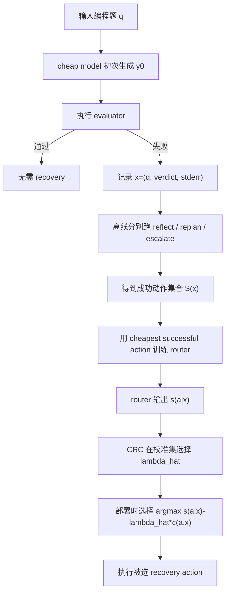

# CodeRescue: Budget-Calibrated Recovery Routing for Coding Agents

## 元信息与 TL;DR

- 原文标题：CodeRescue: Budget-Calibrated Recovery Routing for Coding Agents
- 来源：[arXiv:2607.19338](https://arxiv.org/abs/2607.19338)，v1 提交时间为 2026-07-21 17:56:49 UTC。
- 代码：[Qijia-He/agent-budget-control](https://github.com/Qijia-He/agent-budget-control)，本轮只读 README、目录和脚本，不运行外部项目代码。
- 类型：大模型 Agent / coding agent 成本控制论文与代码项目。
- 作者机构：University of Washington、New York University、ByteDance、Amazon。
- 注意：GitHub README 中 arXiv 链接仍为 `TODO`，BibTeX 年份也写成 2025；本文以 arXiv API 与 PDF 元数据为准。

### TL;DR

- 这篇论文关心的是 coding agent 第一次便宜模型尝试失败以后，系统不应只做“直接升级强模型”的二元 cascade，而应在 **reflect、replan、escalate** 三类恢复动作之间做预算化路由。
- 方法上，作者先用执行 rollout 生成监督标签：对每个失败样本跑三种 recovery action，把能通过测试的动作集合记为 `S(x)`，再用“最便宜且成功的动作”训练 Qwen3.5-4B router。
- 部署时，论文不为每个预算重新训练 router，而是在 router 分数上加成本惩罚 `lambda * cost`，再用 Conformal Risk Control 选择 `lambda`，给平均恢复成本提供边际期望控制。
- 主实验覆盖 APPS、TACO、BigCodeBench、LiveCodeBench、CodeContests 五个 coding benchmark；GPT-5.4-nano 作为 cheap model，GPT-5.4 作为 strong escalation model。
- 关键数字是：GPT 主实验约 27,300 个问题生成 rollout，最终 supervised training split 有 4,656 个样本，CRC 校准集 360 个、测试集 360 个。
- 在 GPT-5.4-nano/GPT-5.4 设置下，always-escalate solve rate 为 0.686、平均恢复成本为 7.22 毫美元；CodeRescue 在 2.56 毫美元 预算点达到 0.717 solve rate，只用 always-escalate 约 35% 成本。
- 不加预算约束的 argmax router 达到 0.817 solve rate、5.51 毫美元，比 always-escalate 更准且更便宜；但 CRC 保证的是成本，不保证 solve rate。
- 局限也明确：它只建模一次 post-failure 决策，不覆盖多轮 agent 恢复；训练标签不是动作成功概率；Gemini 复现实验规模更小；真实 repo-level agent 还会遇到状态污染、测试不完整和上下文压缩问题。

## 研究问题：失败以后，agent 到底该花哪一种钱？

### 论文重新定义了什么问题？

- 常见 cost-aware LLM 系统把问题看成：
  - 先让便宜模型做；
  - 不确定或失败时升级强模型；
  - 目标是在质量和成本之间取折中。

- CodeRescue 指出 coding agent 的失败不同于普通问答失败：
  - 失败会留下可执行反馈，例如 wrong answer、timeout、compile error、stderr、单元测试断言。
  - 这些反馈可能把原问题变成更便宜的“局部修复问题”。
  - 同一个 cheap model 继续调用一次，不一定比强模型差。

- 因此论文研究的问题不是“选弱模型还是强模型”，而是：
  - 当前失败是否局部可修？
  - 是否应该丢掉当前轨迹重新规划？
  - 是否确实体现能力缺口、需要强模型？
  - 在用户预算变化时，同一个 router 能否不重训而切换 operating point？

### 三种恢复动作分别代表什么假设？

| 动作 | 使用模型 | 行为 | 隐含失败诊断 | 成本直觉 |
|---|---:|---|---|---:|
| `reflect` | cheap model | 基于错误轨迹修补原代码 | 当前解法大体可用，只缺边界修正 | 低 |
| `replan` | cheap model | 丢弃原尝试，从新策略生成 | 原路径脆弱，但 cheap model 仍可能从新角度解出 | 低到中 |
| `escalate` | strong model | 强模型基于题目与失败反馈重做 | 失败来自能力、算法或长程规划缺口 | 高 |

- 这个动作集合不是完整 agent taxonomy。
- 它是一个最小的一阶恢复集合：
  - `reflect` 对应局部 debug；
  - `replan` 对应 test-time repeated sampling / fresh plan；
  - `escalate` 对应传统 model cascade。

## 论证路线：claim -> mechanism -> evidence -> boundary

| 层次 | 论文主张 | 机制 | 证据 | 边界 |
|---|---|---|---|---|
| Claim 1 | coding failure 后的最优动作不是单调 cascade | 三动作 recovery routing | 720 个 GPT holdout 失败样本中，cheap-only、both、escalation-only 都大量存在 | 只覆盖三种动作，不覆盖搜索树式 agent |
| Claim 2 | 一个 supervised router 能学到 failure pattern | 用 rollout 的 cheapest-successful-action 做 SFT | Qwen3.5-4B FT argmax solve rate 0.817，高于所有 fixed action 与 prompt-only router | 标签不是概率，且忽略 unsolved 样本训练 |
| Claim 3 | 成本预算可通过校准层后置控制 | `s(a|x) - lambda c(a,x)` 加 CRC | 2.56 毫美元 点达到 0.717 solve，成本是 always-escalate 的 35% | CRC 控成本，不控 solve rate |
| Claim 4 | non-monotone 是真实现象 | TACO difficulty ladder 出现更花钱反而更差 | TACO-Medium 与 TACO-Very-Hard 的 frontier 下降 | 子集样本量较小，仍需更大评估 |

## 方法机制：从失败样本到预算化 router

### 输入、状态与输出

- 每个 router 输入记为：

```text
x = (q, v0, e0)
```

- 变量解释：
  - `q`：problem statement。
  - `v0`：cheap model 初次尝试的执行 verdict，例如 fail、timeout、compile error。
  - `e0`：stderr 或测试失败输出。
  - `A = {reflect, replan, escalate}`：可选恢复动作。
  - `S(x)`：在样本 `x` 上真实能通过 evaluator 的动作集合。

- 重要细节：
  - router 不直接读失败代码 `y0`。
  - 它只读题目、verdict、stderr 和少量 metadata。
  - 这让路由任务更接近部署时轻量决策，而不是完整代码审查。

### 目标函数：预算下最大化 solve rate

论文把理想问题写成：

```text
maximize_pi   E[ 1{ pi(X) in S(X) } ]
subject to   E[ c(pi(X), X) ] <= B
```

- `pi` 是部署策略。
- `c(a, x)` 是动作 `a` 在样本 `x` 上的成本估计。
- `B` 是用户给定的平均恢复预算。
- 这个形式故意不假设动作有单调能力阶梯。

### 训练标签：cheapest successful action

对每个失败样本，作者离线跑三种动作：

```text
S(x) = { a in A | action a passes the evaluator }
a*(x) = argmin_{a in S(x)} c(a, x)
```

- 如果 `S(x)` 为空，样本不用于三分类 router 训练。
- 如果多个动作都成功，标签选最便宜动作。
- 这让 router 学到的不是“哪个动作最像标准答案”，而是“哪个动作在成本下足够好”。

### 部署策略：成本惩罚的动作选择

训练好的 router 给每个动作一个归一化分数 `s_theta(a|x)`：

```text
pi_lambda(x) = argmax_a { s_theta(a|x) - lambda * c(a, x) }
```

- 当 `lambda = 0`：
  - 选择 router 最相信的动作；
  - 得到最高质量倾向的 argmax operating point。

- 当 `lambda` 增大：
  - 高成本动作受到更强惩罚；
  - 策略向 `reflect` / `replan` 倾斜。

### breakpoint：为什么一个 router 能形成前沿？

两个动作 `a` 与 `b` 的切换点为：

```text
lambda_ab(x) = [s_theta(a|x) - s_theta(b|x)] / [c(a,x) - c(b,x)]
```

- 只要在校准集上枚举所有 pairwise breakpoint，就能得到有限的 `lambda` grid。
- 在每个 interval 内，动作选择不变。
- 因此 cost-solve frontier 是离散、分段常数的。

## CRC 校准：论文真正保证了什么？

### 校准规则

对校准集 `x1...xn`，定义某个 `lambda` 下的平均成本：

```text
C_hat_n(lambda) = (1/n) * sum_i c(pi_lambda(x_i), x_i)
```

CRC 选择最小可行惩罚：

```text
lambda_hat = min { lambda_k :
  [ n * C_hat_n(lambda_k) + c_max ] / (n + 1) <= B
}
```

- `c_max` 是 worst-case cost cap。
- 额外的 `c_max` 是 conformal leave-one-out 修正。
- 选最小可行 `lambda`，表示在满足预算时尽量少压制高成本动作。

### 保证的含义

- Theorem 2 给出的保证是：

```text
E[ c(pi_lambda_hat(X_{n+1}), X_{n+1}) ] <= B
```

- 关键边界：
  - 期望是对校准样本和未来样本的 marginal expectation。
  - 不是每一次具体 split 都高概率满足预算。
  - 不是 solve rate 保证。
  - solve rate 的提升完全是经验结果。

- 这点很重要：
  - CRC 是部署成本控制层；
  - 不是 correctness verifier；
  - 它不会证明某个低成本动作能解决问题，只会把平均支出压到预算内。

## 算法流程：从 rollout 到部署



### 伪代码

```text
Input:
  D_train: 离线 recovery rollouts
  D_cal: 校准失败样本
  D_test: 部署或测试样本
  B: 平均恢复预算
  A = {reflect, replan, escalate}

State:
  c(a,x): 每个动作的成本
  S(x): 每个样本上能通过 evaluator 的动作集合
  s_theta(a|x): router 对动作的分数

Training:
  for x in D_train:
    if S(x) is empty:
      skip x
    label(x) = cheapest action in S(x)
  fine-tune router theta on label(x)

Calibration:
  build all positive breakpoints lambda_ab(x) on D_cal
  for lambda in sorted grid:
    compute mean selected cost C_hat_n(lambda)
  choose smallest lambda satisfying conformal budget condition

Deployment:
  for new failed coding task x:
    choose action = argmax_a s_theta(a|x) - lambda_hat * c(a,x)
    run chosen recovery action

Output:
  recovered solution if evaluator passes
  otherwise failed recovery with known cost

Failure boundary:
  if all three actions fail, router cannot solve by selection alone
  if budget is too tight, feasible lambda may force cheap action even when escalation is needed
```

## 实验设置：数据、模型、训练与指标

### 数据与 rollout

| 维度 | 论文设置 |
|---|---|
| Benchmark | APPS、TACO、BigCodeBench、LiveCodeBench、CodeContests |
| cheap model | GPT-5.4-nano |
| strong model | GPT-5.4 |
| 初始问题数 | 约 27,300 |
| 训练样本 | 4,656 个 cheapest-successful-action 样本 |
| CRC 校准集 | 360 个失败问题 |
| 最终测试集 | 360 个失败问题 |
| 训练 router | Qwen3.5-4B full fine-tune |
| 训练配置 | 2 epochs、learning rate 1e-5、cosine decay、10% warmup |

### 评估指标

- solve rate：
  - 如果 router 选的动作属于 `S(x)`，就算成功。
  - 这比 action classification accuracy 更合理，因为多个动作可能都能解出同一题。

- mean recovery cost：
  - 用 API token 成本估算；
  - 单位是 millidollars，即 毫美元。

- CRC frontier：
  - 校准集只用于选 `lambda`；
  - solve rate 与 realized cost 在 disjoint test split 上报告。

## 主结果：三动作 router 为什么比 binary cascade 更强？

### Table 1：固定动作与 prompt-only router

| 方法 | Solve rate | Mean cost |
|---|---:|---:|
| Always-reflect | 0.275 | 1.24 毫美元 |
| Always-replan | 0.453 | 1.59 毫美元 |
| Always-escalate | 0.686 | 7.22 毫美元 |
| Random | 0.397 | 3.34 毫美元 |
| Qwen3.5-4B FT argmax | 0.817 | 5.51 毫美元 |

- 固定动作说明：
  - 只 reflect 太弱，很多失败不是局部 bug。
  - 只 replan 好一些，但仍低于 escalation。
  - 只 escalate 成本高，且 solve rate 也只有 0.686。
  - learned router 同时超过 always-escalate 的 solve rate 和成本。

| Prompt-only router | Solve rate | Total cost |
|---|---:|---:|
| Claude Sonnet 4.6 | 0.453 | 6.67 毫美元 |
| Gemini 3.1 Pro | 0.367 | 5.58 毫美元 |
| GPT-5.4-nano | 0.331 | 1.53 毫美元 |
| GPT-5.4 | 0.328 | 3.87 毫美元 |
| Qwen3.5-4B FT | 0.817 | 5.51 毫美元 local |

- 这说明：
  - 直接把动作说明丢给通用 LLM，并不能可靠学会恢复路由。
  - 关键监督信号来自 execution rollout，而不是 prompt 描述。

### Figure 2：成功动作集合不是单调阶梯

论文在 720 个 GPT holdout 失败样本上统计 `S(x)`：

| 成功动作结构 | 比例 | 解释 |
|---|---:|---|
| cheap-only | 28% | 便宜模型恢复能解，升级未必更好或不划算 |
| both | 27% | cheap recovery 与 escalation 都能解，成本决定策略 |
| escalation-only | 45% | 需要强模型能力 |

- 这张图是全文最关键的经验观察之一。
- 如果大多数样本都是 escalation-only，二元 cascade 足够。
- 如果 cheap-only 与 both 大量存在，直接升级就浪费预算。
- BigCodeBench 被 cheap-only 主导，oracle routing 成本从 7.6 毫美元 降到 0.7 毫美元。

### Figure 3：CRC frontier 的主结论

| Operating point | Solve rate | Mean cost | 解释 |
|---|---:|---:|---|
| Always-replan | 0.453 | 1.59 毫美元 | 便宜但质量低 |
| CRC 低预算起点 | 0.486 | 1.43 毫美元 | 比 always-replan 更便宜且更准 |
| Binary cascade | 0.636 | 约 2.56 毫美元 | 二元 cheap/strong baseline |
| CRC 中预算点 | 0.717 | 2.56 毫美元 | 超过 binary cascade 与 always-escalate |
| Always-escalate | 0.686 | 7.22 毫美元 | 高成本但不最高质量 |
| Argmax router | 0.817 | 5.51 毫美元 | 最高质量点 |

- 最值得带走的数字：
  - `0.717 solve / 2.56 毫美元`；
  - 超过 always-escalate 的 `0.686 solve`；
  - 成本只有 always-escalate 的 `35%`。

- 这不是单纯省钱：
  - 它还更准；
  - 原因是 escalation 不是严格支配 cheap recovery。

## 消融：router 到底学到了什么？

### Table 2：metadata、标签和 backbone

| 数据配方 | 无 metadata | 有 metadata |
|---|---:|---:|
| hard cheapest-action label | 0.656 | 0.697 |
| soft weighted copies | 0.661 | 0.653 |

- metadata prefix 有帮助：
  - source、difficulty、algorithm tag 给出分布线索；
  - 对 wrong-output 类失败尤其重要。

- soft label 没有带来提升：
  - 论文的 soft labels 是对同一问题按 action outcome 复制加权；
  - 在这个设置下不如直接用 cheapest-successful hard label。

| Backbone / fine-tuning | LoRA | Full FT |
|---|---:|---:|
| Qwen3-4B | 0.594 | 0.644 |
| Qwen3-8B | 0.639 | 0.672 |
| Qwen3.5-4B | 0.697 | 0.700 |

- Qwen3.5-4B 是最强 backbone。
- Full FT 对 Qwen3-4B 提升更明显。
- Qwen3.5-4B 上 LoRA 与 Full FT 接近，但论文选择 Full FT 作为主配置。

## 跨模型检查：Gemini 设置说明了什么？

### Appendix C 的结果

| Gemini 设置 | Solve rate | Mean cost |
|---|---:|---:|
| Always-reflect | 0.760 | 25.9 毫美元 |
| Always-replan | 0.651 | 37.2 毫美元 |
| Always-escalate | 0.821 | 168.2 毫美元 |
| CRC low-cost point | 0.760 | 25.4 毫美元 |
| Argmax router | 0.795 | 34.9 毫美元 |

- 设置：
  - cheap model 是 Gemini-2.5-Flash；
  - strong model 是 Gemini-2.5-Pro；
  - router training 有 683 个样本；
  - calibration/test 分别是 227 / 229 个样本。

- 解读：
  - Gemini 结果不是主 benchmark，规模明显更小。
  - 但它支持一个较弱结论：recovery routing 框架不只适用于 GPT 模型对。
  - 这里 argmax router 没超过 always-escalate 的 solve rate，但成本从 168.2 毫美元 降到 34.9 毫美元，降幅非常大。

## Figure 4：为什么“多花钱”有时会变差？

### TACO difficulty ladder 的 non-monotone 证据

- 论文在 TACO 四个难度层上画 CRC frontier。
- TACO-Med-Hard 与 TACO-Hard：
  - frontier 大体单调；
  - 花更多钱升级，solve rate 提升。

- TACO-Medium 与 TACO-Very-Hard：
  - frontier 出现下降；
  - 更低成本 operating point 反而 solve rate 更高。

### 这对 agent 系统有什么意义？

- 中等难度：
  - strong model 未必比 cheap model 更可靠；
  - cheap model 根据执行反馈修一次，可能正好命中边界 bug。

- 极难难度：
  - cheap 与 strong 都难以解决；
  - escalation 只是花钱，并不产生质量增益。

- 因此，二元 cascade 的“强模型更贵也更强”假设在 coding recovery 中不稳定。

## 代码项目：工程结构与可复现边界

### 仓库结构

| 路径 | 作用 |
|---|---|
| `data_generation/agents/code_agent.py` | 定义 propose、reflect、replan、escalate 的 code-writing agent 行为 |
| `data_generation/benchmarks/code_env.py` | benchmark 执行环境与代码运行包装 |
| `data_generation/core/pricing.py` | token 与动作成本计算 |
| `data_generation/scripts/build_sft_router_v1.py` | 构造 hard-label router SFT 数据 |
| `data_generation/scripts/build_soft_label_dataset.py` | 构造 soft-label ablation 数据 |
| `sft_runs/qwen35_4b_full.yaml` | 主 router 的 Qwen3.5-4B full fine-tune 配置 |
| `conformal/scripts/attach_usd_costs.py` | 给 eval JSON 补 per-example USD action cost |
| `conformal/scripts/crc_on_holdout_usd.py` | 计算 lambda breakpoints、预算点与测试结果 |
| `conformal/data/action_costs_usd.json` | 动作成本表 |

### 代码细节值得注意

- `code_agent.py` 中的动作不是抽象标签，而是具体 prompt 行为：
  - `REFLECT_SYSTEM` 要求基于原题、之前代码和测试错误修 bug。
  - `REPLAN_SYSTEM` 要求从根本不同的 approach 重启。
  - `ESCALATE_CONTEXT_SYSTEM` 要求强模型从头解决，但利用弱模型失败 trace 避免同错。

- 项目有 parse retry：
  - 如果 LLM 输出不含可识别 Python code，会提高 temperature 再试一次。
  - 仍失败时保留 raw text，并由调用方用 metadata 标 verdict。

- `crc_on_holdout_usd.py` 的实际代码采用 Hoeffding-style `eps_cost` 做预算可行性检查。
- 论文正文给的是 CRC leave-one-out 形式；代码脚本是工程版 holdout 评估实现，两者都服务于部署成本控制。

## 失败案例与证据边界

### 论文已承认的局限

- 单步恢复：
  - 只在 cheap model 第一次失败后选一次动作；
  - 真实 coding agent 常常会多轮修改、回滚、查文档、跑更细测试。

- 标签代理：
  - cheapest-successful-action 是训练标签；
  - 它不是每个动作成功概率的校准估计。

- CRC 控成本，不控质量：
  - `E[cost] <= B` 是校准目标；
  - solve rate 的上升来自经验数据，不能由 conformal theory 保证。

- 输入信息受限：
  - router 不读失败代码；
  - 这简化了部署，也可能丢失关键诊断信息。

- benchmark 边界：
  - 五个 benchmark 仍以自动判题为核心；
  - 与大型仓库 issue、依赖冲突、长上下文状态管理仍有距离。

### 我会额外保留的怀疑

- 成本模型依赖 provider token pricing。
  - 如果 strong model 价格变化，frontier 位置会变化。
  - 但“动作非单调”这个结构性观察不完全依赖价格。

- router 本身是 local Qwen3.5-4B FT。
  - 论文把 router call 视为 local 成本；
  - 如果部署方也要为 router 付 API 成本，预算曲线会右移。

- `reflect` 与 `replan` 的边界依赖 prompt 设计。
  - 更强的 replan prompt、更多采样或 self-consistency 可能改变 cheap-only 比例。
  - 这会影响训练标签分布。

- 没有展示真实 IDE/agent 产品中的用户交互。
  - 比如人类是否允许再次运行测试；
  - 是否有安全沙箱限制；
  - 是否允许读取完整 repo；
  - 这些都会改变 recovery action 的成本和风险。

### 失败类型应如何被更细地建模？

- 论文把 verdict 作为 router 输入，但没有把失败类型扩展成显式状态机。
- 对真实 coding agent，更细粒度状态很重要：
  - `syntax_error` 通常更适合 reflect；
  - `single_hidden_edge_case` 可能适合 reflect 或补测试；
  - `timeout` 往往提示复杂度错误，可能需要 replan；
  - `wrong_answer_many_cases` 可能表示算法理解错误；
  - `dependency_error` 可能不是模型能力问题，而是环境或安装问题；
  - `flaky_test` 需要先重复验证，而不是立刻改代码。

- 如果把这些状态显式化，controller 可以先做诊断：

```text
diagnosis = classify_failure(verdict, stderr, test_scope, diff)
action = route(diagnosis, budget, history)
```

- 这会带来两个好处：
  - router 的输入更接近工程事实；
  - 预算策略可以区分“值得花模型钱”和“应该先花测试钱”。

### 为什么不能只依赖 solve rate？

- solve rate 是必要指标，但不是充分指标。
- coding agent 的恢复动作还会影响：
  - diff 体积；
  - patch 可读性；
  - 是否改动公共接口；
  - 是否绕过测试而非修复问题；
  - 是否引入性能退化；
  - 是否增加依赖或网络访问；
  - 是否污染仓库状态。

- always-escalate 即使通过更多测试，也可能生成更大、更难 review 的 patch。
- reflect 即使成本低，也可能在错误路径上做局部补丁，留下隐蔽技术债。
- 因此下一代评测应把 recovery outcome 拆成多列：

| 指标 | 问题 | 可能的测量 |
|---|---|---|
| Correctness | patch 是否通过目标测试 | hidden tests、public tests、regression suite |
| Maintainability | 代码是否可读 | diff size、complexity、lint |
| Locality | 是否只改相关区域 | touched files、API surface |
| Safety | 是否越权或引入依赖 | command log、dependency diff |
| Cost | 花了多少钱 | model tokens、runtime、test time |
| Latency | 用户等多久 | wall-clock、queue time |

### 单步路由到多步策略的缺口

- CodeRescue 的动作选择是一次性的。
- 真实 agent 常见流程更像：

```text
fail -> inspect -> reflect -> test -> fail -> replan -> test -> partial -> escalate -> review
```

- 这时预算约束也变成序列问题：

```text
sum_t c(a_t, state_t) <= B
```

- 多步情况下，最便宜的成功动作未必是全局最优。
- 例子：
  - 第一步 cheap reflect 很便宜，但会消耗上下文并让错误方向更深；
  - 直接 replan 稍贵，却减少后续循环；
  - 先写一个定向测试可能不产出解，但能让后续 reflect 更可靠。

- 因此，多轮 CodeRescue 需要估计的是 action 的长期价值：

```text
Q(state, action) = expected_solve_gain - alpha * expected_cost - beta * expected_risk
```

- 这会把问题从三分类 router 推向预算约束下的 agent policy learning。

## 复现实验时应检查哪些环节？

### 1. rollout 数据是否覆盖失败分布？

- 论文尝试约 27,300 个问题，但 router 训练只用 4,656 个可由至少一种动作恢复的样本。
- 这意味着训练分布排除了所有三种动作都失败的样本。
- 如果部署时 unsolved 样本比例更高，router 仍会选一个动作，但系统需要知道：
  - 这是可恢复失败；
  - 还是三种动作都大概率无效；
  - 是否应该停止或请求人类介入。

### 2. action cost 是否按样本估算？

- 仓库的 `attach_usd_costs.py` 会按 problem id 补 per-action USD cost。
- 如果没有 exact row，会退回 dataset-level mean。
- 这在工程上合理，但会引入估算噪声。

- 复现时应该报告：
  - exact cost 覆盖率；
  - imputed cost 比例；
  - provider pricing 日期；
  - 输入输出 token 分布；
  - 测试执行成本是否计入。

### 3. router 输入是否泄漏 benchmark metadata？

- 论文发现 metadata prefix 提升明显。
- 这说明 source、difficulty、algorithm tag 对路由有用。
- 但如果真实部署没有这些字段，性能可能下降。

- 更稳妥的做法是做三组评估：
  - 有完整 metadata；
  - 只有题目与 stderr；
  - 用模型自动推断 difficulty 和 failure type。

### 4. prompt-only router 为什么弱？

- prompt-only router 看到动作说明，却不知道 rollout 经验。
- 它可能根据语言直觉判断：
  - timeout 就升级；
  - assertion error 就 reflect；
  - hard tag 就 escalate。

- 但论文证据显示，真实成功集合不是这样简单。
- 这支持一个更一般的结论：
  - agent controller 不应只靠手写启发式；
  - 它需要从执行结果中学习。

## 安全视角：预算路由也会改变风险

### 为什么这篇 agent 论文也相关于 AI safety？

- coding agent 的 recovery action 不只是成本选择。
- 它还改变系统暴露面：
  - reflect 可能频繁执行测试和 shell 命令；
  - replan 可能生成更大 patch；
  - escalate 会把更多上下文发给强模型或远端 provider；
  - 多轮恢复会增加工具调用和仓库状态漂移。

- 如果 controller 只优化 solve/cost，可能忽略风险成本。
- 更安全的形式应把风险作为约束：

```text
maximize solve_rate
subject to
  E[token_cost] <= B_token
  E[runtime_cost] <= B_time
  P(secret_exposure) <= epsilon
  P(unsafe_command) <= rho
```

- 这里的 `secret_exposure` 和 `unsafe_command` 不是论文实验内容。
- 它们是把 CodeRescue 控制框架迁移到真实 coding agent 时必须补上的安全变量。

### controller 应该记录哪些审计字段？

- 每次 recovery route 至少应记录：
  - 原始 verdict；
  - stderr 摘要；
  - 选中的 action；
  - router 分数；
  - `lambda`；
  - cost estimate；
  - 实际 token cost；
  - 是否通过测试；
  - diff size；
  - 是否触发安全策略。

- 这些字段能支持两类后续工作：
  - 训练更好的 router；
  - 发现某个 action 在特定仓库或语言里经常引入风险。

### 与 AI control 的连接

- CodeRescue 关心的是可信度与成本。
- AI control 关心的是不可信 agent 的行为是否会越界。
- 两者可以合并成一个控制器：

```text
route = argmax utility(action)
       - lambda_cost * cost(action)
       - lambda_risk * risk(action)
```

- 对高风险仓库，controller 可以更保守：
  - 先 inspect；
  - 限制 shell；
  - 优先小 diff reflect；
  - 升级前脱敏上下文；
  - 对大 patch 强制人类 review。

- 对低风险 benchmark，controller 可以更激进：
  - 多次 cheap replan；
  - 直接 strong escalation；
  - 更少人工中断。

## 对论文图表的逐项证据解读

### Figure 1：它不是一个“模型选择器”，而是恢复控制器

- 图 1 的核心流程是：
  - cheap initial attempt；
  - executor 给出失败反馈；
  - router 基于反馈选动作；
  - CRC 把预算 `B` 映射为成本惩罚 `lambda`；
  - recovered solution 再执行。

- 这张图支撑的是方法定义，不是实验结论。
- 它说明 CodeRescue 的控制点位于失败之后，而不是生成之前。

### Figure 2：动作集合的互补性

- Figure 2 左图展示 `S(x)` 分布。
- 关键不是某个 benchmark 的单点数字，而是三种结构都大量存在：
  - cheap-only；
  - both；
  - escalation-only。

- 这直接反驳“失败就升级”的单调假设。
- 如果没有这张图，CRC frontier 的优势可能只是 router 训练技巧。

### Figure 3：预算前沿

- Figure 3 把所有 operating point 放到 cost-solve 平面。
- 它展示三个层次：
  - fixed-action 是几个离散点；
  - binary cascade 是一条较弱基线；
  - CRC frontier 是同一个 router 在不同预算下的可选前沿。

- 论文最强的工程结论来自这里：
  - 中预算区间最有价值；
  - 继续加钱到 argmax 有收益，但边际收益变小。

### Figure 4：non-monotone 子分布

- Figure 4 的价值在于提醒读者：
  - aggregate frontier 看起来合理；
  - 子 benchmark 上可能出现升级反效果。

- 这对部署很重要。
- 如果一个企业代码库更像 TACO-Very-Hard 子分布，强模型调用可能只是增加成本。
- 如果一个代码库更像 TACO-Hard，升级更可能带来收益。

## 与相关工作的定位

### 它不是普通 model router

- FrugalGPT、RouteLLM、HybridLLM 等主要在输入前或回答后选择模型。
- CodeRescue 把路由点放在“执行失败以后”。
- 这使错误 trace 成为一等输入，而不是事后日志。

### 它不是普通 self-debugging

- Self-Debugging、LDB、Reflexion 证明反馈能帮助修复。
- CodeRescue 关心的是是否应该修复、重写或升级。
- 换句话说，它研究的是 recovery controller，而不只是 recovery skill。

### 它与 agent post-training 的关系

- 论文没有训练一个更会写代码的 base agent。
- 它训练的是一个轻量 controller：
  - 观察失败上下文；
  - 选择后续动作；
  - 用校准层适配预算。

- 这对 agent 系统很关键：
  - 能力增长不一定只来自 base model；
  - 也可以来自失败后的动作调度、状态管理和预算控制。

## 对 coding agent 系统的启发

### 1. 失败不是终态，而是状态转移

- 一个 coding agent 的控制循环可以写成：

```text
state_t = {
  task,
  current_patch,
  tests,
  verdict,
  stderr,
  budget_remaining,
  action_history
}

next_action = controller(state_t)
```

- CodeRescue 只用了 `q, v0, e0`。
- 更完整系统可以加入：
  - diff size；
  - touched files；
  - test type；
  - error locality；
  - previous actions；
  - sandbox time；
  - user risk level。

### 2. controller 与 generator 应该分层

- generator 负责写代码。
- controller 负责决定：
  - 继续修；
  - 从头来；
  - 强模型介入；
  - 请求用户澄清；
  - 扩展测试；
  - 停止以免烧预算。

- CodeRescue 的价值是把这个 controller 问题变成可训练、可校准、可评估的对象。

### 3. 预算不应只控制总 token

- 更好的预算控制应区分：
  - router cost；
  - cheap recovery cost；
  - strong escalation cost；
  - test execution cost；
  - wall-clock latency；
  - sandbox risk。

- CRC 现在控制的是平均恢复 API cost。
- 未来可以扩展到多目标：

```text
E[cost] <= B_cost
E[latency] <= B_time
P(risky_command) <= B_risk
```

### 4. non-monotone frontier 是 agent 评测必须记录的现象

- 如果只报告 best solve rate，会看不见哪些预算点更优。
- 如果只报告 cost，会看不见升级何时反而损害质量。
- 对 agent 系统，应该记录完整 frontier：
  - solve；
  - cost；
  - latency；
  - rollback rate；
  - failed-test residue；
  - human intervention rate。

## 结论与继续追问

### 核心判断

- CodeRescue 的核心贡献不是发明了 reflect 或 replan。
- 它把 coding agent 的失败恢复从经验策略推进到一个可训练 controller：
  - 用 execution rollout 提供监督；
  - 用三动作 action space 表达 post-failure 选择；
  - 用 CRC 把部署预算变成可后置调节的成本旋钮。

### 最强证据

- GPT 主实验中，0.717 solve rate / 2.56 毫美元 的 CRC 点同时超过：
  - always-escalate 的 0.686 solve rate；
  - binary cascade 的 0.636 solve rate；
  - always-replan 的 0.453 solve rate。

- 720 个 holdout 样本里，28% cheap-only、27% both、45% escalation-only，直接支持“非单调恢复动作集合”。

### 仍需继续验证

- 多轮 recovery：
  - 如果允许 reflect -> test -> replan -> test -> escalate，CRC 需要扩展成序列决策。

- repo-level tasks：
  - SWE-bench 风格任务中的失败可能包含环境、依赖、隐藏测试和 patch interaction。

- 真实成本：
  - 运行测试、安装依赖、容器时间和人类 review 都应进入 cost。

- 安全边界：
  - recovery action 可能引入更大 diff 或更危险命令；
  - controller 不应只看 solve/cost，还要看权限和变更风险。

- 可复现性：
  - 仓库已经公开 pipeline 与配置；
  - 但完整 rollout 数据、API 输出和精确 provider 价格仍会影响复现实验。

### 研究者视角的延伸

- 如果把 coding agent 看成一个闭环控制系统，CodeRescue 相当于给失败态增加了一个 budget-aware transition policy。
- 下一步最值得做的是把 `A={reflect,replan,escalate}` 扩成更真实的 agent action set：
  - write tests；
  - inspect logs；
  - narrow diff；
  - ask user；
  - retrieve docs；
  - run static analysis；
  - rollback and branch。

- 但扩展动作集合以后，监督标签会更难：
  - cheapest successful action 不一定足够；
  - 需要考虑组合动作和长期收益；
  - 也需要区分“短期通过测试”和“长期维护风险”。

- 这篇文章的价值在于给了一个可落地基线：
  - 先从失败样本收集 action outcome；
  - 再训练 controller；
  - 最后用校准层把预算从训练中解耦。

- 对所有自动化软件工程 agent 来说，这比“失败就升级模型”更接近真实系统工程。
