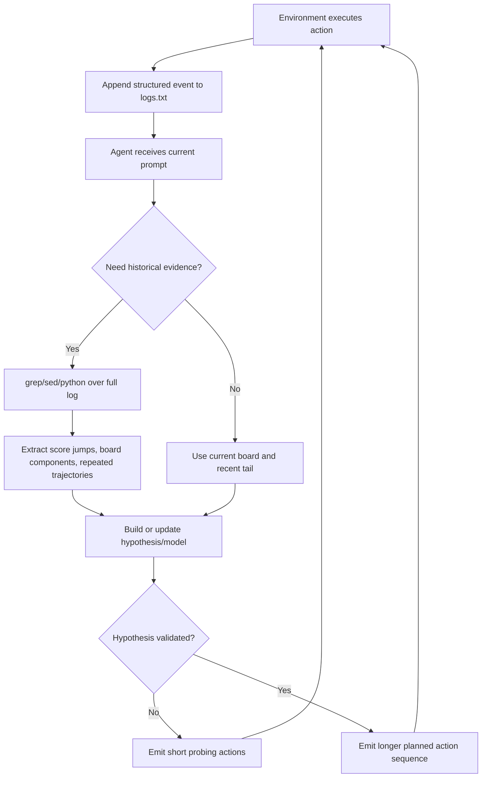

# PRO-LONG：把长程 Agent 记忆从“摘要选择”改成“可编程日志检索”

### 元信息

| 字段 | 内容 |
|---|---|
| 论文 | PRO-LONG: Programmatic Memory Enables Long-Horizon Reasoning |
| 类型 | 论文，Agent 系统与长程上下文管理 |
| 作者 | Alexis Fox, Junlin Wang, Paul Rosu, Bhuwan Dhingra |
| 时间 | arXiv v1：2026-07-22 |
| 原文 | https://arxiv.org/abs/2607.20064 |
| 核心任务 | ARC-AGI-3 公开 25 个交互式游戏，每局默认 500 action budget |
| 主张 | 对长程探索型 Agent，先完整记录轨迹，再让 coding agent 用 grep/python/bash 搜索日志，比提前压缩成摘要更稳 |
| 复现边界 | 论文给出 GitHub 链接，但本轮访问 `https://github.com/alexisfox7/PRO-LONG` 返回 404；本文以 arXiv PDF/TeX 源为证据，不假设仓库内容可用 |

### TL;DR

- **PRO-LONG 解决的问题**：长程 Agent 会在几百步探索里反复遇到“现在看不重要、后来才关键”的状态变化；如果只把历史压缩成摘要或少量记忆条目，写入阶段的筛选错误会在后续规划里放大。
- **核心方法**：harness 不提前判断什么值得记，而是把每次 action、分数、level、attempt、计划摘要和环境 board 全量追加到 `logs.txt`；Agent 的 read 操作由 `read/grep/bash/python` 完成，等到需要时再编程检索轨迹。
- **关键机制**：论文把 Agent 上下文分成 **accessed context** 与 **accessible context**。前者是当前 prompt 中约 100k 到 1M tokens，后者是工具可达的 10M+ tokens 日志；PRO-LONG 把后者变成可搜索的 ground-truth 轨迹。
- **实验结论**：在 ARC-AGI-3 公共 25 个游戏上，PRO-LONG 相比 no-log coding agent 平均提升 18.0 个百分点；GPT-5.5 达到 41.2 pass@1 与 60.1 best@5，Opus 4.6 达到 42.4 pass@1，Fable 5 在 2,000 action 预算下达到 97.4 best@2。
- **成本结论**：与同模型族最强 prior harness 对比，PRO-LONG 在 Claude Code/Codex 上用 4.2 到 5.8 倍更少 billed tokens，仍保持在最强 prior 的 2 到 4 分内；Fable 5 的 97.4 best@2 总成本约 1,750 美元。
- **消融证据**：工具阶梯从 read-only 的 23.1 提升到 read+grep 的 27.2，再到 read+grep+python 的 38.3，最后加 write/edit 到 41.2；说明收益主要来自程序化检索和分析，而不是额外写笔记。
- **局限**：ARC-AGI-3 是长程、可重置、可程序化观察的网格游戏；结论不直接证明所有浏览器、企业工作流或真实代码维护 Agent 都应无条件保留完整日志。论文还承认 run-to-run 方差较大，best@k 与 pass@1 的差距本身是未解决问题。

### 研究问题：为什么“记忆写入策略”是长程 Agent 的瓶颈？

论文的切入点不是再发明一个复杂多 Agent harness，而是追问一个更底层的问题：

- 当 Agent 需要连续探索数百步时，历史信息如何进入后续决策？
- 如果只保存摘要、embedding、技能条目或手写 notes，哪些信息会在写入阶段被丢弃？
- coding agent 已经具备文件读写、grep、bash、python 能力，是否可以把“长上下文处理”外包给工具，而不是强迫模型一次性读完上下文？

这篇论文把记忆系统拆成两个动作：

| 动作 | 传统做法 | PRO-LONG 做法 | 关键差异 |
|---|---|---|---|
| `write` | 摘要、embedding、scratchpad、技能库、人工设计状态 | 每次环境输出都追加到结构化日志 | 写入阶段不做筛选，减少 hindsight loss |
| `read` | 检索摘要、加载记忆块、恢复上下文片段 | 用 grep/python/bash/search over log | 把相关性判断延迟到真正需要时 |
| 失败模式 | 摘要遗漏后来才关键的线索 | 日志过大但可用程序处理 | 从“信息缺失”换成“检索能力与成本”问题 |

这也是论文题目里 programmatic memory 的含义：

> 不是让模型“记住更多自然语言摘要”，而是让 Agent 把环境轨迹写成可计算对象，再用代码重新读取。

### 论文主张与论证路线

作者的论证路线可以压缩成四步：

| 层次 | Claim | Mechanism | Evidence | Boundary |
|---|---|---|---|---|
| 问题定义 | 长程 Agent 的上下文瓶颈来自 accessed/accesssible 信息错配 | 当前 prompt 有窗口和退化问题，外部记忆需要读写协议 | ARC-AGI-3 中每局可有数百 action 与 64x64 board | 不覆盖所有开放世界任务 |
| 方法设计 | append-all log 比提前摘要更适合 hindsight-heavy 探索 | 每步把 action、score、board、计划写入 `logs.txt` | Figure 1 展示 10M+ accessible context 与工具读写 | 日志可搜索性依赖结构化格式 |
| 性能结果 | 最小 harness 可接近或超过专用 harness | coding agent 自己用 grep/python 建模、回放、搜索 | 25 个 ARC-AGI-3 游戏；15.7 到 21.0 pp 提升 | prior harness 的选择程序和 replicate 不总是公开 |
| 机制归因 | 收益主要来自程序化读取，而非 workspace 写 notes | read→grep→python 工具阶梯逐步提升 | Table 1/2/3 消融、m0r0/g50t 案例 | best@k 方差仍明显 |

### Figure 1：PRO-LONG 的系统结构


图 1 最重要的不是“多了一个日志文件”，而是三类边界被画清楚：

- **模型实际看到的上下文**：Agent 当前轮只访问 prompt、近期工具输出、若干 frame diff、BFS 结果等，规模约 100k 到 1M tokens。
- **工具可达的上下文**：完整 `log.txt` 可以超过 10M tokens，不进入一次模型调用，但可以被 `read/grep/bash/python` 查询。
- **环境写入接口**：harness 在每次 action 后写入结构化记录；这让日志不是自由散文，而是可以被脚本稳定解析的事件流。

论文中的 `PRO-LONG` prompt 很短，核心指令可以概括为：

```text
Input:
  logs.txt: action headers, tool calls, board states, prior analyses
  actions available for the current game

State:
  current score, level, attempt, action number
  full historical board trajectory in structured log form
  persisted workspace files, if any

Loop:
  1. Parse recent log tail for immediate state.
  2. Search older log segments for score transitions or repeated board patterns.
  3. Use code to identify components, infer transition rules, or test hypotheses.
  4. Write actions.json with 1 to N candidate actions.
  5. Environment executes actions and appends results back to logs.txt.

Output:
  actions.json

Failure boundary:
  If the hypothesis is untested, emit short action lists.
  If the sequence is validated, scale toward the action cap.
```

这里的设计有一个容易被低估的点：

- PRO-LONG 没有要求模型必须写“世界模型”。
- 但当日志足够完整、工具足够程序化时，模型会自己写解析器、回放器或搜索器。
- 因此论文把“世界模型”从硬编码 harness 目标降级为一种自然涌现的工具使用策略。

### 方法机制：append-all write 与 code-based read

PRO-LONG 的 `write` 很保守：

- 每个 action 后追加一条 header。
- header 包含 action number、level、attempt、score 等可检索字段。
- 后面接 Agent 的计划摘要、实际 action、环境返回 board。
- 对动画帧，日志区分 frame 与 settled state，减少把中间动画误当成真实状态的风险。

PRO-LONG 的 `read` 则很激进：

- 允许 `grep` 找所有分数变化。
- 允许 `sed/awk/wc` 定位长日志中的局部片段。
- 允许 `python` 解析 64x64 board、连通域、颜色、坐标、路径。
- 允许写验证脚本，例如回放 `log.txt` 并检查自建 transition model 是否预测 board。

可以用一个简单公式理解它的设计：

```math
Memory = Accessible(Log_1 ... Log_T)
Context_t = Prompt_t + ToolRead(Log, Query_t)
```

变量解释：

| 变量 | 含义 |
|---|---|
| `Log_t` | 第 t 步之后追加的结构化环境记录 |
| `Accessible` | 不进入当前上下文、但可被工具读取的外部状态 |
| `Query_t` | Agent 在第 t 轮生成的程序化检索动作 |
| `Context_t` | 当前真正进入模型推理的上下文 |

这与摘要式记忆的区别是：

```math
Summary_t = Compress(Summary_{t-1}, Observation_t)
```

摘要式写法在每一步都要选择保留什么；PRO-LONG 把选择延迟到 read time：

```math
Relevant_t = ProgrammaticSearch(Log_{1:T}, Need_t)
```

因此它牺牲的是日志体积与检索成本，换来的是信息保真。

### ARC-AGI-3 设置：为什么它适合检验长程记忆？

ARC-AGI-3 不是静态输入输出 puzzle，而是 25 个交互式环境：

- 每个环境有 6 到 10 个难度递增的 level。
- 游戏规则不提前公开，Agent 必须通过行动观察规则。
- board 是 64x64 pixel grid，非视觉设置下转换为文本网格。
- 默认 action budget 是每局 500，每轮最多输出 20 个 actions。
- 动作包括四向移动、点击坐标、交互、undo、reset。

这个设置让“历史”变得有价值：

- 如果某个按钮只在第 30 步以后显现效果，当前 board 可能不足以解释因果。
- 如果 rewind 会产生重复前序路径的 ghost，后续规划必须引用过去 action 序列。
- 如果 later level 引入新机制，先前 level 的失败轨迹可能成为调试证据。

论文采用 ARC-AGI-3 标准的 RHAE 分数。核心 per-level 形式如下：

```math
S_{l,e} = min((h_{l,e} / a_{l,e})^2, 1.15)
```

变量解释：

| 符号 | 含义 |
|---|---|
| `S_{l,e}` | 环境 e 中 level l 的相对人类动作效率分数 |
| `h_{l,e}` | 该 level 的 upper-median human action baseline |
| `a_{l,e}` | Agent 完成该 level 使用的 action 数 |
| `1.15` | 上限，动作少于人类 baseline 时最多给 115% |

整体 benchmark 分数再对 level 加权并对 25 个环境求平均：

```math
T = (1 / |D|) * sum_{e in D} [ sum_l l*S_{l,e} / (n(n+1)/2) ]
```

这个指标把后面更难的 level 权重提高，因此只会过前几关但无法利用长程探索的 Agent 会被拉开。

### Baselines：它不是在和弱 Agent 比

论文对比的 baseline 分两类：

| Baseline | 模型/系统 | 核心特征 | 与 PRO-LONG 的差异 |
|---|---|---|---|
| No-Log coding agent | GPT-5.5 / Opus 4.6 / Fable 5 | 有标准 coding tools，但无完整外部 log | 依赖 prompt history 与 workspace notes |
| WorldModeler | Codex + GPT-5.5 | 约 600 行 prompt，要求维护 Python simulator，并有 helper/subagents | 更重、更定制，且使用 vision |
| Schema | Claude Code + Opus/Fable | 通过 MCP 提供 12 个 custom tools，维护 `step(grid, action)` | 明确把世界模型和 backtest 做成工具 |
| Arcgentica | custom SDK + Opus 4.6 | orchestrator + Explorer/Theorist/Tester/Solver 多 Agent | 共享 hypothesis memory database |

这组对比说明：

- PRO-LONG 不是与“裸 LLM”比，而是与已经有 coding tools 的强 Agent 比。
- 它的 novelty 不在任务求解算法，而在上下文管理协议。
- 如果最小 append-only log 能逼近定制世界模型 harness，就说明一部分长程能力来自信息可达性，而不是复杂 orchestrator 本身。

### Figure 2：主结果与成本


Figure 2 给出两个互补证据：

- 左图看 ARC score：PRO-LONG 在 GPT-5.5、Opus 4.6、Fable 5 上都明显超过 No-Log。
- 右图看 billed tokens/game：PRO-LONG 更便宜地接近或超过 strongest prior。

关键数字如下：

| 设置 | PRO-LONG | 对照 | 解释 |
|---|---:|---:|---|
| 平均提升 | +18.0 pp | No-Log coding agent | 跨 frontier models 的平均 pass@1 提升 |
| GPT-5.5 pass@1 | 41.2 | WorldModeler 45.1 | 低 3.9 分，但 token 少 5.8 倍 |
| GPT-5.5 best@5 | 60.1 | WorldModeler pass@1 45.1 | 重复运行后超过 prior 单次结果 |
| Opus 4.6 pass@1 | 42.4 | Arcgentica 39.0 | 高 3 分 |
| Fable 5 pass@1 | 76.1 | No-Log 60.4 | 强模型下仍有显著 harness 收益 |
| Fable 5 best@2 | 82.1 | Schema best@2 84.4 | 接近强定制 harness，但 token 少 4.2 倍 |
| Fable 5 2,000 actions best@2 | 97.4 | Schema retained best@2 99.0 | 总成本 1,750 美元，对方 retained logs 计 6,447 美元 |

这里最有研究价值的是“成本-性能前沿”：

- 如果只看最高分，Schema/Fable retained best run 仍更高。
- 如果看 matched 500 action budget 与 billed tokens，PRO-LONG 的前沿更靠左。
- 如果看 agent-system 设计，它把复杂性从 custom tools/subagents 移到通用日志协议。

### 消融一：工具阶梯说明收益来自程序化读取

论文的 Table 1 是最直接的机制证据：

| Tools enabled | GPT-5.5 score |
|---|---:|
| Read only | 23.1 |
| Read + grep/regex search | 27.2 |
| Read + grep + python | 38.3 |
| Read + grep + python + write/edit | 41.2 |

这张表支持三点判断：

- **只读完整日志不够**：23.1 说明 log 不是魔法，模型如果只能顺序读，仍会被规模限制。
- **grep 是第一层收益**：27.2 说明分数变化、level header、动作片段这类结构化字段已经可用。
- **python 是主跃迁**：38.3 说明真正的长程能力来自把 board 和 trajectory 当数据处理。
- **write/edit 边际较小**：38.3 到 41.2 的提升有用，但不是核心来源。

这对 Agent 框架设计有现实意义：

- 与其先发明复杂记忆压缩器，不如先让日志字段稳定、可 grep、可 replay。
- 与其让模型自己维护散乱 notes，不如保证环境事件流能被脚本复现。
- 与其把所有历史塞回 prompt，不如给 Agent 足够可靠的 query surface。

### 消融二：workspace persistence 不是主因

Table 2 排除了一个常见反驳：

| Workspace 设置 | PRO-LONG | No-Log |
|---|---:|---:|
| Persistent | 41.2 ± 3.5 | 24.0 ± 2.0 |
| Cleared every call | 40.7 ± 3.6 | 19.9 ± 2.1 |

解释：

- No-Log 很依赖 workspace，因为它只能靠自己写 notes、helper functions 和历史 board 文件。
- PRO-LONG 即使每轮清 workspace，也只掉 0.5 分，因为最关键状态已经在 harness 维护的 `logs.txt` 里。
- 这说明 PRO-LONG 的“记忆”不是偶然的文件系统副产物，而是由外部环境写入协议保证。

换句话说：

- workspace notes 是 Agent 自己维护的软状态。
- `logs.txt` 是环境提供的事实状态。
- 在安全和审计视角下，后者更容易回放、验证和归因。

### 消融三：工具调用分布显示行为风格变化

Table 3 把工具调用分布拆开：

| 类别 | 工具 | PRO-LONG | No-Log |
|---|---|---:|---:|
| Programmatic analysis | Python3 | 60.6% | 40.8% |
| Log parsing | `logs.txt` 相关工具 | 20.3% | 0.0% |
| Recent state | tail/head/cat | 10.7% | - |
| Search across turns | grep/sed/awk/wc/find/ls | 9.6% | - |
| Workspace management | 导航与写入 | 19.1% | 59.2% |
| Writing | notes/plans/apply_patch/cat | 4.6% | 30.3% |

这个结果说明 PRO-LONG 改变的不是 prompt 文案，而是 Agent 的工作分配：

- No-Log 把很多调用花在“我自己存了什么、文件在哪里、计划怎么写”。
- PRO-LONG 把更多调用花在“日志里发生了什么、规律如何验证、路径如何搜索”。
- 从系统角度看，它把 Agent 从记事员拉回到分析者。

### 具体案例：g50t 和 m0r0 为什么有说服力？

论文给了两个 qualitative case：

| 游戏 | 机制 | PRO-LONG 行为 | 为什么依赖长程记忆 |
|---|---|---|---|
| `g50t` | rewind 产生 ghost，ghost 重放过去路径并帮助开关 | 日志超过 320,000 行，GPT-5.5 最高 56.3% | 当前 board 不足以解释 ghost 未来路径，必须引用过去 action 序列 |
| `m0r0` | 双 block 迷宫，需要联合位置规划 | Agent 自己写 transition functions 与 BFS，规划超过 50 actions 的路线 | 后续 level 规则会扩展，需要回放与验证模型 |

这两个例子证明的不是“PRO-LONG 会解所有游戏”，而是：

- 当任务机制跨越多个回合才显现，完整历史比近期窗口更有用。
- 当状态可以程序化解析，coding agent 会把检索结果转化为 transition model。
- 当路径很长，BFS/回放比自然语言回忆更可靠。

这里也能看到它和 WorldModeler/Schema 的差异：

- WorldModeler/Schema 直接要求维护世界模型。
- PRO-LONG 只提供完整轨迹和程序化访问。
- 世界模型如果出现，是 Agent 对任务需求的响应，而不是 harness 的硬约束。

### 控制流：把 PRO-LONG 写成 Agent 系统



这个流程的关键不是“日志越长越好”，而是四个工程条件：

- 日志必须结构化：score、level、action、board markers 不能随意漂移。
- 工具必须可组合：grep 找片段，python 做解析，bash 统计规模。
- 环境必须可回放或至少可局部验证：否则程序化检索只能找文本，不能形成因果。
- Agent 必须能把 query 变成下一步 action，而不是只做事后解释。

### 和已有 Agent 记忆工作的关系

论文把 PRO-LONG 放在 context engineering 与 memory 机制谱系里：

| 方向 | 典型方式 | 优点 | PRO-LONG 的批评/补充 |
|---|---|---|---|
| Scratchpad | Agent 写自然语言 notes | 简单、可读 | 容易遗漏、格式漂移、依赖自律 |
| MemGPT/分层记忆 | 在上下文层级间移动信息 | 可管理窗口压力 | 仍要决定何时搬运什么 |
| Embedding retrieval | 向量检索记忆条目 | 适合语义相似 | 对精确 board/action 因果不一定稳 |
| Skill library | 把经验压缩为可复用技能 | 跨任务迁移潜力 | 写入时需要抽象，可能损失细节 |
| Recursive/context processing | 用代码查询长输入 | 精确、可验证 | 需要数据格式和工具能力 |
| PRO-LONG | append-all log + programmatic read | 保真、简单、适配 coding agent | 日志大、成本高、适用面待验证 |

最重要的位置判断是：

- PRO-LONG 不否定压缩记忆。
- 它指出在长程探索中，压缩最好不要发生在第一写入层。
- 更合理的架构可能是：底层保留事实日志，上层再派生摘要、技能或策略。

### 证据边界与失败风险

这篇论文有几个边界需要明确写出：

1. **Benchmark 边界**
   - ARC-AGI-3 是强长程探索 benchmark，但它仍是结构化网格游戏。
   - 浏览器 Agent、企业 Agent、科研 Agent 的 observation 更异构，日志解析难度更高。

2. **模型时间边界**
   - 论文使用的部分 frontier models 在 benchmark 之后发布。
   - 作者也承认这可能给这些模型带来 advantage；因此结果更适合比较 harness，而不是声明通用智能突破。

3. **prior 对比边界**
   - WorldModeler、Arcgentica、Schema 的 selection procedure 和 replicate 并不完全公开。
   - 作者通过 rescore released runs 尽量对齐，但仍无法完全消除评测协议差异。

4. **成本边界**
   - PRO-LONG 减少 billed tokens，但完整日志、重复运行和 2,000 action budget 仍不便宜。
   - 例如 Fable 5 的高预算 best@2 总成本仍约 1,750 美元。

5. **复现边界**
   - 本轮访问论文给出的 GitHub 仓库返回 404。
   - 因此代码和 logs 的公开可用性需要后续再确认；本文不把仓库作为可复现证据。

### Detail inventory：方法、数据、指标、消融与失败点

为了避免只把论文读成“日志有用”的口号，可以把可核查细节整理成 inventory：

| 维度 | 论文中的具体对象 | 本文判断 |
|---|---|---|
| 方法名 | PRO-LONG / programmatic memory | 一个上下文管理 harness，不是新模型训练法 |
| 输入 | 当前 board、action space、`logs.txt`、workspace 文件 | board 是 64x64 文本网格，适合脚本解析 |
| 状态 | action number、score、level、attempt、settled board、历史计划 | 关键是 score transition 与 board transition 可被定位 |
| 写入机制 | 每步 append structured log | 不压缩，不用 learned writer |
| 读取机制 | read、grep、sed、awk、bash、python | 把历史检索变成工具调用问题 |
| 主要 benchmark | ARC-AGI-3 public 25 games | 长程探索和规则归纳强相关 |
| 默认预算 | 500 actions/game，20 actions/turn | 与 prior harness 重打分后比较 |
| 主要 baseline | No-Log、WorldModeler、Arcgentica、Schema | 覆盖轻量 coding agent 与重型定制 harness |
| 主指标 | pass@1、best@k、RHAE score、billed tokens/game | 同时评估能力与成本 |
| 关键消融 | tool ladder、workspace persistence、tool usage distribution | 指向 programmatic read 是主因 |
| 失败线索 | run-to-run 方差、best@k 大幅高于 pass@1 | 探索策略仍不稳定 |

这份 inventory 对读者有两个作用：

- 它说明 PRO-LONG 的“训练”几乎不存在；论文主要研究 inference-time harness。
- 它把证据从单一主图拆开：benchmark 分数、成本曲线、工具消融、游戏案例共同支撑结论。

### 实验协议细读：为什么 best@k 既是优势也是警讯？

论文同时报告 pass@1 和 best@k，这一点很关键：

- **pass@1** 衡量一次独立运行的平均效果。
- **best@k** 衡量多次独立运行里挑最好结果的潜力。
- ARC-AGI-3 的交互探索有强随机性和路径依赖，所以 best@k 往往明显更高。

以 GPT-5.5 为例：

| 指标 | 数值 | 含义 |
|---|---:|---|
| pass@1 | 41.2 | 单次运行平均可达的基线能力 |
| best@5 | 60.1 | 5 次独立尝试后可覆盖更多可解游戏 |
| 差值 | +18.9 pp | 表明 harness 有潜力，但策略稳定性不足 |

这对 Agent 研究有一个微妙含义：

- 如果目标是 leaderboard，best@k 很有价值。
- 如果目标是生产系统，pass@1 更接近用户体验。
- 如果 best@k 与 pass@1 差距过大，说明 Agent 还没有稳定识别何时探索、何时利用、何时重置。

因此 PRO-LONG 不能被解读成“长程任务已经解决”。更准确的说法是：

- 它提高了 Agent 从历史中恢复有效信息的上限。
- 它还没有完全解决探索策略本身的方差。
- 后续可以把 read policy、reset policy 和 hypothesis testing policy 放进后训练或 bandit/RL 框架。

### 失败案例不是负面附录，而是机制证据

论文里 `g50t` 与 `m0r0` 的案例说明 PRO-LONG 在什么情况下最有效；反过来，也说明它不一定在所有游戏上有效。

可以按“当前状态是否充分”拆成两类：

| 任务形态 | 当前 board 是否足够 | PRO-LONG 预期收益 | 例子 |
|---|---|---:|---|
| 视觉/局部规则清楚 | 较足够 | 小 | `ft09`、`cd82` |
| 历史动作改变未来机制 | 不足 | 大 | `g50t`、`m0r0` |

这种划分比平均分更重要：

- 如果任务的 Markov state 已经完整呈现在当前观察里，完整日志只是辅助。
- 如果当前观察隐藏了规则、延迟奖励或前序动作的副作用，完整日志才成为关键。
- 如果日志没有记录足够结构，例如只保留自然语言摘要，`g50t` 这类 ghost replay 机制就很难恢复。

这也是为什么论文没有把 PRO-LONG 包装成通用 RAG：

- RAG 通常检索知识片段。
- PRO-LONG 检索的是“我刚才在环境里做过什么以及发生了什么”。
- 对 Agent 来说，后者更接近操作系统日志和审计轨迹。

### 安全与审计延伸：完整日志也可能带来新风险

从 AI 安全角度看，append-all log 有明显优点：

- 它保留工具调用和环境反馈，便于复盘。
- 它减少模型自述式 memory 对事实的篡改。
- 它让 verifier 可以从原始事件流重建关键状态。

但它也引入新风险：

| 风险 | 可能表现 | 需要的系统设计 |
|---|---|---|
| 污染持久化 | 间接 prompt injection 被写入日志，后续 grep 又读回 | 日志分区、信任标签、读取过滤 |
| 隐私累积 | 长日志保存用户输入、凭据片段或敏感文件名 | secret scan、最小保留、字段级脱敏 |
| 查询放大 | Agent 为找历史频繁读取巨大日志，成本失控 | read budget、索引层、query planner |
| 伪因果 | Agent 从相关历史片段推断错误规则 | replay check、counterfactual probe、短 action 验证 |
| 审计错觉 | 有日志不等于可解释；日志格式差仍难复盘 | schema 稳定性、事件 ID、hash chain |

因此，实际系统不能简单复制“所有内容写进一个文本文件”。

更稳的工程版本应当是：

```text
fact_log/
  trusted_system_events.jsonl
  untrusted_observations.jsonl
  tool_calls.jsonl
  tool_results.jsonl
  model_plans.jsonl
  derived_state/
    score_events.jsonl
    parsed_entities.jsonl
    replay_checks.jsonl
```

这个分区能保留 PRO-LONG 的保真原则，同时为安全读取提供边界：

- Agent 可以检索不可信观察，但系统要标记来源。
- 高权限工具执行前，verifier 应读 trusted events，而不是只读模型计划。
- 派生状态必须可追溯回 fact log，不能成为新的不可审计黑箱。

### 对后训练的连接：把 read policy 学出来

PRO-LONG 本身不是后训练论文，但它给后训练留下了清晰接口：

- action policy 决定下一步怎么走。
- read policy 决定什么时候查日志、查哪里、用什么工具查。
- hypothesis policy 决定如何把日志片段转成可验证规则。

如果把这些动作显式记录，就可以形成训练数据：

| 轨迹字段 | 可学习目标 | 可能奖励 |
|---|---|---|
| `grep` query | 查询选择 | 是否快速定位 score jump |
| Python parser | 状态抽取 | 是否提高 transition prediction accuracy |
| probing actions | 探索动作 | 是否减少无效 reset |
| plan length | 利用强度 | 是否在验证后降低 action count |
| replay check | 假设验证 | 是否发现错误世界模型 |

这解释了为什么论文结尾提到 reinforcement learning 和 harness co-training：

- 目前 PRO-LONG 把工具开放给 Agent，但不教它最佳查询策略。
- 如果能从成功轨迹中学习 read/hypothesis/action 的联合策略，pass@1 可能接近 best@k。
- 这会把“外部记忆系统”变成后训练目标，而不是单纯 prompt engineering。

### 研究者视角：它对 Agent 系统设计的启发

这篇论文值得放进 Daily Report，不是因为 ARC-AGI-3 分数本身，而是因为它给 Agent 系统一个清晰控制原则：

- **先保事实，再做抽象**。
- **先给工具化读取，再谈长上下文推理**。
- **先让日志可审计，再让模型自由规划**。

对实际 Agent 平台，可以推导出一个三层记忆架构：

| 层 | 内容 | 谁写 | 谁读 | 作用 |
|---|---|---|---|---|
| Fact log | action、tool call、observation、score、权限、错误 | harness/environment | Agent 与审计器 | 保真与回放 |
| Derived state | parsed entities、state transitions、score events、failure clusters | Agent 或 analyzer | Agent | 降低检索成本 |
| Strategy memory | hypotheses、skills、policies、warnings | Agent/训练流程 | Agent/后训练 | 跨任务泛化 |

这个分层也能连接安全问题：

- 如果底层 fact log 不完整，prompt injection 或错误工具调用很难追责。
- 如果只保留 strategy memory，Agent 可能把一次错误归纳成长期技能。
- 如果 fact log 可回放，安全评审可以检查“模型为什么相信这个状态”。

### 继续追问

后续研究最值得追的不是“把日志再做大”，而是这些问题：

- **日志 schema 如何标准化**：不同环境的 observation、tool output、权限事件、错误栈如何统一成可检索事件流？
- **read policy 如何学习**：什么时候 grep，什么时候 python 解析，什么时候抽样历史，是否可以通过 RL 学出查询策略？
- **日志如何服务安全边界**：不可信网页、工具输出、用户指令、系统权限是否要分区写入，避免 Agent 搜索日志时再次吸收攻击内容？
- **PRO-LONG 与压缩记忆如何组合**：底层 append-only log 保真，上层 learned memory 提速，二者如何做一致性检查？
- **best@k 方差如何降低**：如果 41.2 pass@1 到 60.1 best@5 的差距很大，说明 harness 还没有稳定地产生有效探索策略；这更像后训练与 test-time search 的交叉问题。

### 结论

PRO-LONG 的贡献可以概括为：

- 它把 Agent 长程记忆从“写入时总结什么”改成“读取时如何查询完整事实”。
- 它证明在 ARC-AGI-3 这类任务里，完整结构化日志 + coding tools 足以显著提升长程推理。
- 它用消融说明主要收益来自 grep/python 等程序化读取，而非额外 notes 或复杂多 Agent 编排。
- 它也留下清楚边界：任务仍是结构化游戏，公开代码访问本轮不可用，真实复杂环境需要更强日志 schema、安全分区和 read policy。

对 Agent 系统研究来说，这篇论文的价值在于把“记忆”重新定义为一个可审计、可编程、可延迟抽象的状态管理问题。
