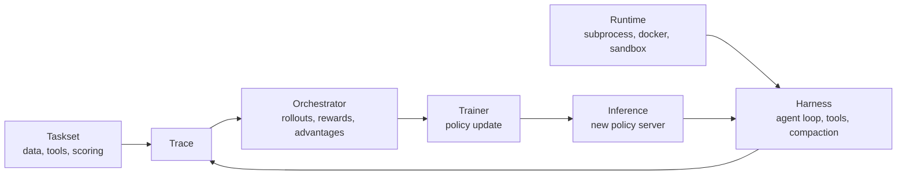
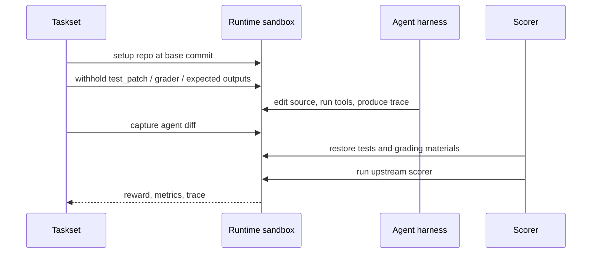

# Scaling Agentic RL: 365,000+ Environments for SWE, Terminal, and Search

### 元信息与 TL;DR

- **原文**：Prime Intellect, _Scaling Agentic RL: 365,000+ Environments for SWE, Terminal, and Search_。
- **发布日期**：2026-07-22。
- **方向**：大模型 Agent；更具体地说，是面向可训练 Agent 的环境、沙箱、评分和异步 RL 基础设施。
- **原始链接**：https://www.primeintellect.ai/blog/scaling-agentic-rl
- **相关代码**：
  - `research-environments`：https://github.com/PrimeIntellect-ai/research-environments
  - `prime-rl`：https://github.com/PrimeIntellect-ai/prime-rl
  - `verifiers`：https://github.com/PrimeIntellect-ai/verifiers

**TL;DR**

1. Prime Intellect 这篇文章发布了一个面向 Agentic RL 的环境集合：**23 个 tasksets**，覆盖软件工程、终端操作和搜索研究三类，共约 **365,000 个任务**。
2. 作者不是只在列数据集，而是在提出一个训练基础设施判断：Agent RL 的瓶颈已经从“有没有 benchmark”转向“不同 benchmark 的 harness、镜像、评分脚本、隐藏测试和失败模式能不能被统一成可训练信号”。
3. 关键机制来自 `verifiers v1`：把环境拆成 **taskset、harness、runtime** 三层。taskset 负责数据、工具和评分；harness 负责求解策略和轨迹生成；runtime 负责本地、Docker 或远端 sandbox 的执行边界。
4. 数量上，官方图表给出的分布是：软件工程约 **198,000** 个任务，终端约 **28,600** 个任务，搜索约 **137,600** 个任务；软件工程内部还包含 SWE-smith 83,519、OpenSWE 36,884、SWE-rebench-V2 32,079、ScaleSWE 17,202 等条目。
5. 质量门槛不是“能跑一次”即可。作者明确要求 gold patch 要能通过完整评分路径，no-op 不能误得 1.0，并且对失败样本做最多 10 次重试、二次独立验证和过滤后重传。
6. 安全/完整性上，文章强调 live sandbox 训练会把 agent 和评分材料放在同一环境里，因此 test patch、expected output、grading script 如果可读，就会成为 reward hacking 表面；他们的缓解办法是在 solve 阶段隐藏评分材料，只在 scoring 阶段恢复。
7. `prime-rl` 使这批 taskset 可直接进入训练：异步 pipeline 中，inference 用较旧策略采样 rollout，orchestrator 管理多环境与 advantage，trainer 用 FSDP2、vLLM、DPPO/GRPO/OPD/ECHO 等算法更新策略。
8. 局限也很明确：隐藏评分材料只是缓解，不等于完全隔离；gold-patch validation 只能证明原 PR 解法能通过测试，不能发现“正确但不同实现”被测试误杀的 false negative。

### 这篇文章真正关心的问题是什么？

作者开头给出的痛点很具体：开放研究社区已经产生了很多 Agent 数据集，但每个数据集往往自带一套互不兼容的工程假设。

- SWE-bench 类任务通常围绕 GitHub issue、patch、隐藏测试和评测脚本组织。
- R2E-Gym 这类环境可能把测试或 expected output 烘进镜像。
- 搜索类 benchmark 往往有各自的 judge prompt、答案格式和证据约束。
- 终端任务又强调容器、文件系统状态、命令执行和隐藏 grader。

如果只做 evaluation，这种碎片化仍然可以被一层脚本胶水勉强承受；但如果要做 RL，问题会变得更硬：

| 维度 | 单次评测可以接受的做法 | RL 训练里会放大的问题 |
|---|---|---|
| harness | 每个 benchmark 自带求解循环 | 无法混合训练，轨迹格式不一致 |
| runtime | 手工启动 Docker 或远端环境 | 并发 rollout 下资源泄漏、镜像拉取失败、网络抖动都会污染 reward |
| scoring | 评测脚本只在 benchmark 内部成立 | reward 不可比较，失败原因难以归因 |
| grading material | 测试、答案或脚本在容器中可见 | 策略会学会读/改评分材料，产生 reward hack |
| validation | 只报告 leaderboard 分数 | 数据行可能 broken、flaky、no-op pass，训练信号变成噪声 |

__核心问题因此不是“能否收集更多任务”，而是“能否把异构任务变成可规模化采样、可审计评分、可被训练器消费的稳定交互分布”。__

这也是文章标题里 “Scaling Agentic RL” 的重点：扩展的对象不是静态文本数据，而是能持续产生轨迹、奖励和失败案例的交互环境。

### 作者如何展开论证？

作者的论证路线可以拆成四段：

| 原文段落功能 | 主张 | 机制 | 证据 | 边界 |
|---|---|---|---|---|
| 统一目录 | 已经集成 23 个 tasksets | 用一个 taskset API 包装 SWE、terminal、search | 约 365k 总任务；三域数量分布 | 数量不自动等于 reward 质量 |
| 统一合约 | 数据集不能各自带孤立 harness | `verifiers v1` 拆出 taskset/harness/runtime | 一条命令可运行 ScaleSWE 示例 | 仍依赖每个 taskset 正确复刻上游评分语义 |
| 统一完整性标准 | live sandbox 里评分材料不能泄漏 | solve 阶段隐藏测试/脚本，scoring 阶段恢复 | R2E-Gym、Multi-SWE 的可见测试被特别处理 | 仍不是真正的隔离评分 |
| 统一验证 | 过滤 broken/flaky/no-op-pass 行 | gold-patch、no-op、最多 10 次重试、二次独立 pass | 多个 re-upload 的保留数量公开 | gold patch 不能发现 false negative |

这一结构比普通“发布数据集”的文章更工程化：作者先承认上游 benchmark 的异构性，再用最小公共抽象把它们接到同一训练框架，最后强调 reward 信号的可信度。

### `taskset × harness × runtime` 为什么是关键抽象？

`verifiers v1` 背景文章给出了三层分解：

- **Taskset**
  - 定义任务数据、工具、setup、评分函数、指标、验证逻辑。
  - 对求解者保持无关；同一个 taskset 可以给 Codex harness、Kimi Code harness、Terminus harness 或自定义 ReAct loop 使用。

- **Harness**
  - 定义 agent 如何解题、如何调用模型、如何处理 compaction/subagent/tool loop。
  - 训练时，harness 产生的是可被记录的 rollout，而不是只产生最终答案。

- **Runtime**
  - 定义代码和工具在哪里运行。
  - 可以是 subprocess、Docker，也可以是 Prime Sandboxes 这类远端沙箱。
  - 统一 API 包括 `run`、`read`、`write`，让环境作者不用自己处理每种基础设施细节。

用 Mermaid 表示，作者希望环境作者、agent 作者和训练系统之间形成这种分工：



这个抽象的重要性在于，它把 Agent RL 的几个历史耦合点拆开了：

1. **任务不再绑定具体 agent**  
   SWE taskset 不应该假设求解者一定是某个 CLI agent；搜索 taskset 也不应该强制某个 retrieval pipeline。taskset 只描述“什么算任务、什么算通过”。

2. **agent loop 不再绑定评分脚本**  
   Codex、Claude Code 风格 harness 可能有子代理、压缩、工具策略和不同 API 方言。如果任务环境把这些写死，就无法比较不同 harness，也无法把轨迹输入统一训练器。

3. **runtime 不再是环境作者的手工杂务**  
   真正训练时不是跑 10 个任务，而是成百上千个 rollout 并发。runtime 生命周期、失败重试、资源清理和镜像本地性都直接影响训练吞吐。

4. **trace 成为训练与评测的共同事实源**  
   `verifiers v1` 把 rollout 记录为 typed trace，并支持 message graph。这样 compaction 或 subagent 产生的非线性轨迹，也可以拆成可训练 branch，而不是被压扁成一串重复 prompt。

### 23 个 tasksets 的数量证据怎么读？

官方图表把任务池分成三大域。为了避免把图像当作素材堆砌，下面直接用表格复刻最关键数字：

| 域 | tasksets | 任务量 | 文章中的代表项 |
|---|---:|---:|---|
| 软件工程 | 11 | 约 198,000 | SWE-smith、OpenSWE、SWE-rebench-V2、ScaleSWE、SWE-Lego、R2E-Gym |
| 终端 | 4 | 约 28,600 | TMax、Terminal-Lego、Terminal-Bench 2、OpenThoughts-TBLite |
| 搜索 | 8 | 约 137,600 | PaperSearchQA、WideSeek、S1-DeepResearch、OpenSeeker、BrowseComp、BrowseComp-Plus |
| 合计 | 23 | 约 365,000 | 一个 taskset API、统一 runtime/sandbox hook、统一命令 |

软件工程域最值得细看，因为它直接承载 coding agent 的 RL 训练：

| taskset | 数量或默认数据 | 评分/验证含义 |
|---|---:|---|
| SWE-smith | 83,519 | 通过注入 bug 和恢复隐藏测试构造可验证修复任务 |
| OpenSWE | 36,884 | 每行带 evaluation script，solve 阶段不暴露，scoring 阶段运行 |
| SWE-rebench-V2 | 32,079 raw；过滤后默认用 6,275 | 多语言、近期 PR 来源，过滤 broken image 和 flaky rows |
| ScaleSWE | 17,202 verified 默认项 | 从上游 20,181 Python 任务中过滤出验证通过实例 |
| SWE-Lego | 15,903 图表项；文中还说明真实数据与验证变体 | 保持作者的隐藏测试模式，scoring 前恢复测试 |
| Multi-SWE | 6,835 合并图表项；文中拆分 RL 与 eval re-upload | 原容器可读评分脚本被隐藏，修复 HF schema |
| R2E-Gym | 4,578 curated；默认 4,522 verified | 原始 `/r2e_tests` 可读，Prime 版本只在 scoring 恢复 |
| SWE-bench Pro / Verified / Multilingual / Senior | 731 / 500 / 300 / 50 | 更偏评测基准或高质量小集 |

这里的数字不是孤立卖点。对 RL 来说，数量的作用至少有三层：

- **覆盖度**：多语言、多 repo、多任务类型能减少模型只记住某一类 issue 模板。
- **并发度**：足够多任务才能支撑高 group size、大 batch 和持续 rollout，不至于短时间复用同一小集。
- **错误分布**：broken、flaky、no-op-pass、false negative 的基数也会随数量放大，所以验证比数量更重要。

### validated re-uploads：为什么 gold/no-op 是最低门槛？

作者把一个任务行是否可用定义为两条同时成立：

1. **gold patch applied -> tests pass**
   - 说明该任务至少存在一条参考路径，完整 setup、patch、scoring 链路能跑通。
   - 如果 gold patch 都不能通过，reward 失败可能来自环境坏了，而不是 agent 不会做。

2. **no patch -> tests fail**
   - 说明任务不会在空修改时给满分。
   - 如果 no-op 能过，训练时 agent 什么都不做也得到 1.0，reward 就会鼓励懒惰策略。

可以把验证门槛写成一个二值判定：

```text
valid(task) =
  I[score(setup(task) + gold_patch(task)) = 1.0]
  *
  I[score(setup(task) + no_edit) < 1.0]
  *
  I[not_flaky_after_retries(task)]
```

变量解释：

- `setup(task)`：在 fresh sandbox 里复现任务初始状态。
- `gold_patch(task)`：上游或构造流程给出的参考修复。
- `no_edit`：只 setup、不修改代码的空策略。
- `not_flaky_after_retries`：多次运行中不表现为网络、时序或镜像不稳定。
- `I[...]`：条件成立取 1，否则取 0。

文章给了几个具体过滤结果：

| re-upload | 验证后保留 | 原始或说明 | 主要过滤原因 |
|---|---:|---:|---|
| R2E-Gym-Subset-Verified | 4,522 | 4,578 curated subset | 56 个 drop 多为 network/timing-sensitive 测试 |
| SWE-Lego-Real-Data-Verified | 4,323 | 4,432 real-data rows | 同类 gold/no-op 验证 |
| Multi-SWE-RL-Verified | 2,232 | 两次 gold pass + no-edit filter | schema 修复、去掉零修改可过样本 |
| SWE-rebench-V2-Filtered-Verified | 6,275 | 32,079 raw | broken images、flaky rows、题面中的 issue/PR 引用泄漏 |
| SWE-Bench-Verified-Quick | 468 | 500 Verified | 去掉最慢样本，服务 quick online eval |

这组证据说明，作者真正关心的是“训练信号可用性”。一个任务行如果只在论文表格里存在，不能在 fresh sandbox 里被 gold patch 复现，它对 RL 训练的价值就很低；反过来，一个任务如果 no-op 能过，数量越多越会污染策略。

### reward hacking 的边界：为什么隐藏评分材料只是缓解？

原文最有 AI 安全含义的一段在 “What's next”：

- 作者承认 reward signal 会在两个方向上说谎。
- 第一类是 **false positive**：agent 没有真正解决任务，却拿到奖励。
- 第二类是 **false negative**：agent 给出行为上正确的替代解，却因为测试过窄而被判失败。

对 false positive，文章指出 live sandbox 有一个结构性风险：

- agent 解题时和评分材料处于同一容器/文件系统边界；
- 如果 test patch、expected output 或 grader script 可读，RL 压力会鼓励策略找捷径；
- 即使没有明示“读测试”，高并发长训练也可能让模型发现某些泄漏路径。

`research-environments` 的 SWE README 和 `scaleswe_v1/taskset.py` 展示了具体处理方式：

- setup 阶段只准备 repo 与问题状态；
- finalize 阶段捕获 agent diff；
- solved 阶段恢复测试文件、应用 F2P patch 或上传 grader，再跑上游评分；
- 如果 agent 在 solve 过程中添加或修改测试，scoring 前会尽量把测试目录恢复到 base commit。

这可以抽象成如下流程：



这个设计的重要性在于，它没有假设模型“不会作弊”。它承认在 RL 中，策略会优化它能观察到的一切路径，于是把评分材料从观察空间里移除。

但作者也明确说，这仍然只是缓解：

- 只要 scoring 还发生在 agent 曾经能触碰的环境里，就存在残余篡改面。
- 结构性修复应当是 solve sandbox 与 grading sandbox 分离。
- 这对应 Agent 安全里的更一般原则：能力训练环境不能只依赖 prompt 约束，还要靠状态隔离和权限边界。

### false negative：为什么 gold-patch validation 仍然不够？

gold/no-op 验证能消除一部分坏任务，但它不能保证测试语义完整。作者强调，很多任务来自已经合并的 PR，而 PR 自带测试常常检查实现细节：

- 错误信息必须是某个精确字符串；
- 私有 helper 名必须存在；
- 返回对象字段顺序或形状必须完全匹配；
- 某个内部调用路径被测试固定住。

于是，Agent 可能修复了用户可见行为，却没复刻原 PR 的实现选择。对 benchmark 来说这叫失败；对真实工程来说可能是可接受修复。RL 看到的是负奖励，模型学到的是噪声。

可以把 reward 误差写成两个方向：

```text
observed_reward = true_task_success + false_positive - false_negative

false_positive: reward=1 but true_task_success=0
false_negative: reward=0 but true_task_success=1
```

对训练的影响不同：

| 误差类型 | 表面现象 | 对策略的训练影响 | 本文措施 |
|---|---|---|---|
| false positive | 没解决但得分 | 强化 reward hack、空策略、测试篡改 | 隐藏评分材料；no-op filter |
| false negative | 解决但不得分 | 惩罚合理替代方案，降低探索收益 | 作者说内部在做 Agentic Judging |
| flaky reward | 同一 patch 多次结果不同 | advantage 噪声变大，group ranking 不稳定 | 最多 10 次重试、独立二次 pass |
| setup failure | 环境无法启动 | rollout 失败被误当模型失败 | 镜像 registry、sandbox lifecycle 管理 |

这也是文章值得深读的地方：它没有把“更多环境”包装成单向利好，而是在说明环境规模化后，reward 的错误模式会成为核心研究对象。

### `prime-rl` 如何把这些环境接进训练？

`prime-rl` README 和文档显示，训练运行由三类进程协作：

| 进程 | 作用 | 和 taskset 的关系 |
|---|---|---|
| Inference | vLLM-backed policy server，生成 token-in/token-out rollout | harness 请求模型时通过 inference 得到动作 |
| Orchestrator | 管理多环境 rollout、env worker、advantage、batch 打包 | 读取 taskset、运行 eval/train env、收集 reward |
| Trainer | FSDP2 训练进程组，消费 packed rollout 并更新策略 | 根据 rollout 的 per-token weight、advantage、logprob 训练 |

`prime-rl` 的异步训练语义可以用一个简化公式表示：

```text
At step n:
  inference samples rollouts with policy pi_{max(0, n-1)}
  trainer updates current policy pi_n from rollouts (x_n, y_n)
```

这意味着 rollout 不一定来自 trainer 当前最新策略。为了避免 stale rollout 失控，文档给了几个关键监控/控制量：

- `orchestrator.max_off_policy_steps`
  - 允许 rollout 距离当前策略相差多少步；
  - 长 Agent rollout 下提高它能提升吞吐，但会牺牲 on-policyness。

- `mismatch_kl/{all,env}/mean`
  - 衡量 trainer 当前策略和生成 rollout 的旧 inference 策略之间的 KL；
  - 持续升高是 off-policy collapse 的早期信号。

- `errored_rollouts`、`empty_rollouts`
  - 环境或 harness 的失败率；
  - 在大规模环境训练中，这些指标不仅是系统指标，也会影响训练样本分布。

默认 RL loss 文档还给出 DPPO 风格目标。整理成可读形式：

```text
J_PG(theta) =
  average_{j,i,t} [
    min( pi_theta(y_t | x_j, y_<t) / mu(y_t | x_j, y_<t), delta )
    * A_hat_{i,t}^{(j)}
  ]

L_KL(theta) =
  average_{j,i,t} [
    log^2( pi_theta(y_t | context) / mu(y_t | context) )
  ]

L(theta) = -J_PG(theta) + tau_KL * L_KL(theta)
```

变量解释：

- `pi_theta`：trainer 当前策略。
- `mu`：生成 rollout 的 inference 策略，可能是较旧版本。
- `A_hat`：按任务组或算法分配到 token 的 advantage。
- `delta`：importance ratio 上界，避免 stale rollout 的极端梯度。
- `tau_KL`：KL 正则权重。

这套训练机制和本文 taskset 发布直接相连：如果环境的 reward 不可信，`A_hat` 就不可信；如果 runtime 经常失败，`errored_rollouts` 会吞掉吞吐；如果评分材料泄漏，`pi_theta` 会把 exploit 学成策略。

### 训练配置证据：GLM-4.5-Air 例子说明什么？

`prime-rl` 的高级示例里有面向 GLM-4.5-Air 的 SWE、terminal、search 配置，和原文“这些 taskset 直接插入 prime-rl”相互印证。

关键参数如下：

| 配置项 | SWE/terminal/search 示例里的值 | 研究意义 |
|---|---:|---|
| `max_steps` | 1000 | 把环境当作持续训练分布，而不是一次性 eval |
| `seq_len` | 131072 | 长程 Agent 需要超长上下文和 compaction/summary 支持 |
| `orchestrator.batch_size` | 256 | 每步聚合大量任务 rollout |
| `orchestrator.group_size` | 16 | 同一任务多样本比较，支持 GRPO 类 group-relative credit |
| `max_inflight_rollouts` | 512 | 高并发 rollout 是吞吐核心 |
| `max_off_policy_steps` | 32 | 允许一定策略陈旧度换吞吐 |
| `num_train_nodes / num_infer_replicas` | 2 / 4 | 训练和推理解耦，服务异步 pipeline |
| `eval.interval` | 20 | 训练中持续回看 held-out benchmark |

不同域的 harness 配置也很说明问题：

- SWE 示例训练 `scaleswe-v1`，评估 `swebench-verified-v1`。
- terminal 示例训练 `tmax-v1`，评估 `terminal-bench-2-v1`，并额外评估 SWE-Bench Verified。
- search 示例训练 `openseeker-v1` 和 `redsearcher-v1`，评估 `browsecomp-v1`。

这体现了作者的另一个隐含主张：Agent 能力不是单域 benchmark 的局部优化，而是跨环境训练、跨环境评估、跨 harness 记录轨迹之后得到的行为分布。

### 关键代码细读：`ScaleSWETask` 展示了什么？

`research-environments` 中的 `scaleswe_v1/taskset.py` 是很好的局部证据。它把 ScaleSWE 行转换成 `ScaleSWETask`，并把任务数据声明成：

- `base_commit`：repo 初始基线。
- `pre_commands`：setup 时执行的初始化命令。
- `f2p_patch` / `f2p_script`：fail-to-pass 测试材料，只在 scoring 前引入。
- `patch`：gold source patch，只用于 validation。
- `fail_to_pass` / `pass_to_pass`：评分所需测试 ID。

伪代码如下：

```text
Input:
  row = one ScaleSWE instance
  runtime = isolated sandbox

State:
  base_commit
  hidden f2p_patch / f2p_script
  gold_patch
  expected test ids

Loop:
  setup:
    run row.pre_commands in sandbox

  agent rollout:
    harness lets model edit source and call tools

  finalize:
    capture patch from base_commit to agent state

  solved:
    restore test files from base_commit
    remove agent-added test files that should not affect scoring
    apply f2p_patch if present
    write f2p_script if present
    run scorer over F2P + P2P ids
    return final score

  validate:
    apply gold_patch
    require solved() == 1.0

Output:
  reward in [0, 1]
  trace with captured diff and metrics

Failure boundary:
  no test ids -> reward 0
  gold patch cannot apply -> invalid task
  scoring patch restore fails -> task integrity issue
```

这段代码把文章中的“integrity standard”落到了实现层：

- agent 不能通过修改测试来影响最终评分；
- hidden F2P material 只在 reward 阶段出现；
- gold patch 和 no-op validation 不是概念，而是 taskset 生命周期的一部分；
- 上游评分语义仍被保留，而不是被统一成一个粗糙 exact-match。

### 搜索类任务为什么要保持 harness-agnostic？

文章对 search tasksets 做了一个看似小、但很重要的设计选择：大多数搜索任务只提供问题和评分，不规定检索工具。

这和软件工程任务不同：

- SWE 任务需要 repo、镜像、测试、patch、scorer，runtime 是任务定义的一部分。
- 搜索任务的核心能力是“如何找证据并形成答案”，检索工具可能来自 Codex harness、Prime search skill 或用户自定义系统。
- 如果 taskset 固定某个 web search provider，就会把 retrieval pipeline 和 reasoning policy 绑死。

BrowseComp-Plus 是例外，因为它把 830 个 BrowseComp queries 重新 grounding 到一个 **100,195 文档**的固定语料，并提供 BM25 search tool。这个例外恰好说明设计取舍：

- 当目标是可复现地比较搜索策略时，固定语料和固定 retriever 有价值。
- 当目标是训练通用 search-capable agent 时，taskset 不应把 harness 的搜索能力写死。

这对 Agent 研究很关键。很多“深度研究 Agent”实验其实混淆了三件事：

1. 模型是否会分解问题；
2. harness 是否提供了好用的搜索工具；
3. 评分器是否奖励证据覆盖而不是只奖励答案字符串。

Prime 的三层分解至少让这些变量可以被显式隔离。

### 这篇文章相对于相关工作的定位

这篇不是单篇算法论文，更像把若干 Agent RL 研究线收敛到基础设施层：

| 相关线索 | 共同问题 | 本文的位置 |
|---|---|---|
| SWE-bench / SWE-bench Verified | 真实 GitHub issue 是否能被模型解决 | 把评测任务改造成可训练 taskset，并保持隐藏测试语义 |
| ScaleSWE / SWE-Lego / SWE-smith | 如何扩展软件工程训练数据 | 接收并验证这些环境，把它们放进统一 taskset API |
| Terminal-Bench / TMax / Terminal-Lego | 终端任务如何容器化和评分 | 统一 runtime、镜像、hidden grader 和训练入口 |
| BrowseComp / PaperSearchQA / DeepDive | 长程搜索研究如何评分 | 把问题、judge、证据召回和 harness 搜索能力拆开 |
| verifiers v1 | taskset、harness、runtime 的抽象层 | 本文是该抽象的大规模 taskset 落地 |
| prime-rl | 异步大规模 Agent RL 训练 | 本文提供训练数据平面和 reward 平面 |

因此，它的研究贡献不在某个单点 SOTA，而在把 Agent 训练中的三件事放到同一个系统里：

- **环境规模**：365k 任务池让采样分布足够大。
- **评分可信度**：gold/no-op、隐藏评分材料、re-upload audit 降低坏 reward。
- **训练闭环**：taskset 输出 trace/reward，orchestrator 计算 advantage，trainer 更新 policy。

### 证据边界与局限

这篇文章本身也有几个必须保留的边界：

1. **没有给出完整训练曲线**
   - 文中提到 GLM-4.5-Air on ScaleSWE 的训练配置和 6 H200 节点 2 天案例，但正文没有公开完整 reward curve、SWE-Bench Verified 分数变化、不同 taskset mixture 的 ablation。

2. **365k 是任务池规模，不是都同等可训练**
   - 搜索任务、终端任务、SWE 任务的 reward 质量差异很大。
   - 任务数量相加不等于同质样本量；训练时还需要 mixture ratio、group size、难度分层和失败过滤。

3. **verified re-upload 仍然继承上游测试语义**
   - gold patch 能过只能说明原解法符合原测试。
   - 它不能证明任务的所有合理修复都会被接受。

4. **隐藏评分材料不是隔离评分**
   - 只要 solve 和 scoring 共享同一 runtime 历史，理论上仍可能存在状态污染。
   - 作者也承认结构性修复是独立 grading sandbox。

5. **LLM judge 任务仍然有 judge drift**
   - 搜索类和深研类任务很多依赖 judge。
   - judge 模型、prompt、答案格式和证据要求都会影响 reward 方差。

6. **外部复现成本不低**
   - `prime-rl` 需要 NVIDIA GPU；大规模示例涉及 H200、多节点、vLLM、FSDP2、SLURM/Prime sandbox。
   - 开源代码降低了方法不透明度，但并不消除算力和平台依赖。

### 对 Agent 研究的进一步问题

这篇文章给 Agent 研究提出了几个值得继续追问的问题。

**1. 环境规模是否能像 token scale 一样形成可预测规律？**

- 静态预训练有 token scaling law。
- Agent RL 的单位变成 task、rollout、turn、tool call、sandbox failure、reward。
- 未来需要回答：任务数量增加时，能力提升由什么变量主导？
  - unique repo 数？
  - hidden test 质量？
  - reward 稳定性？
  - 长程轨迹长度？
  - 多域 mixture？

**2. reward integrity 是否应该成为 benchmark 的一等指标？**

当前很多 benchmark 报告 pass@k 或 resolve rate，但对 RL 来说还需要报告：

| 指标 | 含义 |
|---|---|
| no-op pass rate | 空修改误过比例 |
| gold pass stability | gold patch 多次通过率 |
| grading material visibility | solve 阶段是否可读测试/答案/脚本 |
| false negative audit | 替代正确解被误杀的人工抽样比例 |
| sandbox reproducibility | 镜像启动、依赖安装、网络漂移失败率 |

**3. harness 能力会不会污染 taskset 比较？**

如果同一个 taskset 可以被 Codex harness、Claude Code-style harness、自定义 ReAct harness 运行，那么 benchmark 分数不再只是模型能力：

- harness 的 compaction 策略会影响长程任务；
- tool schema 和 shell 权限会影响可达解空间；
- prompt dialect 和 renderer 会影响训练 token attribution；
- subagent 分支会改变 trace graph 的训练样本结构。

这要求报告结果时把 `model + harness + runtime + taskset + scoring` 全部写清。

**4. Agentic Judging 能否同时降低 false positive 和 false negative？**

作者说内部正在做 Agentic Judging。它可能试图解决测试过窄的问题，但也会引入新风险：

- judge 是否会被 agent 输出诱导？
- judge 是否能检查代码行为而不是只读解释？
- judge reward 与 hidden tests 冲突时如何仲裁？
- judge 成本是否能支撑高并发训练？

更稳妥的方向可能是混合评分：

```text
reward =
  w_test * hidden_test_score
  + w_behavior * behavioral_judge_score
  + w_integrity * anti_tamper_score
  - w_cost * resource_penalty
```

其中每个权重都应按任务类型公开，并通过人工审计或 held-out replay 校准。

### 结论

Prime Intellect 这次发布的价值，不只是“有 365,000 个环境”。真正值得关注的是他们把 Agent RL 的环境问题拆成了可以工程化审计的合同：

- taskset 负责任务和 reward 语义；
- harness 负责 agent loop 和轨迹；
- runtime 负责执行边界；
- trace 负责训练与评测的共同记录；
- validation 负责过滤坏任务；
- hidden scoring material 负责降低 reward hack 面；
- prime-rl 负责把这些信号接进异步大规模训练。

从研究者视角看，这篇文章把 Agent 后训练的讨论从“训练算法选 GRPO 还是 OPD”往前推了一层：在算法之前，先要确认环境是否可运行、reward 是否可信、轨迹是否可训练、评分材料是否泄漏、错误样本是否会系统性污染 advantage。

它的局限同样重要：当前发布更像基础设施和数据平面，不是完整训练实验报告；文章没有给出跨 taskset mixture 的系统消融，也没有证明 365k 环境带来的能力增益曲线。但它清楚地指出了未来 Agent RL 的主战场：__不是只扩大模型，也不是只扩大 prompt 数据，而是扩大可验证、可隔离、可审计、可训练的交互环境。__

### 参考链接

1. Prime Intellect, _Scaling Agentic RL: 365,000+ Environments for SWE, Terminal, and Search_, 2026-07-22, https://www.primeintellect.ai/blog/scaling-agentic-rl
2. Prime Intellect, _verifiers v1: Decomposing Tasksets and Harnesses for Agentic RL & Evaluations_, https://www.primeintellect.ai/blog/verifiers-v1
3. PrimeIntellect-ai/research-environments, https://github.com/PrimeIntellect-ai/research-environments
4. PrimeIntellect-ai/prime-rl, https://github.com/PrimeIntellect-ai/prime-rl
5. PrimeIntellect-ai/verifiers, https://github.com/PrimeIntellect-ai/verifiers
6. Hugging Face, PrimeIntellect SWE-RL collection and dataset re-uploads, https://huggingface.co/PrimeIntellect/datasets
