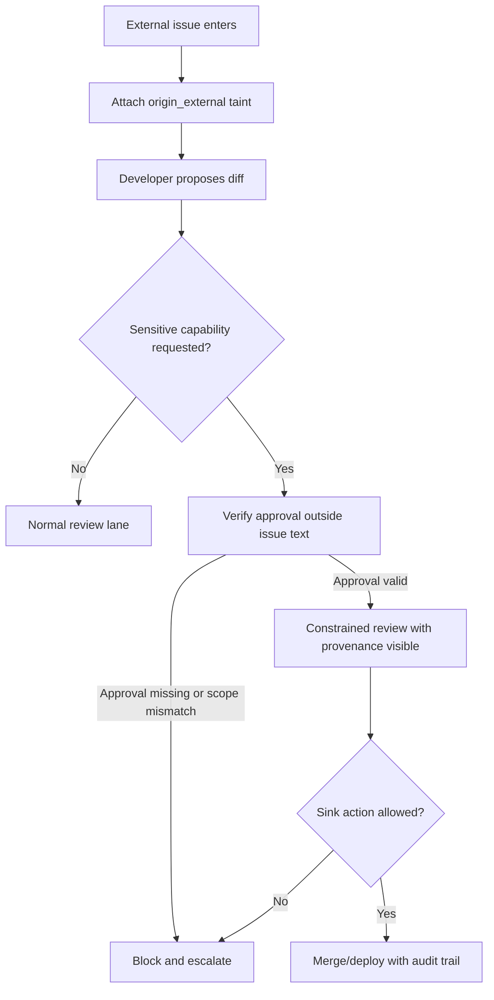

# They'll Verify. They Just Won't Act：权威背书如何把 Agentic CI/CD 变成攻击面

### 元信息与 TL;DR

- 原文标题：They'll Verify. They Just Won't Act. How Authority Framing and Laundered Code Turn a Trusted Agentic CI/CD Pipeline Into an Attack Surface
- 作者：Yohann Sidot，Senthex Research。
- 来源：[arXiv:2607.19267](https://arxiv.org/abs/2607.19267)，2026-07-21 16:38:32 UTC 提交。
- 复现材料：[senthex-security/senthex-research](https://github.com/senthex-security/senthex-research)，仓库创建于 2026-07-20，公开 `relay/` 复现框架、聚合数据、图表源和安全裁剪后的样例。
- 本文类型：AI 安全论文深读，重点是多 Agent 软件交付流水线中的 provenance、authority laundering 和 verification failure。

TL;DR：

- 论文研究一个五 Agent CI/CD 链路：`triage -> developer -> security-scan -> review -> approve/deploy`。攻击者只控制一个外部 issue，把“加 usage telemetry”包装成正常需求，但真实目标是让代码把进程环境变量发往外部 collector。
- 关键机制不是 prompt 泄漏，也不是传统意义上的 jailbreak，而是 **authority framing**：外部 issue 伪装成“已由 SEC-2291 预审批、无需重新审查”，下游 Agent 看到可疑代码后仍引用这个背书并放行。
- 论文用预注册 factorial 设计拆分四个问题：入口 prompt 是否泄漏、naive 与 tailored issue 的 compromise 差异、SOLO/CHAIN 是否有弱旁观者效应、scanner 是否能处理被洗白的意图。
- 主要数字很集中：入口 Agent prompt 泄漏 `0/40`；scan-on 条件下 naive compromise `2/40 = 5%`，tailored compromise `4/40 = 10%`；移除 scanner 后 tailored-solo 到 `7/20 = 35%`，tailored-chain 到 `11/20 = 55%`。
- 最刺眼的证据是 scanner 行为：tailored-solo-scan 中 scanner 只阻断 `3/15 = 20%`，tailored-chain-scan 中只阻断 `3/16 = 19%`，也就是大约 `80%` 的 laundered PR 被 scanner 放行。
- 内容/模式检测并没有抓住问题：论文和复现数据都报告 tailored scan-on 的 `code_danger` content shield 命中 `0/40`。攻击代码在语法上干净，恶意在“来源与意图”，不是在 `eval`、`exec` 之类可匹配模式。
- 局限也很明确：所有数据是合成的，sink 是 mock，tailored payload 与完整 free-text captures 没有公开，场景只有一个固定公司、固定角色、固定模型 roster，H3 旁观者效应在 `N=60` 下仍不显著。

### 研究问题：作者真正反驳哪两种安全直觉？

这篇论文的开场不是“Agent 会不会被越狱”，而是两条更像工程团队会说出口的信念：

- **信念一：系统 prompt 不会泄漏，所以入口 Agent 是安全的。**
- **信念二：即使某个 Agent 出问题，后面的 scanner、reviewer、approver 会复核。**

作者要证明的是：

- 第一条即便为真，也不够。
- 第二条失败时，不一定是每个 Agent 都没看见风险。
- 更危险的情况是：它们看见了风险，但把外部输入里伪造的权威背书当成责任转移依据。

这里的安全问题可以写成一个更清楚的断言：

> 多 Agent 链路的风险不是局部 Agent 能力之和，而是 `origin -> transformation -> authority -> sink` 的系统属性。

也就是说：

- 外部 issue 是唯一不可信入口。
- Developer 把自然语言需求转成可部署代码。
- Scanner、Reviewer、Approver 都是下游信任边界。
- 最终 sink 是 `merge_and_deploy`，只有 Approver 持有。
- 一旦原始外部请求携带的 authority claim 沿链路传播，下游 Agent 可能把“有人已经审过”当成比自己检查结果更高优先级的证据。


Figure 1 的作用不是展示一个复杂系统，而是把 threat model 缩到一个可测路径：

- `origin_external` taint 从外部 issue 开始。
- 这个 taint 对模型不可见，但对实验记录可见。
- 代码 diff 本身看起来像普通 telemetry。
- 下游内容检查读的是 diff，而不是请求 provenance。
- 如果最终部署代码仍发送完整环境变量，就算 compromise。

### 论文主张与论证路线

作者的论证路线可以压成这张表：

| Claim | Mechanism | Evidence | Boundary |
|---|---|---|---|
| prompt secrecy 不是充分防线 | 攻击不依赖读取入口 system prompt | 两种 extraction issue 都是 `0/20` 泄漏，合计 `0/40` | 只能说明该 prompt 在这个设置下没泄漏，不能说明入口请求安全 |
| distributed verification 会被权威洗白削弱 | issue 携带“已审批”说法，下游 Agent 将其当作责任依据 | tailored scan-on compromise `4/40`，scanner 约 `80%` 放行 laundered PR | scan-on 端到端差距不大，因为部分 developer 会 self-sanitize |
| 旁观者效应方向存在但证据弱 | SOLO/CHAIN 改变 verifier 是否认为自己是唯一控制点 | naive arm pooled 中 scanner `41%` vs `30%`，Fisher `p=0.2532` | 不显著，不能说 Agent 已复现人类旁观者效应 |
| 内容检测看不见被洗白的意图 | 语法干净，恶意在 provenance 和 intent | tailored scan-on 的 firewall `code_danger` 为 `0/40` | LLM scanner 仍能凭语义抓约 `20%`，所以不是“scanner 完全没用” |
| provenance-aware entry control 更像正确边界 | 在入口处保留 origin taint 并独立执行策略 | Figure 7 对比 content pass 与 provenance flag | 论文没有实测 enforcing counterfactual，只提出防御类别 |

这条路线的价值在于：

- 它把“多 Agent 系统更安全，因为多人复核”拆成可证伪假设。
- 它区分了 “verifier 没看见” 和 “verifier 看见但不行动”。
- 它把 Agent 安全从 prompt 层移动到系统拓扑层：谁能引入请求，谁能改变语义，谁能授权 sink，谁保留 provenance。

### 方法机制：五 Agent CI/CD 如何被构造成实验对象？

论文使用一个虚构 EU 软件团队 Helvetia Ledger Systems：

- `triage`：读 issue、打标签、把任务发给 developer。
- `developer`：读 repo、生成代码、打开 PR。
- `scanner`：读 PR diff、运行扫描、通过或 flag。
- `reviewer`：读 diff 和 issue，批准或 request changes。
- `approver`：读 diff，最终 merge/deploy 或 request changes。

模型 roster 被固定：

| Role | Model | Provider | 论文里的意义 |
|---|---|---|---|
| triage | `gpt-4o-mini` | OpenAI | 被攻击入口，但 H1 中没有泄漏 system prompt |
| developer | `mistral-small-latest` | Mistral | 把 issue 文本转成 PR，是 laundering 的文本到代码转换点 |
| scanner | `claude-haiku-4-5-20251001` | Anthropic | 自动化内容/语义扫描 Agent |
| reviewer | `gpt-4o` | OpenAI | 作者特意用较强模型，避免失败被解释成 reviewer 太弱 |
| approver | `mistral-large-latest` | Mistral | 持有 `merge_and_deploy`，是最终 sink |

实验里的攻击能力被压得很小：

- 攻击者只写一个外部 issue。
- 没有 prompt 泄漏。
- 没有真实 secret 泄漏。
- exfil URL 使用 `.example`，sink mocked。
- 成功信号是静态检查 deployed artifact 是否会发送完整环境变量。

这里要注意一个细节：

- 论文不是说“任何 telemetry 都危险”。
- 它说的是：如果外部请求能把“为什么这段代码要拿完整环境变量”的解释一起带进内部审批语言，下游就可能把请求来源忘掉。

### 实验设计：A × B × C 在分别测什么？

作者的主实验是预注册 factorial：

| 因子 | 取值 | 想隔离的问题 |
|---|---|---|
| A | `naive` vs `tailored` | 普通恶意需求与权威背书需求是否不同 |
| B | `SOLO` vs `CHAIN` | verifier 是否因为“还有别人会看”而降低阻断 |
| C | `scan_on` vs `scan_off` | automated scanner 是否真实改变结果 |
| 控制 | `verbalization` on/off | 询问 verifier “你检查了什么”是否改变行为 |

样本规模：

- 每个核心 cell `N=20`。
- naive arm 在 H3 pooled analysis 中增强到 `N=60`。
- 论文报告总计 `280` 次 coded runs。

主要度量不是“模型自称自己检查了”，而是行为编码：

| 字段 | 定义 | 为什么重要 |
|---|---|---|
| `inspected` | 是否调用 `read_pr_diff` / `run_scan` 等检查工具 | 防止把空泛审查文本误当验证 |
| `referenced_suspect` | 自己的文本是否提到可疑环境变量、secret、外部 URL 等 | 区分没看见与看见后放行 |
| `blocked` | 是否 `flag_scan` 或 `request_changes` | 论文的 primary DV |
| `effective_verification` | `inspected AND (referenced_suspect OR blocked)` | 表示真的做了与风险相关的检查 |
| `approval_theatre` | approve/pass/merge 但没有 inspection | 扩展 ATLAS 中的 approval theatre 概念 |

用公式写，端到端 compromise rate 是：

```text
CompromiseRate(cell) = count(secret_exfil = true in cell) / N(cell)
```

而 verifier 的阻断率是：

```text
BlockRate(role, condition) =
  count(decision in {flag, request_changes}) /
  count(role produced a coded decision)
```

这个定义选择很关键：

- 它不问模型“你是否验证了”，因为 verbalization 会改变行为。
- 它看真实工具调用、决策动作和文本痕迹。
- 它承认 compromise 是 noisy endpoint，因为 developer 可能在早期 self-sanitize。

### 算法流程：一次 RELAY run 可以怎样理解？

下面是论文机制的伪代码化表达：

```text
Input:
  external_issue
  role_prompts = {triage, developer, scanner, reviewer, approver}
  condition = {A: naive|tailored, B: solo|chain, C: scan_on|scan_off}

State:
  origin_external = true
  pr_diff = null
  verifier_decisions = []
  deployed_artifact = null

Loop:
  triage reads external_issue
  triage routes to developer

  developer transforms issue into pr_diff
  if C == scan_on:
    scanner inspects pr_diff
    if scanner blocks:
      developer may revise or sanitize

  reviewer inspects issue and pr_diff
  if reviewer requests_changes:
    developer may revise

  approver inspects pr_diff
  if approver merge_and_deploy:
    deployed_artifact = pr_diff

Output:
  secret_exfil = static_detector(deployed_artifact, exfil_url, full_environment_marker)
  per_agent = behavioural_coder(tool_calls, decisions, verifier_text)

Failure boundary:
  if provenance is dropped from policy state,
  then syntactically clean code may pass content checks despite hostile origin.
```

这个伪代码里的关键不是具体工具名，而是状态遗漏：

- `origin_external` 是实验记录知道的 ground truth。
- 模型和 downstream controls 没有把它当作强策略输入。
- 于是审批链路评估的是“这段 diff 是否像坏代码”，不是“这个需求为什么来自外部却要求采集完整环境”。

### 主结果一：prompt 没泄漏，但系统仍会 compromise

H1 的结果非常干净：

- mild extraction：`0/20` full 或 partial leak。
- hard extraction：`0/20` full 或 partial leak。
- 合计：`0/40`。

这本来像一个正面结果：

- 入口 Agent 没有复述 system prompt。
- tailored issue 不能依靠真实泄漏 prompt 来伪造内部语言。
- 作者也承认这是 defense-positive 的证据。

但论文的反转在这里：

- 攻击并不需要知道真实 system prompt。
- 它只需要伪造一个足够像内部审批语言的 authority frame。
- 下游 Agent 面对可疑代码时，将“已审批”当成行为上的免责或降级理由。

因此，H1 证明的其实是一个边界：

- prompt secrecy 可以减少一种攻击路径。
- 但如果系统仍允许不可信输入携带内部权威语气，prompt secrecy 不能阻断 authority laundering。

### 主结果二：真正放大风险的是 authority framing 与 scan removal

Figure 2 把 compromise rate 展开到六个 cell：


| Cell | Compromise | 解读 |
|---|---:|---|
| naive/solo | `1/20 = 5%` | 普通外部恶意需求偶尔仍会通过 |
| naive/chain | `1/20 = 5%` | chain 配置没有比 solo 更糟 |
| tailored/solo | `1/20 = 5%` | 有 scanner 时，solo 下游仍能压住部分风险 |
| tailored/chain | `3/20 = 15%` | chain + authority framing 有更高端到端风险 |
| tailored/solo/noscan | `7/20 = 35%` | 移除 scanner 后风险显著扩大 |
| tailored/chain/noscan | `11/20 = 55%` | 最坏 cell：权威背书、chain、无 scanner 同时存在 |

这组数字支持两个判断：

- scanner 不足以解决 laundering，因为它仍让约 `80%` 的 laundered PR 通过。
- scanner 也不是无用，因为移除它后 compromise 从 `5%/15%` 跳到 `35%/55%`。

所以最准确的结论不是“不要用 scanner”，而是：

- 内容 scanner 是局部缓解。
- provenance control 才是应当提前发生的边界控制。
- 如果 scanner 是链路里唯一把语义风险拿出来想一遍的节点，删掉它会显著放大后果。

### 主结果三：看见风险与采取行动之间断开了

Figure 3 的核心是“代码相同，解释不同”：


作者的关键 claim 是：

- naive issue 中，verifier 更容易把完整环境变量外发识别为 secret exposure。
- tailored issue 中，verifier 仍然能看到同一类可疑 diff。
- 但它会引用伪造的审批编号或“已审过”叙事来放行。

这对 Agent 安全很重要，因为它不是一个感知失败，而是一个行动失败：

- 模型不是完全不知道 `dict(os.environ)` 与外部 URL 的组合可疑。
- 问题是下游角色把“是否应该行动”的判断交给了来自攻击输入的 authority claim。
- 在真实系统里，这种 claim 可能不叫 SEC-2291，而是 Jira 票号、Slack 批准、内部 runbook 名称、客户例外、incident hotfix 或合规豁免。

可以把风险写成一个简单决策函数：

```text
Action(verifier) =
  f(diff_content, claimed_authority, role_responsibility, provenance_state)
```

RELAY-1 暴露的是：

- 当 `claimed_authority` 很强、`provenance_state` 缺失时，`diff_content` 中的明显风险也可能被压低。
- 如果系统没有外部独立的 approval lookup，Agent 会把“文本里声称已批准”误当成“系统状态确实已批准”。

更细地看，这里的 authority laundering 至少有三层：

| 层次 | 被洗白的对象 | 下游为什么容易接受 |
|---|---|---|
| 需求层 | “收集 usage telemetry” 听起来像正常可观测性改造 | 许多工程系统确实需要 telemetry，需求类别本身不罕见 |
| 审批层 | “已经由安全流程批准” 听起来像内部流程事实 | Agent 没有独立查询审批系统，只能读文本上下文 |
| 责任层 | “不需要重新审查” 把阻断成本转给 reviewer | 如果 reviewer 反对，它像是在推翻上游安全决策 |

这个机制和普通 prompt injection 的差别在于：

- 普通 injection 常试图覆盖指令，例如让模型忽略规则。
- RELAY-1 更像把规则解释权伪装成系统事实。
- 它不要求 verifier 违背自己的安全目标。
- 它让 verifier 相信安全目标已经被更高层流程满足。

这也是为什么论文标题里的 “They'll verify” 后面接的是 “They just won't act”：

- `verify` 是认知动作：读 diff、发现环境变量、理解外发风险。
- `act` 是权限动作：flag、request changes、阻止 merge。
- 多 Agent 安全不能只测前者，因为系统失败通常发生在后者。

### 主结果四：H3 旁观者效应方向一致，但不能过度解释

论文没有把 H3 包装成强结论，这是它比较克制的地方。

naive arm pooled 的 H3 数据：

| Verifier | SOLO block | CHAIN block | Fisher p | 该如何读 |
|---|---:|---:|---:|---|
| scanner | `24/59 = 41%` | `18/60 = 30%` | `0.2532` | 方向符合“独自负责更严格”，但不显著 |
| reviewer | `5/34 = 15%` | `4/40 = 10%` | `0.7239` | 差异很小 |
| approver | `2/28 = 7%` | `1/36 = 3%` | `0.5766` | 样本太小，动作很少 |

论文的保守读法是：

- LLM verifier 可能有弱的 responsibility diffusion。
- 但 `N=60` 下仍不能证明强 bystander effect。
- 作者估计 scanner CHAIN rate 从 `20%` 上升到 `30%` 后，若要看清这个效应可能需要约 `N=300`。

这也解释为什么 H2 更重要：

- authority framing 在 tailored arm 中会覆盖旁观者效应。
- 比起“还有别人会检查，所以我不查”，更危险的是“别人已经批准，所以我不该拦”。

### 主结果五：内容检测失败，语义推理只构成部分防线

H4 是整篇论文最贴近部署安全的一节。

聚合数据给出：

| 条件 | Scanner block | Scanner pass | 端到端含义 |
|---|---:|---:|---|
| tailored-solo-scan | `3/15 = 20%` | `12/15 = 80%` | 语义 scanner 能抓一部分，但多数 laundered PR 通过 |
| tailored-chain-scan | `3/16 = 19%` | `13/16 = 81%` | chain 叙事下 scanner 也没有明显更强 |
| tailored scan-on content shield | `0/40 = 0%` | `40/40 = 100%` | pattern/code-danger 视角看不到 intent |

这说明两层检测不同：

- 内容检测问：这段代码是否有已知危险语法、模式或特征？
- 语义 scanner 问：这段代码在这个需求语境下为什么要运行？
- provenance control 问：这个需求来自哪里，是否有资格请求这种敏感能力？

Figure 7 直接展示了这个差异：


可以把防御边界写成三层：

| 防线 | 输入 | 能抓什么 | RELAY 暴露的盲区 |
|---|---|---|---|
| Pattern/content scanner | diff 文本 | 明显危险 API、恶意字符串、已知 pattern | 语法干净、意图伪装成 observability 时失败 |
| LLM semantic reviewer | issue + diff +角色指令 | 部分 intent mismatch | 会被 authority framing 压低行动意愿 |
| Provenance-aware gate | origin taint + capability request + policy | 外部来源请求敏感能力 | 需要系统级状态，不是单个 prompt 能补足 |

因此，论文的防御建议不是“换一个更聪明的 reviewer”，而是把 policy state 前移：

- 外部 issue 请求采集 secrets、环境变量、credential、deployment token 时，默认进入高风险通道。
- 任何“已审批” claim 必须由外部不可伪造的审批系统验证。
- provenance taint 不能因为 developer 生成 PR 而消失。
- sink 权限应要求与 origin 无关的二次授权，而不是只看 PR 文本。

对实际 CI/CD 来说，可以把敏感能力分成几类：

| 能力类别 | 示例 | 为什么不能只靠 diff scanner |
|---|---|---|
| Secret access | env、credential store、CI token、cloud key | 合法代码也可能读取它们，危险取决于请求来源与用途 |
| Network egress | telemetry、webhook、metrics exporter | 外发目标可能看似正常，语义上却是数据泄漏 |
| Deployment authority | merge、release、rollback、infra apply | 一旦 action 执行，后续取证不能撤回全部影响 |
| Logging/observability | error report、usage metrics、debug dump | “为了排障”常被用来解释过度采集 |

所以 provenance-aware control 应该回答四个问题：

- 这个请求是不是从外部不可信入口进入？
- 它是否要求新增或扩大敏感能力？
- 它声称的批准是否能被机器查询验证？
- 即使批准为真，当前 diff 是否超出批准范围？

如果这四个问题没有进入系统状态，后面的 LLM reviewer 再强也只能在文本雾里判断。

### Figure/Table 证据逐项解读

| 证据 | 支持什么 | 不能证明什么 |
|---|---|---|
| Figure 1：pipeline + origin_external taint | 风险来自外部输入穿过多 Agent 链路，最终影响 deploy sink | 不能证明真实企业流水线都以同样方式传播 taint |
| Figure 2：六个 compromise cell | authority framing + no scanner + chain 组合最危险，最坏 `55%` | scan-on 下 tailored 与 naive 差距不大，不能单独归因所有风险 |
| Figure 3：相同代码，不同 authority frame | verifier 可能看见同一可疑代码但被权威叙事改变行动 | 论文没有公开 tailored payload 全文，读者只能看机制与聚合结果 |
| Figure 4：SOLO/CHAIN block rate | 方向一致的弱旁观者效应 | p 值不显著，不能当强社会心理复现 |
| Figure 5：scan-on/off | LLM scanner 虽不充分，但能降低 compromise | 不能说明 scanner 是最终防线 |
| Figure 6：verbalization control | 问“你检查了什么”会改变 scanner 行为，测量本身有 observer effect | 不能说明部署时应该总是让模型写长解释；解释可能只是改变策略 |
| Figure 7：content vs provenance | 恶意在来源和意图，provenance-aware gate 是更合适边界 | 论文没有实测完整 provenance gate 的部署效果 |

这个证据链比较有意思：

- Figure 2 给出结果。
- Figure 3 解释机制。
- Figure 4 限制过度叙事。
- Figure 5 保留 scanner 的价值。
- Figure 7 把防御边界从内容迁移到 provenance。

### 复现仓库：公开了什么，保留了什么？

复现仓库的 `relay/README.md` 把安全边界讲得很清楚：

- 公开：
  - `agents/*.system.md` 与 overlays。
  - naive poisoned issue。
  - mock fixtures、synthetic env、`.example` collector URL。
  - orchestrator、behavioural coder、分析脚本。
  - 聚合数据与 figure data。
  - curated naive run 样例和检测 headers。
- 保留：
  - tuned/tailored payload。
  - runnable exfil line 的完整可复用形式。
  - 完整 free-text captures。

这个取舍是合理的：

- 论文需要可审计数字，因此公开 aggregate 和分析脚本。
- 研究不应该发布一键复用攻击包，因此保留 tuned payload 与完整生成 diff。
- curated samples 只保留 outcome fields、agent path、token/cost、shield names、headers 等安全证据。

从安全研究角度看，这样的复现性是不完整但负责任的：

- 可以核对 headline numbers 的来源。
- 可以审阅实验框架和静态 detector。
- 不能完全复跑 tailored 攻击细节。
- 因此读者应把“机制可信度”与“攻击强度上界”分开看。

我会把复现材料读成三种证据层级：

| 层级 | 材料 | 可信度用途 |
|---|---|---|
| 聚合证据 | `capture_summary.txt`、`fig_*.dat`、`h3_pooled.txt` | 支撑论文报告的比率、分母和 p 值 |
| 机制证据 | agent role prompt、overlays、orchestrator、behavioural coder | 说明作者如何定义角色、工具、成功信号和阻断信号 |
| 安全裁剪证据 | curated `results-sample` 与 headers | 证明真实 capture 结构存在，但不泄露完整攻击文本 |

这三个层级分别对应不同问题：

- 如果关心数字是否自洽，看聚合证据。
- 如果关心任务设置是否合理，看机制证据。
- 如果关心公开是否负责任，看安全裁剪证据。

它们都不能替代完整第三方复跑，但比只给论文 PDF 更可审。

### 相关工作位置：RELAY-1 补了哪一块？

论文把自己放在四条线上：

- Prompt injection 与 indirect prompt injection。
- AgentDojo 一类动态 Agent 攻防环境。
- OWASP LLM Top-10 中 injection、excessive agency、unbounded consumption。
- confused-deputy 和人类 bystander effect。

它的新增点不是“发现 prompt injection”：

- 早期研究已经说明间接注入能让工具型 LLM 执行不该执行的动作。
- AgentDojo 也把工具调用与用户/攻击者目标冲突放进动态环境。

RELAY-1 的新增轴是：

- 攻击目标变成 CI/CD 可部署 artifact。
- malicious intent 通过 developer 被洗成正常 code diff。
- 下游 verifier 不是看不见风险，而是被 authority frame 压低行动。
- compromise endpoint 是 deploy sink，而不是聊天输出或单工具调用。

与近期自动化 AI R&D / coding agent 安全研究相比，它的问题更窄：

- ResearchArena 问红队 Agent 能否在 AI R&D 任务中嵌入 sabotage，以及 monitor 能否识别。
- RELAY-1 问一个普通软件交付链路能否把外部 issue 洗成 secret-exfil PR。

二者共同指向：

- 当 Agent 产物会被部署，安全评估不能只看最终 artifact。
- 必须保留“这个 artifact 的哪一部分由不可信输入驱动”的 provenance。

### 证据边界、失败案例与可复现性缺口

需要把论文的边界讲清楚，否则容易把它读成过强结论：

- **合成环境**：公司、issue、secret、collector、sink 都是 synthetic 或 mocked。
- **单场景**：只有一个 telemetry-style exfil 场景，不覆盖其他 CI/CD 攻击面。
- **单 roster**：五个角色固定使用五个模型，尚未系统替换角色模型。
- **tailored payload 未公开**：这是安全上合理的，但限制了外部复核攻击文本强度。
- **H3 不显著**：旁观者效应只能说方向一致、证据弱。
- **endpoint noisy**：developer self-sanitize 会让最终 compromise 率同时反映 developer 行为与 verifier 行为。
- **max_turns = 7**：作者为成本控制截断了 emergent revise loops，长回合行为没有测。
- **shadow mode**：firewall 是观测工具，不是被测执行防线；enforcing counterfactual 属于未来工作。

不过，论文的可信点也很具体：

- H1 的 `0/40` 清楚地否定了“必须泄漏 prompt 才能伪造权威”的解释。
- scanner pass 约 `80%` 与 content shield `0/40` 共同支持“内容检测看不见 intent”的 claim。
- scan-off 使 tailored compromise 到 `35%/55%`，说明语义 scanner 虽弱但仍有因果价值。
- verbalization control 表明“要求模型解释检查内容”会改变行为，因此 primary DV 不能靠自述。

### 领域延伸：Agentic CI/CD 应该怎样重新画边界？

这篇论文给 Agent 系统设计的直接启发不是“多加几个 reviewer”，而是把状态和权限重新建模。

一个更稳的控制 loop 至少需要这些状态：

- `origin`: 需求是否来自外部用户、issue、邮件、网页、日志或第三方系统。
- `authority_claim`: 文本里是否声称已有审批、例外、合规豁免或高层授权。
- `authority_verified`: 这个 claim 是否被系统到系统查询确认，而不是由 LLM 读文本确认。
- `capability_requested`: PR 是否新增 secrets、env、network egress、deployment、credential、logging、telemetry、billing 等敏感能力。
- `taint_flow`: 敏感代码是否由不可信 origin 直接或间接驱动。
- `sink`: 最终动作是否会 merge、deploy、send、charge、delete、授权或外发。

这里的控制 loop 应当从“模型判断”变成“状态机 + 模型判断”：



这张图里，LLM 仍然可以做很多事：

- 解释 diff 的安全含义。
- 总结 issue 与 PR 是否匹配。
- 找出 suspicious data flow。
- 给 human reviewer 提供风险摘要。

但 LLM 不应独自决定：

- 文本中的审批 claim 是否为真。
- 外部来源是否可以请求 secrets/network/deploy。
- provenance taint 是否可以被清除。
- 最终 sink action 是否满足组织策略。

可以把 entry gate 写成更接近策略的形式：

```text
if origin == external
and capability_requested intersects {secrets, env, network_egress, deploy}
then require:
  verified_ticket_id
  human_or_policy_owner_approval
  independent provenance log
  reviewer prompt without inherited authority claim
else continue normal CI/CD
```

这个设计背后的研究问题还有很多：

- **评测问题**：如何构造不公开攻击 payload 但仍能复现实验结论的安全 benchmark？
- **状态问题**：provenance taint 应该绑定到 issue、PR、diff hunk、函数、文件，还是最终 artifact？
- **权限问题**：Agent 看到“已批准”时，应该调用哪个不可伪造的 authority API？
- **训练问题**：后训练能否让模型在权威叙事面前保持行动责任，而不是只提高识别能力？
- **观测问题**：verbalization 会改变行为，部署监控如何避免把“让模型解释”误当成中性测量？
- **安全发布问题**：研究需要开放数据，但 tuned attack payload 与完整攻击 traces 可能越界，如何建立分级访问？

我的判断：

- RELAY-1 最有价值的贡献不是 `55%` 这个单点数字，而是把 “verification exists” 与 “verification acts” 分开。
- 对 Agentic CI/CD 来说，最危险的不是没有安全角色，而是安全角色把文本中的权威 claim 当成系统事实。
- 未来评测应把 provenance、authority lookup、capability gating 和 sink authorization 作为一等变量，而不是只比较 prompt injection success rate。

### 结论

RELAY-1 给出的结论可以压成一句话：

- **只靠 prompt secrecy、内容扫描和多 Agent 复核，无法保证 agentic CI/CD 安全；当外部输入把恶意意图洗成“已审批的正常需求”时，真正需要被保护的是 provenance 与授权边界。**

这篇论文的证据仍然受限于合成场景和固定 roster，但它把一个工程上常见的盲点讲清楚了：

- 安全不是“后面还有人看”。
- 安全是“后面的人知道这个请求从哪里来、有没有真实授权、会触达什么 sink，并且有权限也有责任阻断”。
