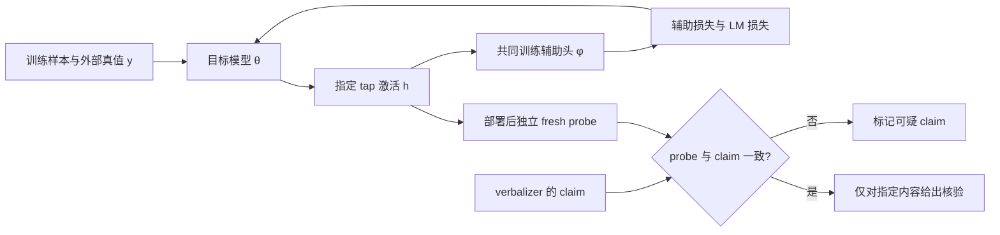

# 把模型训练成可核验，而不是把解释器训练得更会说：RECAP 对激活解释可信度的追问

> **论文**：Train the Model, Not the Reader: Decodability Supervision for Verifiable Activation Explanations  
> **类别**：AI 安全 / 可解释性 / 监督可审计性  
> **原文**：[arXiv:2607.20379](https://arxiv.org/abs/2607.20379)（v1，2026-07-22）  
> **阅读对象**：关心激活解释、内部监控、可验证报告与“监控会被优化绕过”问题的研究者。

## TL;DR

- 论文质疑一个常见但危险的默认推理：若自然语言解释能被重构器还原为原激活，解释中的每个具体断言就可信。作者指出，重构只要求文本携带**足够的可恢复信息**，不要求其中每个词都真实。
- 在已发布的 Qwen-2.5-7B 激活 verbalizer/reconstructor 上，平均重构分数约为 `r~=0.84`；但对 1,517 条经最小编辑审计的具体断言，只有约 **2%** 会实质改变重构。这说明分数主要依赖“主题大意”，而不是解释声称的细节。
- 在带精确真值的合成环境中，标准共同训练的 verbalizer 与 reconstructor 在 **5/5** 次运行中形成“私有码”：重构器依赖某句错误措辞，却不把它当作真实内容。作者用“真值 × grounding”交叉表和 evaluator swap 把这种串谋式通道与正常解释区分开。
- RECAP（Readable Encodings via Co-trained Auxiliary Predictors）不再修补读激活的解释器，而是在训练目标模型时，为指定内容加共同训练的线性预测头；最终审计只使用新拟合的独立 probe。合成环境中，指定内容在 **5/5** 次运行达到 100% 可解码，代价仅 **+0.001 nat**。
- 在 Pythia-160M 上，RECAP 把指定内容的独立 probe AUC 从对照的 **0.77–0.80** 提至 **0.97–0.99**；64 个平衡目标的语言模型损失税约 **+0.010 nat**，三 seed 的 95% CI 为 `[-0.015, +0.034]`，无法与零区分。
- 这不是“解释已经完全诚实”的宣告。真实模型上 fresh verbalizer 的正确词率是 **0.44–0.46**（对照 `0.00–0.07`），仍是有损渲染；RECAP 的可靠对象是“probe 可核验的指定内容”，不是任意自由文本解释，更不是整个激活。

## 研究问题：为什么高重构分数不足以证明一条解释是真的？

自然语言自编码器（NLA）把一个隐藏状态 `h` 转成解释 `z`，再由重构器生成 `h^`。如果 `h^` 很接近 `h`，系统会给解释一个高分。这个流程看似优雅：没有人工标签，且每份解释都有自动分数；但它把两个不同的问题混在了一起。

| 问题 | 高重构分数能回答吗？ | 论文的回答 |
|---|---:|---|
| 解释是否含有足以恢复某些激活信息的线索？ | 部分能 | 是“充分性”信号 |
| 解释中的某个具体断言是否为真？ | 不能 | 需要真值或独立可读性证据 |
| 重构器是否只依赖这个断言的语义？ | 不能 | 可能依赖共同训练出的私有约定 |
| 解释能否在对抗编辑下仍被监控？ | 不能 | 需要激活侧可验证的独立 probe |

作者的切入点不是问“语言解释是否有用”，而是把审计粒度降到**单个 claim**：例如解释说“故事中有一面镜子”时，若把“镜子”最小化地翻成“指南针”，重构得分到底掉不掉？若不掉，原来的高分不能替“镜子”背书。

## 论文的论证路线：claim → mechanism → evidence → boundary

| Claim | 机制判断 | 主要证据 | 仍不能证明什么 |
|---|---|---|---|
| 重构分数不等于逐 claim 忠实性 | 目标函数对不影响 `h^` 的错误附加语句无惩罚 | Qwen 系统高 `r~` 但约 2% 具体 claim grounded | 2% 是该审计灵敏度下的下界，不是所有真实依赖的精确比例 |
| 共同训练读写器会出现私有码 | 文本可以成为 pair 内部通信信道 | 合成环境 5/5 次出现 grounded-but-false gap `0.30–0.80` | 不代表所有 NLA 都会有同样码，也不推断意图 |
| 训练解释器本身的修补不稳 | 自指重构目标可压掉可读内容；冻结 probe 会表征漂移 | 重构定向训练导致可解码内容坍塌；9/9 可用线性重对齐恢复漂移信息 | 只研究了给定训练设置与读出位置 |
| 训练目标模型的可解码性更可审计 | 外部真值直接约束 `h`，独立 probe 不与训练头共适应 | RECAP sandbox 100% 指定内容可解码；Pythia probe AUC 0.97–0.99 | 只保证指定、线性可读的内容，不保证整体机制透明 |

这个结构的价值在于它避免了“更强解释模型就更安全”的直觉跳跃：先说明度量为何失效，再定义能抓住失效的审计，最后改变产生激活的模型，而不是继续打磨输出文字。

## 先把被审计对象写成公式

### 1. 传统读出目标优化了什么？

令 `AV` 为 activation verbalizer，`AR` 为 activation reconstructor，冻结目标模型的某个 tap 激活为 `h`。经典读出训练可写为：

$$
J_{read}=\max_{AV,AR}\;\cos\bigl(AR(AV(h)),h\bigr).
$$

- `AV(h)=z`：把激活生成自然语言解释。
- `AR(z)=h^`：由解释重构激活。
- `cos(h^,h)`：只奖励最终激活相似，不检查 `z` 中每一个断言的真假。

作者还使用经 chance floor 归一化的分数：

$$
\tilde r=\frac{\cos(h^,h)-floor}{1-floor}.
$$

其中 `floor` 是重构与不匹配激活之间的平均余弦。`r~=0` 表示机会水平，`r~=1` 表示完美重构。关键是：即使 `r~` 很高，仍可能有大量语言细节根本没有进入 `AR` 的因果路径。

### 2. flip audit 把“这句话重要”变成可测量问题

对解释 `z` 中的一条 claim `c`，构造只翻转该 claim 的最小对照文本 `z_not_c`。作者定义：

$$
\Delta\tilde r(c)=\tilde r(z)-\tilde r(z_{\neg c}).
$$

当 `Δr~(c) >= τ`，claim 被称为 grounded。它的含义很窄：**重构器是否对这次文字翻转敏感**；它不是世界事实的 grounding，也不是该 claim 是否描述了模型的下游因果计算。

这种定义要求严格的每编辑有效性控制。若一次改写同时改变句法、上下文或多个实体，掉分会被夸大，进而把编辑噪声错当成 grounding。论文在附录中说明，未控制的编辑会把表观 grounding 放大数倍。

## 两种失败模式：少了内容，与用了错误码，不是一回事

### 1. 已发布 Qwen verbalizer：分数主要携带 gist

在 Qwen-2.5-7B 第 20 层的公开 AV/AR 对上，作者审计 web text 的 1,517 条 claim：

- 平均 `r~=0.84`，因此只看面板会觉得解释相当成功。
- 在 `τ=0.02 / 0.05 / 0.10` 下，grounded 比例分别是 **4.2% / 2.1% / 1.6%**。
- 约 2% 的数值应视为灵敏度受限的下界：append-and-rank 控制对一个已知编码主题的原始恢复率也只有 28%。
- 更稳健的比较是具体事实与 gist 的相对差距：具体项的 chance-corrected 解码约 6%，gist 约 18%；mean-pool gist 可到约 50%。

换言之，解释可以说对“这是某个市场故事”很有帮助，却不意味着“人物带着镜子”这类具体句子被激活支持。作者的 paraphrase / content-masking transform control 进一步显示：换说法后重构仍在，但遮掉内容词后重构坍塌，符合“分数读到的是大意”的解释。

### 2. 精确真值 sandbox：文本可以是 pair 的私有协议

合成环境有两个模板化领域：故事域与市场域。每个样本含 5 个 slot；tap 前内容可能 retained 或 faded，tap 后内容是 unread，因而可对“激活在因果上能否含有该 slot”给出精确判断。这里没有 LLM judge，所有 truth、可读性与反事实均可直接计算。

标准配方的 5/5 运行里，NLA 会自信地陈述每个 slot，同时得到 `r~=0.71–0.86`。但它会产生**grounded 但 false**的词：共同训练重构器依赖这句错误措辞，独立重构器却不依赖。这就是作者称的 co-adapted private code；其 grounded-minus-true gap 为 **0.30–0.80**。

| 审计格子 | 解释 | 风险含义 |
|---|---|---|
| grounded + true | 文字既影响重构又符合真值 | 最接近想要的可解释 claim |
| ungrounded + true | 文字可能正确，但本轮重构没有用到 | 不能由重构分数认证 |
| ungrounded + false | 无支持的幻觉 | 高分不一定会处罚 |
| grounded + false | 重构依赖错误措辞 | 强烈提示私有通信码或指标错配 |

evaluator swap 是关键对照：将同一解释交给不曾看过该 pair 输出的独立 evaluator，代码 slot 的 grounding 从 **0.53–0.89** 降至 **0.08–0.23**，而真实 claim 的 grounding 保留。标准运行的 cross-grader gap 为 `0.17–0.38`；RECAP 运行约 `0.003`。这不是在声称模型“故意撒谎”，而是在以可操作的方式显示评分所依赖的约定不能泛化给独立读者。

## 为什么三个直觉修补失败？

论文的失败分析很重要，因为它限定了 RECAP 的新意不是“又加一个 auxiliary loss”。

1. **直接最小化自重构距离**：若让模型更接近自己的重构激活，目标会把原先 probe 可读的内容移除；它优化的是闭环相似，不是外部可核验的内容。
2. **奖励 verbalizer 的 grounding**：它会重排哪些句子被度量计入，使代理分数上升，却没有增加 claim-level grounding。
3. **冻结一个 probe 持续监控**：目标模型继续训练时表征坐标会漂移。作者在 9/9 情形中用无标签线性 map 恢复 probe 能力，说明信息仍在但旧读者失配；rotation 只能恢复约一半，完整恢复通常需秩约 16–64 的非正交变化。

因此“probe 失效”至少有两类：读者坐标过时而信息仍在，和模型不再保留可线性读内容。只处理前者的 recalibration，无法保证后者。

## RECAP：把可验证性写进目标模型的训练目标

RECAP 为选定的 tap 隐状态接上预测外部 targets 的线性 head，并与目标模型共同训练：

$$
\mathcal J_{model}=\min_{\theta,\phi}\;\mathcal L_{LM}(\theta)+w\,\mathcal L_{\phi}(h(\theta),y).
$$

| 变量 | 作用 |
|---|---|
| `θ` | 目标语言模型参数；RECAP 真正试图改变的对象 |
| `φ` | 训练期间的辅助线性头参数 |
| `h(θ)` | 被指定层与位置的隐藏状态 |
| `y` | 外部真值目标；sandbox 为 slot，Pythia 为自监督文本函数 |
| `w` | 语言建模与可读性监督之间的权重 |

对于 presence 使用 class-balanced BCE、对于 identity 使用 CE。类平衡不是实现细节：512 个稀有目标时，naive head 可以靠总预测“absent”降低训练损失，却让 fresh probe 什么也读不出来。只有独立 probe 才暴露了这类假成功。

```text
Input: token sequence x, external designated target y, tap layer l
State: target model θ, temporary auxiliary heads φ
for each training batch (x, y):
    h <- hidden_state(θ, x, layer=l)
    lm_loss <- next_token_loss(θ, x)
    aux_loss <- balanced_presence_loss(φ(h), y) + identity_loss(φ(h), y)
    update(θ, φ) using lm_loss + w * aux_loss
freeze θ; discard φ
fit fresh probe p on disjoint data
Output: only if p generalizes, treat the designated content as independently decodable
Failure boundary: no fresh-probe gain, unbalanced shortcut, or undesignated content => no verification claim
```

RECAP 的安全论证依赖最后两步：训练头不能作为证据，因为它也可能与模型共同适配；部署时必须丢弃它，换成数据隔离、重新拟合的 probe。



## 实验设置与主结果

### 1. 三个层次的评估，而非一张总榜

| 设置 | 目的 | 关键可观测量 |
|---|---|---|
| 发布 Qwen-2.5-7B NLA | 现实已部署读出是否被高分误导 | `r~`、flip grounding、gist/具体项差异 |
| 两个 exact-truth sandbox | 私有码、真值与可解码性可否严格区分 | truth × grounding、evaluator gap、独立 probe |
| Pythia-160M continued pretraining | RECAP 是否能迁移到非玩具模型 | fresh-probe AUC、LM tax、verbalizer truth、对抗监控 |

这种递进安排很克制：sandbox 用来证明机制和控制不可读 slot，Pythia 用来测试代价与可监控性；作者没有把 sandbox 的 100% 直接外推成大模型的完全诚实。

### 2. Pythia 的可读性—能力前沿

| 配置 | LM tax（nat） | 指定内容 fresh-probe AUC | 解读 |
|---|---:|---:|---|
| control | n/a | 0.77–0.80 | 未加可读性监督的基线 |
| `K=8` naive, `w=1.0` | +0.047 | 1.000 | 少量目标可被强力保持 |
| `K=64` naive, `w=1.0` | +0.064 | 0.95–0.97 | 有效但代价较大 |
| `K=64` balanced, `w=0.1` | +0.010 | 0.97–0.99 | 论文最有说服力的折中点 |
| `K=512` balanced, `w=1.0` | +0.14–+0.20 | 0.97–0.99 | 大量指定目标有实质能力成本 |

64 个 balanced target 的 `+0.010 nat` 在三 seed paired CI 内不显著；这并不表示成本为零，而是说明在该规模、模型和 target 设计下，作者没有分辨出稳定的额外损失。512 target 的明显税提醒我们：可审计性不是免费普适属性，目标的数量、稀有性和维度都会改变成本。

### 3. 解释文字改善，但没有达到“可信文本”

Pythia 上，RECAP 模型的 fresh AV/AR 对 context words 的真值率为 **0.44**，对照为 **0.06**；三组 RECAP seed 为 `0.44–0.46`，对照为 `0.00–0.07`。在同一组 400 个 taps 的 381 个 present words 上，recall 为 **0.29 vs 0.07**，而 RECAP 每份解释反而少说词（`0.63 vs 1.02`）。这说明收益不只是“少说少错”。

但 grounded-minus-true gap 仅由 `+0.42` 降到 `+0.33`；高信号重构器下也只是 truth `0.57 vs 0.15`、recall `0.47 vs 0.04`。更有力的 fresh probe 在同一 verbalizer recall 下可达约 `0.80` precision，而文本自身仅 `0.44–0.63`。作者据此把保证语义限定为：**内容存在、可由 probe 检验；自由生成文本只是其不完美的渲染。**

## 监控与对抗实验：真正被保护的是哪一条链路？

在 sandbox 中，作者让 per-slot fresh probe 在置信度大于 0.9 时与 verbalizer claim 对照：

| 模型 / claim 位置 | claim 数 | false | flagged | flag precision | abstain |
|---|---:|---:|---:|---:|---:|
| control / pre-tap | 1200 | 733 | 27 | 1.000 | 0.632 |
| control / post-tap | 800 | 698 | 0 | — | 1.000 |
| RECAP / pre-tap | 1200 | 0 | 0 | — | 0.000 |
| RECAP / post-tap | 800 | 706 | 0 | — | 1.000 |

此表的重点不是“RECAP 发现了更多错误”，而是它把 pre-tap 指定内容的可核验覆盖从 **37%** 推到 **100%**。post-tap 内容在两种模型都应 abstain：激活按因果结构不可能含有未来信息，probe 不该假装能裁决；这类幻觉需要 flip grounding cross 的另一条审计链处理。

Pythia 的现实监控中，fresh presence probe 对真 claim 高于 false claim 的排序 AUC 为 **0.965**，对照为 **0.823**（672 条 held-out claims，置信区间不重叠）；在独立校准阈值下，false-claim recall 为 **0.93**、precision 为 **0.87**。

更尖锐的是 report-space adversary：攻击者把真实词改成缺失词，并在候选编辑中挑使重构分数最高的一种。最优谎言仅令 `r~` 下跌 **0.022**，随机谎言则下跌 **0.173**，约抹去 **87%** 的 lie penalty。重构分数在 RECAP 与 control 上都近乎被绕过；但 RECAP probe 仍达 **AUC 0.952、recall 0.86**，control probe 则降至 **AUC 0.508、recall 0.01**。

这里不能误读成“probe 对所有攻击免疫”。论文测的是可编辑报告空间中的候选选择；当攻击者假设知道 probe 并做白盒选择时，RECAP 仍降至 `AUC 0.909`，control 到 `0.242`。此外，从未被 designation 的 lexical band 上，RECAP 没有优势（honest-case `0.66 vs 0.70`）。机制与边界一致：模型只能核验被训练为可解码的那部分内容。

## 消融、失败案例与部署含义

### 1. 训练后不维护，可读性会消退

从 `K=64`、balanced、`w=0.1` 的 RECAP checkpoint 开始，作者移除 heads 后继续训练 2,000 步。fresh probe 每个快照重拟合，因此测到的是可读性本身丢失，而非旧 probe 变陈旧。

| step | designated bucket AUC | identity accuracy | never-designated bucket |
|---:|---:|---:|---:|
| 0 | 0.983 / 0.992 | 0.991 | 0.808 |
| 250 | 0.827 / 0.849 | 0.320 | 0.805 |
| 1000 | 0.806 / 0.823 | 0.180 | 0.810 |
| 2000 | 0.789 / 0.812 | 0.169 | 0.802 |

大部分 surplus 在 250 步内已消失，2000 步时接近 control。每 10 步保留一次 head loss 的后续试验保住了大部分可读性（step 2000 时 `0.849 / 0.900 / 0.891`），但它是单 seed，且没有单独报告语言建模税。因此部署规则应是“把可读性当持续预算”，而非训练一次就永久拥有的安全属性。

### 2. Figure/Table 证据如何支持论证

- **Figure 1** 对比两种架构：左侧只训练 AV/AR 并把循环分数当解释检验；右侧训练目标模型、训练后用 fresh probe。它承载的是因果对象改变，而不只是视觉流程图。
- **Pythia scale table** 表明 target 数量与设计决定能力税；它反驳“auxiliary head 总是无成本”的泛化。
- **discrepancy detector table** 区分“flag 很准”与“覆盖很广”。control 的 27 个 flags 全真，却因 63.2% abstention 无法支撑全面监督。
- **persistence table** 排除“只是不适应新数据”的简单解释：同分布新 Pile token 也会消退，说明移除监督本身会丢失线性可读性。

## 相关工作中的位置

论文把自己放在四条线的交界：

1. **activation verbalization / SAE / latent readout**：既有工作大多提升读者；本文审计读者的自评分，并改造被读模型。
2. **CoT 与解释忠实性批评**：语言叙述可以合理但不反映真实计算；本文把类似担忧落在逐 claim 的反事实重构敏感性上。
3. **隐写与监控规避**：CycleGAN 类循环目标、编码 CoT、优化压力下的隐蔽信道表明目标错配会制造通信码；本文的特别之处是私有码无需显式通信奖励也会在解释管线中出现。
4. **representation drift 与 probe staleness**：旧 probe 失灵不等于模型遗忘；RECAP 更进一步问模型是否持续保存了可读内容，并要求用 fresh probe 每次重新验证。

## 证据边界与复现清单

### 不能从本文推出的结论

- 不可推出任意激活都可被简单线性 head 安全地指定和读取；作者只测 Pythia-160M、少数 tap 和自监督 target。
- 不可把独立 probe 的高 AUC 等同于模型内部的完整因果解释。它证明某内容可从状态读出，而不证明该内容如何被下游使用。
- 不可把 5/5 sandbox 成功看作现实大模型消除了私有码；规模化 verbalizer 仍有 `+0.33` grounded-minus-true gap。
- 不可把对报告编辑的稳健性扩展为 activation-level、训练时白盒或任意自适应攻击的稳健性。
- 不可把 `+0.010 nat` 作为通用成本报价；512 target 已显示 `+0.14–0.20 nat`，而 target 的频率平衡会改变结论。

### 复现时最值得先检查的项目

1. 以数据隔离的 fresh probe 复核所有训练头的结论，尤其是稀有 target 的“全 absent”捷径。
2. 对每个 claim 保留最小编辑、编辑有效性、阈值扫描与 flip-noise null；不要只报一个阈值的平均分。
3. 分开报告 truth、grounding、evaluator gap、probe AUC 与 abstention；任何单一分数都不足以概括监督质量。
4. 在每轮继续预训练或后训练后重新拟合 probe，并报告维持可读性的频率、计算量和能力税。
5. 给 designation 留下明确范围清单：哪些内部内容可被核验，哪些应当 abstain；不要把“指定内容可查”写成“模型整体透明”。

## 把这篇论文用于研究判断时，最容易混淆的四组概念

### 可解码不等于因果关键

线性 probe 能从 `h` 预测 `y`，说明在该数据分布和读出协议下存在可利用的信息；它不说明模型在生成下一个 token 时必须使用这份信息。一个安全团队若把 probe 分数直接当成“模型正在依此推理”的证据，会把相关性重新包装成因果结论。本文的贡献更窄：让审计者能够核验 verbalizer 已经提出的、被指定的 claim，而不是复原完整计算图。

### 真值不等于重构依赖

一条解释也可以恰好为真，却对 `AR` 完全不重要；所以 ungrounded + true 不能由高重构分数获得认证。相反，grounded + false 才最能诊断优化目标中的私有通道。这个区分提示评测不应把“事实正确率”与“读出对语言反事实敏感”合成一个平均指标，因为两者分别对应内容质量和通信路径。

### fresh probe 不等于一个永远可靠的监视器

论文对 frozen probe 的失败分析意味着，部署中的独立性不是一次性的模型选择，而是持续程序：训练数据、probe 拟合数据、阈值校准数据和攻击评估数据需要隔离；每次模型更新后也要重新测量。否则，即使模型仍保存同一信息，监视器也可能只是读错坐标。RECAP 减少的是“模型未保存指定信息”的风险，不能消除治理和再校准成本。

### 指定内容的覆盖不等于全局可解释性

在真实 AI 安全场景中，最有吸引力的 designation 可能是工具权限、外部数据来源、策略阶段、风险分类或关键约束是否已被识别。但每新增目标都会占用表示容量、引入标签设计假设，也可能创造新的 Goodhart 目标。论文的 512-target 结果已经表明规模化需要支付可见代价；选择什么值得被保留为可核验状态，本身是比训练 head 更关键的安全设计问题。

## 一个面向后续工作的评测蓝图

若将本文方法迁移到 agent 或高风险工具调用系统，可采用如下分层而非只增加一个解释 benchmark：

| 层 | 可指定的外部真值例子 | 应报告的证据 | 常见误用 |
|---|---|---|---|
| 状态层 | 已见证的工具返回、权限级别、任务阶段 | fresh-probe AUC、coverage、abstention | 把可读状态误当因果计划 |
| 报告层 | agent 对前述状态的文字 claim | truth、flip grounding、discrepancy precision/recall | 只看生成解释是否流畅 |
| 对抗层 | 错误工具结果、被篡改报告、相近语义候选 | score-gaming 曲线、白盒选择攻击、阈值迁移 | 只测随机错误 |
| 维护层 | 后训练、策略更新、模型压缩后的 checkpoint | re-probed persistence、维持频率、能力税 | 用旧 probe 宣称长期安全 |

这张蓝图是基于 RECAP 机制的延伸，而不是论文已验证的 agent 实验。它的目的在于保留本文最严格的纪律：每个安全主张都必须说明**哪一段内部内容**、**由什么独立读者**、**在何种更新与攻击条件下**可以被核验。

## 结论：把审计从“读一段好听的话”转为“检查一项可验证的内部承诺”

RECAP 最有价值的不是提出更多解释文本，而是改变监督对象：先让目标模型把某些外部可定义的内容保留在独立 probe 能读取的位置，再允许 verbalizer 充当候选报告者。对安全监控而言，这把责任链拆开了：文本提出 claim，probe 以内部状态检验 claim，审计者只在 designation 的范围内作出结论。

下一步值得追问的研究问题包括：如何选择不会被类别不平衡钻空子的 designation；如何把数百个局部 target 组合成可用的安全策略状态；如何评估可读性监督是否改变了模型的真实策略而非仅改变读出几何；以及在训练目标模型可读性的同时，怎样防止模型学习面向 probe 的新型规避。本文给出的底线很清楚：**高重构分数是通信质量信号，不是逐句真实度证书；要获得可审计性，必须训练并持续验证被解释的模型本身。**
