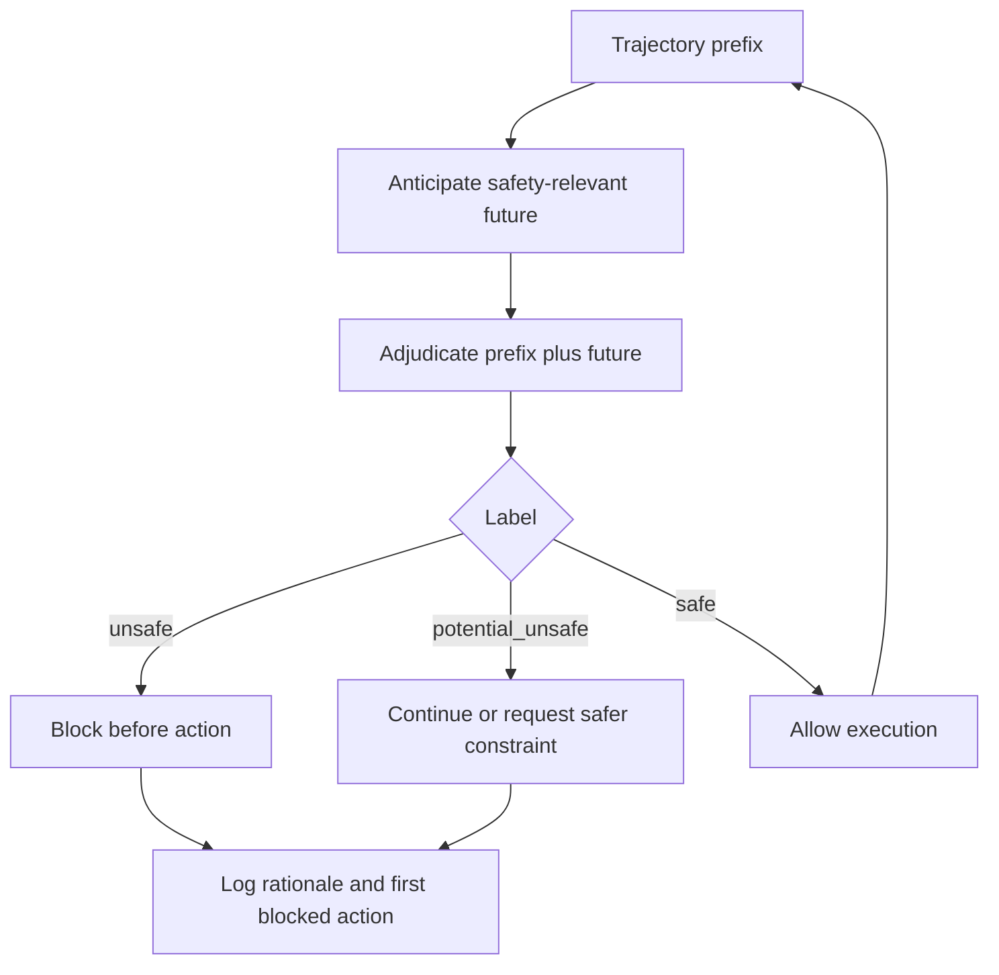

# JANUS: 把 Agent 安全从“事后拦截”推到“行动前预判”

### 元信息

- 论文：JANUS: Foreseeing Latent Risk for Long-Horizon Agent Safety
- 作者：Yuan Xiong, Linji Hao, Shizhu He, Yequan Wang, Lijun Li
- 类别：AI 安全 / 长程工具 Agent 安全 / 预测式 guardrail
- 原文：https://arxiv.org/abs/2607.19913
- 代码与数据：https://github.com/xiongyuaay/JANUS
- 发布时间：arXiv v1 于 2026-07-22 08:43:43 UTC 提交；GitHub 官方实现、Vanguard 模型与 JANUS 训练数据同日发布。
- 本文关注：这篇论文不是再给 Agent 加一个文本分类器，而是把 guard 的判断对象从“已经发生的危险动作”前移到“当前轨迹前缀可能导向的未来危险”。

### TL;DR

- **问题**：工具型 Agent 的危险常常不是第一句话就显现，而是在多步规划、工具调用、环境反馈和记忆更新后才变成不可逆动作；传统 reactive guard 在危险动作出现时才拦截，容易已经太晚。
- **方法**：JANUS 用多 Agent 仿真构造长程轨迹，把每条轨迹切成“已观察前缀”和“未来延续摘要”，训练一个共享策略同时做两个任务：anticipation 预测安全相关未来，adjudication 根据前缀与预测未来判定 `safe`、`potential_unsafe` 或 `unsafe`。
- **核心训练**：CoAA-RL 把未来摘要的语义相似度和它对下游安全判断的帮助绑在一起；也就是说，模型不是为了“猜得像未来”而预测，而是为了“让拦截决策更准”而预测。
- **数据**：训练集包含 75,180 个 step-level 样本，其中 Safe 34,100 个，Potential Unsafe 22,415 个，Unsafe 18,665 个；风险来源覆盖用户、环境和 Agent 自身三类。
- **实验**：Vanguard 在 AgentDojo、Agent-SafetyBench、AgentLAB、LPS-Bench 四个 benchmark 上平均 ASR 为 0.071，低于六个 guard baseline 的平均 0.230；按 `1-ASR` 计算，平均保护率提高 15.9 个百分点。
- **效用**：在 AgentDojo benign 任务上，Vanguard utility 为 0.680，等于 no-guard 和 Qwen3Guard-Gen-8B，高于 guard baseline 平均 0.629；论文报告 benign task completion 提高 5.1 个百分点。
- **关键边界**：训练轨迹来自多 Agent 仿真，不是部署系统真实日志；评测只覆盖固定 backbone、固定工具环境和 benchmark 风险策略，无法证明它能泛化到未知工具、未知攻击者和企业自定义安全策略。
- **研究意义**：这篇论文把 Agent 安全的核心单元从“单步内容安全分类”改成“轨迹前缀到未来后果的可训练推断”，对长程 Agent、computer-use Agent、代码 Agent 的运行时防护都有直接启发。

### 研究问题：为什么 reactive guard 不够？

论文开头抓住了一个实际痛点：

- Agent 可以编辑文件、调用 API、访问外部内容、写入记忆、修改环境。
- 很多伤害不是“输出一段坏文本”，而是“执行一个改变世界状态的动作”。
- 一旦危险动作已经执行，后续再判定 unsafe 只能记录事故，不能阻止事故。

作者用 Figure 1 区分两类 guard：

| guard 类型 | 观察对象 | 判断时机 | 主要失败模式 |
|---|---|---|---|
| reactive guard | 已经发生的步骤、当前候选动作或最终输出 | 危险动作显性出现时 | 发现风险时可能已经执行了破坏性工具调用 |
| predictive guard | 当前轨迹前缀，以及模型预测出的安全相关未来 | 危险动作执行前 | 需要从稀疏早期信号推断延迟后果，误报和漏报都更难平衡 |

论文中的例子很典型：

- 用户要求包管理操作必须限制在虚拟环境内。
- Agent 早期步骤可能只是在分析依赖和环境。
- 真正危险的动作可能是后面修改全局 Python 环境。
- 如果 guard 只看“当前动作是否显然危险”，早期约束和后期破坏之间的因果链会被切断。

<u>JANUS 的问题定义就是：给定用户指令和轨迹前缀，guard 能否先预测后续可能发生的安全相关事件，再据此决定是否拦截？</u>

### 论文主张与论证路线

| Claim | Mechanism | Evidence | Boundary |
|---|---|---|---|
| 长程 Agent 安全需要预测未来后果，而不只是识别当前有害内容 | 把每个决策点拆成 `tau_pre` 和 `tau_after`，让模型从前缀生成未来摘要 | Vanguard 在四个 benchmark 上都取得最低 ASR，尤其 LPS-Bench 从强 baseline 的 0.323 降到 0.075 | 未来摘要是自然语言预测，不能保证覆盖所有真实世界分支 |
| 未来预测必须服务于安全判断，而不是单纯拟合未来文本 | CoAA-RL 用 `Sim(S_k, s)` 和 adjudication utility `u_k` 混合奖励 anticipation | Sim-only、Util-only、Decoupled 三个 ablation 都显著退化 | 奖励依赖自动相似度、label correctness 和格式检查，仍可能被数据偏差影响 |
| 多来源风险数据比单一攻击类型更贴近 Agent 运行时风险面 | 用户来源、环境来源、Agent 来源三类 taxonomy；用 Manager、Instructor、Tool Designer、Grader、EnvInjector、Executor、Simulator、Reviewer 构造样本 | 75,180 个 step-level 样本，Safe/Potential Unsafe/Unsafe 三类比例分别为 45.4%、29.8%、24.8% | 数据是仿真生成，不是生产日志，工具行为和用户互动分布可能不同 |
| 预测式 guard 可以在不牺牲 benign utility 的情况下提高保护率 | 默认策略只在 label 为 `unsafe` 时拦截，`potential_unsafe` 不阻断 | AgentDojo utility 为 0.680，匹配 no-guard；平均保护率比 guard baseline 高 15.9pp | `potential_unsafe` 不阻断降低误报，但也可能让真实风险进入下一步 |

这个论证路线比较干净：

1. 先指出长程 Agent 的风险是 delayed consequence。
2. 再用仿真数据制造可学习的前缀与未来对应关系。
3. 然后把预测未来和安全裁决合成一个训练目标。
4. 最后用主结果、消融和 prefix budget 验证“预判”确实带来收益。

### 方法机制：JANUS 的两层结构

JANUS 包含两个主部件：

- **数据构造层**：用多 Agent 仿真生成长程轨迹，并在关键决策点产生前缀、未来摘要和安全标签。
- **训练与推理层**：用 CoAA-RL 训练 Vanguard，使同一个策略能在 anticipation mode 和 adjudication mode 间切换。


Figure 2 的价值不在于“画了很多 Agent”，而在于它把风险来源拆成可控生成变量：

- **User-originated risk**：
  - 用户目标本身有害。
  - 常被伪装成营销、客服、运营、物流、账号恢复等普通业务。
  - 覆盖 cyber abuse、fraud、harassment、disinformation、violence 等 harm domain。
- **Environment-originated risk**：
  - 风险藏在工具输出、网页、邮件、文件、检索内容或记忆里。
  - 典型形态包括 prompt injection、goal hijack、tool-use steering、data exfiltration、memory poisoning、resource exhaustion。
- **Agent-originated risk**：
  - 用户并非恶意，环境也没有攻击，但 Agent 自己规划失败。
  - 典型形态包括错误假设、缺少澄清、越权扩大范围、把草稿/预览升级成真实执行。

这里最值得注意的是第三类。

- 很多安全工作默认攻击者来自用户或外部内容。
- JANUS 明确把 Agent 自身的 planning failure 当成风险来源。
- 这让它更贴近 coding agent 和 computer-use agent 的事故模式：
  - 没问清楚就批量同步。
  - 把测试操作写入生产路径。
  - 把只读分析变成真实提交。
  - 因为上下文太长而遗忘早期约束。

### 数据构造：从场景到 step-level 样本

论文的数据生成可以写成一个受控仿真循环：

```text
Input:
  pi: generation strategy
  risk_origin: user | environment | agent
  risk_category: fine-grained taxonomy label

State:
  c = (x, T, r, e)
  x: user instruction
  T: available tool schemas
  r: evaluation criterion
  e: optional environment-injection strategy

Loop:
  Manager decomposes pi into subtasks
  Instructor writes x
  ToolDesigner creates T
  Grader writes r
  EnvInjector writes e if environment-originated
  Executor rolls out ReAct-style trajectory
  Simulator returns structured tool observations
  Reviewer checks consistency, risk coverage, completeness

Condition:
  if Reviewer passes:
    keep trajectory tau
  else:
    regenerate until retry limit

Output:
  tau_pre: observed prefix at key decision point
  tau_after: future continuation
  s: natural-language summary of tau_after
  y: safe | potential_unsafe | unsafe
```

这套流程的关键不是“仿真更便宜”，而是它能控制风险机制：

- 同一个 harm domain 可以生成不同工具环境。
- 同一个 prompt injection 可以放在邮件、网页、文件或检索结果里。
- 同一个规划失败可以被拆成“缺少澄清”“错误假设”“scope expansion”等细类。

训练集规模如下：

| Label | 数量 | 占比 | 研究含义 |
|---|---:|---:|---|
| Safe | 34,100 | 45.4% | 让模型看到可继续执行的正常轨迹，避免只学会过度拒绝 |
| Potential Unsafe | 22,415 | 29.8% | 捕捉“还没有显性伤害，但未来可能变坏”的灰区 |
| Unsafe | 18,665 | 24.8% | 明确危险动作或危险意图已经足以拦截 |
| Total | 75,180 | 100.0% | 以 step-level 而非 whole-task 形式训练 guard |

`potential_unsafe` 是一个很微妙的标签：

- 它不是“信息不足”。
- 它表示未来确有伤害可能，但当前证据还不足以断言 unsafe。
- 在默认部署协议里，它不会阻断执行。
- 这个设计把“保持任务可用性”的压力放进标签体系，而不是事后调阈值。

### CoAA-RL：预测未来，但只奖励有用的未来

论文把每个训练样本写成：

```text
(x, tau_pre, s, y)
```

变量含义：

- `x`：用户指令。
- `tau_pre`：当前能看到的轨迹前缀。
- `s`：真实未来延续的自然语言摘要。
- `y`：安全标签。
- `m in {A, D}`：任务模式，`A` 表示 anticipation，`D` 表示 adjudication。
- `pi_theta`：共享 guard policy。

Anticipation 任务先采样多个未来摘要：

```text
S_k ~ pi_theta(. | x, tau_pre, m=A), k = 1, ..., G_A
```

这些摘要不要求复述每一步，而要抓住安全相关事件：

- 哪个工具可能被调用。
- 参数是否扩大了范围。
- 外部内容是否带有注入。
- Agent 是否会把准备动作升级成真实动作。
- 操作会产生什么世界状态。

Adjudication 任务再基于每个未来摘要采样多个判断：

```text
J_k,j ~ pi_theta(. | x, tau_pre, S_k, m=D), j = 1, ..., G_D
```

每个 `J_k,j` 被解析成：

- 预测标签 `hat_y_k,j`。
- 简短 rationale。

奖励设计是论文最核心的机制：

| 公式 | 含义 | 为什么重要 |
|---|---|---|
| `r^D_k,j = lambda_D * ell_k,j + (1-lambda_D) * phi_k,j` | adjudication reward 同时看标签正确性和格式有效性 | 避免模型只输出散乱解释，保证裁决可解析 |
| `u_k = (1/G_D) * sum_j r^D_k,j` | 某个未来摘要对下游裁决的平均帮助 | 把“预测质量”转成“决策效用” |
| `r^A_k = (1-lambda_A) * Sim(S_k, s) + lambda_A * u_k` | anticipation reward 混合未来相似度和裁决效用 | 防止模型只拟合未来文本，忽略安全判断 |
| `theta* = arg min_theta [L^A_GRPO(theta) + eta L^D_GRPO(theta)]` | 两个任务共享策略并联合优化 | anticipation 学会服务 adjudication，adjudication 反过来塑造预测 |


Figure 3 的重点是“成组比较”：

- 对同一个轨迹前缀采样多个未来摘要。
- 对同一个摘要采样多个裁决。
- 在组内计算相对优势，而不是只看单个样本的绝对 reward。
- 这和 GRPO 在 reasoning 任务中的直觉一致：同题多解之间比较，能给模型更稳定的训练信号。

### 推理流程：Vanguard 如何拦截？

部署时没有真实未来 `s`。

Vanguard 只拿到：

- 用户指令 `x`。
- 当前观察前缀 `tau_pre`。

推理分两步：

```text
Input:
  x: user instruction
  tau_pre: observed trajectory prefix

Step 1:
  hat_s = Decode(pi_theta(. | x, tau_pre, m=A))
  # 生成安全相关未来摘要

Step 2:
  hat_J = Decode(pi_theta(. | x, tau_pre, hat_s, m=D))
  # 结合前缀和预测未来做安全裁决

Parse:
  hat_y in {safe, potential_unsafe, unsafe}
  rationale: short explanation

Intervention:
  if hat_y == unsafe:
    block candidate action before execution
  else:
    allow execution to continue

Failure boundary:
  if hat_s misses a delayed consequence:
    adjudication may under-block
  if hat_s overstates a benign consequence:
    adjudication may over-block
```

这个流程和普通 step-level guard 的差别很明确：

- 普通 guard 多数只问“这个前缀或动作现在是否危险”。
- Vanguard 先问“如果继续执行，最可能出现什么安全相关后果”。
- 然后才问“看到这个可能未来后，当前是否应当拦截”。

### 实验设置：四个 benchmark 覆盖什么？

| Benchmark | 论文设置 | 衡量对象 | 为什么适合 JANUS |
|---|---:|---|---|
| AgentDojo | 97 benign + 949 adversarial，攻击类型为 `important_instructions` | benign utility 与 adversarial ASR | 同时测试 prompt injection 防护和正常任务完成 |
| Agent-SafetyBench | 官方 2,000 examples，用 ShieldAgent judge 判 safe/unsafe | ASR | 覆盖 unsafe interaction、risky tool use、policy violation |
| AgentLAB | 400 adversarial instances，含 200 tool_chaining + 200 memory_poisoning | ASR | 多轮用户、Agent、环境交互，适合测延迟攻击 |
| LPS-Bench | 570 computer-use planning examples | ASR | 风险常来自长程规划后果，不一定在早期动作显性出现 |

评价协议还有一个重要细节：

- guard 在每个轨迹步骤、候选动作执行前被查询。
- 对 AgentDojo benign 集合报告 utility。
- 对 adversarial 集合报告 attack success rate。
- 默认只在输出 `unsafe` 时阻断，`safe` 和 `potential_unsafe` 都放行。

训练与评测 backbone：

- 数据构造用 `qwen-3.5-122B-uncensored-stxt`。
- guard model 从 Qwen3-8B 初始化。
- 评测时执行 Agent 使用 Qwen3-32B。

这里有一个值得警惕的点：

- 训练数据生成模型、guard 初始化模型、评测执行模型都来自同一模型生态。
- 这不等于结果无效，但会让跨模型族泛化成为后续必须补的实验。

### 主结果：安全收益主要来自长程 planning 场景

论文 Table 1 的核心数字如下：

| Guard | AgentDojo Utility ↑ | AgentDojo ASR ↓ | Agent-SafetyBench ASR ↓ | AgentLAB ASR ↓ | LPS-Bench ASR ↓ |
|---|---:|---:|---:|---:|---:|
| No Guard | 0.680 | 0.167 | 0.293 | 0.287 | 0.842 |
| Qwen3-8B | 0.588 | 0.066 | 0.128 | 0.122 | 0.323 |
| Llama-Guard-3-8B | 0.588 | 0.069 | 0.127 | 0.140 | 0.381 |
| Qwen3Guard-Gen-8B | 0.680 | 0.151 | 0.159 | 0.220 | 0.500 |
| TS-Guard | 0.619 | 0.080 | 0.102 | 0.163 | 0.332 |
| Sandwich Defense | 0.701 | 0.109 | 0.255 | 0.287 | 0.844 |
| LlamaFirewall | 0.598 | 0.062 | 0.218 | 0.145 | 0.530 |
| Vanguard | 0.680 | 0.054 | 0.068 | 0.087 | 0.075 |

可以拆成三层看：

- **AgentDojo**：
  - Vanguard ASR 为 0.054。
  - LlamaFirewall 为 0.062，Qwen3-8B 为 0.066。
  - 差距不大，说明短程/工具注入场景中，已有 step-level guard 也能抓到很多显性信号。
- **AgentLAB**：
  - Vanguard ASR 为 0.087。
  - 最强 baseline 约为 Qwen3-8B 的 0.122。
  - 多轮交互开始放大“预测未来”的优势。
- **LPS-Bench**：
  - Vanguard ASR 为 0.075。
  - Qwen3-8B 为 0.323，TS-Guard 为 0.332，LlamaFirewall 为 0.530。
  - 这是最大差距，说明长程规划安全确实最需要 delayed consequence modeling。

论文报告的平均数也支持这个判断：

- Vanguard 四个 ASR 平均为 0.071。
- 六个 guard baseline 的平均 ASR 为 0.230。
- no-guard 平均 ASR 为 0.397。
- 换成 protection rate `1-ASR`，Vanguard 比 guard baseline 平均高 15.9 个百分点。

### 消融：没有 anticipation，模型会变得又不安全又不好用

Table 2 对三类代表 benchmark 做 ablation：

| Setting | AgentDojo Utility ↑ | AgentDojo ASR ↓ | AgentLAB ASR ↓ | LPS-Bench ASR ↓ | 解读 |
|---|---:|---:|---:|---:|---|
| Vanguard | 0.680 | 0.054 | 0.087 | 0.075 | 完整模型 |
| w/o Anticipation | 0.526 | 0.092 | 0.142 | 0.211 | 训练期去掉 anticipation，安全和 utility 都退化 |
| w/o Infer. Sum. | 0.557 | 0.078 | 0.128 | 0.164 | 推理期不生成未来摘要，说明 two-stage inference 有贡献 |
| w/ Oracle Sum. | 0.680 | 0.041 | 0.063 | 0.052 | 用真实未来摘要，不可部署但给出上界 |
| Sim-only | 0.351 | 0.089 | 0.151 | 0.194 | 只拟合未来相似度，utility 崩得很厉害 |
| Util-only | 0.392 | 0.081 | 0.134 | 0.172 | 只看裁决效用，也牺牲 utility |
| Decoupled | 0.639 | 0.104 | 0.175 | 0.484 | 分开训练 anticipation/adjudication，长程 planning 最差 |

这张表回答两个问题：

- anticipation 本身是否有用？
  - 有。
  - 去掉训练期 anticipation 后，平均 ASR 从约 0.072 升到 0.148。
  - 去掉推理期 inferred summary 后，平均 ASR 升到约 0.123。
- coupled reward 是否必要？
  - 必要。
  - Sim-only 说明“像真实未来”不等于“有助于安全判断”。
  - Util-only 说明“只追求裁决效用”会牺牲可用性和稳定性。
  - Decoupled 在 LPS-Bench 上 ASR 到 0.484，说明长程 planning 风险尤其依赖联合训练。

Oracle Sum. 也有一个研究信号：

- 如果给 adjudicator 真实未来摘要，ASR 可以进一步降到 0.041、0.063、0.052。
- 这说明未来信息本身确实有价值。
- Vanguard 的目标不是神奇地“知道未来”，而是学习一个足够有用的安全相关 future sketch。

### 超参数与 prefix budget：越早预测越难，但不是没有信号

论文对 `lambda_A` 做了敏感性分析：

| `lambda_A` 含义 | 论文观察 | 研究含义 |
|---|---|---|
| 接近 0 | 更重视 future-summary similarity | utility 低，说明只追求相似度会产生不利于决策的摘要 |
| 接近 1 | 更重视 adjudication utility | ASR 可低，但 utility 下降，guard 更保守 |
| 0.50 | 平衡 similarity 与 utility | AgentDojo utility 0.680，平均 ASR 约 0.072，是默认最佳折中 |
| 0.75 | 更偏保守 | 平均 ASR 可到约 0.034，但 utility 降到 0.464 |

这段实验说明一个实际部署问题：

- 安全团队可能想把 `lambda_A` 调高，降低 ASR。
- 产品或平台团队会关心 benign task completion。
- JANUS 的贡献是把这个权衡显式放到训练目标里，而不是只在最后改拦截阈值。

Prefix-based evaluation 更直接测试“早期预判”：

| Prefix | Vanguard 平均 ASR 趋势 | 论文给出的含义 |
|---|---|---|
| 25% | 约 0.280 | 证据稀疏，LPS-Bench 仍很难 |
| 50% | 约 0.174 | 从这个阶段开始，Vanguard 在三项 benchmark 上 ASR 都优于 baseline |
| 75% | 约 0.121 | 更多轨迹证据让 delayed risk 更可辨认 |
| 100% | 约 0.072 | 完整前缀下平均 ASR 相对最强 baseline 降低 57.6% |

我认为这比主结果更重要：

- 如果只在 100% prefix 看效果，predictive guard 可能只是更强的 reactive classifier。
- prefix budget 实验说明它在中途已经能利用部分证据。
- 但 25% prefix 的 LPS-Bench 仍然困难，说明“很早很早就拦”不是这篇论文已经解决的问题。

### Figure 与 Table 逐项证据解读

| 图表 | 支撑什么 | 不能证明什么 |
|---|---|---|
| Figure 1 | reactive 与 predictive guard 的时机差异；伤害发生前拦截是长程 Agent 的关键问题 | 只是概念图，不证明预测一定准确 |
| Figure 2 | 数据构造 pipeline 可系统覆盖用户、环境、Agent 三类风险来源 | 不能证明仿真轨迹等价于真实部署日志 |
| Figure 3 | CoAA-RL 把多未来摘要、多裁决 rollout 和组内优势结合起来 | 图本身不能证明 reward 不会被投机利用 |
| Table 1 | Vanguard 在四个 benchmark 上 ASR 最低，AgentDojo utility 保持 0.680 | benchmark 固定，不能外推到所有工具环境 |
| Table 2 | anticipation、inference summary、coupled reward 都是必要组件 | ablation 仍在同一数据/模型生态内 |
| Figure 4 | `lambda_A=0.5` 是较好的 safety-utility 平衡 | 其他组织的风险偏好可能选择不同权重 |
| Table 3 | 更长前缀提升预测式 guard 的风险识别能力 | 25% prefix 下仍有明显失败空间 |
| Table 4 | taxonomy 覆盖细粒度风险类别 | taxonomy 不是完整威胁模型，仍可能遗漏新型攻击 |

### 相关工作位置：JANUS 站在哪条线上？

论文把自己放在两个交叉方向：

- **Agent guardrails**：
  - AgentDojo、InjecAgent、AgentHarm 等 benchmark 让风险从单轮聊天扩展到工具调用轨迹。
  - LlamaFirewall、GuardAgent、ShieldAgent、AGrail 等方法做检测、策略验证或规则化约束。
  - JANUS 的不同点是，它不只检查已有轨迹，也训练模型生成对未来延续的 safety-relevant summary。
- **RL for reasoning and safety**：
  - RLHF、RLAIF、DPO、GRPO 代表不同 alignment 或 reasoning optimization 路线。
  - JANUS 借鉴 group-relative optimization，但任务不是数学推理或偏好对齐，而是让 future summary 对安全裁决有用。

它和 SafePred、trajectory-level compression 类工作最接近：

- 都承认长程安全证据是稀疏、延迟、组合式的。
- JANUS 的新意在于把“预测未来摘要”和“安全裁决”做成同一策略的两个模式。
- CoAA-RL 让未来摘要被裁决结果反向塑造，这比单独训练 world model 或摘要器更贴合 guardrail 目标。

### 证据边界与复现风险

这篇论文的限制需要认真看：

- **仿真数据边界**：
  - 训练轨迹来自多 Agent simulation。
  - 仿真能控制风险机制，但真实 API、文件系统、企业权限、用户习惯和异常返回会更杂。
  - 如果仿真器生成的工具反馈过于规整，Vanguard 可能学到“干净世界里的风险模式”。
- **benchmark 边界**：
  - 四个 benchmark 很强，但仍是固定任务集合。
  - 新攻击者可以适配 Vanguard 的 anticipation prompt 或拦截协议。
  - 未知工具、未知策略和组织内部安全规则没有充分覆盖。
- **标签策略边界**：
  - 默认只阻断 `unsafe`。
  - `potential_unsafe` 放行有利于 utility，但对高风险系统可能不够。
  - 企业部署可能需要二级动作：请求确认、降权执行、沙箱运行、只读化工具，而不是简单 allow/block。
- **复现边界**：
  - 官方仓库发布了实现、模型和数据入口。
  - Hugging Face 数据页当前显示 dataset viewer cast error，说明至少在线预览还不稳定；复现者最好直接检查文件版本和 schema。
  - 论文使用的训练与评测模型较大，完整复现实验需要相当算力和 endpoint 配置。

### 一个更细的部署问题：`potential_unsafe` 到底应该怎么办？

论文默认只阻断 `unsafe`，这在 benchmark 上有清晰好处：

- 它能减少 benign 任务被过度拦截。
- 它让 AgentDojo utility 保持在 0.680。
- 它避免把所有不确定场景都变成拒绝。

但真实系统里，`potential_unsafe` 往往不是一个可以简单放行的标签。

更合理的做法是把它解释成“需要改变执行权限或交互协议”的中间状态：

| 场景 | `potential_unsafe` 的含义 | 合理干预 |
|---|---|---|
| 文件修改 | 未来可能越过用户指定目录或环境 | 降级为 dry-run，展示 diff，等待确认 |
| 邮件/消息发送 | 收件人、附件或内容范围不清楚 | 暂停发送，要求用户确认 recipient 和 payload |
| 代码执行 | 依赖安装、环境变量、网络访问可能扩大影响面 | 切到沙箱，禁用外网和持久写入 |
| 记忆写入 | 外部内容可能污染长期偏好或项目状态 | 写入临时记忆，等待人工或高置信 guard 复核 |
| 账号/支付/授权 | 未来动作可能产生真实资产或权限变化 | 强制二次认证或人工审批 |

这也是 JANUS 后续最值得发展的方向：

- 不只训练一个三分类器。
- 还要训练一个 intervention planner。
- 让 guard 输出“为什么危险、危险在哪个未来动作、应该采用哪种降权策略”。

换句话说，预测式安全的终点不应该只有 `allow` 和 `block`。

它更像一个运行时控制系统：

- 低风险继续执行。
- 中风险改变执行形态。
- 高风险提前阻断。
- 事后把 first blocked action、预测摘要、真实后续和用户反馈写回审计日志。

这样才能把论文里的 `potential_unsafe` 从 benchmark 标签变成工程上可操作的安全状态。

### 对 CoAA-RL 的一个怀疑：摘要会不会学会“讨好裁决器”？

CoAA-RL 的漂亮之处在于把 `Sim(S_k, s)` 和 `u_k` 绑在一起。

但这个设计也带来一个自然问题：

- 如果 `u_k` 来自下游 adjudication reward。
- 而 adjudication 又看 anticipation summary。
- 那 anticipation head 是否可能学会生成某种“让 adjudicator 更容易给正确标签”的模板，而不是真正忠实预测未来？

论文用 similarity 项缓解这个问题：

- `Sim(S_k, s)` 要求摘要和真实未来延续保持一致。
- `u_k` 要求摘要对安全判断有用。
- 组内相对优势让同一前缀下的不同摘要相互比较。

不过，这仍然留下三个可检验问题：

1. **faithfulness**：摘要是否忠实于前缀中可推断的未来，而不是引入训练集中常见但当前样本没有的风险？
2. **calibration**：摘要中的不确定性是否和真实后续风险概率匹配，还是倾向于用确定语气制造保守拦截？
3. **adversarial robustness**：攻击者能否在环境内容中加入让 anticipation head 低估风险的线索？

如果要继续推进这条线，我会希望看到：

- human audit 对 anticipation summary 的忠实度评分。
- adversarial prefix 攻击下的 summary drift 测试。
- 将自然语言摘要转换为结构化 action-risk graph 后的可验证性实验。
- 不同模型族作为执行 Agent、guard base model、judge model 时的交叉评测。

### 研究者视角的领域延伸

这篇论文值得带走的不是某个单点数字，而是一个控制循环设计：



如果把它迁移到真实 Agent 系统，我会优先问这些问题：

- **能否从二分类拦截扩展到多级干预？**
  - `unsafe` 可以阻断。
  - `potential_unsafe` 可以触发澄清、降权、沙箱、审批或只读工具。
  - 这比论文默认的 non-blocking 更适合企业 Agent。
- **future summary 能否结构化？**
  - 自然语言摘要易读，但也难验证。
  - 可以尝试输出 `{tool, args, target, side_effect, violated_constraint}` 这类结构化未来草图。
  - 结构化输出能接入 policy engine，也更容易做审计。
- **预测式 guard 是否会被攻击者操控？**
  - 如果环境注入能诱导 anticipation head 预测一个“看起来安全”的未来，adjudication 可能被带偏。
  - 论文的 adjudication prompt 要求把 summary 只当 hint，这是好的防线，但还需要对抗性验证。
- **能否接入真实运行日志？**
  - 仿真适合冷启动。
  - 真实部署后，应把 near miss、人工审批、rollback、incident report 回流为 hard negative。
  - 这样 JANUS 才能从“论文数据集 guard”变成“组织持续学习的安全控制器”。

### 结论

JANUS 的核心贡献可以压缩成一句话：

- 它把 Agent 安全 guard 从“看到危险动作后分类”改造成“根据轨迹前缀预测延迟风险，并在行动前裁决”。

它的证据链比较完整：

- 有三类风险来源 taxonomy。
- 有 75,180 个 step-level 训练样本。
- 有 CoAA-RL 的公式化训练目标。
- 有四个 benchmark 的主结果。
- 有 anticipation、reward coupling、prefix budget 的消融。
- 有官方代码、模型和数据发布。

但它还不是部署安全的终局方案：

- 仿真数据需要真实日志校准。
- `potential_unsafe` 的处理需要更细的策略动作。
- 未知工具、未知攻击和跨模型泛化仍未充分证明。
- 未来摘要本身也可能成为新的攻击面。

对长程 Agent 系统来说，这篇论文最有价值的地方是提出了一个可实验的安全控制 loop：在每一步工具执行前，不只问“现在危险吗”，还要问“从这里继续走，最可能变成什么危险”。这正是工具 Agent 从 demo 走向真实环境时必须补上的能力。
