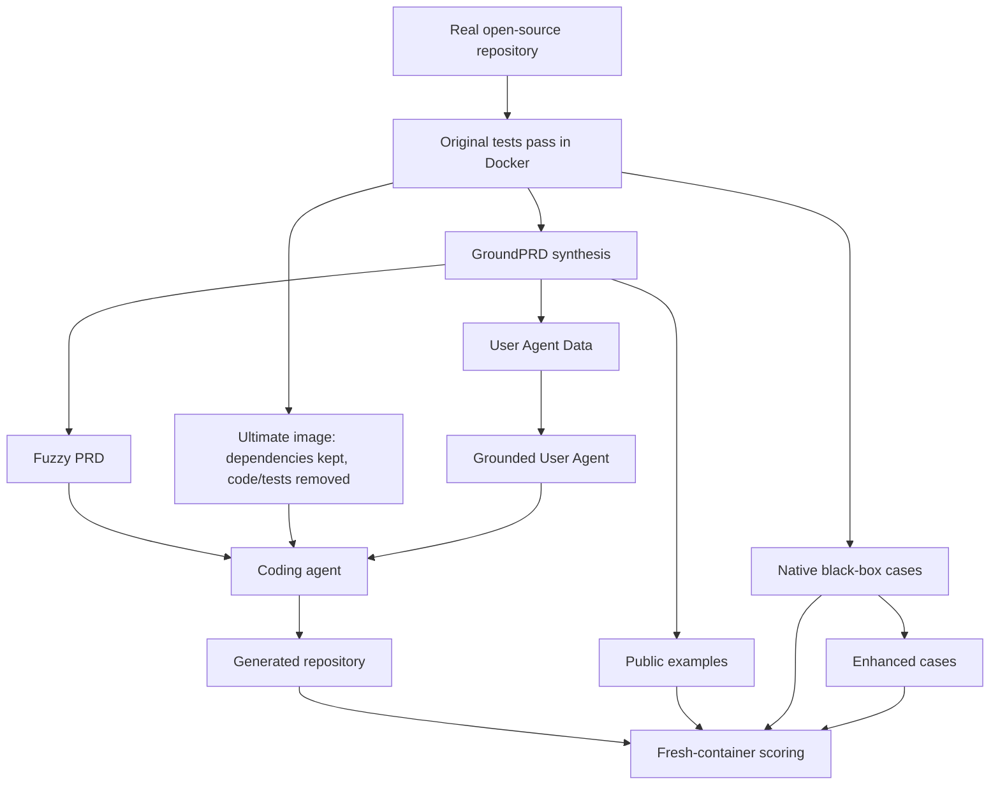

# ICAE-Bench：把 Coding Agent 从“补代码”推进到“模糊需求下造项目”

## 元信息与 TL;DR

- 原文标题：ICAE-Bench: Evaluating Coding Agents as Interactive Project Builders
- 原文类型：论文 + 开源评测项目
- 发布时间：2026-07-23
- arXiv：https://arxiv.org/abs/2607.21217
- PDF：https://arxiv.org/pdf/2607.21217v1
- HTML：https://arxiv.org/html/2607.21217v1
- 项目仓库：https://github.com/ALEX-nlp/ICAE-EVAL
- 方向：大模型 Agent、coding agent、交互式软件工程评测

### TL;DR

- **ICAE-Bench 研究什么**：
  - 现有 coding benchmark 多数评估函数补全、repo patch、issue repair 或给定完整规格的 0-to-1 生成。
  - 真实 vibe-coding / project-building 场景更像“用户只有模糊产品意图，Agent 必须问问题、保留约束、实现仓库、运行自测、交付可执行项目”。
  - ICAE-Bench 就把 coding agent 放进这种模糊 PRD + 可控交互 + 黑盒验收的设置里。

- **Benchmark 怎么构造**：
  - 从真实开源仓库出发，只保留原测试能在 Docker 中稳定通过的项目。
  - 合成 GroundPRD、Public cases、Native cases、Enhanced cases。
  - 再把 GroundPRD fuzzify 成 Fuzzy PRD，并把被省略的需求放入 User Agent Data。
  - 最终打包 ultimate image：保留依赖和运行环境，移除黄金代码、原始测试和构造期隐藏产物。

- **规模与数据**：
  - 完整 ICAE-Bench 含 **480 个任务**、**12 种语言**，每种语言 40 个任务。
  - ICAE-Bench-Lite 含 **50 个任务**、**10 种语言**，用于快速实验。
  - GroundPRD 平均 `6764` tokens，Fuzzy PRD 平均只有 `276` tokens，User Agent Data 平均 `7091` tokens。

- **实验怎么评估**：
  - 论文同时评估 Claude Code 和 OpenHands 两个 agent framework。
  - 模型包括 Claude-Opus-4.8、GPT-5.5、Gemini-3.1-Pro、GLM-5.1、Claude-Sonnet-4.6、MiniMax-M2.5。
  - 指标不止 pass rate，还包括语义/API/设计质量、文件/LOC/类/方法结构相似度、约束覆盖、fallback 率、budget 使用率。

- **关键结果**：
  - 完整 480 任务上，Claude-Opus-4.8 Overall pass `38.2`，GPT-5.5 `37.2`，Gemini-3.1-Pro `27.0`，GLM-5.1 `26.6`，Sonnet-4.6 `21.8`，MiniMax-M2.5 `0.8`。
  - Lite 上，GPT-5.5 Overall pass 最高为 `53.3`，Claude-Opus-4.8 为 `48.2`，GLM-5.1 为 `40.0`。
  - 给 GLM-5.1 直接放置 Public case 文件，pass 从 `37.4` 升到 `61.8`，但 constraint coverage 从 `63.8` 降到 `61.2`，说明问题不只是“有没有问到需求”，而是能否把可执行验证脚手架转成实现。

- **边界**：
  - Benchmark 使用合成 GroundPRD、fuzzification 和模型式 User Agent，仍不是完全真实用户。
  - 480 个任务来自可 Docker 化开源仓库，天然偏向有测试、可容器化、可黑盒验收的软件。
  - 论文评价的是项目构建能力，不直接覆盖安全审计、恶意 issue、供应链攻击或长期维护。

## 研究问题：为什么 coding agent 需要“交互式项目构建”评测？

### 从补函数到造项目，评测假设变了

- HumanEval、MBPP 这类函数级 benchmark 主要测试局部编码能力。
- SWE-bench、Multi-SWE-bench、SWE-Bench Pro 更接近真实 repo，但典型任务是修 issue 或打 patch。
- Commit0、NL2RepoBench、PRDBench、ProgramBench、RealBench 关注 0-to-1 repo generation。

ICAE-Bench 指出的缺口是：

- 真实 coding agent 经常面对的是不完整需求。
- 用户不一定知道要列出全部 API、边界输入、测试格式和架构约束。
- Agent 必须主动澄清，但澄清不能变成泄漏答案。
- 最后交付物也不该被要求逐字复刻原仓库，只要行为满足合约。

### 论文要测的不是“会不会问问题”

作者把核心瓶颈描述得更细：

- 问题 1：Agent 能不能发现自己不知道什么？
- 问题 2：Agent 能不能向 User Agent 提出有用问题？
- 问题 3：Agent 能不能把回答保存进后续实现状态？
- 问题 4：Agent 能不能把 clarified requirement 变成可运行仓库？
- 问题 5：Agent 能不能用 Public examples 自测，而不是只写出看似合理的结构？

因此 ICAE-Bench 的评测目标是：

- 需求澄清。
- 状态保持。
- 代码生成。
- 构建与运行。
- 黑盒行为正确性。
- 交互质量和实现质量的分离诊断。

## 论文主张与论证路线

| Claim | Mechanism | Evidence | Boundary |
|---|---|---|---|
| 现有 repo benchmark 没有充分覆盖模糊需求下的项目构建 | 引入 Fuzzy PRD、User Agent Data、ultimate image | Table I 对比 0-to-1 generation benchmark | 不否定 SWE-bench 类 issue repair 的价值 |
| 可控交互比自由聊天更适合评测 | User Agent 只能返回 benchmark-authored requirement records | 避免新需求、泄漏实现、模型幻觉答案 | User Agent 仍是模型路由器，不是真人 |
| 行为合约应与实现结构解耦 | 用 Public/Native/Enhanced 黑盒 cases 验收 | 评估不同内部设计、依赖和 API 选择 | 仍依赖原测试和增强测试覆盖质量 |
| 需求覆盖高不必然带来高 pass | 同时报告 constraint coverage、fallback、pass 和 failure modes | Public 文件实验中 coverage 下降但 pass 大升 | 不能说明 coverage 不重要，只说明执行脚手架同样关键 |
| Agent framework 会显著影响结果 | 同模型在 Claude Code 与 OpenHands 下对比 | OpenHands 对每个模型 Overall 都更低 | 框架版本和工具权限可能随时间漂移 |

## Benchmark 形式化：一个 ICAE 任务由什么组成？

论文把一个任务写成：

```text
T = (D_f, E, P, U, B)
```

| 符号 | 组件 | 作用 |
|---|---|---|
| `D_f` | Fuzzy PRD | 初始模糊需求 |
| `E` | Ultimate image | 可运行环境 |
| `P` | Public cases | 可见或可通过交互恢复的示例 |
| `U` | User Agent Data | 交互 oracle |
| `B` | Native + Enhanced cases | 最终评估目标 |

### 为什么要区分 `P` 和 `B`？

- `P` 是用户可能透露的代表性例子。
- `B` 是最终验收集。
- `B` 包含 Native cases 和 Enhanced cases。
- Agent 可以用 `P` 自测，但不能看到全部 `B`。

这样可以避免两个极端：

- 如果只给完整测试，任务变成 test-driven implementation，需求澄清消失。
- 如果完全没有公开例子，Agent 很难知道输入输出协议，评测更像猜谜。

### Ultimate image 的作用

Ultimate image 保留：

- 官方语言运行时。
- 依赖栈。
- 构建环境。
- 必要工具链。

Ultimate image 移除：

- 黄金代码。
- 原始测试。
- 隐藏构造产物。
- 会泄漏实现的文件。

这让任务更接近：

- 环境已经 provision 好。
- Agent 必须从需求和澄清里重建项目。
- 最终 scoring 在 fresh container 中重放。

## 构造流水线：从真实仓库到模糊 PRD

### 五个阶段

| 阶段 | 目的 |
|---|---|
| Repository filtering | 只保留原始测试能在 Docker 中通过的仓库 |
| GroundPRD and case construction | 合成完整规格，重构权威黑盒 cases |
| PRD fuzzification | 生成 Fuzzy PRD 和 grounded User Agent Data |
| Ultimate-image packaging | 移除 solution artifacts，保留运行环境 |
| Artifact verification | 检查语义一致性和执行一致性 |

### Mermaid 视图



### GroundPRD 为什么不能直接给 Agent？

- GroundPRD 是完整 endpoint。
- 它包含较完整的功能描述和代表性例子。
- 如果直接给 Agent，benchmark 测到的是完整规格实现能力。

ICAE-Bench 的核心是控制信息曝光：

- Fuzzy L1、L2、L3 是逐步更丰富的模糊 PRD。
- GroundPRD 是 fully specified reference。
- User Agent Data 保存被省略的需求记录。

这样可以比较：

- 初始需求越丰富，Agent 是否越强？
- 交互能否弥补需求缺失？
- 获得需求后，Agent 是否能保持并实现？

## 数据规模与任务分布

### 基本统计

| 统计 | ICAE-Bench | ICAE-Bench-Lite |
|---|---:|---:|
| Total tasks | `480` | `50` |
| Languages | `12` | `10` |
| GroundPRD avg tokens | `6764` | `6170` |
| GroundPRD max tokens | `43990` | `43990` |
| Fuzzy PRD avg tokens | `276` | `273` |
| User Agent Data avg tokens | `7091` | `6945` |
| User Agent Data max tokens | `53887` | `53887` |

### 12 种语言

- C# / .NET 8
- C++ / GCC 12
- Dart 3.5
- Go 1.22
- Java 17
- JavaScript / Node 20
- TypeScript / Node 20
- Kotlin 1.9.25
- PHP 8.2
- Python 3.11
- Ruby 3.2
- Rust 1.81

### 为什么语言覆盖重要？

- coding agent 的工具链能力不应只由 Python 代表。
- 不同语言的构建、包管理和测试入口差异很大。
- Ultimate image 把运行时固定下来，但仍要求 Agent 自己构造可复现接口。

### 类别分布的含义

论文 Figure 4 显示任务覆盖：

- Developer & Build Tools。
- Web & HTTP Services。
- Utility Libraries。
- DevOps & Cloud Infrastructure。
- Database & Storage。
- UI、Frontend & Mobile。
- Authentication & Security。
- Data Serialization & Parsing。
- Testing & QA。
- Machine Learning & Data Science。

这些类别让 benchmark 不只是算法题或工具函数。

## User Agent：可控澄清如何工作？

### 为什么不能用自由模型当用户？

自由用户模型可能：

- 加入原 benchmark 没有的新需求。
- 泄漏隐藏测试。
- 误编实现细节。
- 对同一问题给出不一致回答。

ICAE-Bench 的 User Agent 是 grounded router：

- 默认使用 DeepSeek-V3.2。
- 预算为 16 次查询。
- 输入是 coding agent 的自然语言问题。
- 输出只能来自 benchmark-authored requirement records。

### 这让交互变成可评估对象

论文报告的交互指标包括：

- Constraint Coverage：
  - Agent 通过交互或实现覆盖了多少关键约束。

- Fallback Rate：
  - User Agent 无法回答或 Agent 问题不够具体时的 fallback。

- Budget Usage Rate：
  - Agent 是否用完查询预算。

这比只看 pass rate 更有诊断力。

- 一个 Agent 可能问得很多，但无法实现。
- 一个 Agent 可能约束覆盖高，但最终测试失败。
- 一个 Agent 可能 pass 高，是因为它拿到了可运行 Public files，而不是需求理解更好。

## 评估协议：为什么不是只看 Pass@1？

### 测试集分层

| 套件 | 含义 | 作用 |
|---|---|---|
| Public | 可见或可恢复的例子 | 检查 Agent 是否利用公开示例 |
| Native | 原始测试重构出的黑盒行为 | 检查源任务真实行为 |
| Enhanced | 额外合成鲁棒性 cases | 检查边界和 robustness |

### 多维指标

| 维度 | 指标 | 解释 |
|---|---|---|
| Functional correctness | Overall/Public/Native/Enhanced pass | 行为正确性 |
| Agentic evaluation | Sem./API/Design | 语义、接口、设计质量 |
| Structural assessment | File、LOC、Class、Method | 结构与黄金项目相似程度 |
| Interaction quality | Constraint、Fallback、Budget | 澄清过程质量 |

### 为什么结构相似度不是主指标？

- 项目生成允许多种实现。
- 模块结构、类名、依赖和内部 API 可以不同。
- 只要黑盒行为满足合约，就不必复刻原仓库。

因此结构指标是诊断项：

- 用于发现过小实现。
- 用于发现过度膨胀。
- 用于对比设计复杂度。
- 不能替代行为验收。

## 主结果：当前 coding agent 离“项目构建者”有多远？

### 完整 ICAE-Bench，480 任务

| 模型 | Overall | Public | Native | Enhanced | Sem. | API | Design |
|---|---:|---:|---:|---:|---:|---:|---:|
| Claude-Opus-4.8 | `38.2` | `48.5` | `41.4` | `35.5` | `22.6` | `12.1` | `44.4` |
| GPT-5.5 | `37.2` | `50.3` | `42.0` | `32.8` | `21.5` | `9.3` | `36.5` |
| Gemini-3.1-Pro | `27.0` | `37.0` | `30.7` | `23.5` | `18.9` | `8.9` | `28.6` |
| GLM-5.1 | `26.6` | `36.8` | `30.0` | `23.7` | `21.1` | `10.0` | `37.1` |
| Claude-Sonnet-4.6 | `21.8` | `29.0` | `24.1` | `19.4` | `22.9` | `10.1` | `37.5` |
| MiniMax-M2.5 | `0.8` | `1.5` | `1.2` | `0.6` | `11.8` | `5.5` | `23.1` |

### ICAE-Bench-Lite，50 任务

| 模型 | Overall | Public | Native | Enhanced | Design | Constr. | Fallback |
|---|---:|---:|---:|---:|---:|---:|---:|
| GPT-5.5 | `53.3` | `63.8` | `60.9` | `47.4` | `48.7` | `73.2` | `21.0` |
| Claude-Opus-4.8 | `48.2` | `56.6` | `52.9` | `44.4` | `49.1` | `67.8` | `17.9` |
| Claude-Sonnet-4.6 | `40.2` | `47.0` | `44.1` | `37.1` | `44.3` | `60.8` | `25.9` |
| GLM-5.1 | `40.0` | `47.6` | `44.5` | `35.9` | `37.9` | `63.3` | `28.4` |
| Gemini-3.1-Pro | `36.6` | `45.5` | `41.4` | `33.1` | `31.4` | `58.0` | `23.5` |
| MiniMax-M2.5 | `2.8` | `2.7` | `4.4` | `1.9` | `28.6` | `48.1` | `28.1` |

### 如何解读这些数字？

- Public 通常高于 Native 和 Enhanced。
- 说明可见或可恢复的示例确实更容易通过。
- Enhanced 更低，说明鲁棒边界和隐藏行为仍是短板。
- 最强模型在完整 480 任务上 Overall 也只有约 `38`。

这不是“模型不会写代码”的证据。

更准确的结论是：

- 在模糊需求、受限澄清、空仓库重建、 fresh-container 黑盒评分的组合压力下，现有 coding agent 仍不稳定。
- 成功需要同时完成需求追踪、工程组织、接口实现、测试自举和调试闭环。

## Failure modes：失败到底发生在哪里？

### 四类可见失败

| Failure mode | 含义 | 暗示的瓶颈 |
|---|---|---|
| Mismatch | 有输出但和 expected 不同 | 逻辑或行为合约错误 |
| Missing | 部分 cases 无输出 | 功能覆盖不完整 |
| Exec. | harness 运行但构建/运行失败 | 依赖、构建、环境或运行时错误 |
| No Test | 没有生成要求的 `rcb_tests/test.sh` | 指令跟随或评分接口失败 |

### 完整集上的失败计数

| 模型 | Mismatch | Missing | No Test | Exec. |
|---|---:|---:|---:|---:|
| Opus-4.8 | `387` | `120` | `29` | `25` |
| GPT-5.5 | `443` | `179` | `0` | `25` |
| Gemini-3.1 | `291` | `121` | `7` | `170` |
| GLM-5.1 | `387` | `186` | `4` | `40` |
| Sonnet-4.6 | `304` | `93` | `4` | `127` |
| MiniMax-M2.5 | `89` | `63` | `189` | `209` |

### 论文从这些失败中得出什么？

- 强模型更常能跑起来，但行为不匹配。
- 弱模型更常缺少 harness 或执行失败。
- Missing 可以和 Mismatch 共存。
- Clean repository 极少，论文说每个模型只有 `1-13 / 480` 个仓库完全 clean。

这意味着 pass rate 低不是单点问题。

- 不是只差问问题。
- 不是只差单个 API。
- 不是只差构建命令。
- 而是澄清、状态、实现、运行、调试、验收链条上的复合失败。

## 实验设计细读：为什么 ICAE-Bench 难在“需求到仓库”的转换？

### Fuzzy PRD 的信息差不是随机缺字

- 论文没有简单把 GroundPRD 截短。
- 它选择性隐藏几类约束：
  - API commitments。
  - edge-case behavior。
  - architectural requirements。
  - Public examples。
  - 调用入口与返回格式。

- 这让 Fuzzy PRD 更像真实用户请求：
  - 用户知道想要一个工具或服务。
  - 用户不会一次性列出全部边界。
  - 用户可能只在追问时给出例子。

- 但它又和真实用户不同：
  - 所有可回答内容都来自 GroundPRD 派生记录。
  - User Agent 不应该临场发明需求。
  - 这保证 benchmark 的比较更可重复。

### Native 与 Enhanced 的分工

| Case 类型 | 来源 | 主要检验 |
|---|---|---|
| Public | GroundPRD 中代表性 Native case | Agent 能否恢复和利用可见示例 |
| Native | 原始测试重构出的黑盒 JSON case | 是否覆盖真实仓库既有行为 |
| Enhanced | 在 GroundPRD 约束下额外合成的边界 case | 是否具备鲁棒性和泛化行为 |

- Native 的价值：
  - 保留真实开源仓库的行为锚点。
  - 避免 benchmark 完全由合成测试驱动。

- Enhanced 的价值：
  - 补充边界输入。
  - 检查 malformed、corner、robustness 情况。
  - 降低 Agent 只拟合公开例子的风险。

- Public 的价值：
  - 为 Agent 提供自测入口。
  - 模拟用户愿意给出的样例。
  - 作为 visibility-based view，帮助解释 pass gap。

### Fresh-container scoring 的意义

- Agent 开发时可以：
  - 编辑文件。
  - 安装依赖。
  - 运行命令。
  - 向 User Agent 提问。
  - 编写测试脚本。

- 但最终评分会在 fresh container 中重放生成仓库。
- 这意味着：
  - 开发期间临时命令不算交付。
  - 只有写入最终 artifact 的内容才有效。
  - 环境副作用不会污染 scoring。

这对 coding agent 评测很关键。

- 如果只在开发容器里直接判分，Agent 可能依赖临时状态。
- 如果不 fresh replay，依赖安装、缓存、环境变量都可能泄漏。
- ICAE-Bench 的做法更接近“交付一个可复现项目”。

### 为什么 GroundPRD 仍是强上界？

- GroundPRD 包含完整需求和代表性示例。
- Fuzzy PRD 只暴露很短的一段初始需求。
- User Agent 可以恢复部分缺失内容，但恢复依赖 Agent 问题质量。

论文的实验结论说：

- GroundPRD 仍然是强上界。
- 交互只能追回一部分差距。
- 高 constraint coverage 不自动转化成 pass。

这说明信息瓶颈至少分三层：

| 层 | 问题 | 失败表现 |
|---|---|---|
| 发现缺口 | Agent 不知道该问什么 | 关键约束未被覆盖 |
| 保存约束 | Agent 问到了但后续遗忘 | Missing、Mismatch |
| 转成实现 | Agent 理解了但写不出可运行仓库 | Exec.、No Test、Enhanced 失败 |

## 具体失败链条：一个 Agent 可能怎样丢分？

### 情况一：问到了需求，但没有转成测试

- Agent 通过 User Agent 得到输入输出例子。
- 它把例子写进自然语言笔记。
- 但没有生成 `rcb_tests/test.sh`。
- 最终 scorer 标为 No Test。

这类失败说明：

- requirement memory 不等于 executable verification。
- coding agent 需要把澄清结果转成可运行检查。

### 情况二：Public 通过，Native/Enhanced 失败

- Agent 实现了公开例子。
- 但隐藏 Native cases 出现 Mismatch。
- Enhanced cases 暴露边界行为错误。

这类失败说明：

- Agent 可能只拟合示例。
- 没有抽象出完整行为合约。
- 需求澄清不足或泛化不足都会造成问题。

### 情况三：结构像，但行为不对

- Structural assessment 可能看起来合理。
- 文件数、类数、方法数接近黄金项目。
- 但黑盒 case 失败。

这类失败说明：

- repo 形态不能替代行为验收。
- 对 project-building benchmark 来说，结构相似度只能做诊断。

### 情况四：约束覆盖高，但 pass 不高

- Agent 通过交互问到了很多约束。
- Constraint coverage 高。
- 但实现时没有把约束合并成一致设计。

这类失败是 ICAE-Bench 最想暴露的。

- 真实项目构建不是“列清单”。
- Agent 需要把分散回答组织成架构、接口、状态和测试。
- 这正是当前 Agent framework 容易丢状态的地方。

## 对后训练和 Agent 系统的可操作启发

### 可以把 ICAE-Bench 变成训练信号吗？

- 直接用最终 pass 作为稀疏 reward 会很贵。
- 更可行的是拆分 reward：
  - 是否提出了高价值澄清问题。
  - 是否把回答写进显式需求记录。
  - 是否生成并运行 Public-case 自测。
  - 是否修复构建失败。
  - 是否在 Native/Enhanced 失败后做定位。

- 这些信号可以转成分阶段后训练数据：
  - clarification policy。
  - requirement memory policy。
  - test-construction policy。
  - implementation/debug policy。

### 对 coding agent memory 的提醒

- ICAE-Bench 暴露的不是长期知识记忆问题。
- 它更像短期项目状态问题：
  - 用户刚回答的约束。
  - 当前仓库已实现的接口。
  - 刚失败的 case。
  - 下一步应修改的文件。

- 因此 memory 设计应支持：
  - task-local requirement ledger。
  - test-result ledger。
  - unresolved constraint list。
  - build/run failure summary。

这些状态要服务于当前实现闭环。

### 对安全评测的后续扩展

- ICAE-Bench 的可控交互很适合加入安全约束。
- 可以把 User Agent Data 分成：
  - 普通需求。
  - 安全需求。
  - 权限边界。
  - 禁止行为。

- 然后评估 Agent：
  - 是否会为了 pass test 破坏权限边界。
  - 是否会安装不必要依赖。
  - 是否会把 secret 写入仓库。
  - 是否会运行高风险脚本。

- 这类扩展必须保持防御性：
  - 评估风险条件。
  - 记录工具调用。
  - 检查隔离和审计。
  - 不提供攻击执行路径。

## Public case 文件实验：为什么“可执行脚手架”很关键？

### 实验设置

论文用 GLM-5.1 Think-8K 在 ICAE-Bench-Lite 上比较：

- `w/o`：
  - 默认设置。
  - Public case 内容只能通过 User Agent 交互恢复。

- `w/`：
  - 直接把 Public case files 放到 workspace。
  - 语义内容不增加。
  - 但 inputs、expected outputs、调用格式变成可执行结构。

### 结果

| Setting | Pass | OA Design | Constr. | Fallback |
|---|---:|---:|---:|---:|
| w/ Public case files | `61.8` | `38.5` | `61.2` | `29.7` |
| w/o default | `37.4` | `43.2` | `63.8` | `27.7` |

### 解读

- Pass 从 `37.4` 到 `61.8`，提升非常大。
- Constraint coverage 反而从 `63.8` 降到 `61.2`。
- 这说明：
  - Agent 不只是缺需求信息。
  - Agent 更缺“可执行验证结构”。

Public files 的价值在于：

- 明确输入格式。
- 明确输出格式。
- 明确测试入口。
- 让 Agent 可以在本地闭环调试。

这对 coding agent 评测很重要：

- 自然语言需求覆盖和可执行反馈不是同一种能力。
- 高约束覆盖不保证实现正确。
- 给出测试脚手架可能比多问几条需求更有效。

## Agent framework：同一个模型换框架会怎样？

### Claude Code vs OpenHands

| Framework | Model | Pass | OA Design | Constr. | Fallback |
|---|---|---:|---:|---:|---:|
| Claude Code | GPT-5.5 | `53.3` | `48.7` | `73.2` | `21.0` |
| OpenHands | GPT-5.5 | `31.5` | `39.4` | `76.8` | `20.0` |
| Claude Code | Claude-Opus-4.8 | `48.2` | `49.1` | `67.8` | `17.9` |
| OpenHands | Claude-Opus-4.8 | `42.7` | `56.6` | `68.6` | `13.1` |
| Claude Code | GLM-5.1 | `37.4` | `43.2` | `63.8` | `27.7` |
| OpenHands | GLM-5.1 | `28.4` | `43.1` | `72.0` | `24.3` |

### 这个对比说明什么？

- OpenHands 下每个模型 Overall 都更低。
- 但部分约束覆盖反而更高。
- 框架影响：
  - 编辑循环。
  - 命令执行。
  - 状态保存。
  - 文件组织。
  - 测试入口。
  - 对用户澄清的使用方式。

这强化了论文观点：

- coding agent 不是“模型 + prompt”。
- framework 本身是评测对象的一部分。
- 同一模型在不同工具框架中的工程行为可能完全不同。

## Figure/Table 证据解读

### Table I：和现有 benchmark 的差异

- ICAE-Bench 有 480 项，12 语言。
- ICAE-Bench-Lite 有 50 项，10 语言。
- 两者都支持 Fuzzy L1-L3。
- 两者都有 Public cases 和交互。
- 论文把它们放在 0-to-1 generation benchmark 中比较，重点是：
  - 可控模糊需求。
  - 可恢复示例。
  - 多语言实现。
  - 交互式澄清。

### Figure 2：框架图

- 起点是 fuzzy PRD 和 ultimate image。
- coding agent 可以开发、执行、debug、询问 User Agent。
- 最终 repo 用 Public、Native、Enhanced cases 评分。
- 这张图体现“需求曝光”和“行为验收”分离。

### Table II / III：任务组件和流水线

- Table II 定义 `D_f, E, P, U, B`。
- Table III 定义构造流水线。
- 这两张表支撑 benchmark 的可审计性：
  - 每个 artifact 都有角色。
  - 构造流程不是单纯让模型编题。

### Table IV / V：运行环境和规模

- Table IV 固定语言 runtime 和 base image。
- Table V 给 token 长度和任务规模。
- 关键观察：
  - Fuzzy PRD 很短。
  - GroundPRD 和 User Agent Data 很长。
  - 需求缺口是人为控制出来的，不是随机删文本。

### Table VI / VII：主结果

- 完整集和 Lite 都显示：
  - Public pass 高于 Native/Enhanced。
  - Overall 仍低。
  - 强模型也远未接近可靠项目构建者。

### Table IX：Public case files

- 这是最有解释力的对照之一。
- 它把“需求语义”与“可执行测试结构”拆开。
- Pass 大幅提升但 constraint coverage 不升，说明执行反馈是独立瓶颈。

### Table X：框架对比

- 同模型在不同框架下结果不同。
- 这提醒研究者：
  - benchmark 报告模型名不够。
  - 必须报告 agent framework、工具权限、执行设置、交互预算。

## 相关工作与位置判断

### 和 SWE-bench 系列

- SWE-bench 评估 existing repo issue repair。
- ICAE-Bench 评估 empty / generated repo project-building。
- 二者互补：
  - SWE-bench 看 patch 能力。
  - ICAE-Bench 看从模糊需求到可运行项目的闭环。

### 和 Commit0

- Commit0 保留 repo structure、class definitions、function signatures。
- ICAE-Bench 移除黄金实现和测试。
- Agent 需要自己设计仓库结构和执行入口。

### 和 PRDBench / NL2RepoBench

- 这些 benchmark 通常给较固定或较完整的规格。
- ICAE-Bench 用 Fuzzy L1-L3 控制可见信息层级。
- User Agent Data 让缺失需求可被交互恢复，而不是永远缺失。

### 和真实 vibe-coding

- ICAE-Bench 更接近“用户说一个目标，Agent 需要追问并造项目”。
- 但它仍是 benchmark：
  - 用户是受控 oracle。
  - 验收是黑盒 cases。
  - 项目来自可容器化开源仓库。

因此它不是现实世界的完整替代。

它更像一个可复现实验台：

- 用来比较模型。
- 用来比较 framework。
- 用来诊断澄清、实现和测试闭环。

## 局限与安全边界

### Benchmark 构造局限

- GroundPRD 由模型辅助合成。
- Fuzzy PRD 由 fuzzification 产生。
- User Agent 由模型路由。
- Enhanced cases 也有合成成分。

论文用多轮 verification 降低风险：

- 原测试 Docker 通过。
- Native cases 对黄金实现通过。
- Enhanced cases 对黄金实现通过。
- GroundPRD 通过重构检查。
- Fuzzy PRD 和 User Agent Data 与 GroundPRD 做语义与执行一致性检查。

但风险仍存在：

- 测试覆盖不完备。
- GroundPRD 可能遗漏隐含行为。
- Enhanced cases 可能偏向某些输入类型。
- User Agent routing 可能影响交互质量。

### 安全边界

ICAE-Bench 不是安全攻击 benchmark。

- 它没有评估恶意 issue。
- 没有评估 prompt injection。
- 没有评估供应链污染。
- 没有评估 Agent 在不可信仓库中的隔离。

但它对安全研究仍有间接意义：

- ultimate image 和 fresh-container scoring 是可控执行边界。
- User Agent Data 是受控信息边界。
- Public/Native/Enhanced cases 是可见与隐藏验收边界。

未来如果扩展到安全场景，应增加：

- 不可信输入标注。
- 工具权限策略。
- 网络和文件系统隔离。
- 依赖安装审计。
- 执行轨迹与敏感操作日志。

## 研究者视角：ICAE-Bench 对 Agent 评测的意义

### 1. Coding agent 评测应从“任务完成”拆成链条诊断

ICAE-Bench 的价值在于把失败拆开：

- 需求是否被问到。
- 回答是否被保存。
- 约束是否进入实现。
- 仓库是否能构建。
- 测试入口是否遵守。
- Public cases 是否能自测。
- Native/Enhanced 是否能泛化。

这比单一 pass rate 更适合指导 Agent 系统改进。

### 2. 可执行反馈可能比自然语言澄清更关键

Public case files 实验给出强信号：

- 同样语义内容，文件形式更可行动。
- Agent 更容易用它调试。
- pass 提升不来自更多需求覆盖。

这意味着未来 Agent benchmark 应记录：

- Agent 是否运行测试。
- 运行了哪些测试。
- 失败后是否定位。
- 是否把测试约束反映到实现。

### 3. Framework 是能力的一部分

Claude Code 与 OpenHands 的对比说明：

- 模型能力不是唯一变量。
- agent framework 的编辑、执行、状态和工具策略会影响最终结果。

所以严肃报告需要写清：

- 框架版本。
- 工具权限。
- 交互预算。
- 容器环境。
- 初始 prompt。
- scorer 是否 fresh replay。

### 4. 下一步问题

- 能否把 ICAE-Bench 的 task type 用于后训练？
  - 例如把失败分成需求遗漏、构建失败、接口不匹配、测试入口缺失。

- 能否用 ICAE-Bench 训练 Agent 的自测策略？
  - Public cases 证明测试脚手架很重要。
  - 后训练可以奖励 agent 先构造本地验收再实现。

- 能否加入安全约束？
  - 真实项目构建会安装依赖、运行脚本、访问文件。
  - benchmark 后续应把可执行风险纳入评分和审计。

- 能否做长期维护版？
  - 当前是单轮项目交付。
  - 真实软件还包括需求变更、bug report、回归测试、版本升级。

### 结论

- ICAE-Bench 把 coding agent 评测从“会不会写代码”推进到“能否在模糊需求下交互式构建可验收仓库”。
- 它的关键设计是：
  - 模糊 PRD。
  - grounded User Agent。
  - ultimate image。
  - Public/Native/Enhanced 黑盒 cases。
  - 多维 failure diagnosis。

- 最值得带走的结论是：
  - 当前强 coding agent 已能生成相当多可运行项目片段。
  - 但在保持澄清约束、构造测试入口、利用可执行反馈、覆盖隐藏行为方面仍不稳。
  - 对 Agent 研究者来说，下一代 coding benchmark 必须同时评估模型、框架、交互和执行闭环。
