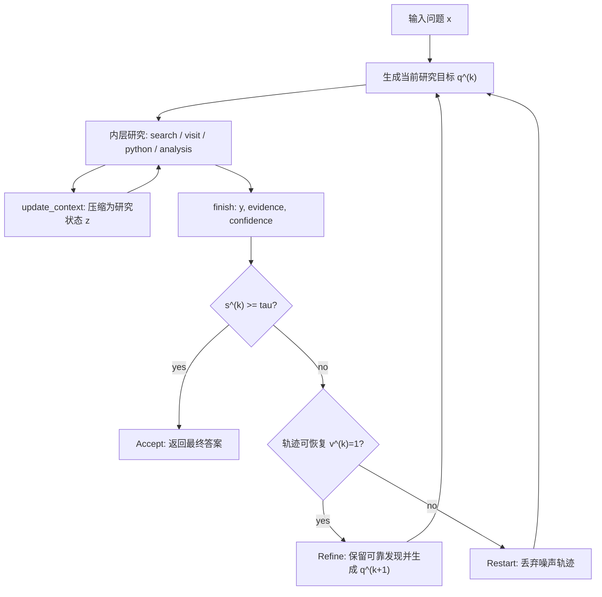

# AREX：把深度研究 Agent 从“继续搜索”改写成“递归验证并更新研究状态”

原文：[AREX: Towards a Recursively Self-Improving Agent for Deep Research](https://arxiv.org/abs/2607.21461)

模型卡：[BAAI/AREX-Turbo](https://huggingface.co/BAAI/AREX-Turbo)

日期：2026-07-23

类型：论文

类别：大模型 Agent

### TL;DR

- **研究问题**：深度研究 Agent 的困难不是单纯“搜得不够久”，而是答案通常要同时满足多个耦合约束；一个候选答案可能满足一部分条件，却在时间、数值、来源或实体关系上失败。
- **核心主张**：论文把这种任务写成 **发现难、逐约束验证相对容易** 的不对称问题；Agent 应把验证结果转成下一轮研究目标，而不是只在同一条轨迹里继续滚动搜索。
- **方法机制**：AREX 由内层 research loop 和外层 self-improvement loop 组成。内层搜索、访问、整合证据并输出临时答案；外层按置信度与轨迹可恢复性决定 `Accept / Refine / Restart`。
- **长程状态**：AREX 学会调用 `update_context`，把越来越长的交互历史压缩为研究状态，保留已验证发现、当前候选、未解决约束、有效性疑虑、已拒绝候选和下一步计划。
- **训练路线**：作者用可验证合成任务与教师轨迹做多阶段 agentic mid-training，再用 step-aware RL 强化长程研究中的关键步骤，例如证据发现、路径拒绝与重定向、关键 context update。
- **关键数字**：AREX-Base 是 122B 总参数、10B 激活参数的 MoE；AREX-Turbo 是 4B dense。Table 1 中 AREX-Base 在 BrowseComp 82.5、GAIA 85.4、DeepSearchQA 89.9、WideSearch-en 82.0、HLE(tool) 52.4；AREX-Turbo 在 6 个 benchmark 中有 5 个超过 Qwen3.5-35B。
- **消融证据**：在 BrowseComp 上，去掉 ACU 且无外层 loop 是 59.6；只加外层 loop 到 69.8；只加 ACU 到 71.4；完整系统到 82.5。替换 key-step focused supervision 为随机步骤回放会从 82.5 降到 74.1。
- **局限边界**：论文没有公开完整训练数据规模、教师模型细节、全部搜索环境日志与失败案例；自蒸馏实验只是附录探索，不属于最终 AREX 配方；真实开放网页、来源污染和安全约束下的稳健性仍需独立复现。

### 研究问题：为什么深度研究不能只靠更长轨迹？

论文的切入点是一个很具体的 Agent 失败模式：

- 深度研究问题常常要求答案同时满足多个条件。
- 候选答案的发现空间很大，搜索路径稀疏且容易误入局部方向。
- 但一旦拿到候选，许多条件可以逐项验证。
- 传统长程 Agent 往往把更多 token、更多搜索、更多工具调用堆到同一条轨迹上。

作者认为，这会造成三类长期问题：

| 失败类型 | 在深度研究中的表现 | 为什么“继续搜索”不够 |
|---|---|---|
| 早期错误残留 | 第一轮误判候选后，后续证据围绕错误候选展开 | 轨迹越长，错误前提越像“已知背景” |
| 方向重复 | Agent 重复访问已排除来源或等价查询 | 缺少显式的 rejected candidates 状态 |
| 部分正确早停 | 答案满足显眼条件，却漏掉时间、单位、实体或证据约束 | 缺少逐约束置信度与未解条件 |

这篇论文最重要的概念是 **discovery-verification asymmetry**：

```text
发现：在大搜索空间中找到同时满足 C1...Cn 的 y，很难。
验证：给定候选 y 后，逐项检查 C1(y), C2(y), ..., Cn(y)，相对可分解。
```

因此，验证不应只是最后的过滤器。

它应该变成研究控制信号：

- 哪些 claim 已经有来源支持？
- 哪些 constraint 仍未满足？
- 当前轨迹是否还有可复用信息？
- 下一轮应该继续细化，还是丢弃轨迹重新开始？

### 论文主张与论证路线

| Claim | Mechanism | Evidence | Boundary |
|---|---|---|---|
| 深度研究需要递归自改进，而不是单轨迹延长 | 内层 research loop 生成临时答案；外层 self-improvement loop 审计并决定 Accept/Refine/Restart | Figure 2 给出双层控制结构；Table 3 显示外层 loop 带来 10.2 到 11.1 点增益 | 外层决策依赖模型自身置信度与轨迹评估，错误置信度仍可能误导 |
| 长程搜索的核心是状态维护，不只是上下文压缩 | `update_context` 维护 verified findings、unresolved constraints、rejected candidates、next-step plan | Table 2：80.3% BrowseComp case 调用 update_context，平均调用时上下文 25,721 tokens | 分析主要在 BrowseComp，未证明所有开放网页任务都同样依赖 ACU |
| 关键步骤比普通步骤更需要训练信号 | key-step focused supervision 与 step-aware RL 把信号集中到证据发现、路径重定向、关键 context update | Figure 4：关键 context update loss 0.300，比普通步骤 0.232 高约 29%；Table 4：随机步骤回放降到 74.1 | key-step 标注由规则离线产生，可能漏掉不可规则化的关键判断 |
| 小激活参数模型也可通过研究过程胜过更大基座 | 4B Turbo 与 122B-A10B Base 结合 RSI、ACU、mid-training、RL | AREX-Base 在 WideSearch-en 82.0，高于 Kimi-K2.6 80.8、GPT-5.4 77.5；Turbo 在 5/6 项超过 Qwen3.5-35B | 不等于模型通用智能更强，结果绑定搜索工具、评测协议与研究任务 |

### 方法机制：内层研究 loop 与外层自改进 loop

AREX 把一次深度研究拆成递归轮次。

每一轮有两个层级：

- **内层 research loop**：针对当前研究目标搜索、访问、整合证据，输出临时答案。
- **外层 self-improvement loop**：读取临时答案、证据和置信度，判断接受、细化或重启。


Figure 2 的意义不只是画流程图。

它把研究 Agent 的状态机从线性形式改成闭环控制：



这个设计和普通反思式 Agent 的差异在于：

- 它不是让模型泛泛“反思一下”。
- 它要求把临时答案外部化为结构化对象。
- 它要求把失败分成可恢复和不可恢复。
- 它要求下一轮目标来自未解决约束，而不是重新问同一个问题。

### 形式化：研究轨迹、有效上下文与外层决策

论文给出了一组对研究 Agent 很有用的形式化符号。

第 `k` 轮、第 `t` 步的交互轨迹写成：

```text
h_t^(k) = [(m_i^(k), a_i^(k), o_i^(k))]_{i=1}^t
```

变量含义：

| 变量 | 含义 |
|---|---|
| `m_i^(k)` | 模型在第 `k` 轮第 `i` 步的中间分析 |
| `a_i^(k)` | 研究动作，例如搜索、访问网页、调用 python、更新上下文 |
| `o_i^(k)` | 工具或环境返回的观察结果 |
| `q^(k)` | 当前递归轮次的研究目标 |
| `pi_theta` | AREX 的研究策略 |
| `T` | 外部研究环境，包括 search、visit、python 等工具 |

策略更新可以写成：

```text
(m_{t+1}^(k), a_{t+1}^(k)) = pi_theta(x, q^(k), h_t^(k))
o_{t+1}^(k) = T(a_{t+1}^(k))
```

这说明内层 loop 的输入不是单个 prompt，而是：

- 原始问题 `x`
- 当前目标 `q^(k)`
- 累积研究状态 `h_t^(k)` 或压缩后的有效上下文

#### `update_context` 为什么不是普通摘要？

AREX 的上下文更新定义为：

```text
z_t^(k) = f_theta(h_t^(k))
```

如果最近一次更新发生在 `tau` 步，那么后续有效上下文是：

```text
h_bar_t^(k) = z_tau^(k) ⊕ [(m_i^(k), a_i^(k), o_i^(k))]_{i=tau+1}^t
```

这不是按 token 阈值做普通 summarization。

它必须保留研究控制所需的状态：

- 已验证发现与来源标识
- 当前候选
- 未解决约束
- 有效性疑虑
- 已拒绝候选
- 下一步计划

这也是本文对 Agent memory 的一个关键判断：

> 长程研究记忆不是“保留更多文本”，而是维护下一步行动所需的证据图、候选集和未解约束。

#### `finish` 输出什么？

内层 loop 结束时，模型输出：

```text
r^(k) = F_theta(h_bar_Tk^(k)) = (y^(k), E^(k), s^(k))
```

| 输出 | 含义 | 外层 loop 如何使用 |
|---|---|---|
| `y^(k)` | 临时答案 | 被逐约束验证 |
| `E^(k)` | 支持证据和文档标识 | 判断 provenance 与证据充分性 |
| `s^(k)` | 0 到 100 的答案级置信度 | 触发接受、细化或重启 |

外层决策规则是：

```text
d^(k) =
  Accept,  if s^(k) >= tau
  Refine,  if s^(k) < tau and v^(k) = 1
  Restart, if s^(k) < tau and v^(k) = 0
```

其中 `v^(k)` 表示当前轨迹是否可恢复。

如果可恢复，外层 loop 保存 `P^(k)` 中可靠信息，记录 `I^(k)` 中仍需修正的问题，并生成下一轮目标 `q^(k+1)`。

如果不可恢复，则从原问题重新初始化，避免把噪声轨迹带入下一轮。

### 数据构造：如何合成可验证的深度研究任务？

AREX 需要训练模型做递归研究，单纯输入输出数据不够。

作者构造任务时先抽取目标实体或答案 `y`，再生成一组约束：

```text
C(y) = {c1, c2, ..., cn}
```

这些约束可能对应：

- 时间关系
- 数值属性
- 实体关系
- 技术特征
- 证据要求
- 来源可靠性要求

然后作者把显式约束改写成更间接的问题：

```text
x = f(y, C')
```

一个任务必须满足三项条件：

| 条件 | 目的 |
|---|---|
| 答案不能直接从 query 推出 | 避免变成关键词匹配 |
| 每个约束都可由公开证据验证 | 保证训练和评测有判据 |
| 联合约束唯一识别答案 | 避免多答案歧义 |

教师轨迹收集阶段，强教师模型使用同样工具环境生成研究轨迹。

质量控制会丢弃：

- 直接猜答案的轨迹
- 忽略工具观察的轨迹
- 无法根据新证据修正假设的轨迹
- 工具调用无效或来源不可靠的轨迹
- 最终答案虽对但中间证据链不适合监督的轨迹

这里值得注意的是，论文并没有把“答案正确”当成唯一标准。

它更关心轨迹是否展示了可学习的研究过程：

- 是否有多轮查询
- 是否能维护研究状态
- 是否能基于证据改变方向
- 是否能把支持证据绑定到答案

### 训练流程：mid-training、关键步骤与 step-aware RL

AREX 的训练不是一次性混合所有数据。

作者采用多阶段 agentic mid-training：

1. 先训练 browse-intensive 多轮轨迹，建立搜索、访问网页、证据获取、查询改写和答案综合能力。
2. 再加入 expert reasoning 任务，强化长链思考、假设比较、困难推理和答案选择。
3. 最后做 mixed-capability consolidation，回放长程轨迹里的关键步骤，并加入论文研究、知识密集推理等扩展任务。

这个顺序服务于一个假设：

- 工具使用和网页导航是基础动作层。
- 专家推理是高层整合层。
- 递归验证需要二者稳定结合。

如果一开始混在一起训练，异质能力会相互干扰。

Table 4 的消融支持这个判断：把 progressive multi-round capability training 换成直接 mixed training，BrowseComp 从 82.5 降到 77.5。

#### 关键步骤是什么？

作者认为长程轨迹里绝大多数步骤是 routine steps。

真正影响最终成功的，往往是少数关键动作：

| 关键步骤 | 例子 | 为什么重要 |
|---|---|---|
| Evidence discovery | 找到直接支持或否定候选的来源 | 决定答案是否有证据根基 |
| Path rejection and redirection | 排除错误候选并改写搜索方向 | 避免长程轨迹被早期错误污染 |
| Key context-update | 在方向变化或约束解决后刷新状态 | 让后续搜索围绕剩余问题展开 |

Figure 4 显示，完整轨迹训练后这些步骤仍然更难：


| 步骤类型 | 平均 loss | 相对普通步骤 |
|---|---:|---:|
| 普通步骤 | 0.232 | 基线 |
| 证据发现 | 0.277 | 约 +19% |
| 路径拒绝与重定向 | 0.298 | 约 +28% |
| 关键 context update | 0.300 | 约 +29% |

这解释了为什么普通全轨迹 imitation 不够。

如果训练 loss 平均摊到每个 assistant token，模型会优先学会常见而容易的工具调用格式，却未必学会最关键的研究转折。

#### Step-aware RL 的目标

标准 GRPO 会把序列级 outcome advantage 传播到整条轨迹。

但长程研究里，一条成功轨迹可能包含：

- 低价值的查询尝试
- 噪声观察
- routine 页面访问
- 决定性证据发现
- 错误路径修复
- 高价值 context update

论文因此定义 step-level advantage。

先计算轨迹级 outcome advantage：

```text
A_i^out = (R_i - mu_R) / (sigma_R + epsilon)
```

再给成功轨迹里的关键步骤加有界 bonus：

```text
B_tilde_{i,j} = I[R_i > 0] * B_{i,j}
A_{i,j} = A_i^out + lambda_key * B_tilde_{i,j}
```

变量解释：

| 变量 | 含义 |
|---|---|
| `R_i` | 第 `i` 条轨迹的最终 outcome reward |
| `mu_R`, `sigma_R` | 同组轨迹 reward 的均值和标准差 |
| `B_{i,j}` | 第 `j` 个 assistant step 是否为关键步骤 |
| `I[R_i > 0]` | 只在成功轨迹上启用关键步骤 bonus |
| `lambda_key` | 控制关键步骤 shaping 强度 |

这个设计很克制。

它没有声称解决所有 credit assignment。

它只做一件事：

- 最终答案正确仍是主信号。
- 少数可高精度识别的关键步骤获得额外偏好。
- 避免给失败轨迹中的“看似关键”中间行为奖励。

### 实验设置：评测了哪些能力？

作者使用统一的长程搜索 Agent 接口：

- `search`
- `visit`
- `update_context`
- `finish`
- 在 HLE with tools 中额外使用 `python`

每个 episode 最多允许：

- 300 个 inner research loop turns
- 5 次 outer self-improvement loop operations

Benchmark 覆盖六类任务：

| Benchmark | 主要考察 |
|---|---|
| BrowseComp | 深度浏览、证据获取、复杂约束回答 |
| DeepSearchQA | 多步检索、查询改写、证据聚合 |
| GAIA | 工具使用、规划和多步任务完成 |
| xbench-2510 | 异构 agentic reasoning 与深度搜索 |
| WideSearch-en | 大搜索空间中的广覆盖检索与综合 |
| HLE with tools | 专家级推理和工具辅助回答 |

需要注意指标差异：

- WideSearch 报 Item-F1。
- DeepSearchQA 报 F1。
- 其他多为 accuracy。
- HLE 带星号的部分 baseline 结果来自 full HLE；无星号结果为 text-only subset。

### 主结果：AREX 的优势在哪里？


Table 1 的核心结果可以压缩成下面这张表：

| 模型 | BrowseComp | GAIA | xbench-2510 | DeepSearchQA | WideSearch-en | HLE(tool) |
|---|---:|---:|---:|---:|---:|---:|
| Qwen3.5-35B | 61.0 | 80.0 | 50.3 | 68.5 | 57.1 | 47.4 |
| Qwen3.5-122B | 63.8 | 81.6 | - | - | 60.5 | 47.5 |
| Qwen3.5-397B | 78.6 | 83.5 | 61.0 | 82.1 | 74.0 | 48.3 |
| MiroThinker-H1 | 88.2 | 88.5 | 72.0 | 80.6 | - | 47.7 |
| Kimi-K2.6 | 83.2 | 80.6 | 90.0 | 92.5 | 80.8 | 54.0* |
| AREX-Turbo | 70.7 | 81.6 | 57.0 | 78.5 | 68.5 | 40.6 |
| AREX-Base | 82.5 | 85.4 | 71.0 | 89.9 | 82.0 | 52.4 |

最值得读的不是“AREX 全面第一”。

更准确的结论是：

- AREX-Base 在 WideSearch-en 上达到 82.0，是表中最高。
- AREX-Base 在 DeepSearchQA 89.9，高于 DeepSeek-V4-Pro 88.7 和 GPT-5.4 88.5，但低于 Gemini-3.1-Pro 93.3、Kimi-K2.6 92.5。
- AREX-Base 在 BrowseComp 82.5，接近 Kimi-K2.6 83.2，低于 MiroThinker-H1 88.2 与 Gemini-3.1-Pro 85.9。
- AREX-Base 在 HLE(tool) 52.4，接近 GPT-5.4 52.1 与 Opus-4.6 53.0，但仍低于 Kimi-K2.6 54.0。
- 4B AREX-Turbo 的看点是效率：它在 5/6 项超过 Qwen3.5-35B，尤其 DeepSearchQA 78.5 对 68.5、WideSearch-en 68.5 对 57.1。

因此，AREX 的证据强项是 **能力-参数效率** 和 **研究过程带来的迁移**。

它不是在每个榜单上压倒所有 frontier model，而是用 10B active MoE 和 4B dense 展示：

- 递归状态改进可以补足部分参数规模差距。
- 长程研究能力不是只由基座参数量决定。
- 训练“如何保存证据、排除候选、生成下一轮目标”本身有显著价值。

### 机制分析：ACU 和外层 loop 到底带来什么？

Table 2 分析了 BrowseComp 上 `update_context` 的使用行为。

| 指标 | 数值 |
|---|---:|
| 调用 update_context 的 case | 80.3% |
| 上下文上限 | 128,000 tokens |
| 调用时最小上下文 | 3,788 tokens |
| 调用时平均上下文 | 25,721 tokens |
| 调用时中位上下文 | 25,386 tokens |
| 调用时最大上下文 | 128,591 tokens |

如果 `update_context` 只是 token 快满时的压缩，调用会集中在 128K 附近。

但论文报告只有 0.01% 的更新发生在达到或超过上限时。

这说明 AREX 多数时候主动更新状态，而不是被硬窗口逼迫。

触发原因也支持这一点：

| 触发类别 | 占比 |
|---|---:|
| 修订搜索策略 | 66.9% |
| 拒绝候选 | 13.6% |
| 发现新线索 | 7.2% |
| 总结进展 | 6.4% |
| 验证证据或答案 | 5.3% |
| 其他 | 0.6% |

更新内容更说明它是研究状态，而非摘要：

| 保留内容 | 占比 |
|---|---:|
| 下一步计划 | 96.4% |
| 未解决约束 | 95.5% |
| 已拒绝候选 | 81.5% |
| 已验证发现 | 72.1% |
| 当前候选 | 39.2% |
| 有效性疑虑 | 14.1% |

这组数值很关键。

AREX 的 context update 最常保留的不是“看过哪些网页”，而是“下一步该查什么”和“还有哪些约束没满足”。

这正好对应论文的中心主张：

- 深度研究的控制核心是 unresolved constraints。
- 有用记忆包括正证据，也包括 rejected candidates。
- 研究状态要服务于下一轮行动。

#### ACU 与外层 loop 的消融

Table 3 把两种机制拆开：

| 方法 | 设置 | BrowseComp Acc. |
|---|---|---:|
| AREX w/o ACU | 无外层 loop | 59.6 |
| AREX w/o ACU | 有外层 loop | 69.8 |
| AREX w/ ACU | 无外层 loop | 71.4 |
| AREX w/ ACU | 有外层 loop | 82.5 |

可以读出三点：

1. **只加 ACU**：59.6 到 71.4，提升 11.8 点。
2. **只加外层 loop**：59.6 到 69.8，提升 10.2 点。
3. **两者叠加**：完整系统比两者都没有高 22.9 点。

这不是冗余模块。

两者处理不同问题：

- ACU 让内层 loop 以更干净的研究状态继续行动。
- 外层 loop 让失败或低置信答案触发新一轮目标化研究。

### 置信度是否真的能服务外层控制？

论文用 Figure 3 看 `finish` 输出的置信度分布：


关键数字是：

- 无 ACU 时，正确输出有 89.3% 落在 90-100 置信区间。
- 有 ACU 时，正确输出有 95.9% 落在 90-100 置信区间。
- 无 ACU 时，错误输出有 61.0% 落在 60 以下。
- 有 ACU 时，错误输出有 55.2% 落在 60 以下。

这支持外层 loop 使用 `s^(k)` 做控制信号。

但也要保留边界：

- 错误输出并不全部低置信。
- 有 ACU 时仍有 33.0% 的错误落在 90-100 区间。
- 因此置信度可以减少明显失败，但不能替代外部验证或人工审查。

对研究 Agent 系统而言，这一点很重要。

置信度适合做：

- 是否继续研究的启发式
- 是否触发 refine/restart 的局部信号
- 是否需要额外核验的排序依据

它不适合单独做：

- 事实正确性的最终判据
- 安全边界
- 来源可靠性的替代品

### 消融与失败边界：训练配方中哪块最重要？

Table 4 给出训练配方消融：

| 替换设置 | BrowseComp Acc. |
|---|---:|
| 用 mixed training 替换 progressive multi-round capability training | 77.5 |
| 用 random-step replay 替换 key-step focused supervision | 74.1 |
| 用 standard GRPO 替换 step-aware RL | 79.4 |
| 完整 AREX | 82.5 |

最伤性能的是 key-step focused supervision。

这说明对长程 Agent 来说，训练数据里的“哪一步值得学”可能比“整条轨迹是否成功”更重要。

从失败边界看：

- mixed training 降到 77.5，说明异构能力同时学会相互干扰。
- random-step replay 降到 74.1，说明大多数普通步骤无法替代关键转折。
- standard GRPO 降到 79.4，说明 outcome-level RL 对长轨迹 credit assignment 太粗。

附录的自蒸馏实验也很值得谨慎解读：

| 训练设置 | BrowseComp |
|---|---:|
| Direct training | 52.3 |
| Self-distillation | 57.1 |

它提升 4.8 点，但作者明确说这是早期简化设置：

- 没有 ACU。
- 没有外层 self-improvement loop。
- 没有 key-step supervision。
- 没有完整多阶段数据混合。
- 没有完整 test-time scaling。

所以它只能说明“中间模型生成的轨迹可能更贴近目标 policy”，不能证明自蒸馏是最终 AREX 成功的主因。

### 与相关工作的位置：AREX 不是又一个搜索更久的 Agent

论文把自己放在三条线的交叉处：

| 相关方向 | 典型目标 | AREX 的区别 |
|---|---|---|
| Tool-augmented deep research | 用搜索、浏览、工具增强问答 | AREX 关注跨轮次保存已验证进展与未解约束 |
| Verification-guided reasoning | 用 verifier 排序或评估候选 | AREX 把 verification 当作研究轮次之间的 transition operator |
| Long-horizon memory | 管理长上下文和历史轨迹 | AREX 的 update_context 围绕研究状态，而不是泛化摘要或 token 压缩 |

这一点决定了它对 Agent 系统设计的启发：

- 不要把 Agent 记忆设计成“无限聊天记录”。
- 不要把验证设计成“最后 judge 一次”。
- 不要把反思设计成“模型自评一句是否正确”。

更合理的控制 loop 是：

```text
候选答案 -> 逐约束验证 -> 状态更新 -> 目标重写 -> 定向再研究
```

这也是 AREX 和许多“多查几轮”的 deep research agent 的关键差异。

### 证据边界与可复现性

这篇论文的证据很完整，但仍有几个重要边界：

1. **训练数据细节不够完全**
   - 论文描述了合成任务和教师轨迹质量控制。
   - 但没有给出所有数据规模、教师模型、过滤阈值和完整样本分布。
   - 因此外部复现难以只靠论文重建训练集。

2. **工具环境绑定较强**
   - 评测接口统一为 search、visit、update_context、finish，HLE 加 python。
   - 真实开放网页中会有反爬、动态页面、来源污染、广告内容、重复转载和时效漂移。
   - 这些因素可能改变 ACU 的触发策略和证据可靠性。

3. **置信度不是安全机制**
   - 置信度分布有明显区分度。
   - 但高置信错误仍存在，尤其有 ACU 时错误样本仍有 33.0% 落入 90-100。
   - 这意味着它可以驱动效率优化，不能作为安全或事实正确性的最终防线。

4. **Benchmark 之间不可简单横比**
   - WideSearch 用 Item-F1。
   - DeepSearchQA 用 F1。
   - 其他多用 accuracy。
   - HLE 的 full 与 text-only 子集还要分开读。

5. **公开模型卡覆盖有限**
   - HF 上 AREX-Turbo 可见，模型卡写明 4B、256K context、Apache-2.0、适用长程信息搜索与多约束验证。
   - 但模型卡并不等同于完整训练代码和数据集开源。

### 研究者视角：这篇论文真正推进了什么？

我认为 AREX 最值得带走的不是某个 benchmark 分数，而是三条系统设计原则。

#### 1. 验证应成为状态转移，而非结尾裁判

在多约束研究任务中，验证的产物不只是 yes/no。

它应该输出：

- 已满足约束
- 未满足约束
- 冲突证据
- 来源可靠性
- 可复用发现
- 下一轮目标

这会把 Agent 从“试一次完整答案”变成“维护逐步收敛的研究状态”。

#### 2. 记忆应围绕行动，而非围绕文本

AREX 的 ACU 保留 next-step plan 和 unresolved constraints 的比例最高。

这说明长程 Agent 的记忆应该回答：

- 我接下来为什么要查这个？
- 哪些候选已经被排除？
- 哪些证据已被验证？
- 哪些条件还没满足？

如果记忆只是压缩历史，它很可能保留了可读摘要，却丢掉行动依据。

#### 3. 训练长程 Agent 要重视关键转折

长轨迹里最有价值的步骤往往不是最多的步骤。

AREX 的 key-step loss 和消融说明：

- 证据发现
- 错误路径拒绝
- 搜索方向重写
- context refresh
- grounded termination

这些动作需要被单独建模、标注和强化。

否则模型会学会“像 Agent 一样行动”，但学不会“在关键时刻改变研究方向”。

### 继续追问

这篇论文给出了一个强框架，但后续研究仍有几个明确问题：

- **安全问题**：如果网页环境被 prompt injection 或 SEO 污染，ACU 是否会把污染结论压缩成“已验证发现”？
- **验证问题**：逐约束检查是否需要独立 verifier，还是可以由同一 policy 完成？
- **记忆问题**：rejected candidates 是否会过度抑制后续探索，导致模型在新证据出现后不愿回到被排除方向？
- **训练问题**：key-step detector 由规则构造，是否能迁移到代码修复、实验设计、法律检索等不同研究域？
- **评测问题**：当前 benchmark 多数有明确答案或可自动评分；真实研究问题往往没有唯一答案，AREX 的 confidence 与 refinement 如何校准？

从 Agent 系统角度看，AREX 把“深度研究”从一个推理能力问题，改写成控制系统问题：

- 状态如何表示？
- 证据如何被验证？
- 不确定性如何驱动下一轮行动？
- 训练信号如何集中到关键转折？

这也是它相对普通搜索增强 Agent 更值得深读的地方。
