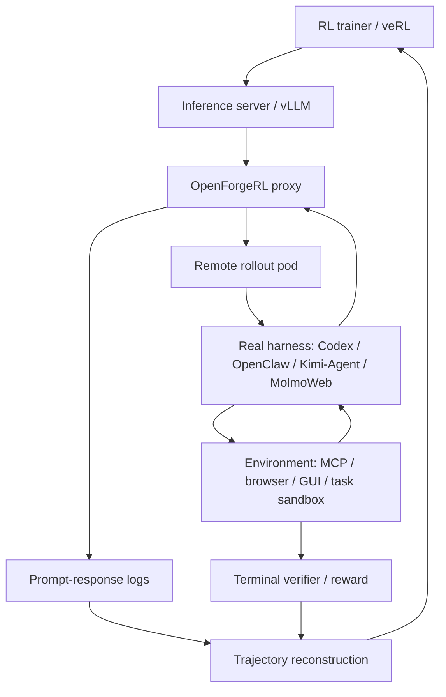
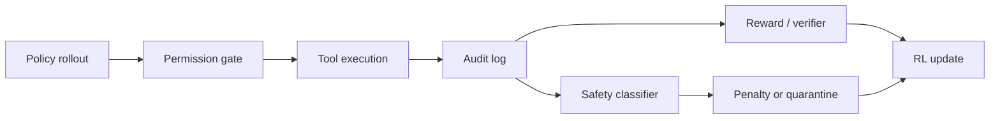

# OpenForgeRL：把 Agent 后训练从“重写 harness”改成“训练真实 harness”

| 项目 | 内容 |
|---|---|
| 论文 | [OpenForgeRL: Train Harness-native Agents in Any Environment](https://arxiv.org/abs/2607.21557) |
| 版本 | arXiv:2607.21557v1，2026-07-23 提交 |
| 作者 | Xiao Yu, Baolin Peng, Ruize Xu, Hao Zou, Qianhui Wu, Hao Cheng, Wenlin Yao, Nikhil Singh, Zhou Yu, Jianfeng Gao |
| 机构 | Columbia University, Dartmouth College, Microsoft Research |
| 主题 | 大模型 Agent、真实 harness 后训练、远程 rollout、GRPO、GUI/Claw Agent |
| 本文定位 | 研究者精读：重点不是“又训练了一个 Agent”，而是把真实 Claude Code/Codex/OpenClaw 这类 harness 放回 RL 训练闭环。 |

### TL;DR

- **论文要解决的问题**：现代 Agent 的能力越来越依赖 harness，而不是裸模型；但开源 SFT/RL 栈通常只会训练简单 ReACT 或本地 tool-call rollout，无法直接表达 Codex、OpenClaw、Kimi-Agent、MolmoWeb 这类 stateful、多进程、长程、带外部环境的 inference harness。
- **核心方法**：OpenForgeRL 用一个轻量 proxy 截获 harness 发出的模型调用，把 prompt-response 对记录成训练样本；再用 Kubernetes orchestrator 把每个 rollout 放进独立远程容器，训练节点只负责模型推理与 RL 更新。
- **训练信号**：rollout 结束后收集终端奖励 \(r_T\)，把同一轨迹中的每步样本重建为 \((s_t^{\mathcal H}, a_t, r_t)\)，其中 \(r_t=\gamma^{T-t}r_T\)，默认 \(\gamma=1.0\)；GRPO 类算法再在同组任务轨迹之间做 advantage 比较。
- **实验覆盖**：论文训练了两条线：OpenForge-Claw 使用 Qwen3-30B-A3B-Thinking，覆盖 ReACT、ZeroClaw、OpenClaw、Codex；OpenForge-GUI 使用 Qwen3-VL-8B-Thinking，覆盖 computer-use 和 browser-use。
- **关键数字**：OpenForge-Claw SFT+RL 在 ClawEval 达到 31.7 pass\(^3\)、55.9 pass@3，在 QwenClawBench 达到 33.7，在 MCPAtlas 89-task 子集达到 28.1；OpenForge-GUI SFT+RL 在 OSWorld-Verified 达到 37.7，在 Online-Mind2Web 达到 63.0，在 WebVoyager 达到 72.3。
- **训练数据规模**：Claw 线使用 892 条 SFT 轨迹和 343 个 RL tasks；GUI computer-use 使用 795 条 SFT 轨迹和 252 个 RL tasks；browser-use 使用 1,496 条 SFT 轨迹和 900 个 RL tasks。
- **最有价值的分析**：跨 harness 表显示，ZeroClaw/OpenClaw/Codex 联合训练比只用 ZeroClaw 更能迁移到复杂 harness；RL 还会减少泛用 shell 依赖，增加自验证、工具覆盖和多步计划完成。
- **主要局限**：错误恢复仍然弱；失败 rollout 目前直接丢弃，partial credit assignment 没解决；数据合成依赖强模型、自动 judge、云端容器和较高成本；代码、数据和模型在论文中仍写作“will release”，复现实证需要等正式释放。

### 研究问题：为什么“真实 harness”开始变成后训练对象？

Agent 论文经常把 policy 写成 \(\pi_\theta(a|s)\)，好像模型直接看见环境状态并输出动作。

OpenForgeRL 的起点更现实：

- 真正运行中的 Agent 通常不是裸 LLM；
- 它被 Claude Code、Codex、OpenClaw、Kimi-Agent、MolmoWeb 这类 harness 包住；
- harness 管理上下文、工具、文件系统、浏览器、GUI、子 Agent、技能和失败重试；
- 用户看到的“模型能力”常常是 **模型先验 + harness 控制流 + 环境反馈** 的合成结果。

这带来一个训练断裂：

| 训练世界 | 部署世界 | 断裂点 |
|---|---|---|
| 单轮 generation | 多轮工具/GUI 操作 | 训练栈拿不到完整真实控制流 |
| 简化 ReACT loop | Codex/OpenClaw 等复杂 harness | 训练时重写 harness 会改变任务分布 |
| rollout 在 trainer 本地跑 | rollout 要容器、浏览器、MCP、桌面 | CPU/内存/网络环境不能和 GPU trainer 混放 |
| 固定 turn limit | harness 自己定义 turn、substep、tool call | “步数”跨 harness 不可比 |
| 失败样本通常按模型失败处理 | 网络、容器、服务、harness 都可能失败 | reward attribution 很容易污染 |

论文的核心主张可以压缩成一句：

> 如果 Agent 部署时依赖 harness，那么后训练也应该在同一个 harness 里发生。

这和近期很多 Agent RL 论文的差异在于：

- 它不先发明一个新任务；
- 不把重点放在单个 reward 函数；
- 不要求每个任务都重写训练 loop；
- 而是把 **rollout 执行权** 从 RL trainer 里拆出来，让真实 harness 在容器里跑。

### 论证路线：claim → mechanism → evidence → boundary

| 层次 | 论文怎么论证 | 证据位置 | 边界 |
|---|---|---|---|
| Claim | 真实 harness 后训练是开源 Agent 研究的基础设施缺口 | Introduction / Related Work | 论文没有证明所有 harness 都值得训练，只证明这种接口可行 |
| Mechanism | proxy 截获模型调用，orchestrator 管远程容器，trajectory reconstruction 回填训练样本 | Figure 2 / Section 3 | 依赖 harness 可以通过模型 API 被代理 |
| Evidence | Claw、computer-use、browser-use 三类实验都有 SFT 到 SFT+RL 的提升 | Table 2 / Table 3 | 评测仍集中在公开 benchmark 和自动 judge 协议 |
| Boundary | harness 难度差异明显，错误恢复仍弱，失败 rollout 直接丢弃 | Section 5 / Appendix D | partial credit、成本、复现和安全隔离还未充分解决 |

这条路线的关键是：

- 先说明为什么普通 RL 栈训练不了真实 harness；
- 再给出一个最小侵入接口；
- 然后展示接口不是只适合单一 coding benchmark；
- 最后用跨 harness 和行为分析证明，“在哪个 harness 里训练”本身会改变 Agent 行为。

### 方法机制：OpenForgeRL 把 trainer 和 harness 解耦

论文给出的架构图是最关键的机制证据。


这张图可以按三层读：

| 层 | 负责什么 | 为什么重要 |
|---|---|---|
| RL training | veRL、slime 等标准训练框架；GPU 上跑 policy inference 和梯度更新 | 保留现有 RL 生态，不把每个 harness 硬塞进 trainer |
| Proxy | 伪装成模型服务，接收 harness 的 generation 请求，再转发给 RL inference server | harness 不需要知道自己正在被训练，trainer 也不用重写 harness |
| Rollout container pods | 每个任务一个远程 sandbox，里面装环境、工具、浏览器、桌面和 harness | 外部系统、CPU/内存、网络依赖从 GPU trainer 中隔离出去 |

用流程表示如下：



这个设计有两个细节值得注意。

**第一，trainer 不再拥有 rollout 的逐步控制权。**

- 在传统 RL 里，trainer 常常决定每一步怎么 sample；
- 在 OpenForgeRL 里，harness 自己决定何时调用模型、何时读文件、何时调用工具、何时进入子流程；
- proxy 只截获模型请求和返回值；
- 因此训练样本是 rollout 之后重建出来的，而不是 trainer 原生展开的。

**第二，环境适配被限制在 sandbox。**

- 如果要支持新的 harness 或新环境，论文认为主要改 sandbox；
- RL 框架、proxy、orchestrator 不需要为每个 benchmark 重写；
- 这让“任何 harness × 任何 environment”的说法有了工程含义。

### 公式：终端奖励怎样变成每步训练样本？

论文把复杂 harness 的内部状态抽象为 \(\mathcal H\)。

普通写法是：

```text
agent receives s_t
agent emits a_t
environment returns s_{t+1}
```

但在真实 harness 里，模型看到的不是原始 \(s_t\)，而是 harness 构造后的上下文：

```text
model sees s_t^H = H(s_t)
model emits a_t
```

OpenForgeRL 记录的是一组 prompt-response pair：

\[
\tau = \langle (s_0^{\mathcal H}, a_0), (s_1^{\mathcal H}, a_1), \ldots, (s_T^{\mathcal H}, a_T) \rangle
\]

rollout 结束后，verifier 给出终端奖励 \(r_T\)。

论文的重建公式是：

\[
\tau = (s^{\mathcal H}_0,a_0,r_0), (s^{\mathcal H}_1,a_1,r_1), \ldots, (s^{\mathcal H}_T,a_T,r_T)
\]

\[
r_t = \gamma^{T-t}\cdot r_T
\]

其中：

| 符号 | 含义 | 论文里的默认处理 |
|---|---|---|
| \(s_t^{\mathcal H}\) | harness 构造后的模型输入 | proxy 从模型请求中记录 |
| \(a_t\) | 模型输出，可能包含 reasoning 和 tool call | proxy 从模型响应中记录 |
| \(r_T\) | 终端任务成功奖励 | 通常由 verifier 或 benchmark 协议给出 |
| \(\gamma\) | reward discount | 通常设为 1.0 |
| \(r_t\) | 回填到每步样本的奖励 | 由终端奖励传播 |

这套公式不是复杂之处。

真正复杂的是：

- harness 可能有子 Agent；
- 一个“turn”在不同 harness 中含义不同；
- Codex 这类 harness 可能不暴露固定 turn limit；
- GUI/browser rollout 可能因为网站、网络、界面、容器而挂起；
- 失败可能不是 policy 造成的。

所以论文引入两个工程规则：

| 问题 | 论文处理 |
|---|---|
| rollout 卡住 | 用 wall-clock timeout，而不是 turn limit |
| 网络、harness crash、timeout 等非 policy 失败 | 参考 DAPO，丢弃整条异常轨迹 |

这个处理很务实，但也留下明显研究空白：

- 如果前半条轨迹做得很好，最后因为外部服务 crash 被丢弃，训练信号会浪费；
- 如果错误来自 policy，直接丢弃又可能放过了应当学习的失败；
- partial rollout credit assignment 是后续工作，而不是本文解决的问题。

### 数据合成：为什么还要造任务，而不是只接 benchmark？

OpenForgeRL 的目标不是只跑现成 benchmark，而是支持训练。

训练需要大量可反复执行、有 verifier 的任务；在 Claw、computer-use、browser-use 这些领域，公开 RL-ready 数据并不够。

论文因此附带一个任务合成 pipeline。

高层流程是：

1. **Propose**
   - 生成贴近真实场景的任务指令；
   - 任务来源包括 web/X API、参考资产、已有 instruction pool。
2. **Prune**
   - 去掉低质量、重复、不可执行或过于模糊的任务。
3. **Build**
   - 为每个任务构建 Dockerfile、环境、初始状态和 verifier script。
4. **Test**
   - 用独立开放模型/VLM 尝试执行任务；
   - Claw 使用 MiniMax-M2.5；
   - computer-use 使用 Kimi-K2.5。
5. **Refine**
   - 根据 rollout 轨迹和 verifier 分数修补环境或指令；
   - 直到任务通过检查。

这条 pipeline 的意义不是“自动造题很新”。

它真正服务的是 OpenForgeRL 的实验闭环：

- 每个 task 必须可以在容器里自动启动；
- 每个 task 必须能被 verifier 反复判定；
- RL 阶段会多次 rollout，同一个 verifier 要稳定；
- GUI/browser 环境要能轻量容器化，否则并发 rollout 成本过高。

训练数据规模如下：

| 域 | Harness | SFT trajectories | RL tasks |
|---|---|---:|---:|
| Claw / tool-use | ReACT、ZeroClaw、OpenClaw、Codex | 892 | 343 |
| GUI / computer-use | modified Kimi-Agent | 795 | 252 |
| GUI / browser-use | modified MolmoWeb | 1,496 | 900 |

论文还给出任务合成成本。

| 任务类型 | 平均耗时 | 平均成本 | 说明 |
|---|---:|---:|---|
| Claw SFT task | 5.2 分钟 | 0.86 美元 | 跳过完整 verifier refine，用 GPT-5.4 judge 过滤 |
| Claw RL task | 16.1 分钟 | 4.36 美元 | 保留 verifier 和 refine |
| Computer-use SFT task | 4.0 分钟 | 1.37 美元 | 同样偏向低成本过滤 |
| Computer-use RL task | 21.3 分钟 | 6.12 美元 | 保留验证和修补 |

这里有一个研究者应该敏感的点：

- SFT 数据和 RL 数据不是同一种可信度；
- RL task 的 verifier 更重，因为它会反复用于训练；
- SFT trajectory 可以更便宜，因为它主要用于蒸馏和过滤；
- 这说明 OpenForgeRL 的成本瓶颈不只是 GPU，还是 task/verifier 工厂。

### 实验一：OpenForge-Claw 证明真实 tool-use harness 可以被训练

OpenForge-Claw 使用 Qwen3-30B-A3B-Thinking 作为 backbone。

训练设置：

| 项 | 设置 |
|---|---|
| SFT teacher | MiniMax-M2.5 |
| RL algorithm | GRPO |
| RL backend | veRL |
| Claw harness | ReACT、ZeroClaw、OpenClaw、Codex |
| 评测 | ClawEval、QwenClawBench、MCPAtlas |
| MCPAtlas 子集 | 默认 20-server 配置下 89 个有 ground-truth tool calls 的任务 |

主结果如下：

| System | ClawEval pass\(^3\) | ClawEval pass@3 | QwenClawBench pass@1 | MCPAtlas pass@1 |
|---|---:|---:|---:|---:|
| Qwen3-30B-A3B-Thinking | 14.3 | 39.8 | 21.8 | 12.4 |
| Qwen3-Coder-30B-A3B-Instruct | 30.4 | 49.7 | 24.3 | 19.1 |
| OpenForge-Claw SFT | 21.7 | 52.1 | 32.1 | 23.6 |
| OpenForge-Claw SFT+RL | 31.7 | 55.9 | 33.7 | 28.1 |

这组数字支持三个判断。

**第一，SFT 已经改变了 tool-use 行为。**

- 从 Qwen3-30B-A3B-Thinking 到 OpenForge-Claw SFT；
- ClawEval pass@3 从 39.8 到 52.1；
- QwenClawBench 从 21.8 到 32.1；
- MCPAtlas 从 12.4 到 23.6。

这说明真实 harness 轨迹蒸馏本身有明显收益。

**第二，RL 主要增加稳定性和平均成功率。**

- ClawEval pass\(^3\) 从 21.7 到 31.7；
- QwenClawBench 从 32.1 到 33.7；
- MCPAtlas 从 23.6 到 28.1。

pass\(^3\) 的提升尤其值得看，因为它更接近“同一个任务多次尝试都可靠”的指标。

**第三，OpenForge-Claw 没有接近闭源最强模型。**

- 表中 Claude Opus 4.6 在 ClawEval pass\(^3\) 是 70.8；
- GPT 5.4 是 60.2；
- OpenForge-Claw SFT+RL 是 31.7。

所以论文证明的是：

- 小规模开放训练能显著改善相近尺寸开源模型；
- 不证明开放 harness-native RL 已经追平前沿闭源 Agent；
- 不应把它误读成“基础设施一接上就能解决所有 Agent 能力差距”。

### 实验二：OpenForge-GUI 说明这不是 text-only trick

GUI 线更难，因为模型要看截图、点坐标、控制桌面或浏览器。

OpenForge-GUI 使用 Qwen3-VL-8B-Thinking 作为 backbone。

训练和评测设置：

| 场景 | Harness | 观察 | 主要评测 |
|---|---|---|---|
| Computer-use | modified Kimi-Agent | screenshot-only，另有 bash 和 str_replace_editor | OSWorld-Verified |
| Browser-use | modified MolmoWeb | 1280×720 screenshot、URL/title/step text | Online-Mind2Web、WebVoyager |

主结果如下：

| System | Steps | OSWorld-Verified | Online-Mind2Web | WebVoyager |
|---|---:|---:|---:|---:|
| Qwen3-VL-8B | 50 | 29.4 | 38.7 | 49.2 |
| UI-TARS-1.5-7B | 100 | 27.4 | 31.3 | 66.4 |
| MolmoWeb-8B | 30 | -- | 35.3 | 78.2 |
| OpenForge-GUI SFT | 30 | 34.4 | 57.4 | 61.5 |
| OpenForge-GUI SFT+RL | 30 | 37.7 | 63.0 | 72.3 |

这组结果的价值在于：

- GUI 不是简单工具调用；
- browser-use 会遇到 CAPTCHA、IP block、动态网站和页面变化；
- computer-use 要处理真实 Ubuntu 桌面、鼠标键盘和应用状态；
- rollout 必须放在可复位、可并发、可观测的容器中。

论文提到 browser-use 对 MolmoWeb 做了两处实用修改：

- 把动作空间改成 JSON 格式，避免额外 action alignment；
- 集成 Browser-Use Stealth Browsers，让 IP/CAPTCHA block 比例从约 40% 降到接近 0。

这说明 OpenForgeRL 的贡献不只是 proxy。

真正跑 GUI RL 时，系统还需要：

- 稳定浏览器；
- 可重复任务采样；
- 自动 evaluator；
- 截图-only 行动格式；
- 步数、任务、动作三层 timeout；
- 对 repeated action 的清洗规则。

### 跨 harness：训练在哪个 harness 里，本身就是实验变量

论文最有研究味的部分在 Section 5。

作者把同一个 OpenForge-Claw 放到四种 harness 下评测：

- ReACT：benchmark 默认简化 loop；
- ZeroClaw：轻量 OpenClaw，容易注册新工具；
- OpenClaw：更复杂的通用 harness；
- Codex：更先进但更难适配 ClawEval custom tools。

跨 harness 结果：

| Model | ReACT pass@1 | ZeroClaw pass@1 | OpenClaw pass@1 | Codex pass@1 | ReACT pass@3 | ZeroClaw pass@3 | OpenClaw pass@3 | Codex pass@3 |
|---|---:|---:|---:|---:|---:|---:|---:|---:|
| Qwen3-30B-A3B-Thinking | 26.1 | 32.5 | 11.4 | 12.2 | 39.8 | 44.7 | 19.3 | 18.6 |
| OpenForge-Claw SFT | 36.2 | 44.5 | 16.7 | 21.1 | 52.1 | 66.5 | 24.2 | 35.4 |
| OpenForge-Claw SFT+RL | 45.1 | 48.5 | 20.9 | 32.5 | 55.9 | 67.1 | 27.8 | 51.5 |

这个表很关键，因为它说明：

- ReACT 和 ZeroClaw 表现更高，不一定是它们更强，而是它们更贴近 benchmark 的工具接入方式；
- OpenClaw 和 Codex 更复杂，适配 custom tools 需要通过 `SKILL.md` 暴露 shell 调用；
- 复杂 harness 不自动带来高分，模型必须学会利用它；
- SFT+RL 对 Codex 的 pass@3 提升很明显，从 35.4 到 51.5。

这对 Agent 系统研究有一个直接启发：

> harness 不是评测噪声，而是 policy 的一部分。

如果同一个模型在不同 harness 下表现差异巨大，那么论文报告 Agent 能力时不能只写模型名。

至少要报告：

- harness 名称和版本；
- 工具暴露方式；
- 是否通过 skills 或 shell adapter 包装；
- turn、step、timeout 的定义；
- 失败解析规则；
- 任务成功判定协议。

### Unseen harness：多 harness 训练为什么有迁移价值？

论文还比较了只用 ZeroClaw 训练和用 ZeroClaw+OpenClaw+Codex 联合训练。

结果如下：

| Training SFT+RL | ZeroClaw pass@1 | OpenClaw pass@1 | Codex pass@1 |
|---|---:|---:|---:|
| None / base | 32.5 | 11.4 | 12.2 |
| ZeroClaw only | 46.0 (+13.5) | 14.7 (+3.3) | 16.8 (+4.6) |
| ZeroClaw+OpenClaw+Codex | 48.5 (+16.0) | 20.9 (+9.5) | 32.5 (+20.3) |

这张表支持一个更强的训练观点：

- 单 harness 训练可以迁移一点；
- 多 harness 训练明显更能迁移到复杂 harness；
- Codex 从 12.2 到 32.5 的提升尤其大；
- 训练多种 harness 可能让模型学到更抽象的工具使用策略，而不是只适配某一个 wrapper。

但也要看边界：

- 这些 harness 都围绕 ClawEval 工具任务；
- 不等于训练过 Claw harness 后就能自动迁移到 browser-use 或 desktop-use；
- 论文没有给出跨任务域的强迁移实验；
- 多 harness 的数据配比、复杂度和 curriculum 仍然是开放问题。

### RL 学到了什么：不是单纯更会“想”，而是更会执行

Section 5.3 的行为分析比主结果更值得看。

作者比较 SFT 和 SFT+RL 的 100 条 ClawEval 轨迹。

在 ZeroClaw harness 下：

- RL 改变了工具调用分布；
- 泛用 `shell` 工具调用减少；
- dedicated service tools 的使用增加；
- 在成功 runs 中，`shell` 占比从 13.2% 降到 5.6%；
- 这说明模型更愿意使用任务专门工具，而不是用 shell 绕行。

在 Codex harness 下：

| 能力 | 定义 | RL 后的方向 |
|---|---|---|
| Format robustness | 长结构化 tool-call 是否能被 harness 解析 | 改善 |
| Error recovery | 命令失败后是否仍能完成任务 | 改善但仍弱 |
| Self-verification | 写操作后是否读回确认 | 改善 |
| Tool coverage | 多服务任务中是否覆盖所需服务 | 改善 |
| Step efficiency | 成功轨迹是否接近最短步数 | 可能因更多验证而受影响 |

这组行为分析给出一个重要判断：

- RL 不只是让模型“答案更对”；
- 它改变了长程执行风格；
- 更像在训练 Agent 的可靠操作习惯。

不过论文也明确指出：

- error recovery 仍然是最弱能力；
- 这可能无法只靠任务终端奖励自动学好；
- 需要专门数据、专门 reward 或显式失败恢复 curriculum。

这点很现实。

许多 Agent 失败不是因为不会第一步，而是因为：

- 工具返回异常；
- 文件路径不符；
- 页面元素变化；
- API 临时不可用；
- 上一步副作用和预期不同；
- 模型没有把错误转化成下一步诊断。

如果训练只看最终成功，错误恢复会被稀疏奖励弱化。

### Figure/Table 证据逐项解读

| 图表 | 支持什么 | 不能证明什么 |
|---|---|---|
| Figure 1 | OpenForgeRL 连接任意 harness × environment，并展示 Claw/GUI 多 benchmark 总览 | 不能证明所有外部 harness 都无需改动即可接入 |
| Figure 2 | proxy + remote pod 是主要架构；新 harness/environment 主要改 sandbox | 不能证明 proxy 对闭源 harness、私有工具或强隔离环境都足够 |
| Figure 3 | 数据合成需要 propose/prune/build/test/refine | 不能证明合成任务完全等价真实用户任务 |
| Table 1 | 训练数据规模只有数百到数千任务 | 不能说明数据质量分布和任务难度完全公开可复现 |
| Table 2 | Claw SFT+RL 在相近尺寸开源 baseline 上明显提升 | 不能说明追平闭源 SOTA |
| Table 3 | GUI SFT+RL 在 OSWorld/Mind2Web/WebVoyager 上提升 | 不能排除 evaluator 或网站分布带来的协议依赖 |
| Table 4 | harness 选择显著影响评测结果 | 不能说明复杂 harness 一定更差，只说明适配和学习难度不同 |
| Table 5 | 多 harness 训练比单 harness 更能迁移到 OpenClaw/Codex | 不能证明跨任务域泛化 |
| Figure 5 | RL 改善工具使用和 agentic reliability | 具体错误恢复仍弱，且样本是 100 条轨迹分析 |

### 和相关工作的关系：它补的是 infrastructure gap

OpenForgeRL 和几类工作相邻，但位置不同。

| 相邻方向 | 典型关注点 | OpenForgeRL 的差异 |
|---|---|---|
| SWE-Agent / coding harness | 设计更好的 Agent-computer interface | OpenForgeRL 不设计单个 harness，而是训练真实 harness |
| veRL / slime / OpenRLHF | 分布式 RL 训练框架 | OpenForgeRL 把复杂 rollout 接到这些框架上 |
| OpenWebRL / GUI Agent RL | 在网页或 GUI 任务上训练 Agent | OpenForgeRL 强调通用 proxy 和 remote sandbox 接口 |
| DAPO / GRPO 后训练 | reward、advantage、训练稳定性 | OpenForgeRL 处理 harness-native rollout 的工程可达性 |
| Orchard Env | 远程 agentic environment 管理 | OpenForgeRL 继承 remote container 思路并接入 harness 训练 |

论文中也提到 concurrent work Polar。

作者认为 Polar 类似地关注软件工程任务中的训练接口，而 OpenForgeRL 覆盖更广：

- text-based Claw tasks；
- computer-use GUI；
- browser-use；
- 六个 benchmark；
- harness choice 和 RL behavior 分析。

这个对比说明：

- OpenForgeRL 的新意不是单一算法；
- 它更像一个把 Agent RL 从 toy rollout 推向 deployment harness 的系统抽象。

### 复现边界：哪些部分还不能轻易复刻？

从论文文本看，复现有几类障碍。

**1. 代码、数据、模型仍未在论文中实际给出。**

- 摘要和结论写的是 will release；
- arXiv 页面当前没有直接可验证的官方 repo 链接；
- 复现者需要等代码、数据、模型和配置释放。

**2. 训练依赖重。**

| 域 | 论文设置 |
|---|---|
| Claw RL | GRPO，batch size 8，group size 8，8×B200，训练 48H |
| Computer-use RL | batch size 8，group size 8，训练 36H |
| Browser-use RL | batch size 12，group size 5，训练 32H |
| rollout pod | 2-4 CPU，2-6GiB memory，按域不同 |

这意味着：

- 复现不是一台工作站上跑脚本；
- 需要 GPU trainer、Kubernetes、容器环境、任务 verifier、云资源；
- browser-use 还要处理真实网站的不稳定性。

**3. 自动 judge 和 verifier 是隐性变量。**

- MCPAtlas 用 Gemini 2.5 Pro judge claim coverage；
- Online-Mind2Web 用 AgentTrek/o4-mini；
- WebVoyager 用 GPT-4o 协议；
- SFT 过滤中还使用 GPT-5.4 judge。

这些 judge 会影响最终分数。

如果未来复现换 judge，必须报告：

- judge 模型版本；
- prompt；
- threshold；
-是否多次采样；
- 失败重试规则。

**4. 失败 rollout 处理仍粗糙。**

论文选择丢弃异常轨迹。

这个策略合理但保守：

- 避免把外部系统错误当作模型负奖励；
- 也可能丢掉可学习的失败前缀；
- 对 error recovery 的训练帮助有限。

这恰好解释为什么论文最后仍发现错误恢复弱。

### 安全视角：真实 harness 后训练会放大哪些风险？

OpenForgeRL 主要是 Agent 训练基础设施论文，不是安全论文。

但它天然触碰安全问题。

| 风险面 | 为什么出现 | 需要的控制 |
|---|---|---|
| 远程容器逃逸 | rollout pods 要运行浏览器、bash、桌面、工具服务 | 镜像最小权限、网络策略、seccomp/AppArmor、凭证隔离 |
| 数据泄露 | harness 可能读写文件、访问网页、记录 prompt-response | 日志脱敏、secret scan、最小化持久存储 |
| Reward hacking | verifier 脚本成为训练目标 | verifier 多样化、不可见测试、对抗检查 |
| Tool misuse | RL 可能强化高效但不安全的工具路径 | 权限分层、write/read 审计、动作白名单 |
| Judge dependency | 自动 judge 可被格式、冗余或 prompt hack 影响 | judge ensemble、规则校验、人工抽样 |
| Harness-specific overfitting | 模型学会 harness quirks | 多 harness 训练、跨 harness regression ledger |

这里最值得关注的是：

- OpenForgeRL 让真实 harness 可训练；
- 真实 harness 往往有更大权限；
- RL 会强化能拿 reward 的行为；
- 如果 verifier 或环境权限设计不严，训练可能放大危险策略。

所以这类系统最好把安全机制放在训练系统内部，而不是只靠发布后 red team。

一个更稳的 OpenForgeRL 安全扩展可以包括：



这能把“是否成功”和“是否安全地成功”分开记录。

### 领域延伸：Agent 后训练接下来该研究什么？

OpenForgeRL 把一个问题推到台前：

> Agent 的训练对象不只是模型权重，而是模型在 harness 中的行为分布。

这会改变几个研究优先级。

**1. Harness-aware benchmark 应该成为默认报告项。**

未来 Agent 论文不应只写：

- model；
- benchmark；
- score。

还应写：

- harness；
- tool adapter；
- skill 文件；
- timeout；
- retry；
- verifier；
- judge；
- rollout isolation；
- error handling。

否则同一个分数无法解释。

**2. 多 harness curriculum 可能比单 harness SFT 更重要。**

Table 5 暗示：

- 多 harness 训练提升复杂 harness 迁移；
- 这像是在训练“操作抽象”；
- 不是简单记住某个 UI 或某个 tool schema。

后续可以研究：

- 先简单 harness 后复杂 harness；
- 先 read-only 工具后 write 工具；
- 先 deterministic verifier 后 fuzzy judge；
- 先短任务后长任务；
- 先低权限后高权限。

**3. Error recovery 需要独立训练信号。**

论文发现 error recovery 仍弱。

这可能需要专门数据：

- 工具失败后继续完成；
- 文件不存在后定位正确路径；
- API 超时后重试或降级；
- GUI 元素变化后重新观察；
- 写操作失败后回滚；
- 多服务任务中局部成功但整体未完成。

也需要专门 reward：

- 失败诊断正确性；
- 恢复步骤数量；
- 是否避免重复同一错误；
- 是否保留已完成子目标；
- 是否在不确定时停止并报告。

**4. Partial rollout credit 是真实 Agent RL 的硬问题。**

OpenForgeRL 当前丢弃异常轨迹。

更细的做法可能是：

| 方法 | 好处 | 风险 |
|---|---|---|
| prefix credit | 保留失败前的正确操作 | 需要判断失败源 |
| failure classifier | 区分 system failure 和 policy failure | 分类器本身可能误判 |
| causal trace replay | 重放关键步骤定位错误 | 成本高 |
| recovery reward | 奖励从失败恢复 | 可能学会制造可恢复失败 |
| human audit sample | 高风险任务人工抽样 | 扩展性差 |

这会成为 harness-native RL 的核心问题。

**5. Agent 安全训练要进入 rollout 层。**

如果 harness 能跑浏览器、shell、文件系统和 MCP 服务，安全不能只看模型输出文本。

应该记录：

- 每次工具调用的权限级别；
- write 操作后的 read-back；
- 外部网络访问；
- 文件变更；
- 凭证读取尝试；
- verifier 与安全 gate 的分歧；
- 成功但不合规的轨迹。

OpenForgeRL 的 proxy/orchestrator 正好是放这些审计点的位置。

### 结论：这篇论文的价值在“训练接口”，不是单个分数

OpenForgeRL 最值得带走的判断是：

- Agent 的能力已经迁移到 harness 层；
- 训练如果仍然只在简化 loop 中发生，就会有 train-deploy mismatch；
- proxy + remote container rollout 是一种低侵入连接方式；
- 小规模 SFT/RL 已能在 Claw 和 GUI 任务上带来稳定提升；
- 但错误恢复、partial credit、复现成本、安全隔离和 judge 依赖仍是硬边界。

研究者读这篇论文时，不应只记住 31.7、63.0、72.3 这些数字。

更重要的是这三个问题：

1. **你的 Agent 评测分数，到底属于模型，还是属于 harness？**
2. **你的训练 loop，是否真的复现了部署时的 harness 行为？**
3. **当 rollout 失败时，你能区分模型失败、环境失败、权限失败和 verifier 失败吗？**

OpenForgeRL 给出的不是最终答案，而是一个更合适的问题框架：

- 把真实 harness 放进训练；
- 把远程环境变成可扩展 rollout；
- 把行为日志变成训练样本；
- 再用跨 harness、跨环境、跨失败类型的证据去判断 Agent 是否真的进步。
