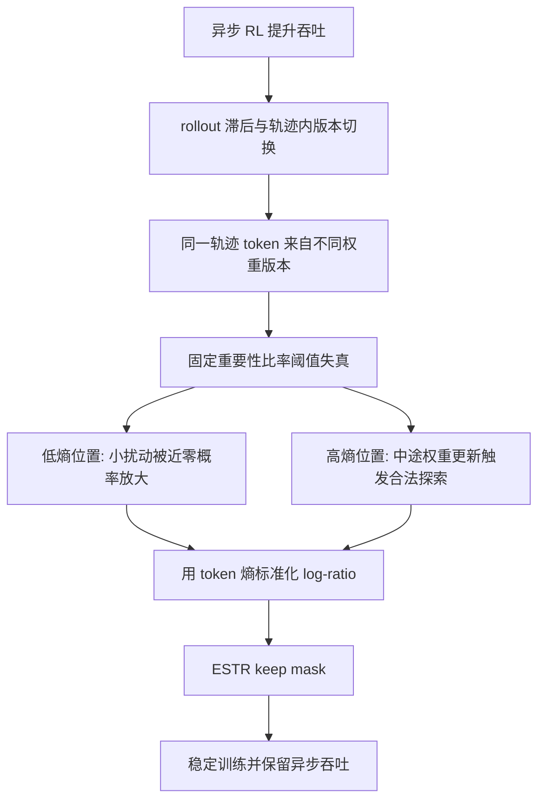

# Deconstructing Off-Policy Ratios：异步强化学习里，为什么同一个重要性比率阈值会同时误杀探索、放过噪声

## 元信息与 TL;DR

- **原文**：[Deconstructing Off-Policy Ratios: Entropy-Scaled Trust Regions for Asynchronous Reinforcement Learning](https://arxiv.org/abs/2607.22186)
- **arXiv ID**：2607.22186
- **发布日期**：2026-07-24 10:55:42 UTC
- **类别**：大模型后训练；也直接触及长程 Agentic RL，因为实验覆盖 deep-search、多轮工具调用和数学推理。
- **作者**：Guanqun Zhao、Zijun Xie、Binbin Zheng、Enlei Gong、Jiafeng Lu、Yehan Yang、Aoqi Hu、Zeyu Chen。
- **一句话定位**：论文把异步 LLM RL 的 off-policy 修正从“看重要性比率绝对值”改成“看比率相对于 token 局部熵是否异常”，提出 ESTR，在保留异步吞吐的同时减少训练坍塌。

### TL;DR

- **它研究什么问题**：异步强化学习把 rollout 生成和参数更新并行化，能加速 LLM 后训练；但长程 Agent 轨迹会使用滞后的行为策略，甚至一个轨迹中途跨多个权重版本，导致 off-policy 梯度不稳定。
- **它批评什么旧假设**：IcePop、KPop 等修正方法用固定阈值判断重要性比率是否可信。论文认为这个假设错在把所有 token 当成同尺度随机变量，而实际的 log-ratio 自然尺度随 token 熵变化。
- **它给出什么机制**：作者把 token 级 log-importance-ratio 写成 $\delta_t=\log \frac{\pi_\theta(y_t|s_t)}{\mu_t(y_t|s_t)}$，再用行为策略熵 $H_t$ 标准化，构造 $S_t=\frac{\delta_t^2}{H_t+\epsilon}$。只有 $S_t\le \tau$ 的 token 才进入 policy gradient。
- **它为什么能工作**：低熵位置上，少量 train-inference 差异会被近零概率分母放大成大比率，主要是采样噪声；高熵位置上，中途权重同步带来的大比率常常是合法探索。固定阈值会把两者搞反。
- **关键数字**：在 BrowseComp-Plus 上，ESTR 达到 37.34 avg@1，高于 Async 28.91、IcePop 32.53、KPop 34.94，接近同步 GRPO 的 38.55；在 GSM8K 上 ESTR 为 95.69，几乎追平同步 GRPO 的 96.07，而异步基线降到 60.72 到 70.51。
- **泛化证据**：在 AIME 2024/2025/2026 上，ESTR 的 AIME Avg. avg@4 为 17.04，接近同步 GRPO 的 17.54；pass@4 为 28.38，略高于同步 GRPO 的 27.68。
- **效率证据**：同等硬件预算下，ESTR 吞吐 214.38 tokens/s/GPU，同步 GRPO 为 82.56；单步耗时 514.84 秒，对比 1356.47 秒，约 $2.6\times$ 加速。
- **主要局限**：证据主要来自 Qwen3-30B-A3B、Qwen2.5-7B、BrowseComp-Plus、多轮 GSM8K、DAPO-Math 和 AIME；论文证明的是“熵缩放阈值优于固定阈值”的训练动力学，不等于已经覆盖所有模型、所有异步系统或极端长程工具环境。

### Scout 候选表

| category_id | canonical_url | external_id | title | 日期 | 推荐理由 | 去重风险 |
|---|---|---|---|---|---|---|
| llm-agent | https://arxiv.org/abs/2607.22511 | arxiv:2607.22511 | CausalForge: A Formally Grounded, Self-Improving Agentic Framework for Automated Research in Causal Inference | 2026-07-24 | Agentic research workflow，偏自动科研系统 | 未命中本地查询 |
| llm-agent | https://arxiv.org/abs/2607.22465 | arxiv:2607.22465 | TRACE-ROUTER: Task-Consistent and Adaptive Online Routing for Agentic AI | 2026-07-24 | Agent 路由与在线适配，工程相关性强 | 未命中本地查询 |
| llm-agent | https://arxiv.org/abs/2607.22385 | arxiv:2607.22385 | Agentic Root Cause Analysis through Evidence-Grounded Reasoning | 2026-07-24 | 面向 RCA 的 evidence-grounded Agent | 未命中本地查询 |
| llm-post-training | https://arxiv.org/abs/2607.22186 | arxiv:2607.22186 | Deconstructing Off-Policy Ratios: Entropy-Scaled Trust Regions for Asynchronous Reinforcement Learning | 2026-07-24 | 后训练、异步 RL、Agentic rollout 三者交叉，公式和实验证据充分 | 已用 jq/脚本查询，未命中 |
| llm-post-training | https://arxiv.org/abs/2607.22039 | arxiv:2607.22039 | Enough is as good as a feast: A Comprehensive Analysis of How Reinforcement Learning Mitigates Task Conflicts in LLMs | 2026-07-24 | 研究 RL 如何缓解任务冲突 | 未命中本地查询 |
| ai-safety | https://arxiv.org/abs/2607.20121 | arxiv:2607.20121 | OpenSkillRisk: Benchmarking Agent Safety When Using Real-World Risky Third-Party Skills | 2026-07-22/2026-07-23 | Agent 安全 benchmark，很契合 | 已收录，丢弃 |
| ai-safety | https://arxiv.org/abs/2607.19913 | arxiv:2607.19913 | JANUS: Foreseeing Latent Risk for Long-Horizon Agent Safety | 2026-07-22 | 长程 Agent 风险预见 | 已收录，丢弃 |

### 为什么选 ESTR

- **日期明确**：arXiv 页面给出 v1 提交时间为 2026-07-24，落在本轮 7 日窗口内。
- **去重明确**：本地 `known-links` 与历史 `items.jsonl` 查询命中 OpenSkillRisk、JANUS，但未命中 `2607.22186`。
- **内容密度高**：论文不是泛泛说“异步更快”，而是给出：
  - token 熵与 log-ratio 方差的关系；
  - 轨迹内版本切换与轨迹间滞后的拆分；
  - token 级 keep mask；
  - BrowseComp-Plus、GSM8K、DAPO-Math、AIME 与吞吐对比。
- **领域意义清晰**：大模型后训练正在从短答 reasoning 走向长程工具交互，异步 rollout 的吞吐收益很诱人；这篇文章试图回答“怎样不靠同步牺牲吞吐，也不让 off-policy 噪声毁掉训练”。

## 研究问题：异步 RL 的速度，为什么会把后训练推到 off-policy 边界

### 同步 GRPO 的隐含成本

在常见 LLM RL 后训练里，生成 rollout、计算奖励、更新策略往往被组织成同步批次。同步有一个好处：

- rollout 来自当前或近似当前策略；
- policy gradient 的 on-policy 假设更容易成立；
- 重要性比率不会因为行为策略滞后而剧烈波动。

但长程 Agent 任务会把同步成本放大：

- 一条轨迹可能包含多轮推理、搜索、工具调用、环境状态读取；
- 不同 prompt 的完成时间差异很大，慢轨迹会拖住整批训练；
- 训练进程等待 rollout，rollout 进程等待下一轮参数，流水线出现空泡。

论文的出发点是：如果为了稳定而完全回到同步训练，后训练系统就很难扩展到真实 agentic tasks。作者关心的不是“异步是否能加速”，而是“异步带来的 stale/off-policy 数据，能不能被更合理地吸收”。

### 异步 RL 的两个滞后来源

论文把异步系统里的 staleness 拆成两个量：

$$
\Delta^{\mathrm{intra}} \triangleq v_{\mathrm{last}}-v_{\mathrm{first}},\qquad
\Delta^{\mathrm{inter}} \triangleq v_{\mathrm{tgt}}-v_{\mathrm{last}}
$$

变量含义：

| 符号 | 含义 | 为什么重要 |
|---|---|---|
| $v_{\mathrm{first}}$ | 轨迹最早 token 使用的权重版本 | 决定 rollout 起点有多旧 |
| $v_{\mathrm{last}}$ | 轨迹最后 token 使用的权重版本 | 长程生成中途可能同步新权重 |
| $v_{\mathrm{tgt}}$ | 当前优化时的目标策略版本 | gradient 实际要更新的策略 |
| $\Delta^{\mathrm{intra}}$ | 同一条轨迹内部跨越的版本差 | 捕捉 mid-generation weight switch |
| $\Delta^{\mathrm{inter}}$ | 轨迹完成后到训练使用之间的版本差 | 捕捉传统意义上的 stale batch |

这一步是论文论证里的关键转折：

- 如果只看 $\Delta^{\mathrm{inter}}$，异步 RL 像是“旧数据复用”问题；
- 但长程 Agent rollout 会让 $\Delta^{\mathrm{intra}}>0$，同一个样本并非来自一个固定行为策略；
- 传统 off-policy correction 假设存在清晰的 behavior policy $\mu$，而这里的 $\mu_t$ 会随 token 位置变化。

### 旧方法为什么会被迫用粗糙阈值

论文把已有修正方法归为三类：

| 方法族 | 典型思路 | 论文指出的失败点 |
|---|---|---|
| 固定区间 clipping / hard masking | 重要性比率超过阈值就截断或丢弃 | 阈值不随 token 熵变化，低熵和高熵位置被同一把尺量 |
| staleness-mismatch decoupling | 重建或近似行为策略，区分漂移和滞后 | 长轨迹跨多个权重版本时，不存在单一行为策略可恢复 |
| off-policy objective redesign | 通过新目标复用 stale 数据 | 常在 batch 或 sequence 层面分配预算，仍不理解 token 局部不确定性 |

作者真正要反驳的是一个常见直觉：

- **旧直觉**：重要性比率越大，token 越不可信。
- **ESTR 直觉**：重要性比率要和局部熵一起看；低熵的大比率多半危险，高熵的大比率可能是探索。

## 论文主张与论证路线

### Claim → mechanism → evidence → boundary

| 层次 | 论文内容 | 读者需要关注的点 |
|---|---|---|
| Claim | 固定 magnitude threshold 不是好的 off-policy 信号 | 它同时犯两种错：放过低熵噪声，压掉高熵探索 |
| Mechanism | log-ratio 的自然尺度随 token 熵增长 | 不是所有 $\delta_t$ 都同分布，token 级 heteroscedasticity 是核心 |
| Evidence | Figure 1/3、Table 1/2、mask fraction 和 staleness sweep | 既看主结果，也看训练动力学是否解释了主结果 |
| Boundary | 在两个模型、数个 benchmark、有限异步设置下成立 | 还没有证明所有 RLHF/RLAIF 系统、所有工具环境都适用 |

### 全文逻辑图



## 方法机制：把“比率大不大”改成“相对局部熵是否离谱”

### 重要性比率与行为策略熵

论文在 token 位置 $t$ 定义：

$$
\delta_t \triangleq \log \frac{\pi_\theta(y_t\mid s_t)}{\mu_t(y_t\mid s_t)}
$$

$$
H_t \triangleq -\sum_{w\in V}\mu_t(w\mid s_t)\log \mu_t(w\mid s_t)
$$

变量解释：

| 符号 | 含义 | 直觉 |
|---|---|---|
| $s_t$ | 当前上下文状态 | 包含 prompt、已生成 token、工具交互历史 |
| $y_t$ | 实际采样到的 token | rollout 中这一位置的动作 |
| $\mu_t$ | 生成该 token 的行为策略 | 异步系统里它可能是旧权重或中途同步后的权重 |
| $\pi_\theta$ | 当前训练更新的目标策略 | loss 反向传播要优化的策略 |
| $\delta_t$ | token 级 log-importance-ratio | 衡量目标策略与行为策略在已采样 token 上的偏离 |
| $H_t$ | 行为策略局部熵 | 衡量这个位置本来有多不确定 |

这里的重点不是公式本身，而是“熵”进入了信任判断。一个高熵位置本来就有多个合理 token，目标策略和行为策略在某个 token 上出现较大比率，并不必然说明样本坏掉。一个低熵位置本来几乎确定，若采到了小概率 off-mode token，大比率更可能是分母接近零造成的噪声放大。

### 熵-比率缩放关系

论文用经验图和附录推导支持下面关系：

$$
\mathbb{E}[\delta_t^2]\propto H_t
$$

读法如下：

- $\delta_t^2$ 不是应该被一个全局常数约束的量；
- 它的二阶尺度随 $H_t$ 增长；
- 因而“同样大小的 $\delta_t$”在低熵和高熵位置含义不同；
- 固定阈值相当于假设所有 token 的 log-ratio 噪声同方差，这与论文观测相反。

作者还用二阶 KL 展开解释 trust region：

$$
D_{\mathrm{KL}}(\mu_t\|\pi_\theta)\approx \frac{1}{2}\mathbb{E}_{v\sim\mu_t}\left[\delta_t(v)^2\right]
$$

这说明信任区间实质上在控制 log-ratio 的二阶矩。问题在于，若二阶矩本来随熵变化，固定阈值就会在低熵处过松，在高熵处过紧。

### 低熵噪声：为什么小概率 token 会制造巨大比率

论文把低熵位置近似成二元选择：

- dominant token 概率为 $1-q$；
- off-mode token 概率为 $q\approx 0$；
- 若 rollout 恰好采到 off-mode token，分母接近零。

二元熵为：

$$
H_{\mathrm{bin}}(q)=-q\log q-(1-q)\log(1-q)
$$

而 train-inference mismatch $\xi$ 的放大近似为：

$$
\mathbb{E}[\delta_t^2\mid q]\approx\frac{\mathrm{Var}(\xi)}{q^2}\propto\frac{1-q}{q}\xrightarrow[q\to 0]{}\infty
$$

这解释了 Figure 1 里低熵区域的异常弧线：

- 熵趋近 0；
- 重要性比率却可能爆炸；
- 这种爆炸不是有益探索，而是 off-mode 采样和近零概率分母造成的噪声。

所以固定阈值的第一种错误是：如果阈值设得宽，为了保留高熵探索，它会把这类低熵异常也放进训练。

### 高熵探索：为什么大比率不一定坏

在长程异步 rollout 中，推理引擎可能在生成中途同步新权重。论文观察到版本切换点附近：

$$
|\delta_t|=\sigma_t\sqrt{H_t},\qquad z_t=\frac{\delta_t}{\sqrt{H_t}}
$$

若 $z_t$ 仍在 $O(1)$ 尺度，而 $|\delta_t|$ 变大主要由 $\sqrt{H_t}$ 推动，那么这个大比率更像是高不确定位置上的合法探索，而不是失控 drift。

固定阈值的第二种错误正好相反：

- 它看到 $|\delta_t|>c$ 就丢弃；
- 但这些 token 可能来自版本切换触发的探索；
- 对 Agentic RL 来说，高熵探索常常对应搜索分支、工具选择、推理路径展开；
- 丢掉它会让训练稳定但保守，最终压低任务表现。

## ESTR：Entropy-Scaled Trust Region

### 标准化预算

ESTR 的核心改写是把原始偏离换成标准化偏离：

$$
z_t=\frac{\delta_t}{\sqrt{\nu_t}},\qquad \nu_t=H_t+\epsilon
$$

于是 token 级 score 为：

$$
S_t=\frac{\delta_t^2}{H_t+\epsilon}
$$

keep rule 为：

$$
S_t\le \tau
\Longleftrightarrow
|\delta_t|\le \sqrt{\tau(H_t+\epsilon)}
$$

这条边界有两个直接效果：

| 熵区域 | ESTR 边界 | 训练含义 |
|---|---|---|
| 低熵 | 边界收紧到 $\sqrt{\tau\epsilon}$ 附近 | 更严格过滤近零分母放大的 off-mode 噪声 |
| 中等熵 | 边界随局部不确定性变化 | 避免一刀切阈值 |
| 高熵 | 边界约随 $\sqrt{H_t}$ 扩张 | 保留版本切换带来的合法探索 |

论文还指出，若强行令 $H_t+\epsilon=C$，ESTR 会退化为固定阈值。也就是说，它不是另起炉灶，而是把固定阈值推广为“局部熵自适应阈值”。

### ESTR 目标函数

论文在 GRPO/PPO 风格 surrogate 上加入 token 级 mask：

$$
r_{i,t}=\frac{\pi_\theta(o_{i,t}\mid s_{i,t})}{\mu_{i,t}(o_{i,t})},\qquad
\delta_{i,t}=\log r_{i,t}
$$

$$
M_{i,t}=\mathbf{1}\left[\frac{\delta_{i,t}^2}{H_{i,t}+\epsilon}\le\tau\right]
$$

完整目标：

$$
\mathcal{L}_{\mathrm{ESTR}}(\theta)=-
\mathbb{E}\left[
\frac{1}{\sum_i |o_i|}
\sum_i\sum_t
M_{i,t}\cdot
\min\left(
r_{i,t}A_{i,t},
\mathrm{clip}(r_{i,t},1-\epsilon_{\mathrm{low}},1+\epsilon_{\mathrm{high}})A_{i,t}
\right)
\right]
$$

需要区分两个门：

| 机制 | 做什么 | 被论文赋予的角色 |
|---|---|---|
| PPO/GRPO clip | 限制可信 token 的 step size | 控制单步更新幅度 |
| ESTR mask $M_{i,t}$ | 直接丢弃超出熵缩放信任区的 token | 防止严重 off-policy 噪声污染梯度 |

### 伪代码

```text
Input:
  prompts D
  asynchronous rollout workers
  target policy pi_theta
  behavior-token logprobs mu_t(y_t | s_t)
  entropy H_t from inference-side logits
  threshold tau, floor epsilon

State:
  rollout buffer B with long-horizon trajectories
  each trajectory may span multiple weight versions

Loop:
  1. Rollout workers generate trajectories with tools/environments.
  2. Training workers consume available trajectories without waiting for a fully synchronous batch.
  3. For each token (i, t):
       r_i,t = pi_theta(o_i,t | s_i,t) / mu_i,t(o_i,t | s_i,t)
       delta_i,t = log(r_i,t)
       S_i,t = delta_i,t^2 / (H_i,t + epsilon)
  4. If S_i,t <= tau:
       M_i,t = 1
       keep token in clipped surrogate loss
     Else:
       M_i,t = 0
       remove token from policy-gradient contribution
  5. Update theta with masked clipped objective.
  6. Track rho_mask and rollout-target KL as diagnostics.

Output:
  A policy updated with asynchronous throughput, while low-entropy amplified noise is filtered.

Failure boundary:
  If entropy estimates are missing, stale, badly calibrated, or produced by an incompatible inference stack,
  the keep rule may lose its intended meaning.
```

## 实验设置：它到底测了什么

### 任务族

论文评估两个任务族：

| 任务族 | 数据/Benchmark | 模型 | 测什么 |
|---|---|---|---|
| 长程多轮工具使用 | BrowseComp-Plus | Qwen3-30B-A3B | Agentic deep search 的 avg@1/avg@4 |
| 长程多轮工具数学 | multi-turn GSM8K | Qwen2.5-7B | 多轮工具化数学 exact-match |
| 数学推理泛化 | DAPO-Math 训练，AIME 2024/2025/2026 评估 | Qwen2.5-7B | 异步后训练是否泛化到竞赛数学 |

### Baseline

所有方法共享实验配置，只改变 token-level acceptance rule：

| Baseline | 机制 | 与 ESTR 的关键差别 |
|---|---|---|
| GRPO(Sync) | 同步训练 | 稳定但有 pipeline 空泡 |
| GRPO(Async) | 异步训练，不做修正 | 吞吐高但最容易坍塌 |
| IcePop | 固定 interval 内保留 token | 仍按 magnitude 一刀切 |
| KPop | 用双向 binary KL 做 token 保留 | 比固定 ratio 更细，但边界仍不直接按局部熵缩放 |
| ESTR | $S_t=\delta_t^2/(H_t+\epsilon)$ | 把信任边界绑定到 token 局部熵 |

### 工程实现

论文说明所有实验基于 verl，在 H800 GPU 上运行，每节点 8 卡；异步设置使用解耦的 rollout pool 和 training pool，同步 baseline 在相同总硬件预算下共置 generation 和 training。

这使效率对比更有意义：

- 不是用更多硬件换吞吐；
- 而是同等资源下比较异步流水线能否减少等待；
- ESTR 的额外开销主要是读取 token 熵，论文称无需额外 forward pass 或显式 version-switch 检测。

## 主结果：ESTR 的证据链

### Table 1：Agentic search、GSM8K、AIME 的主结果

| Method | BrowseComp-Plus avg@1 | GSM8K avg@4 | AIME24 avg@4 | AIME24 pass@4 | AIME25 avg@4 | AIME25 pass@4 | AIME26 avg@4 | AIME26 pass@4 | AIME Avg. avg@4 | AIME Avg. pass@4 |
|---|---:|---:|---:|---:|---:|---:|---:|---:|---:|---:|
| GRPO(Sync) | 38.55 | 96.07 | 19.84 | 27.73 | 16.67 | 27.20 | 16.12 | 28.12 | 17.54 | 27.68 |
| GRPO(Async) | 28.91 | 60.72 | 14.17 | 25.69 | 14.16 | 22.57 | 12.50 | 20.75 | 13.61 | 23.00 |
| IcePop | 32.53 | 65.01 | 17.52 | 27.42 | 15.78 | 25.45 | 14.16 | 22.01 | 15.82 | 24.96 |
| KPop | 34.94 | 70.51 | 18.74 | 26.61 | 15.12 | 25.08 | 14.79 | 24.73 | 16.22 | 25.47 |
| ESTR | 37.34 | 95.69 | 20.03 | 31.78 | 15.64 | 26.23 | 15.46 | 27.14 | 17.04 | 28.38 |

这张表支持三层判断：

- **对比普通异步**：ESTR 相比 GRPO(Async) 在 BrowseComp-Plus 上从 28.91 到 37.34，在 GSM8K 上从 60.72 到 95.69，说明问题不是异步本身无望，而是缺少合适修正。
- **对比异步修正 baseline**：ESTR 在 BrowseComp-Plus 上高于 KPop 的 34.94，也高于 IcePop 的 32.53；在 GSM8K 上，IcePop/KPop 仍大幅落后，说明固定或近固定的 token 保留规则不能处理强 staleness。
- **对比同步 GRPO**：ESTR 没有全面超过同步 baseline，但在多项指标上接近它，且 AIME pass@4 略高，说明保留高熵探索可能带来更多解覆盖。

### Figure 4/5：为什么 BrowseComp-Plus 上不是偶然领先

论文对 BrowseComp-Plus 的训练曲线给出两类诊断：

- Figure 4 显示 validation avg@1 的训练过程，ESTR 在异步方法中持续领先；
- Figure 5(a) 显示 ESTR 能维持稳定上升的 policy entropy；
- Figure 5(b) 显示 rollout-target KL 被控制得最好，训练与推理一致性更强。

这组图的意义是把主结果和机制连起来：

| 观察 | 支持的机制解释 |
|---|---|
| policy entropy 稳定增加 | ESTR 没有像固定阈值那样压掉高熵探索 |
| rollout-target KL 更低 | ESTR 对 off-policy 噪声有更好的过滤 |
| validation accuracy 持续领先 | 不是只靠短期 lucky exploration，而是训练动力学更健康 |

### Figure 6/7：坍塌不是抽象风险

论文在更激进的 GSM8K 和 DAPO-Math 异步设置下展示训练坍塌：

- multi-turn GSM8K 中，IcePop 和 KPop 的训练分数在几百步内不可逆下降；
- DAPO-Math 中，naive async GRPO 很早坍塌，IcePop/KPop 虽避免彻底坍塌但停在较低 reward；
- ESTR 保持稳定上升，并在最终 reward 上领先。

这里值得注意：

- 论文没有只拿最终 accuracy 说事，而是展示了训练过程；
- 对后训练系统来说，“不中途坍塌”往往比单点 benchmark 更关键；
- ESTR 的贡献在于让异步训练的吞吐收益不再以失控方差为代价。

### Figure 8：mask fraction 更低，却更稳

作者用下面指标衡量丢弃 token 的比例：

$$
\rho_{\mathrm{mask}}=1-\frac{1}{\sum_i |o_i|}\sum_{i,t}M_{i,t}
$$

Figure 8 的结论是：

- ESTR 的 $\rho_{\mathrm{mask}}$ 最低，约比固定阈值 baseline 低一个数量级；
- 但它同时让 IS-ratio deviation 最低且更稳定；
- IcePop 尽管 mask 更多，后期 deviation 仍漂移上升。

这正好回应一个可能质疑：

- 不是“多丢 token 就稳定”；
- 也不是“少丢 token 就更探索”；
- 关键在于丢掉哪类 token。

ESTR 丢的是相对局部熵异常的 token，固定阈值丢的是绝对比率大的 token。两者在高熵区域会产生完全不同的选择。

### Figure 9：分别压测 intra/inter staleness

论文把 staleness 拆开做 stress test：

| 压测项 | 取值 | 结论 |
|---|---|---|
| $\Delta^{\mathrm{intra}}$ | 1、5、7、9，固定 $\Delta^{\mathrm{inter}}=1$ | staleness 增大时 reward 单调下降，但没有坍塌 |
| $\Delta^{\mathrm{inter}}$ | 1、5、15、20、30，固定 $\Delta^{\mathrm{intra}}=1$ | 同样表现为 graceful degradation |

这说明 ESTR 不只是对某个默认异步配置调参，而是对两个滞后来源都有一定鲁棒性。不过边界也要说清：

- 它展示的是有限 sweep；
- 没覆盖无限长轨迹、工具失败、环境非平稳奖励、跨模型家族迁移；
- 也没有证明 $\tau$ 和 $\epsilon$ 在所有系统中无需调优。

## Table 2：效率数字为什么重要

| Method | Throughput tokens/s/GPU | s/step | Speedup |
|---|---:|---:|---:|
| GRPO(Sync) | 82.56 | 1356.47 | 1.0x |
| ESTR | 214.38 | 514.84 | 2.6x |

这张表是论文的工程落点：

- 若 ESTR 只是比同步更不稳定但更快，意义有限；
- 若它只是像同步一样稳定但吞吐没有提升，也不是异步 RL 需要的答案；
- 它的主张是两者兼得：接近同步的任务表现，同时拿到异步流水线带来的 2.6x 加速。

但这个数字不能外推过度：

- 2.6x 来自论文的硬件、verl 实现、任务长度和资源切分；
- 在不同推理引擎、通信拓扑、奖励延迟、工具环境下，加速比可能变化；
- ESTR keep rule 低开销不等于整个异步系统低复杂度。

## 消融、失败与反例：论文给了哪些边界

### 消融性质的证据

论文的消融和诊断主要不是“删掉一个模块”的传统表格，而是围绕 trust region 行为展开：

- **mask behavior**：ESTR mask 更少 token，却控制住 IS-ratio deviation；
- **staleness sweep**：分别增大 intra/inter staleness，验证不依赖单一默认设置；
- **training dynamics**：在 BrowseComp-Plus、GSM8K、DAPO-Math 上看 reward、entropy、KL 的变化；
- **hyperparameter sensitivity**：附录提供阈值敏感性，说明 $\tau$ 与 $\epsilon$ 并非完全无关紧要。

这些证据的强点：

- 对机制有针对性；
- 能解释为什么 ESTR 不是简单更保守；
- 覆盖了 Agentic rollout 和数学推理两类环境。

这些证据的弱点：

- 主要围绕作者实现栈；
- 没有公开到可以独立复现实验所有细节的程度；
- 没有展开不同推理框架如何精确保存 inference-side entropy；
- 对 reward model 噪声、工具错误、环境状态漂移的讨论有限。

### 失败案例如何理解

论文里最有价值的失败案例不是某个单独任务失误，而是 baseline 的系统性坍塌：

| 失败对象 | 表现 | 论文解释 |
|---|---|---|
| GRPO(Async) | 在强 staleness 下早期不可逆坍塌 | 无修正，off-policy 方差直接污染梯度 |
| IcePop | mask 较多但后期 ratio deviation 仍漂移 | 固定阈值不能区分低熵噪声和高熵探索 |
| KPop | 比 naive async 稳，但 GSM8K 明显低于同步和 ESTR | 仍没有把 trust boundary 设为 token 局部熵函数 |

对研究者来说，这组失败比“ESTR 更高”更重要。它说明异步 LLM RL 的难点不是单纯阈值调小调大：

- 调小阈值会误杀探索；
- 调大阈值会放过噪声；
- 只有把阈值的尺度条件化到 token 局部不确定性，才可能同时处理两端。

## Figure/Table 逐项证据解读

| 证据 | 论文声称支持什么 | 不能证明什么 |
|---|---|---|
| Figure 1 | per-bin 平均 $|\delta_t|$ 随 $H_t$ 增长，固定阈值会错分低熵噪声和高熵探索 | 不能单独证明所有模型都有完全同样曲线 |
| Figure 2 | 异步 Agentic RL 的轨迹可能跨多个权重版本，staleness 有 intra/inter 两部分 | 不能说明任意系统都允许中途权重同步 |
| Figure 3 | 版本切换点附近 $H_t$ 与 $|\delta_t|$ 同步上升 | 不能证明所有高熵大比率都一定有益 |
| Table 1 | ESTR 在 BCP、GSM8K、AIME 上强于异步 baseline，接近同步 GRPO | 不能证明 ESTR 总是优于同步 |
| Figure 4/5 | ESTR 的 accuracy、entropy、rollout-target KL 动力学更健康 | 不能排除其他未比较修正也能达到类似效果 |
| Figure 6/7 | 强异步设置下 baseline 会坍塌或平台化，ESTR 更稳 | 不能覆盖真实生产 Agent 的全部失败模式 |
| Figure 8 | ESTR 少 mask 但 ratio deviation 更稳 | 不能说明 mask fraction 越低越好 |
| Figure 9 | 对 intra/inter staleness 增大有 graceful degradation | 不能说明极端 staleness 或非平稳环境下也稳定 |
| Table 2 | 同等硬件下 ESTR 获得 2.6x 训练速度 | 加速比不必然迁移到其他框架 |

## 相关工作与位置判断

### 与同步 RL 的关系

ESTR 不是要否定同步 GRPO。同步仍是稳定基线：

- 它避免多数 off-policy 问题；
- 它让实验解释更干净；
- 它适合作为异步方法的上界或参照。

ESTR 的位置更像是：

- 当 rollout 变长；
- 当工具调用和环境交互让同步等待成本变高；
- 当训练系统必须提升 GPU 利用率；
- 才需要把同步的稳定性部分转移到 token-level trust region 上。

### 与固定重要性比率方法的关系

IcePop 类方法的优势是简单：

- 计算容易；
- 行为可解释；
- 工程上容易并入 PPO/GRPO。

ESTR 保留了这种简单性，但改变了判断尺度：

- 不重建完整行为策略；
- 不要求显式检测 version switch；
- 不做额外 forward pass；
- 只需要每个 token 的 behavior logprob 与 entropy。

这使它在工程上比复杂 staleness reconstruction 更轻，但也带来前提：

- 推理侧必须可靠记录 entropy；
- 训练侧必须能把 entropy 与 token 对齐；
- 数据管线必须避免版本、tokenizer、logprob 记录错位。

### 与 Agentic RL 的关系

Agentic RL 的特殊性在于：

- 轨迹长；
- 状态由语言、工具输出、外部页面、代码执行环境共同组成；
- 一个错误工具选择可能改变后续上下文分布；
- rollout 时间差异大，更适合异步流水线。

因此 ESTR 对 Agent 训练的启发不是“再加一个 mask”，而是：

- Agent 训练里的不确定性是局部的；
- tool-use 位置、搜索分支位置、反思位置可能有更高熵；
- 把高熵探索直接当 off-policy 异常丢掉，会让 Agent 学不到长程探索策略。

## 证据边界、可复现性与继续追问

### 已证明得比较扎实的部分

- 在论文设置下，token 熵与 log-ratio 尺度有稳定关系；
- 固定 magnitude threshold 会在低熵和高熵区域产生相反错误；
- ESTR 的 keep rule 能更精确地过滤 token；
- 在 BCP、GSM8K、DAPO-Math/AIME 上，ESTR 明显强于异步 baseline；
- 同等硬件预算下，异步流水线能给出 2.6x 训练速度。

### 仍需谨慎的部分

- **模型覆盖**：只看到 Qwen3-30B-A3B 和 Qwen2.5-7B；不同 MoE、dense、小模型、闭源推理栈可能不同。
- **任务覆盖**：BrowseComp-Plus 和多轮数学能代表一部分长程任务，但不能代表浏览器自动化、代码修复、真实 SaaS 操作、机器人控制等全部 Agent 场景。
- **熵记录质量**：ESTR 假设 inference-side entropy 可得且可信；若推理服务做 top-k 截断、量化、speculative decoding 或 logprob 近似，$H_t$ 的含义需要重验。
- **奖励噪声**：论文更关注 off-policy ratio；真实 RLHF/RLAIF 里 reward model 偏差、judge 漂移、环境 reward 延迟也可能导致坍塌。
- **安全边界**：保留高熵探索对能力训练有价值，但在安全敏感 Agent 里，高熵探索也可能对应高风险工具分支；训练稳定和行为安全不是同一件事。

### 我会继续追问的研究问题

1. **熵缩放能否和权限风险耦合**  
   在 Agent 安全训练里，工具 token 的高熵探索不应被无条件鼓励。一个自然扩展是把 $H_t$ 与 tool-risk score 结合：

   $$
   S_t^{\mathrm{risk}}=\frac{\delta_t^2}{H_t+\epsilon}\cdot (1+\lambda R_t)
   $$

   其中 $R_t$ 表示动作风险、权限级别或环境不可逆性。这样高熵探索仍可保留，但高风险工具调用需要更严格边界。

2. **轨迹级信用分配如何接上 token 级 mask**  
   ESTR 在 token 层判断是否可信，但 Agent 失败常常是轨迹级的：早期搜索方向错，后续所有 token 都“看似合理”。后续可以研究 token mask 与 trajectory-level verifier 的组合。

3. **极长程上下文压缩会怎样影响 entropy-ratio 关系**  
   若 Agent 使用上下文压缩、记忆检索或状态摘要，$s_t$ 本身会被改写。此时 $H_t$ 上升可能来自真实探索，也可能来自状态丢失。ESTR 需要和状态完整性诊断一起使用。

4. **异步训练系统是否需要把版本信息显式暴露给 loss**  
   ESTR 的优点是不要求显式 version-switch detection。但如果系统已经能记录每个 token 的权重版本，把 $\Delta^{\mathrm{intra}}$、$\Delta^{\mathrm{inter}}$ 加入诊断，可能进一步区分“探索”和“漂移”。

## 外部参考搜索记录

- 精确搜索词包括：
  - `"Deconstructing Off-Policy Ratios" ESTR asynchronous reinforcement learning`
  - `"Entropy-Scaled Trust Region" "Asynchronous Reinforcement Learning"`
  - `"2607.22186"`
- 结果情况：
  - 本轮未找到高质量第三方深度解读；
  - 可用的一手来源是 arXiv abstract、HTML 正文和论文 PDF；
  - 因此本文主要依据一手论文内容，相关工作只按论文引用和方法族做有限位置判断。

## 结论

ESTR 这篇论文的价值，在于它把异步 LLM RL 的稳定性问题从系统层“数据滞后”推进到 token 层“尺度错配”。固定重要性比率阈值之所以不够，是因为低熵和高熵 token 的同一个 $\delta_t$ 不代表同一种风险。

对后训练研究者来说，最值得带走的是三个判断：

- **异步不是免费加速**：长程 Agent rollout 会打破单一 behavior policy 假设，尤其是轨迹内版本切换。
- **trust region 要局部化**：token entropy 提供了一个低开销、机制清晰的局部尺度。
- **稳定与探索可以同时优化**：ESTR 少丢 token、控制 ratio deviation，并在多个任务上接近同步 GRPO，同时保留 2.6x 训练速度。

但它也不应被读成“异步 RL 已解决”。更准确的结论是：如果后训练要继续走向长程 Agent、工具调用和在线环境，训练系统必须记录并利用更细粒度的生成时状态。ESTR 证明了 token 熵是一个强信号；下一步问题是，权限风险、环境状态、上下文压缩、奖励可信度这些同样局部且动态的变量，能否一起进入异步 Agent RL 的信任边界。
