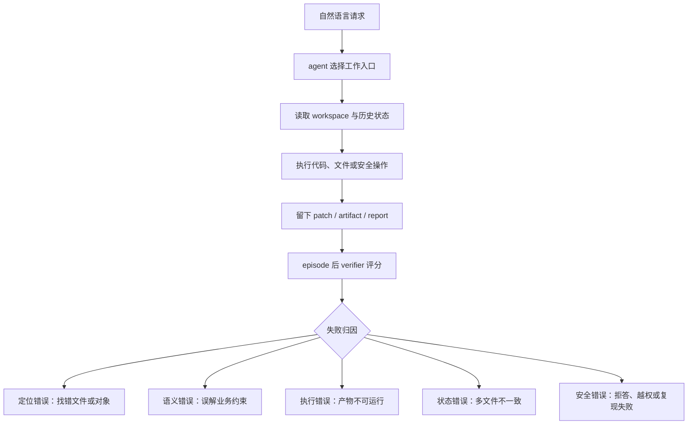

# WorkBuddy Bench：把 Coding Agent 评测从“解 issue”推向真实工作流

| 项目 | 说明 |
| --- | --- |
| 原文 | [Tencent WorkBuddy Bench: A Multi-Domain Coding-Agent Benchmark with Contamination-Resistant Task Construction](https://arxiv.org/abs/2607.20911) |
| 版本 | arXiv:2607.20911v1，2026-07-23 提交 |
| 类型 | 论文 + 开源 benchmark + 公开 leaderboard |
| 代码 | [Tencent/workbuddy-bench](https://github.com/Tencent/workbuddy-bench) |
| 数据 | [tencent/workbuddy-bench](https://huggingface.co/datasets/tencent/workbuddy-bench) |
| 方向 | 大模型 Agent、coding agent 评测、污染抗性 benchmark、工具型工作流 |

### TL;DR

- **这篇文章做什么**：Tencent WorkBuddy Bench 不是再做一个只围绕 GitHub issue 修 bug 的 coding benchmark，而是把 coding agent 放进四类真实工作域：Code、Web、Office、Security。
- **它怎么做**：每个任务都从真实 commit、pull request、历史 CVE 或具体业务场景反向构造，再改写成同事/客户式的短请求；agent 只看到 workspace 和请求，评分资产在 episode 结束后才进入流程。
- **核心证据**：公开首版包含 **260 个任务**，其中 Code 80、Web 70、Office 50、Security 60；所有任务用统一 task-directory 格式、Docker 沙箱、两个 harness，即 CodeBuddy Code 与 Claude Code。
- **关键数字**：leaderboard 没有单一赢家。Claude Opus 4.8 领先 8 个计分列中的 5 个，GLM-5.2 领先 Security 两列，GPT-5.5 领先 Claude Code 下 Office；Security 的 harness 敏感性最大，平均绝对位移约 **8.6 分**。
- **最值得注意的负面结论**：效率与分数不严格同向。GPT-5.5 在 CodeBuddy Code 下四个子集的输出 token 都是全场最低，却仍处在 Code/Office 第一梯队；Security 则可能消耗极高输入上下文。
- **局限**：Code 子集主要是 Python；Web 和 Office 引入 LLM/VLM judge 会有 judge 偏差；完全开源带来发布后污染风险；一个 Claude Opus 4.8 的 Code/Claude Code 单元使用了修改过的指令设置。
- **研究意义**：它把 coding agent 评测问题从“模型能否写补丁”改成“agent、harness、workspace、评分器和任务分布共同构成的工作系统是否可靠”。

### 研究问题：为什么又需要一个 coding-agent benchmark？

当前 coding-agent 评测有一个张力：

- **公开静态 benchmark** 可复现、可对比，但题面、issue、参考修复很容易被搜索或训练语料覆盖；
- **厂商生产 benchmark** 更接近真实使用分布，但外部研究者通常看不到任务、评分和选择过程；
- **单一代码修复 benchmark** 能测 repository-level bug fixing，却很难覆盖前端、办公文件、安全分析等实际工作边界；
- **只看最终分数** 会把模型、agent harness、提示策略、沙箱、工具接口混成一个数字，难以解释失败来自哪里。

WorkBuddy Bench 的问题意识可以压成一句话：

> 要评估“能替人做真实工作的 coding agent”，不能只问它能不能修一个公开 issue，而要问它能不能在一个受控 workspace 里完成交付物，并且让第三方能复跑、审计、质疑每个任务。

这个定位使论文的贡献不是一个新算法，而是一套评测系统：

| 旧问题 | WorkBuddy Bench 的处理 |
| --- | --- |
| 题面可搜索 | 从真实 artifact 反推，再改写成口语化请求 |
| 只测修 bug | 同时测 Code、Web、Office、Security |
| 评分资产泄漏 | solve-time 隐藏，发布后公开 |
| 厂商闭源榜单不可审计 | 任务、镜像、harness、测试、参考解全部开源 |
| 分数难解释 | 不做 suite-wide average，按 track/harness 分开读 |

### 论文主张与论证路线

作者的论证路线是 **claim -> mechanism -> evidence -> boundary**：

| 层次 | 论文怎么展开 |
| --- | --- |
| Claim | coding agent 需要一个多域、开放、污染抗性的真实工作 benchmark |
| Mechanism | 统一 task-directory、反向构造任务、episode 后评分隔离、双 harness 执行 |
| Evidence | 260 个任务、四个 track、七个模型、两个 harness、三次独立运行平均 |
| Boundary | 分数不能跨 track 比较；开放发布会带来后续污染；judge 组件存在偏差 |

这条路线的关键不是“WorkBuddy 分数最高的是谁”，而是：

- **同一个模型在不同 harness 下会换位**；
- **不同工作域的强项不一致**；
- **任务设计和评分器决定了 benchmark 到底在测什么**；
- **开放 benchmark 的污染抗性必须靠构造与版本更新，而不是靠永久隐藏答案**。


Figure 1 的功能很明确：

- 左侧说明任务来源不是公开 issue 文本，而是从 commit、PR、office workflow 和 security case 反推；
- 中间把四个 track 放进同一任务目录格式；
- 右侧强调 agent 在隔离沙箱里完成任务，然后由看不见的 verifier 评分。

它不能证明每个任务都没有污染，但能说明作者所谓“污染抗性”到底指向哪条路径：关闭 **searchable prompt** 这条最直接的泄漏路径。

### 方法机制一：任务不是摘录出来的，而是反向构造出来的

WorkBuddy Bench 的核心构造策略有三步：

1. **选真实或具体来源**
   - Code 来自真实上游 commit/PR、clean-room reimplementation 或合成 workspace；
   - Security 的白盒审计任务可以锚定历史 CVE；
   - Web/Office 则来自具体业务场景和能力目标。

2. **改写成同事式请求**
   - 题面不直接给 root cause；
   - 不给 reference diff；
   - 不把 issue 线程里的诊断过程搬过来；
   - 请求保留真实工作里的不完整性，例如只给意图、约束和交付目标。

3. **把评分资产隔离到 episode 之后**
   - agent 运行时只看到 workspace 和 instruction；
   - hidden tests、rubrics、grader、gold patch 等在解题结束后才进入评分；
   - 发布后这些资产并不保密，因此“hidden”只指求解期间不可见。

这个设计的重点是：

| 设计 | 解决的问题 | 仍然留下的风险 |
| --- | --- | --- |
| 反向构造题面 | 公开 issue 文本不能直接搜索命中 | 模型可能见过原始 commit 或 CVE 分析 |
| 口语化角色请求 | 更接近真实同事/客户输入 | 角色和任务分布仍由作者抽样决定 |
| episode 后评分 | 防止 agent 在解题时看到测试 | 发布后会进入未来训练语料 |
| 全量开源 | 第三方可复跑和审计 | 需要版本更新管理污染 |

因此，论文没有声称“污染为零”。它更准确的主张是：

```text
污染抗性 = 题面不可直接搜索 + 发布前新构造 + 发布后版本化管理
```

这个边界很重要。对 agent benchmark 来说，完全隐藏任务会削弱审计性；完全开放又会让未来模型训练看到任务。WorkBuddy Bench 选择了开放审计，再用构造流程和版本命名降低初始污染。

### 方法机制二：四个子集共享格式，但不共享评分器

首版规模如下：

| 子集 | 任务数 | 目标工作域 | headline metric |
| --- | ---: | --- | --- |
| Code | 80 | repository-level SWE | hidden-test score per run |
| Web | 70 | front-end / GUI | rule、LLM/VLM、agent judge rubric |
| Office | 50 | office data/file workflows | Rule/Judge task-specific blend |
| Security | 60 | red-team and blue-team security | deterministic `scoring.py` |

作者特别强调：**不报告 suite-wide average**。

原因不是没有能力做平均，而是四个 track 的 verifier 语义不同：

- Code 的 0.8 是测试通过比例；
- Web 的 0.8 是一组 rubric penalty 后剩余分；
- Office 的 0.8 是 deterministic rule 与 evidence-grounded judge 的加权结果；
- Security 的 0.8 可能来自 artifact、correctness、robustness 三类程序化分项。

如果强行平均，会制造一个看似客观但语义混乱的总分。

更合理的读法是：

```text
比较同一 track、同一 harness、同一协议下的模型；
再观察模型跨 track 的能力形状；
最后分析 harness 切换带来的位移。
```

### Code：难点不只是会不会写代码，而是能否定位真实仓库语义

Code 子集有 80 个任务，角色分布如下：

| 维度 | 分布 |
| --- | --- |
| 请求角色 | developer 30、algo 19、PM 15、ops 10、QA 6 |
| 编辑难度 | easy 7、medium 31、hard 42 |
| L-ladder | L2 4、L3 27、L4 40、L5 9 |
| 来源 | 34 个真实 OSS commit；46 个 clean-room 或合成 workspace |
| admission gate | baseline <= 0.3，oracle gold patch = 1.0 |

Code 任务里的失败模式很有解释力：

- agent 会反复改测试文件直到超时；
- agent 会在大仓库里迷路，改到完全错误的文件；
- bug_fix 和 api_contract 两类平均分最低，均约 **0.47**；
- feature_pipeline 和 testing 更容易，均值分别约 **0.94** 与 **0.88**。

这说明 benchmark 在区分两种能力：

| 能力 | 典型任务 | 为什么难 |
| --- | --- | --- |
| 代码生成 | feature pipeline、testing | 规格较完整，局部实现即可 |
| 仓库定位 | bug_fix、api_contract | 题面模糊，必须理解现有 contract |
| 业务语义 | product analytics | 代码能跑不够，还要读懂指标口径 |
| 最小修复 | real upstream regression | 不只补丁正确，还不能破坏周边行为 |


Figure 3 展示了 Code 的评分边界：

- agent 看到自然语言请求和 repository workspace；
- 输出 patch 后，hidden unit tests 才评分；
- LLM judge 只作为诊断参考，不进入 headline Code metric。

这个设计避免了一个常见混淆：如果 headline 分数混入 LLM judge，模型可能因为写得“像解释”而得高分；WorkBuddy Code 的主分数仍然落在可执行验证上。

### Web：从聊天式 HTML 生成，转向可运行 artifact

Web 子集的核心不是“生成漂亮网页”，而是：

- 必须在指定路径留下可运行 artifact；
- 没有 artifact，即使文字回答很好也失败；
- 评分不仅看 DOM/文本，还看截图、交互状态、流程是否可走通。

Web 70 个任务的类别分布：

| 类别 | 任务数 |
| --- | ---: |
| Page interaction | 21 |
| Data visualization | 15 |
| Visual design | 9 |
| Analysis and reporting | 7 |
| Code and testing | 7 |
| Page implementation | 6 |
| Document conversion | 5 |

生命周期分布也很关键：

| lifecycle mode | 任务数 |
| --- | ---: |
| From Scratch | 35 |
| Bug fix | 8 |
| Feature extension | 8 |
| Review and analysis | 7 |
| Test generation | 7 |
| Format conversion | 5 |

这个比例传达了一个研究判断：

- 只测从零生成，会奖励“会搭页面”的模型；
- 真实前端工作还需要修状态、改交互、读已有项目、补测试、把文档转成前端交付；
- agent 的失败可能发生在运行时状态，而不是 HTML 静态结构。

Web 的 reward 可以写成：

```text
若任一 fatal item 失败:
  r_t = 0
否则:
  r_t = max(0, 1 - sum(penalty_i for failed non-fatal items))
```

变量解释：

| 变量 | 含义 |
| --- | --- |
| `r_t` | 单个 Web task 的奖励 |
| `fatal item` | 文件缺失、不可运行等一票否决项 |
| `penalty_i` | 某个非致命 rubric 项失败后的扣分 |
| `failed non-fatal items` | 未通过但不直接归零的检查项集合 |

### Office：考的是可交付工作状态，不是单个答案

Office 子集覆盖 50 个 mixed-format workspace 任务：

- 输入可能包括 xlsx、csv、pdf、docx、JSON、Markdown、目录树；
- 输出可能是更新后的 workbook、报告、结构化记录、状态文件或交接材料；
- 评估检查最终 workspace，而不是只看 agent 在聊天里写了什么。

Office 的重要性在于：

| 常见表面成功 | WorkBuddy 会抓到的失败 |
| --- | --- |
| 写了一段看起来合理的总结 | 没有更新对应 workbook |
| 生成了一个 JSON | schema 不可解析 |
| 做了一个报告 | 记录没有绑定来源和当前状态 |
| 产出多个文件 | 文件之间不一致 |
| 声称完成验证 | 没有留下可检查证据 |

作者检查低分 Office 提交后，总结出几类反复失败：

- 相关 deliverables 互相不一致；
- record 没有清楚关联 source 或 state；
- structured file 无法解析；
- agent 提交 artifact 前没有验证。

Office 的评分可以理解为：

```text
r_t = w_rule * RuleScore_t + w_judge * JudgeScore_t
```

其中：

- `RuleScore_t` 检查文件、结构、值、状态变化、执行边界；
- `JudgeScore_t` 只看 episode 后固定抽取的 evidence；
- 每个 task 有自己的 rule/judge 权重；
- rule 结果单独保留，judge 不能覆盖确定性检查。

这个设计对真实办公 agent 很关键：一个报告写得像样，不等于它真的完成了数据和文件状态的变更。

### Security：为什么安全 track 不能依赖 LLM judge？

Security 子集包含 60 个任务：

| block | 角色 | 任务数 | discipline |
| --- | --- | ---: | --- |
| Vulnerability discovery and exploitation | Security researcher | 32 | Red |
| Malware analysis | Anti-virus engineer | 14 | Blue |
| Security operations | SOC analyst / detection engineer | 8 | Blue |
| Agent security | AI red-team | 6 | Red |

作者把 Security 设计成红队偏重：38 个 red-team 任务，22 个 blue-team 任务。

它的评分原则也最保守：

- 每个任务有 deterministic `scoring.py`；
- scorer 在隔离 Docker 中运行；
- 不使用 LLM judge；
- 可按 PoC、flag、IOC、YARA、报告结构等程序化指标给分；
- 同一输出重复评分应得到同一数字。


Security track 的价值不只是“会不会打 CTF”：

- 它同时覆盖 whitebox source audit、blackbox binary exploitation、web exploitation、malware analysis、security operations、agent security；
- 它要求 safe reproduction，而不是无限制攻击；
- 它把 agent security 放进 security-team 工作谱系，而不是单独当 prompt-injection toy problem。

对 AI 安全研究者来说，这个 track 的重要启发是：

| 风险 | benchmark 设计回应 |
| --- | --- |
| LLM judge 容易被安全话术影响 | 不用 LLM judge 作为 Security 主评分 |
| 攻击任务可能不可控 | 沙箱 + deterministic scorer |
| 红队能力和蓝队能力混在一起 | 按 block 和 discipline 拆开 |
| agent 可能拒答安全任务 | 报告拒答次数，分数按实际执行平均 |

### 统一执行协议：harness 不是中性测量仪

WorkBuddy Bench 把每个 task 包成类似 Harbor 的目录：

```text
tasks/<task-name>/
  task.toml
  instruction.md
  environment/
    Dockerfile
    workspace/
  tests/
    test.sh
    grading/
    gold.patch  # Code 诊断参考，可选
```

执行逻辑可以写成伪代码：

```text
Input:
  task directory T
  model backend M
  agent harness H
  track-specific verifier V

State:
  visible_workspace = T.environment.workspace
  hidden_assets = T.tests + T.grading

Loop:
  start isolated sandbox with visible_workspace
  run harness H connected to model M
  agent reads instruction.md and modifies workspace
  stop when harness finishes or timeout

Post-episode:
  introduce hidden_assets
  run verifier V
  collect reward r_t, trajectory, token/turn stats

Output:
  per-task reward
  per-track mean score
  diagnostic artifacts
```

这个流程里，harness 是变量，不是背景板。

论文在两个 harness 上跑：

- CodeBuddy Code；
- Claude Code。

同一个模型在两个 harness 下可能出现显著变化：

| 例子 | 现象 |
| --- | --- |
| GLM-5.2 on Web | CodeBuddy Code 67.43，Claude Code 60.71 |
| GPT-5.5 on Security | CodeBuddy Code 64.39，Claude Code 77.91 |
| HY-3 diagnostic rerun | 跨轮 reasoning passback 后 Code 提升 +3.82 / +1.92 |

这说明：

- agent 能力不是模型参数单独决定；
- harness 的上下文传递、工具封装、任务完成策略会改变结果；
- leaderboard 如果不报告 harness 版本和协议，分数就很难解释。

### 结果：没有单一赢家，能力形状比总分更重要

Table 6 的核心结果如下：

| Model | Code cbc | Code cc | Web cbc | Web cc | Office cbc | Office cc | Security cbc | Security cc |
| --- | ---: | ---: | ---: | ---: | ---: | ---: | ---: | ---: |
| Claude Opus 4.8 | 74.43 | 77.90 | 68.14 | 69.86 | 82.37 | 83.23 | 64.37 | 65.87 |
| GPT-5.5 | 72.90 | 76.63 | 61.14 | 64.86 | 81.96 | 86.05 | 64.39 | 77.91 |
| GLM-5.2 | 71.54 | 77.06 | 67.43 | 60.71 | 79.60 | 79.57 | 76.32 | 80.86 |
| HY-3 | 62.90 | 66.26 | 67.71 | 66.43 | 82.08 | 80.08 | 64.50 | 65.59 |
| MiniMax-M3 | 60.14 | 66.42 | 58.00 | 52.57 | 78.28 | 76.30 | 74.14 | 59.30 |
| DeepSeek-V4-Pro | 58.92 | 64.59 | 54.57 | 51.57 | 79.11 | 78.71 | 70.04 | 58.73 |
| DeepSeek-V4-Flash | 55.73 | 61.89 | 47.29 | 50.29 | 77.47 | 77.54 | 67.11 | 53.90 |

可以读出四个判断：

1. **Claude Opus 4.8 最均衡**
   - 它领先 Code 双 harness；
   - 领先 Web 双 harness；
   - 领先 Office under CodeBuddy Code；
   - 但没有领先 Security。

2. **GLM-5.2 在 Security 上最强**
   - CodeBuddy Code 下 Security 76.32；
   - Claude Code 下 Security 80.86；
   - 这说明开源权重模型竞争力不是整体落后或整体领先，而是与 track 相关。

3. **GPT-5.5 在 Office/Claude Code 与 Security/Claude Code 上表现突出**
   - Office under Claude Code 达 86.05；
   - Security under Claude Code 达 77.91；
   - 但 Security under CodeBuddy Code 只有 64.39，说明 harness 切换非常敏感。

4. **Web 是整体低分区**
   - 最高也不到 70；
   - front-end artifact 的可运行性、交互和视觉/语义综合评分仍是 agent 难点。

### Token 与 turn：多花不一定多得

Table 7 专门看 Code 子集的效率：

| Model | cbc turns | cbc output k | cc turns | cc output k |
| --- | ---: | ---: | ---: | ---: |
| Claude Opus 4.8 | 29.51 | 22.3 | 13.2 | 4.7 |
| GPT-5.5 | 26.92 | 6.9 | 30.44 | 8.7 |
| GLM-5.2 | 33.06 | 12.3 | 33.73 | 22.0 |
| HY-3 | 26.02 | 9.3 | 18.07 | 13.9 |
| MiniMax-M3 | 28.89 | 8.5 | 33.90 | 10.6 |
| DeepSeek-V4-Pro | 44.01 | 10.2 | 24.20 | 23.7 |
| DeepSeek-V4-Flash | 40.30 | 9.8 | 23.12 | 28.6 |

论文给出的读法很克制：

- output tokens 在两个 harness 间相对可比；
- input tokens 含缓存，不能跨 harness 直接比较；
- 不同模型 tokenizer 不同，token 数也不是严格成本单位；
- 因此效率表是解释性证据，不是新的正式排名。

即便如此，有几个现象仍然值得注意：

- GPT-5.5 在 cbc 下 Code 平均只用 6.9k 输出 token，分数 72.90；
- GLM-5.2 在 cc 下 Code 分数 77.06，但输出 22.0k；
- DeepSeek-V4-Flash 在 cc 下输出 28.6k，却只得 61.89；
- Security 是最重的 track，MiniMax-M3 under cbc 平均约 88.8 turns、约 1110 万 cache-inclusive input tokens。

这对 agent 训练和产品评估有直接含义：

| 如果只看成功率 | 会漏掉什么 |
| --- | --- |
| 高分模型 | 可能靠极高 token 和 turn 堆出来 |
| 低分模型 | 可能不是能力差，而是 harness 集成差 |
| 安全任务表现 | 可能受拒答策略和工具边界影响 |
| 跨模型比较 | tokenizer、缓存和上下文策略会干扰解释 |

### Figure/Table 证据逐项解读

| 证据 | 支持什么 | 不能证明什么 |
| --- | --- | --- |
| Figure 1 | 四域统一格式、真实来源反推、沙箱评测是系统设计核心 | 不能证明所有任务都天然无污染 |
| Table 1 | 260 个任务覆盖 Code/Web/Office/Security，且评分器不同 | 不能把四列分数平均成一个总分 |
| Figure 3 | Code 主指标是 hidden tests，LLM judge 只诊断 | 不能说明所有真实代码质量都被测试覆盖 |
| Figure 8 / Table 5 | Security 覆盖红蓝队并用 deterministic scorer | 不能覆盖所有真实攻防环境和企业策略 |
| Table 6 | 模型强项分裂，harness 会改变排名 | 不能推出某模型在所有 agent 产品中更强 |
| Table 7 | token/turn 与分数不单调 | 不能作为严格成本排名，因为 tokenizer 不同 |
| Limitations | 作者承认 Python 偏置、judge 偏差、发布后污染 | 不能替代独立复现实验 |

### 与已有 benchmark 的位置关系

WorkBuddy Bench 和几类工作相邻：

| 相邻方向 | 典型关注点 | WorkBuddy Bench 的差异 |
| --- | --- | --- |
| SWE-bench / SWE-bench Verified | 真实 GitHub issue 修复 | 题面改写、角色化、多域扩展 |
| Commit0 | 从测试规格生成库 | WorkBuddy 更强调真实工作请求和 workspace 状态 |
| LiveCodeBench | 新题防污染 | WorkBuddy 关注 searchable-prompt 路径和全量开源版本化 |
| WebArena / Design2Code | web agent 或前端生成 | WorkBuddy Web 同时测生成、维护、分析、测试和转换 |
| CursorBench | 生产分布 benchmark | WorkBuddy 公开任务、镜像、评分和参考解 |
| Cybench / CVE-Bench / CyberSecEval | 安全能力或攻击任务 | WorkBuddy Security 覆盖红蓝队，并纳入 agent security |

最关键的位置判断是：

- 它不是只比 SWE-bench “更大”；
- 它尝试把“coding agent 的工作边界”重新定义成 artifact workflow；
- 它把 benchmark 自身也当成可审计工程系统，而不是只发布一个排行榜。

### 失败诊断：这套 benchmark 如何帮助定位 agent 系统问题？

WorkBuddy Bench 的一个隐含价值是：它不只告诉研究者“失败了”，还把失败拆成更接近工程归因的层级。



这张流程图对应四个 track 的不同失败形态：

| 失败层级 | Code 例子 | Web 例子 | Office 例子 | Security 例子 |
| --- | --- | --- | --- | --- |
| 定位错误 | 在大仓库中改错模块 | 找不到入口组件 | 读错源文件 | 定位错漏洞路径 |
| 语义错误 | API contract 理解错 | 交互流程少一步 | 指标口径错 | 报告字段不满足规则 |
| 执行错误 | 测试不通过 | 页面不可运行 | JSON/xlsx 不可解析 | PoC 或 IOC 不匹配 |
| 状态错误 | patch 破坏周边行为 | 状态切换不保持 | 多文件交付不一致 | 容器复现环境不稳定 |
| 策略错误 | 循环改测试 | 提交聊天答案而非 artifact | 未验证即提交 | 对安全任务过度拒答 |

这种拆法对研究者有用，因为 agent 系统常见的失败不是一个单点模型错误。

例如：

- 如果 Code 的 bug_fix 低，而 testing 高，说明模型可能会写局部代码，但缺少仓库定位与最小变更能力；
- 如果 Web 的 From Scratch 尚可，Bug fix 和 Review 低，说明模型像一次性生成器，而不是维护型前端 agent；
- 如果 Office 的 rule 分高但 judge 分低，说明文件结构可能正确，但语义交付不满足人类工作要求；
- 如果 Security 在一个 harness 下高、另一个 harness 下低，问题可能在工具边界、拒答策略或上下文传递，而不一定是模型本体。

这也解释了为什么论文坚持按 track 和 harness 报告，而不是压成一个总分。

```text
总分会把失败混在一起；
分 track、分 harness、分 verifier，才可能定位 agent 系统的薄弱环节。
```

### 实验管理含义：开放 benchmark 需要持续版本化，而不是一次发布后静止

WorkBuddy Bench 对污染抗性的处理，有一个值得单独展开的实验管理问题：

- benchmark 要开放，外部研究者才能复跑；
- benchmark 一旦开放，就可能被未来训练数据吸收；
- 如果用永久隐藏测试保护 benchmark，又会降低透明度和可审计性；
- 因此任务版本、canary、发布节奏和污染症状监测必须成为 benchmark 的一部分。

可以把它理解成一个循环：

| 阶段 | 操作 | 目的 |
| --- | --- | --- |
| 构造前 | 选择新鲜 commit、CVE 或业务场景 | 降低预训练期污染 |
| 构造中 | 改写成口语化角色请求 | 关闭直接搜索题面路径 |
| 发布时 | 同时公开任务、测试、参考解 | 支持第三方审计和复跑 |
| 发布后 | 监测异常高分、canary 命中、题库曝光 | 判断是否需要 retire 或 refresh |
| 下一版 | 替换过度暴露任务，保留协议连续性 | 维持时间序列可比性 |

这里有一个张力：

```text
透明度越高，审计越强；
透明度越高，后续污染风险也越高。
```

WorkBuddy Bench 的选择是把透明度放在前面。

这对 agent benchmark 社区是一个清晰立场：

- 不能把“题目保密”当成唯一防污染手段；
- 不能只发布 leaderboard 而不发布 task artifacts；
- 不能把一次性 release 当成长期评测基础设施；
- 需要像维护软件版本一样维护 benchmark 版本。

### 对 agent 训练的启发：不要把评测数据直接当训练目标

这篇论文虽然主要是评测，但它对训练也有反向提醒。

如果训练者只追 WorkBuddy 分数，可能出现几种过拟合：

| 过拟合方向 | 表面收益 | 长期风险 |
| --- | --- | --- |
| 针对 task-directory 结构写专门策略 | 快速提升当前版本分数 | 离真实 workspace 泛化变差 |
| 针对 hidden-test 风格学习补丁模式 | Code 分数提升 | 遇到没有类似测试的仓库失效 |
| 针对 rubric 语言优化输出 | Web/Office judge 分数提升 | artifact 实际可用性不提升 |
| 针对 Security scorer 猜测 flag | 安全任务分数提升 | 真实蓝队/红队流程能力不增长 |
| 针对某 harness 调优上下文策略 | 单榜提升 | 换 harness 后排名波动 |

因此，更稳的训练使用方式不是把公开任务直接塞进监督数据，而是把 benchmark 当成诊断器：

1. 先看 track 级失败；
2. 再看 task family；
3. 再看 trajectory；
4. 再决定是改模型、改 harness、改工具、改记忆，还是改验证流程。

对 coding agent 后训练来说，WorkBuddy Bench 的更大价值可能在于构造 reward taxonomy：

```text
导航奖励：是否找到正确模块
语义奖励：是否恢复业务意图
执行奖励：是否产出可运行 artifact
状态奖励：是否保持跨文件一致
安全奖励：是否在允许边界内完成复现或拒绝
效率奖励：是否用较少 token/turn 完成
```

这组奖励不能直接相加成一个万能目标，但可以帮助训练者设计分阶段 curriculum：

- 先训练 workspace 定位和读写；
- 再训练 artifact 完成；
- 再训练 post-episode 自检；
- 最后训练不同 harness 下的一致行为。

### 局限：哪些结论不能过度外推？

作者列出的局限很值得保留：

1. **一个 leaderboard 单元协议不同**
   - Claude Opus 4.8 在 Code under Claude Code 的分数使用了额外“不要询问、一次完成”的指令；
   - 该单元可以参考，但与标准协议不完全一致。

2. **Code 主要是 Python**
   - 少量任务来自 JavaScript、TypeScript 或 Rust 行为移植；
   - 不能直接外推到多语言 monorepo、移动端、嵌入式或大型 C++ 生态。

3. **开放发布会带来后续污染**
   - 任务、测试、参考解全部公开；
   - 这对审计友好，但未来模型可能训练到；
   - 版本更新只能缓解，不能消灭污染。

4. **Web/Office 的 judge 组件有偏差**
   - LLM/VLM judge 可能偏好熟悉的表达风格；
   - Office 虽然保留 deterministic rule，但语义 rubric 仍受 judge 影响；
   - 论文没有单独量化 judge bias。

5. **分数绑定具体 serving 与 harness 条件**
   - HY endpoint 是一方服务；
   - 其他模型经第三方 endpoint；
   - harness 版本、参数、reasoning passback 都可能改变结果。

6. **Office 是 text-first**
   - 当前不要求 OCR、像素级布局判断、原生桌面 GUI 操作；
   - 因此 Office 结果主要说明文件处理和交付状态，不说明视觉办公自动化。

### 研究者视角：这篇论文真正改变了什么问题？

WorkBuddy Bench 最值得带走的不是某个模型赢了，而是评测范式的改变。

过去很多 coding benchmark 问：

```text
给定一个 issue，模型能不能生成让测试通过的 patch？
```

WorkBuddy Bench 问的是：

```text
给定一个真实但不完整的工作请求，
agent 能不能在隔离 workspace 中定位上下文、操作文件、
产生可验证交付物，并在不同 harness 下保持稳定？
```

这个问题更接近 agent 系统研究，因为它把以下变量放在同一张图里：

- 模型；
- harness；
- sandbox；
- workspace；
- verifier；
- task distribution；
- scoring protocol；
- token/turn efficiency；
- contamination management。

对后续研究，我认为有四个追问最重要：

| 追问 | 为什么重要 |
| --- | --- |
| 如何做 harness-invariant evaluation？ | 如果 harness 改变排名，模型能力就不能脱离执行系统讨论 |
| 如何评估 agent 的主动澄清策略？ | 当前基准通常禁用或限制问用户，但真实工作经常需要澄清 |
| 如何把安全拒答和安全执行区分开？ | Security 任务里拒答可能是安全策略，也可能是能力缺失 |
| 如何版本化开放 benchmark？ | 全量开放有审计价值，但必须持续检测污染和题库老化 |

### 结论

WorkBuddy Bench 的贡献可以概括为三点：

- **评测对象升级**：从单一代码修复升级到 Code/Web/Office/Security 四类 artifact workflow；
- **构造方法升级**：从公开题面复用升级到真实来源反推、口语化请求和发布后版本管理；
- **解释框架升级**：从总分排名升级到 track、harness、效率、拒答和局限分开解释。

它也给 coding-agent 研究设了一个更高门槛：

- 如果一个 agent 只会在整洁 issue 上写补丁，它还不是完整的工作 agent；
- 如果一个 benchmark 只给总分、不公开任务和评分器，它很难支撑研究复核；
- 如果一个 leaderboard 不报告 harness 和执行协议，它测到的可能不是模型能力，而是整套 agent 系统的耦合结果。

因此，WorkBuddy Bench 更像是一份关于 agent 评测工程的研究报告：它告诉我们，下一代 coding-agent benchmark 的核心矛盾不是“题更多”，而是如何同时做到真实、开放、可复跑、抗污染，并诚实承认每个分数的适用边界。
