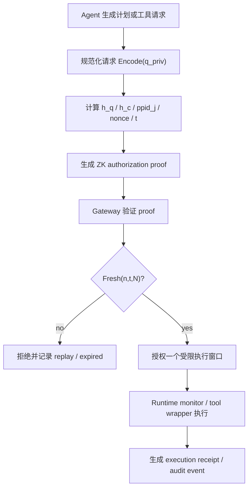

# Toward cryptographically verifiable authorization for autonomous AI agents：把 Agent 授权从“身份通过”推进到“请求可证明”

### 元信息

| 项目 | 内容 |
|---|---|
| 原文 | [Toward cryptographically verifiable authorization for autonomous AI agents](https://arxiv.org/abs/2607.21325) |
| 类型 | 论文预印本，arXiv:2607.21325v1 |
| 日期 | 2026-07-23 提交 |
| 作者 | M. Llambi-Morillas, D. Fernandez-Fernandez |
| 篇幅 | 11 页，1 张流程图，2 张表 |
| 主题 | AI Agent 安全、请求级授权、零知识证明、zk-SNARK、权限绑定 |
| 本地材料 | [PDF](/assets/2026/07/25/itm_aea929b123472949/2607.21325.pdf)，[Figure 1](/assets/2026/07/25/itm_aea929b123472949/cva-architecture.png) |

### TL;DR

1. 这篇论文讨论的不是“Agent 怎么登录”，而是“Agent 发出的某一个具体请求，能否被加密地证明为满足某个策略”。作者把问题命名为 Cryptographically Verifiable Agent Authorization，简称 CVA。

2. 论文的核心关系是 `R_CVA(x, w)`：公开语句 `x` 包含 agent 标识承诺、请求承诺、上下文承诺、策略版本、nonce 和时间；私有 witness `w` 包含 agent 秘密、私有属性、请求和上下文的原像。证明 `pi` 说明 `w` 满足 `R_CVA`，但不泄露这些私有属性。

3. 论文最有价值的判断是三层证据不可混同：身份绑定不等于请求授权绑定，请求授权绑定也不等于运行时执行绑定。换句话说，一个 Agent 通过认证、拿到委托或生成了有效 ZK 证明，都不能自动说明它之后执行的一定是同一个请求。

4. 方法上，作者把 CVA 拆成四个合取约束：`BindPrincipal`、`BindRequest`、`BindContext`、`SatisfyPolicy`。外部网关再用 nonce 集合和时间窗口实现 replay resistance，因此 replay 不是纯电路内性质，而是完整工作流性质。

5. PoC 使用 Groth16 zk-SNARK、bn128 曲线、Circom 2.x、snarkjs 和 FastAPI 网关。它实现了 Poseidon 派生的 principal binding、SHA-256 plan commitment、固定电路中的 policy satisfaction，以及网关侧 nonce freshness。

6. 证据强度需要保守看待：论文提供的是形式模型加可执行 PoC 的可行性证据，不是完整安全证明，也不是跨 proof system benchmark。Table 2 明确把 authorization soundness、request binding、policy binding 标为 partial，把 context binding 和 runtime execution binding 标为 open。

7. 论文列出 7 类验证用例：合法请求、错误 agent secret、替换 public identity commitment、修改 request hash、私有属性不满足策略、重复 nonce、篡改 public signal。这些用例覆盖 PoC 的已实现性质，但作者也承认它们不是任意 adversary 下的完整经验安全评估。

8. 局限很明确：形式安全归约未完成，电路未独立审计，Groth16 需要 trusted setup 且非后量子，策略语言受静态算术电路限制，context binding 没在 PoC 中实现，runtime execution binding 仍是开放问题，多 Agent 委托链也未评估。

### 研究问题：Agent 权限的缺口到底在哪里？

作者从一个很具体的断言出发：

```text
AuthN(A_i) 不推出 AuthZ(q_i)
Delegate(U, A_i, kappa) 不推出 AuthZ(q_i)
```

这里的关键不是符号本身，而是安全对象变了：

| 传统问题 | Agent 场景里的新问题 |
|---|---|
| 这个客户端是谁？ | 这个 autonomous agent 在当前上下文下要做哪一个动作？ |
| 用户是否委托了权限？ | 这次请求是否仍落在被允许的资源、参数、策略版本和时间窗口里？ |
| token 是否有效？ | token 或凭据能否证明“这个请求”满足策略，而不只是证明“某个主体”存在？ |
| 事后审计是否完整？ | 执行前是否已有可验证授权证据，执行后是否能证明执行与授权一致？ |

论文关心的缺口可以压缩成一句话：

- 现有 IAM、OAuth/OIDC/SAML、agent identity、delegation、audit、policy compliance 机制都能提供某种证据；
- 但它们通常没有把“某个 agent、某个请求、某个上下文、某个策略版本”绑定成一个可验证关系；
- 因而系统可能知道“谁在请求”，却不知道“这个具体请求为什么应该被允许”。

这也是这篇论文和一般“把 ZK 用到 Agent”文章的区别：

1. 它不是证明 agent 拥有某个 credential。
2. 它不是证明 agent code 来自某个 provenance。
3. 它不是证明事后日志可审计。
4. 它要证明的是：`q_i` 这个请求在 `c` 这个上下文里满足 `P_j` 这个策略。

### 论文主张与论证路线

| Claim | Mechanism | Evidence | Boundary |
|---|---|---|---|
| 身份认证和委托不足以推出请求授权 | 用 `AuthN(A_i) =>/ AuthZ(q_i)` 与 `Delegate(U,A_i,kappa) =>/ AuthZ(q_i)` 区分逻辑层 | Introduction 中定义 agent、请求、动作、资源、上下文、策略 | 这只是问题定义，不等于已经给出可部署协议 |
| 授权可以被建模为可验证关系 | 定义 `R_CVA(x,w)`，由公开 statement 与私有 witness 共同决定 | Section 3 给出 `x=(aid_i,h_q,h_c,ppid_j,n,t)` 与 `w=(msk_i,rho_i,attrs_i,q_priv,c_priv)` | 形式模型 preliminary，完整安全归约留作未来工作 |
| 请求级授权需要多个 binding | `BindPrincipal ∧ BindRequest ∧ BindContext ∧ SatisfyPolicy` | Section 4 定义 soundness、principal binding、request binding、policy binding、context binding、replay | PoC 只实现部分 binding，context 未落地 |
| ZK 授权不能替代运行时执行证据 | 形式化 `VerifyAuth(pp,x_q,pi)=1` 不推出 `q_exec=q_auth` | Section 4.5 和 Discussion 反复强调 TOCTOU 与 runtime binding | 需要 TEE、remote attestation 或 execution receipts 等额外机制 |
| PoC 说明构造有可行性 | Groth16、bn128、Circom 2.x、snarkjs、FastAPI gateway | Figure 1 和 Table 2 映射 formal property 到 prototype mechanism | 没有 benchmark、无独立 circuit audit、非完整 CVA |

### 形式模型：`R_CVA` 具体绑定什么？

论文先定义一个 agentic authorization environment：

```text
S = (A, G, T, R, P)
```

变量含义如下：

| 符号 | 含义 |
|---|---|
| `A` | autonomous agents 的集合 |
| `G` | authorization gateways 或 verifiers |
| `T` | 外部工具、API、可调用服务 |
| `R` | protected resources |
| `P` | authorization policies |
| `A_i` | 某个具体 Agent |
| `msk_i` | Agent 的私有密钥材料 |
| `aid_i` | 对 Agent 身份的公开承诺 |

Agent 身份不是直接公开 secret，而是通过 commitment 表示：

```text
aid_i = CommitID(msk_i, rho_i)
```

这个设计想表达两个目标：

1. **绑定主体**：证明者必须知道与 `aid_i` 对应的 secret。
2. **隐藏敏感材料**：验证者不需要看到 `msk_i` 或随机性 `rho_i`。

授权请求被定义为：

```text
q_i = (aid_i, alpha, res, c, ppid_j, n, t)
```

其中：

| 字段 | 作用 |
|---|---|
| `aid_i` | 绑定请求主体 |
| `alpha` | 请求动作，可拆成 tool、operation、args |
| `res` | 被访问资源 |
| `c` | 执行上下文，例如风险等级、环境分类、session state |
| `ppid_j` | 策略代码和版本的 hash 标识 |
| `n` | nonce，用于 replay control |
| `t` | 时间戳或 validity epoch |

如果请求内容敏感，公开语句不直接暴露请求明文，而是放请求承诺：

```text
h_q = H_q(Encode(domain, tool, operation, res, args))
```

这里 `Encode` 很重要：

- 它必须是 canonical serialization；
- 否则同一语义请求可能被编码成不同字节；
- 或不同序列化形式造成“到底授权了什么”的歧义。

公开 statement 与私有 witness 的分离如下：

```text
x = (aid_i, h_q, h_c, ppid_j, n, t)
w = (msk_i, rho_i, attrs_i, q_priv, c_priv)
```

可以把它理解成一条授权证明的接口边界：

| 验证者看到 | 证明者保留 |
|---|---|
| Agent 的身份承诺 | Agent secret |
| 请求 hash | 请求明文或计划明文 |
| 上下文 hash | 上下文私有属性 |
| 策略版本 ID | 满足策略所需的私有属性 |
| nonce 与时间 | 生成证明所需 witness |

### 核心关系：四个约束为什么缺一不可？

论文把 `R_CVA` 写成四个条件同时成立：

```text
R_CVA =
  BindPrincipal
  AND BindRequest
  AND BindContext
  AND SatisfyPolicy
```

对应的约束是：

```text
CommitID(msk_i, rho_i) = aid_i
H_q(Encode(q_priv)) = h_q
H_c(Encode(c_priv)) = h_c
P_j(attrs_i, q_priv, c_priv) = 1
```

每个合取项挡住一种 transfer attack：

| 合取项 | 如果缺失会怎样 |
|---|---|
| `BindPrincipal` | 一个主体生成的证明可能被另一个主体复用 |
| `BindRequest` | 对一个安全请求的证明可能被转移到另一个危险请求 |
| `BindContext` | 在低风险上下文生成的证明可能被拿到高风险上下文使用 |
| `SatisfyPolicy` | 证明只剩下形式正确，不再说明请求满足策略 |

这段模型的研究意义在于：

1. 它把“授权”从访问控制配置里抽象出来；
2. 它把请求、上下文、策略版本都纳入 proof statement；
3. 它允许 verifier 只看到必要 public input；
4. 它把敏感属性留在 witness 中，用 zero knowledge 隐藏。

但这个模型也马上暴露一个限制：

```text
Request Commitment != Internal Agent Intent
```

也就是说：

- 证明能绑定“被提交的请求表示”；
- 不能证明 agent 心里真正想做什么；
- 更不能证明 agent 后续执行没有偏离该请求。

### Replay resistance：为什么 nonce 不在纯 ZK 电路里解决？

论文把接受条件写成：

```text
Accept(x, pi) = VerifyAuth(pp, x, pi) AND Fresh(n, t, N)
```

其中 `N` 是网关维护的已消费 nonce 集合。

Freshness 的逻辑是：

```text
Fresh(n,t,N)=1  iff  n notin N AND t_min <= t <= t_max
Fresh(n,t,N)=0  iff  n in N OR t<t_min OR t>t_max
```

这个设计体现了一个常被忽略的边界：

1. ZK proof verification 本身是 stateless。
2. Replay resistance 需要 mutable gateway state。
3. 因此 replay 是“完整授权工作流”的性质，不是单个证明系统自动给出的性质。

这也解释了为什么 `n` 和 `t` 必须是 public statement 的一部分：

- 如果 proof 没绑定 nonce；
- 攻击者可能把同一个 proof 挂到新 nonce 上重放；
- 网关即使用 `N` 记录旧 nonce，也无法识别 proof 与旧 nonce 的绑定关系。

### Figure 1：PoC 工作流到底证明了什么？


Figure 1 的流程可以拆成 6 步：

1. Agent 先构造私有 witness：包括 agent secret、私有授权属性、请求计划。
2. Agent 计算公开承诺：例如身份承诺、plan hash、nonce、timestamp。
3. ZK circuit 检查私有 witness 与公开 statement 是否匹配。
4. Prover 生成 Groth16 proof。
5. FastAPI gateway 做 stateless proof verification。
6. Gateway 再做 stateful freshness control，然后给出 allow 或 reject。

这张图支撑的是“pre-authorization 可以形成可执行闭环”，而不是“执行结果也被证明”。

因此应把 Figure 1 看成一条边界清晰的证据链：

| 证明链条 | 已覆盖 | 未覆盖 |
|---|---|---|
| Agent 知道 secret | 是，Poseidon 绑定 `msk_i` 与 `aid_i` | 不提供随机 commitment hiding |
| Plan 与 proof 绑定 | 是，SHA-256 绑定 plan 与 `h_plan` | 只到 plan-level，不是完整请求结构 |
| 策略满足 | 是，固定电路编码 `P_PoC` | 动态策略和策略版本治理不足 |
| 重放控制 | 是，gateway 维护 nonce state | 依赖 gateway 不被攻破 |
| 上下文绑定 | 否 | formal model 有 `h_c`，PoC 没实现 |
| 执行绑定 | 否 | 需要运行时可信证据 |

### PoC：Groth16、Circom、FastAPI 的实现含义

PoC 的公开 statement 是：

```text
x_PoC = (aid_i, h_plan, n, t)
```

私有 witness 是：

```text
w_PoC = (msk_i, attrs_i, plan)
```

PoC 关系为：

```text
R_PoC =
  BindPrincipal_Poseidon
  AND BindPlan_SHA256
  AND SatisfyPolicy_Circuit
```

对应机制如下：

| 目标 | PoC 实现 |
|---|---|
| principal binding | `Poseidon(msk_i)=aid_i` |
| request/plan binding | `SHA256(plan)=h_plan` |
| policy satisfaction | `P_PoC(attrs_i, plan)=1` |
| proof system | Groth16 zk-SNARK |
| curve | bn128 |
| circuit | Circom 2.x |
| proving/verifying tooling | snarkjs |
| gateway | FastAPI，负责 verify 与 nonce state |

为什么作者选择 Groth16？

1. 证明短；
2. verifier 侧时间近似常数；
3. 适合 gateway 在请求路径上做快速校验。

但代价同样明显：

1. Groth16 需要 trusted setup；
2. 当前假设下不具备 post-quantum security；
3. 策略逻辑要转成算术电路；
4. policy 改动往往意味着 circuit 或 key material 治理问题。

### Table 1：相关工作位置不是“谁更强”，而是“证据对象不同”

论文的 Table 1 比较了 DIAP、ZeroTrust agent 架构、BAID、Aegis、zk-MCP、AIP 与 CVA。

这张表的要点不是给现有工作排序，而是说明它们关注的证据对象不同：

| 工作线 | 主要证据对象 | 与 CVA 的差别 |
|---|---|---|
| DIAP | 去中心化 agent identity / ownership | 更偏 identity，不直接建模请求级授权关系 |
| BAID | user-agent-code binding 与 execution provenance | 关注身份到代码和 provenance，不等同于 policy-satisfying request |
| Aegis | ZKP-based policy compliance 与 agent security architecture | 有 policy compliance，但不是本文定义的 request-bound relation |
| zk-MCP | rule-oriented audit / communication privacy | 更偏规则和审计，不解决 pre-execution request authorization |
| AIP / IBCT | MCP/A2A 委托、scope attenuation、provenance token chain | 强在 delegation chain，但不把 authorization 形式化为私有 witness 支持的 `R_CVA` |
| CVA | request-bound verifiable authorization | 强调 principal、request、context、policy 的合取绑定 |

我认为这里最值得注意的是 AIP：

- AIP 解决的是跨 MCP/A2A 的可验证委托链；
- CVA 解决的是单次请求是否满足策略的可证明关系；
- 两者不是替代关系，更像 agentic trust stack 的相邻层。

如果未来要处理多 Agent 委托链，CVA 不能只保留当前单跳模型。

论文自己也指出，需要类似：

```text
BindDelegationScope
```

以及：

1. recursive proof composition；
2. 或 delegation-aware witness structure；
3. 或把 upstream scope attenuation 编入每一跳的授权状态。

### Table 2：PoC 覆盖评估要保守读

Table 2 是本文最重要的“不要过度解读”证据。

| Property | Prototype mechanism | 状态 |
|---|---|---|
| Authorization soundness | circuit constraints + SNARK soundness assumptions | Partial |
| Principal binding | agent secret 到 deterministic Poseidon identifier | Implemented |
| Request binding | plan/action commitment via SHA-256 | Implemented for plan-level，relative to full CVA 为 partial |
| Policy binding | fixed circuit/policy relation，当前没有 explicit `ppid_j` public input | Partial / not fully implemented |
| Replay resistance | nonce + external gateway state | Implemented externally |
| Attribute privacy | Groth16 下的 ZK witness | Implemented under proof-system assumptions |
| Context binding | no explicit context commitment | Open |
| Runtime execution binding | no trusted execution evidence | Open |

这个表说明：

1. PoC 是 constructive feasibility evidence；
2. 它不是 complete formal validation；
3. 更不是 deployable end-to-end agent security framework。

尤其是两个 open 项很关键：

- **context binding open**：formal model 里有 `h_c`，但 PoC 没实现；
- **runtime execution binding open**：即使 proof 合法，也不能证明运行时实际执行同一个请求。

### 验证策略：7 类测试覆盖哪些攻击？

论文给出的 property-oriented validation 包括 7 类代表用例：

| 用例 | 对应性质 |
|---|---|
| 合法 principal 发起 policy-compliant request | happy path 与基本可用性 |
| invalid agent secret | principal binding |
| 替换 public identity commitment | cross-principal transfer 防护 |
| 修改 request hash | request binding |
| private attributes 不满足 encoded policy | policy satisfaction |
| 重用已消费 nonce | replay resistance |
| tampering with public signals | public statement binding |

这些测试有清晰价值：

1. 它们不是只测“proof 能生成”；
2. 它们按 security property 反推 negative cases；
3. 它们能暴露最直接的 proof transfer 和 replay 问题。

但边界也同样清楚：

1. 没有 arbitrary adversary 下的完整安全评估；
2. 没有 circuit audit；
3. 没有比较 Groth16、STARK、Bulletproofs 或其他 proof system；
4. 没有真实 agent workload 下的 latency / throughput / failure-mode benchmark。

因此不能把这篇论文解读成“ZK 已经解决 Agent 授权”。

更准确的读法是：

- 它给出一个可以被 falsify 的建模假设；
- 它用 PoC 说明部分 binding 可以工程化；
- 它把未解决的 context、execution、delegation chain、policy governance 问题摆到台面上。

### 运行时执行绑定：本文真正锋利的边界

论文反复强调：

```text
VerifyAuth(pp, x_q, pi)=1  不推出  q_exec = q_auth
```

这个边界在 Agent 系统里非常实际。

考虑一个 coding agent：

1. 它先提交一个 plan：只读取某个目录并生成报告。
2. Gateway 验证 plan hash 与 policy satisfaction。
3. Agent 拿到授权后，运行时因为工具调用、prompt injection、环境变化或内部规划偏移，执行了额外写文件动作。

在这种情况下：

- CVA proof 可以证明“原 plan 被授权”；
- 但不能证明“实际执行等于原 plan”；
- 因此执行绑定需要另一个证据层。

论文给出的可能方向包括：

| 方向 | 解决什么 | 新问题 |
|---|---|---|
| Remote attestation | 证明运行环境和代码状态 | 依赖硬件/平台信任根 |
| TEE | 把执行放进可信环境 | side-channel、部署复杂度、可观测性 |
| Verifiable execution receipts | 证明执行轨迹与授权一致 | receipt 格式、可组合性、隐私 |
| Runtime monitor | 在工具调用时重新检查 | latency、策略一致性、绕过风险 |

这也是本文对 AI 安全最有启发的地方：

- Agent 安全不是单个 proof primitive；
- 它至少需要 identity evidence、authorization evidence、execution evidence、audit evidence 的分层组合；
- 每一层证明不同命题，不能互相替代。

### 策略正确性：proof 正确不代表 policy 正确

论文还提出一个容易被工程系统忽视的问题：

```text
R_CVA(x,w)=1  不必然推出  P_intended(attrs_i,q_priv,c_priv)=1
```

原因是：

1. 电路实现的 policy 可能和组织意图不一致；
2. policy version `ppid_j` 的分发可能出错；
3. verification key 可能对应旧策略；
4. 组织策略可能是动态、程序化或上下文依赖的，而电路只编码了静态算术约束。

这意味着 CVA 系统需要治理面：

| 治理对象 | 为什么重要 |
|---|---|
| policy code | 决定什么请求被允许 |
| policy version | 决定 proof 绑定到哪版策略 |
| circuit build | 决定策略如何落到算术约束 |
| proving / verification key | 决定 verifier 实际验证哪条关系 |
| gateway state | 决定 nonce、时间窗口和 replay |
| audit trail | 决定事后能否追溯策略和执行 |

如果这些治理链条缺失，系统会出现一种危险错觉：

- proof 是真的；
- verification 也通过；
- 但被证明的 relation 本身不是组织真正想要的授权策略。

### 实验与结果：没有 benchmark，只有构造可行性

这篇论文没有给出常见机器学习论文式 benchmark。

更准确地说，它的“结果”由三部分构成：

| 结果类型 | 证据 |
|---|---|
| 形式结果 | `R_CVA`、binding properties、soundness game、freshness predicate、execution-binding non-implication |
| 工程结果 | Groth16/Circom/snarkjs/FastAPI PoC，把 principal、plan、policy、nonce 流程跑通 |
| 边界结果 | Table 2 明确标注 partial / implemented / open，并列出 9 条 limitation |

论文只给出一个性能层面的定性判断：

- Groth16 verification 对 circuit constraint count 近似常数；
- proof generation 会随算术约束数量增长；
- 因此高频 tool invocation 每次都生成 proof 的成本，和低频 task-plan 级授权完全不同。

这对 Agent 系统设计有直接含义：

| 授权粒度 | 优点 | 风险 |
|---|---|---|
| 每个 task plan 授权一次 | proof 频率低，latency 容易控制 | plan 到 runtime 的偏移更难约束 |
| 每个 tool invocation 授权一次 | request binding 更细 | proof generation 可能成为瓶颈 |
| 混合策略 | 高风险动作细粒度，低风险动作批量 | 策略复杂度和审计复杂度上升 |

### 局限：作者承认的问题比 PoC 本身更有价值

论文列出的 9 条局限可以归为 5 类：

| 类别 | 具体局限 |
|---|---|
| 形式安全 | formal model preliminary，完整 security reductions 未完成 |
| 工程可信 | prototype 未做独立 cryptographic circuit audit，gateway 被部分信任 |
| proof system | Groth16 trusted setup，非 post-quantum |
| 策略表达 | 静态算术电路难表达动态或程序化策略，policy 变化可能要重编译 |
| Agent 场景 | context binding 未实现，runtime execution binding 未解决，多 agent / multi-principal delegation chain 未评估 |

这些局限使本文的贡献更清晰：

1. 它不是一个已经完成的 agent authorization standard。
2. 它不是替代 OAuth、OIDC、AIP、MCP auth 的协议草案。
3. 它更像一篇把“请求级授权证据”正式提出并拆解的研究议程。

### 领域延伸：这对 Agent 安全系统意味着什么？

如果把本文放回 AI Agent 安全系统，最重要的启发是分层建模。

一个高可信 Agent 工具调用栈至少需要回答 5 个问题：

| 问题 | 对应证据 |
|---|---|
| 谁在请求？ | identity evidence |
| 谁委托它请求？ | delegation evidence |
| 这个请求是否满足策略？ | authorization evidence |
| 实际执行是否等于被授权请求？ | execution evidence |
| 事后能否追溯？ | audit evidence |

CVA 只专注第三层。

这不是缺点，而是它的贡献边界：

- 它把 authorization evidence 从 identity / delegation / audit 里独立出来；
- 它说明这个证据可以是 request-bound、policy-bound、context-bound；
- 它也承认 execution evidence 必须另起一层。

对于未来研究，我认为有 4 个值得继续追问的问题：

1. **可表达策略**：哪些 agent 权限策略能自然转成 ZK-friendly arithmetic circuits？哪些策略应该留给非 ZK policy engine？
2. **授权粒度**：task-plan 级、tool-call 级、resource-operation 级授权如何组合，才能在成本与安全之间取得合理平衡？
3. **执行一致性**：如何把 CVA proof 与 TEE、remote attestation、tool receipt、event log 连接起来，证明 `q_exec=q_auth`？
4. **委托链组合**：多 agent 场景下，如何证明下游 agent 的请求没有扩大上游 scope，并且每一跳都保留策略约束？

### 进一步细读：把 CVA 放进真实 Agent 控制回路

如果把 CVA 放到一个真实 Agent 平台，最自然的位置不是登录入口，而是工具调用前的授权闸门。

一个可能的控制回路如下：



这条回路说明，CVA 只覆盖 `D -> E -> F` 的一段。

在工程上还必须补齐三类组件：

| 组件 | 需要保存的状态 | 如果缺失会怎样 |
|---|---|---|
| Canonical request builder | 请求字段、参数、资源 ID、策略版本 | proof 绑定的是不稳定表示，审计时无法还原授权对象 |
| Gateway freshness state | nonce 集合、时间窗口、proof 接收记录 | 有效 proof 可能被重复提交或延迟提交 |
| Runtime execution monitor | 实际 tool call、参数、返回、失败、取消 | 授权计划与真实执行之间出现不可见偏移 |

这也给出了一个更细的研究判断：

- CVA 的强点是“pre-execution evidence”；
- 它的弱点是“post-authorization behavior”；
- 因而它适合和 tool wrapper、capability sandbox、event-sourced audit log 组合，而不是单独承担全部 Agent 安全。

### 授权粒度：为什么每次工具调用都证明未必最好？

论文讨论 operational viability 时，特别区分了低频 plan-level 授权和高频 invocation-level 授权。

这个区分对 Agent 系统很关键：

| 粒度 | 示例 | 安全收益 | 成本和边界 |
|---|---|---|---|
| Session 级 | Agent 在一个工作区内获得 30 分钟只读权限 | proof 次数少，用户体验好 | 绑定太粗，难解释每个动作为什么被允许 |
| Plan 级 | Agent 提交“读取 A、检索 B、写报告 C”的计划 | 比 session 级更可审计 | 执行阶段可能偏离计划 |
| Tool-call 级 | 每次 `read_file`、`web_fetch`、`send_email` 都证明 | 最接近请求级授权 | proof generation 可能成为延迟瓶颈 |
| Resource-operation 级 | 对某资源的某参数范围授权 | 风险控制最细 | 策略、电路和审计复杂度最高 |

这说明本文的 `q_i` 定义虽然简洁，但真实系统要先回答一个建模问题：

```text
q_i 到底代表一个计划、一组工具调用，还是一个单独资源操作？
```

不同答案会改变安全性质：

1. 如果 `q_i` 是计划，`BindRequest` 主要约束计划文本或 action sequence。
2. 如果 `q_i` 是工具调用，`BindRequest` 约束工具名、操作名、资源和参数。
3. 如果 `q_i` 是资源操作，`BindRequest` 还要约束参数域、数据分类和输出通道。

论文没有替读者做这个选择。

这正是它把 RQ3 写成研究议程的原因：

- 证明系统选择影响 verifier latency；
- 电路复杂度影响 prover latency；
- 授权频率影响整体吞吐；
- Agent workload 决定哪些请求值得单独证明。

### 策略表达：`P_j` 不是普通 if-else 的平移

形式模型里 `P_j(attrs_i,q_priv,c_priv)=1` 看起来很干净，但工程实现并不轻松。

原因是 ZK 电路偏好静态、有限、算术化的关系，而真实授权策略往往包含：

1. 外部数据库查询；
2. 动态风险评分；
3. 用户实时确认；
4. 组织层级和例外规则；
5. 模型输出内容分类；
6. 时间、地点、设备和会话状态；
7. 多策略冲突解决。

这些策略不一定适合全部塞进电路。

更可行的方向可能是混合式：

| 策略层 | 适合放在哪里 |
|---|---|
| 稳定的结构性约束 | ZK circuit，例如角色等级、资源标签、预算上限 |
| 高频变化的上下文 | Gateway policy engine，例如 session risk、临时封禁 |
| 需要人工判断的动作 | Human approval 或 out-of-band confirmation |
| 执行后才能确认的性质 | Runtime monitor 与 audit receipt |

这样看，CVA 不一定要证明所有策略。

它更适合证明一组关键不变量：

- 请求属于某个被允许资源集合；
- 参数没有越界；
- Agent 私有属性满足最低权限条件；
- 证明绑定到具体 policy version；
- nonce 和时间窗口防止重放。

其余动态判断则由 gateway 和 runtime 共同完成。

### 对 AI 安全的含义：授权证明不是“安全意图证明”

本文另一个重要提醒是：

```text
Request Commitment != Internal Agent Intent
```

这对 AI 安全尤其重要。

当前很多 Agent 风险来自意图和行为之间的不稳定关系：

1. Agent 可能被 prompt injection 改写目标；
2. Tool result 可能污染后续计划；
3. Long-horizon task 可能出现目标漂移；
4. 多 Agent 协作可能把约束逐步稀释；
5. 模型可能在自然语言 plan 和实际 tool call 之间产生不一致。

CVA 不能直接解决这些问题。

它能做的是把某个“已经被规范化的请求对象”绑定到 proof 上。

因此，一个成熟系统需要在 CVA 前后都加约束：

| 阶段 | 需要的安全机制 |
|---|---|
| proof 前 | plan extraction、request normalization、policy selection、risk classification |
| proof 中 | principal/request/context/policy binding、witness privacy、freshness |
| proof 后 | tool sandbox、runtime monitor、execution receipt、audit reconciliation |

如果 proof 前的 request normalization 不可信，CVA 可能证明了错误对象。

如果 proof 后的 execution monitor 不可信，CVA 可能证明了正确对象，但系统执行了另一件事。

这就是本文最值得保留的研究结论：

- 授权证明是必要层；
- 但它不是 Agent 安全的全部；
- 它必须被放进一个包含状态、执行、审计和委托链的控制系统里。

### 结论

这篇论文的价值不在于“做了一个 ZK Agent 网关”，而在于给 Agent 授权提出了更精确的安全命题：

```text
一个 autonomous agent 的某个具体请求，
在某个上下文与策略版本下，
应当能够形成可验证授权证据；
但这个证据不能替代身份、委托、执行和审计证据。
```

它把当前 Agent 安全讨论里经常混在一起的概念拆开：

1. identity binding 说明主体是谁；
2. authorization request binding 说明请求为什么被允许；
3. runtime execution binding 说明实际执行是否一致；
4. replay control 说明 proof 不能被重复使用；
5. policy governance 说明被证明的 relation 是否等于组织意图。

从研究者视角看，这篇 11 页论文更像一个清晰的 agenda：

- 先把请求级授权形式化；
- 再用 PoC 证明局部可行；
- 最后明确指出 context、execution、delegation chain、benchmark、circuit audit 都还没有解决。

这使它适合作为后续 Agent 权限系统研究的起点，而不是作为一个可以直接部署的终点。
