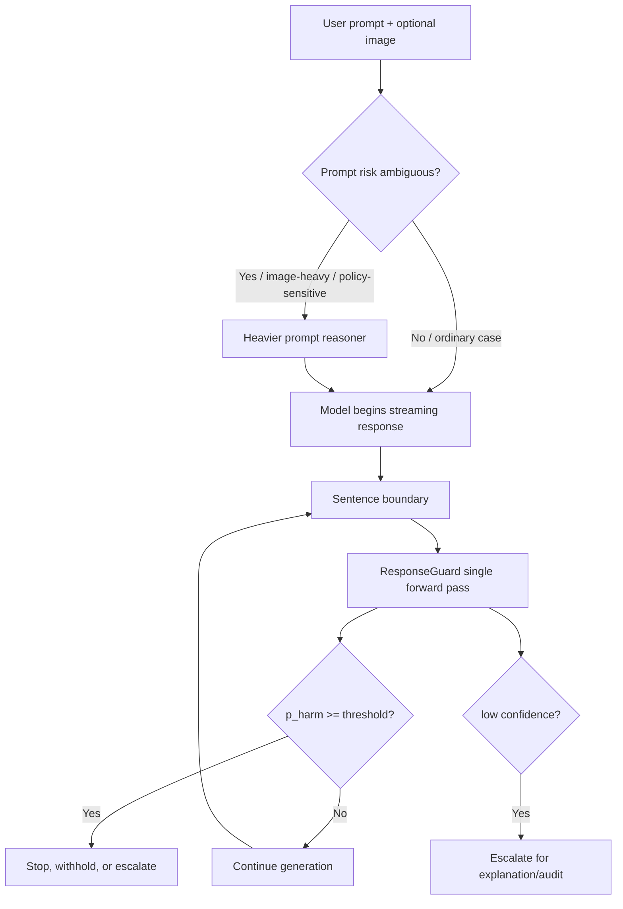

# ResponseGuard：多模态响应守卫未必需要先写推理链

### 元信息

| 项目 | 内容 |
| --- | --- |
| 论文 | When Are Reasoning-Based Guardrails Not Efficient? ResponseGuard: A Fast Vision-Language Guard for Real-Time Moderation |
| 版本 | arXiv:2607.21401v1，2026-07-23 15:02:24 UTC 提交 |
| 作者 | Dongbin Na |
| 原文 | https://arxiv.org/abs/2607.21401 |
| HTML | https://arxiv.org/html/2607.21401 |
| 代码/项目页 | https://github.com/ndb796/ResponseGuard；https://ndb796.github.io/ResponseGuard/ |
| 类型 | AI 安全 / 多模态 guardrail / 实时响应审核 |

### TL;DR

- **问题**：多模态助手按 token 流式输出时，响应侧 guardrail 必须在用户读到有害内容前拦截；如果守卫每次都先生成 chain-of-thought，再给安全判定，延迟会直接进入用户体验和安全窗口。
- **方法**：ResponseGuard 把请求、已生成响应和可选图像拼成一个输入，用视觉语言 backbone 的 pooled representation 接一个小分类头，一次前向给出 harmful probability，不解码推理链。
- **关键机制**：作者把响应审核和提示审核分开看；响应路径追求“可重复、低延迟、可阈值调节”的判定，提示路径仍允许在歧义意图上花更重的 reasoning 成本。
- **实验设置**：训练使用 GuardReasoner-VL 公开语料，覆盖文本、图像、图文输入共 123,093 个样本；评测按公开多模态 guardrail suite，报告 harmful-class F1 和按 cell 大小加权的 track average。
- **结果**：ResponseGuard-2B 在 response harmfulness 全量平均 F1 达到 77.31，高于 GuardReasoner-VL-3B 的 76.56 和 Eco 版本的 77.14；文本响应平均 F1 为 79.71，也是最高。
- **成本**：在单张 RTX A6000、bfloat16、warm-cache median 设置下，reasoning guard 每次判定约 10.12 秒、输出约 238 tokens；ResponseGuard 不输出 token，约 67.6 ms，约 150 倍更快。
- **流式拦截**：以句子为单位重跑单次前向，阈值 0.50 时能在完成前拦截 95.0% 有害回答，遮住 87.7% 有害文本，中位停止点在答案 7% 处；代价是 28.5% benign answer 被中断。
- **局限**：提示侧总体仍由 reasoning guard 领先；图像-only cell 的差距没有被 ResponseGuard 解决；模型本身不提供解释；项目页和 GitHub 标出若干 checkpoints、notebooks、streaming harness 仍是 coming soon。

### 研究问题：为什么响应侧守卫不能照搬“先推理再裁决”？

- 论文的核心问题不是“CoT 是否永远无用”，而是更窄的一句：
  - **当守卫位于模型响应的实时输出路径上时，推理链的收益是否足以覆盖它的延迟成本？**
- 这个问题成立，来自响应审核和提示审核的时间结构差异：
  - **提示审核**：用户发来 prompt，系统可在模型回答前做一次较重判断。
  - **响应审核**：模型已经开始输出，守卫要不断看“到目前为止模型说了什么”。
  - **完成后审核**：如果等完整回答出来再判定，有害内容可能已经显示给用户。

| 审核位置 | 输入 | 判定次数 | 主要风险 | 适合的守卫形态 |
| --- | --- | --- | --- | --- |
| Prompt path | prompt + image | 通常一次 | 误拒绝正常请求；误放行恶意意图 | 可用更重的 reasoning 或二阶段判断 |
| Response path | prompt + image + partial response | 多次，随输出流重复 | 有害内容先被用户读到；延迟放大 | 低延迟、可校准、可重复运行的分类器 |
| After-the-fact scoring | 完整 response | 一次 | 安全动作太晚 | 更适合离线审计，不适合实时拦截 |

- 作者质疑 reasoning guard 的两个常见理由：
  - **理由 1：链条可解释**。但实时拦截时，系统首先需要及时阻止输出；解释可作为事后审计步骤，而不必每个 token 路径都支付。
  - **理由 2：链条更准确**。论文用 benchmark、链重采样、链长相关性和注意力分析拆开看，发现响应侧收益没有稳定覆盖成本。

### 论文主张：ResponseGuard 不是“更小的 GuardReasoner”，而是改写安全路径的预算分配

| Claim | Mechanism | Evidence | Boundary |
| --- | --- | --- | --- |
| 响应审核未必需要生成推理链 | pooled representation + binary head，一次前向输出有害概率 | response track 平均 F1 77.31，高于两个 reasoning baseline | 只证明标准多模态 guardrail suite 上的响应路径，不代表所有安全判定 |
| 延迟差距足以改变部署形态 | 不解码 tokens；每句重跑分类器 | 67.6 ms vs 10.12 s，约 150x | 计时在单 RTX A6000、bfloat16、warm cache 上 |
| 图像差距更像 perception 问题 | 图像-only cell 差距集中；reasoning guard 判定位置几乎不看图像 token | reasoning guard 对 image tokens 的 verdict attention 约 6%，而 uniform share 约 47% | 不是受控同 backbone 消融，仍需更多模型和 benchmark 复核 |
| 可校准概率比极化 verdict 更适合生产阈值 | 输出连续 harmful probability，支持 threshold / defer | ECE 4.3%，temperature 后 1.5%；reasoning guard 99.8% 分数贴近 0 或 1 | 校准不等于绝对安全率，benchmark labels 只是固定协议下的相对比较 |

### 方法机制：ResponseGuard 如何把“写一段理由”压缩成“一次判定”？

- 输入由三部分组成：
  - `x`：用户请求，可包含文本 prompt。
  - `r_t`：截至当前时间或当前句子的模型响应前缀。
  - `v`：可选图像输入。
- 输出是一个标量：
  - `p_harm = P(y = harmful | x, r_t, v)`。
  - 生产系统可以把它和阈值 `tau` 比较，决定继续、拦截或升级。

公式化地看，reasoning guard 和 ResponseGuard 的成本差别在这里：

```text
Reasoning guard:
  z_1, z_2, ..., z_L, verdict ~ G_theta(x, r_t, v)
  cost ≈ L 次顺序解码 + verdict 解码

ResponseGuard:
  h = Pool(F_theta(x, r_t, v))
  p_harm = Head_phi(h)
  cost ≈ 1 次前向，无输出 token
```

- 作者在文中给出的关键抽象是：
  - reasoning guard 把判定建模为 generation。
  - ResponseGuard 把判定建模为 classification。
- 这不是单纯“少输出文字”：
  - generation 的每个 token 都依赖前一个 token，延迟顺序累积。
  - classification 只需一次 encoder/backbone 前向和一个小 head。
  - 在响应路径上，这个差别会被“每个句子都要重跑”进一步放大。

### Backbone 与 head：小参数更新承担什么？

- 论文和项目页给出的模型族包括：
  - `ResponseGuard-2B`：backbone 为 Qwen3-VL-Embedding-2B。
  - `SmolGuard-2B`：backbone 为 SmolVLM-2B。
  - `SmolGuard-500M`：backbone 为 SmolVLM-500M。
- 训练部分不是全量重训整个 VLM：
  - 使用 low-rank adapter。
  - 使用 prototype head。
  - 视觉 encoder 保持 frozen。
- prototype head 可理解为：
  - 学一组“safe reference vectors”。
  - 学一组“harmful reference vectors”。
  - 把 pooled representation 与两组 reference 的 softened similarity 变成 harmful probability。

```text
Input:
  prompt x, partial response r_t, optional image v

State:
  frozen/backbone representation F_theta
  low-rank adapter A_phi
  safe prototypes C_safe
  harmful prototypes C_harm

Forward:
  h = Pool(F_theta(A_phi, x, r_t, v))
  s_safe = SoftSimilarity(h, C_safe)
  s_harm = SoftSimilarity(h, C_harm)
  p_harm = softmax([s_safe, s_harm])_harm

Decision:
  if p_harm >= tau:
    stop or escalate
  else:
    continue streaming

Failure boundary:
  if image evidence is decisive and frozen encoder misses it,
  the head may be calibrated yet still wrong.
```

### 训练与评测：作者如何避免把 prompt path 和 response path 混成一个分数？

- 训练数据：
  - 来自 GuardReasoner-VL 公开语料。
  - 共有 123,093 个样本。
  - 覆盖 text、image、text-image 输入。
  - ResponseGuard 保留输入和 gold labels，丢弃 reasoning chains，因为模型不生成链。
- 评测协议：
  - 沿用 Liu et al. 的多模态 guardrail suite。
  - 每个 cell 报 harmful-class F1。
  - track average 按 dataset-size 加权，而不是每个 cell 等权。
  - prompt track 与 response track 分开报告。
- 这点很重要：
  - 响应守卫真正部署时，response track 是核心。
  - prompt track 仍然重要，但它代表另一条安全路径。
  - 把两条路径混成一个总分，容易掩盖“响应侧单次前向足够强、提示侧歧义仍需重模型”的结论。

### 主结果一：响应有害检测里，链条没有赢下部署关键路径

| Model | Avg Text F1 | SPA-VL image F1 | Avg All F1 | Relative speed |
| --- | ---: | ---: | ---: | ---: |
| GuardReasoner-VL-3B (CoT) | 78.83 | 71.19 | 76.56 | 1x |
| GuardReasoner-VL-3B-Eco (CoT) | 79.31 | 72.01 | 77.14 | ~1.1x |
| SmolGuard-2B label-only | 78.59 | 72.16 | 76.69 | - |
| ResponseGuard-2B label-only | 79.71 | 71.60 | 77.31 | 150x |

- 读这张表时要注意三件事：
  - **不是所有 cell 都赢**：HarmBench-Response、XSTest-Response、WildGuard-Response 上 reasoning guard 仍有窄优势。
  - **加权平均赢**：ResponseGuard 在 Safe RLHF 和 BeaverTails 两个大文本响应 cell 上更强，因此 weighted average 领先。
  - **速度不是微小优化**：从 10 秒级到 70 毫秒级，改变的是“能否每句重跑”，不是只省一点服务成本。
- 对安全系统来说，这个结果的含义是：
  - 如果目标是响应流中的早停，分类器不是弱化版本。
  - 它在作者测试的 response track 上既更快，也没有牺牲总体 F1。
  - reasoning guard 更像保留给复杂、低频、需要解释或二次审计的路径。

### 主结果二：提示有害检测里，reasoning guard 仍保留优势

| Model | Avg Text F1 | HarmImg F1 | SPA-VL prompt F1 | Avg All F1 |
| --- | ---: | ---: | ---: | ---: |
| GuardReasoner-VL-3B (CoT) | 78.74 | 70.93 | 86.47 | 78.71 |
| GuardReasoner-VL-3B-Eco (CoT) | 78.43 | 66.79 | 85.82 | 77.39 |
| ResponseGuard-2B label-only | 77.76 | 65.52 | 82.41 | 75.91 |

- 作者没有把这个结果藏起来：
  - prompt track 的 all average 是 reasoning guard 领先。
  - text average 上，ResponseGuard 和 reasoning guard 只差约 1 点。
  - 主要差距集中在两个 image-only cells。
- 这支持一个更实际的系统设计：
  - prompt 进来时，对歧义意图或图像主导判断使用更重模型。
  - response 输出时，用 label-only guard 做持续拦截。
  - 低置信或高风险样本再升级给 reasoning guard 或人工审计。



### 成本证据：150x 的关键不是省钱，而是把守卫从“离线裁判”变成“在线刹车”

| Guard | Output tokens | Median latency | Speedup |
| --- | ---: | ---: | ---: |
| GuardReasoner-VL-3B (CoT) | ~238 | 10.12 s | 1x |
| ResponseGuard-2B | 0 | 67.6 ms | 150x |

- 计时设置：
  - 单张 RTX A6000。
  - bfloat16。
  - warm-cache median。
  - 图像带来固定额外开销，项目页记录为 88 ms。
- 这个结果影响 deployment envelope：
  - 10 秒级守卫不能在每个句子后同步运行。
  - 67.6 ms 级守卫可以在句子边界反复检查。
  - 如果模型输出第 1-2 句就进入有害内容，快速守卫才能在内容完成前介入。
- 公式上可以把响应审核总延迟写成：

```text
T_guard_total = sum_{t in checkpoints} T_guard(x, r_t, v)

Reasoning:
  T_guard ≈ T_forward + L_chain * T_decode
  checkpoints 多时，L_chain 成为重复支付的主成本。

Label-only:
  T_guard ≈ T_forward + T_head
  checkpoints 多时，仍接近线性可控。
```

### 校准与阈值：为什么“连续概率”比“极化 verdict”更像生产接口？

- 论文把 calibration 作为单独证据，而不是只报告 F1。
- Expected Calibration Error 的定义可以写成：

```text
ECE = sum_b (n_b / N) * |acc(b) - conf(b)|

变量：
  b: confidence bin
  n_b: 第 b 个 bin 中样本数
  N: 总样本数
  acc(b): bin 内准确率
  conf(b): bin 内平均置信度
```

- ResponseGuard 的结果：
  - ECE 为 4.3%。
  - 单个 temperature calibration 后降到 1.5%。
  - 分数保留连续区间，便于部署方调阈值。
- reasoning guard 的问题：
  - verdict-token probabilities 几乎极化。
  - 99.8% scores 贴在 0 或 1。
  - 在 1% false-positive budget 下，recall 只剩约 10%。
- 这说明：
  - 高平均 F1 不够。
  - 生产守卫要能按场景选择阈值。
  - 如果分数完全饱和，系统很难在“少误拦”和“高召回”之间做可控折中。

### 流式拦截：ResponseGuard 的最强证据不是静态分数，而是“提前停住”

| Threshold | 完成前拦截有害回答 | 遮住有害文本 | 中断 benign answer |
| --- | ---: | ---: | ---: |
| 0.50 | 95.0% | 87.7% | 28.5% |
| 0.56 | 94.3% | 87.5% | 未报告 |

- 作者的模拟方式：
  - 把 harmful answer 按句子逐步喂给 guard。
  - 每到一个句子边界，重新计算 harmful probability。
  - 首次超过 threshold 时停止输出。
- 关键现象：
  - 中位停止点在答案 7% 处。
  - 许多有害回答在第一句或前两句就暴露意图。
  - 因为单次判定比一个句子的生成时间短，系统有余量每句检查。
- 但这里也有硬边界：
  - 阈值 0.50 的 benign interruption 是 28.5%，不适合所有产品。
  - 论文也说明这个阈值服务于 early interception，不是严格低误报部署点。
  - 真实系统应把 `tau_stop`、`tau_defer`、`tau_allow` 分开，而不是只设一个阈值。

```text
Recommended production-style policy:

if p_harm >= tau_stop:
  stop generation and withhold current sentence
elif p_harm >= tau_defer:
  pause or route to heavier reviewer
else:
  continue streaming

where:
  tau_stop > tau_defer
  tau_defer is tuned for sensitivity
  tau_stop is tuned for low false-positive cost
```

### 图像差距：论文真正反驳的是“链条本身带来视觉理解”

- ResponseGuard 在图像相关 cell 上仍有差距。
- 作者没有把这个归因于“模型太小”或“链条缺失”，而是提出 perception ceiling：
  - label-only guard 在 image cells 上 precision 从文本的 81.7% 降到 67.7%。
  - recall 基本保持，说明问题更像误把图像样本判为有害。
  - reasoning guard 在 verdict 位置对 image tokens 的 attention 约 6%，而 uniform allocation 约 47%。
- 这个证据的解释是：
  - reasoning guard 写了链，不代表它真的利用了图像。
  - 如果视觉 encoder 已经把关键信号编码得不好，后面的文字推理很难凭空恢复。
  - 更强或可适配的视觉 encoder 可能比更长 chain 更值得投入。

| 观察 | 支持的判断 | 不能证明的事 |
| --- | --- | --- |
| 图像-only 差距集中 | 剩余问题可能在视觉感知 | ResponseGuard 已解决多模态安全 |
| CoT verdict attention 对图像 token 约 6% | reasoning guard 的链未充分用图像 | 注意力可完全解释模型决策 |
| 训练视觉路径未改善 aggregate | 加 head 不一定突破视觉瓶颈 | 所有可训练视觉模块都无效 |

### “链条可能是 post-hoc”：这部分证据要谨慎读

- 论文报告：
  - 重采样 reasoning guard 的 chain，只有 2.5% 文本 verdict 改变。
  - 图像 verdict 改变比例为 7.8%。
  - chain length 与 correctness 基本无相关。
- 这个结果说明：
  - 对这些 moderation cases，链条很可能不是主要因果计算路径。
  - 模型可能在写 chain 前已经形成 verdict，链条只是把判定包装出来。
- 但作者也给出边界：
  - ResponseGuard 和 reasoning guard 不同 backbone、不同 objective。
  - 这不是“只移除 chain，其余完全相同”的受控消融。
  - 因此更准确的说法是：这组证据削弱了“响应审核必须显式 reasoning”的默认假设，而不是证明 CoT 在所有 guardrail 中无用。

### 相关工作位置：它接在 Llama Guard、WildGuard、GuardReasoner-VL 之后，但问题换了

| 方向 | 典型目标 | ResponseGuard 的位置 |
| --- | --- | --- |
| Llama Guard / WildGuard / AEGIS | 开放文本或对话审核器 | 延续“直接分类”的可部署接口，并扩展到多模态响应路径 |
| GuardReasoner / GuardReasoner-VL | 用 reasoning chain 增强安全判定 | 质疑响应侧是否值得每次支付 chain 成本 |
| Llama Guard 3 Vision / LlavaGuard | 图像理解场景中的安全审核 | 指出图像瓶颈可能来自 perception，而非缺少文字推理 |
| Streaming moderation | token 或 sentence-level 早停 | 给多模态响应审核一个可运行的低延迟 guard 形态 |
| Safety control for agents | 在机器人、浏览器、工具调用中做快速判定 | 强调 guard 要进入实时控制 loop，而非只做事后报告 |

- 论文的贡献不是“发现一个更高榜单分数”。
- 更重要的是提出一条 evaluation discipline：
  - 分开 prompt path 和 response path。
  - 把 accuracy、latency、calibration、selective prediction 同时报告。
  - 要求 reasoning guard 证明收益不是 backbone、数据或目标函数带来的。

### 可复现性与发布状态：论文说 fully release，但项目页仍显示部分资源待补齐

- 已可访问证据：
  - arXiv 摘要页和 HTML 全文可读。
  - PDF 可下载。
  - GitHub 仓库公开。
  - 项目页公开主要表格、模型说明、伪代码预览和限制说明。
- 需要保守标注的边界：
  - 项目页按钮写着 Models coming soon、Colab demo coming soon。
  - GitHub README 的 source codes、notebooks、streaming harness、preprocessed splits 多处仍标为 coming soon 或 release checklist 未完成。
  - 因此当前最可靠的是论文与项目页公开结果；完整复现实验仍要等 checkpoints、脚本和 splits 真正落地。

| 复现要素 | 当前状态 | 对结论的影响 |
| --- | --- | --- |
| 论文 / HTML / PDF | 可访问 | 足以深读方法和结果 |
| 代码仓库 | 可访问 | 可确认官方仓库存在 |
| checkpoints | 项目页/README 标为 coming soon | 不能独立复跑主结果 |
| training/eval notebooks | coming soon | 训练细节仍依赖论文描述 |
| streaming harness | coming soon | 早停实验暂不能本地复核 |
| dataset splits/preprocessing | 部分标为 coming soon | 公开语料来源明确，但 exact split 仍需等待 |

### 失败案例与安全边界：ResponseGuard 适合做哪一层，不适合做哪一层？

- 适合做：
  - **always-on response layer**：每个句子或小段输出后快速判定。
  - **thresholded risk scorer**：给策略层提供连续概率。
  - **defer trigger**：把低置信或图像主导样本交给更重系统。
  - **latency budget baseline**：要求 reasoning guard 证明它的额外成本确实买到收益。
- 不适合单独做：
  - **完整合规解释**：模型不输出理由。
  - **图像主导高风险判定的最终裁决**：图像 cell 仍是弱点。
  - **低误报场景的单阈值早停**：0.50 阈值下 benign interruption 28.5%。
  - **真实部署安全率证明**：benchmark labels 是固定协议，不等于生产分布。

### Figure/Table 逐项证据解读：哪些证据支撑主张，哪些只是边界提示？

| 证据项 | 论文中承担的功能 | 支撑的结论 | 不能推出的结论 |
| --- | --- | --- | --- |
| Figure 1 | 展示按句子流式检查并在首个有害句处停止 | ResponseGuard 的低延迟使在线拦截成为可想象的部署形态 | 不能证明任意产品都应逐句检查，也不能证明误报成本可接受 |
| Figure 2 | 展示链重采样和链长相关性 | reasoning chain 在这些样本上可能主要是 post-hoc | 不能证明所有 CoT 都是事后解释 |
| Table 1 | response harmfulness 主结果 | response track 上 label-only 2B guard 的加权 F1 和速度共同领先 | 不能说明每个细分 cell 都领先 |
| Table 2 | prompt harmfulness 主结果 | prompt track 上 reasoning guard 仍更强，尤其图像-only cell | 不能否定 response path 的 label-only 结论 |
| Table 3 | verdict latency 与输出 token | 150x 延迟差距足以影响是否能每句运行 | 不能直接等价为生产吞吐，真实系统还有排队和网络延迟 |
| Figure 4 | 图像 precision/recall 与可分性分析 | 剩余差距更像视觉感知问题 | 不能完全排除更好推理策略的收益 |
| Figure 5 | calibration 可靠性图 | ResponseGuard 的概率可用于阈值调节 | 不能证明校准在新分布上保持 |
| Figure 6 | reasoning guard 的图像 attention 与分数饱和 | reasoning guard 不一定真实利用图像，且阈值空间很窄 | 注意力不是完整因果解释 |

- 我认为最关键的证据组合不是单张 Table 1。
- 更强的论证链是：
  - **Table 1** 说明 response path 的 F1 没有因为取消 chain 而下降。
  - **Table 3** 说明取消 chain 带来两个数量级延迟优势。
  - **Figure 5** 说明分数不是只有 0/1 verdict，而是可校准、可阈值化。
  - **Section 5.8** 说明这种低延迟和可阈值化可以转成 early interception。
- 这四个证据合起来，才构成“部署默认层应是 label-only guard”的主张。
- 如果只有 Table 1：
  - 读者只能说 ResponseGuard 在一个 benchmark 上分数高一点。
  - 这不足以改变安全架构。
- 如果只有 Table 3：
  - 读者只能说它更快。
  - 这也不足以说明更快没有牺牲检测质量。
- 如果只有 streaming 实验：
  - 读者会担心阈值随意、误报太高。
  - calibration 和 selective prediction 才解释了为什么阈值策略可被系统化。

### 一个更稳的部署读法：三层守卫，而不是“快模型取代慢模型”

- 论文最容易被误读成：
  - “CoT guardrail 没用。”
  - “ResponseGuard 可以直接替代所有多模态安全审核。”
- 更稳的读法是：
  - **第一层**：ResponseGuard 负责高频、低延迟、可校准的响应流检查。
  - **第二层**：reasoning guard 负责低频、歧义、需要解释的 prompt 或拦截样本。
  - **第三层**：离线审计和安全评估负责复盘阈值、误报、漏报和分布漂移。

| 层级 | 触发时机 | 输入 | 输出 | 主要指标 |
| --- | --- | --- | --- | --- |
| L1 fast response guard | 每个句子或动作边界 | prompt、图像、partial response | harmful probability | latency、ECE、early-stop recall、benign interruption |
| L2 heavy reasoner | prompt 高风险、L1 低置信、用户申诉 | 完整上下文、策略文本、候选解释 | verdict + explanation | false-positive budget、解释质量、人工一致性 |
| L3 audit/eval | 日志回放、版本升级、事故复盘 | trajectory、blocked cases、deferred cases | policy report | 漏报类型、阈值漂移、数据漂移、复现率 |

- 这个三层设计和论文结果是对齐的：
  - L1 选择 ResponseGuard，是因为 response path 的主要约束是重复运行和低延迟。
  - L2 保留 reasoning，是因为 prompt path 上仍有歧义意图和解释需求。
  - L3 不能省略，是因为 benchmark agreement 不等于真实部署安全率。
- 对实际 AI 产品，最危险的设计不是使用快守卫，而是把快守卫的概率当成最终真理。
- 更合理的策略是：
  - 高置信有害：停止并保存审计上下文。
  - 中等置信：暂停或切换到更重审核。
  - 低置信安全：继续输出，但记录抽样审计。
  - 图像主导样本：降低自动放行权重，因为论文已经显示图像 cell 是弱点。

### 与长程 Agent 安全的关系：动作边界比文本边界更难，但问题同构

- 虽然论文评测的是视觉语言助手的 response harmfulness，但它对 Agent 安全有直接启发。
- 长程 Agent 的风险不总是“回答了一段坏文本”：
  - 可能是点击按钮。
  - 可能是调用工具。
  - 可能是写文件。
  - 可能是安装依赖。
  - 可能是把外部数据带入持久记忆。
- 这些动作也有类似 response path 的结构：
  - 动作发生在用户任务进行中。
  - 守卫必须在动作执行前或刚生成时判断。
  - 如果等完整任务结束再审计，损害已经发生。
- 因此可以把 ResponseGuard 的抽象迁移成：

```text
Text response guard:
  p_harm = G(prompt, image, partial_response)

Agent action guard:
  p_risk = G(task, state, proposed_action, tool_context)

Shared requirement:
  low latency + calibrated score + defer path + audit trail
```

- 这不是说 ResponseGuard 本身能直接审核工具调用。
- 它提供的是一条评估原则：
  - 如果某个 action guard 声称必须生成长推理链，它需要证明这个链在动作边界带来足够净收益。
  - 如果它不能在交互延迟内运行，就只能作为升级层，而不能作为默认执行门。
- 对浏览器 Agent、编码 Agent 和机器人 Agent，这个原则更尖锐：
  - 动作频率比句子频率更高。
  - 错误动作可能不可逆。
  - 守卫需要的不只是 verdict，还包括权限、沙箱、回滚和状态机。
- ResponseGuard 对这些系统的启发是：
  - 用低延迟分类器做第一层。
  - 用 policy engine 决定 stop / allow / defer。
  - 用更重模型生成解释和复核，而不是把解释写在每一次动作路径上。

### 对后续研究的判据：下一篇 guardrail 论文应该报告什么？

- 这篇论文把 guardrail 评测从“一个 accuracy 表”推进到更像系统评测。
- 我会要求后续同类论文至少报告：
  - **路径分离**：prompt path、response path、tool/action path 分开评估。
  - **延迟分解**：前向、解码、图像处理、队列等待分别报告。
  - **校准曲线**：不仅报 F1，还要报 ECE、temperature 后 ECE、低误报预算下 recall。
  - **选择性预测**：允许模型 defer 时，coverage 与 error 如何变化。
  - **早停代价**：拦截了多少有害内容，也误伤了多少 benign 内容。
  - **图像失败类型**：图像-only、text-image conflict、OCR、人物/物体识别分别分析。
  - **复现状态**：checkpoint、splits、streaming harness、seed、硬件和计时代码必须可用。
- 如果一篇论文只说“reasoning 更安全”，但没有拆开这些指标：
  - 它可能只是把延迟、阈值和可校准性从论文视野里拿掉了。
  - 对生产安全来说，这些被拿掉的部分往往才是系统能否成立的关键。

### 我的判断：这篇论文对 AI 安全的价值在“把 reasoning 从默认层降为升级层”

- 过去很多 guardrail 论文隐含一个叙事：
  - 安全判断越复杂，模型越应该先写 reasoning。
  - 守卫越可信，链条越应该长。
- ResponseGuard 给出一个反方向基线：
  - 响应侧守卫首先要满足实时控制约束。
  - 如果链条无法在响应流中反复运行，它就不能承担 always-on layer。
  - 一个校准良好的单次前向分类器，可能比一个慢速 reasoning guard 更接近安全系统的第一层。
- 对多模态 Agent 尤其重要：
  - Agent 不只输出聊天文本，还会发浏览器操作、GUI 动作、工具参数和文件改动。
  - 守卫如果要进入 control loop，也必须在 action boundary 快速运行。
  - 解释可以留给审计路径，但 stop / allow / defer 必须先在毫秒级给出。

### 继续追问

- **受控消融**：如果用同一个 backbone、同一份数据和同一个 head，只改变是否生成 chain，response track 的差距还会存在吗？
- **图像 encoder**：如果视觉 encoder 允许 domain adaptation，SPA-VL 和 HarmImg 的主要错误会下降，还是需要更细粒度的图像安全标注？
- **多阈值策略**：`tau_defer` 与 `tau_stop` 如何在不同产品风险预算下联合调参，才能减少 28.5% benign interruption？
- **Agent action 审核**：把 `response` 换成 tool call 或 browser action 后，single-pass guard 是否仍能在 latency 和 calibration 上胜过 reasoning guard？
- **解释路径**：如果用户、审计员或监管要求解释，系统能否只对被拦截或低置信样本生成 explanation，而不把解释成本加到每一次正常输出上？
- **复现闭环**：等 checkpoints、notebooks、streaming harness 和 splits 真实发布后，最该复核的是 150x latency、calibration 后 ECE 1.5%、以及 sentence-level 早停的误报/漏报权衡。

### 结论

- ResponseGuard 的核心贡献不是“反 CoT”，而是把多模态响应安全重新放回控制系统：
  - **响应流** 需要快、稳、可阈值调节。
  - **提示意图** 可以在歧义时交给更重 reasoning。
  - **图像安全** 需要更强 perception，而不是默认更长链条。
- 这使论文的结论很克制：
  - 对模型实际说出的内容，一个校准的 label-only guard 可能是更自然的默认层。
  - reasoning guard 应该证明它在目标路径上买到了足够收益。
  - 如果买不到，安全系统应把计算预算花在更强视觉编码、低置信升级、轨迹级审计和真实部署分布评测上。
