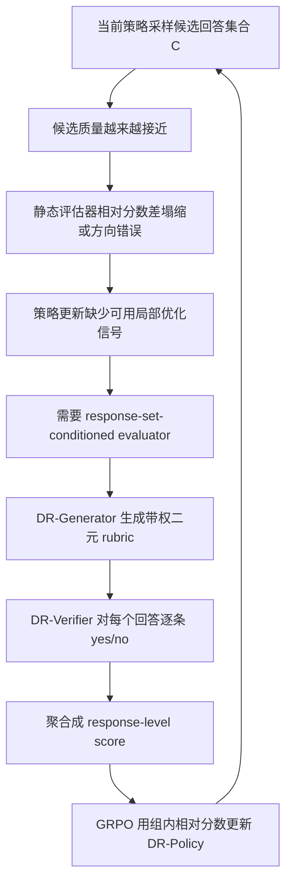

# Co-Evolving LLM Evaluators and Policies via DynamicRubric：让后训练评估器跟着策略一起进化

### 元信息

| 项目 | 内容 |
|---|---|
| 论文 | Co-Evolving LLM Evaluators and Policies via DynamicRubric |
| 作者 | Beining Wang, Weihang Su, Hongtao Tian, Hao Kong, Tao Yang, Ting Yao, Qingyi Pan, Yueyue Wu, Qingyao Ai, Min Zhang, Yiqun Liu |
| 机构 | 清华大学、腾讯微信 |
| 版本 | arXiv:2607.20083v2，2026-07-23 更新，v1 为 2026-07-22 |
| 方向 | 大模型后训练、评估器反馈、rubric reward、策略和评价共演 |
| 原文 | https://arxiv.org/abs/2607.20083 |

### TL;DR

- 这篇论文研究一个很具体的后训练瓶颈：策略模型越训越强后，同一个 prompt 下采样出的候选回答质量越来越接近，传统 reward model 或 LLM-as-Judge 给出的相对分数差会塌缩，策略更新就拿不到足够清晰的方向。
- 作者把这个问题形式化为“概率质量在候选回答之间迁移”的局部优化问题，并证明从较差回答 `y-` 向较好回答 `y+` 转移概率质量时，局部收益正好等于评估器分数差 `E(x,y+) - E(x,y-)`。
- DynamicRubric 的核心机制是 response-set-conditioned rubric：先让当前 DR-Policy 对 prompt 采样 `K=8` 个回答，再让 DR-Generator 观察这一组回答，生成带权重的二元 rubric 条目，最后由冻结 DR-Verifier 对每个回答逐条打 yes/no，并聚合成 response-level score。
- 训练不是只追求“能区分回答”。DR-Generator 同时优化 `J_disc` 和 `J_anchor`：前者鼓励 rubric 在当前回答集合上产生非平凡 yes/no 分裂，后者用 Nectar 中的 ranked anchor 数据校准分裂方向，避免模型学会无意义或反向的区别。
- 主实验用 Qwen3-8B 初始化 DR-Policy 和 DR-Generator，并用 GRPO 优化。DR-Generator-8B 在 JudgeBench、Personalized-RewardBench、RM-Bench、UltraFeedback、AEOLLM、LMSYS-Chat-1M 上整体强于 Qwen3-32B 零样本动态 rubric，也在多项指标上接近或超过 27B/70B scalar reward model。
- 下游策略优化里，DR-Generator-8B 监督出的 Qwen3-8B policy 在 AlpacaEval2、ArenaHardv2.0、WildBench、WritingBench 上达到 `67.1 / 21.0 / 30.7 / 64.3`，超过 235B static rubric supervisor 的 `58.5 / 15.7 / 25.2 / 61.6`。
- 作者还报告 DynamicRubric 优化模型已经全量部署到微信搜索 AI 回答场景，服务每天千万级请求；线上 A/B 相比上一代生产模型在总搜索量、用户时长和正向用户行为上有统计显著提升，但具体线上数值因业务保密没有披露。
- 局限很清楚：训练时要额外调用 generator 和 verifier，wall-clock latency 上升；冻结 verifier 定义了可用监督上限；自动 rubric 可能学习 verifier 偏好、放大偏差或引入 reward hacking，需要 verifier ensemble、人类校准和部署前审计。

### 1. 研究问题：为什么“更强的评估器”不等于“更好的后训练信号”？

- 论文真正关心的不是再造一个大 reward model，而是回答一个后训练过程中的动态问题：
  - 当策略 `πθ` 还弱时，同一 prompt 下采样出的回答差异大，评估器容易给出明显分数差。
  - 当策略持续优化后，候选回答都满足基础要求，剩下差异变成“某个约束漏掉了”“某一步推理有偏差”“用户意图匹配不够精确”。
  - 这时静态 rubric、prompt-only judge 或大 scalar reward model 可能仍能给绝对分，但它们不一定能保留足够细的相对分数差。

- 作者把这个现象称为 evaluator-guided optimization 的 bottleneck：
  - 策略更新依赖候选回答之间的相对分数结构。
  - 如果评估器把接近质量的回答都打成差不多，更新信号变弱。
  - 如果评估器把细微差异判断错方向，策略会把概率质量推向错误回答。

- 这篇文章的基本主张可以压成一张表：

| 层次 | 论文主张 | 机制 | 证据 | 边界 |
|---|---|---|---|---|
| 理论 | 相对分数差就是局部优化信号 | 概率质量从 `y-` 向 `y+` 迁移 | Equation 2 到 7 | 是局部 proxy，不等于完整 RL 全局收敛证明 |
| 评估器 | rubric 必须看见当前候选集合 | `E(x,y|C)` 比 `E(x,y)` 有更大函数类 | Equation 8 到 10 | 函数类更大不保证训练一定找到好解 |
| 训练 | 区分性和方向性要同时优化 | `J_disc + λJ_anchor` | Table 3 消融 | anchor 数据质量定义方向上限 |
| 下游 | 小模型动态 rubric 可胜过大静态监督 | Qwen3-8B 生成动态 weighted binary rubric | Table 1、2、6、8 | 依赖自动 judge，线上具体指标未公开 |

### 2. 论证路线：从分数差到评估器和策略共演

作者的论证不是“rubric 更可解释”这么简单，而是按下面链条推进：



- 这个循环里有两个关键的“动态”：
  - **评估器动态**：rubric 不是只由 prompt 生成，而是由 prompt 加当前候选回答集合生成。
  - **训练分布动态**：DR-Generator 在 `P_t-1` 的回答集合上更新，然后 DR-Policy 用新 generator 的分数更新到 `P_t`。

- 论文试图说服读者的地方在于：
  - 分数差不是评估报告里的副产品，而是策略更新里的核心量。
  - 当前候选集合不是噪声，而是评估器应该条件化输入的一部分。
  - rubric 的可解释性只有在它能切开当前候选差异时才有训练价值。

### 3. 方法机制：DynamicRubric 拆开看

#### 3.1 三个角色

| 角色 | 是否可训练 | 输入 | 输出 | 作用 |
|---|---:|---|---|---|
| DR-Policy | 可训练 | prompt `x` | 候选回答集合 `C={y1...yK}` | 产生当前策略分布上的训练样本 |
| DR-Generator | 可训练 | prompt `x` + 候选集合 `C` | rubric 列表 `{(r_m,w_m)}` | 找出这一组回答里的决定性差异 |
| DR-Verifier | 冻结 | prompt、rubric、单个回答 | `yes/no` 判断 `v_m(y;C)` | 把自然语言标准落实成可聚合的二元信号 |

- Figure 1 的例子是“为什么开发时要用验证集”：
  - DR-Policy 生成多个候选回答。
  - DR-Generator 生成如“说明验证集和训练集分离”“解释其用于调参”“说明它估计泛化”等带权 criteria。
  - DR-Verifier 对每个回答逐项判断。
  - 聚合分数示例为 `(5+2)/(5+3+2)=0.7`。

#### 3.2 分数聚合公式

设 DR-Generator 生成 `M` 个 rubric 条目：

```text
R_phi(x,C) = {(r_m, w_m)} for m = 1...M
w_m ∈ {1,2,3,4,5}
v_m(y;C) ∈ {0,1}
```

response-level evaluator 写成：

```text
E_phi(x, y | C) =
  sum_m w_m * v_m(y;C) / sum_m w_m
```

- 这个公式的意义：
  - `v_m` 是 verifier 的二元判断，避免直接输出模糊分数。
  - `w_m` 让 generator 学习哪些 criteria 更重要。
  - 同一组回答共用同一组 rubric，因此组内分数差可比较。
  - `M` 和权重不被人工固定，模型在训练中学习分配。

### 4. 理论核心：为什么相对分数差就是训练信号？

论文把每个 prompt 下的候选回答集合记为：

```text
y1,...,yK ~ πθ(.|x)
C = {y1,...,yK}
```

在候选集合 `C` 内，归一化策略概率质量为：

```text
α_i = πθ(y_i|x) / sum_j πθ(y_j|x)
sum_i α_i = 1
```

局部 proxy objective 为：

```text
J_local_x,C(α;E) = sum_i α_i E(x,y_i)
```

如果把一点概率质量从 `y_j` 转移到 `y_i`，方向为：

```text
d_i<-j = e_i - e_j
```

那么方向导数是：

```text
d/dε J_local_x,C(α + ε d_i<-j;E) | ε=0
= E(x,y_i) - E(x,y_j)
```

- 这一步是全文的理论支点：
  - 如果 `y_i` 比 `y_j` 好，而评估器给出的 `E(x,y_i)-E(x,y_j)` 很大，策略更新有明确方向。
  - 如果差值接近 0，策略不知道该把概率质量往哪里移。
  - 如果差值为负，策略会向错误回答迁移。

- 作者进一步定义平均相对分数差：

```text
Δ_gap(E;θ) =
E_x E_C E_(y+,y-) [ E(x,y+) - E(x,y-) ]
```

- 这里 `(y+, y-)` 的方向由独立参考质量决定，`Δ_gap` 于是成为“评估器在当前策略分布上暴露了多少可用优化信号”的度量。

### 5. 为什么要 response-set-conditioned evaluation？

作者比较两个函数类：

```text
E_prompt = { E: (x,y) -> E(x,y) }
E_set    = { E: (x,y,C) -> E(x,y|C) }
```

- prompt-only evaluator 是 response-set-conditioned evaluator 的特例：

```text
E(x,y|C) = E(x,y)
E_prompt ⊆ E_set
```

- 对一个单调不增的 ranking loss `L_x,C(E)`，作者给出：

```text
inf_{E in E_prompt} E_C[L_x,C(E)]
>=
inf_{E in E_set} E_C[L_x,C(E)]
```

- 这并不是说“看候选集合一定更好”，而是说：
  - 从函数类容量看，加入 `C` 不会让最优局部排序损失更差。
  - 真正难点转移到训练目标：如何让 generator 用 `C` 生成有用 criteria，而不是过拟合当前回答里的偶然差异。
  - DynamicRubric 的双目标正是为了解决“有区分但不一定有方向”的问题。

### 6. DR-Generator 的双目标：分得开，还要分对

#### 6.1 `J_disc`：让 rubric 在当前集合上产生非平凡分裂

对第 `m` 个 rubric，令：

```text
v_bar_m = (1/K) * sum_i v_m(y_i;C)
```

discriminability reward 为：

```text
R_disc(x,C;phi) =
  sum_m w_m * v_bar_m * (1 - v_bar_m) / sum_m w_m
```

- 直觉解释：
  - 如果一个 rubric 对所有回答都是 yes，`v_bar` 接近 1，方差接近 0。
  - 如果一个 rubric 对所有回答都是 no，`v_bar` 接近 0，方差也接近 0。
  - 当 rubric 把回答集合切成 yes/no 两部分时，方差更高，说明它在当前集合上有区分力。

- 但只靠 `J_disc` 会有一个明显问题：
  - “回答是否包含三个逗号”也可能区分候选。
  - “是否故意绕开用户要求”也可能区分候选。
  - 区分力本身不说明质量方向。

#### 6.2 `J_anchor`：用 ranked anchor 校准方向

anchor 数据来自 Nectar，每个样本有一个 prompt 和一个完整排序的回答列表：

```text
C_anchor = (y'_1, ..., y'_n)
y'_1 ≻ y'_2 ≻ ... ≻ y'_n
```

DR-Generator 仍然只观察当前策略回答集合 `(x,C)` 来生成 rubric，然后把同一组 rubric 应用到 anchor responses 上，得到分数 `S_i`。

anchor reward 采用 Bradley-Terry 风格对比，并用 rank-biased precision 风格权重强调靠前和相邻差异：

```text
R_anchor =
sum_{i=1}^{n-1} sum_{j=i+1}^{n}
  log σ(S_i - S_j) / ((j-i) * 2^(i-1))
```

- 这个目标负责三件事：
  - 让高质量 anchor 的分数高于低质量 anchor。
  - 更强调 top-ranked response 附近的细粒度差异。
  - 给 `J_disc` 的“能切开”加上“朝正确方向切开”的约束。

#### 6.3 合并目标

论文把 evaluator objective 写成：

```text
J_evaluator^t(phi;theta_{t-1})
= J_disc^t(phi;theta_{t-1}) + λ J_anchor^t(phi;theta_{t-1})
```

实验里，作者在 advantage level 合并两个目标，设置 `λ=1`，减少 reward scale mismatch。

### 7. 训练流程：从 G0/P0 到连续共演

```text
Input:
  Initial policy P0
  Initial generator G0
  Frozen verifier V
  Prompt distribution D
  Ranked anchor data A
  Rounds T
  Response-set size K
  Anchor weight λ

For t = 1...T:
  1. Evaluator update:
     - sample anchor (x, C_anchor) from A
     - sample current-policy responses C from P_{t-1}
     - G generates weighted rubrics R_phi(x,C)
     - V verifies C and computes R_disc
     - V verifies C_anchor and computes R_anchor
     - update G to maximize R_disc + λ R_anchor

  2. Policy update:
     - sample prompt x from D
     - sample responses C from current policy
     - fixed G_t generates rubrics
     - V computes response scores
     - GRPO updates policy with rubric-based scores

Output:
  trained generator G_T and policy P_T
```

- 训练细节的关键数字：

| 项目 | 设定 |
|---|---|
| backbone | Qwen3-8B 主实验；附录复现 Llama-3.1-8B-Instruct |
| optimizer | GRPO |
| response-set size | `K=8` |
| global batch size | 256 |
| KL 系数 | `β=0.01` |
| DR-Generator 学习率 | `5e-6` |
| DR-Policy 学习率 | `1e-6` |
| DR-Policy 最大输入/输出 | 8K / 8K |
| DR-Generator 最大输入/输出 | 24K / 8K |
| DR-Generator 训练样本 | 24K |
| DR-Policy 训练 prompts | 36K |

- 训练数据过滤也值得注意：
  - DR-Generator 样本要求至少 7 个候选回答。
  - prompt 和 top-ranked response 多数情况下要超过 50 字符。
  - 含重复生成、破碎文本、纯拒答、只有问候或澄清的样本会被过滤。
  - 这说明 DynamicRubric 并不是在任意低质量响应池上训练，它需要有信息量的候选差异。

### 8. 实验一：评估器本身有没有变强？

作者先看 DR-Generator 生成 rubric 后，配合固定 verifier 能不能更准确地恢复偏好排序。

| 方法 | 尺寸 | JudgeBench | Personalized-RB | RM-Bench | UltraFeedback | AEOLLM Acc | LMSYS Acc |
|---|---:|---:|---:|---:|---:|---:|---:|
| Qwen3-8B zero-shot dynamic rubric | 8B | 36.4 | 53.7 | 52.2 | 54.7 | 17.8 | 12.0 |
| Qwen3-32B zero-shot dynamic rubric | 32B | 46.4 | 67.6 | 64.7 | 64.6 | 29.7 | 15.1 |
| DR-Generator-8B | 8B | 57.4 | 73.3 | 69.8 | 68.7 | 51.2 | 28.0 |
| Skywork scalar reward | 27B | 52.1 | 64.7 | 67.7 | 63.4 | 43.8 | 21.0 |
| Nemotron scalar reward | 70B | 66.0 | 68.6 | 85.2 | 72.8 | 57.5 | 20.4 |

- 可以读出的结论：
  - DR-Generator-8B 明显强于同尺寸和更大尺寸的零样本动态 rubric generator。
  - 它不全面超过 70B scalar reward model；比如 Nemotron-70B 在 JudgeBench、RM-Bench、UltraFeedback、AEOLLM Acc 上仍更高。
  - 但 DR-Generator-8B 在 Personalized-RB 和 LMSYS Acc 上超过表中 scalar reward model，说明训练过的 response-set rubric 不是单纯“小模型碰巧能用”。

- 最值得注意的是 response-set access 的对照：
  - scalar reward model 加上候选集合输入后表现并不稳定。
  - 例如 Skywork-27B 在 Personalized-RB 从 64.7 降到 60.6，Nemotron-70B 在 UltraFeedback 从 72.8 升到 77.4。
  - 所以关键不是“把 response set 拼进输入”，而是训练 generator 学会把集合差异转成可验证 rubric。

### 9. 实验二：动态 rubric 监督能不能真的提升 policy？

下游策略优化里，作者比较了原生 Qwen3-8B、Qwen3-32B、scalar reward supervision、static rubric supervision 和 DynamicRubric。

| 监督方法 | supervisor size | policy backbone | AlpacaEval2 | ArenaHardv2.0 | WildBench | WritingBench |
|---|---:|---|---:|---:|---:|---:|
| Native | 无 | Qwen3-8B | 38.5 | 9.0 | 16.4 | 57.8 |
| Native | 无 | Qwen3-32B | 50.2 | 20.8 | 29.7 | 62.0 |
| Skywork-27B | 27B | Qwen3-8B | 50.6 | 15.3 | 22.3 | 60.2 |
| Nemotron-70B | 70B | Qwen3-8B | 35.2 | 10.3 | 17.5 | 56.2 |
| Static RaR | 235B | Qwen3-8B | 58.5 | 15.7 | 25.2 | 61.6 |
| DR-Generator-8B | 8B | Qwen3-8B | 67.1 | 21.0 | 30.7 | 64.3 |

- 这张表是本文最有冲击力的结果：
  - 8B 动态 rubric supervisor 指导出的 8B policy，在四个开放生成 benchmark 上超过 235B 静态 rubric 监督。
  - 它也超过原生 Qwen3-32B，说明这个结果不是只靠模型尺寸。
  - Nemotron-70B 作为 reward model 在 policy supervision 上表现并不好，提示“评估器表格强”不必然等于“训练信号强”。

- 附录 F.2 用 GPT-4.1 重新做 judge 后，趋势仍成立：
  - DR-Generator-8B 得到 `67.1 / 19.7 / 51.6 / 72.6`。
  - Static RaR 为 `54.1 / 10.5 / 47.6 / 69.2`。
  - 相对 Static RaR，四项提升分别是 `+13.0 / +9.2 / +4.0 / +3.4`。

### 10. 实验三：共演是否必要？

作者在 Figure 2 里隔离了两个问题：

- 问题 A：更新 generator 时，继续用旧策略 `P0` 的回答，还是用新策略 `P1` 的回答？
- 问题 B：更新 policy 时，用上一轮 generator `G1`，还是用最新 generator `G2`？

结果方向很一致：

| 对照 | 发现 | 说明 |
|---|---|---|
| `G1 -> G2` 用 `P1` 样本 | 优于继续用 `P0` 样本 | evaluator 要追踪当前 policy-induced distribution |
| `P1 -> P2` 用 `G2` 监督 | 优于继续用 `G1` 监督 | stale rubric 会饱和或产生噪声 gap |
| 连续共演 | 四个生成 benchmark 都受益 | 不是一次性训练 generator 后永久使用 |

- 这部分支撑论文标题里的 “co-evolving”：
  - 如果 generator 停留在旧 policy 的响应空间，它生成的标准可能仍检查旧错误。
  - 新 policy 的回答已经避开这些旧错误，rubric 就会变成全 yes 或全 no。
  - 因此训练信号退化，策略优化重新遇到 score-gap collapse。

### 11. 消融：`J_disc` 和 `J_anchor` 谁更重要？

Table 3 把 evaluator objective 拆开：

| 设置 | JudgeBench | Personalized-RB | RM-Bench | UltraFeedback | AEOLLM | LMSYS | Macro |
|---|---:|---:|---:|---:|---:|---:|---:|
| 去掉 anchor，仅 `J_disc` | 56.1 | 72.4 | 69.8 | 67.9 | 47.3 | 27.7 | 56.9 |
| 去掉 discriminability，仅 `J_anchor` | 50.0 | 73.8 | 66.3 | 66.8 | 38.8 | 20.7 | 52.7 |
| 完整目标 | 57.4 | 73.3 | 69.8 | 68.7 | 51.2 | 28.0 | 58.1 |

- 消融给出的机制解释很直观：
  - 只有 `J_disc`：rubric 能切开回答，但不保证切的是质量维度。
  - 只有 `J_anchor`：方向更稳，但对当前 policy 生成的候选差异不够敏感。
  - 完整目标：区分性和方向性互相补位，macro 最好。

- Personalized-RB 上 `J_anchor` 单项略高于完整目标，说明：
  - 不是所有 benchmark 都同等依赖当前集合区分性。
  - 但从跨任务平均和 listwise 任务看，完整目标更稳。

### 12. 可验证任务迁移：开放生成优化是否伤害推理和代码？

作者注意到一个后训练常见担忧：

- 开放生成质量提升可能来自风格、格式、讨好 judge。
- 这种优化可能牺牲数学、科学问答、代码等可验证能力。

因此他们在 MATH-500、MMLU-Pro scientific QA 和 CodeScope 上评估 DR-Policy，并报告 AVG@5。

- Figure 3 的结论是：
  - `P1` 和 `P2` 相比初始 policy 在三类可验证任务上均有一致提升。
  - 论文没有把每个具体数字写入主文表格，但明确指出数学、科学 QA、coding 都提升。
  - 这说明 DynamicRubric 的信号不只是让模型更像 judge 喜欢的开放回答，也可能改善了更通用的推理行为。

- 但这里仍有边界：
  - 评估是自动化可验证指标，不能替代安全性、事实性、长上下文稳定性测试。
  - 论文没有展示对拒答、风险内容、偏见、幻觉等 safety dimensions 的系统评估。

### 13. 生产 A/B：为什么这篇不只是 benchmark paper？

论文报告了一个少见但重要的部署证据：

- 场景：微信搜索 AI 回答。
- 模型：上一代生产模型作为 baseline，二者都使用 WeLM-V4-80B-A3B。
- 流量：每天千万级请求。
- 结果：DynamicRubric-optimized model 在总搜索量、用户时长、绝对正向用户行为上有统计显著相对提升。
- 状态：优化后的模型已经全量部署，替换上一代生产模型。

这部分证据的价值在于：

- 它说明 rubric-based 后训练信号不仅在离线 benchmark 上有效，也能进入大流量产品闭环。
- “总搜索量”和“用户时长”不是纯粹偏好分数，至少反映真实用户交互层面的变化。
- anchor-guided continual self-improvement 在生产中被用于刷新评价方向，说明 authors 关心目标漂移，而不是一次性离线 reward。

同时，必须保留三个限制：

- 线上指标没有公开绝对值和相对提升幅度，无法判断实际业务效应大小。
- 没有看到 A/B 的持续时间、分桶方式、置信区间、护栏指标和反事实排查。
- 用户时长提升未必全是质量提升，也可能混入任务复杂度、推荐策略或交互设计变量。

### 14. 附录证据：成本、鲁棒性和案例

#### 14.1 计算成本

Table 4 报告 normalized overhead：

| 监督方法 | minimal GPU allocation | actual GPU hours | 备注 |
|---|---:|---:|---|
| Rule-based baseline | 1x | 1x | 无 verifier |
| Skywork-27B | 1.125x | 2.2x | scalar reward |
| Nemotron-70B with responses | 1.5x | 3.5x | 输入更长，成本更高 |
| Static RaR 235B | 1x | 2.5x | 未计入 235B 生成 36K prompts rubric 的离线成本 |
| DR-Generator-8B | 1x | 3.0x | generator、verifier、policy 同 backbone family，可用 SGLang flush/reload |

- 结论要谨慎读：
  - DynamicRubric 的 actual GPU hours 是 rule-based 的 3 倍。
  - 它比某些大 reward model 的最小资源占用低，因为不用常驻多个大模型。
  - 但如果 generator/verifier 变大、response set 变大、verification 串行执行，wall-clock latency 会进一步上升。

#### 14.2 verifier choice 鲁棒性

- 附录 F.1 用多个 verifier 固定比较 generator：
  - Llama-3.1-8B-Instruct。
  - Qwen3-8B。
  - Qwen3-30B-A3B。
  - Qwen3-32B。
  - Qwen3-235B-A22B。

- 结论：
  - DR-Generator-8B 在每个 verifier block 里都强于 Qwen3-8B 和 Qwen3-32B zero-shot generator。
  - 这说明收益不只是“generator 和 verifier 同一家族互相配合”的偶然产物。

#### 14.3 backbone 鲁棒性

Table 8 给出 Llama 和 Qwen policy 的对照：

| backbone | policy | AlpacaEval2 | ArenaHardv2.0 | WildBench | WritingBench |
|---|---|---:|---:|---:|---:|
| Llama-3.1-8B-Instruct | Native | 15.3 | 0.4 | -17.1 | 39.1 |
| Llama-3.1-8B-Instruct | DR-Policy | 28.7 | 1.4 | -7.7 | 47.5 |
| Qwen3-8B | Native | 38.5 | 9.0 | 16.4 | 57.8 |
| Qwen3-8B | DR-Policy | 67.1 | 21.0 | 30.7 | 64.3 |

- 这张表说明：
  - DynamicRubric 对 Llama backbone 也有效。
  - 但 Llama 的绝对 ArenaHard 和 WildBench 仍低，方法不能弥补所有 backbone 能力差距。

#### 14.4 rubric 质量 meta-evaluation

- 附录 G 让 GPT-4.1 比较训练前后的 rubric 列表：
  - 样本：Personalized-RewardBench 100 个、UltraFeedback 100 个。
  - 维度：task alignment、local discrimination、response awareness、specificity、weighting quality、overall quality。
  - DR-Generator-8B overall win rate 为 `64.3%`。
  - response awareness 为 `67.5%`，specificity 为 `67.6%`。

- 这与论文主张一致：
  - 训练后的 generator 更会看候选集合。
  - 它不是只写“有帮助、清晰、相关”这类泛化标准。

#### 14.5 case study

论文的 JudgeBench-GPT 案例是估算 Hurricane Florence landfall 的角动量，并要求从 A-J 中选项且重复字母五次。

| generator | rubrics 特征 | Response A score | Response B score | 5-seed nDCG | 5-seed Acc |
|---|---|---:|---:|---:|---:|
| `G0` zero-shot | 检查格式、逐步推理、公式、相关性 | 15 | 15 | 0.8155 | 0.0 |
| `G2` DynamicRubric-trained | 检查质量相关物理估计、角速度、转动惯量、数量级对照 | 53 | 24 | 1.0000 | 1.0 |

- 案例的意义：
  - `G0` 的 rubric 并非无效，而是太宽。
  - 两个候选都能满足“给答案、写步骤、用公式、相关”。
  - `G2` 能抓住真正决定质量的差异：物理量选择、数量级估计、角速度假设是否合理。

### 15. 风险与局限

论文自己列出的风险集中在自动监督：

- policy 可能学习 verifier-specific preferences：
  - 模型学会满足 verifier 偏好的表达和格式。
  - 这种偏好不一定等价于更广泛的人类判断。

- generated rubrics 可能继承 generator/verifier 偏差：
  - 如果 verifier 对某类风格、语言、知识领域存在盲点，rubric-based reward 会把盲点系统化。
  - 多轮优化可能放大这些模式。

- 鲁棒性检查和案例分析只是部分安全网：
  - 多 verifier 对照证明相对收益稳定。
  - GPT-4.1 meta-evaluation 证明 rubric 质量有所提升。
  - 但它们不能替代大规模 human validation。

- 计算和系统边界：
  - generator 和 verifier 的串行调用增加训练时延。
  - 冻结 verifier 限定了可学习监督的范围。
  - 论文没有训练 dedicated verifier，也没有把 GPT-4.1 这类强黑盒 verifier 放进训练环节。

### 16. 放到后训练领域里看

- DynamicRubric 的重要性在于，它把后训练评估从“找到一个强 reward model”改写成“让评价标准跟随策略分布移动”。

- 对 RLHF/RLAIF 的启发：
  - 静态 reward model 的问题不只是 reward hacking，也包括在高质量候选附近分辨率不够。
  - 当优化进入 late stage，奖励信号需要更局部、更条件化，而不是只追求大模型 judge。

- 对 rubric reward 的启发：
  - rubric 的解释性不是目的本身。
  - rubric 必须能在当前候选集合中制造可用 score gap。
  - 每条 rubric 还必须有质量方向，不能只做无监督聚类。

- 对 post-training pipeline 的启发：
  - evaluator、policy、anchor data、verifier 应当被看作一个控制回路。
  - anchor 数据不是静态标签仓库，而是校准评价方向的外部参照。
  - production continual improvement 需要定期刷新 anchor，否则 rubric 可能追随旧目标。

### 17. 继续追问

- 如果 anchor 数据本身存在偏差，`J_anchor` 会把这种偏差稳定注入 generator；后续需要研究 anchor refresh、anchor auditing 和多来源 anchor 的冲突处理。
- 如果 verifier 对某些事实、代码执行或安全边界判断不可靠，binary rubric 只会把错误判断变得更结构化；这提示 verifier ensemble 和可执行 verifier 应进入下一步。
- 如果 policy 学会生成让 generator 产生易满足 rubric 的回答，DynamicRubric 仍可能出现二阶 reward hacking；论文提出风险但没有系统攻击实验。
- 如果线上目标是用户时长或正向行为，rubric 是否会隐式追求更长、更吸引注意力但未必更准确的回答，需要更透明的 guardrail metrics。
- 对 AI 安全和 Agent 训练而言，DynamicRubric 的思路可以迁移到“行动前风险标准生成”，但必须把安全 anchor、人类校准、审计日志和失败回滚放进闭环，否则动态评价会变成动态漂移。

### 18. 和相邻工作的区别

- 这篇论文和一般 rubric evaluator 的区别：
  - 一般 rubric evaluator 更关心“评价是否可解释”，DynamicRubric 更关心“评价是否能在当前策略样本上产生训练可用的相对 gap”。
  - 一般 prompt-only rubric 只看任务要求，DynamicRubric 还看同一 prompt 下真实采样出的候选回答集合。
  - 一般静态 rubric 适合做离线评测模板，DynamicRubric 把 rubric 生成器放进训练循环，要求它跟着 policy distribution 变化。

- 它和传统 reward model 的区别：
  - reward model 往往直接输出 scalar score，解释性和局部分辨率依赖模型内部表示。
  - DynamicRubric 把 score 拆成多个二元判断，再用权重聚合，至少让每个差距能追溯到具体 criteria。
  - 但这不意味着 DynamicRubric 一定更安全，因为 verifier 的 yes/no 判断仍可能系统性出错。

- 它和纯 self-play 或自举式 evaluator 的区别：
  - DynamicRubric 不是完全闭门自我强化，`J_anchor` 仍需要 ranked anchor 数据给方向约束。
  - 这让它比无锚点自演化更稳，但也让 anchor 的覆盖面、更新频率和偏差控制变成系统关键点。

- 它对后训练实践的现实提醒：
  - 不要只问“哪个 judge 排名最高”，还要问“这个 judge 在当前 policy 样本附近有没有足够分辨率”。
  - 不要只看离线 reward accuracy，还要看 reward 用来训练 policy 后是否真的改善下游任务。
  - 不要只把 production feedback 当 KPI，还要把它转化成可审计 anchor 和 guardrail。

### 19. 结论

- DynamicRubric 最值得带走的判断是：
  - **后训练评估器不应只追求静态强度，而应追求对当前策略候选集合的相对分辨率。**

- 论文用理论说明：
  - 分数差对应局部概率迁移收益。
  - response-set-conditioned evaluator 在表达能力上覆盖 prompt-only evaluator。
  - discriminability 与 anchor calibration 可以给相对分数差提供可优化 proxy。

- 论文用实验证明：
  - 训练后的 8B DR-Generator 可以胜过更大的零样本 rubric generator。
  - 作为 policy supervision，它在开放生成 benchmark 上超过 70B reward model 和 235B static rubric generator。
  - 多 judge、多 verifier、多 backbone 的附录实验支持结论的稳健性。
  - 微信搜索全量部署提供了现实生产证据，但线上具体数值未公开。

- 论文没有证明：
  - DynamicRubric 能避免 reward hacking。
  - 自动 rubric 能替代人类偏好验证。
  - 所有领域都适合用同一 verifier 和同一 anchor 机制。

- 因此，这篇论文更像是在后训练方法论上提出一个控制论原则：
  - policy 在变，evaluator 也必须变。
  - evaluator 变化不能只靠自我区分，还要靠外部 anchor 校准方向。
  - 真正可部署的后训练系统，需要把动态评价、策略更新、生产反馈和安全审计放在同一个可验证闭环里。
