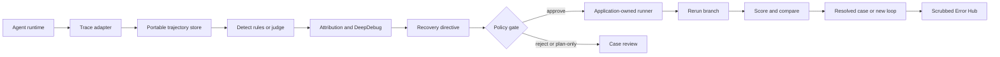

# AgentDebugX：从 Trace 回放走向可验证修复的 Agent 调试闭环

### 元信息

| 字段 | 内容 |
| --- | --- |
| 标题 | AgentDebugX: An Open-Source Toolkit for Failure Observability, Attribution, and Recovery in LLM Agents |
| 作者 | Kunlun Zhu, Xuyan Ye, Zhiguang Han, Yuchen Zhao, Bingxuan Li, Weijia Zhang, Muxin Tian, Xiangru Tang, Pan Lu, James Zou, Jiaxuan You, Heng Ji |
| 来源 | arXiv:2607.18754v1 |
| 日期 | 2026-07-21 |
| 方向 | 大模型 Agent 相关 |
| 原文 | https://arxiv.org/abs/2607.18754 |
| 项目 | https://github.com/AgentDebugX/AgentDebugX |

### TL;DR

1. 这篇论文研究 LLM Agent 的一个生产级痛点：失败暴露的位置往往不是根因位置。一个错误答案可能来自更早的规划遗漏、过期记忆、错误工具结果解释、跨 Agent handoff 丢失，单纯回放 trace 只能告诉开发者“发生了什么”，不能稳定回答“哪一步导致了失败、为什么、该从哪里修”。
2. AgentDebugX 把调试组织成 **Detect → Attribute → Recover → Rerun** 闭环：先把不同框架事件归一到 portable trajectory，再检测可见失败，再做根因归因，再把诊断变成可审核的 retry directive，最后从 checkpoint 产生对照 rerun 分支。
3. 核心诊断器 DeepDebug 是多轮、只读的 root-cause agent：先全局读 trace，再按多 Agent handoff 或单 Agent 二分结构调查，随后交叉质询候选根因，最后输出 responsible agent、step、证据、解释和一个具体修复建议。
4. 主要证据有两组：Who&When failure attribution 上，DeepDebug 在 qwen3.5-9b backbone 下达到 28.8% strict agent-and-exact-step accuracy，高于最强 single-pass baseline 的 21.7%；GAIA 上，它一次 rerun 修复 73 个失败任务中的 13 个，而三种解耦 self-correction baseline 只修 4 到 6 个，把整体准确率从 55.8% 提到 63.6%。
5. 工程形态不是只写论文方法：项目提供 Python library、CLI、web console、agentic skill、OpenTelemetry/常见 Agent 框架导入、OSWorld/GUI 支持，以及 opt-in Error Hub。README 和 PyPI 都强调 local-first、显式 scrubbing、policy/approval metadata 和 rerun 边界。
6. 安全边界很明确：Recovery 是 suggest-only，外部工具重放和真实执行必须由应用自己的 runner、凭证、授权策略和审批流程负责；Error Hub 默认移除 prompts/tool arguments 等高敏字段，但模式化脱敏不能保证清除任意敏感内容。
7. 这篇文章的价值不在于证明 AgentDebugX 已经解决所有调试问题，而在于把 Agent 失败从“看日志靠经验”推进到一种可比较的调试 artifact：同一条失败轨迹可以被复诊、共享、回归测试、变成长期调试记忆。

### 研究问题：为什么 Agent trace 回放还不够？

传统软件调试有几个相对稳定的前提：

1. 程序状态可被断点或日志复现。
2. 调用栈和异常位置通常与根因相邻。
3. 同一输入下 rerun 比较稳定。
4. 修复可以通过测试套件反复验证。

LLM Agent 打破了这些前提：

| 失败来源 | 表面症状 | 为什么难调 |
| --- | --- | --- |
| 早期规划约束遗漏 | 最终答案不完整 | 可见错误发生在末尾，根因在开头 |
| stale memory retrieval | 后续工具调用方向错误 | 检索结果看似合理，但目标上下文已经变了 |
| tool result misread | 错误分支继续执行 | 工具成功不代表语义判断正确 |
| multi-agent handoff loss | executor 做了局部正确但全局错误的事 | 责任不在当前 agent，而在上游传递 |
| GUI action/environment drift | 后续页面状态异常 | trace 需要同时看文本、截图和环境快照 |

因此，单纯“把每个 LLM call 和 tool call 录下来”只能解决观测层问题。开发者仍要回答：

1. 哪个 step 是 decisive step？
2. 哪个 agent 或 module 应负责？
3. 有哪些证据说明它不是下游症状？
4. 修复建议是否能被直接拿去重跑？
5. 修复后的分支是否真的改善，而不是换一种方式失败？

AgentDebugX 的问题意识就是补上这条链：从 observability 到 attribution，再到 recovery，再到 rerun verification。

### 论文主张与论证路线

| Claim | Mechanism | Evidence | Boundary |
| --- | --- | --- | --- |
| Agent 调试需要闭环，不只是 trace viewer | Detect、Attribute、Recover、Rerun 四阶段共享 trajectory/finding/report/recovery 类型 | 系统覆盖 portable schema、taxonomy、attribution、recovery、Error Hub，Table 1 显示相对 prior work 的能力覆盖 | 闭环是否成功仍依赖原始 trace 质量、runner 能力和任务评分器 |
| 根因定位需要多轮结构化调查 | DeepDebug 全局读、结构引导调查、候选交叉质询、诊断建议 | Who&When 上 qwen3.5-9b strict A+S 28.8%，强于 21.7% single-pass baseline | 28.8% 仍然不高，说明 hard attribution 还远未解决 |
| 定位先于修复能提高 self-correction | Recovery 把 localized diagnosis 变成 retry directive，再从 checkpoint rerun | GAIA 73 个失败中一次 rerun 修复 13 个，对照 baseline 为 4 到 6 个 | 只验证单次 rerun，不证明多轮修复一定收敛 |
| 可复用失败记忆需要脱敏 bundle | Error Hub 存 scrubbed trajectory-diagnosis-repair bundle，可做 CI fixture 和调试记忆 | README、论文和 PyPI 均强调 opt-in、scrubbing、本地优先 | 模式化脱敏不能保证任意敏感内容安全，发布前仍需人工/策略审查 |
| Recovery 不能自动变成真实执行 | policy-gated rerun request，外部 runner 拥有工具、凭证、环境和 job 生命周期 | 项目文档区分 plan-only、simulate、observed execution | 论文不是 sandbox 或权限隔离方案 |

这条路线比较重要：作者没有把“诊断模型更聪明”当作唯一变量，而是把调试工作流拆成 artifact、阶段、策略、界面和部署边界。对 Agent 工程来说，这比只展示一个 prompt 更接近可落地系统。

### 系统机制一：portable trajectory 是调试的底座

AgentDebugX 的输入是 `AgentTrajectory`。它把不同运行时的事件统一成有序的 `AgentEvent`：

| 字段 | 作用 |
| --- | --- |
| event type | 区分 LLM call、tool call、tool result、memory operation、handoff、UI action |
| acting agent/module | 记录哪个 agent 或模块发起事件 |
| step index/parent event | 建立时间顺序和局部调用关系 |
| inputs/outputs | 保留事件上下文和结果 |
| metadata/error/artifact | 保存错误、截图、文件、环境快照等证据 |

这个 schema 的设计重点有两个：

1. **归一化**：LangGraph、CrewAI、OpenAI Agents SDK、OpenTelemetry、raw ReAct、OSWorld/GUI trace 都能投影到统一表示。
2. **证据不可覆盖**：诊断层叠加在 trajectory 上，而不是改写原始记录；同一条执行可以被不同方法复诊、比较和共享。

这避免了一个常见问题：调试工具把“原始发生了什么”和“诊断者认为发生了什么”混在一起。AgentDebugX 把两者分层，使后续 regression、review、Error Hub 共享更可信。

### 系统机制二：Detect → Attribute → Recover → Rerun

四阶段可以写成一条带审计输出的数据流：

```text
Input:
  live execution or exported log

State:
  AgentTrajectory
  Findings
  Ranked attribution hypotheses
  Recovery directive
  Original branch and rerun branch

Loop:
  Detect:
    deterministic rules or LLM judge identify visible failure events

  Attribute:
    trace symptom backward to responsible agent and step

  Recover:
    convert diagnosis into a retry directive grounded in evidence

  Rerun:
    execute or simulate from a checkpoint, score branch, keep comparison

Output:
  diagnostic report
  recovery request
  resolved or unresolved case
  optional Error Hub bundle

Failure boundary:
  imported logs are not arbitrary external tool replay;
  real execution requires application-owned runner and policy approval
```

每一阶段的职责边界如下：

| 阶段 | 输入 | 输出 | 关键边界 |
| --- | --- | --- | --- |
| Detect | trajectory、goal、trace window | typed finding、failure mode、evidence、confidence | 只定位症状，不宣布根因 |
| Attribute | finding、完整/局部 trace | ranked root-cause hypotheses | 输出带 provenance 的候选，不是无条件归罪 |
| Recover | root-cause step、mode、evidence、context | retry proposal/directive | 修复建议是 suggest-only |
| Rerun | diagnosis、checkpoint、runner | new trajectory branch、score | runner 拥有环境和权限，debugger 不替代授权 |

这个拆分对实际团队有帮助，因为它允许成本分层：

1. 机械错误先用 deterministic rule pack。
2. 常见失败用 heuristic 或 single-pass。
3. 模糊长链路失败才升级 DeepDebug。
4. 修复是否执行由 policy gate 决定。

### DeepDebug：为什么要多轮 root-cause agent？

论文认为 single-pass attribution 有两个盲点：

1. 全局读 trace 能看到任务目标，但容易被最吵的下游症状锚定。
2. 逐步扫描细节足够，但容易丢掉用户目标和跨步骤因果。

DeepDebug 用四阶段缓解：

| 阶段 | 做什么 | 解决什么问题 |
| --- | --- | --- |
| Global read | 读完整 trajectory，重建目标和历史，提出初始 decisive step | 避免只看局部异常 |
| Structure-guided investigation | 多 Agent 走 handoff cascade；单 Agent 用 step range bisection | 按 trace 结构缩小搜索空间 |
| Cross-examination | 两个候选若冲突，放到同一上下文里比较输入、输出、下游影响 | 从全局搜索变成候选裁决 |
| Diagnosis and suggestion | 输出 responsible agent/step、解释、证据、具体修复 | 让 attribution 可直接进入 recovery |

这套流程的关键不是“让模型想更久”，而是把调查路径外显化：

1. 每次 inspection 被记录。
2. 候选根因有上下文和下游影响。
3. 最终诊断携带证据。
4. 修复建议绑定到 responsible step。

对高风险 Agent 来说，这种可审计性比单句“我认为第 7 步错了”更重要。

### Failure taxonomy：失败模式如何扩展？

AgentDebugX 的 seed taxonomy 有 19 个 failure modes，覆盖：

1. planning。
2. memory。
3. tool use。
4. verification。
5. coordination。

作者也承认固定 taxonomy 不可能覆盖长尾，因此设计了 taxonomy induction：

```text
Input:
  residual findings not covered by seed taxonomy

Steps:
  1. judge records novel-mode candidate
  2. inducer clusters residuals by label and lexical/embedding similarity
  3. support threshold gates candidate mode
  4. candidate is deduplicated against seed taxonomy
  5. maintainer reviews before accepting

Output:
  proposed taxonomy extension
Boundary:
  proposals never overwrite curated taxonomy automatically
```

这个设计保守但合理：

1. 如果 taxonomy 自动增长，错误标签会污染未来诊断。
2. 如果 taxonomy 完全固定，新型 multi-agent deadlock、GUI-state drift、memory/tool interaction failure 又会被归到模糊类别。
3. 用 maintainer review 维持边界，可以把 Error Hub 变成团队知识，而不是自动生成噪声库。

### 实验一：Who&When 上的根因归因

Who&When benchmark 提供完整 trace，并标注 gold responsible agent 和 mistake step。论文使用 full setting：

1. 每个方法能看到任务 reference answer。
2. 不给 gold agent 或 gold step。
3. agent 名称归一化后比较。
4. step match 要求 exact index equality。
5. 报告 responsible-agent accuracy、exact/±1 step localization、joint A+S。

关键结果：

| 指标 | DeepDebug | 最强 single-pass baseline |
| --- | ---: | ---: |
| qwen3.5-9b strict agent-and-exact-step accuracy | 28.8% | 21.7% |
| 结论 | 最好但仍偏低 | 单轮读 trace 不足以稳定根因定位 |

这个结果应谨慎读：

1. 提升是真实有意义的，因为 strict A+S 同时要求 agent 和 step 都对。
2. 绝对值仍低，说明长链路 attribution 是硬问题。
3. 它支持“多轮结构调查优于单轮解释”，不支持“DeepDebug 已可替代人工调试”。

### 实验二：GAIA 上的端到端恢复

GAIA recovery 评估的是闭环能力：

1. 基础 agent 在 GAIA validation 任务中产生失败轨迹。
2. DeepDebug 对失败进行诊断。
3. 诊断被作为 retry directive。
4. 系统做一次 rerun。
5. 用官方 question scorer 判断是否修复。

结果：

| 方法 | 73 个失败任务中修复数量 | 整体影响 |
| --- | ---: | --- |
| DeepDebug diagnosis + single rerun | 13 | overall accuracy 55.8% 到 63.6% |
| 三种 decoupled self-correction baseline | 4 到 6 | 修复量明显更低 |

这个实验支撑一个更一般的结论：模型常常“能改”，但前提是知道该改哪里。它也呼应相关工作中“LLM 难以找 reasoning error，但给出 error location 后更能修正”的观察。

不过边界同样明显：

1. 只测试一次 rerun，不是无限自修复。
2. scoring 依赖 GAIA 官方答案判定，不能覆盖所有工程任务。
3. 如果原始 trace 缺失关键事件，诊断再强也可能定位错。
4. 如果 runner 不支持从 checkpoint 恢复，rerun 只能退化成 plan-only 或从头重跑。

### 工程实现：论文之外，项目具体给了什么？

项目 README 和 PyPI 页面显示，AgentDebugX 不是只发布概念图，而是提供较完整工具面。

| Surface | 能力 | 适用场景 |
| --- | --- | --- |
| Python library | context manager/callback/live capture | 开发时接入自有 Agent |
| CLI | ingest、diagnose、batch diagnose、rerun、hub、serve | CI、离线分析、批量 benchmark |
| Local web console | trace timeline、diagnosis panel、rerun composer | 人工调试和 case review |
| Error Hub | scrubbed bundle、本地/private Git/public dataset backend | regression fixture、团队故障库 |
| Agentic skill | 生成外部 host runtime 调试资产 | 让 Claude Code/OpenClaw/Hermes 类 host 调用调试流程 |
| GUI/OSWorld importer | screenshot/action/event 归一化 | computer-use agent 根因分析 |

代码结构也对应论文分层：

| 目录 | 含义 |
| --- | --- |
| `src/agentdebug/schema` | portable trajectory、event、report、taxonomy contracts |
| `src/agentdebug/runtime` | storage、LLM clients、event bus、plugin registry |
| `src/agentdebug/inspect` | traceback renderer 和 local inspection UI |
| `src/agentdebug/hub` | scrubbed failure bundle packaging/backends |
| `src/agentdebug/integrations` | host skill 和 runtime integration generator |
| `cua_debugger` | computer-use / OSWorld GUI root-cause tooling |
| `examples` | runnable examples 和 demo traces |

PyPI 元信息显示包名为 `agentdebugx`，导入名为 `agentdebug`，支持 Python 3.9 到 3.14，并提供 `ui`、`langgraph`、`crewai`、`openai-agents`、`otel`、`gui`、`all` 等 extras。这说明作者把框架兼容性当作一等目标，而不是只围绕单一运行时。

### 图表与证据解读

| 图表/证据 | 支撑什么 | 不能证明什么 |
| --- | --- | --- |
| Figure 1 | 调试闭环从 Detect 到 Rerun，hard case 升级 DeepDebug | 不能证明所有 Agent 失败都能自动修复 |
| Figure 2 | Web console 能从可见失败跳到 attributed event，并生成 gated rerun branch | 不能证明 UI 使用体验或团队流程一定优于现有工具 |
| Table 1 | AgentDebugX 相对 prior work 同时覆盖 portable schema、taxonomy、attribution、recovery、Error Hub | 覆盖面不等于每个模块都达到生产成熟 |
| Who&When result | 多轮 DeepDebug strict A+S 归因高于 single-pass baseline | 28.8% 绝对值说明根因定位仍很难 |
| GAIA result | localized diagnosis 能显著提升一次 rerun 修复数量 | 不证明多轮自我修复不会引入新风险 |
| Appendix trace schema | 事件记录支持文本、图像、音频、UI state、文件、环境快照 | 如果源系统没有记录关键状态，schema 无法凭空补证据 |
| Deployment requirements | local-first、OpenTelemetry export、typed diagnosis、scrubbing、cost-aware analysis | 不替代组织级访问控制和数据保留政策 |

这组证据的强点是系统完整性；弱点是核心 attribution 指标仍有较大上升空间。研究者读这篇文章时，应该把它看成“调试基础设施论文”，而不是“归因模型指标刷新论文”。

### 安全与隐私边界

AgentDebugX 很容易被误解为“让 Agent 自动修自己”。论文和项目文档实际上更保守：

1. Recovery proposal 是建议，不是默认执行。
2. Rerun 需要外部 runner，runner 拥有真实模型、工具、凭证、环境、job 生命周期。
3. 模拟 rerun 明确标注 simulated，不能作为修复已成功的证据。
4. Error Hub publishing 是 opt-in。
5. 默认 scrubber 会移除 event inputs 等高敏字段，并对剩余字符串做 credential/PII pattern redaction。
6. pattern redaction 不能保证任意敏感内容都被移除，发布 bundle 前仍需审查。

这对生产系统很关键。Agent trace 里可能包含：

| 风险数据 | 示例 |
| --- | --- |
| prompts | 系统提示、内部策略、用户敏感请求 |
| tool arguments | API 参数、数据库查询、文件路径 |
| tool results | 客户数据、业务状态、错误栈 |
| screenshots | 登录态界面、个人信息、内部页面 |
| memory operations | 长期偏好、历史决策、隐式画像 |
| credentials | token、cookie、secret-like string |

因此，Error Hub 的价值和风险并存：

1. 它能把失败变成 regression fixture。
2. 它能让相似历史案例成为调试记忆。
3. 它也可能变成敏感运行轨迹仓库。
4. 生产部署必须定义 retention、access control、redaction review 和 sharing policy。

### 与已有工具的关系

AgentDebugX 和观测平台、失败 benchmark、自修复方法的关系如下：

| 线索 | 代表 | AgentDebugX 的位置 |
| --- | --- | --- |
| observability | LangSmith、Langfuse、Phoenix、OpenTelemetry | 继承 trace 捕获，但向 root-cause 和 rerun 延伸 |
| failure taxonomy/benchmark | AgentDebug、MAST、Who&When、TRAIL、AgenTracer | 把归因能力嵌入可部署工具链 |
| self-correction | Reflexion、Self-Refine、CRITIC、AutoManual | 把 correction 建立在 localized diagnosis 上 |
| training/debug memory | Error Hub、regression fixture | 把诊断过的失败变成长期案例库 |

它不是替代所有平台，而是补一个中间层：

```text
Observability trace
  -> Root-cause diagnosis
  -> Evidence-backed recovery directive
  -> Policy-gated rerun
  -> Regression/debug memory
```

这个中间层在复杂 Agent 系统里会越来越重要，因为故障经常不是单工具异常，而是跨规划、记忆、工具、handoff 和 UI 状态的组合错误。

### 局限与失败边界

论文最后的局限可以进一步展开成部署风险清单：

| 局限 | 影响 |
| --- | --- |
| attribution 绝对准确率不高 | 诊断报告应视为 evidence-backed hypothesis，而不是 ground truth |
| 依赖 trace 完整度 | 未记录的状态、隐藏 side effect、外部环境漂移会削弱诊断 |
| benchmark 覆盖有限 | Who&When 和 GAIA 不等于真实企业 agent 全域 |
| rerun runner 要求高 | 没有 checkpoint restore 或可控环境时，验证会退化 |
| LLM judge/DeepDebug 成本 | 深度诊断应是 opt-in，不宜所有失败都走最高成本路径 |
| Error Hub 脱敏不完美 | 共享 bundle 需要额外审查和访问控制 |
| recovery suggest-only | 最终执行仍要应用层授权和安全策略 |

这也解释了为什么 AgentDebugX 的设计强调 local-first 和 policy gate。一个调试系统如果能触发真实工具、读取完整 trace、保存故障库，它本身就是高权限系统，不能只按普通日志查看器管理。

### Detail inventory：这篇论文真正给出的可复现细节

| 维度 | 论文/项目给出的内容 | 对复现或二次研究的意义 |
| --- | --- | --- |
| 方法名 | AgentDebugX、DeepDebug、Error Hub | 区分系统框架、诊断 agent 和长期故障库 |
| 输入对象 | live execution 或 exported log | 支持在线采集和离线导入两种调试入口 |
| 核心数据结构 | `AgentTrajectory`、`AgentEvent`、finding、diagnostic report、recovery request | 让不同框架的失败可以被同一套诊断器处理 |
| 事件类型 | LLM call、tool call/result、memory operation、handoff、UI action、artifact | 覆盖普通工具 Agent、多 Agent 和 computer-use Agent |
| 检测方式 | deterministic rule packs、LLM judge、bounded trace window | 低成本规则先筛，难例再交给模型 |
| 归因策略 | heuristic、single-pass、binary search、per-step inspection、budgeted ensembles、DeepDebug | 可以按成本/准确性选择，不强制所有失败走最高成本 |
| DeepDebug 状态 | 全局候选、结构化调查候选、交叉质询证据、最终 root-cause report | 把诊断过程记录下来，便于复核 |
| Recovery 输出 | retry directive、checkpoint、policy/approval metadata | 修复建议可以进入 runner，但不会自动越过审批 |
| Rerun 模式 | plan-only、labeled simulation、observed execution | 区分“计划可行”“模拟分支”和“真实重跑证据” |
| Benchmark | Who&When `n=184`，GAIA validation `n=165` | 分别测试根因定位和端到端恢复 |
| 模型设置 | 诊断使用 Gemini 2.5 Flash，temperature 0，thinking disabled；attribution backbones 覆盖 open-weight 和 hosted | 把诊断模型和被调试 policy 分开，有助于分析能力来源 |
| 共享机制 | scrubbed bundle、本地目录/private Git/public dataset backend | 支持私有团队知识库和公开基准数据，但需要数据治理 |

这个 inventory 说明 AgentDebugX 的贡献不是单点算法，而是把调试链条里过去分散的 artifact 对齐：

1. trace 是证据层。
2. finding 是症状层。
3. attribution hypothesis 是因果候选层。
4. diagnosis report 是可审核判断层。
5. recovery request 是执行计划层。
6. rerun branch 是验证层。
7. Error Hub bundle 是长期记忆层。

如果缺少其中任一层，系统能力都会退化：

1. 没有 trace，诊断只能靠回忆。
2. 没有 finding，根因搜索没有入口。
3. 没有 attribution，修复建议容易针对症状。
4. 没有 rerun，修复是否有效只能靠猜。
5. 没有 bundle，团队无法沉淀长尾失败。

### 评测协议细读：为什么两个 benchmark 分别必要？

Who&When 和 GAIA 在论文里承担不同角色，不应混成一个“总体效果”。

| Benchmark | 测什么 | 为什么适合 |
| --- | --- | --- |
| Who&When | responsible agent 和 mistake step 是否定位正确 | 有 gold agent/step，能直接度量 attribution |
| GAIA | 诊断能否让失败任务在一次 rerun 后答对 | 终局有 official scorer，能看修复是否真的改善 |

Who&When 的严格点在于：

1. agent 名称要对。
2. step index 要精确匹配。
3. 只对 agent 或只对 step 都不算 strict A+S 成功。
4. 给 reference answer 只是让方法知道任务目标，不给 gold 位置。

因此，28.8% 看起来不高，但它是在非常严格的定位定义下得到的。这个数字对研究者的提醒是：

1. 长链路 Agent 失败的 root cause 本身就难以标注和恢复。
2. 单轮 whole-trace read 容易被下游显性错误吸引。
3. 多轮结构调查有收益，但还远不到可靠自动归因。
4. 未来需要更强的 causal trace representation，而不只是更长 context。

GAIA recovery 则回答另一个问题：如果定位不完美，是否仍能帮助修复？13/73 的修复量说明 localized diagnosis 已经有实用增益。原因可能有三点：

1. 有些任务不需要完全精确到唯一根因，只要指出关键错误假设即可。
2. retry directive 把修复建议放在下一轮执行最需要的位置。
3. rerun branch 允许系统验证“这个建议是否改变最终答案”。

但 GAIA 结果也不能过度乐观：

1. 未修复的 60 个失败没有消失。
2. 一次 rerun 成功不代表多轮自主修复安全。
3. 如果任务带有真实副作用，不能像问答 benchmark 一样轻易重跑。

### 可操作架构：生产 Agent 如何接入这类调试器？

站在工程系统角度，AgentDebugX 适合被放在运行平台旁边，而不是塞进模型 prompt 里。



这张图强调四个边界：

1. Agent runtime 负责真实工具和环境。
2. Trace adapter 负责把证据转成公共格式。
3. Debugger 负责诊断和建议。
4. Policy gate 与 runner 负责是否执行。

如果把这些边界混在一起，就会产生风险：

| 错误接入方式 | 风险 |
| --- | --- |
| 让 debugger 直接持有生产凭证 | 调试系统变成隐式高权限执行器 |
| 默认上传完整 trace 到共享 Hub | prompt、tool arguments、截图、PII 泄露 |
| 把 simulated rerun 当成真实修复 | 团队误以为问题已解决 |
| 所有失败都调用 DeepDebug | 成本不可控，且会让普通机械错误排队 |
| 不保存原始失败分支 | 后续无法证明修复针对的是同一故障 |

更稳妥的接入顺序是：

1. 先只做本地 trace capture。
2. 再开启 deterministic detect。
3. 对少量人工确认的失败运行 LLM-backed attribution。
4. 只用 plan-only recovery 观察建议质量。
5. 建立 runner 的 checkpoint/rollback 能力后，再允许 gated rerun。
6. 最后才把 scrubbed、reviewed bundle 纳入 Error Hub。

### 与 AI 安全的关系：调试器也是控制面

虽然这篇论文主要归在 Agent 工程，但它和 AI 安全直接相关，因为它处理的是“失败后如何发现、归因、修复和防止复发”。

安全视角下，AgentDebugX 提供三类能力：

1. **检测面**：把 malformed tool call、no-progress loop、premature success、invalid output 等变成结构化 finding。
2. **追责面**：在 multi-agent handoff、memory read、tool result interpretation 之间定位责任事件。
3. **恢复面**：把修复建议放入可审批、可比较、可回滚的 rerun 流程。

但它没有提供三类能力：

1. 不提供对模型意图的可靠内部证明。
2. 不提供对外部工具的权限隔离。
3. 不保证 Error Hub 共享后的隐私安全。

因此，安全团队使用这类系统时，应该把它当作 incident response 的一环：

| Incident response 阶段 | AgentDebugX 可承担的部分 |
| --- | --- |
| Triage | deterministic findings 和 LLM judge 初筛 |
| Investigation | DeepDebug root-cause report |
| Containment | 标记 risky step、停止自动 rerun、要求审批 |
| Remediation | retry directive 和 runner branch |
| Verification | branch score、trajectory comparison |
| Lessons learned | scrubbed bundle、taxonomy update、regression fixture |

这不是攻击面消除方案，而是事故处理和持续回归方案。它的成熟度取决于组织是否真正把 trace 保留、审批、脱敏、runner 能力和 regression 用例纳入流程。

### 研究者视角：这篇文章提出了哪些后续问题？

#### 1. Agent 评测应加入“可调试性”指标

当前很多 Agent 评测只看：

1. 最终正确率。
2. 工具调用成功率。
3. 任务成本。
4. 轨迹长度。

AgentDebugX 暗示还应评估：

1. 失败是否可定位。
2. root-cause evidence 是否充分。
3. checkpoint 是否可恢复。
4. 修复分支是否可比较。
5. 失败 bundle 是否能作为 regression fixture。

一个 Agent 系统即使 pass rate 很高，如果失败时无法解释和复现，在生产环境仍然危险。

#### 2. 调试记忆可能成为 Agent 可靠性的第二训练集

Error Hub 把 failure-diagnosis-repair bundle 变成长期资产。未来可以探索：

1. 用相似失败检索辅助 root-cause hypotheses。
2. 用 resolved cases 构造 regression suite。
3. 用人工审核后的诊断训练 attribution model。
4. 用失败模式增长驱动 taxonomy evolution。

但这必须伴随数据治理：

1. bundle 最小化。
2. 明确敏感字段。
3. 分级访问控制。
4. 保留期限。
5. 公开共享前复审。

#### 3. Recovery 应和权限系统合流

论文把 recovery 保持为 suggest-only，这是正确边界。下一步值得研究：

1. retry directive 如何表达权限需求。
2. runner 如何声明可恢复 checkpoint。
3. 人类审批如何和自动评分结合。
4. saga rollback 如何用于有副作用工具。
5. 调试系统如何证明“只读诊断”没有偷偷重放外部 action。

这会把 Agent debugging 推向更完整的可靠性架构：trace、diagnosis、policy、runner、rollback、audit 需要成为同一控制面的一部分。

### 结论

AgentDebugX 的核心贡献，是把 Agent 失败处理从“看 trace 后人工猜修法”推进到一个可审计闭环：

1. 失败先被检测成结构化 finding。
2. 症状被反向追溯到 responsible agent/step。
3. 诊断携带证据和具体修复建议。
4. 修复通过 checkpoint rerun 形成对照分支。
5. 解决过的失败可以进入 Error Hub，成为 regression 和调试记忆。

它目前还不能替代人工审查，也没有证明任意 Agent 系统都能被自动修好。但它提出了一个很实用的标准：一个成熟 Agent 运行平台，不应只记录模型和工具调用，还应能回答失败根因、修复假设、验证结果和安全边界。对正在走向真实工具、真实权限和长链路任务的 Agent 来说，这个标准会越来越重要。
