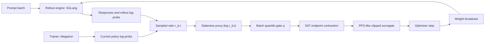

# Stale but Stable：把异步 RL 的陈旧样本变成自适应信任域问题

| 项目 | 内容 |
| --- | --- |
| 论文 | Stale but Stable: Staleness-Adaptive Trust Regions for Stabilizing Asynchronous Reinforcement Learning |
| 链接 | https://arxiv.org/abs/2607.18722 |
| 版本 | arXiv:2607.18722v2，2026-07-22 14:40:14 UTC 修订 |
| 类型 | 大模型后训练 / 异步强化学习系统 |
| 代码 | https://github.com/jyyang26/SAT |
| 项目页 | https://jyyang26.github.io/stable_async_analysis/ |

### TL;DR

- **这篇论文做什么**：研究 LLM 后训练中的异步强化学习稳定性，尤其是 rollout 生成和 trainer 优化解耦后，旧策略采样的 token 被新策略训练时产生的 **staleness / training-inference mismatch**。
- **核心问题**：配置上的 lag 只是粗略标签；真正进入 loss 的是 sampled log-ratio `d_{b,t} = log r_{b,t}`。它同时混合 policy lag、SGLang 与 Megatron 的实现差异、MoE routing 差异和数值误差。
- **方法机制**：作者提出 **Staleness-Adaptive Trust Region, SAT**。它把 `|log r_{b,t}|` 当作每个 token 的陈旧度代理，用 batch 内 0.90 分位数找高陈旧长尾，再只收缩会把 ratio 推得更远的那一侧 PPO clip endpoint。
- **实验证据**：在 Qwen3-30B-A3B-Base 上，用 SGLang 做 rollout、Megatron 做训练，数据为 DAPO-Math-17k 与 Dolci-RL-Zero-Math 合并后的 30,712 条 math prompts，AIME24 每题 16 samples 评估。
- **关键数字**：SAT-GSPO w/ R3 在 lag 1 达到 AIME24 avg@8 **35.83**，在 lag 8 达到 **34.79**；Plain GRPO/GSPO 在 lag 8 分别达到 30.17/31.46 的最佳点后发生 later collapse。
- **边界**：Table 1 每个 cell 是固定 seed 的单次训练，不是多 seed 显著性结论；`|log r|` 不是完整 vocabulary 上的 DTV，只是 sampled proxy；SAT 收缩的是 sampled PPO surrogate，不是形式化硬 trust region。
- **为什么值得读**：它把“异步 RL 吞吐更高但不稳定”从工程直觉推进为可诊断的 token-level mismatch 问题，并给出一个能插到 GRPO/GSPO/PPO-like objective 里的自适应 clip 机制。

### 研究问题：异步 RL 为什么不是简单地把 lag 调小？

- 同步 RL 的直观安全感来自同一批权重：
  - rollout 用当前策略采样；
  - trainer 立刻消费这批样本；
  - token-level ratio 在理想化同分布下接近 `1`。

- 异步 RL 为了吞吐把两件事拆开：
  - **rollout engine**：在独立 GPU 池里持续生成 responses；
  - **training engine**：在另一组 GPU 上消费旧 batch 并更新参数；
  - **weight broadcast**：每隔若干 trainer steps 才把新权重同步给 rollout。

- 这带来一个后训练系统里的核心张力：
  - 解耦越强，GPU 利用率越好；
  - 解耦越强，行为策略 `mu` 与训练策略 `pi` 的差异越大；
  - 差异越大，PPO/GRPO 这类 clipped surrogate 越可能用错误的固定半径处理不可靠 token。

论文的关键问题可以写成：

> 如果 stale rollout 不可避免，clip radius 能否按每个 token 的实际陈旧度变化，而不是对所有 token 使用同一个 `epsilon`？

### 论证路线：claim -> mechanism -> evidence -> boundary

| 层级 | 论文主张 | 机制 | 证据 | 边界 |
| --- | --- | --- | --- | --- |
| 问题定义 | configured lag 不等于真实 mismatch | 用 sampled log-ratio 拆出 policy-update 与 implementation mismatch | Figure 1/2/3 描述异步流水线与 collapse 诊断 | 无法唯一分解所有实现源 |
| 理论动机 | PPO clipping 不是硬 trust region | 有限 horizon bound 里误差项由 DTV 控制，PPO 只看 sampled action | Lemma 与 Section 3 推导 ratio deviation 与 DTV 的关系 | sampled proxy 不是 full-vocabulary DTV |
| 方法 | 高陈旧 token 应更保守 | batch quantile gate + Hill kernel + sign-selected endpoint contraction | Proposition 4.1：interval containment、pointwise pessimism | 只改变 outward band，不保证全局最优 |
| 实验 | SAT 改善高 lag 稳定性 | 与 GRPO/GSPO/R3/TIS/DPPO 比较 | Table 1：SAT-GSPO w/ R3 在 lag 1/8 均第一 | 单 seed，单模型，单数学任务族 |
| 领域意义 | 异步后训练需要 token-level diagnosis | 把 scheduler lag 转成 loss-level ratio geometry | 官方代码包含 `sat_slime`、scripts、数据与结果表 | 需要更多模型、任务、多 seed 验证 |

### 方法背景：把异步 RL 写成 token-level mismatch

论文从一个 batch 中第 `b` 条 response、第 `t` 个 token 开始建模。

```text
x        : prompt
y_b      : rollout engine 采样出的 response
s_{b,t}  : 第 t 个 token 之前的 decoding state
mu_{b,t} : rollout engine 实际采样 token 的 behavior policy
pi^(j)   : trainer 在第 j 次 update 使用的当前 policy
```

token-level importance ratio 是：

```math
r_{b,t} =
\frac{\pi^{(j)}(y_{b,t} \mid s_{b,t})}
     {\mu_{b,t}(y_{b,t} \mid s_{b,t})}
```

对应 log-ratio 是：

```math
d_{b,t} = \log r_{b,t}
```

这里最重要的不是公式本身，而是 `d_{b,t}` 的解释：

- 如果 `d_{b,t}` 接近 `0`：
  - 说明当前 trainer policy 与 rollout behavior policy 对这个 sampled token 的概率接近；
  - 这个 token 对 off-policy correction 的压力较小。
- 如果 `|d_{b,t}|` 很大：
  - 说明 trainer 正在用一个明显不同的 policy 更新旧 token；
  - PPO 固定 clip radius 可能过于宽松，也可能过度压制正常学习。

### 陈旧度来自哪里？

论文把 observed staleness 写成两部分：

```math
d_{b,t}
= \log r_{b,t}
= \Delta^{\pi}_{b,t} + \Delta^{impl}_{b,t}
```

| 来源 | 含义 | 为什么在 LLM RL 里严重 |
| --- | --- | --- |
| `Delta^pi` | rollout checkpoint 到 trainer current checkpoint 之间的 policy update mismatch | 异步窗口内可能已经做了多个 optimizer steps |
| `Delta^impl` | rollout engine 与 trainer reference 的实现差异 | SGLang 与 Megatron 的 kernels、precision、KV cache、MoE routing 可能不同 |
| MoE router | Top-K expert mask 是离散选择 | routing tie 附近的微小数值差异会改变 expert subset |
| hardware numerics | reduction order 与设备相关 kernels | 即使权重相同，也可能引入 log-prob 差异 |

这也是论文反复强调的点：

- configured lag 是系统配置；
- observed staleness 是 loss 实际看到的 ratio 分布；
- 后者才决定 sampled update 是否正在把训练推向更不稳定的区域。

### 为什么 PPO clipping 不够？

PPO 类方法的 clipping 常被口头理解成 trust region，但论文拆得更细。

有限 horizon policy improvement bound 里，误差项与 token-level total variation divergence 有关：

```math
D_{TV}(\mu \parallel \pi)[s]
= \frac{1}{2}
  \mathbb{E}_{a \sim \mu(\cdot \mid s)}
  \left| \frac{\pi(a \mid s)}{\mu(a \mid s)} - 1 \right|
```

这个式子说明：

- 如果能对所有 action 的 ratio 做硬界约束，确实能控制 DTV；
- 但 PPO clipping 只作用在 sampled action 的 surrogate loss；
- 它不会检查整套 vocabulary distribution；
- 它保留 pull-back update，只截断超过边界的 outward update。

论文因此提出一个更谨慎的说法：

> PPO clip 是 sampled objective guardrail，不是 full-policy trust-region constraint。

### SAT 的核心：只收缩高陈旧 token 的 outward endpoint

SAT 的设计不是把所有 clip radius 都缩小。

如果全局缩小 `epsilon`：

- 普通 token 也会被过度保守处理；
- 训练信号会被饿死；
- 高陈旧 tail 仍未被单独识别。

SAT 的处理是三步。

| 步骤 | 操作 | 目的 |
| --- | --- | --- |
| 1. 估计陈旧度 | 使用 detached sampled log-ratio `|d_{b,t}|` | 不让 gate 本身反向影响 ratio 计算 |
| 2. 找 batch tail | 用当前 microbatch 的经验分位数 `q`，实现里 `alpha = 0.90` | 自适应当前 batch scale，避免固定阈值 |
| 3. 收缩 endpoint | 只对 high-staleness tail 收缩 sign-selected clip endpoint | 保留普通 token 与 pull-back update |

可以把它写成伪代码：

```text
Input:
  active sampled tokens T_act
  sampled ratio r_{b,t}
  advantage A_hat_{b,t}
  PPO clip radii epsilon_low, epsilon_high
  quantile alpha = 0.90
  Hill-kernel exponent = 2

State:
  d_{b,t} = stop_gradient(log r_{b,t})
  q = quantile({ |d_{b,t}| : (b,t) in T_act }, alpha)

For each token (b,t):
  if q == 0 or |d_{b,t}| <= q:
    c_minus = 1
    c_plus  = 1
  else:
    scale = HillKernel(|d_{b,t}|; q)
    if d_{b,t} > 0:
      c_plus  = scale
      c_minus = 1
    else:
      c_minus = scale
      c_plus  = 1

  lower_bound = 1 - epsilon_low  * c_minus
  upper_bound = 1 + epsilon_high * c_plus
  use PPO-style clipped surrogate with adaptive bounds

Output:
  sampled surrogate that clips high-staleness outward bands earlier
```

关键点有两个：

- **方向性**：
  - ratio 已经大于 `1` 时，只收缩 upper side；
  - ratio 已经小于 `1` 时，只收缩 lower side；
  - 否则会误伤把 ratio 拉回 `1` 的 pull-back gradient。
- **相对性**：
  - `q` 每个 batch 重算；
  - 它响应当前 mismatch tail，而不是依赖一个全局固定阈值；
  - 这让 SAT 更像 loss-level stabilizer，而不是 scheduler-level heuristic。

### 更新几何：SAT 到底改变了什么？

论文的 Proposition 4.1 给 SAT 的几何性质定边界。

| 性质 | 含义 | 研究意义 |
| --- | --- | --- |
| Local interval containment | SAT adaptive interval 被包含在 PPO nominal interval 内 | SAT 不会比 PPO 放得更宽 |
| Pointwise pessimism | 对 gated outward band，SAT surrogate 更保守 | 高陈旧 outward update 更早被截断 |
| Pull-back unchanged | 把 ratio 拉回 `1` 的方向不被额外截断 | 不把稳定化等同于停训 |
| Drop-in replacement | `c=1` 时恢复原始 PPO/GRPO/GSPO 行为 | 可以作为 PPO-like objective 插件 |

这一点对后训练系统很重要：

- SAT 不是另一个 reward model；
- 不是新的 rollout scheduler；
- 不是单纯把 learning rate 降低；
- 它精确改变 clip objective 的局部几何。

### 公式细读：为什么是“向外”而不是“大 ratio 一律惩罚”？

PPO-like objective 的难点在于 advantage 有符号。

- 当 `A_hat > 0`：
  - 增大 sampled token 的概率通常是有利方向；
  - 如果 `r > 1 + epsilon` 还继续增大，就属于 outward update；
  - 这时上边界应该阻止更大的偏离。

- 当 `A_hat < 0`：
  - 降低 sampled token 的概率通常是有利方向；
  - 如果 `r < 1 - epsilon` 还继续降低，也属于 outward update；
  - 这时下边界应该阻止更小的 ratio。

- 当 update 方向把 `r` 拉回 `1`：
  - 它是在缩小 behavior policy 与 train policy 的 sampled mismatch；
  - SAT 不应该拦截这类 pull-back gradient；
  - 否则稳定化会变成简单的梯度删除。

可以用一个表理解 sign-selected endpoint。

| 条件 | 本地趋势 | SAT 应收缩哪侧 | 不应收缩哪侧 |
| --- | --- | --- | --- |
| `d = log r > 0` 且 outward | ratio 已经偏大，还要更大 | upper endpoint | lower endpoint |
| `d = log r < 0` 且 outward | ratio 已经偏小，还要更小 | lower endpoint | upper endpoint |
| update 是 pull-back | ratio 朝 `1` 回来 | 不额外收缩 | 保持 baseline |
| `|d| <= q` | 普通 token | 不收缩 | 保持 baseline |

这解释了为什么论文不采用“`|log r|` 大就把 token 丢掉”的粗暴策略。

- 丢掉 token 会损失有效学习信号；
- 对称 gate 可能误杀 pull-back；
- fixed threshold 无法适配 batch 间 scale；
- SAT 的相对 quantile gate 更像“只在当前 batch 的异常尾部介入”。

### 从 trust region 角度看：SAT 的保守性在哪里？

论文把 trust region 解释限定得很窄，这是一个优点。

1. **硬 trust region 的理想形态**
   - 对每个 state 的所有 action 都约束 `pi(a|s) / mu(a|s)`；
   - 这样才能直接控制 full-distribution DTV；
   - 但 LLM vocabulary 大，逐 action 检查成本很高。

2. **PPO clipping 的实际形态**
   - 只看 rollout 已经采样到的 token；
   - 只改 sampled surrogate；
   - 未采样 action 的概率质量仍可能移动。

3. **SAT 的实际形态**
   - 不扩大 PPO 的承诺；
   - 不把 sampled proxy 伪装成 full DTV；
   - 只让 PPO 的 sampled interval 对 high-staleness token 更保守。

因此，SAT 的可信表述应该是：

| 可以说 | 不应该说 |
| --- | --- |
| SAT 在 sampled surrogate 上更早截断高陈旧 outward update | SAT 形式化保证训练策略不偏离 rollout 策略 |
| SAT 的 adaptive interval 包含于 nominal PPO interval | SAT 等价于 TRPO 式全策略约束 |
| SAT 的 gate rate 可作为 runtime diagnostic | `|log r|` 就是完整 DTV |
| SAT 与 R3 可互补 | SAT 单独解决所有异步 mismatch |

### Figure/Table 逐项证据解读

| 图表 | 论文里承担的功能 | 能证明什么 | 不能证明什么 |
| --- | --- | --- | --- |
| Figure 1 | 解释 batch-wise async pipeline | rollout 与 trainer 解耦会产生版本滞后 | 不能说明所有 fully async 系统同分布 |
| Figure 2 | 展示 lag 1/8 下 mismatch diagnostics | 高 lag 出现更大 `d_pi` 与 KL spike | 不能唯一归因到 policy lag 或 routing |
| Figure 3 | 展示 GSPO lag 8 的 evaluation collapse | best checkpoint 后可能晚期崩塌 | 不能推出 GSPO 总是不稳定 |
| Table 1 | 主结果与 last-epoch mismatch | SAT-GSPO w/ R3 在报告网格中最佳 | 单 seed，不是统计显著性 |
| Figure 4 | mismatch trajectory over training | R3 组合多处于低 mismatch band | 不能把 R3 与 SAT 的因果作用完全拆开 |
| Table 3 | stabilizer design space | SAT 属于 asymmetric adaptive clipping | 不能覆盖所有 RL 稳定技术 |
| Table 9 | reproducible hyper-parameters | 给出 clip radius、KL coefficient、entropy 等关键复现项 | 不等于一键复现所有分布式环境 |

这组证据的强点在于主线一致：

- 先说明异步 lag 会在 ratio diagnostics 中留下痕迹；
- 再说明 PPO fixed clip 对 heterogeneous tail 不敏感；
- 然后提出只动 high-staleness outward band 的 SAT；
- 最后用结果网格和 mismatch trajectory 证明组合稳定性更好。

弱点也同样清楚：

- 没有多 seed；
- 没有跨模型族；
- 没有长文本、多轮工具、代码任务等更复杂 reward 结构；
- collapse 标记依赖 logged window，窗口外行为未知。

### 训练栈细读：为什么 SGLang + Megatron 这个组合重要？

很多后训练论文只报告 algorithm，不报告 rollout/trainer 分离细节。

这篇论文明确写出：

- rollout 由 SGLang 执行；
- trainer 由 Megatron 执行；
- 两者使用解耦 GPU pools；
- 权重按照 configured lag 广播；
- rollout log probabilities 与 trainer current log probabilities 一起进入 ratio。

这使得 mismatch 不是抽象概念，而是可记录指标。

| 训练栈组件 | 可能引入的差异 | 对 SAT 的意义 |
| --- | --- | --- |
| SGLang inference kernels | attention、KV cache、batching、precision 差异 | `mu` 不是 trainer 内部重算的理想策略 |
| Megatron training kernels | fp32 all-reduce、attention softmax、parallelism | current log-prob 与 rollout log-prob 有实现落差 |
| MoE Top-K router | expert mask 离散跳变 | R3 replay 有必要，SAT 不能替代 |
| weight broadcast | rollout batch 可能落后多个 trainer versions | configured lag 增大时 tail 更重 |
| sampled ratio logging | 直接暴露 `d_{b,t}` | SAT 才能按 token 动态收缩 |

如果系统没有记录 rollout-side log-prob，很多 mismatch 会被 trainer-side recomputation 吸收。

- 这会让指标看起来更干净；
- 但也可能隐藏真实训练-推理差异；
- 论文选择使用 rollout log-prob 作为 denominator，是为了更忠实暴露异步系统实际面对的问题。

### 为什么 R3 是 SAT 的强搭档？

R3 处理的是 MoE routing replay。

- rollout 时，某个 token 在某层选中了 Top-K experts；
- trainer 重算时，即使权重名义相同，router logits 的微小差异也可能改变 experts；
- 一旦 expert subset 变了，后续 hidden state 与 log-prob 都会漂移。

R3 的做法是：

- replay rollout-time Top-K mask；
- 保留 current trainer logits 的 softmax；
- 尽量让 routing branch 与 rollout 一致。

SAT 与 R3 的分工可以写成：

| 问题 | R3 | SAT |
| --- | --- | --- |
| MoE routing 离散差异 | 直接针对 | 间接反映在 `|log r|` 中 |
| policy lag 带来的 ratio drift | 不直接解决 | 对 high-staleness outward update 收缩 |
| engine 数值差异 | 可减少 routing 部分 | 对结果 tail 做保守处理 |
| sampled objective geometry | 不改变 clip interval | 改变 adaptive endpoint |

所以最强组合不是偶然：

- R3 把一部分 mismatch 源头压低；
- SAT 对剩下的 high-staleness tail 做方向性限制；
- 二者分别作用于 forward-pass consistency 与 loss geometry。

### 与后训练实践的关系：什么时候需要 SAT 类方法？

SAT 类方法尤其适合这些场景。

1. **rollout 比 trainer 慢或更昂贵**
   - 系统会倾向积压 batch；
   - stale samples 变多；
   - 同步化代价太高。

2. **模型是 MoE**
   - routing mismatch 会放大 implementation difference；
   - `|log r|` 分布可能出现长尾；
   - R3/SAT 组合有更强动机。

3. **reward 稀疏且训练后期敏感**
   - 数学 RL、代码 RL、工具任务都可能有稀疏 outcome reward；
   - best checkpoint 后 collapse 的代价很高；
   - 需要关注 last-epoch stability，而不是只看峰值。

4. **系统追求高吞吐**
   - configured lag 很难降到 0；
   - 更现实的做法是让 loss 知道哪些 token stale；
   - SAT 把系统指标转成 objective-level 控制。

不适合直接套用的场景也要说明：

- 小模型同步训练，ratio tail 很轻；
- 没有 rollout log-prob，无法可靠计算 `d_{b,t}`；
- reward noise 极高，advantage sign 本身不稳定；
- 任务需要 full-policy guarantee，而 sampled surrogate 不够。

### 复现实验应重点检查什么？

如果研究者想复现或扩展这篇论文，我会优先检查以下项目。

| 检查项 | 具体问题 | 为什么重要 |
| --- | --- | --- |
| rollout log-prob | denominator 是否来自实际 rollout engine | 决定 `d_{b,t}` 是否暴露 implementation mismatch |
| quantile gate | `alpha=0.90` 是否按 active tokens 计算 | 决定 high-staleness tail 的范围 |
| Hill kernel | exponent 是否为 2 | 决定 contraction 随 `|d|` 增长的速度 |
| clip radii | `(epsilon_low, epsilon_high)=(0.2,0.2)` | 保证与 GRPO/GSPO/DPPO 对照公平 |
| R3 开关 | routing replay 是否独立 toggle | 区分 SAT 与 routing stabilizer 的作用 |
| eval cadence | AIME24 是否每五步评估 | best checkpoint step 与 collapse 判断依赖 cadence |
| logged window | collapse 是否在同一窗口内观察 | 防止只报告早期峰值 |
| seed count | 是否增加多 seed | 当前最大证据缺口 |

这种 checklist 的意义在于：

- SAT 的公式不复杂；
- 真正难复现的是异步系统状态；
- 如果 denominator、routing replay、eval cadence 不一致，数值比较会失去意义。

### 反事实对照：如果不用 SAT，会有哪些常见替代？

理解 SAT 的另一种方式，是看它没有选择哪些更粗糙的方案。

| 替代方案 | 表面效果 | 隐含代价 | SAT 的差异 |
| --- | --- | --- | --- |
| 完全同步 rollout/training | mismatch 最小 | 吞吐下降，GPU 等待严重 | 保留异步吞吐，处理 stale tail |
| 全局缩小 `epsilon` | 所有 update 更保守 | 普通 token 学习受损 | 只收缩 batch 内高陈旧 token |
| 丢弃 stale batch | 简单直接 | 样本浪费，队列调度复杂 | 使用样本但限制危险方向 |
| 固定 staleness threshold | 易实现 | 不适应 batch scale 与训练阶段 | 用 batch quantile 自校准 |
| 只看 configured lag | 系统指标好拿 | 忽略 engine、routing、numerics | 用 sampled log-ratio 看实际 mismatch |
| 只加 KL penalty | 全局正则 | 未必针对 high-staleness outward band | 改变 clip endpoint 的局部几何 |

这张表说明 SAT 的立场比较务实：

- 它不否认同步训练更干净；
- 也不否认丢弃极端 stale 样本有时必要；
- 但在大规模后训练里，吞吐、成本、稳定性必须一起考虑；
- 因此更好的控制点，是把陈旧度带进 loss，而不是只在 scheduler 外部做硬规则。

### 部署监控：SAT 需要哪些 runtime 指标？

论文附录提到 SAT 每步会发出 diagnostics。

这些指标在工程上很关键，因为它们能告诉训练平台：

- SAT 是否真的在工作；
- high-staleness tail 是否扩大；
- 是否需要调整 rollout/training 比例；
- R3 或其他 stabilizer 是否正在失效。

| 监控量 | 含义 | 异常时的解释 |
| --- | --- | --- |
| mean effective lower radius | active tokens 上平均 lower clip radius | 负向 high-staleness tail 变重 |
| mean effective upper radius | active tokens 上平均 upper clip radius | 正向 high-staleness tail 变重 |
| gate rate | 当前 batch 被 SAT gate 命中的比例 | mismatch tail 扩大或 quantile scale 变化 |
| min contraction factor | 最强收缩程度 | 极端 stale token 出现 |
| sampled mismatch mean | `E |log r|` | rollout/trainer 分布整体偏离 |
| collapse marker | eval score 是否晚期坠落 | best checkpoint 不能代表稳定性 |

如果我是训练平台维护者，会把这些指标接入控制循环。

```text
Input:
  SAT gate rate
  sampled mismatch mean
  eval score slope
  rollout queue age
  routing replay mismatch

If gate rate rises and eval slope drops:
  reduce configured lag or slow trainer consumption

If mismatch low but score stagnates:
  consider relaxing conservativeness or checking reward quality

If R3 mismatch rises:
  inspect MoE routing replay and engine parity

If only a few extreme tokens trigger contraction:
  keep SAT enabled and avoid discarding the whole batch
```

这个控制循环不是论文实验内容，而是从论文机制推出的工程延伸。

- SAT 的 gate rate 可以作为早期预警；
- mismatch trajectory 可以比 AIME24 更快反馈；
- scheduler 可以从静态 lag 配置变成动态稳定性控制；
- 这会让异步后训练更接近闭环系统，而不是离线跑脚本。

### 和现有 RLVR 叙事的关系

最近很多后训练讨论集中在 reward、verifier、data curriculum。

这篇论文提醒我们：

- 即使 reward 正确；
- 即使 verifier 明确；
- 即使 prompts 数据质量高；
- 异步系统本身仍可能把训练推向不稳定。

这对 RLVR 尤其重要。

| RLVR 组件 | 常见关注点 | 这篇论文补充的关注点 |
| --- | --- | --- |
| Verifier | 答案对错、格式、reward hacking | verifier reward 进入训练前，样本是否已经 stale |
| Data | 难度分布、可验证性、覆盖率 | 同一难度数据在不同 lag 下可能产生不同稳定性 |
| Algorithm | GRPO、GSPO、PPO、DPO-like | clip geometry 是否适应 observed mismatch |
| System | throughput、GPU 利用率 | rollout/trainer mismatch 是否被 objective 感知 |
| Evaluation | best checkpoint score | later collapse 与 last-epoch mismatch |

因此，后训练实验报告如果只给 final score，会漏掉关键信息。

更完整的报告应该同时给：

- configured lag；
- rollout/trainer engine；
- rollout log-prob denominator；
- sampled mismatch trajectory；
- best checkpoint 与最后 checkpoint；
- collapse 标记；
- seed 数量；
- stabilizer 开关。

### 进一步的理论问题

SAT 的理论动机来自 DTV bound，但实现仍在 sampled surrogate 层。

这留下几个值得继续做的问题。

1. **sampled proxy 的偏差**
   - `|log r|` 对 rare token 与 high-prob token 的权重不同；
   - DTV 里有 behavior probability mass；
   - 如何构造低成本、低方差的 full-distribution proxy 仍然开放。

2. **quantile gate 的最优性**
   - `alpha = 0.90` 是有效超参；
   - 不同训练阶段是否应动态变化；
   - 是否可由 gate rate、eval slope 或 mismatch variance 自适应控制。

3. **sequence-level 与 token-level 冲突**
   - GSPO 用 sequence ratio broadcast 到 active tokens；
   - token log-ratio 可能在 sequence 内抵消；
   - 哪个粒度更适合长推理 chain 仍需对照。

4. **conservativeness 与 exploration**
   - 高陈旧 token 被更早截断，有助稳定；
   - 但过度保守可能压制后期探索；
   - 如何识别“有风险但有价值”的 outward update 是下一步难点。

### Mermaid：异步 RL 中 SAT 放在哪一层？



这张流程图对应论文的系统位置：

- SAT 不改变 rollout engine 本身；
- 不要求同步等待；
- 不直接解决 MoE routing mismatch；
- 但它用 ratio 诊断结果改变 trainer loss 对 stale token 的处理。

### 实验设置：为什么这个 benchmark 有代表性？

论文实验不是玩具设置，而是接近现代 LLM RL 后训练栈：

| 设置 | 细节 |
| --- | --- |
| Backbone | Qwen3-30B-A3B-Base，MoE 模型 |
| Rollout | SGLang |
| Training | Megatron |
| 数据 | DAPO-Math-17k + Dolci-RL-Zero-Math，合并后 30,712 prompts |
| Batch | 每 iteration 256 prompts，每 prompt 16 samples |
| 采样 | temperature 0.95、top-p 1.0、top-k -1 |
| 评估 | AIME24，30 problems，每题 16 samples |
| Lag | configured lag 1 与 8 |
| 对比 | GRPO、GSPO、R3、TIS、DPPO、SAT-GRPO、SAT-GSPO 与组合 |

这个设置的价值在于：

- MoE 模型让 routing mismatch 更现实；
- SGLang/Megatron 解耦让 implementation mismatch 暴露出来；
- 数学推理 RLVR 是当前后训练的高频场景；
- lag 1 与 lag 8 对照能显示异步程度变化带来的稳定性差异。

### 主结果：Table 1 怎么读？

| Method | lag 1 AIME24 avg@8 | lag 8 AIME24 avg@8 | lag 1 mismatch | lag 8 mismatch |
| --- | ---: | ---: | ---: | ---: |
| Base Model | 9.38 | 9.38 | - | - |
| GRPO | 31.25 | 30.17 collapse | 0.0103 | 0.0110 |
| GSPO | 32.25 | 31.46 collapse | 0.0097 | 0.0109 |
| DPPO | 33.96 | 32.71 | 0.0108 | 0.0118 |
| SAT-GSPO | 34.17 | 32.71 | 0.0095 | 0.0107 |
| GSPO w/ R3 | 34.00 | 33.13 | 0.0091 | 0.0158 |
| SAT-GRPO w/ R3 | 33.75 | 33.13 | 0.0056 | 0.0079 |
| SAT-GSPO w/ R3 | **35.83** | **34.79** | 0.0056 | 0.0076 |

这张表支持三个判断。

1. **SAT 单独有收益，但不是全部答案**
   - SAT-GSPO 在 lag 1 达到 34.17，比 GSPO 的 32.25 更高。
   - 在 lag 8，SAT-GSPO 为 32.71，高于 GSPO 的 31.46，但不如带 R3 的组合。

2. **R3 与 SAT 处理不同层面的 mismatch**
   - R3 replay rollout-time Top-K routing mask，主要针对 MoE routing inconsistency。
   - SAT 改变 sampled clipping geometry，主要拦截 high-staleness outward update。
   - SAT-GSPO w/ R3 同时拿到最高 AIME24 和低 mismatch band。

3. **collapse 标记比 best checkpoint 更重要**
   - Plain GRPO lag 8 最佳点是 30.17，但后续 collapse。
   - Plain GSPO lag 8 最佳点是 31.46，也后续 collapse。
   - 异步 RL 的目标不是短暂冲高，而是后期训练不崩。

### Figure 2/3 的证据作用：collapse 不是凭空出现

论文前半部分用背景诊断图说明：

- lag 1 时，training-inference mismatch 大多在较窄 band；
- lag 8 时，`|log pi_train - log pi_rollout|` 出现 heavy-tailed spikes；
- KL diagnostic 也随高 lag 抬升；
- GSPO 的 lag 8 曲线先达到较高分数，随后到 step 449 左右掉到约 0.14。

这些图的作用不是证明某个唯一因果阈值，而是把后续方法问题具体化：

| 观察 | 指向的问题 |
| --- | --- |
| mismatch spike | 固定 clip radius 无法区分可靠 token 与 high-staleness tail |
| late collapse | 最佳 checkpoint 不能代表稳定训练 |
| lag 1/lag 8 分化 | scheduler lag 与 loss-level mismatch 有关联但不等价 |
| MoE stack | routing 与 engine 差异需要独立 stabilizer |

### 消融与对照：DPPO、TIS、R3 各在什么位置？

论文把相关 stabilizer 放进同一个设计空间。

| 方法 | 修改对象 | 直觉 | 与 SAT 的关系 |
| --- | --- | --- | --- |
| PPO/GRPO/GSPO | fixed clip interval | 对所有 sampled token 使用同一半径 | SAT 保留 surrogate 形式但让半径自适应 |
| TIS | sampled token ratio 的 one-sided cap | 温和 reweight / cap | 不直接改变 clip interval |
| R3 | MoE forward pass routing mask | replay rollout Top-K routing | 与 SAT 互补，处理 routing inconsistency |
| DPPO | sampled DTV threshold | asymmetric gate，拦截 outward move | 与 SAT 同属 asymmetric clipping family |
| SAT | `|d|` 与 `|r-1|` | 当前 batch high-staleness tail 自适应收缩 endpoint | 动态阈值，方向性更强 |

这个定位能避免一个误读：

- SAT 不是声称自己替代所有稳定化手段；
- 它更像 clip geometry 层的一块拼图；
- 在 MoE 模型上，R3 仍然关键；
- 组合效果强于单独 SAT，说明 mismatch 不是单一来源。

### 失败案例与局限：论文没有证明什么？

论文的 limitations 很清楚，值得单独列出。

1. **统计范围窄**
   - Table 1 每个 cell 是 fixed seed 的 single run。
   - 论文报告 best checkpoint 与 last-epoch mismatch，但不是多 seed confidence interval。

2. **任务范围窄**
   - 主要是 Qwen3-30B-A3B-Base 上的 math RL。
   - AIME24 只有 30 problems，每题 16 samples。
   - 对代码、对话、工具使用、多轮 agent RL 是否同样稳定，还需要实验。

3. **proxy 边界**
   - `|log r|` 是 sampled action 上的 proxy。
   - 它不是 full-vocabulary DTV。
   - 它也不是纯粹的 version age，因为它混合 policy lag 与 implementation mismatch。

4. **控制层级边界**
   - SAT 收缩 sampled nominal interval。
   - 它不约束未采样 action。
   - 它不直接修复 rollout/trainer engine 的数值差异。

5. **因果解释边界**
   - R3 降低 observed mismatch；
   - SAT 拦截 high-mismatch outward updates；
   - 两者互补，但当前实验不能唯一分解每个 component 的因果贡献。

### 研究者视角：这篇论文真正推进了什么？

我认为它最重要的贡献不是 `35.83` 这个数字，而是把异步后训练的稳定性拆成了可观测、可插拔、可讨论的三个层级。

| 层级 | 过去常见说法 | 这篇论文的推进 |
| --- | --- | --- |
| 系统层 | lag 大会不稳定 | lag 只是配置，realized mismatch 才进入 loss |
| 理论层 | PPO clip 是 trust region | PPO 只是 sampled surrogate，不是 hard all-action bound |
| 算法层 | 降低 learning rate 或缩小 epsilon | 对 high-staleness outward band 做方向性自适应收缩 |

这种推进对后训练系统有现实意义：

- 当前 RLVR / GRPO / PPO-like 训练越来越依赖大规模异步 rollout；
- 单纯同步化会损失吞吐；
- 单纯扩大工程队列会加剧 staleness；
- 更合理的方向是把系统诊断量接入 objective 本身。

### 和 Agent / 安全方向的连接

虽然论文属于后训练，但它也给 Agent 训练留下了接口。

- Agent RL 更容易产生长 horizon：
  - 一条 trajectory 可能包含工具调用、状态观测、失败恢复；
  - rollout 与 training 解耦后，trajectory staleness 不再只是 token staleness。

- Agent RL 更容易产生异构 mismatch：
  - tool result 的环境版本变化；
  - simulator 与真实执行器差异；
  - safety filter 或 permission gate 的异步更新；
  - MoE routing 与外部工具 routing 的双重不一致。

- SAT 的思想可以被扩展成更一般的问题：
  - 哪些 trajectory step 是 high-staleness？
  - 哪些 update 会把 policy 推离 behavior？
  - 哪些外部状态应进入 trust-region proxy？

这不是论文已经解决的问题，但它给了一个清晰方向：

> 异步 Agent 后训练需要把系统陈旧度、环境陈旧度和 policy ratio 放进同一个稳定性监控面板。

### 可复现性与代码阅读边界

官方仓库提供了比纯论文更具体的复现信息：

- `sat_slime/`：训练框架与 SAT/DPPO loss 实现；
- `sat_slime_plugins/`：可选训练插件；
- `scripts/`：实验启动脚本；
- `run_all_exp/data/`：DAPO-Dolci merged math 数据与 AIME24 数据；
- `tests/utils/`：SAT 相关单元测试；
- README 标注 Python 3.10+，并要求 CUDA stack 中的 `torch`、`sglang`、`transformer_engine`、Megatron-LM 与本地工具链匹配。

可复现边界也很明确：

- 需要 Qwen3-30B-A3B-Base 与分布式训练资源；
- 需要配置 rollout/training 双 engine；
- 结果表是 single-seed logged runs；
- 复现实验的门槛主要在训练栈与硬件，不在单个公式实现。

### 继续追问

后续研究可以沿四条线推进。

1. **多 seed 与多任务**
   - AIME24 数学任务之外，SAT 是否在代码 RL、工具使用 RL、长对话 RL 中保持收益？
   - single-seed 的 rank 是否稳定？

2. **full-distribution proxy**
   - 能否用小 vocabulary subset、top-k mass 或 cached logits 近似 full DTV？
   - 成本是否还能接受？

3. **trajectory-level SAT**
   - Agent trajectory 中的 tool step、observation step、reward step 是否需要不同陈旧度代理？
   - sequence-level GSPO ratio broadcast 是否会掩盖 token-level cancellation？

4. **系统调度联动**
   - 如果 SAT gate rate 持续升高，scheduler 是否应主动缩短 lag？
   - 如果 R3 mismatch 已经低，是否可以放宽 SAT 以减少保守性？

### 结论

- **Stale but Stable** 的价值在于把异步 RL 稳定性从“工程经验”推进为“ratio geometry”问题。
- SAT 的设计很克制：它不声称建立完整 trust region，只在 sampled surrogate 里把 high-staleness outward band 早截断。
- 最强结果来自 SAT 与 R3 的组合，说明现代 LLM RL 的 instability 同时来自 policy update、engine mismatch 与 MoE routing。
- 论文的主要结论应读作：在当前 Qwen3-30B-A3B-Base + SGLang + Megatron + math RL 设置中，按 observed staleness 自适应 clip interval 是有效稳定化方向，但仍需要多 seed、多模型、多任务验证。
