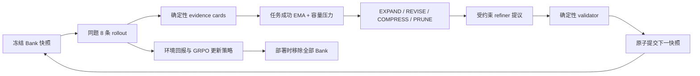

# PATS：把 Agent 技能改造成会随策略成熟而退场的训练脚手架

> **论文**：PATS: Policy-Aware Training Scaffolding for Agentic Reinforcement Learning  
> **作者**：Yipeng Shi、Zhipeng Ma 等（北京大学、腾讯）  
> **首次公开**：2026-07-23（arXiv:2607.21419v1）  
> **原文**：[arXiv 摘要页](https://arxiv.org/abs/2607.21419v1) · [PDF](https://arxiv.org/pdf/2607.21419v1)

## TL;DR

- **问题**：长程 LLM Agent 用 GRPO/RLVR 训练时，弱策略常把八条 rollout 都失败在同一处；成功/失败没有对比，组相对优势几乎没有学习信号。固定技能库虽能立刻提高成功率，却可能让后期 rollout 过于一致，反而削弱训练所需的结果差异。
- **方法**：PATS 把技能从「推理时长期检索的资产」重定义为**训练期、策略感知、可丢弃的脚手架**。每一轮先冻结脚手架、采样同题多条轨迹并用环境回报做标准 GRPO；随后将同组成功/失败压成 evidence card，由控制器按任务类型成功率 EMA 与容量压力选择扩展、修订、压缩或强制裁剪。
- **关键机制**：编辑器只能提议四类结构化操作；确定性校验器检查证据、重复、预算、方向和容量，新条目要有至少两张证据卡。编辑在本轮策略更新之后原子提交，只影响下一轮，因此不会污染产生当前 on-policy batch 的条件。
- **证据**：在 Qwen2.5 1.5B/7B 的 ALFWorld 与 WebShop 上，移除脚手架后，PATS 相对同尺度 GRPO 的 ALFWorld 成功率增益为 **12.9/17.6** 点，WebShop 成功率增益为 **3.5/18.6** 点；7B PATS 的 WebShop Score 为 **0.878**，WebShop 成功率 **76.2%**。七个检索问答基准平均 **45.2**，比保留技能库的 SkillRL（46.0）低 0.8 分，却少用 **32.1%** 评测 prompt token。
- **最有说服力的消融**：1.5B ALFWorld 的无脚手架部署分数为 **80.71±1.54%**；去掉在线脚手架降 **7.14** 点，逐轨迹而非逐组取证降 **6.66** 点，只会扩展降 **7.85** 点，去掉 `REVISE` 降 **12.62** 点；这支持「随残余失败修订」比只添加或删除更关键。
- **局限**：主要交互结论来自 ALFWorld、WebShop 与 Qwen2.5 两个尺度；支持移除诊断只含 16 个留出任务、两份 gamefile 的 24 条 oracle 轨迹，不能证明所有技能都被内化。训练还调用独立 7B 总结服务：一次审计的 1.5B 运行约 **180 H20 GPU-hours**、831 次 refiner 请求，部署虽省上下文，训练侧成本并不小。

## 研究问题：为什么「更会做」未必「更会学」？

### 长程 Agent 的瓶颈不是只有 reward

- 对同一具体任务，GRPO 通常取一组 (n) 条轨迹，二值环境 reward 为 (r_i)。若弱策略总是失败，​\(\sigma_r\) 接近 0；若静态指南使策略几乎全成功，​\(\sigma_r\) 同样收缩。
- 组归一化优势为：

\[
\hat A_i=\frac{r_i-\bar r}{\sigma_r+\epsilon_{std}},\qquad
\bar r=\frac1n\sum_{j=1}^{n}r_j.
\]

  这不是说低成功率或高成功率一定不好；论文的更精确命题是：**在策略当前能力附近，训练支撑应让可达的成功与仍有信息的失败同时出现**。
- 因而作者把优化对象从「哪条 skill 本身最好」移到「下一组 rollout 需要什么条件，才最可能给策略带来可辨别的更新」。这也是 PATS 与只追求技能检索质量、技能蒸馏或技能保留的分界线。

### 论文的论证路线

| Claim | Mechanism | Evidence | Boundary |
|---|---|---|---|
| 训练支撑应随策略变化 | 任务级控制器按成功 EMA 与容量压力选编辑模式 | Figure 1 的上下文先扩后缩；三种种子中模式从 `EXPAND` 走向 `REVISE`、`COMPRESS` | 动态并不自动等于因果最优，阈值为人工设定 |
| rollout 组比单轨迹更适合更新外部状态 | 成功/失败对照被压成 group evidence card，再按任务类型聚合 | 单轨迹取证比完整 PATS 低 6.66 SR 点 | 证据卡仍是 hand-designed summary，可能丢失关键信息 |
| 修订比单调增删重要 | `REVISE` 可更新、合并、替换已有条目 | 移除 `REVISE` 是控制器相关消融中最大下降：-12.62 点 | 结果限于 1.5B ALFWorld 的三种子设置 |
| 外部文本可在部署时移除 | SFT 先学习接口，在线阶段以环境回报训练；最终令 (z=\varnothing) | 主表 PATS 均在无 scaffold 条件汇报；移除差异很小 | 不等于逐条技能均已内化，也不等于换任务仍无帮助 |

## 方法：一份临时 Bank 如何与策略共同演化？

### 两条隔离的更新路径

任务 (q\sim\mathcal D) 属于类型 ​\(\tau(q)\)。轨迹为

\[
\xi=(q,o_1,a_1,\ldots,o_T,a_T),\qquad
J_{deploy}(\theta)=\mathbb E_{q,\xi\sim\pi_\theta(\cdot\mid q,\varnothing)}[r(\xi)].
\]

- 训练时 Bank ​\(B_k\) 有三层：跨任务通用原则 (B^{gen}\)、类型步骤 (B^{task}_{\tau}\)、常见错误及纠偏 (B^{mistake}\)。每项都带「可执行规则 + 适用条件」，而不是整段历史轨迹。
- 对类型 ​\(\tau\)，确定性 renderer 从冻结快照 ​\(\widetilde B_k\) 取有界视图 ​\(z_{\tau,k}\)，策略据此行动：

\[
a_t\sim\pi_{\theta_k}(\cdot\mid q,h_t,o_t,z_{\tau,k}).
\]

- 一轮的两个更新严格错开：

\[
\theta_{k+1}=\mathrm{RLUpdate}(\theta_k;\Xi_k,\widetilde B_k),\quad
B_{k+1}=\mathrm{ScaffoldUpdate}(B_k;\mathrm{Evidence}(\Xi_k),\{u_{\tau,k}\}).
\]

  所有本轮 rollout 读同一快照；证据来自本轮，但编辑只对下一快照生效。这一隔离避免「用刚生成的经验即时改 prompt，再把它算成同一 on-policy 数据」的时间泄漏。

```text
Input: policy πθ, empty/已有 Bank B, task batch
State: frozen snapshot B~, task EMA s̄τ, pressure p
for RL iteration k:
  sample 8 trajectories per task under B~
  build success/failure cards; update πθ with environment-reward GRPO
  for each represented task type τ:
    aggregate cards → cτ; choose mode from (s̄τ, p)
    refiner proposes JSON edit; validator accepts or logs no-op
    atomically commit accepted edit
  next iteration reads the new snapshot only
Output: πθ* deployed with B removed
```

### evidence card 不是自由反思文本

- 对同题 (q) 的 group ​\(G_{q,k}=\{\xi_{q,i}\}_{i=1}^n\)，卡片记录成功率、失败中反复出现的环境反馈、成功中更常见的动作模式，以及成功/失败代表轨迹；代表轨迹只保留观察、可执行 action 与环境反馈，排除模型 reasoning 文本。
- 形式上，卡片将成功/失败子集的确定性特征 ​\(\Phi\) 与代表选择器 ​\(Rep\) 一并封装：

\[
c_{q,k}=Card(q,\tau(q),s_{q,k},\Phi(G^+),\Phi(G^-),Rep(G^+),Rep(G^-)).
\]

- 然后同类型聚合 (c_{\tau,k}=Aggregate(\{c_{q,k}:\tau(q)=\tau\}))。奖励与 advantage 仍只由环境给出；卡片只服务于下一轮的训练状态编辑。这是一个值得肯定的可审计边界：外部 refiner 不直接替政策打分、不生成 agent action，也不进入 GRPO 梯度。

### 控制器：从「无助」到「拐杖」之间找区间

令任务类型成功率的 EMA 为

\[
\bar s_{\tau,k}=\alpha s_{\tau,k}+(1-\alpha)\bar s_{\tau,k-1},
\]

全局压力取条目与 token 两个预算使用率的最大值：

\[
p_k=\max\left(\frac{|B_k|}{N_{max}},\frac{Tok(B_k)}{L_{max}}\right).
\]

| 模式 | 触发条件 | 允许的干预 | 论证作用 |
|---|---|---|---|
| `EXPAND` | ​\(\bar s<\rho_r\) | 有上限地新增具体支持 | 让弱策略首次触到成功区域 |
| `REVISE` | ​\(\rho_r\le\bar s<\rho_c\) | 更新、合并、替换 | 对准已经变化的残余失败 |
| `COMPRESS` | ​\(\bar s\ge\rho_c\) | 非增量删减 | 逐步卸载冗余上下文 |
| `FORCED_PRUNE` | ​\(p\ge1\) | 只可减少 | 将硬容量当作安全阀，而非让 Bank 无限增长 |

正式 1.5B 配置最多 30 项、2,000 token；每次 review 最多 32 张卡，EMA 系数 0.1，阈值 ​\(\rho_r=0.30\)、​\(\rho_c=0.85\)。refiner 温度为 0、超时 120 秒，输出被限制为新增原则、新增错误、更新、删除四种 JSON 操作。新条目需要两张支持卡；更新/删除须指向既有项，随后再过长度、引用、重复、模式预算与容量检查。



## 实验：它是否在没有外部技能时仍然有效？

### 协议与可比性

- 交互环境为 ALFWorld 六类文字家务任务与 WebShop 500 个标准商品搜索目标；模型为 Qwen2.5-1.5B-Instruct、Qwen2.5-7B-Instruct。除消融外，先做 scaffold-interface SFT，再以每题 8 rollout 运行 150 个 GRPO step；环境结果以三随机种子标准差汇报。
- 最终 ALFWorld 固定评测 140 题、WebShop 500 goal，一题一轨迹，温度 0.4、最多 50 环境步。prompt/response 上限为 3,072/512 token。作者保留各方法原生 prompt renderer，故它是完整 pipeline 对比，而不是把同一 checkpoint 强行套入另一种 prompt。
- 搜索问答在 NQ、HotpotQA 训练后转移到五个域外集合。这里尤其应注意：Search-R1、ZeroSearch、EvolveR 是 SkillRL 论文报告数，不是本文本地复现；PATS、SKILL0 的可比强度更高。

### 主结果：性能与部署上下文共同看

| 模型 / 方法（无外部支持评测） | ALFWorld SR | ALFWorld token | WebShop Score | WebShop SR | WebShop token |
|---|---:|---:|---:|---:|---:|
| 1.5B GRPO | 67.86±3.50 | 14,723 | 0.731 | 52.80±1.66 | 13,451 |
| 1.5B PATS | **80.71±1.54** | **10,245** | **0.795** | **56.33±7.06** | **9,184** |
| 7B GRPO | 71.67±2.99 | 17,060 | 0.784 | 57.60±10.33 | 12,587 |
| 7B PATS | **89.29±1.01** | **10,455** | **0.878** | **76.20±3.12** | **8,721** |

- 1.5B/7B 的 ALFWorld 提升分别为 12.85/17.62 点；WebShop 成功率提升 3.53/18.60 点，且部署全轨迹 token 分别在 ALFWorld 少 30.4%/38.7%、WebShop 少 31.7%/30.7%。这不是靠额外检索把推理 prompt 堆长得到的数字。
- 对照 SkillRL 的含义必须拆开：7B SkillRL 保留技能时 ALFWorld 91.43%、WebShop 72.07%，但 token 为 29,933/17,763；无技能则为 84.76%、70.07%。PATS 的目标不是在每一个即时任务上胜过携带外部库的最强配置，而是在**无部署 Bank**下取得更高的性能/上下文效率组合。
- 七个检索问答集合中，PATS 平均 45.2、740 prompt token；SkillRL 为 46.0、1,090.1 token。结论应是「以 0.8 平均分换 32.1% 更少 prompt token 的竞争性折中」，不能写成全面超越。

## 消融、失败案例与图表证据

### Table 3：哪些部件真在起作用？

| 1.5B ALFWorld 变体（均无 scaffold 评测） | SR | 相对完整 PATS |
|---|---:|---:|
| PATS | 80.71±1.54 | 0.00 |
| 无训练脚手架 | 73.57±0.89 | -7.14 |
| 第 50 step 后冻结 | 77.14±4.77 | -3.57 |
| 单轨迹证据 | 74.05±9.04 | -6.66 |
| 仅 `EXPAND` | 72.86±8.81 | -7.85 |
| 无 `REVISE` | 68.10±6.45 | **-12.62** |
| SkillRL 式 55 条 warm start | 70.24±7.73 | -10.47 |
| 无接口初始化 | 47.86±3.29 | -32.85 |

- 接口初始化的 -32.85 点说明「把一块说明文字塞进 prompt」不足以让基础模型稳定使用架构化经验；但它也不是论文的主要创新，因为 SFT 数据沿用公开 SkillRL 格式。
- 静态库 warm start 最后低 10.47 点，而且标准差更大。这支持课程错配解释：已很完整的知识能改善当下行为，却未必为卸载后的策略提供最佳学习轨迹；不过该实验不能单独归因于「依赖」一种机制。
- `REVISE` 的最大下降是论文最核心的因果证据：在中期，正确操作往往不是继续增加文本，也不是立即删除，而是以新残余失败替换旧的条件化规则。

### Figure 1、Figure 4、Figure 16 各自证明什么？

- **Figure 1**：1.5B ALFWorld 的训练动态显示 PATS 上下文先增长后随验证成功率回落；SkillRL 的上下文单调增长，SKILL0 按固定阶段撤除。图支持的是「PATS 的控制并非预设单调退火」，不证明每一次编辑都最优。
- **Figure 4（受控移除）**：含 skill-band 的 RL 在 50 step 后，同一固定响应的有/无 band NLL 差从 0.1170 降至 0.0723（-38.3%）；无 band 成功率 22.97±6.39%，高于等预算 no-band 的 17.66±7.94%，重新加 band 为 34.38±7.35%。但作者自己限定：只 16 个留出任务、24 条来自两份 gamefile 的 oracle 轨迹，所以它是受控分布上的行为佐证，不是普适的「skill 内化证明」。
- **Figure 16（两种 replay）**：在一项取杯—加热—放回任务，无支持时 8/8 困在 take–place loop；最新 PATS scaffold 让 2/8 成功，静态库也能达 4/8，说明强支持并非总有害。另一项清洗土豆并放冰箱任务中，静态库用最短七步达 7/8 成功，但最新 scaffold 为 4/8，包含一条 42 步探索成功；二值 reward 标准差为 0.500，高于近乎解完的静态组 0.331。这里的结论是训练 signal 与即时效率可冲突，**不是**长轨迹天然更好。

## 相关工作中的位置判断

- PATS 与 Reflexion 式文本反思、长期记忆、检索 skill library 的共同点是使用语言化经验；不同点是它明确拒绝把 Bank 设为产品部署资产，训练结束即移除。
- 与 SkillRL 一类技能增强 RL 相比，它不为每条 skill 设计独立价值评估、筛选或蒸馏目标，而是把 Bank 当作调节采样分布的控制变量。其风险是可能低估了「可复用知识」本身的价值；因此作者用含/不含 test-time skills 的对照来避免把这两件事混在一起。
- 与简单 curriculum 或固定 withdrawal 相比，PATS 的独特性是按**任务类型的当前成功 EMA**修改语义内容，同时用全局容量压力限制增长。它仍是启发式 controller，尚未学习阈值或证明最优性。

## 证据边界、复现性与研究者应继续问什么

### 不能从本文推出的结论

- 不可推出「所有外部技能都应该删除」。静态库在固定策略 replay 的每个 checkpoint 都提高即时 SR、动作熵和状态覆盖，某些任务还给出更强 reward contrast；PATS 的说法是二者取决于能力阶段与任务。
- 不可推出「部署零额外成本等于系统总成本低」。一条审计的 1.5B 运行约使用 8 张 H20、22 小时 26 分、约 180 GPU-hours；7B 总结服务有 831 次请求、801 次成功，平均延迟 3.2 秒。训练期的服务可靠性、成本与供应链依赖应单列评估。
- 不可推出「安全」。可审计 JSON、确定性 validator 与原子提交能降低 prompt/refiner 失控的工程风险，却不验证 refiner 对环境模式的语义判断正确；证据卡压缩也可能系统性遗漏少见但严重的失败。

### 我认为最重要的后续实验

1. **跨模型与跨环境迁移**：在非 Qwen、真实浏览器/代码 agent、非二值或延迟 reward 环境中，比较固定阈值与学习型 controller，报告每种任务类型的失败分布而不只报总 SR。
2. **脚手架可信度审计**：对每次新增/修订项人工标注「证据充分、因果正确、无害但无效、误导」，衡量 card 压缩和 refiner 输出的错误率；尤其测试攻击性环境反馈或恶意工具输出会否诱导错误规则。
3. **训练—部署成本曲线**：将 180 GPU-hours、refiner token/调用、训练 wall-clock 与部署节省的 token、成功率并列；只有在多次部署或长生命周期 agent 上，训练侧开销才有可能被摊销。
4. **反事实移除协议**：不仅删完整 Bank，还应逐类删 general/task/mistake 条目、跨任务类型交换条目，并在未见任务上测量；这才能将「整体移除后仍好」与「具体知识真正被策略吸收」区分开。

PATS 最值得带走的不是「让 Agent 多写几条技能」，而是一个控制论视角：训练时的文本状态应服务于下一批可学习数据，而非天然服务于部署时的最短路径。真正的挑战在于把这个直觉扩展到更真实、更昂贵、也更容易受污染的 agent 环境，并用足够严格的审计证明它没有把短期成功误当成长期学习。

## 逐层拆解：每个设计为什么不是可有可无的装饰？

### 1. 冻结快照解决的是训练数据的时间一致性

- 在会修改 prompt 的在线 RL 系统里，最容易被忽略的风险是**条件漂移**：第 (k) 轮轨迹的 token 概率是在旧上下文下采样，若控制器依据同一批轨迹立刻替换上下文，再把新上下文解释成这批样本的条件，日志、重要性比和复现语义都会混乱。
- PATS 的顺序是先 `Snapshot(B)`，所有同轮任务共享 ​\(\widetilde B_k\)；随后用该轮轨迹同时做 GRPO 与证据抽取；只有策略更新之后才验证并提交 ​\(B_{k+1}\)。这让「哪份文本参与采样」「哪张卡解释编辑」「哪次编辑从何时开始生效」都可追溯。
- 这种隔离还把生成模型的职责缩小到提议结构化 edit。refiner 即使超时、服务失败、JSON 解析失败或越过 schema，系统也只记一次 no-op，策略训练不被中断。对长时间运行的 agent RL，这是比一次性高分更接近生产级的故障边界。

### 2. 任务类型聚合避免把偶然轨迹写进「知识」

- 单条轨迹可能因网页随机性、工具错误、采样温度或偶然分支失败。若它直接生成一条「永远不要这样做」的规则，Bank 会把噪声固化，并在后续所有任务中放大。
- PATS 先在**同一个具体任务**内对成功与失败分组，再以任务类型聚合。卡片并不存完整 chain-of-thought，而存可验证的环境动作—观察片段、无效动作统计、长度与重复模式；这使调试者可以在不暴露模型私有推理的情况下，审计一项规则是否有可观测依据。
- 论文没有声称该 summary 无损。恰恰相反，`Trajectory-wise evidence` 的 -6.66 点说明聚合有价值，但没有把不同 aggregation 函数、card 数量、代表轨迹选择偏差逐项系统比较；这是后续需要补上的有效性研究。

### 3. 容量压力使「压缩」成为一等公民

- 如果只跟踪成功率，最直接的控制策略总会在低分时继续增加条目；很快 prompt 变长，模型注意力稀释，且部署时撤除的分布偏移更大。PATS 用 ​\(p_k\) 将条目数和 rendered token 的任一饱和都视为压力，因此 (p\ge1) 时即使成功率仍低也必须 `FORCED_PRUNE`。
- 这体现了一项工程判断：训练辅助状态不能无限制增长。正式配置把 Bank 限为 30 条、2,000 token，retrieval 又只取 4 条 task skill、3 条 general skill、3 条 mistake；因此论文的效果不是「把所有历史塞进上下文」。
- 但硬阈值也带来脆弱性：不同 tokenizer、语言、工具 API 描述长度会改变 token 压力，固定 30/2,000 未必能迁移。更合理的扩展是把预算视为动态资源，按预期 advantage 增益、模型上下文位置与延迟共同分配。

### 4. 接口 SFT 与在线 scaffold adaptation 必须分开解释

- 作者先以公开的 SkillRL-format 数据训练模型读懂「原则、条件、错误修正」这类块状接口。该阶段的目标是

\[
L_{SFT}(\theta)=-\mathbb E_{(x,z,y)}\left[\sum_{t=1}^{|y|}\log\pi_\theta(y_t\mid x,z,y_{<t})\right].
\]

  它不生成 Bank、不过滤条目、更不学习 controller；它只建立 `z` 能影响 action 的语义通道。
- 之后的 improvement 才来自环境 reward 的 clipped GRPO。对 token (y_{i,\ell})，重要性比 ​\(\rho_{i,\ell}\) 仍相对旧策略计算，KL 正则相对固定参考模型；脚手架只是因果上下文的一部分，不是额外 reward 或可微参数。
- 无初始化时的 47.86% 与完整方法的 80.71% 差距很大，说明论文的 end-to-end 结论应读作「**接口初始化 + 策略感知在线脚手架**的系统结果」。将全部收益归因给动态 controller 会过度解读；作者的固定初始化消融正是在缩小这一混淆。

## 用两个反事实案例检验论文直觉

### 案例 A：弱策略需要一条可达的成功路径

- 目标是从冰箱取杯、用微波炉加热、再放回冰箱。无支持时八条轨迹都在 take–place loop，reward 无对比；最新 scaffold 让其中 2/8 抵达成功，静态技能库为 4/8。
- 这时 PATS 的说法不是「静态技能坏」，而是承认静态库也在打开新行为空间。若没有任意成功样本，动态修订也没有可靠的正向参照；`EXPAND` 的价值首先是跨过完全失败的可达性门槛。
- 对实际 browser agent，这对应早期 onboarding：应给格式、权限和关键 tool sequence 的显式约束；只靠 sparse 成功 reward 往往无法学习首个正确调用链。

### 案例 B：即时最短路径可能减少后续可辨别性

- 清洗土豆并放入冰箱时，静态库用七步路径达到 7/8 成功，显然是即时推理的更优方案；最新 PATS scaffold 只有 4/8，却包含一条 42 步的探索成功。
- 对二值 reward，近乎全成功的静态组标准差为 0.331，而 PATS 组为最大可能值 0.500。若学习算法依赖同组相对比较，后者在那一轮可能提供更分明的更新方向。
- 但这绝不是鼓励无效探索：42 步路径对部署完全不可取，且单个案例不能证明更高方差带来更高长期回报。它只提供了一个必要的反事实：**评估训练支撑时不能只看当前 SR 或最短轨迹**。

## 对评测数字的审稿式检查

| 检查点 | 论文已做的处理 | 仍应谨慎之处 |
|---|---|---|
| 评测时是否藏有外部上下文 | headline PATS 删除 scaffold；另列支持条件作 removal diagnostic | 原生 renderer 不同，无法分离 prompt 格式与完整训练管线的影响 |
| 随机性 | ALFWorld/WebShop 的主要 RL 对比三种子，报告标准差 | WebShop 部分类别样本很小，例如 Beauty 19、Accessories/Electronics 各 10，分类均值不应当作独立显著结论 |
| 训练预算 | 同尺度主对比匹配 RL step、group size、interaction limit、评测任务 | 不同系统的 SFT、refiner 与工程实现成本并未被统一 wall-clock/美元预算匹配 |
| 外部 baseline | 明确标记 Search-R1、ZeroSearch、EvolveR 为引用结果 | 跨论文协议、检索器、语料和 tokenizer 可能不一致，45.2 对 46.0 不宜作细粒度胜负宣称 |
| 依赖性诊断 | 移除前后主指标变化小；另有固定 NLL 对照 | NLL 轨迹覆盖有限，且重新加 band 仍把成功升到 34.38%，表明外部支持仍有边际价值 |

### WebShop 分类结果如何正确阅读？

- 7B PATS 的 All SR 为 76.2，优于 GRPO 57.5、RLOO 72.7、含测试技能的 SkillRL 72.1；All Score 0.878 同样最高。服装类 SR 为 81.3、Home 72.9、Other 74.9 是主要贡献面。
- 但 Beauty 只有 19 个目标，PATS SR 51.2 低于 RLOO 71.4；Electronics 仅 10 个目标，PATS 87.2 低于 GRPO 88.5。论文附录已将这些说成描述性数值，而不是分类级统计结论；报告中不应把 All 平均包装成「每一类别稳定获益」。
- 这也提示动态脚手架可能需要不同类型的预算：稀少类别的 EMA 噪声大，若同样以 ​\(\rho_r=0.30\)、​\(\rho_c=0.85\) 触发，controller 可能因样本不足误切模式。

## 安全、可观测性与实施边界

### 这套架构在哪些地方有安全价值？

- **最小能力面**：refiner 不执行 agent action、不能直接修改 policy 参数、只能输出四种受限对象；validator 才拥有 commit 权。这比让一个大模型自由重写 system prompt 或记忆库更容易施加最小权限。
- **可重放性**：冻结快照、证据卡、任务类型、模式选择、提议、校验结果与 commit 版本都可成为 audit trail。安全团队可以抽查「这条错误规则来自哪几次环境反馈」而不必只相信一次模型总结。
- **故障降级**：服务调用失败时跳过 edit、保留上一快照，避免训练控制平面因为一次外部模型不可用而把整个 RL job 中断或写入半成品状态。

### 它仍没有自动解决的攻击面

1. **环境投毒**：若工具输出、网页文本或任务观察被攻击者控制，攻击者可反复制造看似相关的失败模式，诱导 card 支持一条错误、甚至有害的规则。schema 检查无法判断语义真伪。
2. **跨任务污染**：general entry 可影响多个任务类型；task-type aggregation 降低了单轨迹噪声，却可能把一个错误的通用归纳扩散得更广。应有 entry scope、来源信誉与回滚机制。
3. **外部服务依赖**：独立 7B summary service 的版本、日志保留、超时重试和输入内容都是供应链与数据治理问题。论文记录调用量，但没有对 prompt 注入、敏感轨迹外传或服务模型替换做压力测试。
4. **指标诱导**：成功 EMA 与容量压力是控制信号；若环境 reward 可被投机，controller 会用错观测去压缩或扩展。真实系统需要将安全约束、成本、违规率和人类复核纳入状态，而非只用成功率。

## 可复现清单：复做前应固定哪些变量？

- 固定任务 split、WebShop 的 `seed=0` 与 500 goal、ALFWorld 140 评测任务；训练与评测分别记录温度、top-p、最大生成 token、环境步数、历史长度。
- 固定 8 rollout/group、150 RL step、KL 系数 0.01、​\(\gamma=0.95\)、invalid-action penalty 0.1；并在每五 step 记录验证、每十 step 保存 checkpoint。
- 导出每一个 Bank snapshot、renderer 选择的条目、card 的成功/失败计数、refiner 原始 JSON、validator 拒绝理由以及原子 commit 的版本号。没有这些记录，就无法验证「策略感知」而只能看到最终分数。
- 分开报告训练 prompt token、refiner 输入/输出 token、GPU 时间、服务失败率与部署 prompt token。把 740 evaluation prompt token 与 180 GPU-hours 混成一个「效率」指标会掩盖真正的成本结构。
- 做至少四种 deployment 对照：无 Bank、完整 Bank、只保留 general、只保留 task/mistake；并针对未见任务、不同 reward 密度与恶意工具输出测试。这样才能判断脚手架是在训练中塑形，还是只是在原分布上留下可移除的捷径。
