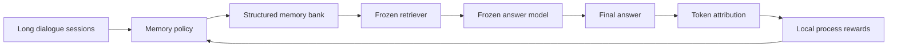

# AttriMem：把最终答案的证据贡献，反推给 Agent 记忆写入过程

| 项目 | 信息 |
| --- | --- |
| 论文 | AttriMem: Attribution-Guided Process Feedback for Agent Memory Learning |
| 作者 | Qinfeng Li, Yuntai Bao, Xinyan Yu, Hongze Chen, Wenqi Zhang, Xuhong Zhang |
| 机构 | Zhejiang University |
| 版本 | arXiv:2607.21106v1，2026-07-23 提交 |
| 方向 | 大模型 Agent / 长程记忆 / 后训练强化学习 |
| 原文 | https://arxiv.org/abs/2607.21106 |
| HTML | https://arxiv.org/html/2607.21106v1 |
| PDF | https://arxiv.org/pdf/2607.21106v1 |

### TL;DR

- **这篇论文做什么**：AttriMem 研究 LLM Agent 的长期记忆构造问题，目标不是改回答模型，而是训练一个“记忆构造策略”，让它在多轮会话持续积累时决定哪些信息要抽取、写入、更新、合并、压缩或丢弃。
- **为什么重要**：现有启发式记忆方法依赖人工规则，容易把“看起来重要”的信息存进去，却不一定服务下游任务；现有 RL 记忆方法多用最终答案或整条动作的奖励，知道任务成败，却不知道哪一段记忆内容真的支撑了最终答案。
- **核心机制**：AttriMem 把最终答案当作 credit-assignment 目标，用 ContextCite 式随机遮蔽估计每个记忆 token 对答案分数的贡献，再把 token 贡献汇总回产生该内容的记忆动作，形成局部 process reward。
- **训练框架**：论文沿用 Qwen3-4B、四类记忆模块、SFT warmup 与 GRPO-based RL；检索器和 answer model 固定，不参与优化，因此性能变化主要归因于记忆构造策略变好。
- **关键结果**：在 LoCoMo、LongMemEval、PerLTQA 上，`AttriMem + SFT + RL_Tok` 分别达到 82.48、83.25、84.49，超过最接近的 MemBuilder + SFT + RL 的 80.01、81.75、83.74。
- **消融证据**：token-level reward 比 outcome-only 和 action-level attribution 更强；无 SFT 时 `RL_Tok` 对三个 benchmark 分别比 base 提升 4.17、5.50、2.26 分，带 SFT 后继续提升 2.97、3.00、2.97 分。
- **过程质量证据**：GPT-based judge 认为 AttriMem 的中间记忆输出优于 MemBuilder，三项 win rate 为 73.91%、72.94%、77.78%；训练曲线也显示 token-level attribution 更平滑。
- **局限**：方法依赖 attribution 质量；当前只适合文本可 token 化的记忆输出；训练需要额外随机遮蔽与长程 RL 计算，作者报告 4 张 H800 上 SFT 约 30 小时、RL 约 5 天；代码和 checkpoint 仍标注为接收后发布。

### 1. 研究问题：Agent 记忆到底该学什么？

这篇论文的切入点很窄，但抓得很准：

- 许多 Agent 论文把“记忆”当成一个检索模块。
- AttriMem 把记忆看成一个**持续决策过程**。
- 这个过程每遇到一段新会话，都要回答几个局部问题：
  - 哪些事实值得写进 core memory？
  - 哪些事件要进入 episodic memory？
  - 哪些实体关系要沉淀成 semantic memory？
  - 哪些工作流程要变成 procedural memory？
  - 哪些旧内容应被合并、更新、压缩或删除？

作者真正关心的不是“向量库是否能召回”，而是：

> 当未来问题尚未出现、推理路径也不确定时，怎样训练一个策略，让它提前构造更有用的外部记忆？

这个问题比普通 RAG 更难，原因在于：

- RAG 多半在提问时检索已有上下文。
- 长期记忆系统要在提问前不断改写外部状态。
- 一次错误写入可能不会立刻暴露，却会在几十轮之后影响答案。
- 最终答案错了，也不能直接说明是哪次写入、哪个字段、哪个 token 出了问题。

### 2. 现有方法的缺口：奖励太粗，规则太主观

论文用 Table 1 把现有记忆学习范式拆成四类：

| 范式 | 是否从任务学习 | 是否有过程反馈 | 是否有额外奖励信号 | 是否到 token 级 |
| --- | --- | --- | --- | --- |
| Heuristic Memory | 否 | 无 | 无 | 否 |
| Task-Performance RL | 是 | 否 | 否 | 否 |
| Outcome-Redistribute Rewards | 是 | 是 | 否 | 否 |
| QA-Derived Action Rewards | 是 | 是 | 是 | 否 |
| AttriMem | 是 | 是 | 是 | 是 |

这里的关键不是“AttriMem 又多了一列打勾”，而是监督信号的语义变了：

- **启发式方法**：
  - 依赖人工规则写记忆。
  - 规则可能在一个任务有效，在另一个任务变成噪声。
  - 例如“用户偏好都要写入”听起来合理，但长期问答可能只需要特定时间、地点、关系或数量。
- **Outcome-only RL**：
  - 用最终答案正确与否训练记忆策略。
  - 它能告诉策略“这一整条轨迹最后成功/失败”。
  - 但它不能告诉策略“第三轮写下的那个时间戳有用，第四轮添加的闲聊偏好没用”。
- **Outcome redistribution**：
  - 把最终奖励沿树或轨迹往前分配。
  - 但本质仍是重分配同一个最终标量。
  - 它没有引入关于具体记忆内容的新证据。
- **QA-derived action reward**：
  - 用额外 QA 检查 memory bank 是否有用。
  - 这比 outcome-only 更密，但粒度仍然停在动作或整段输出。
  - 如果一个 memory action 里只有一个日期、一个金额或一个人名真正有用，action-level reward 仍然太粗。

AttriMem 的主张是：

- 记忆学习不是只缺更多奖励。
- 它缺的是**把最终答案依赖的证据，定位回中间记忆内容**。
- 定位越细，策略越能学会“该保留什么、该删除什么、该如何写得更可检索”。

### 3. 任务建模：优化的是记忆构造，不是回答模型

论文把任务设定为长期对话问答：

$$
\mathcal{H}=\{h_t\}_{t=1}^{T}
$$

变量含义：

| 符号 | 含义 |
| --- | --- |
| $\mathcal{H}$ | 完整历史，由 T 个 session 组成 |
| $h_t$ | 第 t 个多轮会话 session |
| $q$ | 历史结束后提出的问题 |
| $\mathcal{M}_t$ | 处理到第 t 个 session 后的外部记忆库 |
| $a_t^{mem}$ | 第 t 步记忆构造动作 |
| $\Delta \mathcal{M}_t$ | 这次动作产生或修改的文本记忆内容 |
| $\hat{y}$ | 固定检索与回答接口生成的答案 |

记忆轨迹被写成：

$$
\tau^{mem}=\{(h_t,\mathcal{M}_{t-1},a_t^{mem},\Delta \mathcal{M}_t)\}_{t=1}^{T}
$$

这个公式的意义是：

- 训练对象不是“回答问题”的动作。
- 训练对象是每个 session 到来时如何更新 memory。
- 检索器和回答模型只负责把 memory 的质量转化成可评估的最终答案。

论文使用的四类记忆模块也很重要：

| 记忆类型 | 记录对象 | 典型价值 | 风险 |
| --- | --- | --- | --- |
| Core memory | 用户身份、偏好、关系 | 稳定画像 | 容易写入过时偏好 |
| Episodic memory | 带时间戳事件 | 回答时间相关问题 | 容易丢失顺序和日期 |
| Semantic memory | 用户相关实体事实 | 支持实体关系推理 | 容易混淆同名实体 |
| Procedural memory | 步骤与工作流 | 复用流程知识 | 容易把偶然流程固化 |

所以，AttriMem 的“memory policy”并不是一个简单摘要器。它是一个多模块、多动作、跨时间的外部状态控制器。

### 4. 方法机制：从最终答案反推 token 贡献

AttriMem 的方法可以拆成四步：

1. 当前策略 $\pi_\theta$ 处理历史会话，生成一条记忆构造轨迹。
2. 固定 retriever 从最终 memory store 中取证据，固定 answer model 生成答案 $\hat{y}$。
3. 对 memory token 做随机遮蔽，估计每个 token 对答案分数的边际贡献。
4. 把 token 贡献汇总成对应 memory action 的 process reward，并加入 GRPO advantage。

论文采用 ContextCite 风格的 attribution。核心近似是：

$$
\phi(z_i,y;c)\approx F(y|c)-F(y|c\setminus z_i)
$$

解释如下：

| 符号 | 解释 |
| --- | --- |
| $c$ | attribution context，即用于生成答案的上下文 |
| $z_i$ | 上下文中的一个 source；AttriMem 中可细到单个 memory token |
| $y$ | 已生成的答案 |
| $F(y|c)$ | 在完整上下文下答案的分数 |
| $F(y|c\setminus z_i)$ | 移除某个 token 后答案的分数 |
| $\phi$ | 该 token 对答案的贡献估计 |

直觉很简单：

- 如果遮掉某个 token 后，答案分数明显下降，这个 token 就可能是关键证据。
- 如果遮掉后答案几乎不变，这个 token 可能是冗余背景。
- 如果遮掉后答案反而更好，这个 token 可能是噪声或误导信息。

为了避免逐 token 单独遮蔽带来不可承受的计算量，论文用随机 ablation：

- 每个 token 以 1/2 概率保留。
- 采样 32 个 ablated variants。
- 用一个轻量线性 attribution model 近似每个 token 的贡献。
- 这些 variants 可以批量并行评估，因此墙钟延迟约等于一次 batched forward pass。

### 5. 奖励设计：不是辅助奖励，而是 credit assignment

AttriMem 的 GRPO 目标不是只看最终 answer reward。论文把每个 memory action 的 advantage 写成：

$$
\hat{A}_{i,t}=\hat{A}^{out}_{i}+\lambda \hat{A}^{proc}_{i,t}
$$

其中：

| 项 | 含义 |
| --- | --- |
| $\hat{A}^{out}_{i}$ | 第 i 条 memory trajectory 的组内 outcome advantage |
| $\hat{A}^{proc}_{i,t}$ | 第 i 条轨迹第 t 个 memory action 的过程 advantage |
| $\lambda$ | 过程信号权重 |
| $\rho_{i,t}$ | 当前策略与旧策略在该 memory action 上的概率比 |

过程奖励的核心计算是：

$$
r_t=\frac{1}{\sqrt{l_t}}\sum_{j=1}^{l_t}\phi((\Delta \mathcal{M}_t)^{(j)},\hat{y};c)
$$

这一步有两个设计点：

- **汇总 token 贡献**：
  - 每个 memory action 产生一段文本 $\Delta \mathcal{M}_t$。
  - 这段文本被拆成 $l_t$ 个 token。
  - 每个 token 都有一个 attribution score。
  - 该 action 的奖励是这些贡献的归一化和。
- **长度归一化**：
  - 使用 $1/\sqrt{l_t}$ 缓解长 memory update 天然拿到更多贡献总和的问题。
  - 这不是彻底解决 verbosity bias，但至少避免“写得越长越容易有正贡献”的明显偏置。

作者特别强调：

- AttriMem 不只是“加了一个辅助奖励”。
- 它把最终答案里的支持证据追踪回中间记忆内容。
- 因而它提供了 outcome signal 不可能提供的信息。

这一区别很关键。Outcome-only RL 即使被沿轨迹重分配，仍然无法知道“正确答案里的出发时间来自哪条 episodic memory”。AttriMem 则尝试直接回答这个 credit question。

### 6. 算法流程：训练时的闭环长什么样？

下面把论文机制改写成伪代码：

```text
Input:
  D: long-horizon dialogue QA training set
  pi_theta: memory-construction policy
  pi_old: rollout policy
  Ret: frozen retriever
  G: frozen answer generator
  R_out: final answer reward function
  Phi: token-level context attribution method
  lambda: process reward weight

State:
  M_t: external memory store after session t
  tau_i_mem: sampled memory-construction trajectory
  DeltaM_i_t: textual memory content produced by action a_i_t_mem

Loop over training examples (q, H):
  Sample G memory trajectories with pi_old
  For each trajectory i:
    Build final memory store M_T
    Retrieve evidence Ret(q, M_T)
    Generate answer y_hat_i = G(q, Ret(q, M_T))
    Compute outcome reward R_out_i

  Normalize outcome rewards within the group

  For each trajectory i and memory step t:
    Split DeltaM_i_t into tokens
    Sample random token masks over the attribution context
    Estimate token contribution Phi(token, y_hat_i, context)
    Aggregate token contributions into local reward r_i_t
    Normalize r_i_t into process advantage A_proc_i_t
    Set A_i_t = A_out_i + lambda * A_proc_i_t

  Update pi_theta with GRPO clipped objective and KL regularization

Output:
  A memory-construction policy that writes more answer-supporting memory

Failure boundary:
  If attribution misidentifies supporting tokens, local reward may reinforce noisy memory.
  If memory is latent/vector/graph rather than text records, token attribution no longer aligns directly.
```

这个伪代码说明了论文最重要的工程边界：

- AttriMem 训练的是 memory construction policy。
- Answer model 和 retriever 固定。
- attribution 发生在训练期。
- 推理时不一定需要继续做随机遮蔽。
- 训练成本换来的是更好的记忆写入策略，而不是每次回答时额外推理。

### 7. Figure 1：方法图到底说明了什么？


Figure 1 的证据作用可以分成三层：

| 图中层次 | 含义 | 对论文主张的支撑 |
| --- | --- | --- |
| 长期对话输入 | 信息跨 session 分布 | 说明 memory 不是单轮摘要任务 |
| 结构化 memory bank | extraction、compression、update 后形成外部状态 | 说明策略优化目标是写 memory，而不是直接答题 |
| attribution reward | 从最终答案回看中间 token | 说明 AttriMem 的新信号来源 |

这张图最值得注意的是箭头方向：

- 普通 memory 系统多是“历史到 memory，再到答案”的前向管线。
- AttriMem 在训练时加入一条反向 credit 路径。
- 最终答案不只评价整条轨迹，也反过来标注哪些中间记忆内容有用。

从 Agent 系统角度看，这接近一个“可学习的外部状态写入控制器”：



这也是它和简单摘要器的差异：

- 摘要器优化的是压缩后的可读性。
- RAG 优化的是检索时相关性。
- AttriMem 优化的是“写入时的未来答案贡献”。

### 8. 实验设置：为什么说比较相对受控？

论文的主实验设置有几个控制点：

| 组件 | 设置 |
| --- | --- |
| 训练数据 | LongMemEval |
| 迁移评测 | LoCoMo、PerLTQA |
| 主要指标 | accuracy |
| 训练骨干 | Qwen3-4B |
| 训练流程 | 3,000 SFT steps + 400 RL steps |
| RL 算法 | GRPO |
| 对照方法 | RAG-Session、RAG-Utterance、Mem0、MIRIX、MemoryOS、A-Mem、LightMem、GAM、Memory-R1、Mem-T、MemBuilder |
| answer model 对照 | Claude 4.5 Sonnet、GPT-4.1、Qwen3-4B Base、Qwen3-4B Ours |

最重要的公平性处理是：

- MemBuilder 是最接近的方法。
- 两者都用 Qwen3-4B。
- 两者都经历 SFT warmup 与 GRPO RL。
- SFT 初始化、优化预算、共享超参数、检索回答接口、解码配置和评价协议保持一致。

这意味着：

- 如果 AttriMem 比 MemBuilder 好，不能简单归因于换了更强 backbone。
- 更合理的解释是 token-level attribution reward 改变了 RL 的信用分配。
- 当然，这仍不等于证明 attribution 是唯一原因，因为训练实现细节、prompt、数据预处理仍可能影响结果。

### 9. 主结果：AttriMem 的提升来自哪里？

Table 2 给出的核心结果如下：

| 方法 | LoCoMo | LongMemEval | PerLTQA |
| --- | ---: | ---: | ---: |
| RAG-Session | 70.35 | 66.75 | 79.21 |
| RAG-Utterance | 74.87 | 69.00 | 77.23 |
| MIRIX | 77.48 | 73.25 | 83.11 |
| LightMem | 80.53 | 63.50 | 80.30 |
| GAM | 79.50 | 73.25 | 81.59 |
| MemBuilder + SFT + RL | 80.01 | 81.75 | 83.74 |
| AttriMem + SFT + RL_Tok | **82.48** | **83.25** | **84.49** |

这里能读出三点：

- **第一，AttriMem 不是只在训练域有效**：
  - 训练数据是 LongMemEval。
  - LoCoMo 和 PerLTQA 是 zero-shot transfer。
  - AttriMem 在两个迁移集也拿到最高或很强表现。
- **第二，提升幅度不夸张但稳定**：
  - 相对 MemBuilder + SFT + RL，分别高 2.47、1.50、0.75 分。
  - 这不是数量级突破。
  - 但在已很强的 memory baseline 上，三项一致提升说明信号方向较稳。
- **第三，SFT 和 RL 互补**：
  - AttriMem base 是 67.88、55.75、78.32。
  - 只加 SFT 到 78.40、80.25、81.52。
  - 再加 token-level RL 到 82.48、83.25、84.49。
  - RL 不是简单重复 SFT imitation，而是继续优化记忆构造。

Table 3 进一步检查 answer model：

| Answer model | LoCoMo | LongMemEval | PerLTQA |
| --- | ---: | ---: | ---: |
| Claude 4.5 Sonnet | 82.48 | 83.25 | 84.49 |
| GPT-4.1 | 80.41 | 82.00 | 82.18 |
| Qwen3-4B Base | 76.69 | 65.00 | 80.46 |
| Qwen3-4B Ours | 77.64 | 78.75 | 82.61 |

这张表说明：

- AttriMem 的 memory store 不只适配一个 answer model。
- 更强 answer model 仍能从更好的 memory construction 中获益。
- 但当 answer model 较弱时，memory improvement 不能完全弥补回答能力差距。
- 这对真实 Agent 系统很现实：memory policy 和 reader model 是两个瓶颈。

### 10. 消融：token 级奖励为什么比 action 级更强？

Table 4 是论文最直接的机制证据：

| 方法 | LoCoMo | LongMemEval | PerLTQA |
| --- | ---: | ---: | ---: |
| Ours Qwen3-4B | 67.88 | 55.75 | 78.32 |
| + RL_Out | 70.19 | 58.25 | 79.61 |
| + RL_Act | 71.10 | 59.75 | 79.98 |
| + RL_Tok | **72.05** | **61.25** | **80.58** |
| + SFT + RL_Out | 79.46 | 81.50 | 83.69 |
| + SFT + RL_Act | 81.32 | 82.00 | 84.05 |
| + SFT + RL_Tok | **82.48** | **83.25** | **84.49** |

结果支持一个递进判断：

- outcome-only 比 base 好，说明任务反馈本身有用。
- action-level attribution 比 outcome-only 好，说明过程反馈有用。
- token-level attribution 比 action-level 更好，说明细粒度内容定位继续提供增量。

这个消融和论文主张直接对齐：

- 如果记忆动作整体都好或都坏，action-level reward 就够了。
- 但长期记忆常常是一段输出里夹杂关键事实和噪声。
- 例如一条 episodic memory 同时包含“用户周二去杭州”“顺便聊了咖啡店”“会议从 14:00 改到 15:30”。
- 下游问题可能只依赖 15:30。
- action-level reward 无法告诉策略应保留哪个字段。
- token-level attribution 则有机会把 credit 放到时间、地点、数量、人名等关键 span 上。

### 11. Figure 2：案例证据显示了什么？


Figure 2 不是主指标图，但对理解机制很有帮助：

- MemBuilder 对整个输出给一个整体奖励。
- AttriMem 给具体事实片段更细的奖励。
- 论文描述的案例中，AttriMem 更好保留了时间、时长、数量等答案关键事实。
- MemBuilder 则出现遗漏 commute details、把“三本书两个月”改成“三本书每月”等错误。

这张图支撑的是**局部可修正性**：

- 记忆输出里不是每个词都同样有用。
- 有些词是答案证据。
- 有些词是背景。
- 有些词甚至会诱导错误归纳。

对于长期 Agent 记忆，这是一个很实际的点：

- 系统不只要“记得多”。
- 也不只要“记得短”。
- 它要记得足够具体，尤其是时间、数量、实体和因果关系。

### 12. 中间过程质量：不是只把 benchmark 刷高

论文还用 GPT-based judge 检查中间记忆输出合理性。Table 5 报告 AttriMem token-level 方法对比其他方法的 win rate：

| 对比 | LoCoMo | LongMemEval | PerLTQA |
| --- | ---: | ---: | ---: |
| Ours_Tok vs MemBuilder | 73.91 | 72.94 | 77.78 |
| Ours_Tok vs Ours_Out | 61.11 | 68.05 | 71.43 |
| Ours_Tok vs Ours_Act | 58.97 | 61.76 | 61.80 |

评价协议包括：

- 输入完整原始对话。
- 输入问题。
- 输入 gold answer。
- 输入两个系统在 extraction、compression、retrieval 等阶段的中间输出。
- 隐藏方法名称。
- 交换 A/B 顺序评两次，最后平均。

这个设计不能完全消除 judge bias，但比只看最终 accuracy 多了一层证据：

- AttriMem 不只是让最终答案碰巧更准。
- 它的中间记忆过程也更常被判为合理。
- 这支持“token-level process reward 改善了 memory construction behavior”。

### 13. Figure 3/4：稳定性与效率边界

论文对训练动态和效率做了进一步分析：

- Figure 3 显示 token-level attribution 的奖励曲线更平滑，训练中段进入高奖励区后保持稳定。
- MemBuilder 早期 plateau，约 step 320 附近才出现 sharp surge。
- 这说明更细的 process signal 可能降低 RL 优化等待最终稀疏反馈的难度。


Figure 4 关注 LoCoMo 上的性能和平均端到端 token 消耗：

- AttriMem 处于 Pareto frontier。
- 它以接近 MemBuilder 的 token 成本取得更高 accuracy。
- 相比 Mem-T 和 GAM，它用更少 token 达到更好性能。
- A-Mem token 更少，但 accuracy 明显低。

这点对 Agent 工程有实际含义：

- memory 方法不能只看 accuracy。
- 如果每次问答都需要极长上下文，系统成本、延迟和隐私暴露都会上升。
- 好的 memory policy 应该把“可回答性”和“上下文预算”一起优化。

### 14. 相关工作位置：AttriMem 站在哪里？

AttriMem 可以放在三个研究交叉点上看：

| 方向 | 典型问题 | AttriMem 的位置 |
| --- | --- | --- |
| Agent memory | 如何构造长期外部状态 | 把写入、更新、压缩变成可训练策略 |
| RL for agents | 如何处理长程稀疏奖励 | 用 attribution 把最终答案 credit 拆到过程 |
| Process reward | 如何监督中间步骤 | 从文本 token 贡献构造局部奖励 |

它和几类方法的差异如下：

- **相对传统 RAG**：
  - RAG 强调提问时检索。
  - AttriMem 强调历史到来时如何写记忆。
- **相对 MemBuilder**：
  - MemBuilder 用 QA 派生动作级奖励。
  - AttriMem 进一步定位到 action 内部 token。
- **相对 Mem-T**：
  - Mem-T 重新分配最终奖励。
  - AttriMem 引入答案贡献这个额外信息源。
- **相对 AutoMem / Agentic Memory 一类近期工作**：
  - 它不强调让 Agent 自己拥有更宽泛的 memory action 工具箱。
  - 它聚焦在“已有记忆构造管线中，怎样给过程更细的 credit”。

因此，AttriMem 的贡献不是提出全新 memory architecture，而是提出一个更具体的训练信号：

- 最终答案可以作为反向证据目标。
- 中间记忆内容可以被 attribution。
- attribution 可以转化成 RL process reward。

### 15. 证据边界：哪些结论已经证明，哪些还没证明？

可以把论文证据分成三层：

| 结论 | 证据强度 | 说明 |
| --- | --- | --- |
| token-level reward 优于 outcome/action-level reward | 强 | Table 4 直接消融 |
| AttriMem 优于 MemBuilder 等 memory baseline | 较强 | Table 2 三个 benchmark 一致提升 |
| 中间记忆过程更合理 | 中 | GPT-based judge 支持，但仍是模型评审 |
| 训练更稳定 | 中 | Figure 3 曲线支持，但缺少多随机种子细节 |
| 推理 token 效率更好 | 中 | Figure 4 支持 LoCoMo 上 Pareto frontier |
| 可泛化到所有 Agent 任务 | 弱 | 当前主要是长期对话 QA |
| 可泛化到非文本记忆 | 弱 | 作者明确说需要额外 alignment |

作者在 Discussion 里承认三个重要限制：

- **计算开销**：
  - attribution 需要随机遮蔽 variants。
  - 作者认为可并行，所以墙钟开销约为一次 batched forward pass。
  - 但整体训练仍不轻，附录报告 SFT 约 30 小时、RL 约 5 天。
- **依赖 attribution 质量**：
  - 如果 attribution 错把噪声当证据，RL 可能强化错误写法。
  - 长上下文下这种风险更明显。
  - 作者认为 outcome reward 可互补约束，但没有系统攻击实验。
- **文本 token 假设**：
  - 当前方法要求中间 memory output 是文本记录。
  - latent memory、vector memory、graph memory 需要额外映射。
  - 这限制了它对更复杂 Agent 状态系统的直接适用性。

### 16. 可复现性：现在能复现到什么程度？

论文给出了一些可复现信息：

| 项 | 信息 |
| --- | --- |
| Backbone | Qwen3-4B |
| SFT learning rate | 5e-7 |
| RL learning rate | 1e-6 |
| SFT batch size | 32 |
| RL effective batch size | 256 |
| GRPO group size | 8 |
| SFT steps | 3000 |
| RL steps | 400 |
| Max sequence length | 6000 |
| 硬件 | 4 x NVIDIA H800 80GB |
| 训练时间 | SFT 约 30 小时；RL 约 5 天 |

但还不能说完全可复现：

- 论文称代码和 trained checkpoints 会在接收后发布。
- 当前 arXiv 页面没有直接给出官方 GitHub 仓库。
- LongMemEval、LoCoMo、PerLTQA 是公开数据集，但完整训练管线仍需要作者代码、prompt、预处理和 attribution 实现细节。

因此，本文结论适合作为方法机制和结果证据参考，但短期内还不能当作可直接运行的工程组件。

### 17. 对 Agent 系统的启发：记忆不是日志，而是可训练状态

从研究者视角看，AttriMem 的最大价值是重新定义了 Agent 记忆的训练单位：

- 不是“把历史写进一个库”。
- 不是“把检索做得更准”。
- 不是“让回答模型读更多上下文”。
- 而是让 Agent 学会管理一个会影响未来推理的外部状态。

这对实际 Agent 系统有几个延伸问题：

1. **记忆写入需要审计 credit**：
   - 如果系统长期运行，必须知道某条 memory 后来支持了哪些答案。
   - 否则 memory 只会变成不可解释的状态堆积。
2. **长期 Agent 需要区分事实、偏好、事件和流程**：
   - 不同记忆类型的生命周期不同。
   - Core memory 应稳定但可修正。
   - Episodic memory 应保留时间链。
   - Procedural memory 应允许废弃过时流程。
3. **安全边界不能只在回答端做**：
   - 如果恶意或错误信息已经写入 memory，回答阶段再过滤会很被动。
   - 更合理的是在写入、更新、检索和回答四个阶段都留下可追溯信号。
4. **token-level credit 也可能带来新攻击面**：
   - 攻击者可以植入高 attribution 的诱导性 token。
   - 如果 attribution 和 outcome reward 没有安全约束，系统可能学会保留“对答案有贡献但不可信”的内容。

### 18. 结论：这篇论文最值得带走什么？

AttriMem 的核心判断可以压缩为一句话：

> 长期记忆学习的瓶颈，不只是最终奖励稀疏，而是中间记忆内容缺少可定位的 credit。

这篇论文已经较好证明：

- token-level attribution reward 能稳定改善长期对话 QA 的记忆构造。
- 它比 outcome-only 和 action-level reward 更有效。
- 它能提升最终 accuracy，也能改善中间 memory output 的合理性。
- 它在 LoCoMo、LongMemEval、PerLTQA 三个 benchmark 上都有一致增益。

但它还没有证明：

- 这种方法能直接迁移到浏览器、代码、工具执行等强动作 Agent。
- attribution 在恶意输入、污染记忆、长期偏好漂移下仍可靠。
- 文本 token credit 足够覆盖向量、图、文件系统、数据库等复杂外部记忆。

对后续研究来说，更自然的下一步不是简单把 AttriMem 接到更多 benchmark，而是把它扩展成一个更完整的 Agent memory control loop：

- 写入前评估信息可信度。
- 写入后记录 provenance。
- 检索时保留 evidence trace。
- 回答后把 outcome 和 attribution 反馈给 memory policy。
- 发现错误时支持回滚、降权和反事实重评。

如果这个闭环成立，Agent 记忆就不再只是“压缩历史”，而会变成一个可以学习、审计和修正的长期状态系统。

### 19. 还值得继续追问什么？

这篇论文留下的后续问题，恰好也是长期 Agent 记忆最难工程化的部分：

- **第一，attribution 是否能抗污染**：
  - 论文证明了 token 贡献能改善问答准确率。
  - 但如果攻击者专门写入“看似高贡献”的误导性事实，系统是否会把它当成应强化的记忆？
  - 后续需要把来源可信度、时间衰减和冲突检测放入 process reward。
- **第二，记忆删除是否也能被奖励**：
  - AttriMem 主要从有用 token 得到正向 credit。
  - 真实系统还需要知道哪些旧记忆应该降权、归档或撤销。
  - 删除行为的奖励更难，因为“没有写入某条噪声”通常不会留下直接证据。
- **第三，跨任务记忆如何防止目标漂移**：
  - 长期用户代理不只回答一个 benchmark 的问题。
  - 同一条记忆对日程、代码、财务或健康场景的重要性不同。
  - 因此记忆策略可能需要任务条件化，而不是学习一个全局固定偏好。
