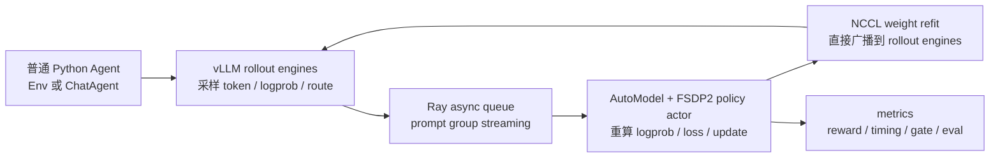

# Molt：把 Agentic RL 训练框架缩到研究者和 Coding Agent 都能读懂

### 元信息与 TL;DR

| 项 | 内容 |
|---|---|
| 论文 | [Molt: A Scalable PyTorch-Native Training Framework for Agentic Reinforcement Learning](https://arxiv.org/abs/2607.21653) |
| 作者 | Jian Hu、Huiying Li、Hao Zhang、Binfeng Xu、Yifan Zhang、Shaokun Zhang、Hemil Desai、Michael Demoret、Pavlo Molchanov、Jan Kautz、Yi Dong |
| 机构 | NVIDIA |
| arXiv | v1 提交于 2026-07-22T18:06:15Z |
| 本周证据 | Hugging Face Daily Papers 于 2026-07-27 收录；官方 GitHub repo 于 2026-07-27T14:06:16Z push，最新 commit 为 `b290478acc39125411d14226506158a84592216c` |
| 代码 | [NVIDIA-NeMo/labs-molt](https://github.com/NVIDIA-NeMo/labs-molt)，Apache-2.0 |
| 分类 | 大模型后训练 / Agentic Reinforcement Learning / 训练系统 |

**TL;DR：**

- **这篇论文解决什么问题**：Agentic RL 研究不断改 reward、advantage estimator、rollout 方案、过滤器和多轮工具环境，但主流训练框架把这些改动埋在 trainer、分布式 backend、rollout engine glue、配置注册层里；研究者提出一个想法后，先要理解基础设施。
- **Molt 怎么做**：它把系统压成三个组件和一个异步 loop：普通 Python agent、vLLM rollout engines、一个基于 NVIDIA AutoModel/FSDP2 的 trainable policy actor，中间用 Ray placement 和 async queue 串起来。
- **核心机制是什么**：论文把正确性定义为 token-first：训练样本必须保留生成时 token id、生成时 logprob、action mask、reward、多模态 tensor 和 MoE routing；训练端不能重新从文本 retokenize，也不能在异步 lag 下假装仍是完全 on-policy。
- **关键数字**：论文报告完整 RL 路径约 **8.6K** Python LOC；对比 verl 约 **62K**、slime 约 **25K**。在 Qwen3-30B-A3B、2 节点 16 H100 的 head-to-head 协议下，Molt 为 **119.4±2.3 s/step、461 tok/GPU/s**，slime 为 **109.5±10.3 s/step、502 tok/GPU/s**，作者只主张统计上相近，不主张更快。
- **工程证据**：README 和代码显示 RL 入口是 `molt.cli.train_rl_ray`，agent 边界有 `Env` 与 `ChatAgent` 两种形式；`Experience` dataclass 显式携带 `rollout_log_probs`、`action_mask`、`routed_experts`；advantage estimator 是普通函数注册。
- **局限**：35B 单框架实验可以有效更新；30B head-to-head 由于上游 distributed-MoE forward mismatch，sequence gate 拒绝 batch，因此 Table 3 是 throughput-only，不是收敛效果对比。论文也没有提出新 RL 目标，安全治理、企业数据转换、控制平面和真实权限边界不在 Molt 范围内。

### 为什么这不是又一个“RLHF 框架对比表”？

| 传统问题 | 在 Agentic RL 里为什么更严重 | Molt 的回答 |
|---|---|---|
| 修改算法要穿透多层抽象 | Agent 轨迹包含多轮 tool call、环境 observation、代码执行、多模态输入和长上下文，不只是 prompt-response pair | 让模块边界贴近 RL 概念：agent、generator、trainer、estimator/loss |
| serving 与 training 可能不一致 | rollout engine 采样的 token、actor forward 的 token、MoE router 选择可能悄悄不同 | token-first trace、rollout logprob、route replay、sequence-level gate |
| 框架越大越难被研究者修改 | 研究问题本身常常就是“把某个 estimator 或过滤器换掉” | 约 8.6K RL 路径，单 backend，减少可配置但不可读的分叉 |
| 现有 harness 难接入训练 | 很多 Agent 已经用 OpenAI/Anthropic SDK、浏览器自动化或 OSWorld 风格 loop | `ChatAgent` 用 loopback server 捕获 SDK 流量，不要求 agent 重写为框架 DSL |

这篇论文的中心主张不是“PyTorch 比 Megatron 更优雅”，也不是“vLLM 比 SGLang 更快”。

- 它真正讨论的是 **研究基础设施的可修改性**：
  - 一个新 estimator 能不能在一个下午加进去？
  - 一条 token 从生成到 loss 的路径能不能被人和 coding agent 一次读通？
  - 异步 rollout 带来的 policy lag、token mismatch、MoE route mismatch 能不能被显式建模？

- 这让 Molt 更接近“Agentic RL 的控制面缩小实验”：
  - 不追求覆盖所有 backend；
  - 不把用户 agent 包成复杂 registry；
  - 不把训练正确性留给日志事后排查；
  - 用更窄的组合换取更短的可审计路径。

### 论文的论证路线：claim → mechanism → evidence → boundary

| 层次 | 论文主张 | 机制 | 证据 | 边界 |
|---|---|---|---|---|
| Claim | 研究型 Agentic RL 框架应优先可读、可改、可被 coding agent 导航 | 单 backend、概念少、代码路径短 | Table 1：Molt 约 8.6K RL LOC，对比 verl 约 62K、slime 约 25K | LOC 不等于易用性或正确性；论文也明确说明代码计数口径 |
| Mechanism | agent 是普通程序，训练器负责捕获 token-exact 轨迹 | `Env` 与 `ChatAgent` 两种 runner；loopback chat server | 论文 Sec. 3.2；repo 中 `molt/agents/base.py`、`molt/agents/chat_agent.py` | 外部 harness 的企业数据转换和部署控制面不在本文范围 |
| Evidence | 小框架不必牺牲吞吐 | Ray + vLLM + AutoModel/FSDP2，fully async | Table 2/3：Molt 119.4±2.3 s/step，slime 109.5±10.3 s/step | head-to-head 是 throughput-only；30B MoE 有上游 forward mismatch |
| Boundary | 大规模能力来自组合成熟组件，不来自重写所有层 | vLLM 负责 serving，AutoModel/FSDP2 负责 actor，Ray 负责 placement/queue | 35B recipe、700B MoE end-to-end loop、附录 scaling knobs | 到 3T/GB300 的收敛测量仍是 future work |

### 系统结构：三个组件，一个异步 loop


论文 Figure 1 和 README 的架构图表达了同一个边界：Molt 不把系统拆成很多控制器，而是保留三个核心组件。

| 组件 | 谁负责 | 输入 | 输出 | 关键约束 |
|---|---|---|---|---|
| Agent pool | 用户普通 Python 代码 | prompt、messages、tools、images、label、sampling params | reward、observation、terminated/truncated、info | reward 可以是 grader、工具、沙箱、VLM 环境或 LLM-as-judge |
| vLLM rollout engines | serving 侧 | tokenized prompt / chat server request | generated token ids、logprobs、routing 信息、multi-turn trace | 不 fork vLLM；通过稳定接口拿 token-first 数据 |
| Policy actor | AutoModel + FSDP2 | Experience batch | action logprob、loss、梯度更新、weight refit | actor 是唯一 trainable policy；reference 和 critic 可选 |

用 Mermaid 看，关键不是“有三个框”，而是每条边上都保留训练语义：



这个 loop 的研究意义在于：

- **Agentic workloads 的延迟重尾**：
  - 有些 prompt 只需要短回答；
  - 有些多轮工具任务会卡在环境、浏览器、代码执行或 judge 上；
  - 如果每个训练 step 都等所有 rollout drain，GPU 会被长尾拖住。

- **Molt 的 prompt-group streaming**：
  - 一个 prompt 的多条 samples 仍作为一个 group；
  - group-baseline estimator 需要完整 group；
  - 但系统不要求所有 engines 清空后再训练；
  - queue depth 把训练吞吐和生成延迟解耦。

- **partial rollout 的代价**：
  - 训练更新时，in-flight request 不必丢弃；
  - engine 可以 pause、refit、resume；
  - 但 resumed request 可能混合 policy versions；
  - 因此每个 action token 必须保留生成时 logprob，并在 loss 里做 per-token correction。

### Agent Contract：为什么“agent 是普通程序”很关键？

论文给了两种 agent 形态，不是为了 API 好看，而是为了解决两类不同接入场景。

| 形态 | 谁拥有 LLM loop | 适合场景 | Molt 捕获什么 |
|---|---|---|---|
| `Env` / `StepEnvRunner` | 框架拥有 loop，每轮调用 `Env.step()` | Gymnasium 风格环境、数学 grader、VLM 环境、简单工具任务 | observation、action token、reward、termination |
| `ChatAgent` / `ChatAgentRunner` | 用户代码拥有 loop，通过 OpenAI/Anthropic SDK 调用 | 已存在的 coding agent、OSWorld、AgentScope、浏览器自动化 harness | loopback chat server 捕获 SDK 流量并拼接 token-exact trace |

这对 Agent 后训练很重要：

- 很多真实 Agent 不是“模型输出一段文本”：
  - 它会调用外部工具；
  - 会维护自己的上下文；
  - 会压缩或重写历史；
  - 会用第三方 SDK 或兼容 OpenAI/Anthropic 的服务器。

- 如果训练框架要求 agent 改写为框架专属 DSL：
  - 研究者会把大量精力花在适配层；
  - 原本的 agent 行为可能被适配层改变；
  - 训练轨迹不再代表真实 harness。

- Molt 的 loopback server 做了一件更窄的事：
  - 让 stock SDK 指向 session URL；
  - session URL 携带 session id；
  - server-side 捕获 token-in/token-out；
  - agent 不需要显式传 `logprobs=true` 或额外 session plumbing。

用伪代码表达，Molt 想保留的是“用户 loop 原样运行、训练 trace 自动生成”：

```text
Input:
  dataset row: messages, tools, images, label
  user ChatAgent.run(ctx)
  serving endpoint: ctx.base_url or ctx.session_url

State:
  session_id
  token_trace = []
  segments = []

Loop:
  user agent calls stock SDK against session endpoint
  server renders chat template exactly once
  vLLM samples tokens and returns token ids + logprobs
  server appends token-in/token-out to token_trace
  if agent compacts context:
    seal current segment
    start a new token-exact segment

Output:
  Result(reward, info, terminated)
  trainable trajectory with tokens, action masks, rewards, logprobs

Failure boundary:
  if token logprobs are missing while correction is enabled:
    fail fast instead of training a silently biased update
```

### Token-first：这篇论文最重要的正确性约束

Molt 反复强调“never train on a token it did not generate”。这句话不是口号，它对应三个静默失败面。

| 失败面 | 表面看起来 | 实际风险 | Molt 的约束 |
|---|---|---|---|
| token identity mismatch | 文本一样，训练也能跑 | chat template、special token、image token 或 tool schema 造成 token 序列不同 | 保存 rollout token ids，不从文本重新 tokenize |
| policy-version mismatch | 异步训练更快 | 一条 trajectory 可能跨越旧 actor 和新 actor | 保存 rollout logprob，loss 用 per-token importance correction |
| MoE route mismatch | actor/engine 都是同一个 checkpoint | 稀疏路由不同，logprob 对应的计算图不同 | 捕获 rollout expert route，actor forward replay route |

可以把 Molt 的 loss 前置条件写成一个检查式公式：

```text
对每个可训练 token t：

  token_id_train[t] = token_id_rollout[t]
  logp_old[t]       = log pi_rollout_version(a_t | s_t)
  route_train[t]    = route_rollout[t]       # MoE 时适用
  action_mask[t]    = 1 仅当 token 是 agent action

如果任一条件不成立：
  训练得到的梯度不再对应“这次 agent 行为”的 RL 更新。
```

异步修正可以写成：

```text
rho_t = exp(log pi_theta(a_t | s_t) - log pi_old(a_t | s_t))

L_pg = - mean_over_unmasked_tokens(
  clipped_or_gated(rho_t) * A_t
)
```

其中：

- `pi_old` 是 rollout 发生时的 behavior policy；
- `pi_theta` 是当前 actor；
- `A_t` 来自 group baseline、REINFORCE++、GRPO、GAE 等 estimator；
- `mean_over_unmasked_tokens` 是全 batch token mean，而不是每个 rank 或每条 sample 各自归一。

这条路径把“训练吞吐”与“训练语义”绑在一起：

- 你可以异步；
- 你可以 partial rollout；
- 你可以重放 MoE routing；
- 但不能让 token、logprob、route、mask 之间的关系丢失。

### Estimator 为什么设计成普通函数？

论文把 algorithm layer 做得很薄：advantage estimator 是 reward 和 group 的函数，不是一个需要继承多层策略类的对象。

| Estimator 家族 | 论文列出的支持 | 对 Agentic RL 的意义 |
|---|---|---|
| REINFORCE++ | critic-free，包含 per-token KL reward 与累计 return | 适合先把复杂 critic 排除，验证长轨迹 reward 能否稳定传导 |
| GRPO / group baseline | 同一 prompt 的多 samples 形成 group | 适合数学、工具调用、代码执行等可比较多样本结果 |
| RLOO / Dr. GRPO | leave-one-out 或变体 | 减少 group 内自比较偏差 |
| GAE + PPO critic | 需要 value model | 适合更传统 actor-critic 设置 |
| on-policy distillation | 作为 estimator 选择 | 连接近期 agent skill / hindsight skill 后训练路线 |

一个 prompt group 可以写成：

```text
G_i = {tau_i1, tau_i2, ..., tau_in}

对 GRPO 风格 group baseline：
  A_ij = r_ij - mean_k(r_ik)

再广播到 action tokens：
  A_ij,t = A_ij * action_mask_ij,t
```

论文的工程选择是：

- estimator 不直接操作完整 `Experience`；
- trainer 负责把 reward、group、mask、KL、value 等小张量装进 context；
- estimator 输出 per-token advantages 和 returns；
- loss 路径只吃 canonical token trace。

这让“改算法”变成更可控的局部编辑：

- 新函数；
- 新 flag；
- 一处调用；
- 对应 metric；
- 单元测试。

对 coding agent 来说，这比“先理解若干 registry、trainer subclass、backend adapter 和 YAML inheritance”更容易审计。

### 实验设置：论文到底证明了什么？

论文 Evaluation 回答三个问题：

1. 框架自己拥有的 RL 代码面有多大？
2. 上游 engine 的性能特性能否通过 flag 到达 Molt？
3. 小框架能否接近 Megatron-based stack 的 throughput？

#### Table 1：框架对比

| 框架 | Training backend | Rollout engine | RL topology | RL code LOC | 设计中心 |
|---|---|---|---|---:|---|
| Molt | AutoModel / FSDP2 | vLLM | actor，可选 critic | 约 8.6K | readable agentic research |
| OpenRLHF | DeepSpeed ZeRO-3 | vLLM | actor + critic + RM | 约 7.2K | RLHF coverage |
| verl | FSDP/FSDP2/Megatron | vLLM/SGLang/TRT-LLM | actor + critic + RM | 约 62K | production breadth |
| slime | Megatron | SGLang | actor + critic + RM | 约 25K | Megatron throughput |

这里的正确读法是：

- Molt 不是最小代码量；
- OpenRLHF 更小，但不以 frontier-scale agentic RL 为中心；
- verl/slime 的代码面大，是因为它们覆盖更宽 backend 或 Megatron 路径；
- Molt 选择单 backend 和单 serving engine，把可读性和可定位性放在覆盖面前面。

#### Table 2：head-to-head 协议

| 设置 | 内容 |
|---|---|
| 模型 | Qwen3-30B-A3B，bf16 |
| 硬件 | 2 节点 × 8 H100；8 training + 8 rollout GPUs |
| 数据 | DAPO-Math prompts，去重到 2K rows |
| Batch | 32 prompts × 4 samples = 128 sequences/step |
| Context / response | 16,384-token context；8,192-token response cap |
| Asynchrony | Molt streaming async；slime one-step async |
| Reference model | 两边都没有 reference model |
| Micro-batch | 1；禁用 packing 和 dynamic batching |
| 差异 | Molt 用 AutoModel + vLLM；slime 用 Megatron-Core + SGLang |

这张表很关键，因为作者没有把“系统不同”包装成完全公平：

- 共同设置被 pin；
- 差异行被列出；
- 每个框架用自己的推荐 parallel layout；
- 结果只比较 throughput，不比较最终能力。

#### Table 3：结果与边界

| 配置 | Step time | Tok/GPU/s | 作者可主张什么 |
|---|---:|---:|---|
| Molt | 119.4±2.3 s | 461 | 与 slime 同量级，统计上接近 |
| slime | 109.5±10.3 s | 502 | 平均更快约 9%，但三次运行波动覆盖 Molt 区间 |

最值得注意的是边界说明：

- 对 30B head-to-head：
  - benchmark checkpoint 暴露了上游 distributed-MoE forward mismatch；
  - actor logprob 与独立 reference forward 相差约 1 nat；
  - `[0.99, 1.01]` sequence gate 拒绝 batch；
  - 所以 Table 3 是 throughput-only。

- 对 35B 单框架 workload：
  - 论文说明该 workload 没有这样的 gap；
  - sequence gate 不过滤样本；
  - 但这仍不是“所有 Molt 训练都已证明收敛等价”的结论。

这类诚实边界反而强化了论文主题：

- 小框架的价值不是永远不出错；
- 是出错时能让 mismatch 显性化、局部化，并阻止静默梯度污染。

### 性能细节：三个 flag 说明组合式系统能否吃到上游红利

论文 Sec. 4.2 的数字来自 Qwen3.6-35B-A3B recipe：2 节点、8 training + 8 rollout GPUs、32K context、多轮工具任务。

| 特性 | 数字 | 证明点 | 不能证明什么 |
|---|---:|---|---|
| prefix caching | cache hit re-prefill 0.05s | 多轮对话复用路径打通 | 没有 cache-miss baseline，不能说端到端提速多少 |
| speculative decoding | generation 329s → 64s，约 5× | MTP head 可通过配置把 generation-bound 变为 training-bound | 只针对该 checkpoint/recipe，不是通用 5× |
| optimizer CPU offload | GPU 峰值 64.7GB → 46.4GB，policy_train 213s → 251s | 用 18% 时间代价换 18.3GB 显存，可能决定能否 fit | 不说明 offload 在所有模型都划算 |

这组实验服务于一个狭窄 claim：

- 如果不 fork vLLM、不重写 AutoModel；
- 上游的 prefix cache、speculative decoding、CUDA graph、FSDP2/EP/CP 能通过 flag 进入 Molt；
- 小框架不需要为了性能复制大框架的全部分层。

### 代码证据：README、CLI 和核心 dataclass 支持论文叙事

本轮除了论文，也检查了官方 repo 的 README、`molt/cli/train_rl_ray.py`、`molt/agents/*`、`molt/trainer/algorithm/*`、`molt/trainer/rollout/*`、`examples/scripts/quick_start/rl_qwen3_4b.sh`。

| 代码位置 | 观察 | 对论文的支撑 |
|---|---|---|
| README | 标称 Ray、vLLM、NVIDIA AutoModel；约 9.2K RL code；一组 quick-start recipes | 与论文“组件组合而非 fork/重写”一致 |
| `molt.cli.train_rl_ray` | 初始化 Ray、创建 vLLM engines、设置 strategy、placement、policy actor | RL 入口集中，不是散在多个 backend controller |
| `molt.agents.base` | `Result`、`Trajectory`、`StepEnvRunner` 等 Gymnasium-aligned 原语 | `Env` 形式确实把 agent step 当作普通 Python |
| `molt.agents.chat_agent` | `ChatContext` 包含 `base_url`、`session_url`、messages、tools、images、label | `ChatAgent` 可以用 stock OpenAI/Anthropic SDK 走 loopback capture |
| `Experience` dataclass | 包含 sequences、attention_mask、action_mask、action_log_probs、rollout_log_probs、routed_experts | token-first、policy-version、MoE route 三个不变量进入训练数据结构 |
| `advantage.py` | estimator 注册为函数，context 只带小张量 | 支持“算法编辑局部化”的 claim |
| quick-start script | Qwen3-4B 单节点用 4 actor GPUs + 4 vLLM rollout，`--algo.advantage.estimator reinforce_baseline`、`--algo.advantage.is_correction_level geo` | 论文里的 estimator/correction/async 设置不只是文字描述 |

有一个细节值得单独指出：

- README badge 写约 9.2K LOC；
- 论文 Table 1 写约 8.6K LOC；
- 这不是必须强行调和的矛盾。

更合理的解释是：

- 论文 Table 1 明确采用 2026-07-07 的 import-graph 计数口径；
- README 反映仓库当前版本或展示口径；
- 两者共同支持“RL 路径远小于 verl/slime”的方向性结论；
- 但不能用它们推出严格、永久的代码规模事实。

### 与近期 Agentic RL 文章的关系

Daily Report 最近已经覆盖过 OPID、SAO、SEED、ToolVerse、PATS 和 Skill Self-Play。

Molt 和这些工作的差异要分清：

| 近期主题 | 主要关注 | Molt 与它的关系 |
|---|---|---|
| OPID / SEED | hindsight skill、on-policy distillation、长程 credit assignment | Molt 不提出新的 skill distillation；它提供能接这些目标的训练 substrate |
| SAO | 单 rollout、异步优化、policy lag 修正 | Molt 也关心异步和 correction，但论文重点是系统可读性与 token-first 边界 |
| ToolVerse | MCP 环境、长程任务、turn-local reward | Molt 不构造大规模工具环境；它让这类环境能作为普通 Python reward/agent 接入 |
| PATS / Skill Self-Play | 技能 scaffold、自博弈课程、proposer/solver | Molt 不管理技能库；它可承载这类 estimator、filtering 或 agent runner 改动 |

所以本篇不应该写成“又一个 agentic RL 算法”。

更准确的定位是：

- 过去几篇回答“训练信号怎么设计”；
- Molt 回答“当这些信号每周都在变，训练系统怎样不成为研究瓶颈”；
- 它把 agentic RL 的研究循环从算法论文拉回系统论文：
  - 数据结构；
  - token trace；
  - queue；
  - routing replay；
  - weight sync；
  - observability；
  - fail-fast gates。

### 失败案例和边界：这篇论文最值得保留的 skeptical reading

#### 1. Table 3 不是能力提升实验

论文没有说 Molt 训练出的模型比 slime 更强。

- 它比较的是 steady-state wall time；
- 每个配置跑三次；
- 报告 step time 和 tok/GPU/s；
- 由于 30B checkpoint 的 MoE forward mismatch，sequence gate 拒绝 batch；
- 因此这组结果不能作为收敛质量、最终 benchmark 或 RL 稳定性的证据。

这点对读者很重要：

- 如果你要选训练框架，Table 3 支持“吞吐不会明显掉队”；
- 如果你要证明某个算法在 Molt 上有效，还需要自己的 learning curve、reward curve、eval pass@k 和 ablation。

#### 2. “可被 coding agent 读懂”仍需要实证用户研究

论文把 coding assistant navigability 作为设计原则。

但目前证据主要是：

- 代码路径短；
- flag 到 tensor 到 metric 的路径显式；
- estimator 是函数；
- repo 中有 quick-start 和 examples。

它还没有给出：

- 多个 coding agent 修改任务的成功率；
- 人类研究者修改耗时对比；
- bug localization 时间；
- agent 提交 patch 后的 review 质量。

所以这更像一个强工程假设：

```text
更短的显式路径
  -> 更容易被人和 coding agent 审计
  -> 更快做算法迭代
```

第一步有代码证据；后两步仍需要用户研究或长期工程数据。

#### 3. 安全边界不在框架里自动解决

Molt 支持普通 Python reward、tool、sandbox、LLM-as-judge 和外部 SDK harness。

这带来能力，也带来风险：

- reward 代码可以调用外部系统；
- browser / OSWorld 类 agent 会接触文件、网络、GUI；
- LLM-as-judge 可能被被评内容 prompt-inject；
- loopback server 捕获 token trace，但不等于权限隔离；
- 训练成功不等于部署安全。

因此把 Molt 用在安全敏感 Agent 上时，至少还需要：

| 边界 | 需要额外做什么 |
|---|---|
| 工具权限 | sandbox、allowlist、credential scoping、网络 egress 控制 |
| Judge 安全 | judge prompt 隔离、输入转义、对抗样本评估 |
| 数据治理 | 训练轨迹脱敏、provenance、保留期限、审计日志 |
| 部署控制 | policy rollout gate、rollback、在线监控、人工审批 |
| 多 Agent | 并发资源限额、共享状态隔离、跨任务记忆边界 |

论文自己也把企业数据转换和统一控制平面列为外部相关方向，而不是 Molt 已覆盖的功能。

### Detail inventory：把论文证据拆成可复查清单

| 维度 | 本文能提取到的细节 | 研究者复查时应看什么 |
|---|---|---|
| 方法名 | Molt，一个 PyTorch-native、agentic-first RL framework | 是否真的只围绕 Ray、vLLM、AutoModel/FSDP2 这条窄栈展开 |
| 主要模块 | agent pool、vLLM rollout engines、single policy actor、Ray async queue | 入口 `train_rl_ray` 是否能追到 rollout、experience、loss 和 metrics |
| 输入 | chat-format dataset、prompt group、messages、tools、images、label、sampling params | `--data.apply_chat_template` 是否只应用一次，ChatAgent 是否保留 raw messages |
| 状态 | session id、token trace、segments、rollout logprob、policy version、routed experts | context compaction 后是否 seal segment，而不是把重写前后 token 混成一条轨迹 |
| 输出 | trainable `Experience`、reward、score、info、advantages、returns、policy loss | action token、observation token、tool feedback 是否被 `action_mask` 正确区分 |
| Benchmark | Qwen3.6-35B-A3B geo3k；Qwen3-30B-A3B head-to-head | 35B 与 30B 结论不能混用；一个是单框架功能测量，一个是吞吐对比 |
| Baseline | slime / Megatron-Core + SGLang；OpenRLHF、verl 等作为设计空间参照 | Table 1 是系统对比，不是最终模型能力排行榜 |
| 消融或替代 | prefix caching、speculative decoding、CPU offload、context parallelism 设置 | 作者主要测配置开关效果，没有做“去掉 token-first 约束”的安全消融 |
| 失败案例 | 30B MoE forward mismatch 导致 sequence gate 拒绝 batch | 这是本文最重要的反例证据：系统能发现错配，但不等于训练已成功 |
| 复现材料 | repo ships recipes、containers、reference agents | 需要检查对应 commit 和容器版本，不能只按 README 最新命令泛跑 |

这张清单可以把 Molt 的贡献重新压缩成三条可验证断言：

1. **代码路径断言**
   - 从 CLI flag 到 tensor 到 loss 到 metric 的路径足够短；
   - 研究者能在不理解多个 backend 的情况下修改 estimator；
   - coding agent 也有机会在一个上下文窗口内追完整路径。

2. **训练语义断言**
   - 训练端看到的 token 就是 rollout 端生成的 token；
   - 异步产生的旧策略 logprob 被保留；
   - MoE routing 不由训练端重新自由选择；
   - sequence gate 能阻止明显错配进入 optimizer step。

3. **性能约束断言**
   - 不 fork serving/training 组件，不应导致吞吐明显掉队；
   - prefix caching、speculative decoding、CPU offload 等上游能力可以通过 flag 进入；
   - 大模型扩展应表现为配置变化，而不是框架迁移。

### 如果把 Molt 用作下一篇 Agentic RL 论文的底座，最容易踩哪些坑？

#### 1. 把 reward 写成“能跑”但不可审计

Agentic RL 的 reward 经常不是一个静态函数。

- 它可能调用评测脚本；
- 可能启动浏览器或代码沙箱；
- 可能读写临时文件；
- 可能调用 LLM-as-judge；
- 可能依赖外部 API 的当前状态。

Molt 允许 reward 是任意 Python，这降低了接入成本，但也让 reward 成为最大不确定源。

更稳的做法是：

- reward 输入只接受 trajectory、label 和显式环境状态；
- 外部调用必须记录版本、参数和返回摘要；
- LLM-as-judge 至少要固定模型、prompt、temperature 和解析器；
- 对失败、超时、格式错误给出独立 `info` 字段，不要全部压成 0 分；
- 训练日志里区分 reward_mean、score_mean、invalid_rate 和 timeout_rate。

#### 2. 忽略 action mask 的语义

多轮 Agent 轨迹里并不是每个 token 都应该被 policy gradient 更新。

| token 类型 | 是否应作为 action | 原因 |
|---|---|---|
| 初始 prompt | 否 | 这是条件，不是模型动作 |
| tool schema | 否 | 通常由环境或系统提供 |
| assistant 生成的 tool call | 是 | 这是 agent 行为 |
| tool observation | 否 | 这是环境反馈 |
| context compaction summary | 视来源而定 | 如果由 agent 生成，可能是 action；如果由 harness 改写，可能是新 segment 条件 |
| final answer | 是 | 直接影响 reward |

如果 action mask 错了，训练会出现两类偏差：

- 把环境反馈当成模型动作训练；
- 或者把真正的工具调用 token 从 loss 里漏掉。

Molt 的 `Experience` 把 dense next-token axis 保留下来，再用 `action_mask` 排除 observation/tool feedback；这比只保存 compacted response 更适合多轮任务。

#### 3. 误读“force-on-policy”

论文提到 force-on-policy option：严格场景下，一个完整 multi-turn rollout 映射到一个 optimizer step。

这不是默认最优，而是一个取舍：

- 更严格的 on-policy 语义；
- 更低的 utilization；
- 更少的 batch 拼接自由度；
- 更适合先做正确性验证；
- 不一定适合最终大规模吞吐。

研究者可以按阶段使用：

1. 调试 reward、mask、logprob alignment 时先强约束；
2. 确认语义后再打开 async queue；
3. 大规模实验前再检查 importance correction 和 sequence gate 的拒绝率。

#### 4. 把 MoE routing 当作性能细节

MoE routing 在普通监督训练里已经重要，在 RL 里更敏感。

- rollout 端选了专家 A；
- actor 重算 logprob 时选了专家 B；
- 文本 token 没变；
- logprob 数值却对应不同稀疏计算图；
- policy ratio 进入 loss 后，梯度语义被污染。

论文对这个问题的处理是 rollout routing replay：

```text
rollout:
  record routed_experts[token, layer, topk]

training:
  actor forward receives routed_experts
  replay route where available
  use sentinel for tokens without captured route

guard:
  unsupported combinations fail fast
```

这说明 Molt 的“token-first”其实还不够，必须扩展成 **token + probability + sparse route first**。

#### 5. 把吞吐 parity 当作部署许可

Table 3 只告诉我们：在一个明确协议下，Molt 没有因为小框架而吞吐崩掉。

它没有告诉我们：

- 多租户训练如何隔离；
- secret 如何不进入 trajectory；
- tool execution 如何 sandbox；
- 模型更新如何灰度；
- 失败 checkpoint 如何回滚；
- 训练数据如何合规保留。

所以 Molt 更适合被看作研究 substrate，而不是完整生产平台。

### 复现清单：读者该如何验证论文说法？

如果把 Molt 当成研究框架候选，不建议只跑 hello world。

更有信息量的验证顺序是：

1. **代码路径读通**
   - 从 `examples/scripts/quick_start/rl_qwen3_4b.sh` 追到 `molt.cli.train_rl_ray`；
   - 再追到 `SamplesGenerator`、`RemoteExperienceMaker`、`PolicyTrainer`；
   - 检查 reward、action_mask、rollout_log_probs、advantages 在哪一步生成。

2. **最小 agent 改动**
   - 写一个 `ChatAgent`；
   - 用 stock OpenAI client 请求 `ctx.base_url`；
   - 验证 agent 侧没有传 logprob/session 私有字段；
   - 确认 server 侧仍得到 token trace。

3. **estimator 改动**
   - 新增一个 group baseline variant；
   - 确认只改 estimator 函数和 flag；
   - 看日志里 reward/loss/timing 是否能定位影响。

4. **一致性 gate**
   - 打开 importance correction；
   - 检查 rollout logprob 与 actor recompute logprob 的差异；
   - 在 MoE 模型上验证 routing replay 或 router freeze 是否启用。

5. **吞吐复现**
   - 先复现 Qwen3-4B quick-start；
   - 再看 35B geo3k recipe；
   - 最后再谈 30B/slime head-to-head。

这套顺序对应论文的证据边界：

- 先证明系统能读；
- 再证明 agent 可接；
- 再证明算法改动局部；
- 再证明 token/version/route 不变量；
- 最后才比较吞吐。

### 结论：Molt 的价值是把“后训练系统”变成可审计对象

Molt 最有价值的地方，不是某个单点速度数字。

它提出了一个更适合 2026 年 Agentic RL 研究的基础设施判断：

- 训练框架不只是跑 GPU 的底座；
- 它也是研究假设能否被快速、正确、可审计地表达的界面；
- 当 coding agent 参与改代码时，框架必须让路径短、状态显式、失败早暴露；
- 否则 agent 会在隐藏 registry、backend adapter 和多层配置里制造难 review 的 patch。

对后训练研究者来说，Molt 给出的启发是：

- **不要只问能不能 scale**：
  - 还要问一条 token 的语义能否从 rollout 追到 loss；
  - 一个 reward bug 能否被定位；
  - 一个 estimator 改动能否只触碰 estimator；
  - 一个多轮 agent 的上下文压缩是否会切断 trajectory。

- **不要把异步当纯吞吐优化**：
  - 异步意味着 policy-version lag；
  - partial rollout 意味着同一 trajectory 可能跨版本；
  - MoE 意味着 serving/training route 可能不同；
  - 这些都需要进入数据结构和 loss，而不是留给经验主义调参。

- **不要把普通 Python agent 接入当小事**：
  - 真正的 agent 往往已经有自己的 loop；
  - 训练框架越强迫它迁移，行为越可能失真；
  - loopback capture 是一个务实边界：让 harness 保持原样，让训练 trace 变得可用。

这也是本文和近期 OPID、SEED、ToolVerse、PATS、Skill Self-Play 的连接点：

- 那些论文在发明更好的训练信号和任务课程；
- Molt 在追问承载这些信号的系统是否足够窄、足够显式、足够一致；
- 两者共同指向下一阶段 Agentic RL 的核心瓶颈：**不是只有 reward 设计，也不是只有 GPU 吞吐，而是从真实 agent 行为到可验证 policy update 的完整链路**。

### 继续追问

| 问题 | 为什么重要 |
|---|---|
| coding agent 是否真的更容易修改 Molt？ | 需要用真实 patch 任务、review 缺陷率、测试通过率验证“AI-readable infrastructure” |
| token-first trace 能否成为跨框架协议？ | Agent Lightning、Polar、Molt 都在触碰 trajectory capture，但边界和字段仍不统一 |
| MoE route replay 会不会成为 Agentic RL 标配？ | 长轨迹 RL 的小 logprob mismatch 会被大量 token 放大，静默偏差很难事后发现 |
| 普通 Python reward 如何安全运行？ | 框架开放 reward/harness 接入后，权限、沙箱、审计必须成为训练平台层能力 |
| 可读性和多 backend 之间有没有中间道路？ | Molt 选择单 backend；生产团队可能仍需要多个 serving/training backend 的迁移策略 |

Molt 的保守结论可以这样写：

```text
如果你的研究目标是快速修改 Agentic RL 算法，
并且你接受 AutoModel + vLLM + Ray 这条窄栈，
Molt 给出了一条可读、token-first、吞吐不明显掉队的路线。

如果你的目标是最大覆盖面、企业控制平面、跨 backend 迁移、
安全沙箱或已证明的收敛优势，
这篇论文还没有把那些问题解决完。
```
