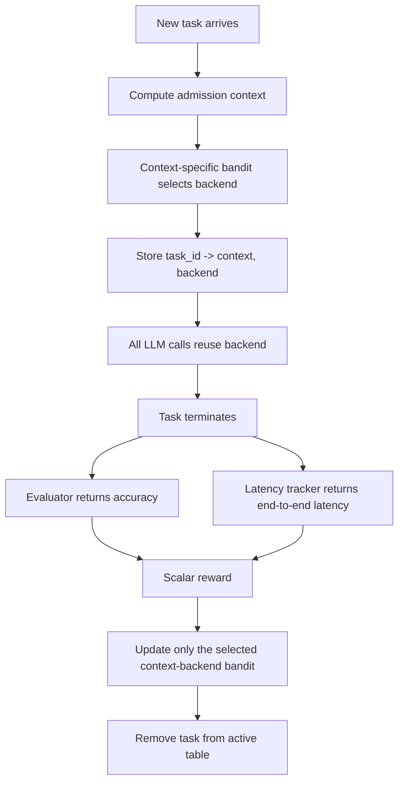

# TRACE-Router：把 Agent 路由从“每次请求”改成“整条任务轨迹”

## 元信息与 TL;DR

- **标题**：TRACE-ROUTER: Task-Consistent and Adaptive Online Routing for Agentic AI
- **作者**：Ritik Raj、Souvik Kundu、Sarbartha Banerjee、Dheemanth Joshi、Ishita Vohra、Tushar Krishna
- **机构**：Georgia Institute of Technology、Intel、Texas A&M University
- **类别**：大模型 Agent 相关
- **发布时间**：2026-07-24 16:29:06 UTC
- **原文**：[arXiv:2607.22465](https://arxiv.org/abs/2607.22465)
- **HTML**：[https://arxiv.org/html/2607.22465](https://arxiv.org/html/2607.22465)
- **PDF**：[https://arxiv.org/pdf/2607.22465](https://arxiv.org/pdf/2607.22465)

### TL;DR

- **这篇论文解决什么问题**：
  Agent 系统通常不是一次 prompt，而是一条包含多次 LLM 调用、工具调用、环境状态、验证器和终止反馈的长轨迹。传统 LLM router 每次请求单独选模型，但 Agent 的成功或失败只在任务结束后出现；这种粒度错位让路由器很难判断是哪一次路由决策造成了最终成败。

- **核心方法是什么**：
  TRACE-Router 把路由粒度改为任务级。每个任务进入系统时只选一次后端模型，后续所有 LLM 请求都用同一个 persistent task identifier 绑定到该模型；任务结束后，再用任务准确率和端到端延迟组成的标量 reward 更新对应上下文里的 contextual UCB bandit。

- **它怎么做在线适配**：
  系统先用一个入场时可计算的粗粒度 context function 把任务分到 EASY、MEDIUM、HARD 等离散上下文；每个上下文维护独立 bandit。这样，telecom、retail、coding、terminal 等任务族不必共享同一组模型价值估计，避免把“这个小模型在某类任务快且准”和“同一个小模型在另一类任务几乎不会完成”平均成一个误导性数字。

- **关键实验数字是什么**：
  在 τ2-Bench 的 retail+telecom 平均上，TRACE-Router 产生三个内部 Pareto 点：55.2% / 25.4s、57.6% / 25.9s、61.2% / 26.4s；相对 latency-matched 随机混合分别高 7.9、7.1、7.5 个准确率点。在 Terminal-Bench 上，它达到 46.8% resolved rate / 172s，而一直使用 27B 后端是 39.7% / 270s，即准确率高 7.1 点且延迟低 36%。

- **最值得注意的机制发现**：
  论文不是简单说“小模型快、大模型准”。在 τ2-Bench telecom 中，小后端只有 10.5% task accuracy，却仍要 30.2s；大后端 60.5%，32.7s。失败任务会耗尽 episode budget，因此弱模型有时既不准也不快。路由的收益来自避开“会失败且耗时”的模型，而不是机械降级。

- **局限在哪里**：
  TRACE-Router 需要持久任务 ID、可入场计算的上下文、任务级 evaluator 和端到端延迟追踪；它默认把一个任务全程绑定到单模型，因此没有处理中途发现模型失配后的安全切换；UCB 版本也没有给出严格 anytime regret 证明。Terminal-Bench 只有 48 个 matched tasks，一个任务约等于 2.1 个百分点，幅度判断要保守。

## 研究问题：为什么 Agent 路由不能照搬单轮请求路由？

### 传统 router 的隐含假设

- 传统 LLM router 通常回答一个局部问题：
  - 输入：当前 prompt 或 query。
  - 输出：这一次请求应该给哪个模型。
  - 反馈：这一次响应的质量、偏好、成本或延迟。

- 这个抽象适合单轮问答，因为一次选择和一次反馈可以相互对应。

- Agent 任务里，这个对应关系被打破：
  - 一个任务可能包含几十次 LLM 调用。
  - 中间穿插工具、检索、环境状态、缓存、guardrail、memory 和 validator。
  - 最终成败通常是任务结束时的单个信号，例如测试是否通过、环境目标是否达成、judge 是否给高分。
  - 如果每次请求都可换模型，最终 reward 很难归因到某一个局部 routing action。

### 论文重新定义的核心对象

| 维度 | 请求级路由 | TRACE-Router 的任务级路由 |
|---|---|---|
| 决策对象 | 单个 prompt / query | 完整任务轨迹 |
| 决策频率 | 每次 LLM 调用都可能重选 | 新任务入场时只选一次 |
| 状态绑定 | 容易跨模型切换 | 任务 ID 绑定到同一后端 |
| 反馈来源 | 局部质量或请求级标签 | 任务结束后的准确率与延迟 |
| 学习方式 | 常见为离线分类器或局部路由器 | 在线 contextual bandit |
| 主要风险 | prompt 难度估错 | context 粒度、冷启动和延迟反馈 |

### 作者的主张

- **Claim**：
  Agentic workloads 的路由单位应该匹配反馈单位；如果反馈是任务级，路由也应是任务级。

- **Mechanism**：
  用 persistent task identifier 将任务内所有 LLM 请求固定到同一 backend，再把最终 reward 回写到当初做选择的 bandit。

- **Evidence**：
  在 τ2-Bench、LiveCodeBench、Terminal-Bench 的 live end-to-end runs 中，TRACE-Router 多次占据 accuracy-latency Pareto frontier 的内部点；在 Terminal-Bench 甚至同时优于两个单模型端点。

- **Boundary**：
  这不是证明“任务级绑定永远比中途换模型好”。它证明的是：在只有延迟任务级反馈、缺乏可靠中间 credit assignment 时，任务级绑定给了在线学习一个明确且可更新的统计对象。

## 方法机制：TRACE-Router 的四个部件

### 1. Task-consistent routing：用任务 ID 固定后端

- 设候选模型池为：

```text
M = {1, 2, ..., K}
```

- 一个任务 `t` 诱导出一条 LLM 请求轨迹：

```text
Pi_t = (q_t,1, q_t,2, ..., q_t,H_t)
```

- 其中：
  - `q_t,h` 是任务 `t` 的第 `h` 次 routed LLM request。
  - `H_t` 是总请求数，任务入场时未知。
  - 工具调用、环境交互、检索、host-side computation 可以发生在两次 LLM 请求之间。

- Agent harness 给每个请求附加持久任务标识：

```text
kappa_t
```

- Router 维护 active-task table：

```text
A: kappa_t -> (ctx = c_t, mdl = m_t)
```

- 路由规则很简单：
  - 如果 `kappa_t` 已经在 `A` 里，就复用 `A(kappa_t).mdl`。
  - 如果是新任务，就计算上下文 `c_t`，调用对应 bandit 选择 `m_t`，然后把 `(c_t, m_t)` 写入 `A`。
  - 任务完成后，再从 `A` 里取出当初的上下文和模型，更新统计量，并移除这条 active binding。

### 2. Context-conditioned model selection：每类任务一个 bandit

- 论文不让所有任务共享同一个全局路由策略，因为不同任务族对模型的偏好可能相互冲突。

- 它定义一个入场时可计算的上下文函数：

```text
c_t = g(x_t), c_t in C
```

- 其中：
  - `x_t` 是任务初始描述。
  - `g` 不需要是模型，可以是 regex、长度阈值、业务 metadata、domain label 或更复杂分类器。
  - `C` 必须足够小，否则每个 context 拿不到足够反馈。

- 本文实验里，`g` 是一个 deliberately minimal 的 regex-based complexity classifier：
  - 输出三个 tier：`EASY`、`MEDIUM`、`HARD`。
  - 不调用模型。
  - 不需要训练数据。
  - 入场延迟可以忽略。

- 这个设计的对照意义很强：
  - complexity-router baseline 使用同一个 context signal，但用固定规则把 tier 映射到模型。
  - TRACE-Router 使用同一个 signal，却让 bandit 从任务结果里学习映射。
  - 因此实验更接近回答“在线学习是否真的贡献了收益”，而不是把收益归因给更强的复杂度分类器。

### 3. Cold-start contextual UCB：少量强制探索后按置信上界选模型

- 每个 context `c` 维护一个 bandit `B_c`。

- 对每个 backend `m`，维护两类统计：
  - `N_c,m`：这个 context 下，backend `m` 已完成的任务数。
  - `S_c,m`：这些任务返回的 reward 总和。

- 冷启动阶段：
  - 每个 context 内，对每个 backend 做 `k` 次 forced pull。
  - 初始化成本是：

```text
|C| * k * |M|
```

- 实验主设定为：
  - `|C| = 3`
  - `k = 1`
  - `|M| = 2`
  - 所以初始化只消耗 6 个任务。

- 之后使用 UCB 选择：

```text
mu_hat_c,m = S_c,m / N_c,m

m_t = argmax_m [
  mu_hat_c_t,m + sqrt(2 * log(1 / delta) / N_c_t,m)
]
```

- 变量解释：
  - `mu_hat_c,m` 是某 context 下某模型的经验 reward。
  - 第二项是探索 bonus。
  - `delta` 在这篇论文里更像固定探索强度，而不是严格 anytime bound 的失败概率。
  - `delta` 越小，`log(1/delta)` 越大，探索半径越宽。

### 4. Task-level reward：用准确率和端到端延迟合成一个反馈

- 对任务 `t` 和模型 `m`：
  - `a_t,m in [0,1]` 是任务级准确率。
  - `l_t,m >= 0` 是端到端执行延迟。
  - `l_0` 是 workload 级延迟归一化常数。

- 延迟先被归一化并裁剪：

```text
l_tilde_t,m = min(l_t,m / l_0, 1)
```

- reward 由 `alpha` 控制准确率和延迟偏好：

```text
r_t,m^(alpha) = (1 - alpha) * a_t,m - alpha * l_tilde_t,m
```

- 解释：
  - `alpha = 0` 时，只优化准确率。
  - `alpha = 1` 时，只最小化裁剪后的延迟。
  - 中间值表示不同部署预算下的折中。
  - 每个 `alpha` 维护独立策略状态，观测不跨 `alpha` 共享。

### 执行流程伪代码

```text
Input:
  task stream T
  model pool M
  context function g
  preference alpha
  UCB parameter delta

State:
  active table A: task_id -> (context, model)
  for each context c and model m:
    N[c, m] = 0
    S[c, m] = 0

For each incoming LLM request q from task_id kappa:
  If kappa exists in A:
    route q to A[kappa].model
  Else:
    x = admission descriptor for this task
    c = g(x)
    If any model m in context c has fewer than k forced pulls:
      choose the next under-sampled model m
    Else:
      choose m = argmax_m S[c,m] / N[c,m] + sqrt(2 log(1/delta) / N[c,m])
    A[kappa] = (c, m)
    route q to m

When task kappa terminates:
  obtain task accuracy a and end-to-end latency l
  l_tilde = min(l / l_0, 1)
  reward = (1 - alpha) * a - alpha * l_tilde
  (c, m) = A[kappa]
  N[c, m] = N[c, m] + 1
  S[c, m] = S[c, m] + reward
  remove kappa from A

Output:
  online routing policy per context and alpha

Failure boundary:
  If task_id is missing, context is computed after first model call, evaluator is absent,
  or latency is not measured end-to-end, the paper's credit-assignment argument no longer holds.
```

## 系统视角：它实际要求 Agent harness 提供什么？

### 四个前提

| 前提 | 为什么必要 | 缺失后会怎样 |
|---|---|---|
| 候选后端池 | bandit 需要可选择的 arms | 退化为单模型 serving |
| 持久任务 ID | 保证同一任务内 sticky assignment | 中途换模型后 reward 无法清楚归因 |
| 入场 context signal | 新任务第一次请求前就要选模型 | 若需要先调用 LLM 才能分类，就绕回请求级路由 |
| 任务级 outcome | bandit 更新依赖最终准确率和延迟 | 没有 reward 就只能离线或人工配置 |

### Mermaid 流程图



### 与常见 Agent serving 架构的关系

- TRACE-Router 不是新的 agent framework。

- 它更像一个 serving-layer policy：
  - 可放在 LiteLLM proxy 一类代理层里。
  - 不接管工具执行。
  - 不改变任务 evaluator。
  - 不要求重训后端模型。

- 它真正改变的是服务端看待请求的方式：
  - 请求不再是独立事件。
  - 请求属于某个可追踪任务。
  - 任务是调度、反馈、归因和路由的基本单位。

## 实验设置：作者如何构造证据？

### Benchmark 与模型池

| Benchmark | 小 / 大后端 | 任务数 | 准确率指标 | 延迟归一化 `l_0` |
|---|---|---:|---|---:|
| τ2-Bench retail | Qwen3.5-4B / 9B | 114 | task accuracy | 60s |
| τ2-Bench telecom | Qwen3.5-4B / 9B | 114 | task accuracy | 60s |
| LiveCodeBench | Qwen3.5-4B / 9B | 300 | difficulty-weighted pass@1 | 10s |
| Terminal-Bench | Qwen3.5-9B / 27B-FP8 | 48 | resolved rate | 600s |

### Router 与 baseline

- TRACE-Router 主设定：
  - patched LiteLLM proxy。
  - live end-to-end runs。
  - wall-clock latency per task，包含工具执行和环境交互。
  - cold-start contextual UCB。
  - `k = 1` forced pull per arm。
  - `delta = 0.1`。
  - `alpha in {0, 0.25, 0.5, 0.75, 1}`。

- 对照方法：
  - 始终使用小模型。
  - 始终使用大模型。
  - semantic router：按 embedding similarity 分配任务到 route exemplars。
  - complexity router：用同一个 regex complexity context，但固定映射 tier 到模型。
  - context-free TRACE-Router：只保留任务级绑定，移除 context 分区。
  - task-matched oracle：作为参考上界，不算入 Pareto frontier。

### 证据设计的好处

- live end-to-end runs 避免只在离线日志上模拟 latency。

- complexity router 使用同一个 context classifier，让“上下文信号”和“在线学习”可以分开比较。

- latency-matched random interpolation 是一个关键对照：
  - 如果只看 Pareto frontier，随机混合两端点也可能落在线段上。
  - 论文要求 TRACE-Router 在相同 latency 下比随机混合更准，才算真正学到了任务选择。

## 主结果：TRACE-Router 的收益来自哪里？

### τ2-Bench：内部 Pareto 点由 TRACE-Router 提供

| 设置 | Accuracy | Mean latency |
|---|---:|---:|
| TRACE-Router operating point 1 | 55.2% | 25.4s |
| TRACE-Router operating point 2 | 57.6% | 25.9s |
| TRACE-Router operating point 3 | 61.2% | 26.4s |
| Latency-matched interpolation 1 | 47.3% | same latency |
| Latency-matched interpolation 2 | 50.5% | same latency |
| Latency-matched interpolation 3 | 53.7% | same latency |

- 三个 TRACE-Router 点分别比 latency-matched interpolation 高：
  - `+7.9` points。
  - `+7.1` points。
  - `+7.5` points。

- 这说明它不是简单按概率混用两个模型。

- 它学到的是任务条件下的模型选择：
  - 某些任务交给小模型能省时间且不掉太多准确率。
  - 某些任务交给小模型会失败，还会耗尽回合预算。
  - 在线 reward 让 router 逐步避开后一类任务。

### τ2-Bench telecom：弱模型不一定快

| 方法 | Task accuracy | Mean latency | 解读 |
|---|---:|---:|---|
| Qwen3.5-4B | 10.5% | 30.2s | 准确率低，但没有显著省时 |
| Qwen3.5-9B | 60.5% | 32.7s | 更准，只慢 2.5s |
| TRACE-Router `alpha=1` | 39.0% | 30.0s | 即使只偏延迟，也比小模型更准且略快 |

- 这组数字是全文最重要的反直觉证据。

- 小模型失败时并不会马上返回“我不会”，而是可能继续尝试直到 episode budget 被耗尽。

- 因此延迟不是模型大小的单调函数，而是模型能力、任务可解性和环境终止机制的共同结果。

- 论文没有进一步 instrument 每个任务的 turn count，所以“失败耗尽预算”是最合理机制解释，但不是已被逐项追踪证明的因果链。

### Terminal-Bench：路由不是预算妥协，而是严格更优

| 方法 | Resolved rate | Mean latency |
|---|---:|---:|
| Always 27B backend | 39.7% | 270s |
| TRACE-Router `alpha=0.75` | 46.8% | 172s |
| Accuracy oracle | 48.0% | reference |

- TRACE-Router 比一直使用 27B：
  - resolved rate 高 `+7.1` points。
  - latency 低 `36%`。
  - 距离 accuracy oracle 只差 `1.2` points。

- 论文也提醒一个统计边界：
  - Terminal-Bench 只有 48 个 matched tasks。
  - 一个 resolved task 约等于 2.1 个百分点。
  - 所以 `7.1` points 大约是 3 到 4 个任务的差距。

- 方向性仍然有意义，因为它说明两个后端解决的任务集合并不完全嵌套：
  - 大模型不是所有任务的上位替代。
  - 某些任务在 9B 后端上可能更快或更稳定。
  - routing 的目标不是“有钱就上大模型”，而是发现任务族与后端之间的互补性。

## 消融与失败：哪些设计真正有用？

### Context conditioning：平均提升小，但决定 frontier 是否可达

- context-free 与 context-conditioned 都保持任务级 sticky routing。

- 差异只在是否按 context 分开维护 bandit。

- 结果：
  - τ2 平均上，`alpha=0` 提升约 `+1.3` points。
  - `alpha=0.5` 提升约 `+1.5` points。
  - 其他位置差异接近噪声。

- 这看起来不是巨大提升，但论文的判断更细：
  - context-conditioned variant 在 `alpha=0` 和 `alpha=0.5` 保住 frontier。
  - context-free variant 在这些点被 dominated。

- 机制解释：
  - retail 中小后端能达到 53.6%。
  - telecom 中小后端只有 10.5%。
  - 全局 bandit 会把这两种 regime 平均，学到一个对两边都不准确的模型价值。

### Warm start：直觉上合理，实验里反而更慢

- 作者原本担心冷启动分区会浪费样本。

- warm-started variant 用 prior pseudo-observations 初始化每个 context-backend pair：

```text
N_c,m^(0) = w
S_c,m^(0) = w * mu_c,m^(0)
```

- 当真实观测数为 `n` 时，prior 在估计中的权重是：

```text
w / (w + n)
```

- 这个设计看起来可以减少早期探索。

- 但 Figure 4 不支持它：
  - retail accuracy：cold 60.0%，warm 60.8%，差异很小。
  - LiveCodeBench：cold 43.5%，warm 43.4%，基本持平。
  - Terminal-Bench：warm 高 3.8 points，但少于 2 个任务。
  - latency 上 warm start 全部更慢：retail normalized latency position 从 0.64 到 0.97，LiveCodeBench 从 0.42 到 0.45，Terminal-Bench 从 0.50 到 0.59。

- 作者给出的解释是：
  - 三个 tier、两个 backend 时，cold start 只需 6 个 forced-pull tasks。
  - warm start 用早期 competence 换掉了探索。
  - 如果 prior 偏向大模型，它会自我确认，让替代后端积累真实观测变慢。

### UCB、epsilon-greedy、Thompson sampling：稳定性比峰值更关键

- Figure 5 在 offline replay 上比较三类 bandit policy。

- 评估方式：
  - reward 设 `alpha=0`，只看 accuracy。
  - 指标是捕获 better-vs-worse backend gap 的比例。
  - 每个配置跑 80 seeds。
  - replay 与 live execution 在 matched configurations 上相差约 1 到 3 个准确率点。

- 最优点对比：

| Policy | τ2 | LiveCodeBench | Terminal-Bench | 主要问题 |
|---|---:|---:|---:|---|
| UCB best | 0.968 | 0.855 | 0.735 | 峰值稳，参数带较一致 |
| Thompson best | 0.94 | 0.79 | 0.685 | 小 sigma 下置信区间宽 |
| epsilon-greedy | 不稳定 | 不稳定 | 不稳定 | 最优 epsilon 随 workload 改变 |

- 论文看重的不是 UCB 峰值大幅领先，而是不用提前知道 workload 就能选一个稳定探索区间。

- 主实验使用的 `delta=0.1` 其实偏保守：
  - UCB 在 `delta=0.1` 捕获 0.89 / 0.77 / 0.66。
  - 在 `delta=0.5` 可到 0.95 / 0.86 / 0.73。
  - 所以主 frontier 结果可能不是 UCB 最优参数下的上限。

### 四模型扩展：多后端时人工规则更难调

- 作者把模型池从两个扩到四个：
  - Qwen3.5-9B：Model A。
  - Qwen3.5-4B：Model B。
  - Gemma-12B：Model C。
  - DeepSeek-R1-Distill-14B：Model D。

- τ2 telecom：
  - TRACE-Router 探索后偏向 Qwen3.5-9B。
  - 达到 31.24% accuracy，平均延迟约 12s。
  - semantic router 偏向 DeepSeek-R1。
  - complexity router 偏向 Gemma-12B。
  - 后两者经常超过 150s timeout。

- τ2 retail：
  - TRACE-Router 最佳配置平均延迟约 18s。
  - 它倾向 Qwen3.5-4B，以牺牲部分准确率换 reward。
  - semantic router 可到 61.3% accuracy，但延迟升到 36s。
  - complexity router 固定偏 Model C，准确率只有 9.1%。

- LiveCodeBench：
  - 单模型里 Gemma-12B accuracy 最高：75.3%。
  - Qwen3.5-4B latency 最低：2.8s。
  - complexity router 在这个任务上因为偏高准确率模型而 reward 高。
  - TRACE-Router 更偏低延迟 Qwen3.5-4B，说明 reward scalarization 会实质影响学到的策略。

## Figure 与 Table 证据怎么读？

### Figure 1：不是端点，而是内部 frontier

- Figure 1 展示 τ2-Bench retail 和 telecom 平均的 accuracy-latency 曲线。

- 关键不是“TRACE-Router 有一个点还不错”，而是：
  - 两个单模型形成端点。
  - TRACE-Router 给出多个内部 frontier 点。
  - heuristic 和 learned baseline 被 dominated。

- 这支持的结论：
  - 任务级在线路由能形成连续部署预算选项。
  - `alpha` sweep 对应不同生产偏好，而不是事后画图。

### Figure 2：真正的系统贡献在 active-task table

- Figure 2 看起来像普通 router 流程图，但最关键组件是：
  - `task_id -> model mapping`。
  - 每个新任务只通过 bandit 一次。
  - evaluator 在任务末尾才触发更新。

- 如果没有 active-task table，TRACE-Router 的信用归因就不存在。

- 如果没有 latency tracker，reward 公式就只能退化成准确率优化。

- 如果没有 evaluator，在线学习无法闭环。

### Table 1：四个 benchmark 的反馈结构不同

- τ2-Bench 使用 task accuracy，任务数 114。

- LiveCodeBench 使用 difficulty-weighted pass@1，任务数 300。

- Terminal-Bench 使用 resolved rate，任务数 48。

- 这意味着不能只比较百分比：
  - Terminal-Bench 的一个任务权重大。
  - LiveCodeBench 的 difficulty-weighting 会改变简单 pass rate 的解释。
  - τ2-Bench 的 domain 差异是 context conditioning 的主要证据来源。

### Figure 3：大模型并非总是 frontier 端点

- 在 LiveCodeBench，complexity router at upper split 是 accuracy endpoint，甚至略高于 always large backend。

- 在 Terminal-Bench，TRACE-Router 点严格高于 larger backend。

- 这两个现象共同说明：
  - “大模型端点”不是天然最优基准。
  - 模型集合之间存在非嵌套能力。
  - 一个生产 router 应该用任务结果学习，而不是只靠参数规模排序。

## 相关工作位置：它相对已有路由研究新增了什么？

### 相对 request-level routing

- RouteLLM、FrugalGPT、GraphRouter、R2-Router 等工作共同关心成本-质量权衡。

- 但它们大多仍把一次请求当成 routing unit。

- TRACE-Router 的增量不是发明“选便宜模型”。

- 它把 agent trace 作为服务对象，让 delayed terminal reward 可以回写到一个明确的 routing decision。

### 相对 richer intermediate signals

- 一些方法用 confidence、hidden state、partial generation 或短轨迹来决定是否升级模型。

- SWE-Router 更接近 agentic setting，因为它利用多轮软件工程任务里的 partial trajectory。

- TRACE-Router 与这条线的区别是：
  - 不假设固定 weak-to-strong escalation。
  - 不要求先跑一段 exploratory prefix。
  - 不需要离线 value model。
  - 只用任务完成后的结果在线更新。

### 相对 program-aware serving

- ThunderAgent、Autellix、Scepsy 等系统把 agent workflow 当成 program 处理，重点在 scheduling、cache reuse、aggregate pipelines 和 serving efficiency。

- TRACE-Router 的位置更窄：
  - 它不做完整 workflow scheduler。
  - 它只回答一个 serving policy 问题：任务刚入场时该绑定哪个模型。

- 但它和 program-aware serving 的方向一致：
  - Agent 服务系统不能只看孤立请求。
  - 任务、程序和轨迹才是性能与质量的真实单位。

## 证据边界与可复现性问题

### 已经被较好支持的结论

- 任务级 sticky routing 能把 delayed terminal reward 映射到单一决策。

- 在作者选择的 agentic benchmarks 上，在线 bandit 可以形成更好的 accuracy-latency frontier。

- 小模型并不天然更快；如果失败会耗尽预算，它可能既慢又差。

- 简单 context partition 虽然平均提升有限，但在异质任务族里能决定 Pareto 点是否被 dominated。

### 仍需谨慎的结论

- `delta=0.1` 的 UCB 版本没有给出严格 regret claim。

- regex context classifier 是低成本示范，不代表最佳 context 表征。

- reward scalarization 把准确率和延迟线性合成，可能无法表达企业场景中的 hard SLA、预算阶梯、合规等级或安全失败惩罚。

- sticky assignment 假设同一任务全程绑定一个模型更易归因，但真实系统可能希望在异常、工具失败或安全告警后升级模型。

- Terminal-Bench 样本量小，百分比差距需要转回任务数理解。

### 复现者要特别记录的变量

| 变量 | 影响 |
|---|---|
| 任务 ID 生成规则 | 决定同一任务是否真的 sticky |
| evaluator 稳定性 | 影响 bandit reward 噪声 |
| latency 包含范围 | 是否计入工具、环境和排队时间会改变 reward |
| context 粒度 | 太粗会平均冲突 regime，太细会稀释反馈 |
| `alpha` | 直接改变策略目标 |
| `delta` | 控制探索强度 |
| 并发完成顺序 | delayed updates 会影响后续任务选择 |

## 研究者视角：这篇论文对 Agent 系统的启发

### 1. Agent 路由问题要从“模型选择”升级为“状态归因”

- 单轮路由里，模型选择像一个分类问题。

- Agent 路由里，模型选择更像一个控制问题：
  - 决策在任务开始时发生。
  - 影响贯穿多步轨迹。
  - 反馈延迟到任务结束。
  - 中间状态可能依赖具体后端。

- TRACE-Router 的真正价值是把这个控制问题降到一个可观测、可更新的 bandit 形式。

### 2. 生产 Agent 需要 first-class task identity

- 很多 Agent 平台有 conversation id、trace id、run id，但这些 ID 不一定进入 LLM gateway 的路由层。

- TRACE-Router 暗示一个更严格的要求：
  - gateway 必须知道请求属于哪个 task。
  - task 的后端选择需要被缓存。
  - evaluator、latency tracker 和 router 需要共享同一个 identifier。

- 如果缺少这条链路，系统只能做 request-level policy，无法可靠学习任务级反馈。

### 3. 安全策略也可以借鉴 task-consistent routing

- 这篇论文主要讨论 accuracy-latency，不是安全论文。

- 但它的粒度思想对 AI safety 有直接启发：
  - 权限策略也不应只看单次 tool call。
  - 审计应绑定到完整 task trace。
  - 风险 reward 可以来自任务终止后的 policy violation、exfiltration detector、sandbox event 或人工审计结果。

- 一个自然延伸是把 reward 扩成多目标：

```text
reward = utility_score
       - latency_penalty
       - cost_penalty
       - safety_violation_penalty
       - policy_uncertainty_penalty
```

- 但这会带来新的边界：
  - 安全失败往往稀疏且高代价，不能靠普通在线探索随意试错。
  - bandit 探索需要 guardrail、allowlist、shadow evaluation 或离线 replay 先行。

### 4. 中途升级仍是开放问题

- TRACE-Router 为了清楚归因，选择单任务单后端。

- 真实 Agent 可能需要中途升级：
  - 小模型连续工具调用失败。
  - validator 检测到不可恢复错误。
  - 任务进入高风险权限区。
  - 用户要求更高准确性。

- 这会重新引入 credit assignment 问题：
  - 是初始模型选错？
  - 是中途状态损坏？
  - 是升级太晚？
  - 还是 evaluator 偏差？

- 后续研究可以把 TRACE-Router 扩展为分段策略：
  - 每个 segment 有独立 sticky assignment。
  - segment boundary 由 validator 或 workflow milestone 触发。
  - reward 在 task-level 与 segment-level 之间分摊。

### 5. 复现实验应优先做哪些压力测试？

- 如果要把 TRACE-Router 放到真实 Agent 网关里，最先验证的不是换一个更复杂的 bandit，而是检查这四类压力：
  - **任务 ID 泄漏或复用**：同一个用户会话里多个任务是否被错误合并，异步子任务是否共享了不该共享的 backend binding。
  - **context 漂移**：入场 descriptor 过短、过旧或被用户提示污染时，regex tier 是否持续把任务送到错误上下文。
  - **反馈延迟分布**：长任务完成更晚，会让 bandit 先学习短任务的结果；如果短任务与长任务偏好不同，完成顺序会改变早期策略。
  - **失败延迟耦合**：弱模型失败时是否真的耗尽预算，还是不同环境有不同 timeout、retry、tool error 处理。

- 一个更严谨的复现表应记录：

| 复现字段 | 推荐记录方式 | 为什么重要 |
|---|---|---|
| task_id 生命周期 | admission、每次 LLM call、termination 三处日志 | 确认 sticky routing 没有断裂 |
| context 输入 | 原始 descriptor 与分类 tier | 检查 context function 是否可审计 |
| backend binding | 第一次选择与后续复用次数 | 证明没有隐式 request-level 重选 |
| evaluator 输出 | accuracy、错误类型、judge 原文摘要 | 区分能力失败与评价失败 |
| latency breakdown | LLM、tool、environment、queue、retry | 判断延迟优势来自模型还是系统路径 |
| bandit state snapshot | `N`、`S`、`mu_hat`、exploration bonus | 解释策略为何改变 |

- 这些记录会把论文里的统计主张变成工程可排查的证据链。

- 没有这些日志时，即使总指标看起来提升，也很难判断系统是在学习任务-模型互补性，还是被缓存、排队、失败重试、评测噪声偶然推到了一个更好点。

### 6. 与后训练和 Agent 评测的连接

- TRACE-Router 也可以被看作一种“部署时后训练”的轻量替代：
  - 它不更新模型参数。
  - 但它用在线任务反馈更新 serving policy。
  - 对用户可见的系统行为仍会随经验变化。

- 这会引出一个评测问题：
  - 如果一个 Agent 系统会在线改变路由策略，那么固定 benchmark 上的一次 pass rate 不能完整描述它。
  - 评测应该报告 learning curve、warm-up cost、探索造成的失败率、策略收敛后的分布，以及工作负载变化后的恢复速度。

- 因此，这篇论文对 Agent 评测的提醒是：
  - 静态模型能力表不足以预测部署表现。
  - 系统级策略、任务分布和反馈延迟会共同决定最终用户体验。
  - 未来 benchmark 可能需要把 router、memory、tool policy、evaluator 一起纳入可观测对象，而不是只记录最终回答是否正确。

## 结论

- TRACE-Router 的核心贡献不是复杂算法，而是粒度校准：
  - Agent 的反馈是任务级。
  - 路由决策也应以任务为单位。
  - 在线学习应更新当初真正承担任务的后端选择。

- 论文用 τ2-Bench、LiveCodeBench、Terminal-Bench 说明：
  - 任务级 sticky routing 能产生非支配 Pareto 点。
  - latency-matched 随机混合无法解释这些收益。
  - 弱模型不总是快，失败任务会把延迟拖高。
  - context 分区的收益不一定体现在平均点数，而体现在 frontier 可达性。

- 最重要的边界也很清楚：
  - 它需要 task ID、context、evaluator、latency tracker 四件基础设施。
  - 它没有解决高风险场景的安全探索。
  - 它没有证明中途切换永远不好。
  - 它把生产 Agent 路由推进到一个更可审计的问题定义：每条任务轨迹到底应该由哪个模型承担，系统如何从最终结果中学习下一次选择。
