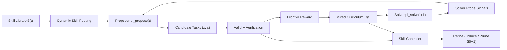

# Skill Self-Play：把 Agent 技能变成可验证的自博弈课程

## 元信息

- **标题**：Skill Self-Play: Pushing the Frontier of LLM Capability with Co-Evolving Skills
- **作者**：Siyuan Huang、Pengyu Cheng、Haotian Liu、Tao Chen、Yihao Liu、Jingwei Ni、Shijie Zhou、Ziyi Yang、Gangwei Jiang、Mengyu Zhou、Yu Cheng、Xiaoxi Jiang、Guanjun Jiang
- **机构**：Qwen Large Model Application Team, Alibaba；The Chinese University of Hong Kong；Renmin University of China；Sun Yat-sen University；Peking University；ETH Zürich；University of Zurich；University at Buffalo
- **日期证据**：arXiv v1 于 2026-07-24 17:59:22 UTC 提交，arXiv 页面在 2026-07-27 当前列表中可访问
- **原文**：[arXiv:2607.22529](https://arxiv.org/abs/2607.22529)
- **PDF**：[https://arxiv.org/pdf/2607.22529](https://arxiv.org/pdf/2607.22529)
- **代码链接状态**：论文给出 `https://github.com/Qwen-Applications/skill-self-play`，但本轮检查时 GitHub 仓库为空，尚不能复现训练流程或读取实现细节
- **类型**：论文
- **方向**：大模型后训练 / LLM Agent 自演化

## TL;DR

- **这篇论文要解决什么**：LLM 自博弈后训练正在从人工标注走向模型自己生成任务、自己求解、自己用验证器拿反馈；核心矛盾是“可靠验证”和“开放任务多样性”很难同时满足。
- **作者的切入点**：把 Agent 的 `skill` 形式化成可路由、可执行验证、可记录历史统计的任务模式接口，让技能不只是推理时的提示包，而是训练时构造课程的控制层。
- **核心方法**：Skill Self-Play（Skill-SP）同时训练 proposer 和 solver，并引入 skill controller 维护技能库；proposer 按技能生成候选任务，solver 多次探测任务难度，controller 根据失败轨迹、有效样本和统计量更新技能。
- **关键机制**：任务只有同时满足 schema 合规、合约有效、probe consistency，才会进入课程；proposer 奖励被有效性门控，再偏好 solver 成功率接近 0.5 的“学习前沿”任务。
- **训练设置**：实验跑 5 轮自博弈；工具调用每轮选 8,000 个任务，技能流和探索流比例为 0.5/0.5，用 10 次 solver probe 估计难度；逻辑推理每轮用 1,920 个 deterministic checker 验证的 ZebraLogic 谜题。
- **主要结果**：在 API-Bank/BFCL 工具调用上，Skill-SP 对五个 3B-14B backbone 全部提升，最大工具调用总体增益为 Ministral-3-8B 的 +42.9 点；在 ZebraLogic 逻辑推理上总体最高提升为 Ministral-3-14B 的 +12.0 点。
- **机制证据**：Qwen3-4B 工具调用诊断中，技能流生成任务的平均 solver 成功率约 0.57，更接近学习前沿；Unguided SP 和探索流分别漂到约 0.70 和 0.75，说明它们更容易产生偏简单任务。
- **局限**：方法仍需要 base model 有最低 bootstrap 能力；极复杂域可能要少量人工示例启动技能库；当前混合比例、难度阈值和路由参数仍是固定启发式；代码仓库本轮为空，复现实证仍待补齐。

## 研究问题：自博弈为什么卡在“窄而真”和“广而噪”之间？

### 作者真正反对的不是自博弈，而是两种不完整的自博弈

论文把现有路线拆成两个极端：

| 路线 | 优点 | 失败点 | 对后训练的含义 |
|---|---:|---:|---|
| 环境绑定自博弈 | 外部验证强，reward 可信 | 任务空间被代码执行器、游戏模拟器、搜索环境等固定域限制 | 能练出某类能力，但难以持续外扩到更开放的 Agent 任务 |
| 无引导任务生成 + 事后过滤 | 覆盖面广，生成成本低 | 过滤器通常只挡格式错，挡不住伪有效、过易、重复或不可解任务 | 合成数据会污染训练循环，proposer 可能学会 reward hacking |
| Skill-SP | 技能给结构先验和局部验证，探索流继续扩展空间 | 仍需要验证合约和最低基础能力 | 把“技能”从 prompt 资产推进为训练时课程接口 |

这篇论文的研究问题可以压缩为一句话：

> 如何让 LLM 在没有大量人工标注的情况下，持续生成既可验证、又足够多样、还处在 solver 学习边界上的任务？

### 论文的关键重定义：skill 不是工具，也不只是记忆

作者采用的 `skill` 更像一个可执行的任务模式包，而不是普通工具调用：

- **工具**：通常是单个 API 或函数，输入输出相对固定。
- **记忆**：通常保存过去轨迹、示例或偏好，容易变成检索片段。
- **Skill-SP 的 skill**：包含路由元数据、生成规则、提示、示例、验证器和历史统计，可以在任务生成前给 proposer 结构约束，也可以在任务生成后参与验证。

论文把每个技能写成：

```text
s = <m, r, h, e, nu, sigma>
```

变量含义如下：

| 符号 | 含义 | 在训练环里的角色 |
|---|---|---|
| `m` | routing metadata | 决定这个技能适合被路由到哪些生成尝试 |
| `r` | procedural rules | 告诉 proposer 如何构造某类任务 |
| `h` | generation hints | 约束生成难度、结构和常见陷阱 |
| `e` | few-shot examples | 给出可复用的任务模式示例 |
| `nu` | executable validators | 过滤 ill-posed contract、schema 错误或逻辑无解任务 |
| `sigma` | historical usage statistics | 记录尝试次数、验证成功、solver consistency、frontier difficulty 等统计 |

这个定义把技能从“推理时帮模型完成任务的说明书”改成“训练时约束数据生成、校验合约、调整课程难度的状态对象”。这是全文最重要的视角转换。

## 论文主张与论证路线

### Claim → Mechanism → Evidence → Boundary

| Claim | Mechanism | Evidence | Boundary |
|---|---|---|---|
| 可靠验证和开放多样性可以通过技能接口折中 | 技能流负责高保真任务，探索流负责发现新模式，二者混合成训练池 | API-Bank/BFCL 和 ZebraLogic 均提升；技能流任务更接近 0.5 学习前沿 | 只在可验证任务族上实证，开放写作、长期规划等弱验证任务尚未证明 |
| proposer 不应只追求“中等难度”，否则会造假难题 | 奖励先乘有效性门控，再计算 frontier score | Unguided SP 在逻辑推理域无法 bootstrap 有效谜题；工具调用也有退化子项 | 有效性依赖 schema、合约、probe 或 checker 的质量 |
| 技能库必须在线演化，而不是固定模板集 | controller 根据失败轨迹 refine，根据探索样本 induce，根据低收益 prune | Frozen skills 比 full system 低 2.3 点 overall；uniform routing 低 1.9 点 | 论文没有给出大规模跨域技能迁移实验证据 |
| proposer 和 solver 必须共同演进 | 当前 solver 给 proposer 提供动态难度信号，proposer 生成下一轮课程 | Frozen feedback solver 低 3.0 点，Frozen both 低 3.2 点 | 如果初始 solver 太弱，probe 信号可能不足以区分有效难题 |
| 技能演化开销可控 | 技能 induction/refinement 只占完整运行的一小部分 | 附录报告 skill-library evolution 合计 6.5% runtime | 完整 5 轮仍需 8 张 A800，工程门槛不低 |

### 作者如何说服读者？

论文的说服路径很清楚：

1. **先指出失真来源**：只优化难度会诱导 proposer 生成无效合约，事后过滤不足以主动指导任务模式。
2. **再提出中介对象**：skill 把散落在轨迹里的经验压缩成可复用、可验证、可统计的任务模式。
3. **然后给出闭环算法**：proposer、solver、controller 在同一自博弈循环里共同更新。
4. **最后用主结果和消融验证机制**：不是“有更多数据所以涨分”，而是动态路由、在线技能演化和反馈 solver 都有独立贡献。

## 方法机制：Skill-SP 的训练闭环

### 总览图：技能库不是旁路，而是课程引擎


这张图的核心信息不是“多了一个技能库”这么简单，而是技能库同时控制三类动作：

- **前向生成**：把技能路由给 proposer，让 proposer 按结构先验生成任务和隐藏验证合约。
- **中间过滤**：候选任务经过 validity verification，只有合格任务才进入后续排序。
- **反向更新**：失败样本、成功样本、任务统计会回流给 controller，用于 refine、induce、prune 技能。

用 Mermaid 表示，训练循环可以写成：



这里最值得注意的是，solver 不仅是被训练对象，也临时充当 proposer 的难度评估器。proposer 不是凭静态标签估计难度，而是用当前 solver 的多次 probe 得到经验成功率。

### 任务对象：prompt 和 hidden contract 分离

作者把可验证 Agent 任务形式化为：

```text
task = (x, c)
```

- `x`：solver 可见的标准 prompt。
- `c`：环境可读、solver 不可见的验证合约，例如 unit tests、reference answer、确定性 checker 的隐藏解。
- `y`：solver 针对 `x` 生成的回答。
- `R_solve(x, y, c)`：环境给出的验证奖励，取值在 `[0,1]`。

这个分离很重要：

- 如果 `c` 暴露给 solver，就会变成答案泄漏。
- 如果没有 `c`，reward 很难可靠自动化。
- 如果 `c` 是 proposer 随便编的，就可能出现伪有效任务，所以 Skill-SP 还要校验合约本身。

### Frontier reward：为什么目标是 0.5？

作者先定义当前 solver 在某个任务上的期望成功率：

```text
v_solve(x, c; pi_solve) = E_{y ~ pi_solve(.|x)} [ R_solve(x, y, c) ]
```

直觉上：

- `v_solve` 接近 1：任务太简单，训练信息少。
- `v_solve` 接近 0：任务可能太难，甚至可能无效。
- `v_solve` 接近 0.5：任务在当前 solver 的学习边界附近，最适合做课程样本。

因此 proposer 的难度项是：

```text
frontier_score = 1 - 2 * |v_solve - 0.5|
```

但只用这个分数会有漏洞：

- proposer 可以生成无解任务，让 solver 成功率接近 0。
- proposer 可以生成歧义合约，让多数投票看起来困难。
- proposer 可以生成格式上像任务、语义上不可验证的样本。

所以论文真正用的是 gated reward：

```text
R_propose(x, c; pi_solve)
  = 1{(x, c) is valid} * (1 - 2 * |v_solve(x, c; pi_solve) - 1/2|)
```

这里 `1{valid}` 是全文的安全阀。没有它，frontier reward 会奖励“坏难题”；有了它，proposer 只能在有效任务集合里追逐学习前沿。

### Validity verification：三重门控挡住哪些坏样本？

对 skill stream 生成的任务，valid event 是三个条件的交集：

```text
valid = schema_compliant ∩ contract_valid ∩ probe_consistent
```

拆开看：

| 条件 | 检查对象 | 防止什么失败 |
|---|---|---|
| schema compliant | 全局任务结构、字段、格式 | 任务记录不可解析、工具调用格式不合规 |
| contract valid | 技能包内的 validator `nu` | reference answer 错误、约束无解、合约与任务不匹配 |
| probe consistent | 当前 solver 的 K 次 rollout 多数答案唯一，且匹配 reference | 多解、歧义、随机猜中、伪有效任务 |

探索流没有技能包内的专用 validator，所以它的验证更弱：

- 仍要求全局 schema 合法。
- 仍用 solver consistency 或 deterministic checker。
- 但少了 skill-specific validation。

这也是为什么论文坚持双流混合，而不是只保留探索流。探索流发现新模式，技能流把模式固化成可验证接口。

## 算法流程：proposer、solver、controller 如何共同更新？

### 伪代码：一轮 Skill-SP 到底做了什么

```text
Input:
  initial proposer pi_propose(0)
  initial solver pi_solve(0)
  initial skill library S(0)
  iterations T, pool size M, mix ratio alpha, probe count K

State:
  S(t): skills with metadata, rules, examples, validators, statistics
  T_skill(t): valid candidates from skill-conditioned generation
  T_explore(t): valid candidates from open-ended exploration
  D(t): mixed frontier curriculum

For t = 0 ... T-1:
  1. Skill stream:
     - sample skill s ~ S(t) using routing statistics sigma
     - proposer generates (x, c) conditioned on s
     - solver runs K probes on x
     - compute validity mask and R_propose
     - keep valid (x, c, s) in T_skill(t)

  2. Exploration stream:
     - proposer generates (x, c) without skill constraints
     - solver runs K probes or deterministic checker validates it
     - keep valid (x, c) in T_explore(t)

  3. Curriculum construction:
     - rank valid candidates by R_propose
     - choose alpha*M from skill stream
     - choose (1-alpha)*M from exploration stream
     - form D(t)

  4. Policy updates:
     - update proposer with GRPO using gated frontier reward
     - update solver with GRPO using environment reward on D(t)

  5. Skill evolution:
     - update sigma from routed attempts
     - refine skills from invalid attempts and accepted traces
     - induce new skills from high-quality exploration samples
     - prune saturated skills below gamma_prune

Output:
  final solver pi_solve(T)

Failure boundary:
  If validators are weak, invalid tasks can still enter.
  If solver is too weak, K probes cannot provide useful frontier signals.
  If exploration stream is too narrow, new skill induction stagnates.
```

### 混合课程：为什么不能只用 skill stream？

训练池写成：

```text
D(t) =
  Top_{alpha M}(T_skill(t); R_propose)
  ∪
  Top_{(1-alpha) M}(T_explore(t); R_propose)
```

实验里工具调用使用：

- `M = 8,000` accepted tasks per iteration。
- `alpha = 0.5`，也就是技能流和探索流各占一半。
- `K = 10` frozen-solver responses 来估计候选任务难度和一致性。

这个设计的意义：

- **只用 skill stream**：任务高保真，但容易围绕已有技能模板过拟合。
- **只用 exploration stream**：覆盖面广，但验证弱、噪声高，可能生成大量伪有效任务。
- **混合流**：skill stream 给稳定学习信号，exploration stream 给新模式；新模式再被 controller 抽象成下一轮 skill。

论文的 skill-only 消融也印证了这一点：只用技能库生成数据会削弱 API-Bank 泛化能力，说明技能包本身不能替代开放探索。

### 动态路由：如何避免少数技能垄断训练？

附录给了一个清楚的路由公式。对第 `j` 个技能，统计：

- `a_j`：历史选择尝试次数。
- `n_j^ver`：结构验证成功次数。
- `n_j^con`：solver consistency 成功次数。
- `n_j^fd`：frontier difficulty 成功次数。

先用 Beta smoothing 降低早期小样本方差：

```text
r_hat_j^o = (n_j^o + kappa/2) / (a_j + kappa),
o in {ver, con, fd}
```

再计算技能质量：

```text
v_skill(s_j)
  = 1/2 * r_hat_j^ver
  + 1/4 * r_hat_j^con
  + 1/4 * r_hat_j^fd
```

最后给低尝试技能加探索 bonus：

```text
w(s_j)
  = clip(v_skill(s_j), w_min, w_max) * (1 + beta * exp(-a_j / tau))

P(s_j) = w(s_j) / sum_l w(s_l)
```

实验参数是：

| 参数 | 取值 | 作用 |
|---|---:|---|
| `kappa` | 4 | 平滑早期统计，避免一次成功或失败支配路由 |
| `w_min, w_max` | 0.25, 1.75 | 限制路由权重极端值 |
| `beta` | 1 | 控制初始探索 bonus |
| `tau` | 8 | 控制探索 bonus 衰减速度 |
| age decay | disabled | 本实验未启用年龄衰减 |

这个路由器不是复杂 bandit，但已经把三个信号区分开：

- 能不能生成结构合规任务。
- 能不能通过 solver consistency。
- 能不能落在学习前沿。

因此它不是按“哪个技能看起来常用”路由，而是按“哪个技能正在产出有效课程样本”路由。

## 实验设置：论文怎样验证方法？

### 任务族与 benchmark

| 任务族 | Benchmark | 评测能力 | 指标 |
|---|---|---|---|
| 工具调用预测 | API-Bank Level 1-3 | 工具选择、参数 grounding、schema adherence | level accuracy、average |
| 工具调用预测 | BFCL simple JavaScript / Python / Java / live simple | 跨函数描述和类别的泛化 | category accuracy、BFCL average |
| 逻辑推理 | ZebraLogic | 约束追踪、唯一解推理、完整 grid 输出 | grid-level accuracy、cell-level accuracy |

这三个 benchmark 的共同点是可验证：

- API-Bank 和 BFCL 可以 exact-match 工具名与 JSON 参数。
- ZebraLogic 可以用确定性 checker 检查 schema、约束有效性、唯一解和最终答案。
- 这让 Skill-SP 的自博弈 reward 不依赖人类偏好模型，也不需要开放式主观评分。

### Backbone 与训练协议

作者测试了五个开源 backbone：

- Qwen3-4B-Instruct
- Qwen3-8B
- Ministral-3-8B-Instruct
- Ministral-3-14B-Instruct
- Granite-4.1-3B

训练协议的关键数字：

| 设置 | 工具调用 | 逻辑推理 |
|---|---:|---:|
| 自博弈轮数 | 5 | 5 |
| proposer GRPO rollouts | 4 | 4 |
| solver rollouts | 5 | 5 |
| proposer update steps / iter | 5 | 3 |
| solver update steps / iter | 15 | 10 |
| 每轮训练池 | 8,000 accepted tasks | 1,920 checker-verified puzzles |
| 过滤 | K=10 solver probes，保留 `v_solve ∈ [0.25, 0.75]` | deterministic puzzle checker |
| 优化器 | AdamW, lr `1e-6`, weight decay `1e-2`, grad clip `1.0`, KL coeff `1e-2` | 同左 |
| 评测 | avg@8, temperature 1.0, top-p 1.0, top-k 40 | 同左 |

作者还说明：

- proposer 和 solver 初始使用同一个 checkpoint。
- skill refinement 和 induction 只用 backbone 自己，不依赖更强外部 teacher。
- final solver 在训练和评测时不接收 skill package context；它只看标准 prompt `x`。

最后一点非常关键。否则读者会怀疑提升来自推理时额外上下文，而不是训练后 solver 能力变化。论文把 skill 只放在训练数据生成侧，避免把 skill retrieval 直接当作评测外挂。

## 主结果：Skill-SP 改善了什么能力？

### 工具调用：最大亮点是弱 schema model 被“救回来”

工具调用主表显示，Skill-SP 对五个 backbone 全部提升：

| Backbone | Base Avg | Unguided SP Avg | Skill-SP Avg | Skill-SP 增益 |
|---|---:|---:|---:|---:|
| Qwen3-4B-Ins | 60.2 | 64.1 | 66.7 | +6.5 |
| Qwen3-8B | 69.4 | 71.0 | 72.2 | +2.8 |
| Ministral-3-8B | 20.7 | 20.8 | 63.6 | +42.9 |
| Ministral-3-14B | 22.2 | 59.0 | 64.5 | +42.3 |
| Granite-4.1-3B | 57.2 | 58.2 | 62.5 | +5.3 |

最值得读的是 Ministral-3-8B：

- Base 总体只有 20.7。
- Unguided SP 几乎不动，只到 20.8。
- Skill-SP 直接到 63.6，增益 +42.9。

这说明作者想证明的不是“强模型再涨一点”，而是：

- 对 schema adherence 很差的初始模型，普通无引导自博弈无法产生足够有效任务。
- 技能约束能给 proposer 足够结构，使它不再饿死训练循环。
- 一旦训练池有效，solver 可以快速学到工具调用格式、函数选择和参数 grounding。

但结果也有边界：

- Ministral-3-14B 的 Unguided SP 已经从 22.2 到 59.0，说明有些模型并非必须依赖技能才能 bootstrap。
- Granite 的 BFCL Java 子项只有 +0.5，说明不是所有类别都有大幅提升。
- Qwen3-8B 已经较强，边际增益只有 +2.8，这符合课程学习接近 ceiling 时的收益递减。

### 逻辑推理：小规模谜题提升明显，大规模仍困难

ZebraLogic 主表更能看出能力边界：

| Backbone | Base Overall | Skill-SP Overall | Overall 增益 | 最明显子项 |
|---|---:|---:|---:|---|
| Qwen3-4B-Ins | 72.1 | 73.5 | +1.4 | X-Large +3.2，Cell +3.9 |
| Qwen3-8B | 23.6 | 32.4 | +8.8 | Small +14.8，Medium +13.4 |
| Ministral-3-8B | 5.0 | 11.2 | +6.2 | Small +18.7，Cell +20.0 |
| Ministral-3-14B | 5.4 | 17.4 | +12.0 | Small +35.3，Cell +19.1 |
| Granite-4.1-3B | 11.6 | 12.6 | +1.0 | Small +3.0 |

这里有两个观察：

- **Skill-SP 对 Small/Medium 更有效**：例如 Ministral-3-14B 的 Small 从 14.9 到 50.2，说明生成有效、唯一解、适中难度的谜题确实能改善约束推理。
- **Large/X-Large 仍然很硬**：很多弱模型在 X-Large 上仍为 0.0，Large 也常接近 0。这说明 self-play 不是魔法；当基础模型无法稳定理解复杂约束时，课程很难直接跨越推理深度鸿沟。

因此这组结果的正确解读是：

- Skill-SP 能把可验证任务族内的学习信号组织得更好。
- 它不能保证弱模型在超大搜索空间约束题上突然具备深推理。
- 它的“开放前沿”仍然受任务验证器、模型初始能力和采样预算共同约束。

## 消融：哪些组件真的有贡献？

### 不是“多训练一轮”这么简单

Qwen3-4B 工具调用消融表给了四个关键对照：

| 变体 | Overall | 相对 Full System |
|---|---:|---:|
| Full System | 66.7 | 0 |
| Unguided SP | 64.1 | -2.6 |
| Uniform routing | 64.8 | -1.9 |
| Frozen skills | 64.4 | -2.3 |

这组结果支撑三个判断：

- **去掉 skill orchestration 会掉分**：Unguided SP 低 2.6 点，说明被动过滤不是充分条件。
- **路由不能均匀采样**：Uniform routing 低 1.9 点，说明历史统计和探索 bonus 确实在调度训练预算。
- **技能不能冻结**：Frozen skills 低 2.3 点，说明初始 15 个工具调用技能包不是主要收益来源，在线演化才是核心。

### proposer 和 feedback solver 的耦合是必要的

另一个消融固定不同组件：

| 变体 | Overall | 相对 Full System | 说明 |
|---|---:|---:|---|
| Full System | 66.7 | 0 | proposer、solver、skill library 都更新 |
| Frozen proposer | 64.6 | -2.1 | generator 不学习，无法利用演化后的技能 |
| Frozen feedback solver | 63.7 | -3.0 | proposer 看到的是过期难度边界 |
| Frozen both | 63.5 | -3.2 | 自博弈退化成近似静态数据生成 |

最重要的是 Frozen feedback solver：

- 如果 solver probe 不更新，proposer 仍会按旧模型的能力边界选题。
- 对新 solver 来说，这些任务可能太易或太难。
- 课程不再贴着学习前沿移动。

这解释了 Skill-SP 为什么必须是 co-evolution，而不是“先生成技能，再训练 solver”的两阶段管线。

## Figure/Table 证据逐项解读

### Figure 1：三种自演化路线的失败边界

Figure 1 的左、中、右分别对应：

- **Environment-bound**：验证可靠，但任务空间窄。
- **Unguided generation**：覆盖广，但 post-hoc filter 是被动筛子，残余错误会进入训练。
- **Skill Self-Play**：skill orchestrator 同时负责 skill-guided generation 和 open-ended exploration，把“生成前结构约束”和“生成后验证”放到同一闭环。

它支持的 claim 是：

- 技能不是为了替代环境验证，而是把验证边界和任务模式包装成可演化接口。

它不能证明的是：

- 所有开放任务都能被技能化。
- 技能生成出的 validator 一定可靠。

### Figure 2：Qwen3-4B 的能力雷达图

Figure 2 展示 Qwen3-4B-Instruct 在工具调用和逻辑推理上的 footprint：

- Skill-SP 覆盖了 API-Bank、BFCL、ZebraLogic 多类指标。
- Unguided SP 在逻辑推理上缺席，因为它无法合成有效 puzzle。

这张图的论证功能是：

- 不是只在单一工具调用格式上涨分。
- 当任务结构要求更强时，无引导生成会直接失去训练循环。

边界是：

- 雷达图只展示一个 backbone 的 footprint，跨模型结论仍要看主表。

### Table 1：工具调用主结果

Table 1 支持最强的工程结论：

- Skill-SP 对所有 backbone 都是正增益。
- 对初始 schema adherence 弱的 Ministral 系列尤其明显。
- Unguided SP 有时也能提升，但不稳定，且无法救回 Ministral-3-8B。

不能过度推断的是：

- 这些指标是 tool-call prediction，不等价于完整多步 Agent 执行成功率。
- API-Bank/BFCL 的 exact-match reward 与真实环境调用失败之间还有距离。

### Table 2：ZebraLogic 主结果

Table 2 支持的是“可验证逻辑任务也能用技能课程”：

- Qwen3-8B Overall +8.8。
- Ministral-3-14B Overall +12.0。
- 弱模型 cell-level 有明显提升，说明至少学到部分约束填充。

不能证明的是：

- Skill-SP 已解决长链组合推理。
- 大搜索空间谜题上的 0.0 或接近 0.0 结果提醒我们：训练信号仍受模型基础能力限制。

### Figure 3：课程质量和技能生命周期

Figure 3 是机制诊断，不只是效果图：

- **Frontier proximity**：技能流平均 `v_solve ≈ 0.57`，比 Unguided SP 的约 0.70、探索流的约 0.75 更贴近 0.5。
- **Task diversity**：用 all-MiniLM-L6-v2 编码问题，再 PCA 投影，Skill-SP mixed pool 覆盖更广，Unguided SP 聚类更窄。
- **Skill lifecycle**：五轮中持续 induction、update、retirement，说明技能库在动，而不是静态 prompt bank。

这组证据支撑“Skill-SP 是课程引擎”的说法：

- 它不仅保留正确样本。
- 它持续把样本推到当前 solver 的学习边界附近。
- 它还用探索样本扩展未来的技能空间。

### Figure 4：技能利用率

Figure 4 报告：

- active skills 到五轮后增长到 86。
- effective skills 用 Shannon entropy 的指数形式衡量，增长到 46。

公式是：

```text
N_eff = exp(- sum_j p_j * log p_j)
```

其中：

- `p_j` 是第 `j` 个技能在 accepted records 中的频率占比。
- `N_eff` 越大，说明样本不是集中在少数技能上。

这张图的意义：

- 技能库扩张不是“挂了很多不用的技能”。
- 至少有相当数量的技能在有效贡献训练样本。

边界是：

- entropy 只能说明使用分布更均衡，不能单独证明每个技能语义上都有独特价值。

## 失败案例与边界：论文没有完全解决什么？

### 1. 最低能力门槛仍然存在

作者在 limitations 里明确说：

- 发现全新任务模式需要 base model 具备最低基础能力。
- 极复杂领域可能需要少量人工 demonstrations 来启动技能库。

实验表也支持这一点：

- 弱模型在 ZebraLogic X-Large 上基本没有突破。
- Large 规模上很多增益也很小。

这说明 Skill-SP 更像“把可学习信号组织得更密、更准”，不是绕过基础模型能力上限。

### 2. 固定启发式还没有被学习化

当前实现中仍有不少固定参数：

- `alpha = 0.5` 的技能流 / 探索流混合比例。
- `v_solve ∈ [0.25, 0.75]` 的 frontier 过滤范围。
- `kappa = 4`、`beta = 1`、`tau = 8` 的路由参数。
- `gamma_prune` 和 `gamma_induce` 等技能生命周期阈值。

这些参数在 API-Bank、BFCL、ZebraLogic 上可行，但换到网页 Agent、长程代码修改、多工具企业流程时，可能需要重新调。

### 3. 验证器质量决定上限

Skill-SP 的所有 reward 都依赖 `c` 和 validator：

- 工具调用 exact-match 容易自动验证。
- ZebraLogic 有确定性 checker。
- 但开放式任务很难写出完备 verifier。

如果 validator 漏检，Skill-SP 仍可能把伪有效任务固化成技能。技能包反而会扩大错误模式的生命周期，因为它会被路由、复用、统计和 refine。

### 4. 代码仓库为空，复现证据还不完整

论文声称代码可用，但本轮检查 GitHub 仓库时：

- repository 存在。
- size 为 0。
- Web 页面显示 empty repository。

因此当前只能根据论文和 TeX 源判断方法与实验，不能独立检查：

- 数据生成脚本。
- validator 实现。
- GRPO 训练配置。
- 日志与随机种子。
- 技能 induction/refinement prompt。

对一篇强调训练闭环和数据质量的论文来说，代码未开放是重要边界。

## 相关工作位置：Skill-SP 和其他自演化路线的区别

### 与外部 verifier 自博弈相比

论文把 Absolute Zero、verified-code pipelines、SPIRAL、MARSHAL、Search Self-play 等放在同一类：

- 它们的共同优势是验证强。
- 共同弱点是任务分布被环境类型限制。

Skill-SP 的区别是：

- 不把 verifier 固定成一个外部世界。
- 而是把可验证模式封装进技能库，让模式本身可被 induction、refinement、pruning。

### 与合成任务过滤相比

普通 pipeline 往往是：

```text
generate many tasks -> filter bad tasks -> train
```

Skill-SP 更像：

```text
skill routes generation -> validate task contract -> estimate learning frontier -> train -> update skill
```

差别在于：

- 过滤器是事后的。
- 技能是生成前和生成后的双向接口。

### 与 inference-time skill retrieval 相比

很多 Agent skill 工作关心：

- 怎么压缩操作经验。
- 怎么检索技能。
- 怎么在推理时降低上下文长度。
- 怎么把轨迹变成可复用说明。

Skill-SP 的新意是：

- 技能主要服务训练数据构造，而不是推理时直接加载。
- final solver 不看 skill context，这让提升更接近参数内化。
- 技能库本身成为课程状态，而不是外部记忆库。

## 研究者视角：这篇论文对后训练和 Agent 安全意味着什么？

### 对后训练：把“数据配方”变成“可演化状态”

传统后训练很强调：

- 数据来源。
- reward 设计。
- 采样比例。
- 过滤规则。

Skill-SP 暗示一个新方向：

- 数据配方不必是静态表格。
- 它可以成为有状态对象。
- 每个技能记录自己产出过多少有效样本、是否还在学习前沿、是否已经过时。

这让后训练从“准备一个 dataset”变成“维护一个 curriculum state machine”。

### 对 Agent：技能不是越多越好，关键是边际训练价值

Agent 系统常会堆很多 skills、tools、memory snippets。Skill-SP 的消融提醒我们：

- 固定技能库不够。
- 均匀路由不够。
- 只靠技能流会过专门化。
- 技能是否有价值，要看它是否持续产生有效、适中难度、多样的训练任务。

这对实际 Agent 框架也有启发：

- skill registry 应该记录成功率、失败类型、适用范围和退役条件。
- skill retrieval 不应只按语义相似度，还要按历史边际收益。
- 新技能应该先经过验证和影子评估，再进入生产路由。

### 对 AI 安全：可验证合约是自演化系统的边界对象

Skill-SP 不是安全论文，但它触及自演化 Agent 的安全核心：

- proposer 可以 reward hack。
- synthetic data 可以 collapse。
- 伪有效任务可以污染未来训练。
- 技能库可以把错误模式制度化。

因此，安全上真正重要的对象不是“模型是否会生成任务”，而是：

| 安全对象 | 需要审计的问题 |
|---|---|
| hidden contract `c` | 是否泄漏答案？是否定义了错误目标？是否能被 solver exploit？ |
| validator `nu` | 是否只检查格式、不检查语义？是否有多解或伪解？ |
| routing statistics `sigma` | 是否把短期高 reward 的坏技能放大？ |
| induction pipeline | 是否会把偶然成功或 spurious pattern 固化成技能？ |
| pruning policy | 是否会过早淘汰困难但重要的能力区域？ |

如果未来把 Skill-SP 用到浏览器 Agent、代码修改 Agent 或企业自动化 Agent，验证合约就必须包含权限、状态变更、回滚、审计日志和副作用边界。否则，训练出的 solver 可能只是更擅长满足局部 verifier，而不是更可靠地完成真实任务。

## 结论

### 我认为这篇论文最值得带走的三点

1. **技能可以成为训练时的课程接口**：Skill-SP 把 skill 从 prompt-time helper 推到 training-time controller，让技能负责生成前约束、生成后验证和跨轮统计。
2. **自博弈的关键不是生成更多任务，而是生成当前 solver 刚好学得动的有效任务**：gated frontier reward 是全文最核心的数学对象。
3. **在线演化比静态技能库重要**：Frozen skills、Uniform routing、Frozen feedback solver 都掉分，说明动态路由、技能生命周期和反馈 solver 共同构成方法主体。

### 继续追问

- 能否把 `alpha`、frontier range、routing weights 从启发式改成可学习 scheduler？
- 能否让 validator 也被自动合成并被独立验证，而不是依赖任务族已有 checker？
- 技能库跨模型迁移时，哪些技能是 universal procedural pattern，哪些只是某个 backbone 的训练偏差？
- 在长程 Agent 任务中，hidden contract 如何覆盖中间状态、副作用、权限和恢复路径？
- 如果技能 induction 错误，系统如何发现并回滚被污染的技能 lineage？

这篇论文的价值不在于宣称“自演化已经解决”，而在于给了一个可讨论、可消融、可审计的训练闭环：技能库是状态，验证合约是边界，frontier reward 是课程目标，proposer 和 solver 的共同演进是能力增长机制。
