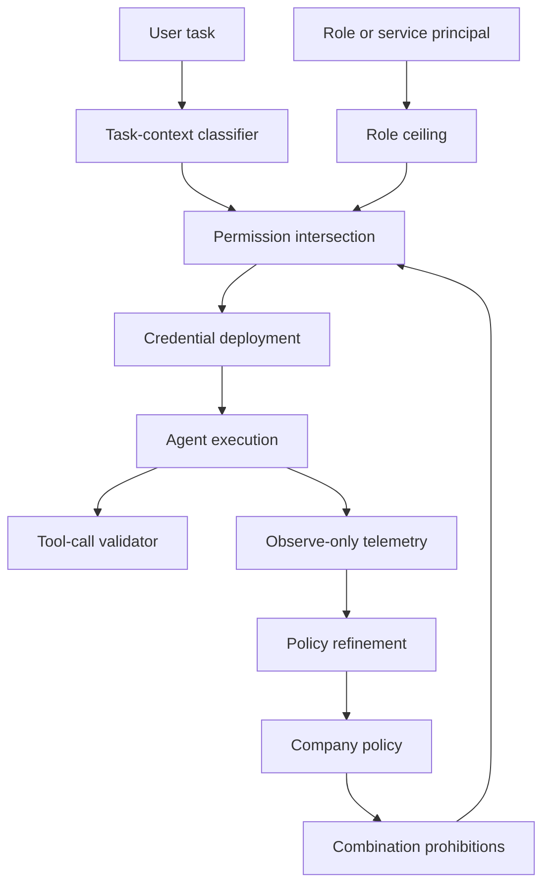

# Dynamic Capability Scoping：把企业 AI Agent 的权限从“角色静态包”改成“任务级交集”

## 元信息

- **论文**：Dynamic Capability Scoping for Enterprise AI Agents: A Synthetic Dataset and Three-Source Permission Architecture
- **作者**：Halil Burak Noyan
- **时间**：arXiv v1 提交于 2026-07-24 16:08:03 UTC，发表于 ICML 2026 AIWILD Workshop
- **原文**：https://arxiv.org/abs/2607.22445
- **开源仓库**：https://github.com/0xballistics/mostargate
- **分类**：AI 安全 / Agent 权限控制 / 动态最小权限 / 合成数据集

## TL;DR

- 这篇论文要解决的问题不是“如何检测 Agent 做坏事”，而是“为什么 Agent 一开始就持有本任务不需要的凭证”。作者把这种缺口称为 **context-privilege mismatch**：角色可能需要某些工具，不代表当前任务也需要。
- 方法是一个三源权限架构：**角色上限**给出硬边界，**任务上下文分类器**预测当前任务所需工具，**策略组合禁止**删除危险权限组合；最终授权是三者的交集。
- 数据贡献是 `mostargate`：600 条企业任务 prompt，覆盖 Engineering、Data and Analytics、Security、Customer Success、Finance、Legal and Compliance 六个部门；每条标注 15 个可部署权限中的最小必需集合。
- 证据来自两层验证：一是两阶段生成把 prompt 生成和权限标注拆开，避免模型按标签倒推 prompt；二是 60 条样本、688 个 in-ceiling 二元决策的人审验证，pre-review Cohen's κ=0.917，post-review κ=0.967。
- 最关键数字不是单纯准确率，而是安全侧 overshoot：severity-weighted overshoot 从 15.0 降到 2.0，降幅 86.7%；数据集和策略迭代还把 ceiling violations 从 46 降到 3，降幅 93%。
- 局限也很明确：论文当前证明的是数据集和方法论可用于训练/评估动态 scoping，不是证明三源架构已经在真实企业 Agent 中降低攻击成功率；任务上下文分类器仍可能被 prompt injection 影响，单 reviewer 人审也不足以给出最终可靠性结论。

## 1. 论文真正关心的问题是什么？

### 从“监控 Agent”转向“不给它凭证”

很多 Agent 安全工作默认把问题放在运行时：

- 看输入是否危险。
- 看输出是否泄漏。
- 看工具调用是否异常。
- 看 chain-of-thought 或轨迹是否偏离任务。

这篇论文把起点前移：

- 如果一个文档总结任务没有外部网络访问的业务理由，`http_request` 就不应该进入 Agent 上下文。
- 如果 Legal 部门不应该直接查数据库，`database_read` 就不应该因为“公司里有人会查数据库”而出现在 Legal Agent 的角色包里。
- 如果一个 Agent 同时拥有私有数据、非可信内容、外部发送能力，那么间接 prompt injection 不再只是文本过滤问题，而是权限组合已经满足泄漏路径。

作者的核心判断可以写成一句工程规则：

> Agent 可以规避检测，但不能调用不存在的凭证。

这句话也是本文和传统 guardrail 的分界：

| 防线 | 典型问题 | 本文的重新定位 |
|---|---|---|
| 输入/输出过滤 | 依赖分类器识别危险文本 | 仍有价值，但属于事后或运行时防线 |
| 行为监控 | 需要发现异常轨迹 | 对会规避监控的 Agent 有结构上限 |
| 动态权限裁剪 | 直接减少可用攻击面 | 把安全问题前移到 credential deployment |

### 威胁模型有哪些边界？

论文假设的是企业内部部署的多个 LLM Agent 节点：

- Agent 可代表员工执行业务操作。
- 可用资产包括 GitHub、Jira、Confluence、Salesforce、Snowflake/PostgreSQL、Slack、Email、HTTP、上传文件、代码执行环境。
- 攻击者是 misaligned LLM 或被污染/被劫持的 Agent。
- 攻击向量包括间接 prompt injection、side-task execution、tool-output poisoning、恶意工具定义、Agent 供应链污染。

这个威胁模型故意排除了一个更难问题：

- **完全自治 service agent** 的身份建模没有展开。
- 作者只说应把它们建成 service-level principal，并用自己的 IAM ceiling，而不是套在人类部门角色上。

这个边界很重要，因为它限制了论文结论：

- 对员工任务型 Agent，三源权限可以从用户任务和部门上下文推导。
- 对长期自治 Agent，仅凭初始自然语言任务可能不足，需要更强的状态机、会话分段和阶段性再授权。

## 2. 三源架构：权限不是一个分类器决定的

### 形式化成一个交集

论文的架构可以写成集合公式：

```text
Granted(task, role, policy)
  = Ceiling(role)
    ∩ Classifier(task, role)
    ∩ AllowedByPolicyCombinations(policy)
```

变量解释：

| 变量 | 含义 | 失败模式 |
|---|---|---|
| `Ceiling(role)` | 部门或 service principal 的最大授权边界 | 不能区分同一角色下不同任务 |
| `Classifier(task, role)` | 根据任务描述预测当前任务需要哪些工具 | 会受自然语言污染、prompt injection、上下文操纵影响 |
| `AllowedByPolicyCombinations(policy)` | 删除违反组织策略的权限组合 | 确定性但粗糙，容易误伤合法工作流 |
| `Granted` | 实际部署给 Agent 的凭证集合 | 需要在安全和可用性之间调阈值 |

作者强调三者必须组合使用：

- 只用角色上限，会把“角色可能需要”的工具都给当前任务。
- 只用任务分类器，会把自然语言分类器暴露给 prompt injection。
- 只用组合禁止，粒度可能太粗，无法表达具体任务需要。

### Source 1：Role-Based Ceiling

角色上限是一个确定性 lookup：

- Engineering 可以有 `github_read`、`pull_request_create`、`code_execute`、`database_read` 等。
- Legal and Compliance 没有 `database_read`，因为公司 policy 规定 Legal 对 GDPR 数据请求应通过 Data and Analytics 发起正式请求。
- Finance 不访问代码，但可以有 `database_read`、`email_send_external`、`jira_write`。

这个设计的意义不是精细化，而是硬上限：

- 下游分类器再“想给”，也不能超过 ceiling。
- Agent 自己不能声明“我需要更多权限”。
- 多 Agent 或 service agent 场景下，ceiling 应绑定 service principal，而不是随便借用某个部门角色。

### Source 2：Task-Context Classifier

第二源是精细层：

- 输入：用户任务描述和部门上下文。
- 输出：15 个权限的 multi-label 预测及置信度。
- 执行：orchestrator 按风险等级设置不对称阈值。

不对称阈值的工程含义是：

| 权限风险 | 示例 | 阈值策略 |
|---|---|---|
| Tier 1 Default Deny | `database_read`、`email_send_external`、`http_request`、`pull_request_create` | 高置信才授予 |
| Tier 2 Grant With Justification | `github_read`、`code_execute`、`slack_write`、`email_read`、`export_file` | 需要理由或中高置信 |
| Tier 3 Default Permit | `confluence_read`、`jira_read`、`file_read_uploaded` | 较低阈值，减少常见任务破坏 |

论文中特别强调：

- 分类器是 Agent 外部组件。
- Agent 不参与声明自身权限。
- 预测发生在任务开始前，而不是根据 Agent 的每次 action 事后生成 policy。

这和很多“每个 action 生成一次 just-in-time policy”的方法不同。本文牺牲了一部分动态性，换来更清晰的部署边界：任务开始时只部署最小 credential set。

### Source 3：Policy-Based Combination Prohibitions

第三源处理的是组合风险。

作者借用 “lethal trifecta”：

- 私有数据访问。
- 暴露给不可信内容。
- 外部通信能力。

在 TechCorp policy 中，一个典型禁止是：

```text
database_read ∧ (email_send_external ∨ http_request) => deny external channel
```

这不是说数据库读取或 HTTP 请求单独非法，而是二者在某些上下文中组合后变成可执行的静默外泄路径。

论文给了一个很具体的例子：

- 漏洞管理 Agent 需要搜索 CVE，并检查训练流水线是否使用有漏洞的 Keras。
- 它可能同时需要模型权重或内部依赖信息，以及外部 HTTP。
- 如果这个 Agent 是 deceptive，它可以把模型权重外传，绕过 Source 1 和 Source 2 的任务合理性。

因此 Source 3 的职责不是理解“这个任务看起来合理”，而是问：

- 这个权限组合是否在组织 policy 中被明确允许？
- 是否需要更细粒度参数，比如只允许内部 VPC endpoint，不允许公网 HTTP？
- 如果 policy 没有区分内部 webhook 和公网请求，是否应先修 policy，而不是直接部署二元禁止？

## 3. 部署模式：enforcing 与 observe-only

论文没有假设企业一上来就阻断生产任务，而是提供两种模式。

| 模式 | 实际凭证 | 系统动作 | 适合阶段 |
|---|---|---|---|
| enforcing | 只部署三源交集后的凭证 | 拦截集合外工具调用 | 高风险环境、规则成熟后 |
| observe-only | 仍部署完整 role ceiling | 同时计算三源输出，记录本应被拒绝的调用 | 灰度验证、避免 undershoot 破坏业务 |

observe-only 的价值不只是迁移成本低：

- 它能生成“Agent 请求了不符合任务上下文的工具”这种结构化事件。
- 这种事件比普通文本监控更接近安全边界，因为它直接关联具体 credential。
- 对 alignment 研究来说，它是一个行为信号：模型是否在看似正常任务中尝试扩大权限。

可以把它类比成 SELinux permissive mode：

- 先记录 policy hit。
- 观察误报和漏报。
- 再逐步转向 enforcing。

## 4. 数据集：为什么要做 `mostargate`？

### 600 条企业任务 prompt 的构造

数据集不是从真实公司日志收集，而是合成生成：

- 公司：虚构的中型 SaaS 公司 TechCorp，约 600 名员工。
- 部门：Engineering、Data and Analytics、Security、Customer Success、Finance、Legal and Compliance。
- 数据：600 条任务 prompt。
- 权限：15 个可部署工具权限。
- 开源内容：`dataset.json`、`train.json`、`test.json`、`validation_sample.json`、`validation_results.json`、`disagreements.json`、指标 JSON 和图表 PDF。

部门设计不是装饰，而是为了覆盖权限组合：

| 部门 | 高价值场景 | 权限张力 |
|---|---|---|
| Engineering | 调试生产问题、读代码、提交 PR、查指标 | 代码执行和数据库读同时出现，容易过宽 |
| Data and Analytics | 查询 Snowflake/PostgreSQL、生成报告、外部 benchmark | 数据读和外部发送/HTTP 的组合风险 |
| Security | 查 CVE、读 IAM policy、跑诊断脚本、发审计材料 | 安全文件、HTTP、代码执行和外部邮件共存 |
| Customer Success | 读 CRM、客户健康度、外部邮件 | Salesforce、数据库读、外发邮件边界 |
| Finance | 工资、发票、预算、银行/审计邮件 | 高敏数据和外发能力共存 |
| Legal and Compliance | 合同、监管回复、GDPR 请求 | 应读文件和政策，但不应直接查数据库 |

### 两阶段生成管线

论文最值得注意的设计是把生成拆成两次 LLM 调用：

```text
Input:
  company_policy
  department_allocation
  permission_taxonomy

Pass 1:
  generate task prompts only
  no permission taxonomy visible

Pass 2:
  label minimum required permissions
  input = policy + prompt + taxonomy + labeling rules
  do not encode Source 3 combination prohibitions into labels

Output:
  prompt
  department
  permissions[15]
  sensitivity metadata
  reasoning / validation artifacts
```

这避免了一个常见数据集漏洞：

- 如果同一个 prompt 里既要求模型生成任务又要求它生成标签，模型可能反向构造“符合标签的任务”。
- 拆成两 pass 后，Pass 1 不知道权限 taxonomy，生成的任务更像部门自然语言需求。
- Pass 2 再独立判断最小权限，标签和 prompt 的关系更接近真实分类问题。

批次分配也有意偏置：

- 每 20 条 prompt 中，Engineering 5 条。
- Customer Success 4 条。
- Data and Analytics、Security、Finance 各 3 条。
- Legal 2 条。
- 共 30 个 batch，得到 600 条。

这不是按员工人数采样。作者解释是小部门更容易产生高敏数据和外部通信任务，所以需要过采样，才能覆盖安全关键权限。

## 5. 权限 taxonomy：15 个“能部署”的权限，而不是抽象能力词

仓库 `mostargate/constants.py` 里把权限映射到具体 credential 类型。

| 类别 | 权限 | 可部署含义 |
|---|---|---|
| Code | `github_read` | GitHub read-scope PAT，用于读代码和 PR |
| Code | `pull_request_create` | GitHub write-scope PAT，用于提交代码变更 |
| Code | `code_execute` | 无网络沙箱，用于运行代码、测试、脚本 |
| Knowledge | `confluence_read` | Confluence API token |
| Knowledge | `jira_read` / `jira_write` | Jira 读或写 token |
| Communication | `slack_read` / `slack_write` | Slack bot token 的读/发消息权限 |
| Communication | `email_read` / `email_send_external` | 外部邮箱读和外发凭证 |
| Data | `salesforce_read` | CRM 读取 |
| Data | `database_read` | PostgreSQL/Snowflake 只读凭证 |
| Data | `http_request` | 外部网络 egress |
| Session | `file_read_uploaded` / `export_file` | 会话文件读和产物导出 |

这个 taxonomy 有两个设计规则：

- 每个权限必须能映射到真实 credential 或 enforceable guardrail。
- 读写分离只在安全语义不同且 policy 也区分时引入。

例如：

- `database_read` 没有对应 `database_write`，因为 TechCorp policy 不授权 Agent 写数据库。
- `internal_search` 这类抽象权限被拒绝，因为它不能作为单一 credential 部署。
- `pull_request_create` 属于 Code 类别，但被放入 Tier 1，因为写代码变更带来持久化和供应链风险。

这个细节让数据集更接近可执行系统：

- 分类器输出不是“需要知识库能力”。
- 输出是 `confluence_read=true`，orchestrator 可以真的部署或不部署这个 token。

## 6. 自适应 policy refinement：数据集不是只服务训练，也反过来压力测试 policy

论文中最有意思的结果不是 κ，而是 ceiling violation 的迭代。

第一次完整生成后，作者发现 46 个任务需要的权限不在对应部门 ceiling 中。

这些不是坏 prompt。相反，作者发现很多是 policy 写漏了真实工作流。

| 发现 | 处理 |
|---|---|
| Engineering、Security、Data and Analytics 会收外部邮件 | 给三个部门增加 `email_read` |
| Data and Analytics 会抓外部汇率、市场 benchmark、公开数据集 | 给 Data and Analytics 增加 `http_request` |
| Finance 需要用 Jira 跟踪系统访问、审计 action item、供应商 onboarding | 给 Finance 增加 `jira_read` 和 `jira_write` |
| Data and Analytics 不应直接读 Salesforce，而应查 Snowflake replica | policy 澄清，不扩 Salesforce 权限 |
| Legal 的 GDPR 数据请求不应直接查数据库 | policy 澄清，由 Data and Analytics 执行 scoped query |

迭代后：

| 指标 | 初始 | 迭代后 | 变化 |
|---|---:|---:|---:|
| ceiling violations | 46 | 3 | -93% |

这个结果说明：

- 生成数据不只是训练样本。
- 当 prompt 生成与 label/policy 分离时，它会暴露 top-down policy 没写清的实际 workflow。
- policy 和数据集必须 co-evolve，否则 Source 1 ceiling 会把合理任务误判为违规，或把危险例外隐性放宽。

## 7. 验证结果：应该读哪些数字？

### 为什么不用 raw accuracy？

权限标注是高度不平衡问题：

- 每条任务通常只需要 2 到 4 个权限。
- 15 个权限里大多数都是 false。
- 如果把所有 out-of-ceiling 权限也算进去，双方都会轻易同意“不给”，准确率会被虚高。

作者因此只在 **in-ceiling decision space** 里计算 κ：

- 每条记录只评估该部门 ceiling 内的权限。
- 60 条验证记录共产生 688 个二元 human-LLM 决策。
- post-review 排除 2 个 ambiguous case 后为 686 个决策。

### 主表指标

| Metric | Pre-review | Post-review |
|---|---:|---:|
| Exact match rate | 68.3% | 85.0% |
| Hamming accuracy | 97.1% | 98.8% |
| Macro F1 | 0.920 | 0.966 |
| Cohen's κ | 0.917 | 0.967 |
| 95% CI on κ | [0.882, 0.953] | [0.944, 0.990] |
| Overshoot rate | 1.3% | 0.2% |
| Undershoot rate | 8.1% | 4.4% |
| Weighted overshoot | 15.0 | 2.0 |
| N decisions | 688 | 686 |

这里要分清两个层次：

- κ 高说明 LLM 标签和人审标签在权限标注上高度一致。
- weighted overshoot 下降说明高风险误授权在复审后明显减少。

安全上更关键的是 overshoot，而不是 undershoot：

- overshoot：给了不该给的权限，扩大攻击面。
- undershoot：没给该给的权限，破坏任务可用性。

作者的默认安全立场是：

- 原则上宁可 undershoot，不要 overshoot。
- 生产系统要按部署模式调节：observe-only 阶段可偏向保守记录，enforcing 阶段需要避免过多业务中断。

### Disagreement resolution 说明了什么？

60 条样本中，20 条至少有一个权限分歧。

复审结果：

| 归因 | 数量 | 比例 |
|---|---:|---:|
| LLM 正确，人类初标错 | 10 | 50% |
| 人类正确，LLM 错 | 8 | 40% |
| ambiguous | 2 | 10% |

这支持作者使用 post-review labels 作为最终 ground truth：

- 人类初标不是绝对 oracle。
- 分歧中 LLM 正确和人类正确接近对半。
- 但这也暴露方法限制：同一研究者既做人审又做 disagreement resolution，单 reviewer 无法消除确认偏差。

## 8. Figure/Table 证据怎么读？

### Table 1：不是架构效果表，而是标签可靠性表

Table 1 常被误读为“系统效果很好”。更准确地说：

- 它只验证 600 条数据集中，LLM 生成的权限标签与人审标签的一致性。
- 它没有训练 task-context classifier。
- 它没有评估真实 Agent 在三源架构下攻击成功率下降多少。

因此 Table 1 支持的 claim 是：

```text
dataset labels are reliable enough to support future classifier training/evaluation
```

不是：

```text
dynamic scoping architecture has already been empirically proven in production
```

### Figure 1：真正有安全含义的是 weighted overshoot

Figure 1 可用一句话概括：

- κ 从 0.917 到 0.967 是“标签一致性更干净”。
- weighted overshoot 从 15.0 到 2.0 是“高风险误授权显著减少”。

为什么后者更重要？

```text
WeightedOvershoot = Σ over false positive grants weight(tool)

weight(Tier 1) = 3
weight(Tier 2) = 2
weight(Tier 3) = 1
```

如果 `database_read` 被错误授予，风险显然高于 `confluence_read`。普通 overshoot rate 把它们当成同一类 false positive，weighted overshoot 才更接近安全损失。

### Sensitivity tier：失败案例比成功指标更有启发

作者还让 LLM 给每条记录打 LOW/MEDIUM/HIGH 敏感度标签。

结果不如权限标注稳定：

- pre-review sensitivity agreement 为 60%。
- post-review 后为 71.19%，仍显著低于权限决策。
- 24 个 sensitivity 分歧中，人类正确 17 个，LLM 正确 6 个，ambiguous 1 个。

这说明：

- “这个任务是否需要 `database_read`”比“这个任务是中敏还是高敏”更可操作。
- 数据敏感度标签需要更结构化的 rubric。
- 不能把权限 scoping 和数据分类自动化混为一谈。

## 9. 论文的关键局限

### 1. 三源架构还没有完成系统级实证

论文当前发布的是：

- 架构设计。
- 数据集。
- 生成和验证管线。
- 标签可靠性指标。

它还没有完成：

- 训练正式 task-context classifier。
- 比较 C0 到 C3 的完整架构消融。
- 在真实 Agent 上测攻击成功率、任务成功率、延迟、用户摩擦。

作者计划后续评估：

| 阶段 | 含义 |
|---|---|
| C0 | unenforced baseline |
| C1 | 只使用 role ceilings |
| C2 | 加入 task classifier |
| C3 | 再加入 policy prohibitions |

这组消融如果完成，才会回答“每一源到底贡献多少风险下降”。

### 2. Source 2 只看初始任务，不处理 scope creep

复杂 Agent 任务会动态展开：

- 初始 prompt 是“帮我 triage 一个生产告警”。
- 读 Jira 后发现需要查 GitHub。
- 查 GitHub 后需要运行测试。
- 运行测试后可能需要读数据库指标。

如果 Source 2 只在任务开始前预测，它会遇到两难：

- 严格 undershoot：任务做不下去。
- 预先 over-provision：动态 scope 又退化成大 role ceiling。

这说明实际系统需要更多机制：

- 分阶段 re-scope。
- 工具调用前的 step-up authorization。
- task state machine。
- 对新增权限申请做用户或 policy 审批。

### 3. Source 3 的二元禁止需要参数级 scoping

论文 baseline 里禁止 `database_read` 和 `http_request` 同时出现，以防外泄。

但真实企业有合法组合：

- 内部数据库查询后调用内部 webhook。
- 访问 VPC 内服务。
- 把聚合指标发到内部 dashboard。

如果 policy 不能区分：

- internal endpoint vs public IP。
- aggregate metrics vs row-level PII。
- approved external domain vs 任意公网。

那么二元禁止会误伤业务。作者把这个问题交给 adaptive policy refinement，但它仍是部署难点。

### 4. 单 reviewer 验证不足

κ=0.967 很强，但验证结构仍有限：

- 只有 60 条样本。
- 只有一个 expert reviewer。
- 同一人参与分歧解决。
- 数据是合成企业任务，不是真实工单或聊天日志。

所以更稳妥的结论是：

- 这份数据集有足够信号支持下一步 classifier baseline。
- 它还不能代表真实企业任务分布的最终可靠性。

## 10. 放到 Agent 安全里看，它改变了什么？

### 从“Agent 是否守规矩”改成“上下文中有什么可滥用”

这篇论文对 Agent 安全最有价值的地方，是把讨论对象从文本内容改成了 runtime authority。

一个 Agent 是否危险，不只取决于：

- 它有没有恶意意图。
- 它是否被 prompt injection。
- 它是否会隐藏推理。

还取决于：

- 它当前是否拿到了 `http_request`。
- 它当前是否能读数据库。
- 它是否能向外部收件人发邮件。
- 它是否同时暴露在不可信内容和私有数据之间。

这和 AI control 的关系更直接：

- 监控试图发现 deceptive behavior。
- scoping 试图让 deceptive behavior 缺少执行通道。

### 和 ToolGuardian 一类工作的区别

近期工具安全论文往往关注：

- 工具调用是否符合规则。
- 工具参数是否安全。
- 工具组合是否会造成未授权结果。
- 如何在推理或规划阶段发现危险 tool use。

本文更偏企业控制平面：

| 维度 | Tool-use 安全 | Dynamic Capability Scoping |
|---|---|---|
| 关注点 | Agent 如何调用工具 | Agent 开始任务时持有哪些凭证 |
| 控制点 | 调用前/调用中检查 | credential deployment 和 orchestrator |
| 证据 | 规则、验证、任务轨迹 | 数据集、权限 taxonomy、标签可靠性 |
| 失败边界 | 规则漏检或被规避 | 分类器误判、policy 粗糙、scope creep |

两者不是替代关系：

- scoping 减少可调用工具集合。
- tool-use validator 检查被允许工具的参数和调用语义。
- monitor 观察剩余行为风险。

### 一个更完整的防线应长什么样？

可以把本文架构扩展成多层控制回路：



这个图强调一件事：

- 动态 scoping 不是单次分类。
- 它应该形成 policy refinement loop。
- observe-only 事件、误拒案例、权限申请、攻击演练，都应反哺 policy 和 classifier。

## 11. 研究者视角的后续问题

### 问题一：如何处理长时程任务的权限升级？

最直接的后续研究不是把 Source 2 做大，而是把任务切成阶段：

- `triage` 阶段只读 Jira。
- `inspect` 阶段可读 GitHub。
- `reproduce` 阶段可执行无网络沙箱。
- `report` 阶段可写 Jira 或导出文件。

每个阶段重新计算：

```text
Granted_t = Ceiling(principal) ∩ Classifier(state_t, task) ∩ Policy(state_t)
```

这里的 `state_t` 必须是可审计状态，而不能只是 Agent 自己说“我现在需要更多权限”。

### 问题二：权限分类器的训练目标是否应安全加权？

普通 multi-label classifier 会优化平均 F1，但安全系统真正关心：

- Tier 1 false positive。
- 危险组合 false positive。
- 外发通道 false positive。
- private-data read false positive。

因此训练目标可以考虑：

```text
Loss = BCE(labels, predictions)
       + λ1 * Tier1FalsePositive
       + λ2 * LethalTrifectaRisk
       + λ3 * EnforcementUndershootPenalty
```

不同部署模式下 λ 应不同：

- observe-only：可以更重视发现异常请求。
- enforcing：必须加入业务中断成本。
- 高安全环境：Tier 1 overshoot 权重应明显更高。

### 问题三：合成 policy 能否迁移到真实企业？

TechCorp 的好处是干净：

- 部门清晰。
- 工具清晰。
- 任务边界清晰。

真实企业会更脏：

- 员工兼职多个角色。
- 工具权限历史包袱很重。
- 数据复制链路不透明。
- 例外流程多。
- 外包、供应商、临时项目会打破部门边界。

所以 `mostargate` 更像一个可控基准，而不是生产 ready 规则库。

真正落地需要：

- 从真实 IAM、SSO、ticket、DLP、审计日志中抽取 policy 候选。
- 用 observe-only 模式收集实际任务权限分布。
- 对高风险权限做人工 adjudication。
- 把 policy 更新纳入变更管理，而不是让 LLM 自动改生产授权规则。

## 12. 结论

这篇论文的价值不在于发明“最小权限”概念，而在于把它具体落到 LLM Agent 的企业部署路径上：

- 权限单位必须能映射到真实 credential。
- 授权必须是 role、task、policy 三者交集。
- 数据集生成本身可以发现 policy 缺口。
- 验证要看 in-ceiling κ、overshoot、weighted overshoot，而不是 raw accuracy。
- 复杂长时程 Agent 需要阶段化 re-scope，而不是一次性大授权。

最值得带走的边界也很明确：

- 这是一个面向未来 C0-C3 实验的基线论文。
- 它没有证明三源架构已经能抵挡真实 deceptive Agent。
- 但它给出了一个可复现的评测对象：600 条任务、15 个可部署权限、公开 policy、公开 disagreement log、公开指标。

对 AI 安全研究来说，本文把一个抽象判断变成了可测问题：

- 不再只问“模型会不会作恶”。
- 还要问“当它作恶时，任务上下文中到底有没有足够权限完成攻击”。

这也是 Agent 安全从内容审查走向控制平面的关键一步。
