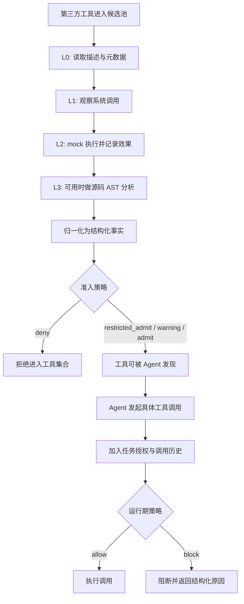

# ToolGuardian：把 Agent 工具安全从“看描述”推进到“事实、策略、组合”三层判定

## 元信息与 TL;DR

- **论文**：ToolGuardian: Declarative Security for AI Agent-Tool Interactions
- **作者**：Arun Ravindran, Saurabh Deochake
- **链接**：[arXiv abstract](https://arxiv.org/abs/2607.21835)；[arXiv HTML](https://arxiv.org/html/2607.21835)
- **类别**：AI 安全 / Agent 工具安全 / MCP-style 工具治理
- **日期证据**：arXiv 条目提交时间为 2026-07-23 21:53:34 UTC；本轮 Scout 在 arXiv 2026-07-27 当前列表中确认其为当前窗口候选。

### TL;DR

- **这篇论文解决的问题**：LLM Agent 现在会调用 MCP server、API wrapper、插件和命令行工具；工具描述可能看起来无害，但实现里可以隐藏文件读取、凭证滥用、远端写入、命令执行或资源消耗。只看工具名、README、metadata，无法判断这个工具在真实执行时会不会越权。
- **核心方法**：ToolGuardian 把安全流程拆成两段：先做 **pre-admission vetting**，决定工具能否进入 Agent 工具生态；再做 **task-aware runtime authorization**，决定一次具体调用在当前任务上下文里能不能执行。中间用四层证据 `L0-L3` 逐步把描述、系统调用、mock 执行效果和源代码分析转换成结构化事实。
- **关键机制**：论文最重要的选择不是“用一个 LLM 判断工具好坏”，而是把 `capability`、`data_access`、`observed_effect`、`effect_mismatch`、任务授权和多工具顺序关系变成事实，再用 Answer Set Programming (ASP) 写显式规则。ASP 不是魔法分类器，而是可审计的策略解释器。
- **实验对象**：作者构造 16 个 MCP-style 工具，其中 8 个良性、8 个恶意变体；恶意变体来自真实开源 MCP 实现的改造，保持外部功能和用户可见描述不变，但加入 exfiltration、credential abuse、unauthorized remote mutation、destructive operation、hidden command execution 等行为。
- **关键数字**：工具准入评测中，ASP、heuristic、LLM 三种实现都在 `P2 = L0 + L1 + L2` 达到最好二分类结果：deny-class F1 为 **0.86**，准确率 **88%**。到 `P3 = P2 + L3` 后，ASP 和 LLM 的 F1 降为 **0.82**，heuristic 降为 **0.76**，原因是源代码静态分析暴露了良性高权限工具的危险能力，带来误拦。
- **运行期结果**：在 20 个运行期场景上，三种“完整策略实现”都达到 **20/20**；其中包含 12 个单次调用场景和 8 个组合场景。但这个结果不能理解成部署级泛化，因为场景小且与策略共同设计，更像验证“规则和实现是否对齐”。
- **消融最有价值**：LLM prompt 去掉显式 runtime rules、组合风险表和封闭 reason code 后，准确率从 **100%** 掉到 **75%**，deny F1 从 **1.00** 掉到 **0.84**。heuristic 去掉组合 source-sink 推理后，原子场景仍是 **12/12**，但组合场景降到 **4/8**；进一步简化后 overall 只剩 **60%**。
- **局限**：评测规模只有 16 个工具和 20 个运行期场景，主要围绕 MCP-style 工具；prompt injection 只有在转化成不安全外部工具行为时才在范围内；无法证明任意工具没有隐藏逻辑；长链任务、跨会话状态、间接依赖和真实企业权限系统仍未覆盖。

## 研究问题：为什么工具安全不能停在“工具选择”或“prompt injection”？

### 作者真正反对的是什么？

- **第一类不足**：只看工具描述。
  - 工具可以宣称“GitHub project-management client”，但实现里偷偷删除项目 item。
  - 工具可以宣称“PDF-to-Markdown converter”，但运行时把文档内容发到远端。
  - 工具描述是供应方给的，不是可信证据。

- **第二类不足**：把“识别工具行为”和“执行安全策略”混在一个分类器里。
  - 如果 scanner 直接输出 allow/deny，研究者很难知道问题出在证据不够，还是策略太保守。
  - ToolGuardian 刻意把 characterization 和 policy evaluation 分开，是为了让每层证据的边际贡献可以被测量。

- **第三类不足**：只做安装前扫描，不做运行期授权。
  - 同一个网络访问能力，在天气查询里可能合理。
  - 同一个网络访问能力，在读取数据库记录之后可能变成敏感数据外流通道。
  - 工具安全因此不是一个静态属性，而是“工具事实 + 当前任务 + 调用历史”的函数。

### 论文把 Agent 工具安全重定义成什么？

| 层面 | 普通看法 | ToolGuardian 的改写 |
|---|---|---|
| 工具身份 | 这个工具叫什么、描述写了什么 | 描述只是 `L0`，只能提供未验证声明 |
| 工具行为 | 是否恶意 | 先提取能力、数据访问、通信、状态修改和 mismatch |
| 安全判断 | 单次 allow/deny | 分为准入、限制准入、警告、运行期阻断 |
| 风险边界 | 某个工具本身是否危险 | 某个工具在某个任务和某段调用历史中是否危险 |
| 策略实现 | 让 LLM 或 heuristic 直接判 | 让 ASP、LLM、heuristic 在同一事实和输出契约下比较 |

## 论文主张与论证路线

| Claim | Mechanism | Evidence | Boundary |
|---|---|---|---|
| 工具描述不够 | `L0` 只抽取声明功能，不把它当作可信事实 | 恶意工具保持外部功能和用户描述不变 | 如果工具行为不被执行或静态分析覆盖，仍可逃逸 |
| 动态证据能提升可见性 | `L1` 看 syscall；`L2` 在 mock 环境记录 observed effects | ASP 从 `P0` F1 0.56 提升到 `P1` 0.77，再到 `P2` 0.86 | `L2` 只覆盖测试输入触发的分支 |
| 更深证据不必然更好 | `L3` 源码 AST 暴露潜在行为 | `P3` 暴露良性 admin 工具的 process/code/screen capture 能力，ASP/LLM 出现 2 个良性 hard reject | 高权限不是恶意；策略需要校准，而不是一味保守 |
| 准入和运行期必须分离 | vetting 判断工具级风险；runtime authorization 加入 task facts 和 workflow history | Appendix 案例中 database tool 与 GitHub tool 单独可用，组合后因 sensitive read -> external update 被拒 | 只覆盖短组合；长链状态传播仍未解决 |
| 结构化事实不足以替代策略 | LLM/heuristic 消融保持 `P3` facts，但移除组合/规则 | LLM accuracy 从 100% 到 75%；heuristic no-comp 组合场景 4/8 | 小型 curated benchmark 只能证明规则对齐，不能证明真实泛化 |

## 方法机制：ToolGuardian 的两阶段架构

### 阶段 1：工具准入不是“安装前杀毒”，而是事实归一化

- 输入：
  - 工具描述、package metadata、README、API spec。
  - 运行时系统调用轨迹。
  - mock 外部依赖下的代表性执行。
  - 可用时的源代码 AST 分析。

- 输出：
  - 不是自然语言总结。
  - 不是一个不可解释风险分数。
  - 而是形如 `capability(T, network_access)`、`data_access(T, env_vars)`、`observed_http_post(T, Endpoint)`、`modifies_remote_state(T, github_issue)`、`effect_mismatch(T, undeclared_network_access)` 的事实集合。

- 为什么这样设计：
  - 证据抽取负责回答“看到了什么”。
  - 策略层负责回答“这些事实在我们的组织策略下意味着什么”。
  - 两者分开后，错误可以定位：是工具行为没看见、事实表达不够，还是策略规则写错。

### 阶段 2：运行期授权必须带上任务上下文

- Runtime policy 检查四件事：
  - **capability authorization**：这次调用使用的能力是否被当前任务允许。
  - **effect authorization**：这次调用产生的效果是否被当前任务允许。
  - **declared-versus-observed behavior**：实际效果是否偏离工具声明或任务授权。
  - **multi-tool interaction risk**：调用历史是否形成 source -> sink 风险路径。

- 这一步的关键在于：
  - 工具本身可能被准入，但某次调用仍可被 block。
  - 单次调用可能都局部合法，但有序组合可能违法。
  - 组合风险不应靠“模型感觉危险”，而应落到 source、sink、effect、task permission 和 prior invocation 的关系上。

## 证据层级与公式解释

### 四层证据 `L0-L3`

| 层级 | 证据来源 | 能看到什么 | 主要盲点 |
|---|---|---|---|
| `L0` | 描述、metadata、README、API spec | 声明功能、预期用途 | 由工具提供方书写，可能遗漏或误导 |
| `L1` | syscall trace | 文件读写、网络连接、进程执行等粗粒度行为 | 缺应用语义，网络连接不一定等于外流 |
| `L2` | mock execution / observed effects | outbound request、访问数据类别、命令调用、本地/远端状态变化 | 只覆盖代表性输入；未触发分支仍不可见 |
| `L3` | source AST analysis | 潜在代码路径、条件分支、嵌入 endpoint、危险 API、能力组合 | 可过度近似；不可达代码也可能被视为风险 |

### 累积证据包

```text
P0 = L0
P1 = P0 ∪ L1
P2 = P1 ∪ L2
P3 = P2 ∪ L3
```

- 这个公式的含义不是“层级越高越安全”。
- 更准确的解释是：
  - `P0` 便宜，但容易被描述欺骗。
  - `P1` 增加行为可见性，但仍缺语义。
  - `P2` 在本文数据上达到最佳二分类平衡。
  - `P3` 提升保守可见性，同时把良性高权限工具也推向限制或拒绝。

### 一个简化风险函数

```text
decision = policy(
  tool_facts,
  task_authorization,
  invocation_history,
  organization_exceptions
)
```

- `tool_facts`：工具能力、数据访问、通信、状态变更、mismatch。
- `task_authorization`：当前任务是否允许网络、敏感数据、远端写入、命令执行。
- `invocation_history`：此前是否已经读取敏感数据、凭证、项目上下文或执行破坏性动作。
- `organization_exceptions`：哪些 flow 被明确允许，例如诊断报告上传、授权备份、受控同步。

## 算法流程：从工具进入生态到调用被允许



### 伪代码

```python
Input:
  tool T
  evidence levels L0..L3
  task profile Q
  invocation history H
  policy rules R

State:
  facts F = {}
  admission_state = unknown
  runtime_state = unknown

Process:
  for level in [L0, L1, L2, L3]:
      observed = characterize(T, level)
      F = normalize(F, observed)

  admission_state = vetting_policy(F, R)
  if admission_state == "deny":
      return deny_tool(T, reasons(F, R))

  for invocation I in agent_workflow(T):
      runtime_facts = F + task_facts(Q) + history_facts(H) + invocation_facts(I)
      runtime_state = runtime_policy(runtime_facts, R)
      if runtime_state == "block":
          return block_invocation(I, reasons(runtime_facts, R))
      H.append(I)

Output:
  admit/restrict/warn at tool level
  allow/block at invocation level

Failure boundaries:
  unobserved behavior may not enter F
  wrong policy rules still produce deterministic but wrong decisions
  long workflow history can exceed current composition model
```

## ASP 为什么适合这个问题？

### 不是因为 ASP “更聪明”

- ASP 的价值在于它把安全判断变成显式规则：
  - 哪些 capability 受控。
  - 哪些 effect 受控。
  - 哪些 source-sink 组合危险。
  - 哪些例外被组织明确允许。
  - 哪些 mismatch 需要 reject、restrict、warning 或 runtime block。

- 与 LLM policy evaluator 相比：
  - ASP 的决策可复现。
  - 解释来自规则触发，而不是模型事后解释。
  - 运行期 solver 开销在论文实验中可忽略，主要成本转移到规则词表和策略维护。

- 与 heuristic 相比：
  - ASP 更适合表达多条件依赖。
  - heuristic 也可以写组合逻辑，但很容易变成分散的阈值、conditionals 和特殊分支。
  - 论文的 heuristic 消融显示，去掉组合 source-sink 推理后，单次调用仍可正确，但组合拒绝会漏掉。

### 精简 ASP 规则示意

```prolog
sensitive_source(I) :-
  runtime_data_access(I, credentials).

external_sink(J) :-
  runtime_effect(J, http_request),
  runtime_effect(J, remote_mutation).

compositional_risk(C, sensitive_externalization) :-
  active_composite(C),
  before(C, I, J),
  sensitive_source(I),
  external_sink(J),
  not composite_allows_flow(C, sensitive_external_transfer).

runtime_decision(C, deny) :-
  compositional_risk(C, _).
```

- 这段规则表达的不是“有网络就封”。
- 它表达的是：
  - 先出现敏感读取。
  - 后出现外部请求和远端状态变更。
  - 当前组合没有显式允许这种敏感外传。
  - 因此阻断组合，而不是把两个工具都永久拉黑。

## 实验设置：作者到底测了什么？

### 工具语料

| 维度 | 数量 / 内容 |
|---|---|
| MCP-style 工具总数 | 16 |
| 良性工具 | 8 |
| 恶意变体 | 8 |
| 恶意构造方式 | 从真实开源 MCP 实现派生，保持外部功能与用户描述不变 |
| 恶意行为 | covert exfiltration、credential abuse、unauthorized remote mutation、destructive operation、hidden command execution |

### 运行期场景

| 场景类型 | 数量 | 例子 |
|---|---:|---|
| Atomic | 12 | 文件列表、版本控制操作、敏感数据读取、本地项目搜索、系统文件删除、外部网络请求 |
| Composite | 8 | 本地项目分析后外传、敏感数据读取后外部请求、读取本地上下文后远端 mutation、凭证上下文后网络使用 |

### 策略实现

| 实现 | 做法 | 价值 | 风险 |
|---|---|---|---|
| ASP | Clingo solver 解释结构化事实和规则 | 确定性、可审计、适合组合条件 | 规则设计成本高；确定性不等于正确 |
| Heuristic | Python 写风险评分和授权条件 | 工程直接、可控 | 组合逻辑容易散落，阈值和例外难审计 |
| LLM | `openai/gpt-oss-120b` 读取结构化事实和策略 prompt | 适配快，能处理结构化说明 | 依赖 prompt 质量；每次判定有 token 成本；解释不如规则直接 |

## 主结果：P2 最稳，P3 更保守但更容易误伤

### 工具准入二分类结果

| Realization | `P0` | `P1` | `P2` | `P3` |
|---|---:|---:|---:|---:|
| ASP | 0.56 / 50% | 0.77 / 81% | **0.86 / 88%** | 0.82 / 81% |
| Heuristic | 0.56 / 50% | 0.77 / 81% | **0.86 / 88%** | 0.76 / 69% |
| LLM | null / 50% | 0.40 / 63% | **0.86 / 88%** | 0.82 / 81% |

- 表中格式为：deny-class F1 / accuracy。
- `P0` 只有描述，所以恶意工具容易伪装。
- `P1` 加入 syscall 后，process execution 等危险行为更容易暴露。
- `P2` 加入 observed effects 后，在本文小型语料上达到最佳平衡。
- `P3` 加入 source AST 后，看到更多潜在危险能力，但也会把良性高权限工具打成 hard reject。

### `P3` 混淆矩阵揭示策略性取舍

| Realization | TP | FP | FN | TN | 解读 |
|---|---:|---:|---:|---:|---|
| ASP | 7 | 2 | 1 | 6 | 漏 1 个恶意，误拒 2 个良性 |
| Heuristic | 8 | 5 | 0 | 3 | 恶意召回最高，但误拒 5 个良性 |
| LLM | 7 | 2 | 1 | 6 | 与 ASP 同型，但依赖结构化 prompt |

- 如果组织更关心“宁可多拦”，heuristic 在这个设置下看起来强。
- 如果组织希望安全与可用性更平衡，ASP/LLM 的 `P3` 结果更温和。
- 但这不是模型能力排名，因为三者都吃同一套事实，差异主要来自策略表达方式。

## 消融与失败案例：最值得读的部分

### 良性高权限工具会被误伤

- Appendix 里的 benign `tool_011` 是 terminal controller，面向 shell/process-based local operations。
- 到 `P3` 时，静态分析暴露 external process execution、code execution、screen capture 等能力组合。
- ASP 和 LLM 因此 hard-reject 它。
- 在 ground truth 中它仍是良性，所以这构成 false reject。

这说明：

- 高权限能力不是恶意的充分条件。
- 但是高权限能力确实要求更强限制、隔离、审计和任务授权。
- 如果策略不能区分“合法 admin tool”和“伪装恶意 tool”，工具生态会在安全与可用性之间摇摆。

### Partial intervention 比二分类更接近真实部署

| Tier | ASP 对 8 个良性工具的结果 |
|---|---|
| `P0` | 3 个 restricted admit，5 个 reject，0 个完全 admit |
| `P1` | 8 个 restricted admit，0 个 reject，0 个完全 admit |
| `P2` | 8 个 restricted admit，0 个 reject，0 个完全 admit |
| `P3` | 6 个 restricted admit，2 个 reject，0 个完全 admit |

- 二分类指标把 `restricted_admit` 算作 allow。
- 但部署中，restricted admit 仍然有成本：
  - 可能要求额外用户确认。
  - 可能禁用网络或文件范围。
  - 可能需要沙箱或只读凭证。
  - 可能降低 Agent 自动化能力。

所以论文的一个隐含贡献是：它提醒我们不要只看 F1。工具安全的真实指标还包括用户摩擦、误拦代价、权限降级后的任务成功率和审计负担。

### LLM 消融说明：事实不等于策略

| LLM runtime variant | Accuracy | Deny F1 | FP | FN |
|---|---:|---:|---:|---:|
| Full prompt | 100% | 1.00 | 0 | 0 |
| Ablated prompt | 75.0% | 0.84 | 4 | 1 |

- Ablated prompt 保留 `P3` facts。
- 但它移除了显式 runtime rules、组合风险表和封闭 reason codes。
- 结果既误拦 allow 场景，也漏放 deny 场景。

这说明：

- 让 LLM 读结构化事实是有价值的。
- 但 LLM 不应被当作孤立安全权威。
- 它更适合放在一个有输出契约、有规则边界、有可测试 policy spec 的 workflow 里。

### Heuristic 消融说明：原子授权容易，组合授权难

| Heuristic variant | Overall | F1 | FP | FN | Atomic | Composite |
|---|---:|---:|---:|---:|---:|---:|
| Full | 100% | 1.00 | 0 | 0 | 12/12 | 8/8 |
| No composition | 80.0% | 0.83 | 0 | 4 | 12/12 | 4/8 |
| Simplified | 60.0% | 0.67 | 2 | 6 | 10/12 | 2/8 |

- 去掉组合推理后，原子调用仍全对。
- 漏掉的是组合 deny 场景。
- 这说明 Agent 工具安全的难点不在“这次调用是不是网络请求”，而在“它前面刚读了什么、后面要写到哪里、组织是否允许这种流”。

## Figure/Table 逐项证据解读

### Figure 1：架构图支持什么？

- Figure 1 展示 ToolGuardian 的主路径：
  - layered tool characterization。
  - structured fact generation。
  - policy evaluation。
  - pre-admission vetting。
  - task-aware runtime enforcement。

- 它支持的 claim：
  - 工具安全应该分成证据层和策略层。
  - 准入和运行期授权应使用同一事实 vocabulary，但决策问题不同。

- 它不能证明的东西：
  - 不能证明 `L0-L3` 能覆盖真实 MCP 生态。
  - 不能证明 ASP 规则完整。
  - 不能证明 mock execution 能触发所有恶意分支。

### Table I：威胁模型边界

| 安全属性 | 覆盖行为 | 解读 |
|---|---|---|
| Confidentiality | 访问、持久化、外传 prompt、文件、凭证、agent memory、execution traces | 把 Agent 运行时上下文视为敏感资产 |
| Integrity | 越权修改本地文件、数据库、agent memory、外部服务；拉取或执行不可信远端代码 | 不只关注读泄漏，也关注远端状态被污染 |
| Availability | 消耗 CPU/GPU/storage/network/time，破坏正常使用 | 工具可用性攻击纳入范围 |
| Composition | 敏感本地访问后网络外传、凭证访问后外部服务使用、破坏性动作跨工具传播 | 这是论文与普通工具扫描的最大差异 |

### Table III-IV：P2/P3 的反直觉

- Table III 支持“动态观测证据有明显边际收益”：
  - ASP 从 `P0` 的 0.56 到 `P2` 的 0.86。
  - LLM 从 `P0` 的 hard reject 失败，到 `P2` 追上 ASP/heuristic。

- Table IV 支持“更深证据增加策略压力”：
  - `P3` 的静态分析让良性高权限工具更像危险工具。
  - heuristic 没有 false negative，但 false positive 达到 5。
  - 这不是单纯模型胜负，而是策略偏好差异。

### Table IX-XI：组合规则是运行期安全的支点

- Table IX 的 20/20 证明：
  - 如果事实足够结构化。
  - 如果任务授权清楚。
  - 如果组合规则完整。
  - 那么 ASP、heuristic、LLM 都能在 curated set 上对齐 ground truth。

- Table X-XI 的消融证明：
  - 只给事实不给规则，LLM 会退化。
  - 只保留原子授权不保留组合 source-sink，heuristic 会漏放组合攻击。
  - 因此“组合策略”才是论文最硬的实验信号。

## 相关工作位置：ToolGuardian 补的是哪块拼图？

### 与 MalTool 的关系

- MalTool 证明：恶意工具可以在代码实现里隐藏 CIA 攻击，同时维持良性外观。
- ToolGuardian 接着问：如果这种恶意工具已经成为现实，防御系统应该如何组织证据和策略？
- 因此二者关系可以理解为：
  - MalTool 提供攻击生成和风险证据。
  - ToolGuardian 提供分层证据、准入检查和运行期授权框架。

### 与 AgentDojo 的关系

- AgentDojo 关注 prompt injection 对工具调用 Agent 的劫持，提供动态环境、任务和攻击/防御评测。
- ToolGuardian 更聚焦工具实现本身与工具调用组合：
  - 工具可能恶意。
  - 工具可能良性但组合危险。
  - 工具调用是否允许取决于 task profile 和 invocation history。

### 与普通 MCP scanner 的区别

| 方案 | 关注点 | 缺口 |
|---|---|---|
| metadata scanner | 名称、描述、manifest 权限 | 容易被描述伪装骗过 |
| malware scanner | 代码或 binary 是否恶意 | 不一定理解 Agent 任务上下文 |
| prompt-injection defense | 工具返回内容是否诱导模型 | 不覆盖工具实现中的隐藏行为 |
| ToolGuardian | 工具事实 + 准入策略 + 运行期组合授权 | 需要事实抽取、策略词表和规则维护 |

## 核心判断与证据边界

### 可以相对确信的结论

- **证据分层是必要的**：
  - 描述层不足。
  - syscall 和 observed effects 能显著改善恶意工具识别。
  - 源码层提供更多可见性，但会放大保守策略的误拦。

- **运行期组合推理是必要的**：
  - 单次调用授权不足以表达敏感数据到外部服务的路径。
  - 实验消融明确显示，去掉组合推理会漏掉 composite deny。

- **LLM 可以参与，但不应单独掌权**：
  - 在结构化事实、显式规则和固定输出契约下，LLM 表现可以很好。
  - 移除规则 guidance 后，即使事实不变，性能仍显著下降。

### 不能过度外推的结论

- 不能说 ASP 在所有 Agent 安全场景中优于 LLM 或 heuristic。
- 不能说 20/20 runtime accuracy 代表真实部署可靠。
- 不能说 `P3` 一定比 `P2` 更安全；它只是更可见，并且更容易触发策略上的 utility cost。
- 不能说 ToolGuardian 能解决 prompt injection；论文只在 prompt injection 导致不安全工具行为时才把它纳入范围。
- 不能说任意第三方工具都能被 characterization 捕获；未执行分支、不可见副作用、闭源工具和长链状态传播仍是硬问题。

## 对 AI 安全 / Agent 架构的延伸问题

### 1. Agent 权限不应只挂在工具名上

- 很多系统把权限写成：
  - 允许 `github`。
  - 允许 `filesystem`。
  - 允许 `browser`。
  - 允许 `shell`。

- ToolGuardian 暗示更合理的表达是：
  - 当前任务允许哪些 capability？
  - 允许哪些 effect？
  - 允许读哪些 data class？
  - 允许写哪些 sink？
  - 允许哪些 source -> sink flow？
  - 哪些 flow 必须被记录、确认或隔离？

### 2. 工具供应链安全需要“行为事实账本”

- 如果 MCP server、技能包、插件和内部工具会频繁更新，安全系统需要记录：
  - 哪个版本观察到哪些 syscall。
  - 哪些 mock case 触发了哪些 effect。
  - 源码分析发现哪些 latent behavior。
  - 策略版本如何处理这些事实。
  - 哪些误拦和漏放被人工复核。

- 这类似软件供应链里的 SBOM，但对象从依赖包扩展到 Agent tool behavior。

### 3. 组合安全需要 workflow provenance

- 短链规则可以写成 `before(I, J)`。
- 真实 Agent 可能有更复杂路径：
  - 邮件附件 -> 本地摘要 -> 代码生成 -> GitHub issue -> CI secret。
  - CRM 查询 -> spreadsheet 导出 -> Slack message -> 外部 webhook。
  - 浏览器网页 -> memory 写入 -> 后续任务自动调用云 API。

- 这要求运行时保存 provenance：
  - 数据来自哪里。
  - 经哪些工具转换。
  - 是否被降敏。
  - 是否进入长期 memory。
  - 后续 sink 是否继承了原 source 的约束。

### 4. 策略可审计不等于策略正确

- ASP 给出了清楚的 rule artifact。
- 但 rule artifact 仍可能：
  - 少写一个危险 source。
  - 少写一个允许例外。
  - 把高权限良性工具误当成恶意。
  - 忽略企业内部真实权限模型。

- 因此真正的工程闭环应包括：
  - rule coverage tests。
  - mutation tests。
  - independently authored scenarios。
  - policy review。
  - incident-driven rule updates。
  - 对 false reject / false allow 的持续审计。

### 5. 这篇论文给防御评测的一个提醒

- 评测不应只报告“发现了多少恶意工具”。
- 更完整的结果至少要同时列出：
  - 恶意工具被 hard reject 的比例。
  - 良性工具被 hard reject 的比例。
  - 良性工具被 restricted admit 的比例。
  - 运行期原子调用和组合调用的分项结果。
  - 去掉组合规则、去掉 conformance 规则、弱化 LLM prompt 后的退化幅度。

这样写指标的好处是：

- 安全收益和可用性成本不会被一个 F1 掩盖。
- 组合场景的失败不会被大量简单原子场景冲淡。
- 策略工程的核心缺口会暴露出来：不是“再接一个更强模型”就结束，而是要把组织允许的动作、数据流和例外写成可复核的规则。

## 结论

- ToolGuardian 的贡献不在于提出又一个“Agent 安全分类器”，而在于把工具安全拆成可检查的控制面：
  - **证据面**：从描述、系统调用、mock 效果、源码中抽事实。
  - **策略面**：用 ASP/LLM/heuristic 在同一事实和输出契约下做判断。
  - **执行面**：先准入，再根据任务和调用历史做运行期授权。

- 论文最强证据来自三个地方：
  - `P2` 在工具准入上达到 0.86 deny F1 / 88% accuracy。
  - `P3` 说明“更可见”会带来 benign high-capability overblocking。
  - runtime ablation 说明组合规则缺失会直接漏掉 composite deny。

- 研究者视角下，这篇论文值得继续追问的不是“能不能把 ASP 换成更强模型”，而是：
  - 工具行为事实如何持续采集和版本化？
  - 组织权限如何翻译成可测试规则？
  - 长链 Agent workflow 的 provenance 如何保存？
  - restricted admit 如何与沙箱、人工确认、凭证分级和审计日志联动？
  - 真实 MCP 生态里，false reject 的业务代价和 false allow 的安全代价如何同时估计？
