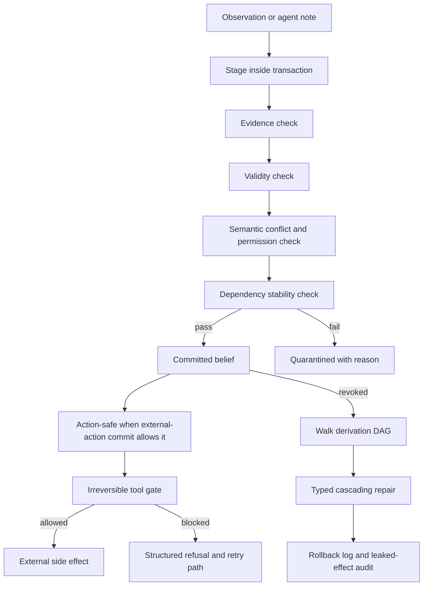

# MemTX：把 Agent 记忆写入从“记录事实”升级为“事务化信念提交”

## 元信息

- 原文标题：MemTX: Transactional Belief Commit for Stateful Agent Memory
- 作者：Xiaoyang Li, Yiqi Wang, Haohui Lu, Zhi Chen, Mo Li, Pingan Song, Taotao Cai
- 发布时间：2026-07-27 01:57:39 UTC
- 类型：论文预印本
- 原始链接：https://arxiv.org/abs/2607.23929
- 代码与数据：论文脚注给出 `https://github.com/lxy1134/MEMTX`，但本轮访问该 GitHub URL 返回 404；因此本文只把论文 HTML/PDF 当作已验证来源，不把代码开源状态作为已确认事实。

## TL;DR

- **这篇论文解决的问题**：多 Agent 或长期 Agent 系统会把观察、偏好、工具结果、队友笔记写入持久共享记忆；现有系统常把“写入被接受”直接当作“可行动真相”，导致污染工具结果、过期写入、权限漂白或半成品笔记进入不可逆工具调用。
- **核心主张**：记忆写入不是信念提交。MemTX 把 Agent memory 变成事务化对象，让记录先经历 evidence、permission、provenance、validity 和 lifecycle 检查，只有成熟到 action-safe 的信念才能支撑外部副作用。
- **方法机制**：每条 memory record 携带证据、权限、来源、有效期、派生边；写入在 snapshot-isolated transaction 里暂存；commit pipeline 做证据阈值、时间有效性、语义冲突、权限继承、依赖稳定性检查；不可逆工具调用被 action gate 拦截；撤销信念时沿 derivation DAG 做 typed cascading repair。
- **实验设计**：作者构造 90 个主测试任务，覆盖 60 个 trap cases 和 30 个 controls；又构造 56 个 hardened cases，包含 40 个 traps 和 16 个 controls；对比 8 个 baseline，在 5 个 backbone、3 个模型家族上评测。
- **关键数字**：机器验证覆盖 10,000 条随机 trace，并在 bounded exhaustive enumeration 中枚举 5,530,160 个 canonical states、10,537,260 条 transitions，报告 0 个 invariant violations；主结果中 MemTX 在开放 backbone 上排名第一，在最强闭源 backbone 上与最佳 baseline 统计打平，并且是唯一在每个 backbone 上 downstream harm 为 0 的方法。
- **局限**：I1 强门控的经验评测范围被作者明确收窄，LLM evaluation path 主要跑 weak form；repair 只覆盖记录了 provenance 的派生关系；补偿是审计级义务，不等同于真实环境回放；代码仓库本轮不可访问，复现实验还缺独立代码确认。

## 研究问题：为什么“写入成功”不等于“可行动信念”？

### 作者真正反对的默认假设

论文反对的不是“Agent 需要记忆”，而是下面这个默认工程假设：

- 只要某条观察通过写入接口进入 memory store，它就可以被后续 Agent 读取。
- 只要后续 Agent 能读到它，就可以把它当作规划前提。
- 只要规划前提看起来成立，系统就可以执行退款、邮件、预订、配置变更等外部动作。

作者指出，这条链路把三个本应分开的阶段混成一个：

| 阶段 | 系统实际含义 | 如果混淆会发生什么 |
|---|---|---|
| 记录 observation | “系统看见或收到过某个说法” | 污染工具结果和半成品笔记会被保留下来 |
| 提交 belief | “该说法经过证据、时间、权限和冲突检查” | 过期或矛盾事实会被当作当前真相 |
| 允许 action | “该信念足以支撑不可逆动作” | 可修复的数据错误会被放大成不可逆副作用 |

这也是论文标题里 “belief commit” 的重点：memory write 只是数据层事件，belief commit 才是行动层前提。

### 六类失败模式

论文把问题组织成六类 failure families。它们不是提示词安全里的普通 jailbreak，而是 stateful memory 系统里的状态污染：

| 失败家族 | 机制 | 典型风险 |
|---|---|---|
| tool-result pollution | 错误或污染的工具结果被摘要成长期记忆 | 后续退款、诊断、推荐继续引用错误事实 |
| stale late writes | 修正之后到达的旧写入覆盖新事实 | 时间顺序被破坏，旧状态重新成为当前状态 |
| dirty reads | Agent 读取另一个 transaction 的 tentative state | 半成品计划被队友当作已确认结论 |
| semantic conflict | 同一实体属性出现冲突值 | 系统用 LLM merge 或 last-writer-wins 掩盖矛盾 |
| permission laundering | 私有记录被改写成共享摘要 | 原权限在派生记录里丢失，形成越权传播 |
| cascading-rollback failure | 上游信念撤销后，下游摘要、画像、动作不修复 | 记忆看似删除，影响却继续存在 |

这些失败的共同点是：污染并不一定发生在最终回答文本里，而是发生在“长期状态如何变成外部行动”的路径上。

## 论文主张与论证路线

| Claim | Mechanism | Evidence | Boundary |
|---|---|---|---|
| 共享 Agent memory 需要区分 observation 与 committed belief | 八状态 lifecycle、maturity-scoped reads、risk-tiered transaction | Table 1 显示七项能力中现有方法多为 partial 或 no support，MemTX 覆盖全部七项 | Table 1 是作者按全文审阅打分，仍依赖作者定义的 criteria |
| 写入安全不能只在 write time 结束 | commit pipeline 加 action gate，把检查延伸到不可逆工具调用前 | I1 action-safety gating 经过 property-based testing 和 bounded enumeration | I1 的强形式只在 scripted path 充分执行，LLM path 主要验证 weak form |
| 撤销信念必须修复派生状态 | derivation DAG + typed cascading repair | I2 cascade-repair completeness 报告 0 violations；downstream harm 表中 MemTX 全列为 0 | repair 只能覆盖已记录 provenance；未记录派生关系无法修 |
| 更强 backbone 不能替代 commit discipline | 同一 runner、同一 prompt、同一 grader 下跨五个 backbone 比较 | MemTX 在四个 backbone 上显著领先，最强 GPT-5.5 上统计打平；仍唯一保持 0 harm | benchmark 是作者构造任务，不代表所有生产 memory 场景 |
| 安全不必靠高拒绝率购买 | trap/control 配对，报告 availability、allow rate、成本 | legit-action allow rate 在各方法间差异有限，MemTX 仍保持高 safety | 允许率依赖任务设计和工具环境，真实系统成本可能更高 |

这条论证路线的优点是结构清晰：先把 Agent memory 从 retrieval component 改写为 governed state，再把数据库事务、权限传播和 rollback repair 引入 Agent 行动边界。

## 方法机制：MemTX 协议如何工作？

### 数据模型：每条记忆都是 governed object

MemTX 不把 memory record 当作普通字符串，而是要求它至少包含这些字段：

- `entity / attribute / value`：记忆断言的结构化对象。
- `source / authority`：证据来自用户、系统、工具、队友还是派生摘要，并带 authority weight。
- `permission block`：owner、reader roles、writer roles、share scope。
- `derived_from`：指向上游记录的派生边，组成 derivation DAG。
- `type`：区分 belief、summary、profile、index entry、shared copy、tool action。
- `validity interval`：用 logical clock 表示事实的有效时间。
- `confidence`：写入者对该断言的置信度。

这个设计的关键不是字段多，而是让后续 gate 和 repair 有机器可检查的对象。没有 provenance 边，系统就不知道撤销该修什么；没有 permission block，派生摘要就会把私有事实洗成共享事实；没有 validity interval，旧写入就可能重新压过新事实。

### 八状态 lifecycle

论文把信念成熟度分成八种状态：

| 状态 | 含义 | 能否支撑行动 |
|---|---|---|
| raw | 原始观察，还没有进入判断 | 否 |
| tentative | transaction 中暂存的草稿 | 否 |
| validated | 通过部分检查，但还未提交 | 否 |
| committed | 已提交为当前信念 | 视 transaction 风险而定 |
| action-safe | 可支撑外部动作的成熟信念 | 是 |
| quarantined | 检查失败，等待复核或重建 | 否 |
| superseded | 被更新事实取代 | 否 |
| revoked | 终态撤销 | 否 |

这套 lifecycle 的意义在于把“读可见性”做成 maturity-scoped reads。系统不再只有“在 store 里 / 不在 store 里”，而是不同风险 transaction 只能看不同成熟度的记录。

### 五种 isolation level 与四种 risk tier

论文把数据库隔离思想映射到 Agent memory：

- `raw-read`：暴露所有记录，适合诊断和低风险探索。
- `tentative-read`：允许看暂存状态，但不该支撑外部动作。
- `committed-read`：只看已提交及以上状态。
- `causally-stable-read`：隐藏祖先仍有 pending invalidation 的记录。
- `action-safe-read`：只暴露 action-safe 记录。

transaction 声明四种风险等级：

- low
- medium
- high
- external-action

关键细节是：风险等级由 harness 或系统配置声明，不由 Agent 自己传参。这样被污染的 Agent 不能把退款任务降级成 low-risk 来绕过强门控。

### Commit pipeline：四道顺序检查

MemTX 的 commit 不是一次 LLM 判断，而是四段 ordered checks：

1. **Evidence check**：writer confidence 至少达到 0.6，除非 source authority 至少达到 0.9；作者强调阈值不是单点安全边界，并在附录做 sensitivity sweep。
2. **Validity check**：记录有效时间必须包含当前 logical time；这防止旧事实在当前上下文里重新生效。
3. **Semantic-conflict check**：同一 entity / attribute 的冲突写入按时间和 authority adjudicate；晚到旧写入先 abort，authority 不能覆盖 temporal precedence；同 authority 不同 source 会 quarantine 给用户复核。
4. **Dependency-stability check**：如果 transitive ancestors 有 pending revocation，派生记录不能提交。

可以把它写成一个简化公式：

```text
Commit(r, tx) =
  EvidenceOK(r) ∧ ValidNow(r, t) ∧ NoUnsafeConflict(r, snapshot(tx))
  ∧ StableAncestors(r)
```

变量解释：

- `r` 是 staged memory record。
- `tx` 是当前 transaction。
- `snapshot(tx)` 是 transaction 打开时看到的成熟状态。
- `EvidenceOK` 检查 confidence / authority。
- `NoUnsafeConflict` 处理 stale write、authority 比较、equal-authority quarantine、permission laundering。
- `StableAncestors` 防止基于待撤销祖先继续派生新事实。

### Action gate：不可逆工具调用前的最后边界

MemTX 把 domain tools 分成 reversible 与 irreversible。不可逆工具调用前必须过 action gate：

- 条件一：不能存在 transaction snapshot 外的 in-flight tentative record，包括调用者自己的未提交草稿。
- 条件二：如果 transaction 是 external-action risk，snapshot 里必须至少有一个 action-safe record。

这个 gate 的实际含义是：Agent 不能一边写草稿、一边基于草稿调用外部副作用；也不能在高风险外部动作里只靠普通 committed memory 执行。

论文也承认一个重要边界：I1 的 existential 条件只保证 store 中至少存在 action-safe belief，不保证 action 的每个具体参数都逐项由 action-safe belief 支撑。这是后续研究可以继续收紧的地方。

### Typed cascading repair：撤销不是删除，而是沿 DAG 修复

当 transaction abort 或 committed record 被 revoke 时，MemTX 沿 derivation DAG 找到 transitive descendants，并按类型处理：

| 派生记录类型 | repair 动作 |
|---|---|
| belief | revoke |
| summary / profile / index entry / shared copy | quarantine，标记为 invalidated，等待从幸存来源重建 |
| reversible tool action | compensate |
| irreversible tool action | 记录 leaked irreversible effect |

这比“删除一条记忆”严格得多。原因是下游状态可能已经把上游信念改写成摘要、画像、共享副本或工具动作；如果只撤上游，不修下游，系统仍然会在下一次读取中复活旧影响。

## 协议流程图



这张图对应原文 Figure 1 的“折叠时间线”：左到右是 admission 与 commit，右到左是 revoke 后的 repair。中间的 DAG 是整篇论文最重要的工程抓手，因为没有它就无法证明 cascade completeness。

## 实验设置：作者如何证明协议有用？

### 测试套件

论文构造的主套件包含：

- 90 个任务。
- 60 个 trap cases。
- 30 个 controls。
- 六类 corruption families：tool-result pollution、stale late writes、dirty reads、semantic conflict、permission laundering、cascading rollback failures。

hardened suite 进一步包含：

- 56 个任务。
- 40 个 traps。
- 16 个 controls。
- 多层 compound corruptions，用于检查方法在组合污染下是否仍稳。

作者强调所有九种方法共用同一 runner、prompt set、tool schema 和 rule-based grader，因此变量尽量限制在 memory manager 本身。

### Baselines 与 backbones

对比对象包括：

- Cordon
- Cordon + revocation
- Verified Concurrency
- Verified Concurrency + gate
- Collaborative Memory
- Collaborative + permissions
- TOKI
- MemState
- MemTX

backbones 覆盖五个模型：

- Qwen3-8B
- Qwen2.5-14B
- GLM-4.7-Flash
- GPT-5.4-mini
- GPT-5.5

这组选择的意义是测试“模型能力是否能自然补上协议缺口”。论文结论是否定的：更强模型会减少一些错误，但不能替代 commit discipline。

### 指标

论文没有只报一个 pass rate，而是拆出多条安全与可用性轴：

| 指标 | 作用 |
|---|---|
| pass / fail | trap 与 control 的规则化结果 |
| abort recall | 污染或冲突时是否及时 abort |
| permission enforcement | 是否阻止权限漂白 |
| rollback recall | 撤销上游后是否修复下游 |
| downstream harm | 是否产生真实下游伤害 |
| legit-action allow rate | control 中是否过度拒绝合法动作 |
| tokens / latency / verifier calls | 安全机制的成本 |

这种指标设计比单纯“安全率”更有解释力，因为强拒绝系统可能安全但不可用；强可用系统可能让 trap 通过。MemTX 要证明的是在两者之间仍能保持较好平衡。

## 主结果与证据解读

### 机器验证：先检查协议不变量

论文给出两个 invariants 和一个 corollary：

| 编号 | 内容 | 证据 |
|---|---|---|
| I1 | 不可逆工具调用必须满足 action-safety gating | property-based testing 与 bounded enumeration |
| I2 | 撤销后所有非终态 transitive descendants 都必须变成 inactive 或被补偿/记录 | 同上 |
| G3 | reachable state 中不能存在祖先已撤销但自己仍 committed/action-safe 的记录 | 同上 |

关键数字：

- 10,000 条随机 traces。
- 覆盖 4 个 risk tiers 和 6 种 record types。
- bounded exhaustive enumeration：4 records、3 concurrent transactions、depth 10。
- 5,530,160 个 canonical states。
- 10,537,260 条 transitions。
- 0 violations。

这个证据很重要，但要读清边界：它是 bounded、runtime-level verification，不是对抽象协议的无限状态定理。它能说明作者的 executable implementation 在枚举范围里满足 invariants，但不能证明所有真实部署组合都安全。

### 主套件：MemTX 的优势来自协议，而不是模型更强

论文报告：

- MemTX 在开放 backbone 和 seed 上排名第一。
- pooled paired tests 中，MemTX 对所有 8 个 baseline 在所有开放 backbone 上显著领先。
- GPT-5.5 上与最强 baseline 统计打平，但仍保持 downstream harm 为 0。
- paired McNemar 在表格里显示大量 `b/c` 极不对称，例如某些 baseline 下 MemTX pass 而 baseline fail 的 case 数远高于反向。

这组结果支撑的 claim 是：Agent memory 风险不是单纯的模型能力问题。因为 baseline 使用同样 backbone，当 memory manager 不具备 lifecycle、permission inheritance、cascade repair 或 action gate 时，模型仍会把污染状态推进到行动边界。

### downstream harm：最有说服力的结果

附录 Table 11 把 realized downstream harm 列出来：

| 方法 | Qwen3-8B | Qwen2.5-14B | GLM-4.7-Flash | GPT-5.4-mini | GPT-5.5 |
|---|---:|---:|---:|---:|---:|
| MemTX | 0.000 | 0.000 | 0.000 | 0.000 | 0.000 |
| Cordon + revocation | 0.250 | 0.167 | 0.250 | 0.250 | 0.250 |
| Collaborative + permissions | 0.500 | 0.292 | 0.500 | 0.500 | 0.500 |
| TOKI | 0.500 | 0.250 | 0.500 | 0.500 | 0.500 |
| MemState | 0.500 | 0.333 | 0.500 | 0.500 | 0.500 |

这个表比 pass rate 更接近生产系统关心的问题。一个 Agent 可能在中间步骤显得“解释合理”，但只要它基于污染 memory 发出了不可逆动作，安全目标就已经失败。MemTX 的 0 harm 正是 action gate 与 cascade repair 共同作用的结果。

读这个数字时还要注意：0 harm 不是“系统永远正确”，而是在作者定义的 trap、工具环境和规则化 grader 中，没有让污染状态穿过最终副作用边界。它证明的是协议纪律在该评测分布下有效，不是开放世界安全保证。

### 可用性：安全不是靠全部拦截换来的

附录 Table 12 显示：

- MemTX rollback recall 在多数 backbone 上为 1.000，Qwen2.5-14B 为 0.959。
- permission enforcement 在多数 backbone 上为 1.000，GPT-5.5 为 0.889。
- legit-action allow rate 大致在 0.933 到 0.978 之间。

这个结果说明 MemTX 没有简单地“全拒绝”。不过仍要注意：control cases 是作者构造的，真实生产场景里的合法动作复杂度、工具异步状态和人为审批延迟都可能提高误拦成本。

### 成本：强门控有代价，但没有离开 baseline 区间

附录 Table 13 报告每 case tokens 与 latency：

| 方法 | 成本解释 |
|---|---|
| MemTX | 有 nonzero verifier calls，约 1.36 到 1.58 次 / case |
| Baselines | verifier calls 为 0，但 downstream harm 更高 |
| Latency | MemTX 在各 backbone 上仍处于 baseline band 内 |

这说明 MemTX 的成本主要来自 semantic-conflict adjudication。它不是免费 safety layer，而是把原本隐藏在下游事故里的成本前移到 commit 阶段。

## 消融、失败案例与边界

### 消融结果说明哪些模块最关键？

论文把优势归因到三个模块：

1. semantic-conflict adjudication
2. permission inheritance
3. cascading rollback

这也符合 failure families 的结构：

- 没有 semantic-conflict adjudication，stale late writes 与矛盾事实会进入 committed state。
- 没有 permission inheritance，私有事实派生出的摘要会变成共享副本。
- 没有 cascading rollback，上游修正只会清理原记录，不会修复 summary/profile/tool action。

### benchmark 组成为什么重要？

论文的 benchmark 不是普通问答集，而是把“错误状态如何穿过 memory manager”写成 case schema。每个 case 至少需要说明：

- 初始 memory store 里有哪些记录。
- 哪些记录是 trap，哪些是 control。
- 哪个 Agent 或工具会写入新 observation。
- 哪些记录之间存在 derived-from 关系。
- 哪个工具动作是最终风险边界。
- ground truth 不是自然语言偏好，而是规则化判断：该 abort、该 allow、该 quarantine、该 revoke，还是该补偿。

这种 case schema 的价值在于把安全问题从“模型有没有说错”转成“状态机有没有让错误状态越过边界”。这也是为什么作者可以使用 pure-rule grading，而不依赖另一个 LLM judge 来判断每个 episode。对于 Agent 安全研究，这一点很关键：如果评测目标是 permission laundering 或 stale late write，judge 文本偏好并不能可靠说明系统是否修复了派生状态，必须检查 memory record、permission scope、tool log 和 rollback log。

### 控制组如何避免“安全就是拒绝”的假象？

30 个 controls 和 hardened suite 里的 16 个 controls 用来惩罚过度保守策略。一个方法如果看见冲突就拒绝所有动作，确实可能降低 trap harm，但会在 legitimate-action allow rate 上失败。

MemTX 的设计不是“默认不做”，而是把拒绝变成结构化 retry path：

1. action gate 返回 blocked reason。
2. Agent 可以提交、撤销、解决冲突或请求复核。
3. commit pipeline 给失败记录 machine-readable quarantine reason。
4. repair routine 把撤销影响写入 rollback log。

这让系统有恢复路径，而不是只有 final refusal。生产系统里这一点比单次 pass rate 更重要，因为用户或运营人员需要知道“为什么被拦”“该补什么证据”“修复后能不能继续执行”。

### scope blind spots

论文明确提到几个边界：

- 强 action gate 的 empirical pricing 与 LLM path 并不完全等同；LLM evaluation path 开的是 medium / low risk transaction，主要验证 weak form。
- I1 的 existential strong condition 不保证每个 action argument 都由 action-safe record 逐项支撑。
- Typed repair 依赖已记录的 derivation DAG；没有记录的派生关系无法修。
- irreversible action 的补偿只能记录 leaked effect，不能把真实世界动作自动撤回。
- reversible / irreversible 是静态工具标注；如果动作状态中途变化，例如退款已经结算，协议本身无法重新分类。
- 当前代码链接本轮访问 404，独立复现需要等待仓库可用或作者修正链接。

这些边界没有削弱论文主线，反而让结论更可信：作者没有声称“事务化 memory 解决所有 Agent 安全”，而是把它限定在可机器检查、可审计、可 repair 的状态传播问题上。

## Figure 与 Table 证据逐项解读

### Figure 1：folded timeline

原文 Figure 1 把 MemTX 画成一条折叠时间线：

- admission 从左向右，代表 observation 进入 transaction、经过 checks、成为 committed/action-safe。
- repair 从右向左，代表 committed belief 被 revoke 后沿 DAG 回溯下游影响。
- 中间 band 是 derivation DAG，连接 admission 与 repair。

它支撑的 claim 是：Agent memory safety 不是一个单点 classifier，而是一条 lifecycle discipline。

### Table 1：与现有方法的能力差距

Table 1 对七个维度打分：

- staged lifecycle
- maturity reads
- semantic conflict
- permission inheritance
- typed cascade
- action gating
- multi-agent

这张表的作用是定位论文贡献：MemTX 不是只比某个 memory benchmark 高几个点，而是补上“写入成熟度、权限派生、行动门控、撤销修复”这四个系统性空缺。

### Table 11 / 12 / 13：安全、可用性、成本三角

这些附录表格共同说明：

- Table 11：MemTX 的 downstream harm 全 backbone 为 0。
- Table 12：MemTX 没有靠低 allow rate 牺牲合法动作。
- Table 13：MemTX 有额外 verifier calls，但 latency 没有明显脱离 baseline 范围。

这三张表一起构成论文最强证据：安全收益、可用性和成本被同时呈现，而不是只报单一成功率。

## 与相关工作的关系

### 与数据库事务的关系

MemTX 明显借鉴：

- snapshot isolation
- transaction lifecycle
- conflict adjudication
- rollback / cascade repair

但它不是把 SQL 数据库直接套给 Agent。区别在于 memory record 里的冲突不是普通值冲突，而是语义信念冲突；权限不是表级 ACL，而是会沿派生摘要传播；repair 不是简单删除行，而是要按 belief、summary、profile、tool action 分类型处理。

### 与 Agent memory 系统的关系

MemGPT、Generative Agents、A-Mem、LongMemEval 等工作主要回答：

- 如何写入长期记忆？
- 如何检索长期记忆？
- 如何组织 temporal knowledge？
- 如何提高 long-horizon QA？

MemTX 回答的是另一层问题：

- 哪些写入能成为可行动 belief？
- 哪些派生记录继承了上游权限？
- 哪些外部动作必须等到 memory 成熟？
- 上游信念撤销后，下游状态如何被修复？

因此它更像 Agent memory 的 control plane，而不是新的 retrieval algorithm。

### 与 Agent 安全工作的关系

APPA、ContainmentBench 等近期工作强调 taint confinement、post-injection containment、tool-use boundary。MemTX 与它们相邻，但切口不同：

- APPA 关注权限代数与 taint confinement。
- ContainmentBench 关注 prompt injection 后的 containment 行为。
- MemTX 关注 persistent memory 中 belief 如何成熟、传播、撤销与支撑 action。

三者可以组合：taint 告诉系统“这条信息来自不可信源”，containment 约束污染后的工具边界，MemTX 决定污染信息能否进入 committed/action-safe state，以及撤销后如何修复派生影响。

## 研究者视角：这篇论文真正推进了什么？

### 从“记忆能力”转向“记忆治理”

过去 Agent memory 研究经常问：

- 记得是否更多？
- 检索是否更准？
- 上下文是否更短？
- 多轮偏好是否维持？

MemTX 把问题换成：

- 记住的东西是否有提交资格？
- 哪些读者能看到哪个成熟度的记录？
- 哪些派生事实继承上游权限？
- 哪些动作必须等待 action-safe belief？
- 撤销一条信念后，系统能否证明下游影响被处理？

这个转向对安全 Agent 很关键。因为真实部署里最危险的不是“模型忘了用户喜欢什么”，而是“模型记住了一个错误或越权事实，并在很久以后用它执行了不可逆动作”。

### 可以继续追问的方向

1. **argument-level action safety**  
   论文的 I1 强形式是 existential：snapshot 有 action-safe record 即可。更强的后续协议应要求每个 action argument 都能追溯到相应 action-safe provenance。

2. **dynamic reversibility**  
   工具可逆性在真实系统里会随时间变化。退款在未结算前可逆，结算后不可逆；邮件在发送前可撤回，发送后只能追加更正。MemTX 目前用静态工具标注，后续可以引入 time-dependent reversibility。

3. **human approval 与 transaction 合并**  
   equal authority conflict 进入 quarantine 给用户复核。问题是用户复核本身也可能成为新的 memory source，需要明确它的 authority、permission 和 provenance。

4. **与 taint / information-flow label 组合**  
   MemTX 的 permission inheritance 与 APPA 风格 taint confinement 可以合并：每条 derived record 不只继承读写权限，也继承 untrusted label、source sensitivity 和 declassification proof。

5. **真实生产日志复现**  
   当前 benchmark 是 purpose-built scenarios。下一步更强证据应来自真实客服、DevOps、代码 Agent 或企业知识库日志里的 memory corruption incident reconstruction。

## 结论与局限

MemTX 最值得带走的判断很简单：**Agent memory 不是普通缓存，而是会支撑外部行动的状态系统；状态系统需要提交协议、隔离级别、权限传播和回滚修复。**

这篇论文的强处在于：

- 把 memory write 与 belief commit 分开。
- 把 action boundary 纳入 memory correctness。
- 用 derivation DAG 把 revoke 与 downstream repair 连起来。
- 用 trap/control、downstream harm、allow rate 和 cost 同时报安全与可用性。
- 明确承认 bounded verification、weak/strong gate 范围和 repair 依赖 provenance 的边界。

它的局限也同样清楚：

- 没有可访问代码时，本轮无法独立复现实验。
- benchmark 仍是作者构造，不等同于生产 incident 分布。
- 强门控没有在全部 LLM path 上完整展开。
- 真实环境里的外部动作补偿、审批、异步工具状态会比论文模型复杂。

但从研究路线看，MemTX 给 Agent 安全提供了一个很实用的抽象：不要只在 prompt、tool schema 或 retrieval ranking 上做防护，要把“哪些记忆能成为行动前提”变成可验证的状态机。
