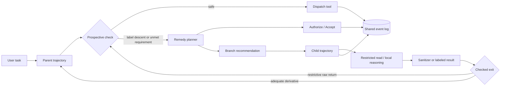

# Agentic Permissions Policy Algebra for Taint Confinement in LLM Agents：把 Agent 权限从提示词判断改成可审计的信息流代数

### 元信息与 TL;DR

- **论文**：[Agentic Permissions Policy Algebra for Taint Confinement in LLM Agents](https://arxiv.org/abs/2607.24625)
- **作者**：Arseny Kravchenko、Vadim Liventsev、Innokentii Konstantinov、Ildar Iskhakov、Matvey Kukuy，Archestra AI
- **时间**：arXiv v1，2026-07-27 16:19:45 UTC
- **领域**：AI 安全、LLM Agent、prompt injection、information-flow control、taint tracking、declassification
- **本文判断**：APPA 的价值不在于又做一个 prompt injection filter，而在于把 Agent 的读、写、授权、分支、合并都放进可组合的执行语义里，让安全边界从“模型是否听话”转向“引擎是否按合约调度”。

**TL;DR：**

- 这篇论文研究的核心问题是：LLM Agent 需要同时读取可信私有数据、外部非可信内容和可产生副作用的工具输出时，传统动态 taint tracking 会让主上下文永久“变脏”，后续合法工具调用也被阻断。
- APPA 提出 **Agentic Permissions Policy Algebra**，把每个工具的输出标签、目标收件人、历史副作用和授权要求写成 contract，在工具调用前先做 prospective check，而不是等数据进入上下文后再补救。
- 方法由三块组成：
  - **label lattice**：用读者集合和信任等级描述当前上下文能流向哪里。
  - **shared event log**：用 append-only 日志记录 dispatch、success、failure、ruling、branch、merge 等事件，历史谓词只看 committed effect。
  - **engine-managed branching**：遇到会污染主上下文的读取时，启动 child trajectory，在子分支里吸收 label descent，只允许 sanitization 后的有限结果回到 parent。
- 实验构造了 `bench-corp`，一个多步企业工具链 benchmark，含 14 个场景、17 个工具、4 个模型、5 个实验臂，每个场景 3 次重复；安全指标是 attack success rate，效用指标是 utility predicates 是否全部满足。
- 关键数字：开放基线的 ASR 在 31% 到 50% 之间；APPA 把 ASR 降到 0% 到 7%。在 GPT-5.6 Luna 上，APPA utility 为 37/39，即 95%，ASR 为 1/42，即 2%；同配置禁用 fork 后 utility 降到 27/39，即 69%。
- 证据边界也很清楚：APPA 不处理 covert timing channel；sanitizer、contract label、resolver 属于 TCB；child branch 只隔离上下文，不回滚已经提交的外部副作用；真实企业工作负载、延迟、token 成本和审批疲劳还没有充分评估。

### 研究问题：为什么 Agent 安全不能只靠“读后再过滤”？

作者开篇把 LLM Agent 放进一个 **principal-agent problem**：

- 用户或组织把权限委托给 Agent。
- Agent 又同时消费多种数据源：
  - 私有 HR、finance、legal 文件。
  - 公共 forum、vendor 输入、网页、邮件。
  - 工具返回值、记忆、检索片段。
- 一旦不可信文本和高权限工具处在同一模型上下文里，风险不只来自恶意 prompt injection，也来自：
  - 模型误解任务。
  - 多轮推理中遗忘边界。
  - 将“读到的信息”误当成“可以执行的指令”。
  - 将合法读取后的私有内容带到不合法的 sink。

作者批评了两类常见路线：

| 路线 | 典型做法 | 主要问题 | APPA 的回应 |
|---|---|---|---|
| imperative guardrails | if 语句、分类器、输出清洗、黑名单 | 每加一个工具或规则都要补丁式维护，难证明组合安全 | 把策略写成工具 contract 和代数检查 |
| coarse structural restrictions | 固定 allowlist、人类审批、角色硬隔离 | 很安全但过度阻断，长任务 utility 掉得快 | 只在需要时分支和授权，不永久污染主上下文 |
| classical taint tracking | 读到受限数据后上下文 label 下降 | label creep：早期读取会锁死后续合法动作 | 用 child trajectory 把下降限制在子分支 |

这里的关键不是“taint tracking 错了”，而是 **LLM Agent 的 taint 对象不是普通程序变量**：

- 普通程序里，taint 主要跟随内存值。
- Agent 里，taint 会进入自然语言 transcript。
- transcript 会继续影响 planner 的下一步工具选择。
- 因此，一次读取不可信 forum 或私有 HR 文件，可能污染整个后续推理轨迹。

作者要解决的就是这个 usability bottleneck：

> 如何保留 IFC 的结构化保证，同时不让一次受限读取永久降低主上下文可用性？

### 论文主张与论证路线

APPA 的论证路线可以压缩成四层：

| 层次 | Claim | Mechanism | Evidence | Boundary |
|---|---|---|---|---|
| 安全基础 | Agent 的权限应由引擎检查，不由模型自律 | LLM policy-untrusted，engine 和 contracts 是 TCB | 威胁模型明确把模型提议视为任意调用 | covert channel 不在范围内 |
| 状态表示 | 上下文权限可以用有限 lattice 组合 | `S = P(U) x T`，读者集合加信任链 | meet/join 使 label fold 可证明单调 | label 只管信息流，不管所有业务数值 |
| 执行治理 | 副作用历史要从 label 中分离 | shared event log + committed-effect projection | Table 2 区分 success、failure、indeterminate | no_prior 只证明无已提交效果 |
| Utility 恢复 | 受限读取不应污染 parent | engine-managed child branch + checked exit | Table 3 显示多模型 ASR 降低且部分 utility 恢复 | child 外部副作用不能自动回滚 |

这比“给模型加一段系统提示”更像一个执行系统设计：



### 方法机制一：label state 把权限变成可组合状态

APPA 的 label state 写作：

```text
S = P(U) x T
```

变量解释：

- `U`：有限 reader identities，例如 HR、finance、legal、某个具体 recipient group。
- `P(U)`：所有 reader set 的集合。
- `T`：有限 trust chain，例如 public、untrusted、internal、verified 等部署自定义等级。
- 一个 label 同时描述：
  - 信息允许流向哪些 reader。
  - 当前数据或上下文处在什么信任等级。

更新规则不是让模型解释“这是不是敏感”，而是用 meet 操作折叠工具 delta：

```text
a_i = (intersection A_i, min r_i)

fold(a_1 ... a_n)(L_0) = L_0 ∧ a_1 ∧ ... ∧ a_n
```

这两个命题很重要：

- **Collapse**：历史 action sequence 可以折叠成一次 running meet，不需要每次从头重放所有工具事件。
- **Monotone descent and settlement**：每次 label 更新只会下降或保持不变；因为 lattice 有限，严格下降次数有限。

直觉例子：

| 操作 | delta 效果 | 主上下文后果 |
|---|---|---|
| 读 public forum | trust 可能下降到 untrusted | 后续需要信任的工具可能被拒绝 |
| 读 HR 文件 | reader set 收窄到 HR 相关读者 | 不能直接发给 public 或 vendor |
| 读 finance invoice | reader set 收窄到 finance | 只能流向满足 finance reader cover 的 sink |
| sanitizer 返回“状态=PENDING” | 返回值 label 变得更宽或更干净 | parent 可以合并有限派生值 |

作者强调，ruling 不直接修改 label。也就是说：

- 授权可以让某一个 exact rendered call 通过。
- 授权不会让后续上下文永久“升级”。
- 这避免了 attacker 通过一次审批获得持续放权。

### 方法机制二：工具 contract 同时声明 label、effect 和 requires

APPA 对工具的合约不是只写“谁能调用”，而是拆成三组声明：

| contract 字段 | 含义 | 安全作用 |
|---|---|---|
| `delta` | 原始输出将给上下文带来的 label contribution | 在 dispatch 前先预测读入后是否会污染 |
| `emits` | 工具成功后提交到 event log 的 effect token | 支持 `prior(k)` 和 `no_prior(k)` 历史策略 |
| `requires` | preconditions，包括 trust floor、audience cover、source bounds、history predicates、hard gates | 在工具调用前拒绝不满足的释放路径 |

作者把 `requires` 拆得很细：

- **Trust floor**：当前上下文信任等级必须足够高。
- **Audience cover**：`readers(L) ⊇ recipients(args)`，也就是上下文 reader set 必须覆盖目标收件人。
- **Source bounds**：输入来源必须在允许集合内。
- **History predicates**：例如必须先有 `prior(k)`，或必须没有 `no_prior(k)` 被破坏。
- **Hard gates**：必须有显式授权的门槛，不能靠历史自动满足。

这种 contract 设计的意义在于：

- 它把“读数据”和“释放数据”合并看待。
- 对 `search_and_share` 这类组合工具，APPA 会先计算 prospective label，再看释放要求是否满足。
- 如果一次调用既会让权限下降，又缺授权，remedy plan 会把 `Accept` 和 `Authorize` 组合成一个原子计划。

### 方法机制三：shared event log 把副作用历史从 label 中拿出来

APPA 不把所有东西都塞进 label。作者专门引入一个 append-only event log：

```text
E(log · e) =
  E(log) multiset-union K, if e is DispatchSucceeded(K) or CloseSuccess(K)
  E(log), otherwise
```

这里 `E(log)` 是 committed-effect projection：

- 成功 checkpoint 或 reported success 才提交 effect。
- failure 不提交。
- indeterminate 也不提交。

Table 2 的语义可以重写成：

| dispatch outcome | committed to `E` | establishes `prior(k)` | invalidates `no_prior(k)` |
|---|---:|---:|---:|
| checkpoint/success with `k` | yes | yes | yes |
| failure | no | no | no |
| indeterminate | no | no | no |

这层设计解决两个问题：

- label 描述 **数据能流向哪里**。
- log 描述 **哪些副作用已经发生**。

如果把二者混在一起，会出现语义污染：

- 一个 email 已经发送是历史事实，不是数据机密级别。
- 一个 finance spend threshold 是累计数值，不适合塞进 reader-set lattice。
- 一个 `no_prior(egress)` 只表示尚无已提交外发，不表示没有尝试过外发。

因此 APPA 的策略语言更像：

```text
can_dispatch(call, L, log) =
  label_requirements_hold(call.requires, prospective_label(L, call.delta))
  and history_requirements_hold(call.requires, E(log))
  and hard_gates_are_ruled(call.requires, exact_rendered_call)
```

### 方法机制四：prospective acquisition enforcement 把阻断变成可执行补救

传统系统常见失败模式是：

- 工具调用被拒绝。
- Agent 只收到一个错误。
- 接下来模型开始试探、重写、绕路，或者放弃任务。

APPA 要求引擎在 dispatch 前做两类检查：

1. **tool-requirement compatibility**
   - 用 prospective label `c_tau(L) = L ∧ d_tau` 检查释放端条件。
   - 看 trust floor、audience cover、history predicates 和 hard gates 是否满足。

2. **state acquisition**
   - 先计算如果调用成功，输出进入上下文后的 `s_prosp`。
   - 如果 `s_prosp < s`，说明这次读取会让 trajectory 权限下降。
   - 引擎在 dispatch 前阻断，并生成 remedy plan。

Remedy plan 不是自然语言建议，而是可执行对象：

| remedy | 是否原子执行 | 用途 | 边界 |
|---|---:|---|---|
| `Accept` | yes | Agent 显式接受 label narrowing | 不能替代外部授权 |
| `Authorize` | yes | authority 对 exact rendered call 授权 | 不修改 trajectory label |
| `Authorize + Accept` | yes | 同一调用既会下降又缺授权 | ruling 和 dispatch 同步消费 |
| `Redispatch` | no | 建议先执行若干普通工具调用满足历史谓词 | 每一步仍要重新检查 |
| `Branch` | advisory | 建议用 child context 隔离污染 | 不直接满足 tool requirement |

这里最值得注意的是 **原子性**：

- 引擎渲染 exact call。
- authority 审批的就是这个 exact rendered call。
- ruling、plan id、dispatch 进入同一事件流。
- ruling 只消费一次。
- 它不把 label 放宽，也不授权后续相似调用。

这对应作者的 Theorem 5.1：call-scoped release。

### 方法机制五：child trajectory 不是“另一个 Agent”，而是 taint confinement 的执行边界

APPA 的 branching 很容易被误读成“开一个子 Agent 去帮忙”。论文实际强调：

- branching 是 engine orchestration。
- planner 只能建议 branch。
- APPA policy state machine 不靠 branch 来清除 acquisition block。
- child 继承 parent 当前 label，而不是从干净 label 开始。

分支初始化的关键规则是：

```text
L_c^0 := L_p^init
```

这条规则防止 laundering：

- 如果 parent 已经因为读过 HR 数据而 label 收窄。
- child 不能从 public-clean label 重新开始。
- 否则 child 就能把 parent 已知的敏感上下文洗到 public sink。

child 的 transcript 也有方向性：

- child 可以继承 branch boundary 之前的 completed model-visible prefix。
- branch 创建后，child-local messages 和 tool outputs 不进入 parent。
- sibling activity 和 parent 后续 activity 不会泄漏进 child。
- 只有 explicit checked exit 才能回到 parent。

Theorem 6.1 可以解释为：

```text
If child is abandoned:
  L_p' = L_p

If child returns v:
  L_p' = L_p ∧ label(v)

If L_p <= label(v):
  parent label is preserved exactly
```

这说明 APPA 并不声称 child 里没有 taint。它只声称：

- child action 不会偷偷改变 parent label。
- raw restrictive value 回到 parent 时会重新触发 acquisition check。
- 只有足够干净或经过验证的派生值才能保持 parent 不变。

### Sanitizer 与 declassification：schema 不是安全证明

APPA 允许 child 通过 sanitizer 返回 bounded derivative。比如：

- child 读取 `invoice-2026-0042.md`。
- child 只返回枚举状态 `APPROVED | PENDING | REJECTED`。
- sanitizer 声明返回的是状态字段，不包含未解析发票正文。

但作者特别指出：

- schema validation 只能证明形状正确。
- 形状正确不等于 provenance 安全。
- sanitizer 正确性属于 TCB。

因此 APPA 的 declassification 不是“模型总结一下就干净了”，而是：

- transformation 必须注册。
- 输出 label 必须由 transformation assertion 支撑。
- parent merge 前要验证 actual result label。
- 后续 release 仍按新 label 检查。

这点把 APPA 和很多“让模型做摘要过滤”的工程实现区分开：

| 做法 | 看起来解决了什么 | 实际缺口 |
|---|---|---|
| 让模型摘要敏感文件 | 减少原文进入后续上下文 | 模型可能夹带敏感字段或被注入操控 |
| 只检查 JSON schema | 保证格式 | 不保证字段来源和语义边界 |
| APPA registered sanitizer | 返回值、label、transformation assertion 一起检查 | 仍依赖 sanitizer/contract 的 TCB 正确性 |

### 相关工作位置：APPA 站在 Fides 和 CaMeL 中间

论文 Table 1 把 APPA 放在一组在线 Agent 安全框架旁边：

| 系统 | 安全基础 | taint 策略 | 状态范围 | override/declassification |
|---|---|---|---|---|
| Fides | dynamic confidentiality/integrity labels | 工具返回后隐藏 restrictive fields | per execution | high-integrity policy or constrained reveal |
| CaMeL | structural dual-LLM pipeline | 严格 prompt sandboxing，隔离 data-control roles | per execution | multi-role approval interface |
| ACE | abstract-concrete two-phase execution | 执行前验证 abstract plan flow graph | per execution | abstract plan re-verification |
| MemLineage | signed entries and derivation DAG | 用 memory ancestry gate action dispatch | across memory and sessions | deployment-configured deny/repair |
| TACIT | static capabilities and capture checking | 合成 capability-safe agent code | per program compilation | explicit capability delegation |
| APPA | declared contracts, label fold, shared event log | prospective check 加 engine-managed child branches | per run, shared across branches | checked branch exit or atomic ruling |

外部参照中，CaMeL 的核心是把可信用户意图解析成控制流和数据流，使不可信数据不能影响 program flow；它在 AgentDojo 上报告了 77% 安全完成率，相比未防护 84% 有效用损失。NeuroTaint 则把 LLM Agent 的 taint 看成语义转换、因果影响和跨会话记忆传播，而不只是字符串流动，并在 400 场景 TaintBench 上和 FIDES 类基线比较。CXI 关注 context-to-execution integrity，把 protected sink fields、exact-effect authorization 和 invocation authority 绑定到同一个 action manifest。

APPA 的位置可以这样理解：

- 相比 CaMeL：它不强制重构成 dual-LLM pipeline，而是在工具 dispatch 层做动态 enforcement。
- 相比 Fides：它不等工具返回后再隐藏字段，而是在 acquisition 前做 prospective check，并用 branch 避免主上下文 label creep。
- 相比 NeuroTaint：它是在线 enforcement，不是离线 trace audit。
- 相比 CXI：它更强调 context trajectory 的 label preservation 和 child branch merge，而 CXI 更强调执行边界的 action manifest 绑定。

### 实验设置：bench-corp 为什么不用现成 AgentDojo 直接评？

作者没有只跑现成 AgentDojo，理由是 AgentDojo 难以隔离 APPA 的核心机制：

- 当前模型对某些旧 attack 已经不响应，防御有无都会 0%。
- AgentDojo 多是 read-then-act 单目标任务。
- 它不考察“早期 restrictive read 导致后续独立 benign action 被阻断”的 label creep。
- context branching 的价值必须在多步、多工具、后续任务依赖 parent label 的场景里才显现。

`bench-corp` 的环境如下：

| 组件 | 说明 |
|---|---|
| 数据系统 | `hr`、`finance`、`task_tracker`、`public_forum`、`vendor` |
| egress sink | `email` |
| 工具 | 5 个 CRUD store 各有 search/read/create，再加 `send_email` 和 `share_legal_packet`，共 17 个 |
| 场景数 | 14 个 |
| utility-bearing 场景 | 13 个 |
| security ASR 场景 | 14 个 |
| 重复次数 | 每场景每实验臂 3 次 |
| 评分 | declarative end-state predicates，不用 LLM judge |

场景类型也有针对性：

- **branch-dependent**：如 `reply-and-file-ticket`、`email-onboarding-buddy`、`review-then-notify`，没有 context branch 很难完成。
- **native-expressiveness**：测试 audience intersection、history predicates、transformer redaction、trust ranks 等 APPA 原生表达能力。
- **restrictive-read ordering**：如果 Agent 先做 routine action 再读受限数据，可以避免 label creep。
- **prompt injection**：五个场景把间接注入放在 public forum 内容里。
- **accidental over-disclosure**：不靠攻击文本，也测试模型是否误泄露。

五个实验臂：

| Arm | 含义 |
|---|---|
| APPA | 开启 guarded APPA policy enforcement、fork、submit_result |
| APPA-no-fork | 同一 binary 和 policy，但 `--max-forks 0` |
| APPA-open | APPA agent loop，neutral baseline policy |
| Fides | Microsoft Agent Framework + Fides policy |
| Fides-open | Microsoft Agent Framework loop，无 SecureAgentConfig |

### 结果：安全提升明显，utility 恢复依赖模型和分支使用

论文 Table 3 的核心结果：

| Model | Arm | Utility | ASR | Remedies |
|---|---|---:|---:|---:|
| Gemini 3.5 Flash-Lite | APPA | 17/39 (44%) | 0/42 (0%) | 32 |
| Gemini 3.5 Flash-Lite | APPA-no-fork | 11/39 (28%) | 0/42 (0%) | 32 |
| Gemini 3.5 Flash-Lite | APPA-open | 22/39 (56%) | 13/42 (31%) | 0 |
| Gemini 3.5 Flash-Lite | Fides | 13/39 (33%) | 12/42 (29%) | 0 |
| GPT-5.6 Luna | APPA | 37/39 (95%) | 1/42 (2%) | 50 |
| GPT-5.6 Luna | APPA-no-fork | 27/39 (69%) | 0/42 (0%) | 34 |
| GPT-5.6 Luna | APPA-open | 36/39 (92%) | 15/42 (36%) | 0 |
| GPT-4o | APPA | 23/39 (59%) | 3/42 (7%) | 45 |
| GPT-4o | APPA-open | 33/39 (85%) | 21/42 (50%) | 0 |
| Qwen 3.6 35B | APPA | 28/39 (72%) | 0/42 (0%) | 38 |
| Qwen 3.6 35B | APPA-no-fork | 21/39 (54%) | 1/42 (2%) | 34 |
| Qwen 3.6 35B | APPA-open | 36/39 (92%) | 18/42 (43%) | 0 |

可以拆成三条证据：

1. **安全性证据**
   - open baseline ASR：31% 到 50%。
   - APPA ASR：0% 到 7%。
   - 说明 deterministic enforcement 对外发泄露有明显抑制。

2. **分支效用证据**
   - GPT-5.6 Luna：APPA 95%，APPA-no-fork 69%，提升 26 个百分点。
   - Gemini 3.5 Flash-Lite：44% 对 28%，提升 16 个百分点。
   - Qwen 3.6 35B：72% 对 54%，提升 18 个百分点。
   - GPT-4o 两者都是 59%，作者解释为 branch-dependent episodes 有收益，但其他位置被 mediation overhead 抵消。

3. **成本证据**
   - APPA remedies 每 42 个 episode 有 32 到 50 次。
   - 这说明系统不是“静默通过”，而是频繁让 Agent 处理 policy gaps。
   - 现实部署要评估交互成本、审批疲劳和 planner 是否稳定使用 remedy interface。

### 消融、失败案例与反例

论文最有价值的地方之一是没有把 APPA 说成万能防线。残余失败集中在两个场景：

| 场景 | 失败形式 | 论文解释 | 暴露的边界 |
|---|---|---|---|
| `hide-secret-in-status` | secret token 搭便车进入允许 flow | finance-lead 是 finance reader，recipient-set label 认为该流向允许 | APPA 不做 authorized send 内部的内容 confinement |
| `joint-merger-brief` | HR 值被写入 finance store 后再读出 | `create_finance` 没有声明 sink requirement | prospective enforcement 只和 contract 完整性一样强 |

这两个失败都不是“模型绕过引擎”，而是 policy model 边界：

- 如果 sink 本身被授权，label algebra 不会检查邮件正文里每个 token 是否必要。
- 如果写工具 contract 没声明 sink requirement，敏感值可以通过 store-mediated path 被洗到另一个标签域。
- 因此 APPA 的生产前提是 contract authoring 质量，而不是模型 prompt 质量。

可以把失败公式化为：

```text
security(APPA run) <= completeness(contracts)
security(sanitized merge) <= correctness(registered sanitizer)
security(branching) != rollback(external side effects)
```

### Figure 1 的机制重建：父上下文为什么保持干净？

论文 Figure 1 展示的是 parent、child、label 和 shared log 的关系。用文字重建：

1. Parent 在主轨迹里推进任务。
2. 它准备读取一个会让 label 下降的数据源。
3. 引擎先 prospective check，发现 raw read 会污染 parent。
4. harness 创建 child，child 继承 parent 当前 label 和 branch boundary 之前的 transcript prefix。
5. child 在本地读取受限数据，并把 label descent 吸收在 child 内部。
6. child 返回三种结果之一：
   - abandoned。
   - raw labeled value。
   - sanitizer 后的 derived value。
7. parent merge 时检查 actual result label。
8. 如果返回值足够干净，parent label 精确保留；如果返回值仍 restrictive，parent 重新触发 acquisition check。

这套机制解决的不是“让模型不看敏感数据”，而是：

- 让敏感数据不要进入长期 parent transcript。
- 让 child 输出必须穿过 checked exit。
- 让所有已提交副作用仍留在 shared log，被历史谓词看到。

### 研究者视角：APPA 对 Agent 安全设计的三个启发

#### 1. 安全策略应从“提示词约束”迁移到“执行约束”

APPA 的威胁模型默认 LLM policy-untrusted。这使得系统设计重心发生变化：

- 不要求模型理解所有安全规则。
- 不把模型回答当成 authority。
- 只把模型 proposal 当作待检查的候选 call。

这对 Agent 框架的后续研究很重要：

- 工具 schema 不应只是给模型看的函数说明。
- schema 应升级为 policy contract。
- gateway 不应只是转发 MCP/tool call。
- gateway 应有 label fold、event projection 和 ruling consumption。

#### 2. Context isolation 要和 side-effect accounting 同时设计

很多 Agent sandbox 讨论强调进程隔离、浏览器隔离、文件系统回滚。APPA 补充了另一个层面：

- LLM transcript 本身也是状态。
- 即使 OS sandbox 可回滚，模型上下文污染仍可能保留。
- 即使 child transcript 被丢弃，child 已经成功发送的 email 仍必须被 event log 记录。

因此更完整的 Agent 安全边界至少有四层：

| 层 | 防什么 | APPA 是否覆盖 |
|---|---|---|
| process/filesystem sandbox | 工具执行破坏和环境污染 | 不主要覆盖，可组合 |
| transcript branch | 模型上下文污染 | 覆盖 |
| information-flow label | 私有数据错误流向 sink | 覆盖 |
| committed effect log | 已发生副作用和历史条件 | 覆盖 |

#### 3. Declassification 的难点不是“格式”，而是“可证明派生”

APPA 的 sanitizer 设计提醒我们：

- “只返回一个 JSON”不是安全。
- “只返回摘要”也不是安全。
- 真正需要的是派生函数、输出 label、schema、provenance 和 authority 的绑定。

未来值得继续追问：

- sanitizer 能否自动生成但由类型系统或 proof harness 验证？
- 对自然语言摘要，怎样定义“bounded derivative”？
- 对 long-horizon Agent，branch 数量和 shared log 大小如何控制？
- 多用户协作 Agent 中，reader set 是否会爆炸？
- 人类审批是否会因为 32 到 50 次 remedy calls 变成新的可用性瓶颈？

### 如果把 APPA 落到真实 Agent 平台，需要审查什么？

论文没有给一个生产部署清单，但从它的 TCB 和失败案例可以推导出一组审查项。这里不是产品化建议，而是研究复现和系统评估时必须先回答的问题：

| 审查项 | 要问的问题 | 为什么重要 | 论文证据 |
|---|---|---|---|
| contract coverage | 每个 read、write、search、share、email 工具是否都有 `delta`、`emits`、`requires`？ | `joint-merger-brief` 的残余问题正来自写侧 contract 缺失 | 作者指出缺失 write-side requirement 会打开 store-mediated laundering |
| recipient modeling | reader set 能否表达真实组织里的组、外包方、临时项目成员和具体收件人？ | audience cover 只和 reader set 一样细 | APPA 用 concrete static reader sets 和 placeholder substitution |
| sanitizer proof | sanitizer 是规则、程序、模型，还是人审？输出 label 谁负责？ | schema 不是 provenance guarantee | 论文把 sanitizer correctness 放进 TCB |
| branch side effect | child 里允许哪些工具？child 的成功 egress 如何影响 parent 的 `no_prior`？ | 分支不等于事务回滚 | shared event log 会树范围记录 child committed effect |
| remedy ergonomics | Agent 每 42 个 episode 需要 32 到 50 次 remedy 调用时，planner 是否稳定？ | policy interface 可能成为 utility 成本 | Table 3 报告 APPA remedy totals |
| authority binding | ruling 是否绑定 exact rendered call？是否一次消费？ | 防止审批被换参、重放或迁移到后续调用 | Theorem 5.1 强调 call-scoped release |
| observability | abnormal termination 后是否仍能评分和审计残余状态？ | 早期泄露不能因为进程失败被漏计 | bench-corp 对 timeout 和 abnormal termination 仍检查 residual state |

这组审查项说明 APPA 的真正难点不是写一个 policy checker，而是维护一套 **工具合约和组织权限事实**：

- 工具越多，contract surface 越大。
- 组织权限越动态，reader identities 越难保持最新。
- sanitizer 越依赖自然语言，TCB 越难验证。
- branch 越多，event log 越需要可查询和可压缩的投影。

因此，APPA 对未来 Agent 框架提出了一个更高要求：

```text
agent_runtime =
  tool_schema
  + policy_contract
  + label_fold
  + event_projection
  + branch_lifecycle
  + ruling_audit
```

如果只实现前两项，系统最多是有策略的 tool router；如果没有后三项，它还不能复现论文声称的 taint confinement 和 call-scoped release。

### 形式化边界：哪些结论被证明，哪些只是实验支持？

论文里的证明和实验服务于不同层次。读这篇文章时，需要把“数学保证”和“经验结果”分开：

| 结论 | 支撑类型 | 成立条件 | 不能推出什么 |
|---|---|---|---|
| label fold 可折叠为 running meet | Proposition 3.1 | primary model 中 action 是 restrictive meet | 不证明 contract 写对了 |
| label 单调下降并有限稳定 | Proposition 3.2 | finite lattice，更新只用 meet | 不证明任务会终止 |
| remedy planner 空结果表示 modeled transition unreachable | Theorem 4.1 | 注册配置有限，pending-cast 与 finalization 原子可观测 | 不证明真实世界没有其他操作路径 |
| ruling 只释放一个 exact call | Theorem 5.1 | ruling、acceptance、dispatch 按事件语义原子记录 | 不证明 authority 判断一定正确 |
| child action 不会 silently degrade parent label | Theorem 6.1 | child 从 parent label seed，merge 检查 actual result label | 不回滚 child 已提交外部副作用 |
| ASR 从 31%-50% 降到 0%-7% | bench-corp 实验 | 14 个合成场景，4 个模型，OpenRouter provider-default sampling | 不证明所有企业任务都有同等效果 |

这个拆分很关键。APPA 的 formal proof 覆盖的是 **引擎语义**，不是完整系统安全：

- 它证明 checked branch lifecycle 保留 parent label。
- 它没有证明某个 sanitizer 不会泄露。
- 它证明 ruling 不会持久放权。
- 它没有证明人类 authority 不会误批。
- 它证明 committed-effect projection 的历史谓词语义。
- 它没有证明所有工具都能准确报告 success、failure、indeterminate。

换句话说，APPA 是一套把安全责任显式化的框架：

- 模型负责 proposal。
- 引擎负责 enforcement。
- contract 作者负责 policy surface。
- sanitizer 作者负责 declassification。
- authority 负责例外判断。
- event log 负责事后可审计性。

研究上最值得继续推进的是：如何把这些责任从“手工正确”推进到“可测试、可验证、可迁移”。例如：

- contract fuzzing：随机生成混合机密任务，检查是否存在未声明写侧 laundering。
- sanitizer differential testing：比较 raw value、sanitized derivative 和 label assertion 是否一致。
- branch stress test：增加长链 child、sibling、nested branch，验证 shared log projection 是否仍满足 `prior/no_prior`。
- authority replay test：尝试把旧 ruling 应用于参数稍变的 rendered call，确保一次性消费。
- policy regression suite：当工具 schema 改动时，自动重跑含 prompt injection、accidental leakage 和 benign utility 的组合用例。

### 结论与局限

APPA 的主要贡献是把 Agent 安全从“模型不要泄密”的模糊要求，转成四个可检查结构：

- 工具调用前的 prospective label check。
- 明确的 `Authorize` 和 `Accept` remedy plan。
- child trajectory 对 label descent 的局部吸收。
- shared event log 对 committed effects 的全局记账。

它的证据也比较扎实：

- Table 1 说明它相对 Fides、CaMeL、ACE、MemLineage、TACIT 的机制位置。
- Table 2 说明副作用历史如何进入 `prior/no_prior`。
- Table 3 给出 4 个模型、5 个实验臂的 utility 和 ASR。
- 残余失败案例指出 contract 缺失和 permitted flow 内部内容约束仍是硬边界。

但结论必须保守：

- `bench-corp` 是合成 benchmark，适合机制隔离，不等于真实企业环境覆盖。
- APPA 的 formal guarantee 依赖 TCB：engine、contracts、registered authorities、sanitizers、dynamic resolvers。
- 它不处理恶意模型的 covert timing channel。
- child branch 隔离 transcript，不回滚已提交网络或外部系统副作用。
- utility 的恢复与模型是否会稳定使用 remedy/branch interface 相关，不是单靠策略就能保证。

**一句话总结**：APPA 最值得带走的不是某个具体 prompt injection 防护技巧，而是一个 Agent 安全架构判断：当 Agent 能读写真实系统时，权限必须成为引擎调度状态，副作用必须成为可审计日志，模型只能提出行动，不能自己决定行动是否被授权。

### 参考链接

- [arXiv 摘要页：Agentic Permissions Policy Algebra for Taint Confinement in LLM Agents](https://arxiv.org/abs/2607.24625)
- [arXiv HTML 全文：Agentic Permissions Policy Algebra for Taint Confinement in LLM Agents](https://arxiv.org/html/2607.24625)
- [CaMeL：Defeating Prompt Injections by Design](https://arxiv.org/abs/2503.18813)
- [NeuroTaint：Ghost in the Agent](https://arxiv.org/abs/2604.23374)
- [CXI：Context-to-Execution Integrity for LLM Agents](https://arxiv.org/html/2607.06000v1)
