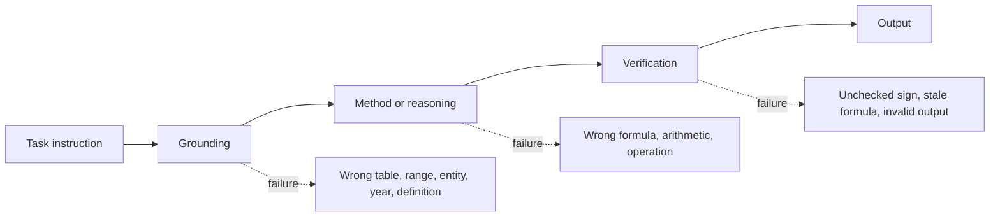
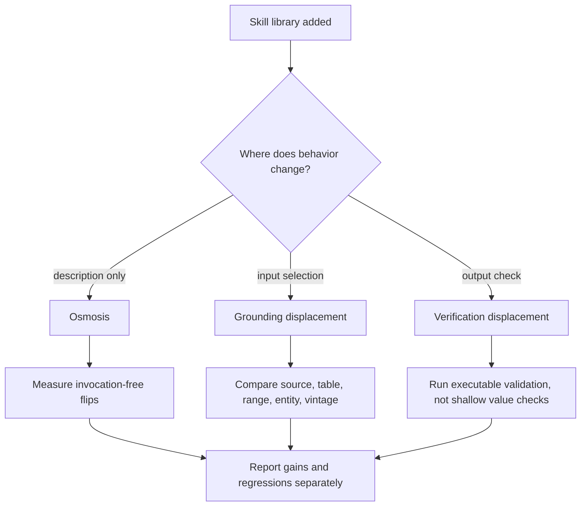

# The Regression Tax：为什么给 LLM Agent 加技能也会让它变差

原文：[The Regression Tax: Decomposing Why Skills Help and Hurt LLM Agents](https://arxiv.org/abs/2607.22520)

PDF：[arXiv PDF](https://arxiv.org/pdf/2607.22520)

HTML：[arXiv HTML](https://arxiv.org/html/2607.22520v1)

日期：2026-07-24

作者：Darshan Tank、Baran Nama

机构：Sentient Labs

类别：大模型 Agent

### TL;DR

- **这篇论文研究什么**：很多 Agent 系统会把可复用“技能”放进上下文，让模型在办公自动化、表格处理、文档问答等任务里按某套流程工作。作者指出，只看平均成功率会掩盖一个成本：技能能修复失败，也能破坏原本已经成功的任务。
- **核心概念**：作者把技能带来的变化拆成 `gain` 和 `regression`。`gain` 是无技能失败、有技能成功；`regression` 是无技能成功、有技能失败。所谓 **Regression Tax**，就是 gross gains 被 regressions 抵消的那部分收益。
- **怎么做实验**：论文在两个办公自动化 benchmark 上运行三组 model-harness stack：OpenCode + MiniMax-M2.7、Codex + GPT-5.4-mini、Claude Code + Claude Sonnet 4.6。每个 stack 跑 486 个任务，在无技能、Anthropic 风格技能、OpenAI 风格技能、作者自建技能四种条件下比较，共 5,832 个 task-condition runs。
- **关键数字**：18 个 library condition 合计出现 553 个 gain transitions 和 324 个 regression transitions；回归抵消了 59% 的 gross gains，净收益只剩 229。OfficeQA-Pro 中 81 个 regression 里，59 个是 grounding displacement，14 个是 skill-description osmosis，3 个混合 grounding + verification，5 个归入 other。
- **最有价值的发现**：最好的技能库未必是“多修了更多任务”，常常是“少弄坏了原本正确的任务”。论文还指出，技能描述即使从未被调用，也可能仅凭常驻上下文改变模型行为，这就是 osmosis。
- **局限**：每个 task-condition 只跑一次，没有估计 seed variance；model 和 harness 是绑定的，不能把结果完全归因于模型或工具框架；机制标注主要由单一作者完成；SpreadsheetBench 有 grader artifact，作者虽然补做 re-grade，但主结果仍受办公自动化任务分布限制。

### 研究问题：技能库到底在帮 Agent，还是在改写 Agent？

这篇论文回应的是一个很实际的 Agent 工程问题：

- 我们常把技能看成“可复用经验”：
  - 一段触发描述；
  - 一段自然语言操作指南；
  - 有时还带脚本、模板或示例。
- 当 Agent 失败后，系统可以从失败轨迹里抽取经验，写成技能，下次遇到相似任务时加载。
- 这类方法的默认评估方式通常是：
  - 加技能后的 pass rate 是否更高；
  - 某个技能库相对 baseline 是否平均提升；
  - 自动生成技能、优化技能或筛选技能后，总体表现是否上升。

作者认为这个评估方式漏掉了最重要的一半。

如果一个技能库让 60 个原本失败的任务变成功，同时让 40 个原本成功的任务变失败，那么平均 pass rate 只显示 `+20` 个净收益。它不会告诉我们：

- 哪些任务是新增成功；
- 哪些任务是新增失败；
- 新增失败是否来自同一种机制；
- 更好的技能库到底是“获得更多 gain”，还是“少制造 regression”。

论文因此把技能效果拆成一个 paired comparison。

| 无技能结果 | 有技能结果 | 名称 | 解释 |
|---|---|---|---|
| fail | pass | gain | 技能修复了任务 |
| pass | fail | regression | 技能破坏了任务 |
| fail | fail | residual failure | 技能没有解决原失败 |
| pass | pass | retained | 原本成功被保留 |

这个拆法很朴素，但对 Agent 评估很关键。

公式上，给定同一组任务：

```text
net_effect = gains - regressions
pass_rate_delta = (gains - regressions) / N
regression_tax = regressions / gains
```

变量解释：

| 变量 | 含义 | 为什么重要 |
|---|---|---|
| `N` | paired task 数 | 必须是同一任务在无技能和有技能下比较 |
| `gains` | fail -> pass 的数量 | 衡量技能修复能力 |
| `regressions` | pass -> fail 的数量 | 衡量技能引入的破坏 |
| `net_effect` | 净变化 | 平均 pass rate 只看到这一项 |
| `regression_tax` | 回归抵消比例 | 衡量 gross gains 被吃掉多少 |

论文的主张不是发明一个复杂新指标，而是要求任何技能库评估都必须报告 paired decomposition。

### 论文主张与论证路线

| Claim | Mechanism | Evidence | Boundary |
|---|---|---|---|
| 平均提升不足以评价技能库 | 同一净提升可以来自高 gain 高 regression，也可以来自低 gain 低 regression | 18 个条件合计 553 gains、324 regressions，回归抵消 59% gains | 这些是 task-condition transitions，不等于唯一任务数 |
| 技能会通过三条通道让 Agent 变差 | osmosis、grounding displacement、verification displacement | OfficeQA-Pro 的 81 个 regressions 被逐轨迹分类，其中 grounding displacement 占 72.8% | 机制标注是观察性分类，不是随机控制因果识别 |
| 技能描述常驻上下文本身就会影响行为 | skill body 未调用，但 description 在系统提示里存在 | UID0096、SpreadsheetBench 等 invocation-free flip 案例 | 单次 flip 可能是随机噪声，作者只把可复现或词汇对齐的情况标成 osmosis |
| 现有技能过度支持 procedure，低估 grounding 和 verification | 很多任务失败不在“怎么做”，而在“读哪个输入”和“检查哪个输出” | OfficeQA-Pro 多数 regression 是 grounding；SpreadsheetBench re-grade 恢复 226 个 treatment task-conditions | 办公自动化任务可能比开放 Agent 任务更依赖文件定位和表格校验 |
| 好技能库应该少制造 regression | 最佳表现常由“回归更少”驱动 | Claude Code + Sonnet 4.6 在 OfficeQA-Pro 上，Anthropic 库 gains 少但 regressions 更少，net 反而最大 | 不代表某个 skill creator 总体更优，作者明确不排名 creator |

这条路线的强点是把“技能是否有效”从单个 pass rate 变成一个故障诊断问题。

它问的不是：

- 技能库平均提高多少？

而是：

- 技能库修复了哪些任务？
- 技能库弄坏了哪些任务？
- 弄坏任务的机制是什么？
- 这些机制能否通过更好的 grounding、verification 或评估协议修复？

### 实验设置：为什么是办公自动化？

论文选择两个办公自动化 benchmark。

| Benchmark | 任务形态 | 主要难点 | 评分方式 |
|---|---|---|---|
| OfficeQA-Pro | 对美国财政文件做复杂问答 | 找对报告、表格、年份、定义，再做多步计算 | 数值答案约 1% 容差 |
| SpreadsheetBench | 编辑真实 Excel 论坛问题的 workbook | 定位单元格、写公式、跨 sheet 操作、排序、去重、填充 | 目标 cell value 精确比较 |

这个选择不是随便的。

办公任务特别适合研究技能副作用，因为它们把 Agent 的执行链拆得很清楚：



作者的关键判断是：

- 技能通常写在 `method` 阶段：
  - 如何计算；
  - 如何写公式；
  - 如何提取；
  - 如何处理表格。
- 但很多真实失败发生在 `grounding` 和 `verification`：
  - 找错表；
  - 读错列；
  - 混淆年份；
  - 没有检查公式输出；
  - 忽略 absolute change 这类输出约束。

因此，一个很会写 procedure 的技能库，可能反而把模型从正确输入上带偏。

### 三个 model-harness stack：不要把模型和框架拆开看

论文没有只测一个模型。

它把模型和 Agent harness 绑定成三个 stack：

| Harness | Model |
|---|---|
| OpenCode | MiniMax-M2.7 |
| Codex | GPT-5.4-mini |
| Claude Code | Claude Sonnet 4.6 |

这个设计有两个含义。

第一，现实 Agent 系统里，模型、工具调用协议、技能加载方式、文件访问方式往往绑在一起。单独说“某模型会不会受技能影响”并不完整。

第二，这也带来局限。因为 harness 和 model 没有交叉组合，实验不能回答：

- 同一个模型换 harness 是否仍有同样 regression；
- 同一个 harness 换模型是否仍有同样 osmosis；
- 某个技能 creator 是否对所有运行时都更稳。

作者处理得比较谨慎：把 stack 当分析单位，不把结果扩展成模型排名。

### 技能库怎么生成？

每个 stack 都有一套从失败轨迹生成技能的流程。

流程分四步：

1. **Baseline run**：无技能运行，记录轨迹。
2. **Analyst extraction**：分析轨迹，抽出反复出现、可修复的失败信号。
3. **Meta-skill creator**：把失败信号转成技能。
4. **Evaluation run**：把技能放回上下文，再跑 benchmark。

作者比较三类 creator：

| Creator | 特征 | 潜在影响 |
|---|---|---|
| Anthropic-style | 按 Claude Code skill-authoring guide；会用测量循环重写技能 | 技能文本受 eval loop 影响 |
| OpenAI-style | 按 Codex guide；结构校验后单次生成 | 技能数量和拆分可能更多 |
| Ours | 作者自建；先搜索相似技能再更新；有自评改写 | 更强调复用和 checklist |

论文没有把这三者当排行榜。

它们的作用是制造多种技能库形态，让作者观察：

- 同一组失败信号，被不同 creator 写成不同数量和措辞的技能；
- 技能描述和技能正文对 Agent 行为的影响可能不同；
- 同一任务在不同库下的 flip，可以帮助定位机制。

一个重要细节是：**技能 description 常驻系统提示，技能 body 只有被调用才加载**。

这为 osmosis 机制提供了可观察切口。

如果某个任务里 skill body 从未被读，但结果仍从 pass 变成 fail，并且多个库出现同向变化，那么技能的“存在”本身就可能影响了模型。

### 主结果：回归税有多大？

总规模是：

```text
486 tasks per stack
4 conditions per stack
3 stacks
486 x 4 x 3 = 5,832 runs
```

其中 paired comparison 是 treatment against no-skill。

Table 2 给出所有 18 个 library condition。

最核心的合计结果：

| 指标 | 数值 | 解释 |
|---|---:|---|
| Gross gains | 553 | 无技能失败、有技能成功 |
| Regressions | 324 | 无技能成功、有技能失败 |
| Net transitions | 229 | 553 - 324 |
| Regression offset | 59% | 324 / 553 |
| OfficeQA-Pro gains | 122 | 文档问答中被修复的 task-condition |
| OfficeQA-Pro regressions | 81 | 文档问答中被技能弄坏的 task-condition |
| SpreadsheetBench gains | 431 | 表格任务中被修复的 task-condition |
| SpreadsheetBench regressions | 243 | 表格任务中被技能弄坏的 task-condition |

这就是论文标题里的 regression tax。

一个技能库看起来有效，不等于它只带来收益。它可能同时：

- 修复一批任务；
- 破坏一批任务；
- 最后只留下较小净收益；
- 甚至在统计校正后不再显著。

### 为什么 paired decomposition 会改变解释？

论文举了一个很好的对比。

在 Claude Code + Sonnet 4.6 的 OfficeQA-Pro 上：

| Library | Gains | Regressions | Net |
|---|---:|---:|---:|
| Anthropic-style | 10 | 2 | +8 |
| OpenAI-style | 12 | 7 | +5 |
| Ours | 11 | 4 | +7 |

如果只看 gains：

- OpenAI-style 最高；
- Anthropic-style 最低。

如果看 net：

- Anthropic-style 最高；
- 原因不是它修得最多，而是它弄坏得最少。

这个例子把论文立场说清楚了：

- 技能评估不能只奖励“多救几个失败任务”；
- 还必须惩罚“破坏原本成功任务”；
- 否则会偏向激进、宽泛、侵入式的技能描述。

### 统计显著性：大多数提升并不稳

作者对每个 treatment vs no-skill 做 exact McNemar test。

原始 `p < .05` 的条件有 5 个：

| Stack + Benchmark | Library | Net |
|---|---|---:|
| Claude Code + Sonnet 4.6 / SpreadsheetBench | Anthropic-style | +43 |
| Claude Code + Sonnet 4.6 / SpreadsheetBench | OpenAI-style | +43 |
| Claude Code + Sonnet 4.6 / SpreadsheetBench | Ours | +47 |
| Claude Code + Sonnet 4.6 / OfficeQA-Pro | Anthropic-style | +8 |
| OpenCode + MiniMax-M2.7 / SpreadsheetBench | Anthropic-style | +27 |

但作者还做了 Bonferroni correction：

```text
alpha_corrected = 0.05 / 18 = 0.0028
```

校正后只剩 Claude Code + Sonnet 4.6 在 SpreadsheetBench 上的三个技能库保持显著。

这带来两个判断：

- 技能确实能在某些 stack + benchmark 上产生真实提升；
- 但这个提升不是跨所有设置稳定出现的通用规律。

因此，论文没有说“技能没用”，而是说：

- 技能的净收益很窄；
- 回归成本普遍存在；
- 不拆 gains/regressions，就无法知道收益来自哪里。

### 机制一：Skill-description osmosis

`Osmosis` 是论文里最有意思的机制。

定义：

- skill body 没有被调用；
- skill description 仍在上下文里；
- agent 行为发生变化；
- 变化和 description 里的词汇或多个库的同向 flip 对齐。

这类问题对现有技能筛选方法很危险。

如果一个方法只在“技能被检索或调用”后评估技能影响，那么它看不到 description 常驻上下文带来的行为漂移。

论文给出 UID0096 案例：

| 条件 | 行为 | 结果 |
|---|---|---|
| 无技能 | 返回 37.708% | pass |
| 三个技能库存在但未调用 | 都返回 38.757% | fail |

作者的解释不是“任何单次变化都叫 osmosis”。

他们设置了更窄的证据条件：

- 多个独立技能库出现同向变化；
- 行为变化和 description 中的词汇对齐；
- 对缺少这些信号的 presence-only flip，归为 Other，而不是强行归为 osmosis。

这对 Agent 系统设计很重要。

技能描述不只是 metadata。

它在系统提示中是长期存在的软控制信号，会改变模型对任务的默认解释。

### 机制二：Grounding displacement

`Grounding displacement` 是 OfficeQA-Pro 中最主要的 regression 机制。

定义：

- 技能 body 被调用或读取；
- 任务失败发生在输入阶段；
- agent 找错表、范围、实体、年份、定义或前提；
- 但无技能 baseline 原本读对了输入。

OfficeQA-Pro 的 81 个 regression 分类如下：

| Mechanism | Count | Share |
|---|---:|---:|
| Grounding displacement | 59 | 72.8% |
| Osmosis | 14 | 17.3% |
| Grounding + verification | 3 | 3.7% |
| Other | 5 | 6.2% |

这说明很多 regression 并不是技能教错了算法，而是技能让模型读错了世界。

论文的 UID0025 案例很典型：

| 条件 | 读到的 1934 数值 | 读到的 1946 数值 | 计算 | 结果 |
|---|---:|---:|---|---|
| 无技能 | 549 | 407 | `|549 - 407|` | 142，pass |
| 有技能 | 949 | 407 | `|949 - 407|` | 542，fail |

两次算术都对。

真正的错误是：

- 有技能条件下，导航技能把 agent 带到错误 figure；
- agent 按正确方法计算了错误输入；
- procedure 没坏，grounding 坏了。

这也是论文最值得带走的工程教训：对 Agent 来说，“怎么做”的 instruction 很容易压过“先确认你读的是不是对的输入”。

### 机制三：Verification displacement

`Verification displacement` 是输出检查被技能替代或压制。

它在 OfficeQA-Pro 中不是最多，但在 SpreadsheetBench 的 re-grade 分析里很关键。

作者指出，SpreadsheetBench 的原 grader 有一个 artifact：

- 它比较目标 cell value；
- 如果 agent 写公式，grader 会尝试重新计算；
- 但某些现代 Excel 函数或 structured references，原评分引擎不能正确求值；
- 因此正确公式可能被判错。

作者对 663 个 treatment failing tasks 中含公式的样本做 full spreadsheet engine 复核：

| 类别 | Count | Share | 含义 |
|---|---:|---:|---|
| already-correct formulas | 226 | 34% | 公式本来正确，原 grader 不能评估 |
| genuinely wrong value | 396 | 60% | 重新计算后仍错 |
| engine cannot evaluate | 41 | 6% | full engine 仍无法评估 |

这说明有一部分失败不是 agent 没做对，而是验证链路没有跟上。

Table 5 中，修正评分后，不同 stack 的 SpreadsheetBench pass rate 提升明显：

| Stack | Library | Raw | Corrected | Recovered |
|---|---|---:|---:|---:|
| OpenCode + MiniMax-M2.7 | Anthropic-style | 70.2 | 74.7 | +18 |
| OpenCode + MiniMax-M2.7 | OpenAI-style | 64.3 | 68.4 | +16 |
| OpenCode + MiniMax-M2.7 | Ours | 65.6 | 69.6 | +16 |
| Codex + GPT-5.4-mini | Anthropic-style | 67.6 | 78.6 | +43 |
| Codex + GPT-5.4-mini | OpenAI-style | 66.6 | 79.1 | +49 |
| Codex + GPT-5.4-mini | Ours | 67.1 | 77.8 | +42 |
| Claude Code + Sonnet 4.6 | Anthropic-style | 81.1 | 84.9 | +15 |
| Claude Code + Sonnet 4.6 | OpenAI-style | 81.1 | 85.2 | +16 |
| Claude Code + Sonnet 4.6 | Ours | 82.1 | 84.9 | +11 |

这里的含义不是“原 benchmark 全错了”。

更准确地说：

- 对 spreadsheet agent，输出验证必须执行真实 workbook；
- cell-value shallow grading 会惩罚某些正确公式；
- 技能如果只教 agent 写更复杂公式，却不教它验证公式求值，就会把风险后移到 evaluation layer。

### 一个更实用的 Agent 技能故障模型

论文实际提出了一个三段式故障模型。



这个模型比“技能有用/没用”更接近真实调试。

对每次 pass -> fail，应该问：

1. **技能是否被调用？**
   - 没调用但结果变了，要检查 description osmosis。
2. **输入是否变了？**
   - 表格、年份、定义、范围、实体是否和 baseline 不同。
3. **方法是否真的错？**
   - 还是方法正确但用在了错误输入上。
4. **输出是否被验证？**
   - 公式是否执行；
   - 符号、单位、absolute/relative 约束是否检查；
   - evaluator 是否能评估 agent 产物。
5. **这个变化是单次噪声还是可复现信号？**
   - 多库同向；
   - 和 description vocabulary 对齐；
   - 还是孤立 flip。

### 和相关工作的关系：从“生成技能”转向“约束技能副作用”

论文把自己放在三个相关方向之间。

| 方向 | 代表问题 | 这篇论文的位置 |
|---|---|---|
| 自动生成技能 | 如何从失败轨迹生成可复用技能 | 不直接提出新 skill creator，而是评估技能带来的破坏 |
| 有害技能筛选 | 哪些技能应该 mask、drop、admit | 不只问删哪个技能，而是问为什么 regressed |
| 长上下文干扰 | 额外上下文如何影响推理 | 把 skill description 视为常驻上下文干扰源 |

这个定位很清楚。

它不是要证明某个 creator 最好，也不是要给出一个新的万能技能系统。

它真正推进的是评估协议：

- 技能库不是单向增益；
- 技能描述不是无害标签；
- 技能 body 不是唯一影响渠道；
- 技能越多、越强、越 procedural，不一定越可靠。

### Figure 和 Table 逐项证据解读

| 图表 | 支撑的结论 | 不能证明什么 |
|---|---|---|
| Figure 1 | Agent 任务可拆成 grounding、method、verification；现有技能主要支持 method，失败集中在 grounding 和 verification | 不能证明所有 Agent 任务都遵循同样三段结构 |
| Table 1 | 三个 model-harness stack 分别覆盖 OpenCode、Codex、Claude Code | 不能把模型效应和 harness 效应分离 |
| Table 2 | 所有技能库都存在 regressions；net effect 是 gains - regressions | 不能估计 seed variance，因为每个条件只跑一次 |
| Table 3 | OfficeQA-Pro 的 regression 主要是 grounding displacement | 机制标注不是随机控制实验 |
| Table 4 | SpreadsheetBench regression 中 osmosis、body engaged、grader artifact 都存在 | 表格任务机制分类比 OfficeQA-Pro 粗 |
| Table 5 | full spreadsheet engine 可恢复 226 个原先被判错的 treatment task-conditions | 不说明所有 recovered outputs 都来自同一技能机制 |
| Appendix B/C cases | 用具体轨迹说明 grounding、verification、osmosis | 案例不能单独代表总体分布 |

### 证据边界与局限

这篇论文的实证价值很高，但边界也清楚。

#### 1. 没有多 seed

每个 task-condition 只跑一次。

这意味着：

- 单个 flip 可能来自随机解码；
- 作者需要用 cross-library、词汇对齐、trajectory evidence 降低误判；
- 统计检验基于 paired discordant counts，不等于完整 runtime variance 分解。

因此，最稳的结论是总体 paired decomposition 和机制观察，而不是某个单任务的因果判定。

#### 2. Model 和 harness 绑定

OpenCode、Codex、Claude Code 的技能调用方式不同。

论文也显示 engagement rate 差异很大：

- 有的 stack 在 OfficeQA-Pro 上几乎总读技能；
- 有的 stack 在 SpreadsheetBench 上几乎不读技能；
- 但 description 仍会常驻上下文。

所以结论应读成：

- 在真实 stack 中，技能副作用存在；
- 不能读成“某模型必然更容易 osmosis”。

#### 3. 技能库没有长度匹配

不同 creator 生成的技能数量、措辞、大小都不同。

作者用它们做 mechanism contrast，但不把 treatment-vs-treatment 当 token-dose 控制实验。

这很合理，也限制了结论：

- 可以说“不同技能写法会改变结果”；
- 不能说“短技能一定更安全”或“某 creator 绝对更好”。

#### 4. 任务范围偏办公自动化

OfficeQA-Pro 和 SpreadsheetBench 很适合定位 grounding/verification，但开放 Web Agent、代码 Agent、安全 Agent 的失败形态会更多。

例如：

- 工具权限；
- 网络副作用；
- 跨会话状态；
- prompt injection；
- 用户授权边界；
- 代码执行环境。

这些没有被这篇论文直接覆盖。

但论文的评估方法可以迁移：任何 Agent 技能都应该报告 gains、regressions、residual failures 和 retained successes。

### 对 Agent 系统研究的延伸

这篇论文最有价值的地方，是把“技能”从知识资产改写成控制变量。

技能不是简单的 memory。

它至少同时扮演三种角色：

| 角色 | 正面作用 | 风险 |
|---|---|---|
| Retrieval hint | 帮模型调用正确经验 | 描述常驻上下文导致 osmosis |
| Procedure guide | 给出可复用步骤 | 覆盖任务特定 grounding |
| Verification policy | 提醒检查输出 | 如果缺失或错误，会压制原有自检 |

因此，下一代 Agent skill system 不应只优化“技能命中率”或“调用后收益”。

更合理的评估面板应该包含：

| 指标 | 问题 | 可能做法 |
|---|---|---|
| Gross gains | 技能修复了多少任务 | fail -> pass paired count |
| Regression count | 技能破坏了多少任务 | pass -> fail paired count |
| Invocation-free flips | 描述本身是否改变行为 | body 未调用的 paired flips |
| Grounding error rate | 技能是否带偏输入定位 | 对比 source/table/range/entity |
| Verification recovery | 输出检查能恢复多少失败 | executable validation / re-grade |
| Regression budget | 是否允许技能上线 | held-out probe + regression cap |

如果把这套思想放到代码 Agent 或浏览器 Agent，风险会更高。

办公自动化里的 regression 可能只是错误数值或错误表格。

代码 Agent 里的 regression 可能是：

- 删除原本正确的边界条件；
- 把测试从强断言改成弱断言；
- 为了套用技能模板引入过宽权限；
- 误读已有架构，写出局部正确但系统层面冲突的改动。

浏览器 Agent 里的 regression 可能是：

- 把外部页面文本当用户指令；
- 把历史授权套到新上下文；
- 在不该提交的表单里执行 procedure；
- 因为技能说“先登录/先导出”而绕过当前任务边界。

这就是为什么 grounding 和 verification 比 procedure 更重要。

### 我认为最值得继续追问的三个问题

#### 问题一：技能描述能否分级加载？

如果 description 本身会产生 osmosis，那么技能系统不应该把所有 description 长期放入系统提示。

更稳的设计可能是：

- 先用 embedding 或符号 metadata 检索候选技能；
- 只把极短、低语义干扰的 skill handle 放入上下文；
- 在真正需要时再加载 description 和 body；
- 对 invocation-free flips 单独做 regression test。

这不是论文直接验证的方案，但它是从 osmosis 机制自然推出的工程方向。

#### 问题二：技能应该先写 grounding checklist，而不是 procedure checklist？

论文数据说明 procedure 往往不是最主要失败点。

因此，一个表格任务技能不应只写：

- 如何写公式；
- 如何填充单元格；
- 如何排序。

它还应该写：

- 先确认目标 sheet；
- 先确认目标 range；
- 先确认 instruction 中的单位、年份、定义；
- 先读取示例行；
- 输出后执行 workbook 级验证。

换句话说，技能应该把“读对输入”和“查对输出”放到 procedure 之前。

#### 问题三：Agent benchmark 是否都要报告 regression matrix？

如果一个 Agent 平台宣称“启用技能后提升 8 个点”，但没有报告 pass -> fail，那么这个数字不完整。

一个更可信的 benchmark 报告应包括：

```text
baseline_pass
treatment_pass
gains
regressions
residual_failures
retained
invocation_rate
invocation_free_gains
invocation_free_regressions
mechanism_labels
```

这会让 Agent 系统从“平均成功率竞赛”走向“可靠性审计”。

### 结论

The Regression Tax 的核心贡献是把技能库评估从平均成功率拆成可审计的 paired transitions。

它证明了一个反直觉但重要的事实：

- 技能确实能帮 Agent；
- 但每个技能库都可能破坏原本成功的任务；
- 有些最好的技能库靠的不是更多 gains，而是更少 regressions；
- 技能 description 即使不调用，也可能改变行为；
- 很多失败不在 procedure，而在 grounding 和 verification。

对 Agent 研究者来说，这篇论文的实际启发是：

1. 评估技能必须报告 gains 和 regressions。
2. 技能上线必须有 regression budget。
3. 技能描述要当作行为控制面，而不是无害 metadata。
4. 技能内容应优先支持 grounding 和 verification。
5. 对 spreadsheet、code、browser、security agent，必须把执行后验证做成一等能力。

这篇论文没有给出一个新 Agent 架构，但它给出了一个更严格的评估镜头。

在 Agent 越来越依赖长期记忆、技能库和自我改进循环之后，这个镜头会越来越重要：任何“让 Agent 学会更多”的机制，都必须同时回答它让 Agent 忘错、读错、查错、做错了什么。

最后还要强调一点：技能系统的可靠性不是写作风格问题，而是实验设计问题。只要技能描述会进入上下文，它就已经是模型行为的一部分；只要技能正文会改变操作流程，它就必须接受回归审计；只要输出交给外部 grader，它就必须证明验证器能看懂 Agent 实际产物。否则，所谓技能收益很可能只是把失败从显眼的 procedure 阶段转移到了更隐蔽的 grounding、context 或 validation 阶段。
