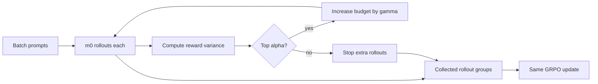

# VIGOR：把 RLVR 的 rollout 预算花在“正在学会”的题上

## 元信息与 TL;DR

- **论文**：Learning as Reasoning Unfolds: Progressive Rollout Allocation for Efficient Reinforcement Learning
- **作者**：Heyang Jiang, Henry Liu, Baharan Mirzasoleiman
- **机构**：University of California, Los Angeles
- **会议/版本**：COLM 2026；arXiv:2607.22002v1，2026-07-24；本轮 Scout 在 arXiv 2026-07-27 新列表窗口中发现。
- **原文**：[arXiv abs](https://arxiv.org/abs/2607.22002)；[HTML](https://arxiv.org/html/2607.22002v1)；[PDF](https://arxiv.org/pdf/2607.22002)
- **第三方/作者页参考**：[Baharan Mirzasoleiman publications](https://baharanm.github.io/publications/)；[ChatPaper 条目](https://chatpaper.com/chatpaper/paper/313497)

### TL;DR

- 这篇论文讨论的是 **RLVR/GRPO 后训练的 rollout 浪费**：每个 prompt 固定采样 8 条或更多推理轨迹时，许多样本组要么全对、要么全错，组内 reward 方差接近 0，给 GRPO 的相对优势更新提供不了有效梯度。
- 作者提出 **VIGOR（VarIance Guided Online Rollout allocation）**：每个 batch 先给所有 prompt 少量 rollout，例如 `m0=2`；计算组内 reward 方差；只保留方差最高的一部分 prompt；再把后续 rollout 预算乘法式加到这些 prompt 上。
- 方法没有改变 GRPO 的目标函数，也没有给 zero-variance 样本造新 reward；它只改 **rollout 预算分配顺序**：先低成本探测，再把计算集中到“模型有时会、但还不稳定”的学习前沿。
- 理论上，论文证明二元可验证 reward 下，组内 reward 标准差控制 reward-driven 梯度信号；在 prompt 方差呈 heavy-tail 的假设下，VIGOR 的有效方差放大可转化为闭式训练时间尺度优势。
- 实验覆盖数学推理和代码生成：数学上在 Qwen2.5-3B 的 MATH 训练中，VIGOR 达到目标准确率所需 rollout 最多减少 **2.3 倍**；代码上在 LiveCodeBench v6 + Qwen3-8B 中，达到 GRPO 最终 full pass rate 所需 rollout 减少 **1.49 倍**，平均测试通过率提升 **3.4 个百分点**。
- 关键边界也很清楚：VIGOR 依赖可验证 reward，适用于数学、代码这类能快速给 pass/fail 或可验证反馈的任务；它不直接解决开放式偏好对齐、长程多轮 agent 状态、奖励黑客化或 verifier 本身错误的问题。

## 研究问题：为什么固定 rollout 预算会拖慢 RLVR？

### 论文真正关心的瓶颈

- RLVR 的强点是：
  - 数学题可以用答案验证器给 reward。
  - 代码题可以用单元测试给 reward。
  - 不需要人类偏好标注就能训练推理模型。

- 但 GRPO 的默认做法很粗：
  - 对每个 prompt 采样同样数量的 rollouts。
  - 用组内 reward 做相对优势。
  - 不管这个 prompt 是否已经稳定、是否完全不会、是否恰好处在学习边界。

- 论文把问题收敛到一个具体判断：
  - **不是所有 prompt 在同一训练步都值得继续采样。**
  - 最值得采样的是 reward 有分歧的 prompt。
  - 方差低的 prompt 很可能不产生有效相对优势。

### 为什么“全对”和“全错”都没有信息量？

| rollout 组状态 | reward 形态 | 对 GRPO 的含义 | 预算判断 |
|---|---:|---|---|
| 模型基本掌握 | 多数或全部为 1 | 相对优势很小，继续采样边际收益低 | 少花 |
| 模型完全不会 | 多数或全部为 0 | 没有可比较的成功轨迹，信号弱 | 少花 |
| 模型摇摆不定 | 0/1 混合 | 组内差异能告诉优化器该强化哪些轨迹 | 多花 |

### Figure 2 的动机证据

- 论文先测了 GRPO 的运行组成：
  - 在 Qwen2.5-1.5B 的 RLVR 训练中，rollout generation 至少占总训练时间的 **50%**。
  - batch size 超过某个阈值后，rollout 时间几乎随生成数量线性增长。
  - 长 CoT 推理会进一步放大这一成本。

- 作者还观察到训练收益的时间分布：
  - MATH 上 1.5B 和 3B 模型的第一轮训练已经贡献约 **80%** 的最终验证增益。
  - 7B 模型在 MATH+DAPO 混合数据上，第一轮收益也接近后续多轮总收益。

- 这两个观察合起来说明：
  - rollout 是真实成本瓶颈。
  - 早期训练错过高信息 prompt，会损失大量可得收益。
  - 只在后期用历史统计筛 prompt，可能太晚。

## 论文主张与论证路线

### claim -> mechanism -> evidence -> boundary

| 层次 | 论文内容 | 作用 |
|---|---|---|
| Claim | reward 方差高的 prompt 更有训练价值 | 把“困难样本”重新定义为“正在产生分歧的样本” |
| Mechanism | 先少量 rollout，再按方差筛选并加大后续预算 | 用在线信号替代静态难度或历史难度 |
| Evidence | 数学、代码、消融、多 seed、时间测量 | 证明不是只提升曲线，也能保持或提升最终质量 |
| Boundary | 依赖 verifiable reward；初始估计可能漏掉部分 frontier prompt | 明确适用范围和误判风险 |

### 与已有方法的差别

- GRESO/DPS 代表一种思路：
  - 用早期训练统计或历史信号识别困难样本。
  - 问题是需要等待历史积累，初始阶段无法立刻利用。
  - GRESO-g 还会消耗更多 rollout，因此不一定是公平算力比较。

- RL-ZVP 代表另一种思路：
  - 当样本组 zero variance 时，额外注入 token-level 或 entropy-guided 信号。
  - 它试图“改造无效样本”。
  - VIGOR 则更保守：不改 reward，只少采这些 prompt。

- PODS 代表 oversampling/filtering：
  - 先生成更多 rollouts，再挑多样信号。
  - 对长 CoT 特别昂贵。
  - VIGOR 试图在生成过程中就停止浪费。

## 方法机制：VIGOR 如何分配 rollout？

### 核心变量

| 符号 | 含义 | 直觉 |
|---|---|---|
| `x` | 一个训练 prompt | 数学题或代码题 |
| `Y_x` | prompt `x` 已生成的 rollout 集合 | 当前证据池 |
| `R(x,y)` | 对 rollout `y` 的可验证 reward | 数学答案或测试结果 |
| `u_x` | `Var({R(x,y)})` | prompt 的信息量评分 |
| `m0` | 初始 rollout 数 | 论文默认 2 |
| `T` | refinement 轮数 | 论文默认 4 |
| `alpha` | 每轮保留比例 | 论文默认 0.5 |
| `gamma` | 保留 prompt 的预算扩张倍数 | 论文默认 2 |

### 算法流程

```text
Input:
  training dataset D
  reward function R
  total steps S
  batch size B
  initial rollout budget m0
  refinement rounds T
  expansion ratio gamma
  selection ratio alpha

State:
  policy pi_theta
  active prompt subset A_t
  rollout set Y_x for each prompt x

For each training step s = 1 ... S:
  1. Sample batch B from D.
  2. For each prompt x in B:
     - set Y_x = empty
     - set m_x = m0
  3. Set active subset A_1 = B.
  4. For t = 1 ... T:
     - For each x in A_t:
       - generate m_x rollouts from pi_theta(. | x)
       - append them to Y_x
       - compute u_x = Var({R(x,y) | y in Y_x})
     - If t < T:
       - keep top alpha fraction by u_x as A_{t+1}
       - multiply each retained m_x by gamma
  5. Use collected rollout groups Y_x for the ordinary GRPO update.

Output:
  updated policy pi_theta
```

### 这个流程为什么“不换训练算法”？

- VIGOR 没有替换 GRPO 的更新公式。
- 它没有引入额外价值函数。
- 它没有把 verifier reward 改造成 dense reward。
- 它只改变 rollout 生成前后的预算调度。



## 理论解释：为什么 reward 方差能代表梯度信号？

### Theorem 1 的直觉

- GRPO 在一个 prompt 内比较多个 rollout。
- 如果所有 rollout 的 reward 一样，归一化 advantage 很难提供差异化学习方向。
- 如果 reward 一半成功、一半失败，优化器最容易区分应强化和应抑制的轨迹。

论文在二元 reward 场景中给出关系：

$$
S=\sum_{i=1}^{G}|A_i|=G\sigma
$$

变量解释：

- `G`：同一个 prompt 下 rollout 组大小。
- `A_i`：第 `i` 条 rollout 的归一化 advantage。
- `sigma`：组内 binary reward 的标准差。
- `S`：reward-driven 梯度信号的总强度代理。

### 这条公式的含义

- 当 reward 全为 0 或全为 1：
  - `sigma = 0`。
  - `S = 0`。
  - 组内相对学习信号消失。

- 当 reward 成功/失败混合：
  - `sigma` 变大。
  - `S` 随之变大。
  - 这个 prompt 更值得继续采样和更新。

### Theorem 2 的时间尺度分析

论文进一步假设 prompt-level reward variance 的上尾服从 Pareto 分布：

$$
f(u)=\frac{k u_{\min}^{k}}{u^{k+1}},\quad u \ge u_{\min},\quad k>1
$$

在 VIGOR 中，第 `i` 轮：

$$
P(u > u_i^\star)=\alpha^i,\quad u_i^\star=u_{\min}\alpha^{-i/k}
$$

有效方差放大写成：

$$
\eta_{\mathrm{exact}}
=
\frac{\mathrm{Var}_{\mathrm{VIGOR}}}{\mathrm{Var}_{\mathrm{GRPO}}}
=
\frac{\sum_{i=0}^{T-1}(\gamma\alpha^{1-1/k})^i}
{\sum_{i=0}^{T-1}(\alpha\gamma)^i}
$$

训练时间尺度再由下式连接：

$$
\frac{\tau_{\mathrm{GRPO}}}{\tau_{\mathrm{VIGOR}}}
=
\eta_{\mathrm{exact}}^{1/3}
$$

### 理论边界

- 这是一个解释性理论，不是所有训练分布的无条件保证。
- Pareto 上尾假设表达的是“少数 prompt 很有信息量，多数 prompt 信息量很低”的 regime。
- 这个 regime 在 RLVR 中有现实直觉：
  - 已掌握题目变成低方差。
  - 完全不会的题也低方差。
  - 中间难度题形成高方差 frontier。

## 实验设置：作者如何保证比较不只是多花算力？

### 数学任务

| 维度 | 设置 |
|---|---|
| 模型 | Qwen2.5-1.5B、Qwen2.5-3B、Qwen2.5-7B、Phi-4-Mini-Instruct |
| 训练数据 | 1.5B/3B 用 MATH；7B/Phi 使用 MATH+DAPO 混合 |
| 验证基准 | Math500、AIME24、AMC、Gaokao、Minerva Math、Olympiad Bench |
| reward | Math-Verify |
| VIGOR 参数 | `T=4, m0=2, gamma=2, alpha=0.5` |
| baseline rollout | 每个 prompt 8 条 rollout，匹配 VIGOR 的总预算 |
| 训练资源 | 主训练使用 8xGH200；部分统计实验使用 4xA40 |

### 代码任务

| 维度 | 设置 |
|---|---|
| 模型 | Qwen3-8B |
| 基准 | LiveCodeBench v6 |
| reward | public unit tests 的 pass/fail 和执行反馈 |
| 验证 | hidden/private tests |
| 上下文 | prompt 2048，response 8192 |
| batch | training batch size 64 |
| 训练 | 16 GPUs，31 epochs |
| 采样验证 | 每 5 training steps，top-p 0.95，temperature 0.6 |
| 随机性 | GRPO 与 VIGOR 各跑 3 seeds |

### baseline 分组

- **GRPO**：固定 rollout 预算的标准基线。
- **GRESO-r**：把 GRESO 限制在相同总 rollout 预算内。
- **GRESO-g**：匹配 gradient update 数，因此大约花两倍 rollout，属于不完全公平但有参考价值的强对照。
- **RL-ZVP**：用 zero-variance prompt 的额外信号提高利用率。
- **PODS**：在更大 rollout 预算 `n=32` 的补充实验中比较。

## 主结果：数学与代码上的证据

### Figure 1 支撑什么？

- 左图是代码：
  - LiveCodeBench v6 + Qwen3-8B。
  - VIGOR 更快达到 GRPO 最终 full pass rate。
  - 需要 rollout 减少 **32.9%**，等价于 **1.49 倍** rollout-efficiency speedup。

- 右图是数学：
  - Qwen2.5-3B 在 MATH 训练。
  - 六个 reasoning benchmark 的平均分作为 y 轴。
  - VIGOR 达到目标准确率所需 rollout 最多减少 **2.3 倍**。

### Table 1 的关键数字

| 模型 | GRPO Avg | 最强公平 baseline Avg | VIGOR Avg | 读法 |
|---|---:|---:|---:|---|
| Qwen2.5-1.5B | 29.5 | RL-ZVP 29.8 | 30.1 | VIGOR 小幅领先公平对照，但低于多花 rollout 的 GRESO-g 30.7 |
| Qwen2.5-3B | 36.6 | GRESO-r 36.7 / RL-ZVP 37.3 | 37.9 | VIGOR 是表内平均分最高 |
| Qwen2.5-7B | 49.8 | RL-ZVP 49.0 / GRESO-r 49.0 | 51.0 | VIGOR 明显领先，也高于 GRESO-g 50.3 |
| Phi-4-Mini-Instruct | 42.9 | RL-ZVP 42.4 / GRESO-r 41.8 | 43.4 | VIGOR 平均分最高 |

### 代码结果的两层指标

- Full pass rate：
  - GRPO 最终三 seed 平均：**44.0%**。
  - VIGOR 最终三 seed 平均：**45.7%**。
  - 绝对提升：**1.7 个百分点**。

- Average test pass rate：
  - GRPO 最终：**63.4%**。
  - VIGOR 最终：**66.8%**。
  - 绝对提升：**3.4 个百分点**。

### 这些结果说明什么？

- VIGOR 不是单纯提前到达同一个质量点。
- 它在多数组合下也提高最终质量。
- 这支持一个更强判断：
  - 预算重新分配不只是省钱。
  - 它改变了训练中被反复强化的样本组成。
  - 更高比例的有效样本可能改善优化稳定性。

## 消融、失败边界与 Figure 8/9

### 备选 schedule 的消融

论文比较了三类 VIGOR 变体：

- `T=2, m0=4, alpha=25%, gamma=4`
  - 更少 refinement 轮。
  - 每轮生成更多 rollout。
  - 目的：看“先多采、少迭代”是否更好。

- `Adjusted 1st step`
  - 第一阶段保留更多 prompt。
  - 目的：降低早期误筛风险。

- `Dynamic switch by invalid-rollout ratio`
  - 根据无效 rollout 比例切换 schedule。
  - 目的：把分配策略改成自适应。

作者的结论是：

- 默认 `T=4, m0=2, alpha=0.5, gamma=2` 是更稳的折中。
- 它保留足够多的迭代筛选。
- 也让第一阶段估计成本保持很低。

### 初始方差估计会不会漏掉好题？

这是 VIGOR 最重要的边界问题：

- 如果只用 `m0=2` 条 rollout 估计方差，是否会把真正高价值 prompt 误判成低方差？
- 论文在 Qwen2.5-3B 的 MATH 训练中做了额外测量：
  - 对 VIGOR 低预算轨道中的 prompt，额外生成 8 条 rollout 作测量。
  - 只有 **7.9%** 的低预算 prompt 会在 8 条测量下落入 high-variance frontier。

这个结果不是说误筛不存在，而是说：

- 初始估计的 false negative 率相对低。
- 被漏掉的 frontier prompt 未来 epoch 仍可能因为 policy 改变而重新进入高方差区。
- VIGOR 的风险更像“延迟学习部分样本”，不是永久丢弃数据。

### Figure 9 的有效样本与自然课程

- VIGOR 减少 ineffective rollout：
  - zero-variance 样本组贡献零优势。
  - VIGOR 逐轮少采这些组。
  - 有效样本比例自然上升。

- VIGOR 产生 emergent curriculum：
  - 用 MATH Level 1-5 标注计算 rollout-weighted difficulty。
  - 随训练推进，加权难度上升。
  - 这说明预算逐渐流向更难 prompt。

公式写成：

$$
\frac{\sum_i \mathrm{Level}_i \cdot \mathrm{RolloutCount}_i}
{\sum_i \mathrm{RolloutCount}_i}
$$

直觉是：

- 容易题被解决后变低方差。
- 完全不会的题短期内仍低方差。
- 预算自然集中到当前模型最可能突破的中间难度区。

## Figure/Table 逐项证据解读

| 证据 | 支撑的结论 | 不能证明的内容 |
|---|---|---|
| Figure 1 | VIGOR 在数学和代码上更快达到目标性能 | 不能证明所有 RLVR 任务都同样 heavy-tail |
| Figure 2 | rollout generation 是主要时间成本，早期训练收益很集中 | 不能说明所有硬件/推理引擎下时间比例相同 |
| Figure 3 | VIGOR 只改变 rollout 分配，不改 GRPO 更新 | 不等于实现零工程复杂度 |
| Figure 4 | 同 rollout 预算下 VIGOR 没有明显额外时间开销，GRESO 更慢 | 不覆盖所有 batch/sequence 极端设置 |
| Table 1 | 四个数学模型上 VIGOR 的平均分在公平预算下最好 | 个别子 benchmark 仍可能由 GRPO/GRESO/RL-ZVP 领先 |
| Figure 8 | 多 seed 稳定；初始估计 false negative 约 7.9% | 不保证更小 `m0` 或更嘈杂 reward 下同样稳 |
| Figure 9 | 有效样本比例和课程效应来自方差分配 | 不能证明方差就是唯一课程变量 |
| Figure 10 | rollout 计数分布右偏，多数 prompt 不被反复追加采样 | 不等于低采样 prompt 永远不重要 |

## 相关工作位置判断

### 它在 RLVR 效率问题里的位置

- 论文不是提出新的 reward model。
- 也不是提出新的 policy optimization objective。
- 它更像一个 **online allocation layer**：
  - 位于数据采样和 GRPO update 之间。
  - 使用当前 batch 的即时 reward statistics。
  - 目标是把固定预算重新分配到更有梯度信息的 prompt。

### 和 GRPO 后训练实践的关系

- GRPO 之所以适合 VIGOR：
  - 每个 prompt 本来就要采一组 rollouts。
  - 组内 reward 方差已经天然可计算。
  - 不需要额外 verifier 或复杂标注。

- 如果换到 PPO/RLHF 偏好训练：
  - reward 未必是二元可验证。
  - 方差解释不再同样直接。
  - 需要重新定义 utility score。

### 和 agent/code RL 的关系

- 代码任务给了更接近 agent 的信号：
  - public tests、failed cases、runtime errors。
  - reward 是执行环境返回的。
  - response 长度大、采样成本高。

- 但它还不是完整 agent setting：
  - 没有多步工具状态。
  - 没有真实权限边界。
  - 没有长期 memory 或任务恢复。

因此，VIGOR 对 coding-agent 后训练有启发，但不能直接替代 agent safety 的状态管理和权限控制。

## 可复现性与工程边界

### 复现需要什么？

- 需要一个支持分组 rollout 的 RLVR pipeline。
- 需要可验证 reward：
  - 数学答案验证器。
  - 单元测试执行器。
  - 或其他稳定 pass/fail 反馈。
- 需要在 rollout engine 中支持 iterative generation：
  - 第一轮全 batch 采样。
  - 中间按 variance 过滤。
  - 后续只对 retained prompt 继续采样。

### 主要工程成本

| 成本点 | 为什么重要 |
|---|---|
| 调度复杂度 | rollout 不再是一次性矩阵式生成，需要多轮 active subset |
| reward 及时性 | 每轮都要能快速验证当前 rollout |
| batch 利用率 | retained subset 变小后，需要避免 GPU/推理引擎空转 |
| 方差噪声 | `m0=2` 很便宜，但统计估计粗糙 |
| 数据混合 | 不同难度分布的数据集可能需要重新调 `alpha/gamma/T` |

## detail inventory：把论文细节拆成可核查清单

### 方法与训练细节

| 项目 | 论文给出的细节 | 为什么要记 |
|---|---|---|
| 方法名 | VIGOR，VarIance Guided Online Rollout allocation | 名字本身说明它不是 reward shaping，而是 rollout allocation |
| 基础优化器 | GRPO | 证明贡献边界在采样调度，不在替换 policy objective |
| 初始采样 | `m0=2` | 用很少 rollout 探测每个 prompt 的方差 |
| refinement | `T=4` | 多轮筛选让预算逐渐集中 |
| 保留比例 | `alpha=0.5` | 每轮只保留方差较高的一半 prompt |
| 扩张比例 | `gamma=2` | 被保留 prompt 的下一轮 rollout 翻倍 |
| baseline 预算 | 8 rollouts per prompt | 与 VIGOR 总预算匹配，避免“多花算力赢” |
| 数学 reward | Math-Verify | 让答案验证成为二元或近似二元信号 |
| 代码 reward | public unit tests | 让程序执行结果变成可验证反馈 |

### benchmark 与 baseline 清单

- 数学评测不是只看 MATH 训练集内部指标，而是看六个外部/半外部推理 benchmark：
  - Math500。
  - AIME24。
  - AMC。
  - Gaokao。
  - Minerva Math。
  - Olympiad Bench。

- 代码评测使用 LiveCodeBench v6：
  - 训练时 public tests 提供在线反馈。
  - 验证时 hidden/private tests 保留为泛化检查。
  - full pass rate 要求一个问题的所有验证测试都通过，比平均测试通过率更严格。

- baseline 设计有三类目的：
  - GRPO 给出固定 rollout 的基础参照。
  - GRESO-r/GRESO-g 区分“同 rollout 预算”和“同更新步数但更多 rollout”的对照。
  - RL-ZVP 检查 zero-variance 样本被重新赋予信号时，是否比直接少采更好。

### 失败案例与反例应怎样理解？

- Table 1 中不是每个单项 benchmark 都由 VIGOR 第一：
  - Qwen2.5-1.5B 的 Minerva Math 上 GRPO 更高。
  - Qwen2.5-3B 的 AIME24 上 RL-ZVP 更高。
  - Qwen2.5-7B 的 Olympiad Bench 上 RL-ZVP 更高。
  - Phi-4-Mini-Instruct 的 Math500 上 GRPO 更高。

- 这些反例很重要：
  - 它们说明 VIGOR 的优势主要体现在平均效率和总体质量。
  - 不是每个数据分布、每个模型尺度、每个子任务都单调提升。
  - 如果部署目标是单一高难 benchmark，仍需要按目标任务重新调度。

- 论文自己也暴露了一个潜在失败边界：
  - `m0=2` 的初始估计很便宜。
  - 但少量样本估计方差天然有噪声。
  - 7.9% 的 false-negative 测量说明风险可控，不代表风险消失。

## 从训练动态看 VIGOR 的“课程”不是人工课程

### 为什么它像 curriculum learning？

- 传统 curriculum learning 往往需要：
  - 事先给样本标难度。
  - 按难度从低到高排序。
  - 或用额外模型估计题目复杂度。

- VIGOR 没有显式难度标签：
  - 它只看当前 policy 对同一 prompt 的多个 rollout 结果。
  - 当容易题稳定正确，方差下降。
  - 当太难题稳定错误，方差也下降。
  - 当中间题有时正确、有时错误，方差上升。

- 因此，它形成的课程更像动态 frontier：
  - 不是“人类觉得这题难”。
  - 而是“当前模型已经接近学会这题”。

### 这对 reasoning model 后训练有什么启发？

- 后训练样本选择不能只看静态难度：
  - 难题对小模型可能完全无信号。
  - 易题对大模型可能只是重复巩固。
  - 真正有价值的是模型能力边界附近的样本。

- rollout 预算也不应只按样本数平均：
  - 同一个 batch 里，prompt 的学习价值差异可能很大。
  - 固定 8 条 rollout 是工程上简单，但统计上粗糙。
  - 在线方差让训练系统有机会在每一步重新判断。

- 对大规模训练尤其关键：
  - 长 CoT 会让每条 rollout 变贵。
  - 代码执行还会引入验证时间。
  - 如果一半以上时间花在生成上，预算调度就能直接改变训练吞吐。

## 如果把 VIGOR 用到 agent 后训练，需要补哪些边界？

### prompt 级方差不等于任务级安全

- 在数学题中：
  - reward 通常是答案对错。
  - 错误样本的外部副作用很小。

- 在代码或 agent 环境中：
  - rollout 可能执行命令。
  - 工具调用可能访问文件、网络或凭据。
  - 多采高方差任务可能同时多采高风险行为。

- 因此，agent 后训练不能只按 reward variance 分配预算：
  - 还要引入 risk score。
  - 还要区分可安全执行的 sandbox 与真实环境。
  - 还要记录工具权限、输入来源和状态边界。

### 一个更安全的扩展形式

可以把 utility 写成两部分：

$$
u_x^{safe}
=
\mathrm{Var}(R(x,y))
\lambda \cdot \mathrm{Learnability}(x)
-
\mu \cdot \mathrm{Risk}(x)
$$

变量解释：

- `Var(R)`：学习信号，沿用 VIGOR 的核心。
- `Learnability`：可选项，可来自历史进步率或 verifier 置信度。
- `Risk`：工具执行、敏感数据、外部副作用、越权操作等风险。
- `lambda/mu`：控制学习收益和安全成本的权重。

这不是论文实验结论，而是基于机制的谨慎延伸：

- 对纯数学 RLVR，`Risk` 可以近似忽略。
- 对代码 RLVR，`Risk` 至少应覆盖执行沙箱和测试隔离。
- 对真实 agent，`Risk` 必须成为调度条件，而不是事后审计项。

## 读这篇论文时容易误解的三件事

### 误解一：VIGOR 是新的 RL 算法

- 更准确地说：
  - VIGOR 是 GRPO 上方的 rollout allocation policy。
  - 它不改 policy loss。
  - 它不改 reward。
  - 它改的是“哪些 prompt 继续生成更多轨迹”。

### 误解二：高方差就是高难度

- 高方差不是静态难度。
- 高方差表示当前模型的输出还不稳定。
- 很难但模型完全不会的题，反而可能低方差。
- 很简单且模型稳定掌握的题，也会低方差。

### 误解三：省 rollout 就一定省 wall-clock

- 论文做了时间测量，说明在其设置下 rollout count 是合理 proxy。
- 但工程上还要看：
  - iterative generation 的调度开销。
  - retained subset 是否导致硬件利用率下降。
  - verifier 是否能快速返回。
  - batch padding 和响应长度是否造成尾部浪费。

### 为什么这些误解重要？

- 如果把 VIGOR 当成新 objective，就会忽视它的可插拔性。
- 如果把方差当成难度标签，就会错误地用静态数据难度替代在线信号。
- 如果只看 rollout 数，不看 wall-clock，就可能在真实系统里高估收益。

### 不适用或需要谨慎的场景

- reward 本身噪声很大：
  - 方差可能来自 verifier 不稳定，而不是模型学习前沿。

- 任务没有快速验证器：
  - 每轮都要等待人工或昂贵评测，VIGOR 的在线优势会被抵消。

- prompt 分布不是 heavy-tail：
  - 如果大多数 prompt 信息量接近，筛选收益会下降。

- 安全敏感代码任务：
  - public test reward 可能鼓励过拟合测试或利用执行环境。
  - 需要额外的 sandbox、secret scan、执行权限和行为审计。

## 研究者视角的核心判断

### 这篇论文最值得带走的点

- **“困难样本”不等于“标签上难”**：
  - 对当前 policy 来说，全错的题未必是最有训练价值的题。
  - 真正高价值的是 reward 仍在摇摆的题。

- **rollout allocation 可以成为后训练的一等公民**：
  - 后训练优化不只是 objective、reward、data mixture。
  - 生成预算本身也是可学习或可调度的资源。

- **方差是一个简单但强的在线信号**：
  - 不需要额外模型。
  - 不需要复杂 replay buffer。
  - 不需要等到后期统计成熟。

### 对后续研究的追问

- 能否把 `alpha/gamma/T` 做成自适应？
  - 当前默认参数在论文设置下有效。
  - 但不同模型尺度、reward 噪声、数据难度可能需要不同策略。

- 能否把 utility 从 reward variance 扩展到更丰富的信号？
  - 代码任务中有 runtime error、failed test cases、局部测试通过率。
  - 数学任务中可能有 verifier confidence 或中间步骤检查。

- 能否和安全约束联合优化？
  - 对 code RL 来说，更多 rollout 可能意味着更多执行风险。
  - allocation 不应只看学习信号，也应看执行成本和风险等级。

- 能否用于多轮 agent？
  - prompt-level variance 可以扩展为 task-state variance。
  - 但多轮 agent 的状态、工具调用、权限和记忆会让 reward 方差更难解释。

## 结论与局限

### 结论

- VIGOR 给 RLVR 后训练提供了一个朴素但有效的资源分配原则：
  - 先少量探测所有 prompt。
  - 再把 rollout 预算集中到 reward 方差最高的学习前沿。
  - 最后仍用普通 GRPO 更新。

- 论文的证据链较完整：
  - 运行成本观察说明为什么 rollout 是瓶颈。
  - Theorem 1 解释 reward 方差为何对应梯度信号。
  - Theorem 2 在 heavy-tail 假设下给出时间尺度优势。
  - 数学与代码实验显示 rollout efficiency 和最终性能同时改善。
  - 消融和多 seed 分析补上稳定性与误筛边界。

### 局限

- 理论依赖二元/可验证 reward 和分布假设。
- 初始方差估计虽然 false negative 较低，但不是零。
- 实验主要集中在数学与代码 RLVR，开放式偏好对齐还不能直接套用。
- 代码任务仍是 benchmark 环境，不等于真实 coding agent 的权限、状态和安全边界。
- 作者主页摘要中提到的 COLM 版本结果与 arXiv 摘要数字存在表述差异：正文分析以 arXiv v1 PDF/HTML 的实验数字为准，作者页仅作为论文状态和主题交叉参考。

### 一句话总结

<u>VIGOR 的贡献不是“让模型更聪明地想”，而是“让后训练更聪明地决定哪些题值得继续让模型想”。</u>
