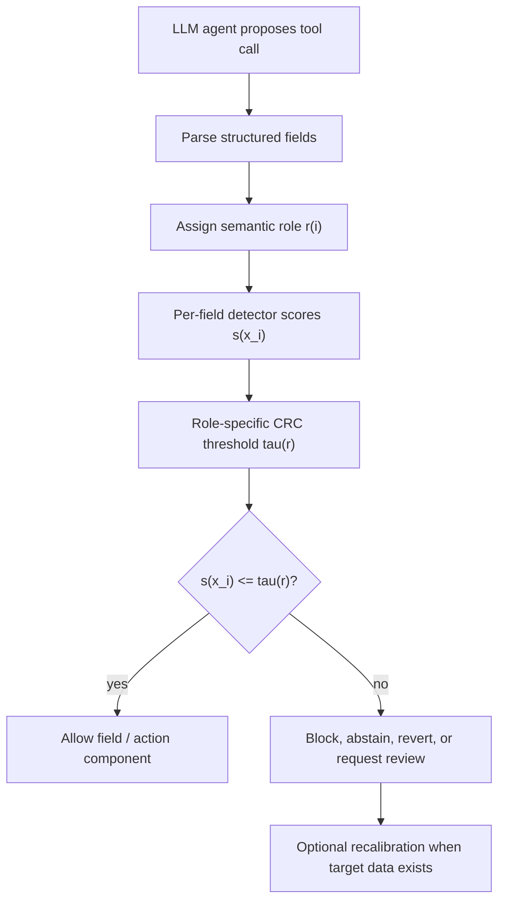
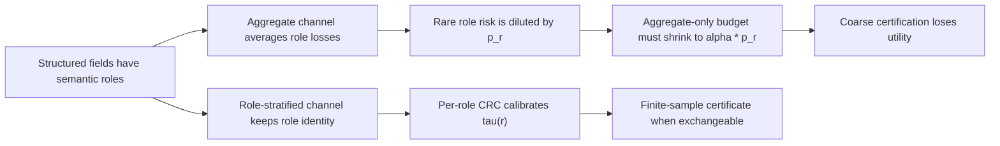

# Beyond Aggregate Risk：把 LLM 工具调用风险从“整条动作”拆到“语义字段角色”

- **论文**：Beyond Aggregate Risk: Role-Stratified Conformal Risk Control for LLM Tool Calls
- **作者**：Md Ashikur Rahman, Md Arifur Rahman, Niamul Hassan Samin, Khandaker Rifah Tasnia, Sifat Rahman Ahona, Juena Ahmed Noshin
- **版本与日期**：arXiv:2607.24343v1，2026-07-27 12:21:18 UTC 提交
- **方向**：AI 安全 / LLM Agent 工具调用 / 间接 prompt injection / conformal risk control
- **原文链接**：[arXiv 摘要页](https://arxiv.org/abs/2607.24343)；[arXiv HTML 全文](https://arxiv.org/html/2607.24343)；[PDF](https://arxiv.org/pdf/2607.24343)
- **本文判断**：这篇论文的关键不是再做一个工具调用分类器，而是指出“被校准的统计单位”和“真正会造成安全伤害的字段”经常不一致。只按整条 action 控风险，会把低频但高危的 `recipient`、`account`、`command`、`credential` 错误淹没在大量无害字段里；作者因此把 conformal risk control 的校准粒度改成 semantic role。

### TL;DR：这篇论文到底解决什么？

- **问题**：LLM Agent 的工具调用通常是结构化 action，例如 `send_email(recipient, body, attachments)` 或 `pay_invoice(account, amount)`；外部不可信内容可以安全影响正文或摘要，却不应该决定收件人、账号、命令或凭证。
- **现有缺口**：很多统计式安全层把一整条 action 当成风险单位；只要整体平均风险低，罕见角色上的严重失败就可能被多数普通字段稀释。
- **核心方法**：论文提出 **role-stratified per-field conformal risk control**，对每个字段先标注语义角色，再给不同角色设置独立阈值、风险预算和校准集合；样本不足的罕见角色进入 pooled high-risk stratum。
- **关键公式**：如果角色 `r` 的出现比例是 `p_r`，aggregate-only 要保证角色级风险 `alpha`，实际需要把总预算缩到 `alpha * p_r`；角色越稀有，整条 action 校准越保守，utility 代价越高。
- **实验设置**：作者在 AgentDojo 和 InjecAgent 上测试 6 个语言模型，比较 per-field CRC、aggregate CRC、PACT-inspired threshold、FIDES-inspired labels 等粒度选择。
- **关键数字**：论文 Figure 1 报告，在 8 个 shifted condition 下，per-field CRC 的 empirical compliance 为 `100% +/- 0%`，PACT-inspired threshold 为 `61% +/- 33%`，FIDES-inspired labels 为 `48% +/- 48%`。
- **主要结论**：稳健性主要来自 role stratification；conformal recalibration 在有目标条件标注数据时恢复有限样本保证。冻结分布迁移下，论文只报告经验合规，不声称新的 conformal certificate。
- **局限**：实验基于 recorded traces，block/revert 后的 live replanning utility 没有被完整捕捉；PACT/FIDES/CaMeL 对照是共享 detector 下的粒度隔离，不是这些系统的完整复现；保证依赖 exchangeability、role label、detector score 和可用校准样本。

### 研究问题：为什么“整体 action 风险”不够？

- 一个工具调用不是一个同质字符串，而是由多个字段组成：

| 工具调用 | 字段 | 语义角色 | 安全含义 |
|---|---|---|---|
| `send_email` | `recipient` | target | 目标对象，错误会导致越权发送 |
| `send_email` | `body` | content | 内容载体，可受外部资料影响 |
| `pay_invoice` | `account` | target / credential-adjacent | 资金去向，受污染会直接伤害用户 |
| `run_shell` | `command` | command | 执行动作本身，风险高于解释性字段 |
| `cloud_login` | `api_key` | credential | 凭证材料，泄漏或污染都高危 |

- 间接 prompt injection 的典型失效不是“所有字段都坏了”，而是：
  - 页面、邮件、检索文档带入攻击指令；
  - Agent 仍能完成多数普通字段；
  - 但一个低频高危字段被攻击者决定；
  - 整体 action 平均损失看起来不高；
  - 用户真正关心的安全属性已经失败。

- 因此论文重新定义安全层要回答的问题：
  - 不是“这条 action 是否总体可接受”；
  - 而是“对每类语义角色，允许通过的字段中，受不可信内容影响且造成违规的比例是否低于预算”。

### 论文主张：校准单位必须贴近伤害单位

作者的论证路线可以压成四步：

| 层级 | claim | mechanism | evidence | boundary |
|---|---|---|---|---|
| 风险建模 | aggregate risk 会稀释罕见角色 | 用 `p_r` 展示角色出现率对预算的压缩 | Proposition 1/2 与 channel ablation | 需要角色定义可用 |
| 方法设计 | 按 semantic role 做 per-field CRC | 每个 role 独立阈值、预算、校准样本 | Theorem 2 与 pooled rare roles | 样本少时只能池化 |
| 工程位置 | 可包裹任意 per-field detector | detector 给 score，CRC 决定 allow/block | AgentDojo/InjecAgent 两套基准 | detector 错误仍会传导 |
| 实验判断 | stratification 是主要稳健性来源 | 2x2 ablation 拆开 field/role 两个因素 | transfer、drift、adaptive attack | 冻结 shift 下是经验合规 |

- 这让论文区别于两类常见路线：
  - **硬规则 IFC**：可以有强语义保证，但通常缺少可调的残余风险预算；
  - **整体 CRC**：有统计保证，但控制的是 action-level 平均风险，不一定对齐字段级伤害。

### 问题形式化：action、field、role 和 violation

论文把工具调用写成结构化 action：

```text
A = (op, x_1, ..., x_k)
```

- `op`：工具或操作名称，例如 `send_email`、`pay_invoice`、`run_shell`。
- `x_i`：第 `i` 个具名字段，也是实际 enforcement unit。
- `r(i)`：字段 `x_i` 的 semantic role，例如 target、credential、command、content。
- `s_i = s(x_i)`：字段级 nonconformity score，分数越高表示越像被不可信内容影响。
- `tau`：允许阈值；当 `s_i <= tau` 时字段可以放行。
- `V(r)`：角色 `r` 的违规且放行概率。

风险不是“模型有没有看到攻击文本”这么粗，而是聚焦：

```text
V(r) = Pr[violated and allowed | role = r]
```

- `violated`：字段确实不该被允许，例如账号被外部邮件重定向。
- `allowed`：安全层没有拦截它。
- `role = r`：只看某一类语义字段，而不是把正文、附件、目标账号混在一起。

论文还区分 attack-conditional 与 clean-conditional：

```text
V_att(r)   = Pr[violated and allowed | role = r, attack]
V_clean(r) = Pr[violated and allowed | role = r, clean]
V(r)       = pi(r) * V_att(r) + (1 - pi(r)) * V_clean(r)
```

- 如果 clean 状态下本来没有 violation，`V_clean(r)` 可以近似为 0。
- 此时角色风险主要由攻击流量比例 `pi(r)` 和攻击条件下的放行错误决定。
- 这个拆分很重要，因为部署者往往关心“有攻击时高危字段还会不会漏过”，而不是普通流量平均值。

### Aggregate-budget failure：稀有角色为什么被“平均”掩盖？

论文最核心的数学直觉是：

```text
aggregate harm = sum_r p_r * V(r)
```

- `p_r` 是角色 `r` 在所有字段里的出现比例。
- 如果 `credential` 或 `target` 很少出现，它们的 `p_r` 很小。
- 即使这些角色上的 `V(r)` 很高，乘上小 `p_r` 后，对 aggregate harm 的贡献仍然可能不大。

举一个简化例子：

| 角色 | 出现比例 `p_r` | 角色违规放行 `V(r)` | 对 aggregate harm 的贡献 |
|---|---:|---:|---:|
| content | 0.90 | 0.005 | 0.0045 |
| target | 0.08 | 0.080 | 0.0064 |
| credential | 0.02 | 0.120 | 0.0024 |
| 合计 | 1.00 | - | 0.0133 |

- 如果总预算 `alpha = 0.02`，整体看 `0.0133 < 0.02`，似乎合规。
- 但 `credential` 的角色风险是 12%，远高于用户可能接受的 2%。
- 安全失败发生在字段角色上，不发生在全局平均数上。

论文把这个现象称为 coarseness 的价格：

```text
要用 aggregate-only 保证 V(r) <= alpha
需要把 aggregate budget 缩小到 alpha * p_r
```

- 对 `p_r = 0.02` 的角色，`alpha = 0.02` 会变成 `0.0004`。
- 这意味着 aggregate-only 如果想真正保护罕见高危角色，就必须极端保守。
- 极端保守会带来更多 abstain/block，进而损害 honest utility。

### 方法机制：role-stratified per-field CRC 怎么跑？

作者的方法可以理解成一个后置 calibration layer：



关键不是 detector 本身，而是 detector score 如何被使用：

| 步骤 | 输入 | 输出 | 作用 |
|---|---|---|---|
| role mapping | action schema 与字段名 | `r(i)` | 把字段对齐到 target、credential、command、content 等角色 |
| scoring | trusted prompt、不可信上下文、字段值 | `s_i` | 衡量字段是否受不可信内容影响 |
| calibration | role-specific calibration set | `tau(r)` | 为每个角色找放行阈值 |
| enforcement | 新字段分数与角色阈值 | allow/block | 运行时按字段角色决策 |
| pooling | 样本不足角色 | pooled high-risk stratum | 避免给小样本角色伪造证书 |

CRC 的运行逻辑可以写成伪代码：

```text
Input:
  Calibration traces D_cal
  Role set R
  Per-field detector score s(x)
  Role budgets alpha(r)
  Minimum certifiability floor 1 / (n_r + 1)

State:
  For each role r:
    D_r = fields in D_cal with role r
    n_r = |D_r|

Procedure:
  For each role r in R:
    If n_r is large enough for target alpha(r):
      Search thresholds tau
      Estimate inflated conformal risk for L_r(x; tau)
      Choose largest tau(r) with risk <= alpha(r)
    Else:
      Assign r to pooled high-risk stratum

Runtime:
  For each proposed field x_i:
    r = role(x_i)
    g = r if certified else pooled_high_risk
    If s(x_i) <= tau(g):
      allow x_i
    Else:
      block / abstain / revert / escalate

Output:
  Role-level risk-controlled decisions when exchangeability holds,
  empirical compliance under frozen shift,
  renewed finite-sample validity after recalibration.
```

### 罕见角色：为什么不能给每个 role 都硬做证书？

conformal 方法有一个很实际的样本地板：

```text
certifiability floor = 1 / (n_r + 1)
```

- `n_r` 是角色 `r` 的校准样本数。
- 样本越少，能认证的最小风险预算越高。
- 如果希望 `alpha(r) = 0.02`，但某角色只有十几个校准样本，就没有足够分辨率给出可靠角色级证书。

因此论文没有假装所有角色都能单独认证，而是做 pooled certification：

| 情况 | 策略 | 取舍 |
|---|---|---|
| role 样本充足 | 单独校准 `tau(r)` | 保留角色差异，utility 更好 |
| role 样本不足但高危 | 进入 pooled high-risk | 不给脆弱小样本伪保证 |
| 新工具套件出现 | 先按 role 映射或池化 | 需要后续目标数据 recalibration |
| role label 噪声变大 | certificate 质量下降 | 依赖 schema 与标注治理 |

这也是论文相对克制的地方：

- 它没有把 conformal guarantee 扩展到没有 exchangeability 的场景；
- 它承认 frozen shift 下只能说 empirical compliance；
- 它把重新获得证书的条件限定为“有目标条件的标注数据并重新校准”。

### 公式细读：为什么 `alpha * p_r` 是整篇论文的骨架？

如果只记一个公式，应该记住这一条：

```text
aggregate-only role guarantee price = alpha * p_r
```

这条公式背后的含义可以分三层理解：

1. **安全目标是角色级的**：
   - 用户不是在问“所有字段平均安全吗”；
   - 用户真正关心的是账号、命令、凭证、收件人等字段是否被不可信内容接管；
   - 因此预算 `alpha` 应该落在角色 `r` 上。

2. **aggregate loss 是带权平均**：
   - 整体损失会把角色风险乘上角色频率 `p_r`；
   - 高频 content 字段会主导平均值；
   - 低频 credential 字段即使风险很高，也可能只贡献很小的总量。

3. **为了从整体预算推出角色预算，必须缩小预算**：
   - 如果只观察整体损失，又想保证 `V(r) <= alpha`；
   - 最坏情况下，高风险全部集中在角色 `r`；
   - 于是整体预算必须小到 `alpha * p_r`。

这个推导对工程系统的含义很直接：

| 角色频率 `p_r` | 目标角色预算 `alpha` | aggregate-only 需要的总预算 | 工程后果 |
|---:|---:|---:|---|
| 0.50 | 2% | 1% | 仍可调，但比目标严格 |
| 0.10 | 2% | 0.2% | block 率明显上升 |
| 0.02 | 2% | 0.04% | 几乎变成极端保守系统 |
| 0.005 | 2% | 0.01% | utility 可能被罕见角色拖垮 |

因此这篇论文真正反驳的是一种常见评测习惯：

- 把所有工具调用参数摊成一个总体指标；
- 报一个“平均攻击放行率”或“平均安全风险”；
- 忽略不同字段的业务伤害不同；
- 最后得到一个看似合理、但无法保护罕见高危字段的安全层。

### 证明路线：作者怎样把直觉变成可检查命题？

论文的理论部分并不只是装饰，它服务于一个很明确的论证目标：

- 先证明 aggregate channel 会丢失角色信息；
- 再证明观察粒度越粗，想认证特定角色就越昂贵；
- 最后给出 role-stratified calibration 在样本充足时怎样恢复角色级证书。

可以把命题关系读成一条链：



其中最值得注意的是作者对 guarantee 的分层：

| 结论类型 | 需要什么条件 | 论文怎样表述 |
|---|---|---|
| role-level finite-sample guarantee | 校准字段与测试字段在角色内可交换 | 可以给 certificate |
| simultaneous certificate | 最终 strata 和置信度分配满足条件 | 用 Theorem 2 处理多角色 |
| prevalence-invariant attack-conditional guarantee | 使用 label-conditional calibration | 针对 `V_att(r)` |
| detector-relative noninterference | zero-budget 极限与 detector 正确性 | 不是绝对 noninterference |
| frozen distribution shift | 没有重新校准 | 只报告 empirical compliance |

“detector-relative noninterference”这个说法尤其关键：

- 它不像传统信息流系统那样声称对真实世界所有污染都有语义完备性；
- 它说的是在 detector 能识别的违规定义下，预算趋近于零时会接近一种非干扰约束；
- 因此 detector、role label、violation label 都属于可信边界的一部分。

### Detector 细读：CRC 包裹的是分数字段，不是魔法分类器

论文反复强调方法可以 wrap any per-field detector，这句话容易被误读。

更准确的理解是：

- detector 负责把字段和上下文映射成 `s(x)`；
- CRC 负责把 `s(x)` 转成带预算的放行阈值；
- role stratification 负责决定阈值按什么语义单元分组；
- 它们分别解决 detection、calibration、granularity 三个问题。

如果 detector 退化，CRC 不会自动修复：

| detector 状态 | CRC 能做什么 | CRC 不能做什么 |
|---|---|---|
| 分数与违规高度相关 | 找到高 utility 阈值 | 替代权限设计 |
| 分数有噪声 | 用校准吸收部分不确定性 | 保证所有攻击都被识别 |
| 非逐字攻击下分数变弱 | 通过压力测试观察退化 | 在无标注 drift 下重新给证书 |
| attacker 知道规则 | 重新校准或保守池化 | 防止所有自适应探测 |

因此部署时至少要记录四类审计材料：

1. 字段来自哪个 tool schema。
2. 字段被赋予哪个 role。
3. detector 给出的 score 与阈值是多少。
4. 最终 allow/block 的原因和对应预算。

缺少这些材料，系统即使声称“使用 conformal risk control”，也很难被复盘。

### 与信息流控制的关系：不是替代，而是补上风险预算

论文把自己放在 CaMeL、FIDES、PACT、CORA 等工作旁边：

| 路线 | 代表 | 控制单位 | 强项 | 这篇论文指出的缺口 |
|---|---|---|---|---|
| capability / dual-LLM isolation | CaMeL | 高危能力或调用路径 | 强隔离、语义边界清晰 | 通常不是可调统计风险预算 |
| value-level IFC labels | FIDES | 值与标签 | 接近 noninterference | 固定 allow/deny，残余风险不易量化 |
| argument provenance | PACT | 字段 provenance | 明确 target、command、credential、content | 阈值与预算不一定 conformal 校准 |
| action-level CRC | CORA 等 | 整条 action | 有有限样本统计保证 | 罕见字段角色会被 aggregate 稀释 |
| role-stratified CRC | 本文 | semantic role + field | 对齐伤害单位与校准单位 | 依赖 detector、role label 和校准数据 |

更准确地说，这篇论文不是要替代确定性 enforcement：

- 如果系统能给出严格 noninterference，并且业务愿意接受硬拦截，IFC 仍然更强。
- 如果系统需要“允许一部分风险、但把残余风险控制在预算内”，role-stratified CRC 提供可调层。
- 如果 detector 本身很弱，CRC 只能校准它的放行阈值，不能凭空识别所有污染。

### 实验设置：两个 benchmark，六个模型，多种 shift

论文实验覆盖：

- **AgentDojo**：
  - 动态 prompt injection 评测环境；
  - 包含真实感任务，例如邮件、银行、旅行预订；
  - 原始 benchmark 有 97 个任务与 629 个安全测试案例。
- **InjecAgent**：
  - 面向工具集成 LLM Agent 的间接 prompt injection benchmark；
  - 原始 benchmark 包含 1,054 个测试案例、17 个 user tools、62 个 attacker tools；
  - 攻击意图覆盖直接伤害与私有数据外泄。
- **模型范围**：
  - 论文称覆盖 6 个语言模型；
  - 重点不是比较模型排行榜，而是看不同模型/攻击/工具套件下 role-level calibration 是否稳。

实验比较的不是一个单点数字，而是一组问题：

| 问题 | 对应实验 |
|---|---|
| role-stratified CRC 是否比 aggregate CRC 更稳？ | safety and utility、channel ablation |
| detector 不需要人工标注时还成立吗？ | annotation-free detector |
| 模型或攻击迁移后如何？ | model and attack transfer |
| 工具套件没见过怎么办？ | unseen tool suites |
| 攻击不是逐字复用怎么办？ | non-verbatim attacks |
| 分布慢慢漂移怎么办？ | gradual drift |
| 攻击者知道防御机制怎么办？ | adaptive attacks |
| 置信度预算怎么分配？ | confidence allocation |

### Benchmark 细读：为什么 AgentDojo 和 InjecAgent 都需要？

只用一个 benchmark 很容易让结论贴合某一类工具形态。

作者同时使用 AgentDojo 和 InjecAgent，有三个作用：

| 作用 | AgentDojo 提供什么 | InjecAgent 提供什么 |
|---|---|---|
| 工具环境多样性 | 邮件、银行、旅行等真实感任务 | 17 个 user tools 与 62 个 attacker tools |
| 攻击类型覆盖 | 动态任务、攻击、防御环境 | 直接伤害与私有数据外泄 |
| 字段角色压力 | 多种业务 action schema | 大量 tool-integrated IPI test cases |

这对本文主张很重要：

- 如果只在一个固定工具上测试，role stratification 可能只是贴合那套 schema；
- 跨 benchmark 后，作者可以观察 target、credential、command、content 这类角色是否有迁移意义；
- unseen tool suite 实验进一步检查“新工具但旧角色”是否还能工作。

不过这里仍有边界：

- benchmark 里的 role taxonomy 未必覆盖真实企业系统的所有字段；
- financial approval、cloud IAM、database query、CI/CD deployment 可能需要更细角色；
- benchmark 任务的副作用通常可模拟，真实系统的不可逆副作用会提高拦截价值。

### 结果解读：Figure 1 支持什么？

论文 Figure 1 包含两个非常关键的证据点：

| 图 | 观察对象 | 论文给出的关键信息 | 支持的判断 |
|---|---|---|---|
| Figure 1(a) | GPT-4o，2% target violation budget，20 seeds | utility 与 target violation 的 trade-off 曲线 | field/role 粒度能避免过度牺牲 utility |
| Figure 1(b) | 8 个 shifted conditions | per-field CRC `100% +/- 0%` empirical compliance；PACT-inspired `61% +/- 33%`；FIDES-inspired `48% +/- 48%` | 角色分层在迁移条件下更稳定 |

这里需要区分两个层次：

- `100% +/- 0%` 是 shifted conditions 下的经验合规结果；
- 论文没有把 frozen shift 说成新的 conformal certificate；
- 只有在 exchangeability 成立，或对目标条件重新校准后，才回到有限样本保证。

这点很重要，因为很多安全论文容易把“迁移实验没爆”写成“部署保证”。本文在表述上相对谨慎：

- 有证书时说 certificate；
- 迁移时说 empirical compliance；
- 再校准后才恢复 finite-sample validity。

### 2x2 ablation：到底是 field 重要，还是 role 重要？

论文的机制消融可以理解成两个维度：

| 维度 | 关闭时会怎样 | 开启时会怎样 |
|---|---|---|
| per-field | action 内字段被混合 | 每个字段独立打分与拦截 |
| role stratification | 所有字段共用阈值或粗标签 | target、credential、command、content 各自有预算 |

作者的判断是：

- **semantic-role stratification 是主要稳健性来源**；
- field-level enforcement 让系统能看到 action 内部差异；
- conformal recalibration 则在目标条件有标注样本时恢复统计有效性；
- 这三者解决的是不同问题，不能互相替代。

可以把它写成一个因果链：

```text
structured action
  -> field extraction
  -> semantic role labeling
  -> per-role threshold selection
  -> runtime allow/block
  -> role-specific violation budget compliance
```

如果只做 field extraction，没有 role budget：

- `body` 和 `recipient` 可能仍共享一个安全阈值；
- 阈值为了保住 `recipient` 会过度拦截 `body`；
- 或为了保住 utility 放松阈值，导致高危字段漏过。

如果只做 role labeling，没有 conformal calibration：

- 系统知道哪些字段高危；
- 但不能给部署者一个有限样本风险预算；
- 风险沟通仍停留在“看起来更安全”。

### 细读实验边界：哪些结果不能外推？

论文的局限主要有四类：

| 边界 | 具体含义 | 对部署的影响 |
|---|---|---|
| recorded traces | 实验在缓存轨迹上评分 | block/revert 后 Agent live replanning 的真实 utility 未完整测量 |
| shared detector | PACT/FIDES/CaMeL-inspired 对照共享 detector | 这不是完整复现原系统，只隔离 granularity 差异 |
| exchangeability | conformal 证书依赖校准/测试同分布或可交换性 | drift 后要重新校准，否则只能报经验合规 |
| role labeling | 字段角色要由 schema 或标注确定 | 新工具、混合字段、动态 JSON schema 会增加治理成本 |

还有一个容易被忽略的边界：

- 论文把方法定位为 calibration layer；
- 它不解决 tool policy 本身是否合理；
- 它也不替代权限最小化、用户确认、审计日志和外部副作用隔离。

换句话说：

```text
role-stratified CRC controls "which scored fields can pass"
but does not by itself define "which tools should exist"
or "which side effects must be reversible"
```

### 相关工作位置：它补的是统计安全层的“粒度错配”

放到 LLM Agent 安全谱系里，这篇论文的位置很清楚：

- **AgentDojo / InjecAgent** 提供攻击与评测环境，证明间接 prompt injection 会影响工具 Agent。
- **CaMeL / FIDES / PACT** 把工具调用安全问题推向信息流、capability、provenance。
- **CORA / conformal methods** 给 agent action 带来统计风险控制。
- **本文**把 conformal calibration 的单位从 action 改成 semantic-role field。

因此它的贡献不是“第一次发现 prompt injection”，也不是“第一次给字段分角色”。

更精确的贡献是：

1. 把 aggregate risk 的稀释问题形式化为 `p_r` 带来的预算压缩。
2. 把 role-level harm 与 role-level calibration 绑定。
3. 用 conformal framework 给出何时有证书、何时只可经验报告。
4. 在 AgentDojo/InjecAgent、模型迁移、攻击迁移、drift、adaptive attack 下做压力测试。

### 对 Agent 系统设计的启发：字段 schema 是安全边界的一部分

如果接受这篇论文的主张，LLM Agent 工具设计会有一个明显变化：

- 工具 schema 不能只服务调用便利；
- 字段命名、字段拆分和 role annotation 会直接影响可校准性；
- 把多个语义混在一个自由文本字段里，会让安全层失去粒度。

更具体地说：

| 设计选择 | 安全后果 |
|---|---|
| `send_email(to, subject, body)` | 可以分别控制 target 与 content |
| `send_email(raw_email_json)` | 字段角色混入 blob，detector 与 CRC 都更难发挥 |
| `run(command)` | command 是单一高危字段，需要强预算或人工确认 |
| `run(task_description)` 再由工具解释 | role 边界后移，风险可能从 Agent 层转移到工具层 |
| `pay_invoice(account, amount, memo)` | account 与 memo 应使用不同预算 |

这也解释了为什么“让模型自己判断这个字段是否危险”不够：

- role 应该来自工具 schema、policy registry 或受控标注；
- detector 可以由模型辅助，但阈值和预算不应完全由同一个被攻击上下文驱动；
- 安全层需要把 role、score、threshold、decision 记录进审计日志。

### 一个可落地的部署框架

按本文方法设计工具调用安全层，可以拆成五个模块：

| 模块 | 输入 | 输出 | 需要审计的问题 |
|---|---|---|---|
| Schema registry | tool schema | field role map | role 是否过粗？是否漏标 credential？ |
| Provenance collector | trusted prompt、retrieved content、tool output | untrusted influence features | 是否能追踪字段来源？ |
| Detector | 字段值与上下文 | nonconformity score | detector 在非逐字攻击下是否退化？ |
| Calibrator | labeled calibration traces | `tau(r)` | `n_r` 是否足够？是否需要 pooled stratum？ |
| Enforcer | 新 action 与 thresholds | allow/block/revert | block 后副作用是否可回滚？ |

这一框架和 deterministic controls 可以组合：

- 对 credential、payment、shell command，可先做硬权限与用户确认；
- 对 email body、memo、summary，可用较宽松预算减少误拦截；
- 对新工具或低样本 role，先池化到高风险组；
- 对 drift 或新攻击簇，采样标注并重新校准。

### 研究者视角：这篇论文最值得继续追问什么？

我认为后续有四个关键问题：

1. **role taxonomy 怎么标准化？**
   - PACT 使用 target、command、credential、content 等角色；
   - 企业工具会有更多领域字段，例如 approver、region、resource_id、iam_policy、query_filter；
   - role taxonomy 如果不统一，跨工具校准很难复用。

2. **block/revert 后的 live replanning 怎么评估？**
   - 本文承认 recorded traces 不能完整反映拦截后的重规划；
   - 真实 Agent 可能在被拦截后换一条工具路径；
   - 新路径可能更安全，也可能绕过原先 detector。

3. **detector 与 attacker 的适应性博弈如何建模？**
   - 论文做了 adaptive attack 压力测试；
   - 但 detector 本身如果被长期探测，score 分布会漂移；
   - conformal recalibration 需要足够快，且不能被攻击流量污染校准集。

4. **统计预算如何与业务损失函数连接？**
   - `alpha(target) = 2%` 是否合理，不是数学能单独回答的问题；
   - 邮件收件人、银行账号、云命令的可接受风险不同；
   - 最终需要把 role budget 和资产价值、可回滚性、人工确认成本放在一起设计。

### 结论：把“安全校准”放到字段角色上，而不是平均动作上

- 这篇论文的最强主张是：LLM Agent 工具调用的安全风险具有结构性，不能用整条 action 的平均风险来替代。
- 它给出的 `alpha * p_r` 直觉非常实用：越罕见、越高危的字段，越容易被 aggregate metric 掩盖。
- role-stratified per-field CRC 的价值在于，让部署者可以对 target、credential、command、content 等角色分别设定预算，并在样本充足时得到有限样本保证。
- 实验上，AgentDojo/InjecAgent、6 个模型、迁移、噪声、drift、adaptive attack 共同支持一个判断：stratification 是主要稳健性来源，recalibration 是恢复证书的条件。
- 边界同样清楚：它不是完整权限系统，不替代最小权限、可回滚副作用、人工确认和审计；它依赖 role label、detector score 与校准样本质量。

对 AI 安全和 Agent 系统来说，这篇论文把一个容易被忽视的工程细节提升成研究问题：

- 工具字段不是普通参数；
- 字段角色是安全语义；
- 安全层真正要控制的，不是平均 action，而是每个会造成真实伤害的语义角色。

### 参考与延伸阅读

- [arXiv 摘要页：Beyond Aggregate Risk](https://arxiv.org/abs/2607.24343)
- [arXiv HTML 全文：Role-Stratified Conformal Risk Control](https://arxiv.org/html/2607.24343)
- [PDF：Beyond Aggregate Risk](https://arxiv.org/pdf/2607.24343)
- [AgentDojo：A Dynamic Environment to Evaluate Prompt Injection Attacks and Defenses for LLM Agents](https://arxiv.org/abs/2406.13352)
- [InjecAgent：Benchmarking Indirect Prompt Injections in Tool-Integrated Large Language Model Agents](https://arxiv.org/abs/2403.02691)
