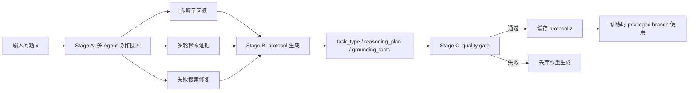

# MAPD：把闭源教师的搜索能力蒸馏成开源 Agent 能学的协议

## 元信息与 TL;DR

- **论文**：From Proprietary to Open-Source: Bridging the Distribution Gap via Multi-Agent Protocol Distillation in Agentic Search
- **作者**：Junlin Liu, Jiangwang Chen, Zixin Song, Shuaiyu Zhou, Chunji Lv, Hank Wu, Kailin Jiang, Jinyang Wu, Bohan Yu, Chenxi Zhou
- **机构**：Beijing Institute of Technology, East China Normal University, University of Science and Technology of China, Tsinghua University, University of Chinese Academy of Sciences 等
- **方向**：大模型后训练；更具体地说，是面向 agentic search 的闭源教师到开源学生的协议蒸馏。
- **版本与日期**：arXiv:2607.24280v1，2026-07-27 11:27:38 UTC 提交；Hugging Face Papers 在 2026-07-28 Daily Papers 页面收录并标为当天高热论文。
- **原文链接**：[arXiv 摘要页](https://arxiv.org/abs/2607.24280)；[arXiv HTML 全文](https://arxiv.org/html/2607.24280)；[PDF](https://arxiv.org/pdf/2607.24280)；[代码仓库](https://github.com/AaronLiu0702/MAPD)；[Hugging Face Papers](https://huggingface.co/papers/2607.24280)

### TL;DR

- 这篇论文研究的问题是：**闭源强模型擅长多轮检索、拆题和纠错，但开源学生既拿不到闭源 logits，又很容易在模仿自然语言轨迹时学到 verbose style、幻觉和格式噪声；怎样把能力而不是腔调蒸馏出来？**
- 作者提出 **MAPD（Multi-Agent Protocol Distillation）**：先让闭源模型驱动的离线多 Agent 系统完成查询拆解、证据检索、失败修复和答案验证，再把探索轨迹压缩成结构化 JSON protocol；训练时只把 protocol 作为 privileged information 喂给学生策略的条件分支，用同一个学生模型的两个分布做 OPSD，再和 GRPO 的稀疏终局奖励联合优化。
- 关键机制不是“让 Qwen 模仿 Claude/GPT/Gemini 的长 CoT”，而是把教师行为转成 **task type、reasoning plan、grounding facts、partial findings、answer verification** 这类字段，让学生学习可复用的搜索策略、证据约束和失败恢复，而不是学习教师的口吻。
- 实验覆盖 7 个知识密集 QA benchmark：NQ、TriviaQA、PopQA、HotpotQA、2WikiMultihopQA、MuSiQue、Bamboogle；学生模型为 Qwen3-1.7B 与 Qwen3-4B；主表中 MAPD 平均成功率达到 **39.4%** 与 **44.4%**，高于 GRPO+OPSD 的 **30.5%** 与 **38.3%**，也高于 SDAR 的 **37.6%** 与 **43.0%**。
- 消融显示 structured protocol 是核心：直接蒸馏闭源自然语言轨迹反而低于无闭源教师的 GRPO+OPSD；单闭源模型 + protocol 可到 **37.1%/42.9%**，完整 MAS + protocol 到 **39.4%/44.4%**，说明“格式净化”和“多 Agent 证据质量”缺一不可。
- λ 权重不是越大越好：论文报告 $\lambda_{\text{OPSD}}=0.05$ 最稳；过大到 0.1 时，4B 模型对参考策略 KL 升到 **1.06**，平均回答长度从 **135 tokens** 降到约 **42 tokens**，工具调用接近上限 **3.0**，形成“只检索、不推理”的退化。
- 成本边界也明确：以 Gemini-3.1-Pro 为例，MAS 为 **25,600** 个训练样本生成 **25,584** 个合格 protocol，质量门通过率 **99.94%**；平均每样本约 **6.3** 次教师调用、**12.5K tokens**，一次性总成本约 **1,454 美元**；推理时没有额外 MAS 开销。
- 局限是：仓库当前 README 仍是 “Coming soon”，复现实验细节依赖论文而非完整代码；评测主要是可用 EM 判断的 QA 检索任务，不能直接外推到开放式浏览器 Agent、真实企业工具链或安全敏感副作用任务；protocol 质量门也依赖教师、检索环境和自动检查器本身。

## 研究问题：为什么闭源教师蒸馏在 Agentic Search 上更难？

### 论文把困难放在哪里？

- Agentic search 不是一次性回答：
  - 模型要把问题拆成子目标。
  - 它要多轮发起检索。
  - 它要根据返回证据修正查询。
  - 它还要在最后给出可判定答案。

- 后训练常见做法是 RLVR/GRPO：
  - 终局答案正确，reward 为 1。
  - 终局答案错误，reward 为 0。
  - 中间检索是否合理、证据是否充分、失败是否被修复，通常没有细粒度标注。

- 因此，<u>稀疏终局奖励</u>是第一层瓶颈：
  - 一个 8 步搜索轨迹最后错了，模型只知道整条轨迹失败。
  - 它不知道错在拆题、检索词、证据筛选、跨文档合成还是答案抽取。
  - GRPO 的优势估计能推动探索，但很难稳定告诉模型每一步该怎么改。

### 为什么不能直接拿闭源教师的轨迹来学？

- 论文把闭源教师蒸馏拆成两个不可忽略的问题：

| 蒸馏选择 | 看似解决什么 | 在 Agentic Search 上的问题 |
|---|---|---|
| logit matching | 给 token 级密集监督 | 闭源 API 不给 logits；不同 tokenizer 下 KL 对齐不自然 |
| 自然语言轨迹模仿 | 能拿到教师完整回答 | 学到教师的冗长风格、模板、语气和幻觉，而不是搜索策略 |
| 学生自蒸馏 | token 空间一致 | privileged information 来自学生自己，质量被学生上限卡住 |
| MAPD protocol | 抽取策略与证据结构 | 需要离线 MAS 与质量门，成本和协议正确性成为新边界 |

- 这也是论文的核心 claim：
  - 闭源教师真正值得迁移的是“认知策略”和“证据组织方式”。
  - 这些策略不能直接等同于自然语言 CoT。
  - 更可靠的中间层应该是结构化、风格归一、可检查的 protocol。

## 论文主张与论证路线

### Claim -> mechanism -> evidence -> boundary

| 层次 | 论文主张 | 机制 | 证据 | 边界 |
|---|---|---|---|---|
| 表征 | 原始轨迹会造成 style drift | JSON protocol 去掉闭源教师口吻，保留任务类型、计划和证据 | raw trajectory 单教师 30.1/37.3，MAS raw 29.2/36.1，均弱于结构化 protocol | protocol 字段是否足以表达复杂策略仍需任务验证 |
| 训练 | 闭源 logits 不可得时仍可做密集蒸馏 | 用同一个学生模型的无 protocol 分支和有 protocol 分支做 OPSD | MAPD 高于 GRPO+OPSD 与 SDAR | privileged branch 的分布不是闭源教师分布本身 |
| 搜索 | 多 Agent 离线管线能提升 protocol 质量 | 分工检索、纠错、生成、自动质量门 | protocol(single PM) 37.1/42.9；完整 MAPD 39.4/44.4 | MAS 成本前置，且训练集生成质量依赖教师 API |
| 泛化 | protocol 抽象能跨闭源教师迁移 | Claude/GPT/Gemini 使用同一训练设置 | 三个教师都带来正收益，均值差距在约 2 点内 | 教师都属于强闭源模型，弱教师或偏域教师未充分覆盖 |
| 部署 | 推理成本不增加 | MAS 只在离线生成 protocol，学生推理不带 protocol | 论文报告一次性生成成本，不增加 test-time 调用 | 训练前置成本和数据更新成本仍存在 |

## 方法机制：MAPD 到底怎么工作？

### 1. Agentic search 的形式化对象

- 给定问题 $x$，策略 $\pi_\theta$ 与检索环境交互最多 $K$ 轮。
- 整条轨迹可以展平成 token 序列：

$$
y=(y_1,\ldots,y_T)\sim \pi_\theta(\cdot \mid x)
$$

- 终局 reward 是二元函数：

$$
R(x,y)\in\{0,1\}
$$

- 这一定义的好处是：
  - 可以统一单跳、多跳、比较型 QA。
  - 可以把 retrieval action 和 reasoning token 放进同一轨迹。
  - 可以继续使用 GRPO 这类 rollout-based RL。

- 它的缺点也正是 MAPD 要补的缺口：
  - reward 只在最后给出。
  - 轨迹中间的检索策略没有直接标签。
  - 错误轨迹的“局部可救部分”被整体惩罚。

### 2. Structured JSON Protocol 的五类字段

论文把教师探索轨迹压缩成一个 protocol $z$。它不是长 CoT，而是面向训练的结构化中间表示：

| 字段 | 作用 | 为什么比自然语言轨迹更适合蒸馏 |
|---|---|---|
| `task_type` | 标出 single_hop、multi_hop、comparison 或 others | 让学生先学问题类型与搜索策略的匹配 |
| `reasoning_plan` | 子目标列表，例如先查实体 A，再查实体 B，再比较 | 保留 planning skeleton，减少口吻和模板噪声 |
| `grounding_facts` | 从检索结果抽取的证据事实 | 把回答约束在证据上，降低参数化幻觉 |
| `partial_findings` | 多轮失败或中间发现 | 让失败恢复也能成为训练信号 |
| `answer_verification` | 最终答案与 grounded 标记 | 把“答对”和“证据支持”拆开 |

- 这里的关键不是 JSON 这个格式本身，而是它承担了三个过滤功能：
  1. **语义保留**：保留教师如何拆题、检索、整合证据。
  2. **风格剥离**：剥离闭源模型的冗长语气和格式偏好。
  3. **质量可审计**：字段缺失、证据不匹配、答案不 grounded 可以被自动检查。

### 3. 离线 MAS 生成管线

论文把 protocol 生成分成三段：



- Stage A 的意义：
  - 让强闭源模型不只是给最终答案，而是执行更深的搜索探索。
  - 多 Agent 分工可以增加 recall，减少单个查询早停。
  - 失败修复让 protocol 包含“怎么从坏检索转回来”的线索。

- Stage B 的意义：
  - 把自由文本轨迹改写成字段化 protocol。
  - 把可迁移策略与教师语言外壳分离。
  - 给后续 OPSD 提供 privileged information。

- Stage C 的意义：
  - 检查字段完整性。
  - 检查 grounding facts 与答案是否一致。
  - 防止错误教师轨迹直接污染学生训练。

### 4. 联合训练目标：GRPO + OPSD

- MAPD 保留 GRPO 的 outcome-driven RL：

$$
\mathcal{L}_{\text{GRPO}}
=-\frac{1}{G}\sum_{i=1}^{G}\frac{1}{|y^{(i)}|}
\sum_t \left[
J_t^{(i)}-\beta D_{\text{KL}}(\pi_\theta\parallel\pi_{\text{ref}})
\right]
$$

- 其中：
  - $G$ 是同一 prompt 的 rollout 数。
  - $J_t^{(i)}$ 是 clipped surrogate 项。
  - $\beta$ 控制参考策略 KL 惩罚。
  - reward 仍来自最终答案是否正确。

- 同时，MAPD 加入 OPSD：

$$
\mathcal{L}_{\text{OPSD}}^{(t)}
=D_{\text{KL}}
\left(
\pi_{\theta_k}(\cdot\mid x,y_{<t})
\parallel
\pi_{\theta_k}(\cdot\mid x,z,y_{<t})
\right)
$$

- 这里最关键的是两个分支：
  - **student branch**：只看 $x$ 和前缀 $y_{<t}$，这对应真实推理时可用的信息。
  - **privileged branch**：额外看到 protocol $z$，只在训练时存在。

- 联合目标可以写成：

$$
\mathcal{L}
=
\mathcal{L}_{\text{GRPO}}
+
\lambda_{\text{OPSD}}\mathcal{L}_{\text{OPSD}}
$$

- 这条公式解释了 MAPD 的位置：
  - GRPO 负责让模型别忘记最终任务成功。
  - OPSD 负责把 protocol 条件下的更好 token 分布压到普通学生分支。
  - $\lambda_{\text{OPSD}}$ 是蒸馏强度旋钮，过小无效，过大退化。

## 训练与实验设置

### 数据、模型与 benchmark

论文主实验覆盖 7 个 QA benchmark：

| 类型 | Benchmark | 论文中承担的角色 |
|---|---|---|
| 单跳事实 QA | NQ | 检查基础检索与答案抽取 |
| 单跳事实 QA | TriviaQA | 检查大规模开放域事实问答 |
| 单跳长尾 QA | PopQA | 检查较偏门实体事实 |
| 多跳 QA | HotpotQA | 检查跨证据推理 |
| 多跳 QA | 2WikiMultihopQA | 检查实体链路与组合推理 |
| 多跳 QA | MuSiQue | 检查更难的组合式多跳 |
| 复杂 QA | Bamboogle | 检查需要更精细搜索策略的问题 |

- 学生模型：
  - Qwen3-1.7B。
  - Qwen3-4B。

- 闭源教师：
  - Claude-Opus-4.6。
  - GPT-5.5。
  - Gemini-3.1-Pro。

- 训练集规模与 protocol 生成成本：
  - 25,600 个训练实例。
  - 25,584 个 protocol 通过质量门。
  - 通过率 99.94%。
  - 平均每个样本约 6.3 次教师模型调用。
  - 平均每个样本约 12.5K tokens。
  - 以 Gemini-3.1-Pro 估算，总一次性生成成本约 1,454 美元。

### Baseline 怎么选？

论文比较了几类 baseline：

| Baseline | 对照意义 |
|---|---|
| GRPO | 只用终局 reward，看稀疏 RL 能走多远 |
| GRPO+OPSD | 用学生自身 privileged signal，看无闭源教师时的自蒸馏上限 |
| SDAR | 代表更强的 distillation/RL 组合方法 |
| Raw trajectory(single PM) | 检查直接模仿闭源教师自然语言轨迹是否有效 |
| Raw trajectory(MAS) | 检查多 Agent 生成更多自由文本轨迹是否能替代 protocol |
| Protocol(single PM) | 检查结构化协议本身的贡献 |
| MAPD | structured protocol + MAS + joint training 的完整方法 |

- 这个 baseline 设计比较干净：
  - 它没有只拿最弱 RL baseline 做对比。
  - 它专门把“闭源教师是否有用”“protocol 是否有用”“MAS 是否有用”拆开。
  - 它能回答一个重要反直觉问题：更强教师的原始文本，可能比无教师还差。

## 主结果：MAPD 的提升来自哪里？

### 平均成功率

论文摘要和表格给出的核心数字如下：

| 方法 | Qwen3-1.7B Avg | Qwen3-4B Avg | 主要解释 |
|---|---:|---:|---|
| GRPO+OPSD | 30.5 | 38.3 | 稀疏 RL 加学生自蒸馏，缺高质量外部策略 |
| SDAR | 37.6 | 43.0 | 强 baseline，说明简单 RL 不是全部问题 |
| Raw trajectory(single PM) | 30.1 | 37.3 | 直接模仿闭源自然语言轨迹会拖累学生 |
| Raw trajectory(MAS) | 29.2 | 36.1 | MAS 生成更多自由文本也不能解决风格漂移 |
| Protocol(single PM) | 37.1 | 42.9 | 结构化 protocol 本身已经接近强 baseline |
| MAPD | **39.4** | **44.4** | protocol 解决表征，MAS 提升证据与修复质量 |

- 最值得注意的不是 MAPD 比 SDAR 高 1 到 2 点，而是 raw trajectory 的失败：
  - 单闭源模型 raw trajectory：30.1/37.3。
  - MAS raw trajectory：29.2/36.1。
  - 它们甚至低于 GRPO+OPSD。

- 这说明作者的核心判断成立：
  - 闭源教师输出越丰富，不等于训练信号越好。
  - 对小学生模型来说，冗长自然语言轨迹可能是分布噪声。
  - 真正需要迁移的是结构化策略，而不是完整话术。

### 单跳与多跳的差异

- 论文在 λ 权重分析中暴露了一个很有价值的现象：
  - 过高蒸馏压力可以让单跳任务略升。
  - 但多跳任务会明显下降。

- 具体例子：
  - 在 Qwen3-4B 上，$\lambda=0.1$ 时 PopQA 从 49.4% 升到 50.1%。
  - TriviaQA 从 62.5% 升到 63.7%。
  - 但 2WikiMultihopQA 从 45.7% 降到 38.4%。
  - MuSiQue 从 14.0% 降到 11.1%。

- 这说明 agentic search 的能力不是“更多检索调用”本身：
  - 单跳任务可能受益于更快发起检索。
  - 多跳任务需要保留中间推理链和跨证据整合。
  - 如果蒸馏压力让模型变成 retrieval shortcut，复杂任务会先坏掉。

## 消融：structured protocol 和 MAS 分别贡献什么？

### structured protocol 是底座

- 消融最强的结论是：
  - **没有 structured protocol，闭源教师可能有害。**

- 对比可以这样读：

| 对比 | 数字 | 说明 |
|---|---:|---|
| Raw trajectory(single PM) -> Protocol(single PM), 1.7B | 30.1 -> 37.1 | 同一个闭源教师，换表示后提升 7.0 点 |
| Raw trajectory(single PM) -> Protocol(single PM), 4B | 37.3 -> 42.9 | 4B 也提升 5.6 点 |
| Raw trajectory(MAS) -> MAPD, 1.7B | 29.2 -> 39.4 | MAS 自由文本不行，MAS protocol 才有效 |
| Raw trajectory(MAS) -> MAPD, 4B | 36.1 -> 44.4 | 说明多 Agent 信息量必须被结构化过滤 |

- 这个结果有两个含义：
  1. **能力迁移不是 token 模仿。**  
     闭源教师写得更长、更像专家，不代表学生能学得更好。
  2. **协议是蒸馏接口。**  
     protocol 把黑盒教师行为转成学生可消费的训练条件。

### MAS 是 protocol 质量放大器

- Protocol(single PM) 已经很强：
  - 1.7B 平均 37.1。
  - 4B 平均 42.9。

- 完整 MAPD 进一步到：
  - 1.7B 平均 39.4。
  - 4B 平均 44.4。

- 这说明 MAS 的价值不是“让推理时多几个 Agent 一起聊”：
  - 它是在训练前提高 protocol 的证据完整性。
  - 它能把失败搜索的修复过程写入 partial findings。
  - 它能通过多角色检索减少单教师早停。

- 但边界也同步出现：
  - MAS 不加 protocol 时更差。
  - 因此 MAS 本身不是答案；它只是原料生产机器。
  - 质量门和结构化抽取决定这些原料能不能被学生吸收。

## λ 权重：为什么 0.05 比 0.1 更好？

### 蒸馏强度的三段解释

| $\lambda_{\text{OPSD}}$ | 论文观察 | 机制解释 |
|---:|---|---|
| 0.01 | 蒸馏信号偏弱 | 学生仍主要受终局 reward 驱动，中间策略指导不足 |
| 0.05 | 两个模型尺度上平均最优 | protocol 提供持续指导，同时没有压垮 policy 稳定性 |
| 0.10 | 多跳推理退化 | 学生过度贴近 privileged branch，形成检索捷径 |

- 论文给出的警示很重要：
  - 在 4B 上，$\lambda=0.1$ 时 KL 到参考策略升到 1.06。
  - 这个数接近 $\lambda=0.01$ 的 4 倍。
  - 平均回答长度从 135 tokens 降到约 42 tokens。
  - 工具调用次数接近最大值 3.0。

- 这不是普通的“过拟合”描述，而是 agentic search 特有退化：
  - 模型学会更频繁地调用检索工具。
  - 但减少了中间推理和证据整合。
  - 单跳 QA 可小涨，多跳 QA 明显受损。

### 可以用一个简化公式理解

把 MAPD 的训练看成两股力：

$$
\text{update}
=
\underbrace{\nabla \mathcal{L}_{\text{GRPO}}}_{\text{终局成功}}
+
\lambda
\underbrace{\nabla \mathcal{L}_{\text{OPSD}}}_{\text{协议条件分布}}
$$

- 当 $\lambda$ 太小：
  - protocol 只是弱提示。
  - 中间步骤仍缺细粒度 credit。

- 当 $\lambda$ 适中：
  - protocol 给出拆题和证据选择的方向。
  - GRPO 继续约束最终答案正确。

- 当 $\lambda$ 太大：
  - 学生追随 protocol branch 的表面行为。
  - policy stability 被削弱。
  - 可能从“推理后检索”变成“先检索、少思考、快结束”。

## Figure / Table 证据逐项解读

### Figure 1：闭源教师蒸馏的两种错配

- Figure 1 支持的是背景判断：
  - 闭源模型 logits 不可见。
  - tokenizer 不同让 KL 直接对齐不成立。
  - 自然语言轨迹会带来风格和分布错配。

- 它不能证明 MAPD 有效，只是解释为什么传统 distillation 入口不顺。

### Figure 2：MAPD 框架图

- Figure 2 的证据作用是展示数据流：
  - 离线 MAS 生成 protocol。
  - protocol 成为训练时 privileged information。
  - 学生普通分支与 protocol 分支共享模型参数。
  - 推理时只保留普通学生模型。

- 它支持“推理无额外开销”的机制说明。
- 它不证明 protocol 的字段设计最优。

### Table 2：最关键的消融表

- Table 2 是本文最重要的证据之一：
  - raw trajectory 两组都比 GRPO+OPSD 差。
  - protocol single PM 接近 SDAR。
  - MAPD 完整版最高。

- 它证明的不是“闭源教师越强越好”，而是：
  - 教师能力必须经过结构化中间层。
  - MAS 必须通过质量门和字段抽取服务于 protocol。
  - 自由文本越多，可能只是噪声越多。

### Figure 3：λ 权重曲线

- Figure 3 支持训练稳定性判断：
  - 0.05 在两个模型尺度上达到更好平均成功率。
  - 0.1 带来过强 regularization。

- 更重要的是，作者没有只报最终 Avg，而是结合：
  - KL。
  - 平均回答长度。
  - 工具调用次数。
  - 单跳与多跳任务差异。

- 因此它揭示的是行为退化，而不只是超参曲线。

### Figure 4 / Table 3：跨教师迁移

- 三个闭源教师都带来正收益：
  - Claude-Opus-4.6：39.4%/44.4%。
  - GPT-5.5：39.0%/44.6%。
  - Gemini-3.1-Pro：37.9%/44.0%。

- 这支持“protocol 抽象掉教师风格”的 claim。
- 但它的边界是：
  - 三个教师都很强。
  - 都是通用闭源大模型。
  - 不能说明弱教师、专域教师或低质量检索环境同样稳定。

## 伪代码：把 MAPD 写成可复查流程

```text
Input:
  training questions D = {(x_i, answer_i)}
  proprietary teacher set T
  retrieval environment E
  student policy pi_theta
  rollout group size G
  distillation weight lambda_OPSD

State:
  protocol cache C
  reference policy pi_ref
  quality gate QG

Offline protocol synthesis:
  for each question x_i in D:
    trace = MAS_Search(x_i, teachers=T, environment=E)
    protocol z_i = Build_JSON_Protocol(
      task_type,
      reasoning_plan,
      grounding_facts,
      partial_findings,
      answer_verification
    )
    if QG(z_i, answer_i) passes:
      C[x_i] = z_i
    else:
      retry_or_drop(x_i)

Online training:
  for each batch B:
    for each question x in B:
      sample G trajectories y from pi_theta(. | x)
      compute terminal reward R(x, y)
      compute GRPO loss with pi_ref
      compute student distribution pi_theta(. | x, prefix)
      compute privileged distribution pi_theta(. | x, C[x], prefix)
      compute OPSD KL(student || privileged)
    update theta by L_GRPO + lambda_OPSD * L_OPSD

Output:
  a single open-source student policy used without protocol or MAS at inference

Failure boundaries:
  if protocol is noisy, OPSD densifies wrong supervision
  if lambda_OPSD is too large, model may become retrieval-heavy and reasoning-light
  if reward parser only checks exact match, non-EM abilities remain under-measured
```

## 相关工作中的位置

### 和 RLVR / GRPO 的关系

- MAPD 没有否定 RLVR：
  - 最终答案仍由 reward 监督。
  - GRPO 仍是优化骨架。

- 它补的是 credit assignment：
  - 哪些检索步骤值得保留？
  - 哪些证据应该进入答案？
  - 搜索失败后如何修复？
  - 多跳问题怎样拆成子问题？

- 因此，MAPD 更像是给 GRPO 增加训练时的“过程导航”，而不是替代 RL。

### 和 OPD / OPSD 的关系

- 传统 OPD 依赖教师 token 分布。
- 闭源 API 场景下，教师 logits 不可得。
- OPSD 用同一个学生模型构造两个上下文：
  - 无 privileged information 的普通分支。
  - 有 privileged information 的条件分支。

- MAPD 的创新点在于 privileged information 的来源：
  - 不是学生自己已经会的正确 rollout。
  - 不是闭源教师的自然语言长轨迹。
  - 而是离线 MAS 生成并通过质量门的 structured protocol。

### 和多 Agent 推理系统的关系

- 许多 MAS 工作把多个 Agent 放到推理时：
  - 这会带来延迟。
  - 也会带来 API 成本。
  - 生产环境还要处理多 Agent 协调失败。

- MAPD 的选择更克制：
  - MAS 只在训练前跑。
  - 它生成训练数据，而不是承担线上推理。
  - 学生模型把 MAS 的搜索策略内化到单模型参数里。

- 这给 agentic system 一个值得借鉴的路线：
  - 如果线上多 Agent 太贵，可以先让多 Agent 产生高质量协议。
  - 再用蒸馏把协议转成单模型能力。
  - 但这要求任务分布稳定，否则离线 protocol cache 会很快过期。

## 失败案例与证据边界

### 失败 1：raw trajectory 不是更“真实”的监督

- 直觉上，完整教师轨迹包含更多细节。
- 但表格显示：
  - raw single PM 低于 GRPO+OPSD。
  - raw MAS 更低。

- 这说明：
  - 细节多不等于可学习。
  - 对小模型来说，教师的表达习惯可能是污染项。
  - 训练信号需要压缩到学生能吸收的结构。

### 失败 2：过强 OPSD 压力会诱发检索捷径

- $\lambda=0.1$ 的现象很有解释价值：
  - 单跳略升。
  - 多跳下降。
  - 回答长度塌缩。
  - 工具调用饱和。

- 这不是一个普通超参问题，而是 Agent 行为层面的失败：
  - 模型把“多查”误学成“会搜”。
  - 它减少了跨证据推理。
  - 它可能通过工具调用掩盖内部 reasoning 退化。

### 失败 3：代码开放状态限制复现

- arXiv HTML 写明代码仓库已开源。
- 但本轮检查 GitHub 仓库时，README 仍显示 “Coming soon”。

- 因此，当前可复现性边界是：
  - 论文级方法、公式、表格可读。
  - 训练脚本、数据处理、质量门实现和检索环境细节尚不能从仓库完整复查。
  - 后续若仓库补全，需要重新检查 protocol schema、QG 规则、teacher 调用模板和 benchmark 评测脚本。

## 对 Agent 后训练的研究启发

### 1. “协议化中间表示”可能比长 CoT 更重要

- 近期后训练常常把能力转移理解成：
  - 收集强模型 CoT。
  - 让弱模型模仿。
  - 再用 RL 修正。

- MAPD 给出的替代视角是：
  - CoT 不是训练信号的最小充分表示。
  - 对 agentic search 来说，更关键的是任务类型、计划、证据、失败恢复和答案验证。
  - 这些字段化信息更接近“可压缩策略”。

### 2. Agent 能力评估要看行为形态，而不只看 Avg

- 如果只看平均成功率，$\lambda=0.1$ 可能只是“略差一点”。
- 但结合行为指标后，问题变得更清楚：
  - KL 过高。
  - 回答变短。
  - 工具调用饱和。
  - 多跳任务下降。

- 这对后训练很重要：
  - Agent 的外部动作可能看起来更积极。
  - 但内部推理可能变浅。
  - 评估应同时看 task success、reasoning length、tool call pattern、evidence grounding 和 multi-hop robustness。

### 3. 训练时 privileged information 值得更系统研究

- MAPD 使用 protocol 作为 PI。
- 其他 Agent 场景也可以有不同 PI：
  - 浏览器 Agent 的 DOM 结构摘要。
  - 代码 Agent 的静态调用图。
  - 安全 Agent 的 taint/provenance 标签。
  - 企业 Agent 的权限账本和审批状态。

- 关键问题不是 PI 越多越好，而是：
  - PI 是否能被推理时不可见的学生分支内化？
  - PI 是否去除了噪声风格？
  - PI 是否会让模型学到 shortcut？
  - PI 是否在任务分布变化时仍然有效？

## 结论与局限

### 这篇论文真正证明了什么？

- 在 7 个知识密集 QA benchmark 上，MAPD 相对 GRPO+OPSD、SDAR、raw trajectory 蒸馏和 single-PM protocol 有稳定优势。
- structured protocol 明显优于自然语言轨迹，是跨 tokenizer、无 logits 场景下的有效中间层。
- MAS 的价值主要体现在离线合成更高质量 protocol，而不是推理时多 Agent 协作。
- $\lambda_{\text{OPSD}}=0.05$ 是本文设置下较好的平衡点，过强蒸馏会导致检索重、推理轻的行为退化。

### 它还没有证明什么？

- 没有证明 MAPD 能直接提升真实网页浏览、操作系统控制或企业工具链 Agent。
- 没有证明 protocol schema 是最优字段集合。
- 没有证明弱闭源教师、开源教师或领域专用教师也能达到同样迁移。
- 没有证明质量门能发现所有错误 grounding 或隐性幻觉。
- 没有在当前仓库开放状态下提供完整训练复现路径。

### 研究者视角的下一步问题

- **Protocol schema**：不同任务是否需要不同字段？例如代码搜索需要调用图，安全任务需要权限与来源标签，Web Agent 需要 DOM/action schema。
- **Quality gate**：自动检查器如何避免把教师错误包装成高置信 protocol？
- **Distillation dynamics**：能否动态调整 $\lambda_{\text{OPSD}}$，在单跳任务和多跳任务之间避免固定权重退化？
- **Agent safety**：如果 protocol 中包含错误证据或污染来源，学生会不会把它内化为更稳定的错误策略？
- **Deployment drift**：当检索语料、搜索 API 或任务分布变化时，离线缓存的 protocol 需要怎样更新？

## 参考与延伸阅读

- [arXiv 摘要页：From Proprietary to Open-Source: Bridging the Distribution Gap via Multi-Agent Protocol Distillation in Agentic Search](https://arxiv.org/abs/2607.24280)
- [arXiv HTML 全文：MAPD](https://arxiv.org/html/2607.24280)
- [PDF：MAPD](https://arxiv.org/pdf/2607.24280)
- [GitHub 仓库：AaronLiu0702/MAPD](https://github.com/AaronLiu0702/MAPD)
- [Hugging Face Papers 条目](https://huggingface.co/papers/2607.24280)
- [Papers.cool cs.AI 当日列表](https://papers.cool/arxiv/cs.AI)
