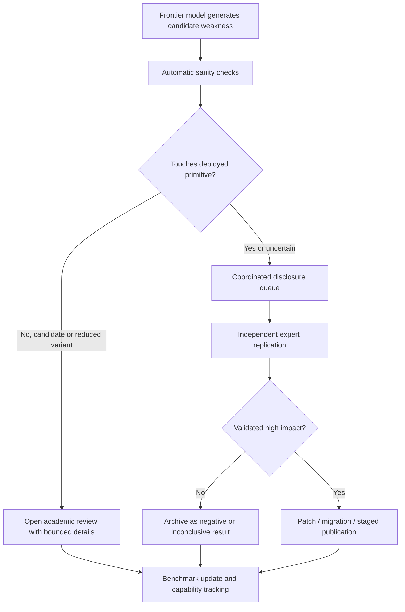

# Claude 发现密码算法弱点：能力跃迁、验证瓶颈与披露边界

### 元信息与 TL;DR

- **原文**：[Discovering cryptographic weaknesses with Claude](https://www.anthropic.com/research/discovering-cryptographic-weaknesses)
- **发布方**：Anthropic Frontier Red Team
- **发布日期**：2026-07-28，页面在 2026-07-29 更新过学术单位信息
- **配套论文**：[HAWK-n Key Recovery Reduces to SVP in Dimension n/2 + 1](https://anthropic.com/document/hawk_key_recovery.pdf)
- **配套论文**：[Cryptanalysis of 7-Round AES via the Algebraic Structure of its S-box](https://anthropic.com/document/aes_mobius_bridge.pdf)
- **相关基准**：[CryptanalysisBench: Can LLMs do Cryptanalysis?](https://arxiv.org/abs/2607.18538)
- **主题**：AI for Security、前沿模型能力评估、密码分析、负责披露、Agent 研究治理

**TL;DR：**

- Anthropic 报告称，Claude Mythos Preview 在密码分析上取得两类研究结果：一类削弱后量子签名候选方案 **HAWK**，另一类改进 **7-round AES** 的既有分析路线。
- 这不是普通软件漏洞挖掘：软件漏洞通常来自实现错误；本文更关心算法与数学结构本身是否存在可利用弱点。
- HAWK 结果的核心是利用 power-of-two cyclotomic ring 中的非平凡 Galois involution，把 key recovery 降到更低维的精确 SVP oracle 调用；论文称 HAWK-512 gate-count 成本从约 `2^150` 降到 `2^108`，HAWK-1024 从约 `2^288` 降到 `2^182`，并演示 HAWK-256 端到端恢复。
- AES 结果不攻击完整 AES-128，而是攻击研究用的 **7 of 10 rounds** 变体；Claude 提出 Möbius Bridge fingerprint，消掉既有路线中的一个关键枚举维度，使前沿 reduced-round 攻击加速约 **200-800x**。
- 两个结果都被 Anthropic 明确限定为 **当前不影响生产系统**：HAWK 仍是 NIST 附加签名标准化候选，7-round AES 不是完整 AES。
- 能力侧的数字很扎眼：HAWK 发现约用 **60 小时**；两个主要结果各自约耗费 **10 万美元 API 成本**；AES 方向中模型生成约 **10 亿 output tokens**，而人类研究者后续用了数百小时乃至近一个月验证正确性。
- 相关 CryptanalysisBench 把密码分析做成可评测任务集：**191 个任务、6 类 primitive、3 个 tier**；五个前沿模型在 Tier 1 上解出 **65%-86%**，在 full-strength Tier 2 上解出 **6-12 个**。
- 这篇文章最值得带走的不是“AI 已经破坏现代密码体系”，而是：前沿模型可能把密码学审计从少数专家的低吞吐流程，推向“机器高速提出候选弱点、人类成为验证瓶颈”的新阶段。
- 局限同样重要：厂商博客不是同行评审结论；AES 论文依赖 wrong-key randomization heuristic 与经验测试；Claude 的 chain-of-thought 发布形式经过重写整理；真实风险取决于目标 primitive 是否部署、弱点是否可验证、披露流程是否能承接。

### 研究问题：这篇文章真正关心什么？

本文表面上讲两项密码分析结果，底层问题更大：

- **能力问题**：前沿 LLM 是否已经能在密码学这种高门槛、强形式化、强验证的领域提出新攻击思路？
- **安全问题**：如果模型能提出真实 cryptanalytic insight，现有标准化、披露、验证和部署响应流程是否能跟上？
- **治理问题**：当机器生成候选发现的速度超过人类专家验证速度，哪些结果应该公开，哪些应该延迟，哪些需要政府、学界和产业共同判断？

Anthropic 用两个案例回答这些问题：

| 案例 | 被分析对象 | 模型贡献 | 现实影响 | 为什么适合做能力评估 |
| --- | --- | --- | --- | --- |
| HAWK key recovery | 后量子签名候选 HAWK | 找到可利用的 lattice automorphism，并导向更低维 SVP reduction | 影响候选方案安全边际，不影响已部署生产系统 | HAWK 正处于公开标准化审查流程，弱点可以被论文与代码验证 |
| 7-round AES | 研究用 reduced-round AES-128 | 提出 Möbius Bridge fingerprint，优化 meet-in-the-middle 分析 | 不攻击完整 AES，不要求生产系统迁移 | AES 家族研究历史深，任何改进都需要严肃核验 |

这个问题意识和普通“AI 写代码安全”不同：

- 软件漏洞挖掘常常依赖 API 误用、边界检查、内存安全或配置错误。
- 密码分析更像数学研究：要理解结构、提出假设、证明或实验验证复杂度。
- 因此，如果 LLM 在这里产生新结果，说明能力前沿已经进入更接近研究发现的区域。

### 作者论证路线：claim → mechanism → evidence → boundary

| Claim | Mechanism | Evidence | Boundary |
| --- | --- | --- | --- |
| Claude 不只是找实现 bug，也能发现算法层弱点 | 让 Mythos 在 agentic harness 中读文献、提出假设、运行实验、写验证管线 | HAWK 攻击、7-round AES 改进、后续 LEA/Serpent 等探索 | 结果来自 Anthropic 自述与配套论文，仍需社区复核 |
| HAWK 结果削弱候选方案安全边际 | 从公开 key `Q = B*B` 构造 cocycle lattice，借助 `τ: ζ -> -ζ` 找到通向等价 secret key 的结构 | HAWK-512 与 HAWK-1024 gate-count 成本下降；HAWK-256 端到端恢复 | HAWK 尚未部署；攻击不转移到 Falcon，也不泛化到所有 lattice cryptography |
| AES 结果显示模型能在高度研究过的 primitive 上做增量突破 | 在 reduced-round AES 的 meet-in-the-middle 路线中构造 invariant fingerprint，减少枚举 | 对既有 7-round 路线约 200-800x 加速 | 只适用于 7-round AES；完整 AES-128 有 10 rounds，未被破坏 |
| 人类验证成为主要瓶颈 | 模型高速生成候选与中间报告，人类需要补齐密码学背景并核查正确性 | AES 方向模型约一周提出思路，人类验证用了数百小时和近一个月 | 这说明工作流瓶颈转移，不说明模型输出默认可信 |
| 负责披露流程需要提前设计 | 向 HAWK 作者、政府和产业伙伴提前共享，公开时同步说明生产影响 | Anthropic 称 HAWK 结果已在 6 月分享给作者，并协调到 NIST 公开邮件列表 | 公开材料经过选择；未来若影响已部署系统，披露策略会更复杂 |

可以把这篇文章的主张压缩成一个安全能力公式：

```text
AI cryptanalysis risk =
  candidate_generation_rate
  × technical_validity
  × deployment_relevance
  ÷ human_verification_capacity
```

变量解释：

- `candidate_generation_rate`：模型能以多快速度产生可检查的攻击思路。
- `technical_validity`：这些思路在数学证明、实验和实现中是否站得住。
- `deployment_relevance`：目标 primitive 是否已进入生产系统，或是否正处于标准化窗口。
- `human_verification_capacity`：专家、标准组织和厂商能否及时核验、修订和披露。

这也解释了为什么作者反复强调“无生产影响”：

- 能力展示如果不写部署边界，就容易被误读成现代密码系统已经失守。
- 但如果只强调无影响，又会低估模型进入研究级 cryptanalysis 的长期意义。
- 这篇文章的张力，正是在“短期无需恐慌”和“长期需要制度准备”之间。

### HAWK：从候选签名方案到低维 SVP reduction

HAWK 是 NIST post-quantum digital signature 补充标准化流程中的第三轮候选之一。

它吸引人的地方包括：

- 基于 lattice isomorphism problem，而不是常见 LWE/SIS 系列。
- 签名过程不依赖浮点。
- key 和签名尺寸较紧凑。
- 在公开评审流程中已经经过多轮专家审查。

论文里的基本对象可以这样理解：

| 符号 | 含义 | 安全分析中的作用 |
| --- | --- | --- |
| `K_n = Q(ζ)` | power-of-two cyclotomic field | 定义 HAWK 使用的代数环境 |
| `R_n = Z[ζ]` | ring of integers | secret key 和 public key 的元素空间 |
| `B ∈ SL_2(R_n)` | HAWK secret key | 攻击目标是恢复任意等价 secret key |
| `Q = B*B` | public Gram matrix | 攻击者可见的 public key 表示 |
| `τ: ζ -> -ζ` | Galois involution | Mythos 发现可用来构造攻击的结构 |
| `V_τ = B^{-1}τ(B)` | cocycle | 从 public data 约束出发，连接到 secret key |

作者给出的高层机制是三步：

```text
Input:
  public key Q = B*B
  power-of-two cyclotomic structure K_n

State:
  lattice constraints derived from Q and τ(Q)
  candidate shortest vectors in a public rank-n lattice

Loop:
  1. build Λ_B^(τ), a public lattice containing V_τ as a shortest vector
  2. solve for shortest vectors using a near-hypercubic reduction route
  3. filter candidates with parity and reconstruct an equivalent key B'

Output:
  any B' such that B'*B' = Q

Failure boundary:
  if the scheme lacks the relevant involution structure,
  or if the conductor avoids this shape,
  the same reduction does not directly apply
```

这里的关键不是“暴力搜索更快一点”，而是维度和结构发生变化：

- 传统视角会在 rank `2n` 的 key lattice 上做 reduction。
- Mythos 发现的 route 构造 rank `n` 的 cocycle lattice。
- 后续精确 SVP oracle 的核心维度变成 `n/2 + 1`。
- 这会改变参数集中给定安全估计的有效成本。

配套论文给出的代表性数字是：

| 参数 | 原规格估计 | 新攻击估计 | 解释边界 |
| --- | ---: | ---: | --- |
| HAWK-256 | 挑战参数，官方规格不主张完整 gate-count | 实现可端到端恢复 | 用于演示，不等于实际部署被破坏 |
| HAWK-512 | 约 `2^150` gates | 约 `2^108` gates | 安全边际明显下降 |
| HAWK-1024 | 约 `2^288` gates | 约 `2^182` gates | 仍是指数级，但参数解释必须重估 |

从研究者角度看，HAWK 案例的价值在于：

- 它发生在标准化前，正是公开审查流程应该暴露问题的时候。
- 它不是“模型输出一个猜想”，而是有 reduction、实现和 end-to-end check。
- 它显示 LLM 可以帮助探索密码方案中人类还没有充分挖掘的代数结构。
- 它也提醒标准化流程：未来候选方案可能需要把 AI-assisted review 当作默认审查环节。

边界同样不能省略：

- 攻击不影响其他 NIST post-quantum signature candidates。
- 论文特别说明不转移到 Falcon。
- 对某些 conductor 形态，相关结构会逃避这一路线。
- HAWK 尚未成为大规模部署的生产 primitive。

### 7-round AES：Möbius Bridge 证明了什么，没证明什么？

AES-128 完整版本有 10 rounds。

本文讨论的是 reduced-round AES：

- 目标是 **7 rounds**，不是完整 10 rounds。
- 研究者分析 reduced-round 变体，是为了理解安全边际与攻击技术。
- 这类研究本来就是密码学常规工作，不等同于生产系统立刻失效。

已有路线主要属于 meet-in-the-middle 思路：

- 前向计算一部分中间状态。
- 后向剥离一部分轮函数。
- 用表、multiset 或 fingerprint 让两侧在中间相遇。
- 用空间和预计算换取搜索时间下降。

Claude 提出的 Möbius Bridge 可以按高层理解成：

```text
Goal:
  reduce one expensive guessed value in a known 7-round AES attack path

Mechanism:
  build a fingerprint that stays invariant under that guess

Effect:
  fewer table lookups / fewer equivalent enumerations
  but additional transform computation cost appears

Evidence:
  paper reports net speedup around 200-800x

Boundary:
  target is reduced-round AES, not the full AES cipher
```

这项结果的研究意义有三层：

| 层次 | 说明 | 为什么重要 |
| --- | --- | --- |
| 技术层 | 在既有 DKS/DFJ 等路线中减少一个枚举维度 | 说明模型不是只复述旧文献，而能提出结构性优化 |
| 评估层 | 结果需要数学推导、实验验证和启发式假设检查 | 说明 cryptanalysis 是强验证但高专家成本领域 |
| 治理层 | 输出本身可能含敏感技术细节 | 公开时要区分 full cipher、reduced-round、实际部署影响 |

AES 论文里最值得警惕的不是“攻击步骤”，而是验证瓶颈：

- Claude 在几天内提出思路，并生成大量中间材料。
- Anthropic 研究者后来用数百小时学习和核查相关密码分析。
- 某些正确性部分可以形式化，例如论文讨论了 Lean proof 用来排除 orbit map 的结构性缺陷。
- 但 false-positive accounting 仍依赖 wrong-key randomization heuristic 与经验测试。

这带来一个现实判断：

- AI 可以扩大 hypothesis search。
- 但密码分析最终仍需要证明、实现、实验和同行复核。
- 当候选发现速度变快，人类的主要任务会从“想出第一个想法”转向“筛掉大量貌似正确的想法”。

### Agentic harness：模型为什么能推进这类研究？

Anthropic 把 Mythos 放在 agentic harness 中工作，而不是只让模型回答一个静态问题。

HAWK 方向的流程大致是：

- 模型先做文献阅读，理解 HAWK、module-LIP、cyclotomic fields 和已有攻击路线。
- 多个 worker agent 并行探索不同假设。
- 人类提供非技术性项目管理，例如帮助记录思路、建议使用某些计算库。
- 模型写实验和验证管线，让人类 operator 能检查中间结果。
- 关键想法由两个 worker 的互动推进：一个过早否定，另一个继续推进并找到可利用路径。

AES 方向的流程更接近自主搜索：

- 人类研究者搭建 scaffold，让 Claude 自己提出假设、运行实验、筛选结果。
- 初始阶段模型倾向于认为目标太难，甚至想换目标。
- 人类只用少量高层提示推动它继续寻找真正 novel 的思路。
- 模型随后生成大量 tokens，并把关键想法写成可供后续 agent 继续推进的报告。

这里的工程含义不是“prompt 更鼓励就会有突破”，而是：

| 组件 | 作用 | 风险 |
| --- | --- | --- |
| 多 worker agent | 扩大搜索面，避免单一路线过早放弃 | 可能产生大量低质量假设 |
| 沙箱计算工具 | 把数学想法变成可检查实验 | 如果目标换成真实系统，需要严格隔离 |
| 中间报告 | 让后续 agent 继承局部发现 | 错误结论可能被递归放大 |
| 人类项目管理 | 控制目标、记录和验证节奏 | 非专家 operator 可能误信模型自评 |
| 负责披露流程 | 在公开前让相关方核查影响 | 如果验证和披露资源不足，会成为瓶颈 |

这也解释了为什么这篇文章适合放在 AI 安全，而不只是密码学新闻：

- 它展示了能力：模型能做研究型攻击发现。
- 它展示了流程：能力来自 Agent + 工具 + 长程搜索。
- 它展示了治理缺口：验证和披露速度可能赶不上发现速度。

### CryptanalysisBench：把能力从个案变成可跟踪指标

Anthropic 还把本文放到 CryptanalysisBench 这个背景下理解。

相关论文提出：

- **191 个任务**；
- 覆盖 **6 类 cryptographic primitives**；
- 主要来自 **4 个 NIST standardization competitions**；
- 任务分成三层：
  - Tier 1：已有 practical breaks 的 primitive；
  - Tier 2：没有已知 practical break 的 primitive，同时评估 full-strength 和 scaled-down variants；
  - Tier 3：接近 cryptanalysis frontier 的 challenge set。

结果给出的信号是：

| 指标 | 报告数字 | 解读 |
| --- | ---: | --- |
| Tier 1 solve rate | 65%-86% | 前沿模型已能复现大量已知攻击思路 |
| full-strength Tier 2 | 6-12 个任务 | 模型开始触及非玩具目标，但仍不是全面突破 |
| scaled-down variants | 24-61 个任务 | 缩小版 primitive 能显著暴露能力差异 |
| novel findings | SpoC、KINDI 等候选问题 | benchmark 可能同时成为评测和发现工具 |

这个基准的设计很有价值，因为 cryptanalysis 比许多网络安全任务更容易做强验证：

- 如果 key recovery 真的成立，往往能自动检查。
- 如果 attack complexity 改进，通常能和历史论文路线对比。
- 如果是 reduced-round 或 scaled-down 目标，可以降低现实伤害，同时观察模型能力。

但它也有边界：

- benchmark 会鼓励模型学习已知攻击模式，不等同于真实未知发现。
- 缩小 primitive 的成功率不能直接外推到 full-strength production primitive。
- 公开任务集本身可能成为能力训练材料，因此需要持续更新和隔离评估集。

### 证据细读：哪些数字真正支撑作者主张？

这篇文章里有几组数字承担核心证据功能。

| 证据 | 支撑的 claim | 不能证明什么 |
| --- | --- | --- |
| HAWK 发现约 60 小时 | 模型能在有限人类指导下推进研究发现 | 不能证明所有候选方案都能被快速攻破 |
| 每个主要结果约 10 万美元 API 成本 | 这种能力已经贵但可购买，不再只是国家级资源 | 不能说明低成本滥用已经普遍可行 |
| AES 方向约 10 亿 output tokens | 长程 Agent 搜索可以暴力扩大研究空间 | 不能说明输出中大多数内容有效 |
| AES 人类验证数百小时/近一个月 | 验证会成为瓶颈 | 不能说明人类专家可被替代 |
| HAWK-512 `2^150 -> 2^108` | 候选方案参数解释被显著削弱 | 不能说明 HAWK 已部署系统受影响 |
| 7-round AES 加速 200-800x | 模型提出了非平凡优化 | 不能说明 full AES 被破坏 |

最稳健的结论应当分三层：

- **已证明较强**：Anthropic 和配套论文给出了 HAWK 与 reduced-round AES 的具体技术路线、实验和边界。
- **合理推论**：前沿模型已经进入 AI-assisted cryptanalysis 的实用研究阶段。
- **尚未证明**：模型可以可靠、自主、低成本地破坏部署中的现代密码系统。

### 失败与局限：为什么不能把它写成“AI 破解密码学”？

这篇文章最容易被误读成夸张标题。

需要明确排除几种说法：

- 不是完整 AES 被破解。
- 不是所有 post-quantum cryptography 被破解。
- 不是模型完全替代密码学专家。
- 不是任意人都能低成本复现实验。
- 不是所有模型都有同等能力。

技术局限包括：

| 局限 | 具体含义 | 研究影响 |
| --- | --- | --- |
| HAWK 适用性有限 | 利用特定 power-of-two cyclotomic structure | 不能泛化到 Falcon 或所有 lattice scheme |
| AES 是 reduced-round | 只看 7 of 10 rounds | 主要是安全边际研究，不是生产迁移信号 |
| 验证依赖人类 | 模型提出结果后，人类仍需大量核查 | 能力增长会推高专家审核需求 |
| 部分假设经验化 | AES false-positive accounting 依赖 heuristic 和实验 | 需要更多形式化与同行复核 |
| 来源是厂商披露 | 官方博客和自家研究团队主导叙事 | 需要外部 cryptography 社区复验 |

治理局限也很关键：

- 如果模型未来发现真实部署 primitive 的高影响弱点，公开论文、代码、演示和 chain-of-thought 的边界会更难划。
- 标准组织需要区分“候选方案审查材料”和“可直接损害现网系统的 exploit detail”。
- 模型开发方需要决定哪些 cryptanalysis capability 可以开放给普通用户，哪些只能进入受控研究环境。
- 安全社区需要新的 triage 流程，处理由模型大规模生成的高质量与低质量候选发现混合流。

### 对 AI 安全的核心判断

从 AI 安全角度看，这篇文章的重要性不在单个 HAWK 或 AES 结果，而在能力曲线的形状。

过去一年，AI for Security 常见叙事是：

- 模型能读代码；
- 模型能复现 CVE；
- 模型能生成 exploit 思路；
- 模型能做 agentic reconnaissance 和漏洞验证。

本文把边界推进到：

- 模型能读长篇密码学文献。
- 模型能提出新数学结构。
- 模型能写计算验证管线。
- 模型能在多 agent scaffold 中持续搜索数天。
- 模型能产出需要专家严肃审查的研究候选。

这对防守者意味着：

| 防守层 | 需要新增的问题 |
| --- | --- |
| 模型评估 | 是否有 cryptanalysis、formal reasoning、long-horizon research discovery 专项评测 |
| 访问控制 | 高危安全研究能力是否需要 trusted access、日志、速率限制和用途审计 |
| 披露制度 | 模型发现候选弱点后，如何判定是否联系标准组织、厂商或政府 |
| 人类验证 | 谁负责证明、复验、反驳和归档模型发现 |
| 标准化流程 | 新 cryptographic primitive 是否默认接受 AI-assisted adversarial review |

### 领域延伸：下一步最该追问什么？

我会把后续问题分成四类。

| 问题 | 为什么重要 | 可观察证据 |
| --- | --- | --- |
| 模型是否能从 reduced-round 走向 full-strength frontier？ | 这决定长期部署风险 | 新论文、NIST 邮件列表、独立复验 |
| 验证瓶颈能否自动化？ | 如果不能，人类专家会被候选发现淹没 | proof assistant、reference implementation、可复现实验 |
| 开放权重模型何时追上？ | 能力扩散决定滥用成本 | CryptanalysisBench 横评、模型卡能力声明 |
| 披露规范如何改？ | cryptanalysis 影响面可能跨国、跨行业 | NIST/IETF/厂商 coordinated disclosure 规则 |

一个务实的研究路线是：



这张图表达的不是某家公司的流程，而是本文隐含的制度需求：

- 先分流生产影响。
- 再要求独立复验。
- 然后决定公开粒度。
- 最后把经验回流到能力评估。

### 和近期 Agent 安全事件的差异

把本文和同周其他 Agent 安全材料放在一起看，会发现风险形态并不相同。

| 维度 | 入侵事件类材料 | 本文的密码分析材料 |
| --- | --- | --- |
| 主要对象 | 真实云服务、沙箱、凭证、工具链和供应链 | 数学 primitive、标准化候选方案、reduced-round cipher |
| 风险触发点 | Agent 获得了过宽的运行环境与网络路径 | Agent 获得了长程研究搜索和计算验证能力 |
| 防守重点 | 最小权限、网络隔离、日志、审计、凭证轮换 | 标准化审查、专家复验、披露分流、能力访问控制 |
| 证据形态 | 时间线、日志、动作簇、基础设施变更 | 论文、复杂度估计、实现验证、形式化或经验检验 |

这种差异很重要：

- 入侵事件告诉我们，Agent 一旦接触真实系统，权限边界会变成首要风险。
- 密码分析事件告诉我们，Agent 即使只在研究沙箱中工作，也可能产生高影响安全发现。
- 前者主要考验工程隔离；后者主要考验知识生产与披露制度。
- 两者共同说明，AI 安全不能只做内容过滤，也不能只做运行时沙箱。

因此，对高能力研究型模型的治理至少需要两条线并行：

- **执行边界**：限制模型能访问什么系统、数据、密钥、网络和工具。
- **发现边界**：限制模型发现高影响弱点后如何记录、升级、复验和发布。

如果只做执行边界，模型仍可能在封闭环境中发现真实世界重要 primitive 的弱点。

如果只做发现边界，模型一旦接入外部工具，又可能把研究能力转化为对真实服务的探索。

本文的长期意义就在这里：

- 它把“AI for Security”从漏洞自动化推进到安全研究自动化。
- 它让能力评估不能只看靶场通关率，还要看模型能否提出新的、可验证的研究假设。
- 它也让披露制度从“人类研究者提交报告”扩展到“模型生成候选、团队筛选、外部复核、分级公开”的流水线。

### 结论：从“发现能力”到“验证制度”

这篇 Anthropic 文章给出的最强信号是：

- 前沿模型已经能在密码分析中贡献新研究候选。
- Agentic harness 让模型能持续搜索、分工、实验和写中间报告。
- 对候选算法的 AI-assisted review 会变成标准化流程的一部分。
- 人类专家短期不会消失，反而会成为更稀缺的验证瓶颈。

本文也给出清晰边界：

- HAWK 是候选方案，不是已广泛部署的生产签名标准。
- AES 结果是 reduced-round，不是完整 AES。
- 成本、scaffold、专家验证和披露协调都是门槛。
- 厂商报告需要等待更多独立密码学社区复核。

所以，研究者应该把它理解为一个能力前哨：

- 不是“AI 破解了互联网密码系统”。
- 而是“AI 已经开始改变密码学弱点发现的吞吐结构”。
- 真正需要建设的是验证、披露、访问控制和标准化审查制度。
