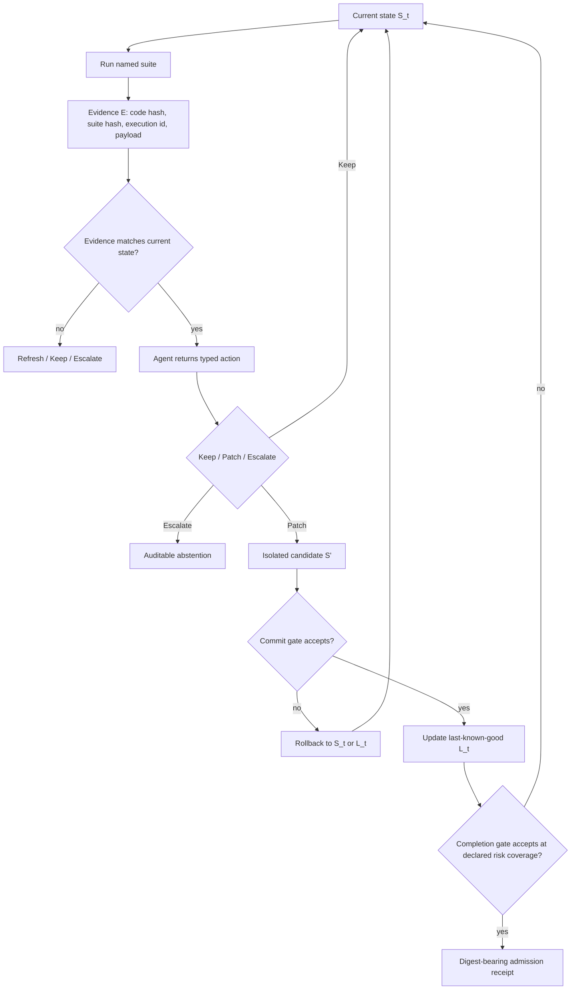

# Looping Is Not Reliability：代码 Agent 的“多试几轮”为什么不是可靠性证明

## 元信息与 TL;DR

- 原文：Looping Is Not Reliability: State-Bound Evidence and Typed Revision Contracts for Agentic Code Repair
- 作者：Xueping Gao、Jianwei Yang、Qiang Yang
- 链接：https://arxiv.org/abs/2607.24604
- 类型：论文，AgenticDev 2026 workshop preprint
- 方向：大模型 Agent / coding agent / code repair reliability
- 时间：arXiv v1 于 2026-07-27 16:05:23 UTC 提交，落在本轮当前周窗口内。

### TL;DR

- 这篇论文反驳一个常见直觉：代码 Agent 只要执行“生成、测试、修改”的循环，可靠性就会自然提高。
- 作者把问题从“是否曾经找到正确 patch”改写为“是否能保留、验证并提交正确状态”，这叫 completion reliability。
- 核心实验显示：在 30 个 HumanEval repair 任务、5 个 seed、6 种证据条件下，900 条三轮强制修订轨迹里，current trace 条件的一轮后当前正确率是 82.0%，二轮后降到 67.3%，三轮后仅回到 69.3%；同时 ever-correct 却从 82.0% 增到 85.3%。
- 这意味着“曾经正确”和“最终正确”会分离：第三轮时 16.0% 轨迹已经产生过正确 patch，但后来又丢失。
- 作者又用 2,430 个 common-state 分支控制 post-treatment risk-set bias，发现 stale trace 对正确状态尤其危险；14B 复制实验中，stale wrong trace 让 34/135 个正确起点变坏，而 current trace 只有 4/135，差值 22.2 个百分点，task-cluster 95% CI 为 [8.9, 37.0]，exact Holm p=0.0337。
- 论文提出一个 evidence-bound typed loop contract：证据必须绑定代码状态哈希，修订动作必须是 Keep / Patch(code) / Escalate(reason)，正确 checkpoint 不能被无效动作覆盖，停止决策要记录 verifier 的 risk、coverage 与错误相关性。
- 但作者没有把 contract 包装成万能解法：540-rollout prospective policy 消除了观察到的 correct-start harm，却损失 wrong-start repair；24 个真实仓库 bug、4 套 coder stack 的实验还显示 completion floor、组件异质性和 Holm 不显著结果。
- 最重要的结论是：Agent 可靠性不能只报 pass@1、best-of-k 或循环深度，还要报 current vs ever-correct、wrong-to-correct / correct-to-wrong transition、verifier risk-coverage、conditional false-accept dependence、sound completion 与拒绝/成本。

## 研究问题：作者到底在拆哪个误区？

### 不是“循环有没有用”，而是“正确状态会不会被守住”

- 很多 coding agent 都是类似流程：
  - 生成候选 patch；
  - 跑测试或读错误日志；
  - 把反馈喂回模型；
  - 让模型继续修；
  - 在某个条件下停止并提交。
- 这个流程容易让人默认：
  - 更多轮等于更多搜索机会；
  - 测试反馈等于可靠证据；
  - 另一个模型 verifier 等于独立裁判；
  - 某轮通过测试后，再循环也大概率不会伤害正确结果。
- 论文把这些直觉拆开：
  - proposal search：轨迹中有没有产生过正确 patch；
  - completion reliability：系统是否保留正确状态、使用关于当前状态的证据、用低风险条件停止。

### 五个研究问题的功能

| RQ | 问题 | 它在论证里的作用 |
|---|---|---|
| RQ1 | 正确性在重复修订中是不是吸收态 | 检验“已经修好就不怕继续改”的假设 |
| RQ2 | 同一个 wrong/correct 状态下，证据内容与状态对齐如何影响修复和伤害 | 把 payload 信息量与 provenance 对齐拆开 |
| RQ3 | verifier 质量或独立性能否从模型家族差异推出 | 反驳“换一个模型家族就独立”的捷径 |
| RQ4 | 哪些编排 guard 能挡住观察到的失败，代价是什么 | 把安全、修复能力、覆盖率、成本同时报告 |
| RQ5 | 仓库级 Agent 中 contract 和允许修订次数如何影响 completion | 检验机制在真实 Git/search/edit/test 循环里的边界 |

## 可靠性分解：为什么“再修一轮”的期望值会变号？

作者先给出一个很干净的 transition 视角。

设：

- \(Y_t \in \{0,1\}\)：第 \(t\) 次修订后的代码是否可执行正确；
- \(e_t\)：下一次修订使用的证据；
- \(\alpha_e = P(Y_{t+1}=1 \mid Y_t=0,e)\)：证据 \(e\) 下从错修到对的概率；
- \(\beta_e = P(Y_{t+1}=0 \mid Y_t=1,e)\)：证据 \(e\) 下从对修坏的概率；
- \(q_t=P(Y_t=1)\)：当前状态正确概率。

于是：

```text
q_{t+1} - q_t = (1 - q_t) * alpha_e - q_t * beta_e
```

这条公式的含义很直接：

- 当当前大概率是错的，\((1-q_t)\alpha_e\) 这一项占主导，再修一轮可能有价值；
- 当当前大概率是对的，\(q_t\beta_e\) 这一项占主导，再修一轮可能伤害正确状态；
- 如果 \(q_t > \alpha_e / (\alpha_e + \beta_e)\)，继续修订的期望正确率变化就是负的。

所以循环深度本身不是价值，循环深度只是增加 transition 机会。真正决定收益的是：

- wrong-to-correct 的 repair kernel；
- correct-to-wrong 的 regression kernel；
- 证据是否描述当前代码；
- verifier 是否足够低风险；
- orchestrator 是否会保存 last-known-good。

## 实验设计：作者怎么避免“后处理风险集”误导？

### 轨迹实验：先看自然循环里的发现与丢失

论文的第一组实验是 sealed five-seed trajectory study。

| 组件 | 设定 |
|---|---|
| 任务 | FeedbackEval 中 HumanEval 部分的 30 个 Python function-repair 任务 |
| coder | Qwen2.5-7B-Instruct |
| 修订轮数 | 每条轨迹强制 3 轮 |
| 证据条件 | current binary、current trace、stale binary、stale trace、unavailable、flipped binary |
| 轨迹数量 | 30 tasks × 6 evidence × 5 seeds = 900 trajectories |
| 候选修订 | 2,700 revisions |
| verifier verdicts | 13,500 |
| stopping replay outcomes | 18,000 |

关键是“强制修订”：

- 它不是模拟所有 adaptive agent 的自然行为；
- 它故意估计一个问题：如果 orchestrator 继续让模型修改，已经正确的 patch 会不会被破坏；
- 这让“循环不是可靠性保证”变成可测的 transition 问题。

### Common-state intervention：把起始代码状态固定住

自由运行轨迹有一个偏差：

- 证据会影响某个分支是否进入正确状态；
- 如果只比较后来从正确状态掉下来的比例，就会在不同证据造成的风险集上做条件化；
- 这叫 post-treatment risk-set bias。

作者的处理方式是 common-state intervention：

- 对 27 个同时有 wrong 和 correct frozen state 的任务，机械选择一个 wrong state 和一个 correct state；
- 从同一个 wrong state 分支到 current binary、current trace、unavailable、matched control；
- 从同一个 correct state 分支到这些条件，再加 stale trace from paired wrong state；
- 每个 task-state-evidence 条件跑 5 个 common-random-number seeds；
- Qwen2.5-7B 跑 1,215 个分支，Qwen2.5-14B 按相同 states、prompts、seeds 复制，再加 1,215 个分支；
- 合计 2,430 个单步 branches。

这个设计的意义是：

- 比较的不是“哪些轨迹碰巧到了正确状态”；
- 比较的是“同一个正确代码，面对不同证据 envelope 时会不会被修坏”；
- 它把状态、证据、模型响应三个因素尽量放到同一个对照面上。

## 核心结果一：ever-correct 上升，不代表 current correctness 上升

### Figure 1b 的关键信号

在 current trace 条件下：

| 指标 | revision 1 | revision 2 | revision 3 |
|---|---:|---:|---:|
| current correctness | 82.0% | 67.3% | 69.3% |
| ever-correct | 82.0% | 84.7% | 85.3% |

解释：

- ever-correct 在上升，说明搜索确实找到了更多“曾经正确”的 patch；
- current correctness 在第二轮大幅下降，说明继续修改会丢失正确状态；
- 到第三轮，16.0% 轨迹已经产生过正确 patch，随后又丢掉。

对比其他证据条件也说明它不是单纯“轮数越多越差”：

| 条件 | revision 1 | revision 2 | revision 3 | 读法 |
|---|---:|---:|---:|---|
| current binary | 0.700 | 0.700 | 0.720 | 二进制信号伤害较少，但不保证吸收 |
| current trace | 0.820 | 0.673 | 0.693 | trace 有助修复，也会刺激过度修改 |
| stale trace | 0.687 | 0.713 | 0.660 | 旧 trace 的效果随轮次漂移 |
| unavailable | 0.687 | 0.687 | 0.707 | 没证据不一定最坏，但修复信息弱 |

作者的边界也很重要：

- 这个结果只证明 tested forced-revision protocol 下正确性不是吸收态；
- 它不证明所有 adaptive loop 都会退化；
- 它证明 adaptive loop 需要 preservation 和 stopping rule，而不是只靠“继续试”。

## 核心结果二：证据有用，但 stale evidence 会复活已修好的 bug

### Table 3：同一状态下的 repair 与 harm

Table 3 用 event count / 135 报告结果。

| Start | Evidence | 7B event | 14B event | 含义 |
|---|---|---:|---:|---|
| Wrong | Current binary | 105/135 | 115/135 | 简单 pass/fail 能修不少 wrong starts |
| Wrong | Current trace | 113/135 | 120/135 | trace 对 7B 有 repair boost |
| Wrong | Unavailable | 97/135 | 126/135 | 14B 在无证据下反而最高，说明反馈不是单调有益 |
| Wrong | Matched control | 105/135 | 119/135 | 控制文本排除一部分长度/注意力影响 |
| Correct | Current binary | 0/135 | 4/135 | 当前二进制证据相对稳 |
| Correct | Current trace | 5/135 | 4/135 | 当前 trace 也可能诱发少量 harm |
| Correct | Unavailable | 0/135 | 10/135 | 没证据也可能因为编辑压力伤害正确状态 |
| Correct | Stale wrong trace | 12/135 | 34/135 | 旧错误 trace 是最明确的风险机制 |
| Correct | Matched control | 2/135 | 17/135 | 长上下文/编辑压力解释一部分，但不是全部 |

最强的统计信号来自 14B：

- stale wrong trace harm：34/135；
- current trace harm：4/135；
- 差值：+22.2 个百分点；
- task-cluster 95% CI：[8.9, 37.0]；
- exact Holm p=0.0337。

作者还给了机制例子：

- HumanEval/89 中，旧报告来自 Caesar shift 12 的错误代码；
- 当前代码已经修到 shift 4；
- stale report 包含真实输入/输出事实，但错误声称这些事实描述当前代码；
- 7B 在 5/5 seeds 中把正确 shift 4 改回 12。

这个例子说明：

- payload 可以包含真事实；
- 但 envelope 若不绑定当前 state，真事实也会变成误导；
- agent 对证据的 responsiveness 会把 state mismatch 放大成 regression。

## 核心结果三：verifier 质量不等于 verifier 独立性

论文把 verifier 分成两个问题：

- 单个 verifier 在指定 coverage 下的 selective risk；
- 两个 verifier 在错误候选上的 conditional false-accept dependence。

### 关键定义

对 verifier \(v\)：

```text
Coverage_v(c) = P(A_v = 1)
Risk_v(c)    = P(Y = 0 | A_v = 1)
```

对两个 verifier \(i,j\)，只在错误候选上看它们是否一起误接收：

```text
D_ij(c) = P(A_i A_j | Y=0) - P(A_i | Y=0) P(A_j | Y=0)
```

如果组合 verifier 要求两者都接受，那么：

```text
P(A_i A_j = 1 | Y=0) = f_i * f_j + D_ij
```

这说明：

- “错误概率相乘”只在 \(D_{ij}=0\) 时成立；
- 如果两个 verifier 错误正相关，相关性就是额外可靠性惩罚；
- 换模型家族不自动带来低风险，低风险也不自动带来独立错误。

### Table 4：70% coverage 下的 risk 与 conditional phi

| Verifier / pair | Risk at 70% coverage | Conditional phi |
|---|---:|---:|
| Qwen-7B | 0.050 | - |
| Qwen-14B | 0.041 | - |
| DeepSeek-6.7B | 0.240 | - |
| Qwen-7B / Qwen-14B | - | 0.641 |
| Qwen-7B / DeepSeek | - | -0.072 |
| Qwen-14B / DeepSeek | - | 0.021 |

读法：

- Qwen-14B 在 70% coverage 下风险最低；
- DeepSeek 风险明显高，不因为“跨家族”就可靠；
- Qwen-7B / Qwen-14B 的 conditional phi 高达 0.641，说明同家族 verifier 的 false accept 强相关；
- Qwen-14B / DeepSeek 的相关性低，但 DeepSeek 单体 risk 太高，组合也不能只靠“独立性”背书。

## 核心结果四：更严格的停止规则有效，但代价是覆盖和修复

### Table 5：同一 900 条轨迹上的 replay

| Policy | Coverage | Risk | Sound completion | Mean rounds |
|---|---:|---:|---:|---:|
| Self only | 0.998 | 0.295 | 0.703 | 1.03 |
| Self + visible | 0.797 | 0.024 | 0.778 | 1.55 |
| Self + challenge | 0.778 | 0.000 | 0.778 | 1.56 |
| Qwen-14B only | 0.794 | 0.046 | 0.758 | 1.52 |
| Qwen-14B + challenge | 0.769 | 0.000 | 0.769 | 1.55 |
| Challenge executable | 0.788 | 0.000 | 0.788 | 1.52 |
| Qwen-14B + fresh challenge | 0.384 | 0.000 | 0.384 | 2.27 |

这里的重点不是“challenge gate 就绝对安全”：

- challenge gate 在样本里防住 self-only 的 265 个 false completions；
- 但 zero observed errors 不等于总体零风险；
- 作者按 30 个 task cluster 给出 conservative one-sided 95% zero-event bound：9.5%；
- 如果把 1,877 个 challenge-passing revisions 当独立样本，会得到 0.0016，这对跨任务泛化是反保守的。

最严格的 fresh challenge 代价更明显：

- coverage 只有 38.4%；
- sound completion 只有 38.4%；
- 平均轮数 2.27；
- 损失 311 个 baseline sound completions。

结论是：

- gate 可以降低 observed false completion；
- 但可靠性评估必须同时暴露 abstention、coverage、cost；
- 否则一个“几乎全拒绝”的策略也会显得很安全。

## Contract：从自由文本循环变成小状态机

### 四个接口义务

论文提出 evidence-bound typed loop contract，不是新 prompt，而是编排层契约。

| Obligation | Reference mechanism | Residual risk |
|---|---|---|
| State-bound evidence | 绑定 candidate、tree、policy、verifier、context identity | 对齐证据仍可能是错的，host/verifier 仍需信任 |
| Independent admission | 只有 broker 推进 verified state 并出 admission decision | 进程隔离不等于 verifier 独立 |
| Checkpoint preservation | 保留并准确恢复 last verified candidate | 只保留 oracle 覆盖到的性质 |
| Fresh certification | 对 selected completion state 重新执行检查 | flakiness、drift、suite incompleteness 仍存在 |
| Auditable stopping | typed outcomes、hash-linked events、digest-bearing receipt、coverage/liveness 字段 | auditability 不是 calibration，也不是 liveness |

### 状态绑定证据

证据 envelope 形如：

```text
E = (h_code, h_suite, execution_id, payload)
```

规则：

- 只有当 \(h_{code}\) 等于当前 state hash，证据才能用于修订当前代码；
- 如果 hash 不匹配，orchestrator 只能 refresh、Keep 或 Escalate；
- mismatch 不能直接触发 Patch。

这正对应 stale trace 复活旧 bug 的机制：

- trace payload 可能是真的；
- 但它描述的是另一个 code hash；
- 不绑定状态就会把旧事实套到新代码上。

### Typed revision action

自由文本会混淆三类情况：

- 模型认为不用改；
- 模型尝试改但输出不可解析；
- 模型明确无法完成。

论文用三种动作拆开：

```text
RevisionAction = Keep | Patch(code) | Escalate(reason)
```

只有可解析、可执行的 Patch 能替换当前状态。

作者指出，7B common-state 里 HumanEval/137 的 5 个 current-trace harms 都是只输出 `STATUS: DONE`、没有代码的响应。fail-closed parser 如果把这种动作映射为 Keep，而不是无效 patch，就能保住正确 checkpoint。

### 伪代码：contract 的事务流程

```text
Input:
  S_t: 当前代码状态
  L_t: last-known-good checkpoint，可能为空
  B: 预算
  V: configured commit/completion gates

State:
  ledger: append-only evidence events
  receipt: admission and stopping records

Loop while budget remains:
  E_t = run_named_suite(S_t)
  append ledger with (hash(S_t), suite_hash, execution_id, payload)

  if E_t.hash_code != hash(S_t) or E_t.suite_hash != requested_suite:
      action = Keep or Escalate
      continue or stop with auditable abstention

  action = agent.propose_typed_action(S_t, E_t)

  if action == Keep:
      S_next = S_t
  else if action == Escalate(reason):
      stop with abstention receipt
  else if action == Patch(code) and parseable(code):
      S_candidate = apply_patch_isolated(S_t, code)
      gate = run_commit_gate(S_candidate)
      if gate.accept:
          S_next = S_candidate
          if completion_gate.accept(S_next):
              L_next = S_next
              emit digest-bearing admission receipt
              return accepted completion
      else:
          S_next = restore(L_t) if L_t exists else S_t
  else:
      S_next = restore(L_t) if L_t exists else S_t

Output:
  accepted completion, or explicit rejection/escalation with risk-coverage metadata
```

### Mermaid：为什么它不是普通 loop



普通 loop 的问题是：

- evidence、state、verifier verdict、stop reason 往往被压进一段自然语言上下文；
- 一旦 stale evidence 混入，模型可能以为自己在修当前代码；
- 一旦 invalid output 被当成 patch，last-known-good 会被覆盖；
- 一旦 verifier risk 与 coverage 不记录，停止决策无法审计。

## 仓库级实验：contract 不是魔法，它也会暴露 liveness 问题

### 原始 288-rollout factorial

仓库实验包含：

- 24 个历史 Python bugs，来自 9 个项目；
- 每个项目最多 3 个任务；
- Qwen2.5-14B 通过 typed search、view、edit、shell、test、submit、escalate 在真实 Git worktree 中操作；
- current vs one-step-stale diagnostic evidence；
- contract OFF vs ON；
- 每格 3 个 preregistered seeds；
- 合计 \(24 \times 2 \times 2 \times 3 = 288\) rollouts。

结果很克制：

- Contract OFF 产生 5 个 orchestrator-accepted completions：
  - current evidence 3/72，其中 2 个 unsafe、1 个 sound；
  - stale evidence 2/72，两个都是 unsafe；
- Contract ON 在两个 evidence arm 里都是 0/72 accepted completions；
- 276/288 rollouts 耗尽 15-action budget；
- 只有 1 条 rollout 真正发现、admit、保留并提交 fully resolved revision。

所以：

- contract 移除了观察到的 unsafe completion；
- 也移除了唯一观察到的 sound completion；
- 这个实验主要测试 completion control，而不是证明仓库级修复率提升。

### 复制与消融的边界

作者还跑了多个 frozen replication / factorial：

| 实验 | 规模 | 结论 |
|---|---:|---|
| Qwen2.5-Coder-32B-AWQ replication | 288 rollouts | contract effect on unsafe completion 为 +4.17pp，joint decision failed |
| Qwen3-Coder-Next-FP8 replication | 288 rollouts | unsafe effect 0，sound +4.17pp，但只有两个任务支撑 |
| Devstral Small 2 24B replication | 288 rollouts | unsafe effect 0，sound +2.78pp，仍不证明 population safety |
| Devstral component ablation | 576 rollouts | state binding / admission / certification 主效应均未过 Holm |
| Devstral depth-contract factorial | 576 rollouts | unsafe 0/576，sound 25/576，cap-1 到 cap-8 sound effect -0.23pp，Holm p=1.0 |

这组结果的研究价值在于：

- 它避免把漂亮机制说成已验证产品收益；
- 它显示 strict admission 可能把 useful repair 一起拒掉；
- 它把“安全性、可塑性、liveness、接口适配”分成不同指标；
- 它说明 contract 的好处必须在具体 coder、verifier、预算、任务分布下测。

## StateSeal：实现是 conformance artifact，不是能力提升证明

论文最后给出 StateSeal reference implementation。

它的职责是：

- 包装现有 agent 和项目 verifier；
- 让 agent 在隔离 worktree 中提出修改；
- admission broker 重新计算 state identity；
- verifier 在 agent 进程外执行；
- 保存 checkpoint；
- completion 前 recertify；
- 产出 digest-bearing receipt。

已报告的 conformance evidence：

- 35 个 deterministic failure-injection cases 全部通过；
- Go、Python、Node.js managed fixtures 3/3 通过；
- replay 中 state binding 截获全部 7B 的 12 个和 14B 的 34 个 stale-condition harms；
- typed action + state binding 把 total harm 从 19 降到 2、从 69 降到 33；
- challenge checkpoint 能挡住全部 19 个 7B harms，但仍留下 2 个 14B regressions，因为它们通过 visible/challenge，却失败于 hidden tests。

作者明确划边界：

- StateSeal 是 executable specification 和 conformance artifact；
- 它不是改进 repair competence 的证据；
- 它不是 verifier calibration 的证据；
- 它不证明 host、runner、Git、OS 都可信；
- 它也不能解决测试 suite 不完整的问题。

## 相关工作位置：这篇论文和已有 coding-agent 研究差在哪里？

### 它不是再证明“反馈有用”

作者承认已有工作已经说明：

- Self-Refine、Reflexion 等体现 inference-time refinement；
- FeedbackEval 研究反馈类型对代码修复的影响；
- SWE-agent、Agentless、SWE-bench 展示真实软件工程任务中的接口和验证重要性；
- AgentLens、PAIR-Bench、SpecBench 等关注 trajectory regression、hint depth、visible-hidden gap；
- in-toto、SLSA、OPA 处理 provenance 或 policy enforcement。

这篇论文的增量更窄：

- 固定 code state 后干预 evidence provenance；
- 同时报 transition、verifier selective risk、conditional dependence；
- 把这些失败机制转成可执行的 typed loop contract；
- 又用 repository factorial 显示 contract 的 completion/liveness 代价。

### 对代码 Agent 评测的直接挑战

如果只报 pass@1、best-of-k 或最终通过率，会漏掉：

- 轨迹里先对后错的 correct-to-wrong；
- verifier 拒绝率过高导致的“零风险但零覆盖”；
- 同一家族模型 verifier 的相关误接收；
- stale trace 对已修好代码的复活风险；
- completion gate 自己 false pass 时传播错误的风险。

论文建议至少报告：

- current correctness vs ever-correct；
- \(\alpha_e\) 与 \(\beta_e\)；
- risk-coverage curve；
- sound completion；
- coverage 与 mean rounds；
- conditional false-accept overlap；
- accepted-and-incorrect 与 accepted-and-correct。

## 研究者视角的结论与边界

### 这篇论文最值得带走的判断

- 循环是搜索机制，不是可靠性机制。
- 证据是状态相关对象，不是可以随便拼进上下文的文本。
- 正确 patch 需要被保留，不能只等待下一轮模型“别改坏”。
- verifier 需要 calibrated risk 和 dependence 分析，不能只凭模型名或家族差异背书。
- 严格 admission 可能提升安全性，也可能牺牲 liveness；两者必须一起报告。

### 证据边界

- HumanEval 任务可能出现在模型训练数据中，challenge 和 hidden tests 也共享 HumanEval+ 构造过程。
- Common-state 只覆盖 27 个被 7B 观察到可修的任务，不是所有 coding 任务总体。
- 仓库级实验只有 24 个 bugs、9 个 Python 项目、固定 action/test/token/wall budget。
- 多个 stack 复制改变了模型、tokenizer、adapter、runtime，不能解释为纯 capacity 或 architecture effect。
- 许多仓库实验存在 completion floor：accepted completions 太少，非劣效结论对 liveness 的约束很弱。
- StateSeal 的 35 个 failure-injection case 证明机制符合契约，不证明现实环境中 verifier 足够好。

### 对 Agent 系统设计的延伸问题

- 如果 coding agent 有长期 memory，memory write 也应像 evidence envelope 一样绑定 state、suite、source 与 validity。
- 如果 multi-agent 系统让 reviewer、planner、coder 共享上下文，就需要记录每条反馈描述的是哪个 code hash，而不是只记录自然语言建议。
- 如果平台要允许 agent 自动提交 PR，submission receipt 应包含：
  - 被验证的 tree hash；
  - verifier suite hash；
  - gate coverage 或 calibration 版本；
  - rejected patches 的 rollback 记录；
  - last-known-good 的恢复证据。
- 如果评测榜单只奖励最终 pass，它会鼓励高覆盖但高误接收策略，也会惩罚保守但可审计的 abstention 策略。
- 更好的研究问题不是“多轮 Agent 是否更强”，而是：
  - 在什么 \(q_t\) 区间继续修订收益为正；
  - 哪类 evidence 会降低 \(\beta_e\)；
  - 哪类 typed action 能减少无效输出覆盖 checkpoint；
  - verifier 的条件错误相关性如何随 coverage、任务类型、模型家族变化。

## 为什么这篇论文对 Agent 评测特别重要？

### 它把“轨迹质量”从终点分数里拉出来

很多 coding-agent benchmark 的默认叙事是：

- 给定问题；
- 让 Agent 尝试若干步；
- 看最终 patch 是否通过测试；
- 用通过率、成本、轮数比较系统。

这种评测能回答“最终有没有解出来”，但不能回答下面几类工程问题：

- Agent 曾经解出来后又改坏了吗？
- 失败是因为模型不会修，还是因为 orchestrator 覆盖了 last-known-good？
- 测试反馈描述的是当前代码，还是上一轮、另一个分支、另一个 suite？
- reviewer/verifier 的接受风险是否只是低覆盖带来的表面安全？
- 两个 verifier 同时接受时，它们的错误是否高度重叠？

论文的贡献不是替代原有 benchmark，而是给原有 benchmark 增加诊断维度。

一个更完整的结果表应至少包含：

| 维度 | 传统报告 | 本文要求补上的报告 |
|---|---|---|
| 成功率 | final pass / resolved | current correctness 与 ever-correct 分开 |
| 循环效果 | 平均轮数或最大轮数 | \(\alpha_e\)、\(\beta_e\)、正确后丢失比例 |
| 证据 | 测试日志或反馈文本 | evidence 的 code hash、suite hash、execution id |
| 停止 | 首个接受结果 | coverage、risk、sound completion、拒绝比例 |
| verifier | 单模型评分 | matched-coverage risk 与 conditional dependence |
| 工程安全 | 是否提交 patch | checkpoint、rollback、receipt、recertification |

这对研究者的提醒是：

- 如果只报 final resolved，可能把“先修好再改坏”的轨迹当成普通失败；
- 如果只报 best-of-k，可能把 orchestrator 的保留能力从问题里抹掉；
- 如果只报零 unsafe completion，可能掩盖系统几乎没有 completion 的事实；
- 如果只报 cross-family verifier，可能把低相关性和低风险混为一谈。

### 它让“证据”从上下文文本变成有类型对象

现在许多 Agent 框架把证据当成 prompt context：

- 测试输出被拼进 message；
- reviewer 建议被追加到上下文；
- shell 日志被摘要后交给模型；
- 上一轮失败原因被 memory 保存。

这种设计的问题是：

- 上下文里的句子没有天然作用域；
- 模型不会自动知道它描述的是哪个 tree；
- 同一个错误日志在不同代码状态下含义可能相反；
- 摘要过程可能丢掉 suite、命令、环境、版本信息；
- 一条旧证据被检索回来后，可能以当前事实的形式影响 patch。

本文的 envelope 思路把证据变成结构化对象：

```text
evidence.payload      = 可读诊断内容
evidence.h_code       = 诊断生成时的代码状态
evidence.h_suite      = 诊断使用的测试集合
evidence.execution_id = 可追溯执行记录
evidence.policy_id    = 解释该证据的 admission/completion 策略
```

这会改变 Agent 系统的接口设计：

- memory 不能只存“修复建议”，还要存建议所绑定的 state；
- test runner 不能只吐 stdout，还要吐 suite identity；
- reviewer 不能只输出 accept/reject，还要输出 coverage/risk 条件；
- planner 不能把所有历史诊断等价地喂给 coder，需要先检查 hash alignment；
- UI 不能只显示“通过”，还要显示“通过的是哪个状态、哪个 suite、哪个 gate”。

### 它把“保守”与“可靠”区分开

论文里一个反复出现的现象是：更严格的 gate 往往会降低 observed risk，但也会降低 coverage。

这在安全领域很容易被误读：

- 如果系统拒绝几乎所有 patch，unsafe completion 会很少；
- 如果系统很少提交，sound completion 也会很少；
- 如果只看 risk，拒绝策略会看起来可靠；
- 如果只看 pass rate，严格策略会看起来很弱。

因此作者强调 sound completion，而不是只报 risk：

```text
sound completion = P(A = 1, Y = 1)
```

这个指标同时要求：

- 系统真的接受；
- 被接受的东西真的正确。

它比单纯 risk 更适合比较 Agent completion policy，因为它会惩罚“靠全拒绝获得低风险”的策略。

但 sound completion 也不能单独使用：

- 它仍然受任务难度和模型能力影响；
- 它可能在低 coverage 下很低；
- 它需要和 unsafe completion、coverage、cost 一起读；
- 它不能替代对 verifier calibration 的独立评估。

### 它对“自动修 PR / 自动合并”的现实含义

如果把论文机制放到工程系统里，最危险的不是模型写错代码本身，而是错误被系统当成已验证状态推进。

典型高风险链路是：

1. Agent 产生一个 patch；
2. 测试在某个中间 state 上运行；
3. Agent 又根据旧日志改了一轮；
4. reviewer 看到摘要后接受；
5. orchestrator 提交的是另一个 tree；
6. CI 或私有 suite 与最终提交状态没有强绑定；
7. 用户只看到“测试通过 / reviewer accepted”。

本文 contract 会要求每一步留下可检查边界：

- 测试通过记录必须指向具体 tree hash；
- reviewer 接受必须指向具体 candidate hash；
- 如果 patch 后 tree 变了，旧测试证据失效；
- 最终提交前必须 fresh certification；
- admission receipt 要能解释为什么这个 state 被接受；
- 如果后续发现证据撤回，应该能定位 derived record 与 side effect。

这不是形式主义。Stale trace 实验说明：

- 旧日志不是无害噪声；
- 旧日志可能包含正确事实；
- 正确事实放错 state 就会系统性复活旧 bug；
- 更强 coder 反而可能更积极响应旧证据。

## 如果要复现或扩展，应该优先看哪些缝隙？

### 一：把 state alignment 从代码扩到多模态和工具状态

本文主要研究代码状态，但 Agent 的真实状态还包括：

- 浏览器 DOM；
- 登录会话；
- 文件系统；
- 数据库快照；
- notebook kernel；
- 外部 API 响应；
- 工具权限和额度；
- multi-agent shared memory。

未来可以把 \(h_{code}\) 扩展为 \(h_{world}\)：

```text
h_world = H(code tree, tests, tool config, browser state, memory snapshot, permission scope)
```

这样可以研究：

- Web agent 是否会把旧页面诊断套到新 DOM；
- 数据分析 Agent 是否会把旧 dataframe 结论套到新过滤条件；
- 安全 Agent 是否会把旧扫描结果当成当前依赖图；
- 多 Agent 系统是否会把半完成 notes 当成 committed belief。

### 二：把 verifier dependence 做成部署时监控

论文里的 dependence 是离线估计。真实系统还需要监控漂移：

- 同一个 verifier pair 在不同仓库、语言、错误类型上的 \(D_{ij}\) 可能变化；
- coverage threshold 改变会改变 accepted error set；
- 新模型版本可能降低 marginal risk，却提高同类错误相关性；
- prompt 改动可能让两个 verifier 更像彼此，从而削弱 ensemble。

一个可执行的监控表可以是：

| 监控项 | 触发问题 |
|---|---|
| matched-coverage risk | verifier 是否在目标覆盖率下变差 |
| conditional phi | 两个 verifier 是否开始一起错 |
| excess joint false acceptance | ensemble 是否失去乘法收益 |
| abstention rate | 低风险是否来自过度拒绝 |
| recertification failure rate | final tree 与已验证 tree 是否频繁漂移 |

### 三：把 typed action 设计成 Agent 接口标准

Keep / Patch / Escalate 看起来简单，但它改变了失败处理：

- Keep 是一个合法动作，不等于模型卡住；
- Patch 必须可解析，不能让自然语言说明偷偷变成状态更新；
- Escalate 是可审计拒绝，不是 silent failure；
- invalid action 不得覆盖 last-known-good。

这对未来 coding-agent benchmark 很关键：

- benchmark 不应只评价 patch 文本；
- 也应评价 action protocol 是否阻止无效输出破坏状态；
- 对“已经正确”的任务，应专门测 action bias；
- 对“证据 stale”的任务，应专门测 agent 是否请求刷新而不是盲改。

### 四：把 liveness 作为一等指标

Strict contract 如果总是拒绝，就不能服务真实开发。

因此后续研究需要把 liveness 显式建模：

- 在固定 unsafe bound 下最大化 sound completion；
- 在固定 coverage 下最小化 unsafe completion；
- 在固定成本下比较 fresh certification 的收益；
- 对不同风险等级 bug 设不同 admission policy；
- 对低风险文件允许更多探索，对高风险路径要求更强 recertification。

这会把问题从“有没有 guardrail”推进到“guardrail 的 operating point 怎么选”。

## Detail inventory

| 类别 | 本文提取到的细节 |
|---|---|
| 方法名 | reliability decomposition、common-state intervention、evidence-bound typed loop contract、StateSeal |
| 数据 / 任务 | 30 HumanEval repair tasks；27 common-state tasks；24 repository bugs from 9 Python projects |
| 模型 | Qwen2.5-7B-Instruct、Qwen2.5-14B、Qwen2.5-Coder-32B-AWQ、Qwen3-Coder-Next-FP8、DeepSeek-Coder-6.7B、Devstral Small 2 24B |
| 规模 | 900 trajectories；2,700 revisions；13,500 verifier verdicts；18,000 stopping replay outcomes；2,430 common-state branches；540 prospective rollouts；多个 288/576 rollout factorial |
| 公式 | transition equation、risk-coverage、conditional false-accept dependence |
| 关键表格 | Table 1 evidence interventions；Table 2 study inventory；Table 3 repair/harm；Table 4 verifier risk/dependence；Table 5 stopping replay；Table 6 contract obligations |
| 关键失败 | stale trace 复活旧 bug；STATUS: DONE 无代码导致 invalid action；strict freshness 损失 sound completion；repository completion floor |
| 实现证据 | StateSeal 35 failure-injection cases 和 3/3 managed fixtures |
| 局限 | forced revision 非自然策略；benchmark 覆盖有限；仓库实验 event sparse；conformance 不等于 effectiveness |

## 参考链接

- arXiv abstract：https://arxiv.org/abs/2607.24604
- arXiv HTML：https://arxiv.org/html/2607.24604
- arXiv PDF：https://arxiv.org/pdf/2607.24604
- arXiv cs.CL recent 列表：https://arxiv.org/list/cs.CL/recent
- 第三方发现页 ChatPaper：https://chatpaper.com/pt/paper/314149
- 第三方发现页 NLP Arxiv Daily：https://monologg.kr/nlp-arxiv-daily/
