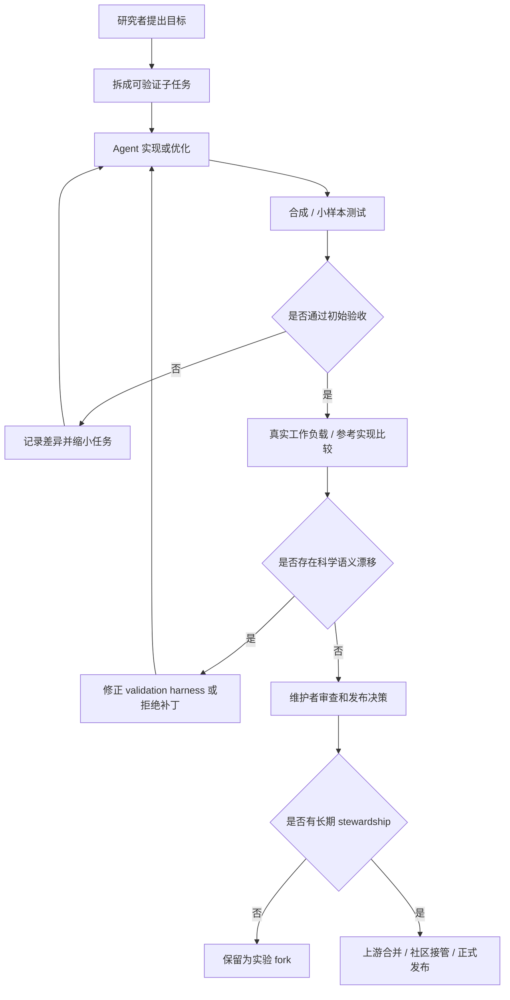

# Agentic AI 进入科学计算：8 个案例真正证明了什么，又没有证明什么

### 元信息

- 原文：Scientific computing in the age of agentic AI: an exploratory field report
- 发布方：OpenAI
- 发布日期：2026-07-28
- 类型：官方 field report / 技术案例报告
- 方向：大模型 Agent、coding agent、科学计算软件工程
- 官方页面：https://openai.com/index/scientific-computing-agentic-ai/
- PDF：https://cdn.openai.com/pdf/scientific-computing-in-the-age-of-agentic-ai-an-exploratory-field-report.pdf

### TL;DR

- 这份 55 页报告研究的不是“coding agent 能否写代码”，而是：当科学软件长期缺工程维护、测试、性能优化和所有权时，agentic coding 能否把研究者从重复工程劳动中释放出来。
- 报告收集了 8 个生命科学和统计计算案例，跨度从小范围构建系统维护，到 TensorFlow 到 PyTorch 迁移、C/C++ 到 Rust 重写、GPU-native 重构、统计采样器扩展和低层性能优化。
- 核心机制是：人类把任务拆成可验证的中间目标，Agent 负责实现、迁移、优化和反复尝试；真正的质量门不来自 Agent 自评，而来自参考实现、真实数据、预设容差、仿真校准、端到端工作流和维护者判断。
- 关键数字包括：MHCflurry 迁移约 10,000 行、约 130 个文件并发布 2.2.0；rustar-aligner 在 10,000 条酵母 RNA-seq reads 上达到 99.815% 单端和 99.883% 双端 parity；RustQC 将 186 million reads 的顺序任务总耗时从 15 小时 34 分降到 14 分 54 秒，磁盘流量从 2.5 TB 降到 0.1 TB；HelixForge 编辑阶段 98.6 倍、端到端 59.6 倍；HI.SIM 两轮零样本优化使四工作负载总 runtime 降 30.97%。
- 最重要的负面证据来自 bayesm 扩展：HMC/NUTS 和 HART 第一版都“看起来合理”，但存在 mass matrix inversion、trajectory construction、二次复杂度更新和 prior scaling 错误；simulation-based calibration、R-hat、ESS、runtime 分解才把问题暴露出来。
- 报告局限很明确：这是探索性 field report，不是独立复现实验；许多数字是 case contributor 报告的项目内结果，不能直接当作模型能力 benchmark；长期维护、归属、上游合并、许可、用户迁移仍是技术成功之外的硬边界。

### 这篇报告真正问的问题是什么？

- 表面问题：
  - 科学计算软件能不能用 coding agent 加速维护、迁移和重写？
  - 生命科学里许多工具是否存在足够多的低垂工程果实，让 Agent 值得投入？

- 深层问题：
  - 科学软件的失败不是普通应用里的“功能坏了”那么简单。
  - 如果软件依赖过时环境、隐含参数、弱测试、弱文档或未维护依赖，它会直接影响实验复现、数据分析和论文结论。
  - 因此，Agent 的价值不能只按“生成了多少代码”衡量，而要按“被哪些证据约束后仍能成立”衡量。

- 报告把问题改写成一个更适合研究者的判断式：
  - **Claim**：Agent 可以显著降低科学软件工程劳动的边际成本。
  - **Mechanism**：把迁移、重写、优化、构建系统维护、测试和 benchmark 自动化为可迭代任务。
  - **Evidence**：8 个项目给出具体代码规模、性能提升、输出等价、真实数据验证和失败诊断。
  - **Boundary**：Agent 不能替代科学正确性判断，也不能自动解决维护权、上游协作和生态标准化。

### 为什么科学计算是一个合适观察窗口？

- 科学代码的生产条件很特殊：
  - 许多工具起初只是方法论文的附属代码。
  - 原始团队规模小，激励更偏向新发现、新方法、新论文。
  - 长期维护、安装体验、CI、跨平台支持、性能工程往往排在后面。

- 生命科学尤其典型：
  - 高通量测序和分子 profiling 让数据生产更便宜、更常规。
  - 下游分析却可能越来越贵，因为 pipeline 需要复杂依赖、专业参数和大量计算资源。
  - 报告引用的背景研究显示，研究代码在干净环境中运行失败并不罕见；这类失败会把研究者时间消耗在配置、构建和调试上。

- Agent 出现后的机会不是“完全无人科学编程”：
  - 它更像把稀缺工程时间从打补丁、写胶水、迁移依赖、优化热点中释放出来。
  - 研究者的角色则转向定义目标、制定验收标准、解释差异、决定是否发布和谁来维护。

### 报告的论证路线

| 层次 | 作者主张 | 机制 | 证据 | 不能证明什么 |
| --- | --- | --- | --- | --- |
| 工程劳动 | Agent 能降低科学软件维护和改写成本 | 处理构建、迁移、优化、测试和代码生成 | 8 个案例覆盖维护、迁移、重写、GPU 改造、统计库扩展 | 不能说明所有科学软件都适合 Agent 重写 |
| 正确性 | 验证成为新的瓶颈 | 外部参考、等价检查、真实数据、仿真、容差 | rustar-aligner parity、RustQC 真实数据、bayesm SBC | 不能用 Agent 自评替代验证 |
| 性能 | 小团队可尝试以前太贵的优化 | hot-path 改写、batching、减少重复计算、硬件重构 | RustQC 60 倍、HelixForge 59.6 倍、HI.SIM 30.97% | 不能把 case-specific speedup 当通用模型 benchmark |
| 生态 | 技术成功需要 stewardship | 上游合并、社区接管、维护计划、兼容策略 | MHCflurry 合入原项目，rustar-aligner 走 scverse/nf-core | 不能保证新 rewrite 会被用户采用 |

### 8 个案例的证据表

| 案例 | Agent 做了什么 | 验证目标 | 关键数字 | 主要边界 |
| --- | --- | --- | --- | --- |
| MHCflurry | TensorFlow/Keras 迁移到 PyTorch | 旧权重可加载，预测量与原后端小容差一致 | 约 10,000 行、约 130 文件，发布 2.2.0 | 适合有清晰旧行为和原项目维护者承接的迁移 |
| rustar-aligner | STAR 的 Rust drop-in replacement | read-level 行为对齐 STAR | 10,000 条酵母 reads，99.815% 单端、99.883% 双端 parity | 超过 90% 后需要逐 read tracing，不能靠粗粒度输出 |
| svb / kuva | SIMD codec primitive 和 plotting library | wire compatibility、数值/结构测试、人类看图 | svb 1.7 到 2.9 倍压缩速度 | 图形输出仍需要人类检查视觉和结构语义 |
| RustQC / FastQC / Trim Galore | RNA-seq QC workflow 合并和 faithful rewrite | 数值输出等价、真实 pipeline 数据验证 | 186 million reads 上 15h34m 到 14m54s，2.5 TB 到 0.1 TB | 真实数据暴露小数据集看不到的边界 |
| HelixForge | GPU-native mutation insertion | mutation accuracy、artifact 检测、端到端 runtime | 编辑阶段 98.6 倍，端到端 59.6 倍，误差 0.076 到 0.034 | 早期验证 harness 有 false positive，审计本身也要审计 |
| hifiasm | C 程序 hot path 优化 | 预设 read-ordering proxy thresholds | synthetic 25.1% runtime drop，人类 chr20 reads 14.7% drop | synthetic 上收益会高估真实数据效果 |
| cyvcf2 | build、dependency、CI、release workflow 现代化 | 不改变 VCF handling | 构建和发布流程现代化 | 价值主要在可维护性，不是算法提升 |
| bayesm / bayesm-rs | R/C++ 统计采样器 Rust 重写和扩展 | posterior 行为、R-hat、ESS、SBC、runtime | base rewrite 多处 2x 到 20x；扩展修正后 HART 2.6 倍 | 第一版扩展存在统计正确性缺陷，聚合指标会掩盖错误 |
| HI.SIM | zero-shot 低层性能优化 | byte-identical output，四工作负载 benchmark | 两轮优化总 runtime 降 30.97% | 保守局部优化最容易集成，激进算法改写另需验证 |

### 方法机制：Agent 在这些案例中不是“自主科学家”

- 更准确的角色分配是：
  - 人类给出科学目标和不可破坏的行为边界。
  - Agent 在代码库中执行迁移、生成补丁、优化热点、写测试、跑 benchmark。
  - 人类设计或审查 validation harness。
  - 项目维护者或社区决定发布、合并、接管和长期维护。

- 这条链路可以写成伪代码：

```text
Input:
  scientific_tool T
  desired_change G
  reference_behavior R
  validation_budget B

State:
  candidate_patch P
  evidence_set E
  discrepancy_log D
  stewardship_plan S

Loop:
  1. Human defines G and forbidden behavior changes.
  2. Human or Agent builds validation harness H.
  3. Agent proposes P and runs H on synthetic workloads.
  4. If H fails:
       record D, narrow task, ask Agent for repair.
  5. If H passes:
       run representative real workloads.
  6. If real workloads expose drift:
       update H or reject P.
  7. Human reviews whether E supports scientific correctness.
  8. Maintainers decide whether S is credible.

Output:
  ship only if P passes H, E is interpretable, and S exists.

Failure boundary:
  do not ship on compile success, plausible output, or Agent confidence alone.
```

### 验证为什么成了核心瓶颈？

- 报告最反复强调的不是 prompt，而是 validation target。
- 小范围兼容迁移可以用更强约束：
  - byte-identical output；
  - 已发布权重的预测一致；
  - 旧工具和新工具在同一输入上的字段级 parity；
  - 已有 test suite 和 release workflow。

- 大范围重写会变得更难：
  - exact equivalence 未必成立；
  - 某些输出只能要求 logical equivalence 或统计量一致；
  - 真实数据会暴露 synthetic benchmark 没覆盖的边界；
  - validation harness 可能由 Agent 协助生成，因此 harness 本身也可能错。

- 报告里最有启发的失败不是 Agent 写不出代码，而是“证据看起来够了，但其实不够”：
  - bayesm 的 HART 第一版与原始 prediction surface 有 0.991 correlation。
  - 这个数字看起来很强，却仍然掩盖了 shrinkage 和 runtime 结构问题。
  - HMC/NUTS 的 population-mean comparison 也没抓住 covariance parameter 的 trajectory construction bias。
  - 只有 simulation-based calibration、R-hat、ESS、runtime decomposition 和具体模型诊断组合起来，才把缺陷定位出来。

### 一个实用公式：Agent 不是降低“总成本”，而是转移成本结构

```text
TotalCost = ImplementationCost + ValidationCost + StewardshipCost

AgenticCoding 后：
  ImplementationCost 下降
  ValidationCost 上升或前移
  StewardshipCost 不会自动下降

因此：
  NetGain > 0
  只有在 ValidationTarget 清晰且 StewardshipPlan 可信时才更稳。
```

- 这解释了为什么 HI.SIM 是最容易乐观的案例：
  - 它聚焦局部 hot-path 优化。
  - 输出要求是 byte-identical。
  - benchmark workload 清楚。
  - Agent 的改动不改变统计模型语义。

- 也解释了为什么 bayesm 是最应该谨慎的案例：
  - 它涉及采样器、posterior geometry、prior scaling 和轨迹构造。
  - “能跑”和“均值接近”远远不够。
  - 统计软件的错误可能在 aggregate metric 下保持表面合理。

### 横向比较：什么任务最适合先交给 Agent？

| 任务形态 | 适合程度 | 为什么 | 推荐验证方式 |
| --- | --- | --- | --- |
| 构建系统、CI、发布流程现代化 | 高 | 行为边界窄，失败容易暴露，能直接交给原维护者评审 | 安装矩阵、wheel/source build、release dry run、现有 test suite |
| 保守 hot-path 优化 | 高 | 目标函数清楚，不改变算法语义，容易做 before/after benchmark | byte-identical output、固定 workload、性能回归阈值 |
| 后端框架迁移 | 中高 | 旧模型和旧输出提供强参考，但涉及大量机械重写 | 旧权重加载、逐指标容差、端到端下游任务 |
| faithful rewrite | 中 | 可降低长期维护风险，但细节行为和 undocumented convention 很难完整复制 | 字段级 parity、真实数据、逐样本差异 tracing |
| workflow consolidation | 中 | 性能收益可能很大，但会改变执行结构和用户心智模型 | pipeline output equivalence、真实生产数据、资源用量审计 |
| 新统计/科学方法扩展 | 低到中 | 参考行为不足，聚合指标可能掩盖概念错误 | SBC、R-hat、ESS、仿真真值、独立实现对照 |
| 完全新工具生态替换 | 风险高 | 技术可行不等于用户迁移和长期维护可行 | 技术验证、维护者承诺、迁移计划、社区治理 |

- 这个横向比较能解释报告的一个细微结论：
  - Agent 越能被外部参考约束，越适合承担更大比例实现工作。
  - Agent 越是在“没有唯一正确答案”的区域工作，人类越要前置任务定义和科学解释。

- 也就是说，不应该简单按代码量分配风险：
  - MHCflurry 改了约 10,000 行、约 130 个文件，但旧权重和旧预测给了强约束。
  - bayesm 某些扩展代码量可能不如大迁移夸张，却因为 posterior geometry 和采样诊断更难验证。
  - HelixForge 的性能收益很大，但验证 harness 的 false positive 说明“测试通过”本身不是终点。

### 研究者应该如何设计验收门？

- 最低层：构建与安装
  - clean environment 是否能安装？
  - Linux/macOS、CPU/GPU、不同 Python/R/Rust 版本是否有明确支持范围？
  - 依赖是否被 pin、放宽或替换，替换是否影响科学语义？

- 行为层：参考实现
  - 是否存在 canonical input/output？
  - 若不能 byte-identical，哪些字段必须 identical，哪些字段允许 tolerance？
  - tolerance 是根据数值误差定义，还是为了让 Agent 结果过关而事后放宽？

- 数据层：workload 覆盖
  - synthetic data 是否只覆盖 happy path？
  - 是否使用真实公开数据或历史生产数据？
  - 是否保留 low-frequency edge cases，例如 insertion-heavy reads、极端 posterior width、异常文件格式？

- 统计层：诊断与反例
  - posterior mean agreement 是否足够？
  - 是否需要 R-hat、ESS、rank histogram、simulation-based calibration？
  - 是否需要用参数真值、独立实现或小规模可穷举案例作为反例生成器？

- 发布层：维护与归属
  - 这是原项目 patch、官方 release、社区 fork，还是实验 prototype？
  - bug report 谁处理？
  - 下游用户如何迁移？
  - 如果原维护者不同意合并，是否仍应该发布一个替代实现？

### 把 bayesm 当成整篇报告的压力测试

- 如果只看 headline，bayesm 很容易被读成另一个成功故事：
  - Rust rewrite 更快。
  - base samplers 达到 population-mean agreement。
  - 修正后 HMC/NUTS 和 HART 也给出清晰 speedup。

- 但它对 Agent 系统设计更有价值的地方在于失败路径：
  - mass matrix 的方向错误说明变量命名和数学含义可能出现错位。
  - trajectory construction 缺陷说明通过部分 summary statistics 不代表 Markov chain 过程正确。
  - HART 的固定 shrinkage 常数说明 Agent 可能把原方法中的自适应规则简化成一个看似合理的工程参数。
  - 60-tree HART 更慢且解释更少异质性，说明“加模型容量”不能修复错误的建模假设。

- 这对后续 Agent 评测很关键：
  - 我们需要评测 Agent 能否发现自己验证方法的盲区。
  - 需要评测 Agent 是否会因为一个漂亮的 aggregate score 停止追问。
  - 需要评测 Agent 能否把数学对象、代码变量和诊断图表绑定起来，而不是只给出“测试通过”的结论。

### 对 AI 安全的间接启发

- 这份报告不是安全论文，但它和 Agent 安全高度相关。
- 原因在于：科学软件中的错误经常是“静默错误”。
  - 输出格式正确。
  - runtime 更快。
  - 图看起来平滑。
  - aggregate correlation 很高。
  - 但某个参数缩放、随机轨迹或数据边界已经偏了。

- 这类风险与工具型 Agent 的安全问题同构：
  - Agent 可以执行大量真实操作。
  - 人类容易被速度和表面成功说服。
  - 验证工具可能也是 Agent 写的。
  - 最后需要一个比“模型说完成了”更强的 evidence contract。

- 因此，这篇报告可以被读成一份 Agent safety case study：
  - 权限边界回答“Agent 能不能改”。
  - provenance 回答“Agent 改了什么”。
  - validation 回答“改动是否被证据支持”。
  - stewardship 回答“改动发布后谁承担责任”。

### Mermaid：从“生成代码”到“科学可发布”的证据链



### 逐项细读：哪些案例最能支撑作者主张？

#### MHCflurry：最清楚的“上游项目内迁移”

- 任务：
  - 把老化的 TensorFlow/Keras backend 迁到 PyTorch。
  - 保持已发布权重可用。
  - 不让用户看到模型行为突变。

- 证据：
  - 约 10,000 行、约 130 文件的 backend rewrite。
  - 旧权重无需重新训练即可加载。
  - 所有预测量与 TensorFlow backend 在小容差内一致。
  - 最终作为 MHCflurry 2.2.0 发布，并由原项目承接。

- 论证作用：
  - 它证明 Agent 可以处理大规模机械迁移。
  - 但它成立的关键不是 Agent 独立判断，而是有旧行为、旧权重和原项目维护路径。

#### rustar-aligner：接近但不等于完全替代

- 任务：
  - 用 Rust 重写不再活跃维护的 STAR。
  - 保持命令行、输出格式和 read-level 行为尽量一致。

- 证据：
  - 原 STAR 有超过 20,000 行 C/C++ 行为被下游依赖。
  - 10,000 条酵母 RNA-seq reads 上达到 99.815% 单端和 99.883% 双端 tie-adjusted parity。
  - 没有 read 只被其中一个工具 map。

- 边界：
  - 99.8% 级 parity 是很强的迁移证据，但不是“语义完全等同”。
  - 报告特别指出，超过 90% 之后还要逐 read 追踪，说明最后少量差异最需要领域知识和维护者判断。

#### RustQC：性能收益最大，但验证压力也大

- 任务：
  - 把 nf-core/rnaseq 中 15 个 post-alignment QC 工具整合成 single-pass RustQC。
  - 同时处理 FastQC、FastQC-Rust、Trim Galore 的 faithful rewrite 和 upstream optimization。

- 证据：
  - 在 186 million reads 数据集上，顺序任务总耗时从 15 小时 34 分到 14 分 54 秒，超过 60 倍。
  - 磁盘流量从 2.5 TB 降到 0.1 TB。
  - Trim Galore 报告 7 倍，FastQC-Rust 报告 3 倍，上游 Java FastQC 也取得 3 倍提升。

- 边界：
  - 性能收益不是唯一目标。
  - 这类 workflow consolidation 改变软件结构，必须证明数值输出、pipeline 兼容性和真实数据边界。
  - 如果没有维护策略，大幅重写反而可能造成工具碎片化。

#### HelixForge：硬件重构和审计错误

- 任务：
  - 替换标准 CPU workflow 中每个 mutation 都调用外部工具和 remapping 的路径。
  - 用 htslib/CUDA C++ injector 在 GPU 上编辑 reads，并消除 post-edit realignment。

- 证据：
  - 在一个 donor 和 10 Mb region 上，编辑阶段 98.6 倍，端到端 59.6 倍。
  - mean mutation-frequency error 从 0.076 降到 0.034。
  - realignment artifact 几乎被消除。

- 最值得记住的失败：
  - 早期 strand-balance audit 因 downsampling 给出 false positive。
  - Agent 随后修改 GPU 实现，但问题其实在审计步骤。
  - 这说明 validation harness 不是天然可信的“裁判”，它本身也要被审查。

#### bayesm：最重要的反例

- 任务：
  - 把 CRAN bayesm 3.1.7 中多个 Bayesian hierarchical model sampler 重写成 Rust。
  - 增加 HART 风格 nonlinear heterogeneity，以及 HMC/NUTS sampling modes。

- 第一层成功：
  - base rewrite 在多处 reference workload 上达到 population-mean agreement。
  - 单线程和多线程下都更快，报告摘要给出 2x 到 20x 的加速范围。

- 第一版扩展失败：
  - mass matrix inversion 把 posterior variance / precision 方向弄反。
  - trajectory construction defect 让 SBC rank histogram 出现系统性偏斜。
  - draw_delta 更新随 basis columns 二次增长，44 columns 时 4.71 秒。
  - prior scaling 被固定常数替代，无法表达原 HART 中随 covariance matrix 自适应的 shrinkage。

- 修正后证据：
  - rnegbin worst R-hat 从 1.071 到 1.001。
  - HART 44 columns runtime 从 4.71 秒到 0.56 秒。
  - 相对原 bayesm.HART 从 3.6 倍更慢变成 2.6 倍更快。
  - fixed-trajectory HMC 和 NUTS 在 eight-coefficient hierarchical MNL 上达到 1.60 倍和 1.72 倍 ESS/s。

- 论证作用：
  - 它给整份报告补上了必要的反证。
  - 如果没有统计诊断，Agent 生成的“合理代码”会把错误藏在漂亮的聚合指标里。

#### HI.SIM：最接近自动优化的强案例

- 任务：
  - 在 zero-shot 条件下，让 GPT-5.2 和 GPT-5.6 对 C 写成的 shotgun read simulation library 做优化。

- 优化类型：
  - error-free reads fast path。
  - mutation loop 中去掉重复浮点除法。
  - 生成 edits 时同步计算 read-length changes。
  - 用 memcpy 替代逐 base copy。
  - 批量写 FASTA headers、sequences 和 error traces。
  - 复用动态 buffer，加入大 userspace file buffers。

- 证据：
  - 第一轮 runtime reduction 23.72%。
  - 第二轮额外 9.5%。
  - 四个 workload 合计 runtime reduction 30.97%。
  - 输出保持 byte-level equivalence。

- 边界：
  - 这是保守局部优化。
  - 它没有改变统计 error model，也没有改变底层算法推理。
  - 因此它是 Agent 最容易成功的任务类型之一，而不是所有科学重写的代表。

### Figure/Table 证据如何读？

- Figure 1 的作用：
  - 不是给出模型性能排名。
  - 它把 8 个案例按“软件表面变化范围”和“与既有行为的关系”放在同一坐标系中。
  - 读它时应关注验证目标如何随 scope 变复杂，而不是关注哪个 Agent 更强。

- Table 1 的作用：
  - 它是整篇报告的 evidence inventory。
  - 每行都把 software、problem、goal、scope、reported outcome 绑定起来。
  - 这比单独列 speedup 更重要，因为 speedup 只有在目标和验收条件下才有意义。

- Figure G4/G5/G6/G7 的作用：
  - 它们集中体现 bayesm 的“看起来过关但其实不对”。
  - G4 显示 inverse metric 与 posterior variance 的方向错误。
  - G5 用 SBC rank histogram 暴露 trajectory bias。
  - G6 显示固定 shrinkage 常数不能复现原 HART 的自适应结构。
  - G7 才是修正后采样器一致性的证据。

### 与相关工作的位置关系

- 与 SWE-bench、DeepSWE、FrontierSWE 一类 benchmark 不同：
  - benchmark 主要回答“模型能解决多少标准任务”。
  - 这份报告回答“在真实科学软件中，什么样的任务可交给 Agent，什么证据才允许发布”。

- 与普通 AI coding demo 不同：
  - demo 容易展示 happy path。
  - 这份报告把失败、审计错误、统计诊断和维护归属放进正文。

- 与科学软件工程研究的关系：
  - 它延续了研究软件可复现、安装失败、维护激励不足的老问题。
  - 新变量是 Agent 把 implementation bottleneck 变小后，validation 和 stewardship 变成更显眼的约束。

### 证据边界和可复现性

- 报告自己的边界：
  - 这是 retrospective、exploratory field report。
  - 不是随机对照实验。
  - 不是模型能力 leaderboard。
  - 报告未独立复现每个 benchmark。
  - 多数数字应读作 contributor-reported、case-specific outcome。

- 对读者最重要的解读边界：
  - 不能从 8 个生命科学/统计项目外推到所有代码库。
  - 不能从一次成功迁移外推到无人监督的科学软件发布。
  - 不能把 compile success、unit test pass 或 Agent confidence 当作科学正确性。
  - 不能忽略上游维护者和用户社区，否则 rewrite 可能只制造第二套无人维护代码。

### 对 Agent 研究的延伸问题

- 第一个问题：我们需要“验证任务”的 benchmark，而不只是“实现任务”的 benchmark。
  - 给 Agent 一个代码目标太容易偏向生成能力。
  - 更接近真实场景的是：让系统同时构建 validation harness、发现 harness 缺陷、解释差异，并把证据绑定到发布决策。

- 第二个问题：Agent harness 应该记录证据状态，而不是只记录执行轨迹。
  - 哪个 patch 通过了哪个数据集？
  - 哪些差异被人工解释过？
  - 哪些测试由 Agent 生成，是否被人审查？
  - 哪些真实 workload 仍未覆盖？

- 第三个问题：coding agent 的安全边界要延伸到 scientific validity。
  - 在科学计算中，错误不一定表现为 crash。
  - 它可能是参数默认值漂移、统计偏差、低频 edge case、工作流 artifact 或性能在真实数据上回落。
  - 因此“安全”不仅是权限、沙箱和秘密泄漏，也包括不把未经证据支持的结果伪装成科学工具。

- 第四个问题：维护权是 Agent 系统设计的一部分。
  - 如果 Agent 让 rewrite 变便宜，生态会更容易分叉。
  - 每个 fork 都需要测试、文档、发布、issue triage 和用户支持。
  - 长期看，最有价值的不是更多 rewrite，而是更可信的合并路径和社区接管路径。

### 结论

- 这份报告最强的结论不是“Agent 已经能独立维护科学软件”。
- 更准确的结论是：
  - Agent 已经能把大量科学软件工程任务变成可负担的迭代；
  - 但科学正确性、真实数据验证、统计诊断、人工解释和长期 stewardship 没有被自动化掉；
  - 当 implementation cost 被压低，研究者更应该把注意力转向验证目标、证据记录和发布责任。

- 对研究者来说，最实用的带走方式是：
  - 从局部、可验证、可回滚的任务开始。
  - 优先选择 byte-identical、reference parity、posterior diagnostic 或真实 workload 可以约束的目标。
  - 把 Agent 当成实现和搜索执行器，而不是最终裁判。
  - 在动手重写前先问清楚：如果成功了，谁会维护它，用户为什么应该相信它？
