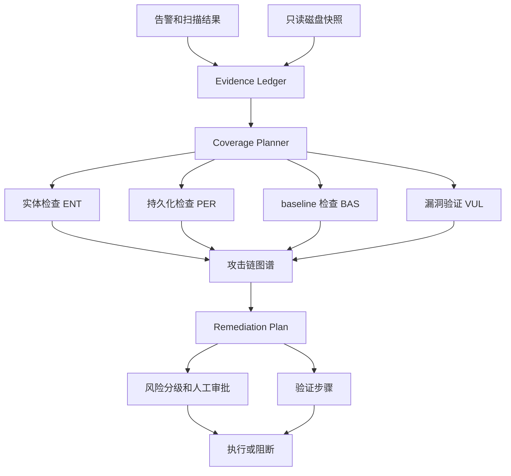

# SecRespond：把安全 Agent 从“看告警”推进到“查整机取证”

## 元信息

| 字段 | 内容 |
| --- | --- |
| 标题 | SecRespond: Benchmarking AI Agents for Real-World Post-Compromise Incident Response |
| 类型 | 论文 + benchmark |
| 作者 | Lehan Wang, Boli Chen, Ruixue Ding, Pengjun Xie, Jinwei Huang, Zhendong Liu, Shuo Wang, Tao Lei, Xin Ouyang, Xiaomeng Li |
| 机构 | Tongyi Lab, Alibaba Group；Alibaba Cloud Computing；HKUST |
| 发布 | arXiv v1，2026-07-29T11:32:23Z |
| 链接 | https://arxiv.org/abs/2607.26791 |
| 代码/数据 | https://github.com/Alibaba-NLP/qqr/tree/main/data/secrespond |
| 本文定位 | AI 安全 / AI for 安全；重点是 post-compromise incident response，而不是漏洞利用或告警问答 |

## TL;DR

1. **SecRespond 要测的是“入侵已经发生以后，Agent 能不能完成取证和响应”。** 输入不是干净靶场，而是一个被冻结的受害主机磁盘快照，加上安全产品导出的告警、漏洞扫描和 baseline 检查；输出必须包含 `progress.md`、`intrusion-report.md`、`vuln-report.md`、`baseline-report.md`、`remediation-plan.md` 五个文件。

2. **benchmark 的核心设计是把“告警可见痕迹”和“静默磁盘痕迹”混在一起。** 作者构造 10 个 cyber range，覆盖 4 类入口、21 个 MITRE ATT&CK 技术、5 个操作系统；每个 range 只有 30-40% 攻击动作会触发安全产品告警，剩余 60-70% 只留下文件、配置、持久化或日志残留。

3. **评价不是一个总分，而是 detection 与 planning 两条轴。** detection 满分 3 分，拆成发现、证据、归因；planning 满分 2 分，拆成修复正确性与修复完整性。280 个 checkpoint 又映射到 52 个 CAP 能力项，覆盖入侵实体、持久化机制、baseline 风险、漏洞风险、调查与响应质量。

4. **23 个前沿模型在同一个 OpenCode harness 下跑，结论很直接：会跟告警，但不会系统查完整机器。** 最强的 Claude Opus 4.7 在 range-level 平均 detection/planning 是 79.0%/65.7%，论文摘要里的综合均值约 72.4%；没有任何模型在任何一个 range 上完成完整检测和完整处置。

5. **最有价值的负结果是 remediation 比 detection 更差。** GPT-5.5 的 detection 是 70.7%，planning 只有 36.0%；所有模型都落在“检测高于处置”的区域。这说明现在的安全 Agent 往往能指出一个明显恶意进程或 CVE，却很少完成凭证轮换、出站封禁、持久化清理、业务健康验证等后续闭环。

6. **能力维度也不均衡。** 平均检测在 Intrusion Entity 上达到 75.4%，Persistence Mechanism 只有 58.8%；规划在 Baseline Risk 上最好，约 55.3%，而 Investigation & Response Quality 只有 31.8%。这意味着“找一个恶意文件”比“解释攻击链并写出可执行、可验证、低副作用的处置计划”容易得多。

7. **作者给了一个很重要的干预实验：加专家流程 Skill。** 这些 Skill 不含 range ground truth，只编码应急响应团队的通用流程、报告模板和修复模板。它能显著提高 planning，例如 GPT-5.4 在 SSH-Miner 上从 26% 升到 83%，但也会让 GLM-5.1 在 Shiro-Fastjson detection 上下降 12%，说明流程先验会减少漏修，也可能形成新的搜索边界。

8. **局限也清楚：评测依赖 LLM-as-a-Judge，range 数量只有 10，runner 依赖 OpenCode，数据是合成但基于真实主机分布校准。** 它不能证明 Agent 已经能替代 SOC/IR 分析师；更像是在证明“只靠模型能力和通用 agent harness，离生产级 incident response 还差一个系统调查与验证层”。

## 1. 这篇论文真正补的是哪个空白？

### 1.1 现有安全 benchmark 多数仍在“事前”或“局部文本”层

| 评测类型 | 常见输入 | 常见输出 | SecRespond 认为的问题 |
| --- | --- | --- | --- |
| CTF / exploit benchmark | 靶机、题目、flag | exploit 或 flag | 更接近进攻求解，不等于入侵后恢复业务 |
| 漏洞发现/修复 | repo、issue、CVE 描述 | patch 或报告 | 聚焦单个漏洞点，缺少整机攻击链 |
| SOC 告警问答 | 告警、日志片段、威胁情报 | 分类或解释 | 没有把模型放进受害主机磁盘里主动查证 |
| patch benchmark | 漏洞代码和测试 | 修复补丁 | 不要求发现残留、持久化、凭证泄漏与业务影响 |
| SecRespond | 冻结磁盘 + SAS 告警/漏洞/baseline | 取证报告 + 风险报告 + 修复计划 | 要求主动枚举、交叉关联、证据归因和修复闭环 |

### 1.2 post-compromise 的难点不是“有没有线索”，而是“线索不完整”

1. **告警只提供入口，不提供完整真相。**
   - 论文显式把告警覆盖控制在 30-40% 攻击动作。
   - 这迫使 Agent 不能只复述安全产品输出。
   - 一个合格响应者必须继续查磁盘、日志、配置、持久化点和业务痕迹。

2. **攻击痕迹跨文件、跨服务、跨时间线。**
   - 例如 npm-worm 需要把供应链入口、Node/Python 脚本、凭证残留、C2、挖矿行为串起来。
   - ASP.NET ViewState 场景需要把 IIS、MSSQL、WMI、webshell、配置备份合并成同一条攻击链。
   - RDP-Service-Abuse 场景则要把 Windows 登录事件、弱服务 DACL、SYSTEM payload、计划任务、credential dump 关联起来。

3. **处置计划必须考虑副作用。**
   - 论文的 Windows prompt 明确提醒：下游 remediation agent 会把计划当作授权指令。
   - 会断开控制面的命令不能直接写成“立即执行”的命令。
   - 删除证据、误封平台控制 key、停止关键服务，都应被风险标注或转为人工介入流程。

### 1.3 这改变了安全 Agent 评测的默认问题

| 旧问题 | SecRespond 重写后的问题 |
| --- | --- |
| 模型能不能读懂告警？ | 模型能不能从告警之外继续发现静默入侵？ |
| 模型能不能列出 CVE？ | 模型能不能验证这个 CVE 是否真的存在、是否被利用、是否与攻击链相关？ |
| 模型能不能生成修复建议？ | 模型能不能生成正确、完整、可验证、低副作用的修复计划？ |
| 模型能不能在一个任务上拿高分？ | 模型能不能在实体、持久化、baseline、漏洞、响应质量五个维度都稳定？ |

## 2. benchmark 怎么构造？

### 2.1 输入、输出和运行边界

| 组件 | 内容 | 设计意义 |
| --- | --- | --- |
| forensic disk snapshot | 受害主机被冻结后的只读文件系统 | 让 Agent 面对真实文件、配置、日志、残留，而不是摘要文本 |
| SAS alerts | 异常进程、网络连接、登录事件等告警 | 给出起点，但不保证覆盖完整攻击链 |
| SAS vulnerability scan | 软件包、组件、应用漏洞发现 | 让 Agent 区分“存在漏洞”和“被这次攻击利用” |
| SAS baseline check | SSH、DB、服务权限、容器配置等 baseline | 让 Agent 评估导致入侵或扩大影响的配置风险 |
| required reports | progress、intrusion、vuln、baseline、remediation | 把“分析过程”“证据链”“修复计划”拆开，防止一句话总结过关 |

### 2.2 10 个 range 覆盖的攻击面

| Range | 入口类型 | OS | 攻击链摘要 |
| --- | --- | --- | --- |
| SSH-Miner | baseline weakness | CentOS 7 | SSH 暴力破解，随后挖矿和 crontab/bashrc/systemd 持久化 |
| Shiro-Fastjson | known CVE | CentOS 8 | Shiro 默认 key + Fastjson 反序列化，webshell、提权、挖矿 |
| Log4j-RCE | known CVE | CentOS 8 | Log4Shell RCE，webshell 与多种持久化 |
| Docker-Escape | baseline weakness | Ubuntu 20.04 | 暴露 Docker API，容器逃逸，主机接管 |
| Redis-RCE | baseline weakness | Ubuntu 22.04 | 未授权 Redis 写入 SSH key，root 登录与挖矿 |
| Jenkins-RCE | business code | Ubuntu 22.04 | Jenkins Script Console 命令执行，挖矿、凭证窃取、持久化 |
| Next.js-RCE | known CVE | Ubuntu 22.04 | Next.js RCE，SUID 提权，`LD_PRELOAD` rootkit 风格行为 |
| NPM-Worm | supply chain | Ubuntu 22.04 | 恶意 npm package，蠕虫传播、凭证窃取、C2、挖矿 |
| ASP.NET-ViewState | known CVE | Windows Server | ViewState 反序列化 RCE，webshell、MSSQL 后门、WMI 持久化 |
| RDP-Service-Abuse | baseline weakness | Windows Server | RDP 弱口令喷洒，弱服务 DACL 滥用，SYSTEM payload、计划任务、凭证 dump |

### 2.3 构造流水线不是“手写题库”


### 2.4 三层设计对应三个证据约束

| 层 | 约束 | 作用 |
| --- | --- | --- |
| blueprint layer | 明确目标技术栈、攻击链、MITRE ATT&CK 技术、待覆盖能力项 | 保证场景不是随意拼接，而是服务于能力覆盖 |
| instance layer | 使用真实 CVE 或配置缺陷、真实网络协议攻击、自然产生的入侵痕迹 | 降低“合成文本题”的失真 |
| checklist layer | 每个 checkpoint 有通过标准、证据来源、CAP 映射 | 让开放式报告可以被细粒度打分 |

## 3. CAP taxonomy：作者如何把“应急响应能力”拆成可测对象？

### 3.1 五个维度

| 维度 | 含义 | 典型失败 |
| --- | --- | --- |
| ENT: Intrusion Entity | 恶意进程、恶意文件、被篡改文件、恶意 IP/域名等实体 | 只看到挖矿进程，漏掉残留数据或出站 C2 |
| PER: Persistence Mechanism | 重启后仍存活的后门、计划任务、服务、shell 初始化、WMI、loader hook | 清掉进程但漏掉 cron、systemd timer、WMI subscription |
| BAS: Baseline Risk | SSH、DB、中间件、凭证、服务权限、容器、云资源配置 | 写“加强权限”但不指出具体弱配置 |
| VUL: Vulnerability Risk | Java 组件、web 应用代码、容器逃逸、前端框架漏洞 | 把“有 CVE”误当成“本次攻击入口” |
| Q: Investigation & Response Quality | 入口定位、攻击链复原、攻击者信息、诚实校准、彻底性、跨服务追踪、验证完整性、业务影响 | 报告碎片化，缺少时间线、证据引用、修复验证 |

### 3.2 为什么 PER 和 Q 是最难的？

1. **PER 难在“没有活跃信号”。**
   - 持久化机制可以藏在 `authorized_keys`、`sudoers`、`profile.d`、`udev`、`ld.so.preload`、systemd、cron、WMI、DLL hijack 等位置。
   - 很多持久化没有当前进程、网络连接或显著告警。
   - 发现它需要系统枚举策略，而不是顺着一条告警路径搜索。

2. **Q 难在“报告必须像一次完整 IR”。**
   - 单点发现不等于攻击链复原。
   - 证据必须可追溯到具体路径、日志、配置、进程或网络实体。
   - 修复必须包含验证步骤、业务副作用和置信度边界。

3. **这两个维度最能区分“安全问答模型”和“安全执行 Agent”。**
   - 问答模型可以解释 CVE。
   - 执行 Agent 必须决定继续查哪里、停止哪里、如何避免破坏证据、如何交付可执行计划。

## 4. 评分公式：为什么 detection 与 planning 必须分开？

### 4.1 checkpoint 分数

```text
对每个 checkpoint c 和评分轴 a：

CHK-score^a_c = s^a_c / M^a

其中：
- a ∈ {det, plan}
- M_det = 3
- M_plan = 2
- s_det 拆成 discovery、evidence、attribution
- s_plan 拆成 correctness、completeness
```

### 4.2 capability 聚合

```text
对某个 CAP 能力项：

CAP-score^a = (1 / |C^a_CAP|) * Σ_{c ∈ C^a_CAP} CHK-score^a_c * 100%

解释：
- C^a_CAP 是映射到该能力项、且适用于评分轴 a 的 checkpoint 集合
- 不同 range 的 checkpoint 可以通过同一个 CAP 项聚合
- 这避免了只看总分时掩盖“会找实体但不会清持久化”的结构性差异
```

### 4.3 评分轴拆开的实际价值

| 情况 | Detection | Planning | 诊断含义 |
| --- | --- | --- | --- |
| 找到恶意文件，也给出隔离、备份、验证和业务恢复 | 高 | 高 | 接近完整 IR |
| 找到恶意文件，但只写“删除文件” | 高 | 低 | plan bottleneck |
| 没找到恶意文件，却建议升级组件 | 低 | 可能看似有动作 | blind fix，不可信 |
| 找到 CVE，但无法证明它被利用 | 中 | 中/低 | 证据与归因不足 |
| 找到告警实体，漏掉静默持久化 | 局部高 | 全局低 | 主动取证不足 |

## 5. 实验设置：同一 harness 下的 23 个模型

### 5.1 为什么统一用 OpenCode

1. **控制 agent scaffolding 变量。**
   - 所有模型使用同一个 OpenCode harness。
   - 输入、prompt、工具集保持一致。
   - 差异主要归因到模型能力，而不是不同 agent 框架。

2. **任务输出是文件，不是聊天回答。**
   - responder 必须写五个 Markdown 文件。
   - evaluator 在报告目录里读取这些文件。
   - 缺文件会在 runner 层被判为失败路径。

3. **这更接近真实 SOC 工作流。**
   - 分析过程要留 `progress.md`。
   - 结论要分 intrusion、vulnerability、baseline。
   - 修复计划是独立 artifact，可被后续自动化或人工流程消费。

### 5.2 LLM-as-a-Judge 的防偏设计

| 防偏措施 | 具体做法 | 仍然存在的边界 |
| --- | --- | --- |
| 多 judge | Claude Opus 4.7、Gemini 3.1 Pro、GPT-5.4 Pro 独立评分 | 三者仍可能共享“喜欢结构化长答案”的偏好 |
| checkpoint rubric | 每项按 discovery/evidence/attribution 和 correctness/completeness 打分 | rubric 质量决定评价上限 |
| 人类校验 | 抽 60 个 checkpoint、每项 10 条 trajectory 给安全专家打分 | 样本不是全部 280 checkpoint |
| 一致性报告 | judge 两两相同分数占 72-75%，Spearman ρ 为 0.86-0.87 | 相关性高不等于没有系统偏误 |
| 人类相关性 | Pearson 0.96，quadratic-weighted Cohen's κ 0.94，MAE 0.15 | 仍是 controlled benchmark，不是生产事件回放 |

## 6. 主结果：模型会发现明显问题，但不擅长完整处置

### 6.1 Range-level 排名给出的直接信号

| 模型 | Overall Detection | Overall Planning | 解读 |
| --- | ---: | ---: | --- |
| Claude Opus 4.7 | 79.0% | 65.7% | 最强整体结果，但仍没有完成任何 range 的完整检测与完整处置 |
| Claude Opus 4.6 | 78.2% | 58.0% | detection 接近 4.7，planning 明显更低 |
| GLM-5.1 | 76.3% | 59.2% | 开放/国产模型系列在此任务上非常有竞争力 |
| Qwen3.7 Plus | 75.6% | 58.8% | 实体检测强，规划比 detection 仍低很多 |
| GPT-5.5 | 70.7% | 36.0% | 典型 plan bottleneck，能发现但处置闭环差 |
| Gemini 3.1 Pro | 54.8% | 31.5% | detection 和 planning 都偏弱 |
| MiniMax M2.5 | 52.4% | 32.9% | 整体低位，说明任务不是简单上下文长度竞赛 |

### 6.2 “所有点都在 Detection > Planning”意味着什么？

1. **发现问题比修好问题容易。**
   - Agent 能从告警、进程、文件名、CVE 信息里找到一部分证据。
   - 但修复计划需要知道依赖、顺序、验证、回滚和副作用。

2. **最常见的失败不是“写了错误命令”，而是“只写了第一步”。**
   - 例如杀掉挖矿进程，却不轮换泄漏凭证。
   - 删除 webshell，却不检查 loader hook、systemd、cron、WMI 或服务权限。
   - 升级组件，却不验证业务服务是否恢复。

3. **这对自动化修复特别关键。**
   - 若 remediation-plan 会被下游 Agent 执行，不完整计划会制造“看似已修复”的假阴性。
   - 因此安全 Agent 的输出必须带 verification checklist，而不是只给 cleanup 命令。

### 6.3 Range 难度与攻击链复杂度相关

| 难度层 | 代表 range | 为什么相对容易/困难 |
| --- | --- | --- |
| 较易 | Log4j-RCE、Docker-Escape、Redis-RCE | 单入口、攻击链线性、常见持久化更容易被告警或惯例检查触达 |
| 中等 | SSH-Miner、Next.js-RCE、Jenkins-RCE | 有更宽 host baseline、多步提权、跨服务关联和多样持久化 |
| 较难 | Shiro-Fastjson、RDP-Service-Abuse、NPM-Worm、ASP.NET-ViewState | 攻击面宽，跨 runtime / 跨服务，持久化被伪装，证据更分散 |

## 7. CAP-level 结果：不是一个模型强就全维度强

### 7.1 平均趋势

| 能力维度 | 论文中的关键观察 | 机制解释 |
| --- | --- | --- |
| ENT detection | 平均约 75.4%，多数模型超过 70% | 恶意实体往往是具体对象，容易从告警或常规检查进入 |
| PER detection | 平均约 58.8%，是检测短板 | 持久化位置分散，很多没有活跃信号，需要全机枚举 |
| BAS planning | planning 里相对最好，约 55.3% | baseline 修复更标准化，例如关暴露服务、改权限、换默认凭证 |
| Q planning | 约 31.8%，最弱之一 | 完整 IR 需要攻击链、置信度、验证、业务影响，不是单点修复 |

### 7.2 单维度最强模型不同

| 维度 | 论文报告的强模型 | 说明 |
| --- | --- | --- |
| ENT detection | Qwen3.7 Plus，88.4% | 找实体强不代表修复强 |
| PER detection | Qwen3.7 Max，79.0% | 更擅长发现持久化，但 planning 仍不是全维最强 |
| BAS detection | Claude Sonnet 4.6，84.2% | baseline 风险识别与实体取证是不同能力 |
| VUL detection | DeepSeek V4 Pro，86.7% | 漏洞验证能力不等于完整 incident response |
| Q detection | GLM-5.1，75.5% | 调查质量维度更接近“写出完整证据链” |

### 7.3 Agent 与传统 agentless scanner 的对照

| 方法 | ENT | PER | BAS | VUL | 解释 |
| --- | ---: | ---: | ---: | ---: | --- |
| agentless scanner detection | 43.6% | 2.1% | 20.7% | 50.0% | 静态规则能扫样本和 CVE，但几乎不能复原隐藏持久化 |
| LLM Agent detection | 多数 ENT > 70% | 强模型 PER 可到 60-79% | 强模型 BAS 可到 80% 左右 | 强模型 VUL 可到 80% 左右 | Agent 能主动读文件、联结证据，但仍缺系统性 |

### 7.4 对 AI for 安全的直接启发

1. **不要只买“会读告警”的能力。**
   - 如果 deployment 目标是 incident response，必须测静默持久化发现、攻击链复原和修复验证。

2. **不要只看 overall。**
   - 一个模型可能 VUL 强但 Q 弱。
   - SOC 编排应按能力分工，而不是假设一个模型统包所有阶段。

3. **Agent scaffold 要显式管理调查覆盖率。**
   - 需要 checklist-driven enumeration。
   - 需要 evidence ledger。
   - 需要未查区域和置信度边界。

## 8. Procedural Skill 实验：流程先验有用，但不是银弹

### 8.1 Skill 注入了什么？

| 注入内容 | 不注入内容 |
| --- | --- |
| 安全响应团队通用调查路线 | 每个 range 的 ground truth |
| 报告组织模板 | 恶意文件具体路径 |
| 修复计划模板 | 预期 CVE 列表 |
| 如何分层检查威胁、baseline、漏洞、持久化 | checklist 里的答案 |

### 8.2 为什么 planning 提升更明显？

1. **规划本身更依赖流程。**
   - 修复计划需要优先级、风险分类、验证步骤、业务影响。
   - 这些内容不是每次都由模型临场推理生成；模板能补足结构。

2. **模型低分常来自“漏写后半段”。**
   - 流程 Skill 会提醒凭证轮换、持久化清理、封禁、服务验证。
   - 所以 GPT-5.4 在 SSH-Miner 从 26% planning 升到 83% 并不意外。

3. **但流程会带来边界效应。**
   - GLM-5.1 在 Shiro-Fastjson detection 降 12%，Docker-Escape 降 11%。
   - 论文解释为 broad-scope range 有超出 Skill 枚举类别的长尾痕迹，模型可能在流程边界处停止搜索。

### 8.3 一个更稳的系统设计方向



### 8.4 伪代码：一个更接近 SecRespond 精神的 responder

```text
Input:
  disk_snapshot, sas_alerts, sas_vulns, sas_baselines

State:
  evidence_ledger = []
  unchecked_surfaces = [process, network, accounts, cron, systemd, shell_init,
                        webshell, db_backdoor, container, windows_service,
                        scheduled_task, wmi, credential_residue]
  attack_graph = empty graph
  remediation_plan = []

Loop:
  1. seed evidence from sas_alerts / sas_vulns / sas_baselines
  2. for each surface in unchecked_surfaces:
       run read-only forensic checks
       record concrete path/log/config evidence
       mark checked or blocked with reason
  3. link evidence into hypotheses:
       entry point -> execution -> privilege escalation -> persistence -> impact
  4. for each hypothesis:
       require at least one concrete artifact
       assign confidence and missing-evidence boundary
  5. for each confirmed issue:
       propose remediation item
       attach risk_class, approval level, verification command, rollback note
  6. stop only when:
       mandatory surfaces checked or explicitly bounded
       all confirmed persistence has cleanup path
       all credentials / services / network side effects addressed

Output:
  progress.md, intrusion-report.md, vuln-report.md,
  baseline-report.md, remediation-plan.md

Failure boundary:
  If evidence is missing, say unknown.
  If action may sever access or destroy evidence, require manual approval.
```

## 9. 图表证据怎么读？

### 9.1 Figure 1：任务不是“读告警”，是“闭环响应”

1. **图里同时出现 cyber range、forensic snapshot、security analytics、capability taxonomy、checkpoint rubric。**
2. **这说明 benchmark 的单位不是单条 alert，而是一个可复原的主机事件。**
3. **Agent 输出也不是分类标签，而是多文件响应包。**

### 9.2 Figure 2：12 阶段构造流水线解释了数据可信度

1. **攻击前快照和攻击后快照分开。**
   - 这让作者能确认哪些痕迹来自攻击。
2. **攻击通过真实网络协议执行。**
   - 不是把恶意文件直接放进磁盘。
3. **human experts 介入 blueprint、脚本真实性、告警覆盖和最终 range 完整性。**
   - 这降低了 benchmark 退化为自动生成玩具题的风险。

### 9.3 Table 4：range-level 结果说明“无完整胜利”

| 证据点 | 支持的判断 |
| --- | --- |
| Claude Opus 4.7 overall 79.0%/65.7% | 最强模型也离完整响应有距离 |
| GPT-5.5 70.7%/36.0% | detection 与 planning 可以严重脱钩 |
| Log4j-RCE 相对容易 | 知名 CVE + 线性攻击链更符合模型先验 |
| Shiro-Fastjson、NPM-Worm、ASP.NET、RDP 更难 | 跨服务、跨 runtime、伪装持久化会放大 Agent 的搜索盲区 |

### 9.4 Table 5 / Figure 4：能力不是单峰排名

1. **Qwen3.7 Plus 在 ENT detection 最强。**
2. **Qwen3.7 Max 在 PER detection 最强。**
3. **Claude Sonnet 4.6 在 BAS detection 最强。**
4. **DeepSeek V4 Pro 在 VUL detection 最强。**
5. **GLM-5.1 在 Q detection 最强。**
6. **因此真实部署不应只问“哪个模型最好”，而要问“这个阶段要什么能力”。**

### 9.5 Figure 7：judge 可信，但不能无限外推

| 指标 | 数字 | 解读 |
| --- | ---: | --- |
| judge 两两同分比例 | 72-75% | rubric 解释相对稳定 |
| Spearman ρ | 0.86-0.87 | 排名高度相关 |
| 人类专家 Pearson | 0.96 | 与人工评分强相关 |
| Cohen's κ | 0.94 | 加权一致性高 |
| MAE | 0.15 | 平均偏差很小 |

## 10. 和相关工作的关系

### 10.1 与 CVE/CTF 类 benchmark 的关系

| 工作类型 | SecRespond 的差异 |
| --- | --- |
| CTF / CyBench / NYU CTF Bench | 那些任务强调解题、利用或 flag；SecRespond 强调已入侵主机的取证和恢复 |
| CVE-Bench / CyberGym | 那些任务更偏漏洞发现与利用；SecRespond 要同时处理漏洞、baseline、持久化和业务影响 |
| AutoPatchBench | patch 是必要子任务；SecRespond 的修复计划还要覆盖凭证、进程、网络、服务、证据保全 |
| CyberSOCEval / ExCyTIn-Bench | 那些更接近 SOC 文本/日志推理；SecRespond 把 disk snapshot 作为一等输入 |

### 10.2 与 Agent 安全研究的关系

1. **它不是在研究 prompt injection。**
   - 重点不是攻击 Agent，而是评估 Agent 能否帮防守方响应入侵。

2. **它补上了 AI for Security 的“后半场”。**
   - 很多安全 Agent 评测强调发现漏洞或生成 exploit。
   - SecRespond 要求恢复业务、清理攻击面和解释证据链。

3. **它也暴露了安全 Agent 自身的治理需求。**
   - remediation plan 可能被自动执行。
   - 所以 Agent 需要权限边界、审批等级、证据保全和回滚策略。

## 11. 可复现性与工程落点

### 11.1 项目包结构

| 路径 | 作用 |
| --- | --- |
| `task-prompts/linux.md` / `windows.md` | 平台特定 responder prompt |
| `evaluation/SKILL.md` | checkpoint 评分规则 |
| `evaluation/prompt.md` | evaluator prompt 模板 |
| `ranges/<range>/checklist.md` | 权威中文评分 checklist |
| `ranges/<range>/checklist.en.md` | 英文对齐版 checklist |
| `ranges/<range>/sas-mock/` | 告警、漏洞、baseline 的静态安全产品输出 |
| `ranges/<range>/disk.tar.gz` | Hugging Face 完整数据集中每个 range 的压缩磁盘 |
| `disk.tar.gz.sha256` | 单 range 磁盘完整性校验 |

### 11.2 runner contract

1. **GitHub 轻量树不包含完整磁盘。**
   - README 明确说 `disk.tar.gz`、checksum 和展开后的 `disk/` 不在 GitHub 树里。
   - 完整数据集需要从 Hugging Face 或 ModelScope 获取。

2. **每个 range 需要单独校验磁盘包。**
   - README 要求在 range 目录下跑 `sha256sum -c disk.tar.gz.sha256` 后再解压。
   - 单一聚合 archive 不能替代每个 range 的磁盘包契约。

3. **runner 只渲染 prompt，不隐式发现 Skill。**
   - `run_task.sh` 选择 Linux 或 Windows prompt。
   - `run_evaluation.sh` 显式传入 checklist、reports、evaluation Skill、output。
   - 这有助于避免“评测时加载了不该加载的上下文”。

### 11.3 复现实验还缺哪些成本说明？

| 成本项 | 论文/README 已说明 | 仍需读者自己补齐 |
| --- | --- | --- |
| 模型 token 与费用 | Appendix D.3 给出每模型平均 steps、input、output、cost | 具体 provider 价格、地区、限速、失败重试 |
| runner 依赖 | 需要 OpenCode | OpenCode 配置、API key、模型可用性 |
| 数据大小 | 每 range 有磁盘 archive | 下载时间、存储、解压隔离 |
| 安全隔离 | disk 是只读 forensic workspace | 本地执行分析命令时的沙箱策略 |

## 12. 研究者视角的核心判断

### 12.1 这篇论文最强的 claim

1. **Claim:** 真实 incident response Agent 不能只按告警反应。
2. **Mechanism:** 入侵后主机包含大量静默持久化、残留文件、配置变更和跨服务线索。
3. **Evidence:** SecRespond 让 60-70% 攻击动作只留下静默痕迹；23 个模型都不能在任一 range 上完成完整检测和完整处置。
4. **Boundary:** 10 个 range 是专家构造的合成受害环境，虽然参考 372 台真实 compromised cloud host 分布，但不是公开生产事故原样回放。

### 12.2 最值得带走的机制判断

| 判断 | 为什么重要 |
| --- | --- |
| detection 与 planning 必须分开报 | 发现能力强会掩盖修复闭环差 |
| CAP taxonomy 比 overall 更有用 | 部署时要知道模型到底弱在持久化、baseline、漏洞还是响应质量 |
| alert-visible 与 silent artifact 的比例很关键 | 如果全靠告警，benchmark 会奖励浅层复述 |
| 流程 Skill 能补 planning，但会制造搜索边界 | 安全 Agent 不能只靠固定 checklist，需要 coverage-aware planning |
| remediation plan 是授权面 | 写一个危险命令可能比漏报还糟 |

### 12.3 对下一代安全 Agent 的要求

1. **Evidence-first state。**
   - 每个结论必须指向路径、日志、配置、进程、网络实体或扫描项。
   - 未验证项不能进入高置信度结论。

2. **Coverage-aware search。**
   - Agent 要显式维护“已查/未查/阻塞”的攻击面。
   - 对 cron、systemd、WMI、服务权限、shell init、loader hook、凭证残留等位置要有可审计覆盖。

3. **Plan with authority boundaries。**
   - 修复计划应区分自动执行、需要审批、禁止自动执行。
   - 对会断链、毁证、影响业务的数据/账户/网络动作必须升级人工流程。

4. **Outcome learning，而不是固定流程复读。**
   - Procedural Skill 已经证明流程有帮助。
   - 但要补长尾，就需要从调查结果动态扩展搜索，而不是停在预设 checklist。

## 13. 局限与反例

### 13.1 benchmark 层面的局限

| 局限 | 影响 |
| --- | --- |
| 只有 10 个 range | 不能覆盖所有云、Kubernetes、SaaS、EDR 绕过、身份系统事故 |
| 合成但真实感校准 | 可控性强，但与真实企业环境的噪声、历史包袱、跨团队权限不同 |
| 依赖 OpenCode harness | 结果同时反映模型与该 harness 的交互方式 |
| LLM-as-a-Judge | 虽然有多 judge 和人工抽检，仍可能偏好结构化表达 |
| 数据发布依赖大磁盘包 | 复现门槛高于纯文本 benchmark |

### 13.2 模型结论不能过度外推

1. **不能说“某模型生产上一定最强”。**
   - 实验固定在 OpenCode、固定 prompt、固定工具集。
   - 换成专用 forensic tool、SIEM、EDR API、企业资产图，模型排序可能改变。

2. **不能说“开放模型一定强于闭源模型”。**
   - 论文只说明在这个 benchmark 和这些版本上，GLM、DeepSeek、Qwen 系列表现有竞争力。
   - 不同安全任务、语言环境、工具权限下可能不同。

3. **不能说“加 Skill 就解决了”。**
   - Skill 提升 planning，却也在部分 range 降低 detection。
   - 固定流程不是动态调查策略的替代。

## 14. 继续追问

### 14.1 如果把 SecRespond 变成生产系统验收门槛，还缺什么？

1. **真实 EDR/SIEM API。**
   - 当前输入是静态 SAS mock 和磁盘。
   - 生产系统需要接实时查询、资产上下文、身份日志、网络流量和 ticket 历史。

2. **权限化 remediation。**
   - 计划生成与计划执行必须分权。
   - 高风险动作要用 policy engine 和 human approval，而不是让语言模型直接下命令。

3. **反事实验证。**
   - 修复计划不只要“看起来对”。
   - 应该能在 clone/sandbox 上演练，验证服务可用、持久化消失、凭证轮换完成。

4. **对抗输入。**
   - 真实攻击者会污染日志、伪装文件、投放 prompt injection 到 README、shell history 或 ticket。
   - SecRespond 主要测 post-compromise 取证能力，下一步应测 compromised evidence 下的抗欺骗能力。

### 14.2 对 Agent 安全架构的启发

| 层 | 设计建议 |
| --- | --- |
| memory | 只写入带 provenance 的证据，区分事实、推断、待验证假设 |
| tools | 取证工具默认只读，写操作走审批 |
| state | 维护 coverage、confidence、blocked reason、business impact |
| planner | 按 CAP taxonomy 规划，而不是按告警列表规划 |
| executor | remediation plan 只是一份提案；执行前要做 policy check |
| evaluator | detection 与 planning 分开回归，避免单一成功率掩盖风险 |

## 结论

1. **SecRespond 的贡献不是又造了一个安全榜单，而是把安全 Agent 从“告警解释”推到“入侵后主机取证 + 处置计划”。**
2. **它的负结果比排名更重要：所有模型都表现出 detection > planning，且没有模型完成任一 range 的完整检测与完整处置。**
3. **对 AI for 安全部署来说，真正的 gating 指标应包括静默持久化发现、证据归因、处置完整性、验证步骤和业务副作用。**
4. **对 Agent 研究来说，这篇论文支持一个更强命题：安全 Agent 的能力上限不只由模型决定，还由调查状态、覆盖率控制、权限边界和执行验证共同决定。**
