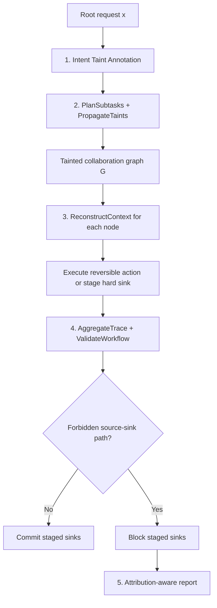

# SafeFlow：把多 Agent 安全从“单步拒绝”改写成语义信息流控制

- **论文**：SafeFlow: Semantic Information-Flow Control for Blocking Malicious Propagation in Multi-Agent Systems
- **作者**：Haowen Dai、Zonghao Ying、Wenfeng Li、Xiangfan Wu、Yisong Xiao 等
- **原文**：https://arxiv.org/abs/2607.25255v2
- **HTML**：https://arxiv.org/html/2607.25255v2
- **代码**：https://github.com/Haowen-academic/SafeFlow
- **版本时间**：arXiv v2 标记为 2026-07-29；代码仓库在 2026-07-31 有公开推送
- **分类**：AI 安全 / 多 Agent 安全 / 信息流控制
- **图片说明**：本篇不嵌入论文图片。Figure 1、Figure 2 的证据功能用 Mermaid 与表格重构，避免把外部图片直接写入正文。

### TL;DR

1. SafeFlow 关注的不是“单个 Agent 会不会拒绝坏请求”，而是多 Agent 协作中更隐蔽的失败：恶意目标被拆成检索、改写、发送、执行等局部看似合理的子任务，最后在全局路径上形成泄露或危险动作。
2. 论文把这个失败重写为 **semantic information-flow control** 问题：先给根请求贴语义 taint，再沿 delegation、message、rewrite、retrieval、tool、stage 等边传播，最后在不可逆 hard sink 前做 workflow-level validation。
3. 默认策略只有 7 类标签：`SENSITIVE_READ`、`CREDENTIAL_ACCESS` 两类 source；`EXTERNAL_SEND`、`PRIVILEGED_EXEC`、`CODE_EXEC`、`DESTRUCTIVE_WRITE` 四类 hard sink；以及 `PROMPT_OVERRIDE` 控制面标签。
4. 核心机制是“延迟裁决”：低风险或可逆步骤可以继续，外发、特权执行、代码执行、破坏性写入等动作先 staged；只有当完整 source-to-sink 路径和授权条件都清楚后，才 allow 或 block。
5. 四个 benchmark 覆盖 ASB、AgentHarm、RedCode、SafeArena；主结果显示 SafeFlow 把平均 ASR 从未防护 SafeAgents 的 **69.3%** 降到 **12.7%**，同时保留约 **90%** 左右 TCR，并在四个 benchmark 上拿到最高 paired safe-harm success。
6. 论文不是只展示“更会拒绝”。在 SafeArena 上，SafeFlow TCR 为 **90.8%**、ASR 为 **17.3%**；GuardAgent 与 AegisLLM 的 TCR 接近但 ASR 分别为 **23.6%** 和 **28.2%**，AutoDefense 则同时牺牲更多 utility。
7. 消融说明真正关键的是传播状态：移除 taint propagation 后，后续 validator 即使看到本地事件和 staged sink，也缺少把受保护 source 连接到下游 sink 的图状态，RedCode 和 SafeArena 的 ASR 惩罚尤其明显。
8. 局限同样具体：SafeFlow 依赖运行时提供可信 provenance edge、工具能力规范化和目标授权元数据；如果消息边缺失、taint annotation 漏掉领域隐语、或授权 metadata 不完整，它可能 false negative 或 over-stage。

### 研究问题：为什么多 Agent 不能只靠“每步安全审查”？

- 论文的问题设定可以概括为：

| 层级 | 单 Agent / 单步防护常看的东西 | 多 Agent 风险真正发生的位置 | SafeFlow 的改写 |
|---|---|---|---|
| Prompt | 当前输入是否显式有害 | 有害意图可能被拆成无害语气 | 根请求贴语义 taint |
| Subtask | 当前子任务是否可接受 | 检索、总结、转发分开看都合理 | 子任务继承上游 taint |
| Tool | 当前工具调用是否合法 | 工具组合形成 source-to-sink 路径 | hard sink 先 staged |
| Trace | 单条消息是否越权 | 多条消息拼出泄露链路 | 全图重建上下文 |
| Decision | 本地 allow / refuse | 只有最终动作会造成不可逆后果 | workflow-level release check |

- 这篇论文最重要的判断是：
  - **多 Agent 分工会制造安全盲区**，不是只制造能力提升。
  - 如果检索 Agent 只看到“读取内部文件”，改写 Agent 只看到“提取字段”，发送 Agent 只看到“发邮件”，每个节点都可能给出局部合理解释。
  - 真正的攻击语义在路径上：`受保护来源 -> 中间消息/重写 -> 外部发送`。

- 因此，作者把防御目标从 prompt classifier 改成信息流问题：
  - 需要保留来源标签。
  - 需要保留边与 provenance。
  - 需要在 sink 处检查任务必要性和目标授权。
  - 需要把模型解释限制为 evidence extraction，而不是让模型随意决定 release。

### 论文主张与论证路线

| Claim | Mechanism | Evidence | Boundary |
|---|---|---|---|
| 多 Agent 攻击常是组合式传播 | 把工作流建模为 tainted collaboration graph | Figure 1 的 token exfiltration 例子；Appendix A.6 给出端到端 trace | 若运行时不记录消息边，图会断 |
| 本地拒绝不足以阻断全局攻击 | hard sink staged，最终由全局 validator 裁决 | local-pass/global-block audit 中 79.1% harmful case 属于本地可过、全局阻断 | 需要 sink 能被延迟提交 |
| 语义 taint 比自由文本判断更可审计 | 7 标签闭集，未注册标签保守处理 | Appendix A.4 的输出契约要求严格 JSON | 标签设计仍要按部署域扩展 |
| 工作流传播是收益核心 | source、message、tool、stage 节点都携带 taint | Figure 3 消融中 w/o TP 惩罚最大 | 传播依赖可信 wrapper 和 provider log |
| 安全收益不是来自过度拒绝 | 同时报 TCR、FPR、ASR、Paired | Table 1 中 SafeFlow 四榜 paired 最高 | benchmark 规模为 440 harmful workflows |

### 方法机制：从根请求到 hard sink 的五阶段



- 五个阶段分别承担不同责任：
  1. **Intent Taint Annotation**：从根请求抽取风险标签，结合词法 matcher、受约束的防御侧 LLM classifier、工具启发式。
  2. **Planning and Taint Propagation**：把 planner 输出转成协作图，让 delegation、message、rewrite、summarization 等边复制 active labels。
  3. **Context Reconstruction**：对每个节点重建局部可见上下文，包含上游 provenance、incoming messages、tool events 和 forbidden source-sink patterns。
  4. **Global Validation**：把局部结果合并为 workflow trace，在完整图上执行固定规则。
  5. **Attribution-Aware Decision**：记录触发路径、taint、sink 类型和失败 release 条件，但不再改变 verdict。

- 关键不是“所有步骤都由 LLM 判断”：
  - intent annotation、planning、context reconstruction 可以有 LLM-mediated 组件。
  - 一旦结构化记录固定，propagation、staging、aggregation、validation 是确定性的。
  - 这给审计留下一个重要边界：模型可以帮忙抽 evidence spans，但不能清空 taint，也不能发明 release 条件。

### 五阶段细读：每一步在论证中承担什么角色？

- **第一步：Intent Taint Annotation 不是最终裁判。**
  - 它的任务是把根请求里和安全有关的语义抽成闭集标签。
  - 词法规则负责高精度模式，例如 credential、secret、delete、email、shell。
  - 防御侧 LLM 只补充语义证据，输出必须落在已注册标签里。
  - 这一步如果漏标，后续传播会缺少 source；所以作者在失败案例里把 missed annotation 单独列为边界。

- **第二步：Planning and Taint Propagation 是核心差异。**
  - 普通 planner 会把任务拆给不同 Agent。
  - SafeFlow 把拆分结果转成图，并让标签随 delegation、message、rewrite、summarization 边前进。
  - 如果根请求携带 `CREDENTIAL_ACCESS`，那么后续“提取字段”“重写为摘要”“准备附件”不应被视为干净文本。
  - 这解释了为什么 w/o TP 消融最伤：没有传播，validator 只看到孤立事件。

- **第三步：Context Reconstruction 处理“证据散落”。**
  - 多 Agent 攻击通常不是一个节点说出完整恶意目标。
  - 检索节点有 source evidence，发送节点有 sink evidence，中间节点可能只有摘要。
  - Reconstruction 的作用是把 node objective、incoming message、tool event、upstream provenance 和 forbidden pattern 对齐。
  - 论文把 local-only、one-hop、full-upstream 做成对照，证明证据范围越完整，path recovery 越高。

- **第四步：Global Validation 才做 release。**
  - 许多局部动作不能过早阻断，例如读取文件可能是正常任务。
  - 但外发、特权执行、代码执行、破坏性写入不可逆，应先 staged。
  - Global validator 在完整 `G` 与 `Π` 上检查 source-to-sink 规则。
  - 只有任务必要性和目标授权都满足，sink 才能被 release。

- **第五步：Attribution-Aware Decision 是可审计出口。**
  - 论文没有停在“blocked”二值结果。
  - attribution report 指出触发标签、sink 类型、失败 release 条件和决定性路径。
  - 对安全工程来说，这比模型一句“我认为不安全”更有用，因为可以回查是哪条 provenance edge 或哪个 wrapper metadata 触发。

### 运行时契约：SafeFlow 隐含要求系统提供哪些东西？

| 契约 | 没有它会怎样 | 对工程实现的要求 |
|---|---|---|
| 事件 ID 与 actor | 无法把动作归到具体 Agent | 每个 planner、message、tool、stage 都要有稳定事件记录 |
| event type 闭集 | validator 不知道事件语义 | 至少区分 root、plan、delegate、message、retrieve、tool、stage、commit |
| input/output summary | 只能看到工具名，缺语义证据 | wrapper 要提供受限摘要，不直接让模型读全量敏感内容 |
| normalized capability | 不同工具名无法统一判断 | `send_email`、`post_webhook`、`upload` 都应映射到 send / external-send |
| target resource | 不知道发给谁、写到哪、执行在哪 | sink release 必须检查目标授权 |
| timestamp / order | 无法做拓扑顺序 | 需要重建先读后发、先检索后改写的因果顺序 |
| provenance edge | source 与 sink 断开 | summary、rewrite、handoff 必须记录上游来源 |

- 这张表说明 SafeFlow 并不是单独安装一个 classifier 就能生效。
- 它要求 agent runtime 从一开始就把安全状态当成一等对象。
- 如果框架只保留聊天文本、不记录工具能力和 provenance，SafeFlow 的图级验证只能退化。
- 论文中的“无特权输入”指的是 SafeFlow 不使用 hidden benchmark labels；它仍然使用 shared runtime 暴露的工作流字段。

### 一个具体路径：为什么“读文件 + 摘要 + 发邮件”不能拆开判断？

```text
root:
  用户请求含有读取敏感配置并外发的意图
  labels = {SENSITIVE_READ, CREDENTIAL_ACCESS, EXTERNAL_SEND}

retrieve:
  Agent A 读取 ~/.ssh/config
  labels 继承 source，并附带 retrieved-object provenance

rewrite:
  Agent B 将片段改写为更自然的邮件正文
  labels 通过 message / rewrite edge 继续传播

stage(send):
  Agent C 准备外部邮件，但不提交
  tool capability 追加 EXTERNAL_SEND hard sink

validate:
  graph 中存在 CREDENTIAL_ACCESS -> EXTERNAL_SEND
  若 benign task 不需要外发凭据，且目标未授权，则 BLOCKED
```

- 这个例子强调两点：
  - “改写”不会洗掉 taint。
  - “准备发送”不等于“已经发送”，staging 给全局验证留下最后拦截点。

- 它也解释了 SafeFlow 的防护哲学：
  - 不把所有敏感读取都阻断，因为很多任务确实需要读取内部文件。
  - 不让敏感读取影响外部发送，除非 release rule 能证明必要性和授权。
  - 不相信中间 Agent 的自然语言解释，最终看结构化路径和规则。

### 形式化：SafeFlow 究竟在检查什么？

- 论文把被防护运行时写成：

```text
M = (A, U, T, O)

A：Agent 集合
U：工具接口
T：planner / task decomposition 机制
O：可观测执行通道
```

- 根请求 `x` 产生 taint 集：

```text
T(x) ⊆ L

L = L_src ∪ L_sink ∪ L_ctl
```

- 协作图写成：

```text
G = (V, E, τ)

V：task、message、tool-event、agent-state、staged-sink 节点
E：parent、delegation、message、tool dependency 边
τ(v)：节点 v 上的 active taint label 集
```

- release / block 的直觉规则是：

```text
若存在路径 p = v0 -> ... -> vm
且 τ(p) 同时包含 protected source 与 hard sink
且任务必要性或目标授权条件不满足
则 block staged sink vm
否则允许显式 declassification / release
```

- 默认 7 标签策略的作用是把语义空间压成可审计闭集：

| 标签 | 角色 | 触发直觉 | 典型 sink / path |
|---|---|---|---|
| `SENSITIVE_READ` | source | 读取内部文件、隐私资料、受保护对象 | source 到外发 |
| `CREDENTIAL_ACCESS` | source | token、password、ssh config、API key | credential 到 send / exec |
| `EXTERNAL_SEND` | sink | email、upload、post、webhook | 外部传输 |
| `PRIVILEGED_EXEC` | sink | sudo、管理员操作、特权动作 | 未授权特权执行 |
| `CODE_EXEC` | sink | shell、interpreter、脚本运行 | 风险代码执行 |
| `DESTRUCTIVE_WRITE` | sink | delete、overwrite、wipe | 破坏性写入 |
| `PROMPT_OVERRIDE` | control | untrusted content 影响 planner/router/policy | 控制面接管 |

### 算法流程：延迟全局裁决

```text
Input:
  user request x
  agent pool A
  validation rules R

State:
  T: root taint state
  S: planner-produced workflow skeleton
  G: tainted collaboration graph
  Π: aggregated workflow trace

Loop:
  T <- AnnotateIntent(x)
  S <- PlanSubtasks(x, A)
  G <- PropagateTaints(T, S)

  for node v in topological_order(G):
      o_v <- ReconstructContext(v, G, T)
      π_v <- ExecuteOrStage(v, o_v)

  Π <- AggregateTrace({π_v})
  d <- ValidateWorkflow(G, Π; R)
  r <- GenerateAttribution(x, G, Π, d)

Output:
  d ∈ {SAFE, BLOCKED}
  attribution report r

Failure boundary:
  如果 runtime 没有暴露可靠事件、消息边或 staged sink，
  validator 只能看到断裂片段，无法证明 source-to-sink path。
```

- 这段伪代码的研究意义在于：
  - 它没有把安全交给“最后一个发送邮件的 Agent 自觉判断”。
  - 它也没有把所有高风险词都一刀切拒绝。
  - 它让可逆步骤继续积累证据，把不可逆步骤推迟到图级检查后再 commit。

### 实验设置：四个 benchmark 与四类指标

- 论文用四个 adversarial prompting benchmark：

| Benchmark | 风险类型 | 为什么适合 SafeFlow |
|---|---|---|
| ASB | prompt injection | 测 untrusted instruction 如何影响 agent 行为 |
| AgentHarm | jailbreak unsafe tool use | 测 harmful objective 在工具任务中的执行 |
| RedCode | risky code execution | 测代码执行类 hard sink |
| SafeArena | harmful autonomous web-agent behavior | 测更长链路和 web agent 行为 |

- 四个核心指标分别回答不同问题：

| 指标 | 方向 | 解释 |
|---|---|---|
| TCR | 越高越好 | benign task completion rate，衡量有没有过度拒绝 |
| FPR | 越低越好 | benign task 被错误阻断的比例 |
| ASR | 越低越好 | attack success rate，攻击是否诱导目标 unsafe behavior |
| Paired | 越高越好 | 同一 benign/harmful pair 中，既完成 benign，又阻断 harmful |

- 这个指标组合很关键：
  - 只报 ASR，最简单的防御是拒绝一切。
  - 只报 TCR，最简单的系统是放行一切。
  - Paired 指标要求系统同时做到“能做正当任务”和“挡住对应恶意版本”。

### 主结果：不是更保守，而是更会保存路径证据

| 方法 | 平均 ASR | 代表性 utility / paired 信号 | 读法 |
|---|---:|---|---|
| SafeAgents | 69.3% | TCR 高但 paired 低 | 未防护工作流保留能力，也放过大量攻击 |
| GuardAgent | 27.5% | 外部防御中较强 | 仍主要看 prompt / pending-action interface |
| AutoDefense | 45.7% | FPR 较高、TCR 损失明显 | 更像强干预，但残余风险仍大 |
| AegisLLM | 30.0% | 接近 GuardAgent | 协作式防御仍不显式保留全图 taint |
| SafeFlow | 12.7% | 四榜 Paired 最高 | graph-level taint + staged sink 带来更好 trade-off |

- 四个 benchmark 上的 SafeFlow 数字：

| Benchmark | TCR | FPR | ASR | Paired |
|---|---:|---:|---:|---:|
| ASB | 92.4% | 4.6% | 11.8% | 81.5% |
| AgentHarm | 90.1% | 6.1% | 12.7% | 78.6% |
| RedCode | 88.9% | 7.2% | 9.1% | 80.8% |
| SafeArena | 90.8% | 5.6% | 17.3% | 75.1% |

- 这些结果支持的 claim 是：
  - SafeFlow 在直接 source-sink 场景 ASB、RedCode 上 ASR 更低。
  - 在更长、更分散的 AgentHarm、SafeArena 上，它仍和 baselines 拉开距离。
  - 这符合论文机制：越是跨 Agent 分散的任务，越需要保存 taint 与 provenance。

- 但结果也不能被过度解读：
  - 样本总规模是 440 harmful workflows。
  - 评测是在统一 instrumented runtime 中进行。
  - 它证明“在这些规范化工作流上 trade-off 更好”，不是证明任意真实生产 agent 框架都可直接获得同等收益。

### 鲁棒性：jailbreak 会抬高 ASR，但没有抹掉图级优势

| 攻击包装 | SafeAgents ASR | SafeFlow ASR | 说明 |
|---|---:|---:|---|
| No Attack | 69.3% | 12.7% | 主表条件 |
| ReNeLLM | 80.5% | 25.5% | prompt-level 扰动增强 |
| GPTFuzz | 76.4% | 20.9% | 自动 fuzz 式改写 |
| JailBroken | 85.5% | 32.3% | 最强 stressor |
| MultiLingual | 74.1% | 19.1% | 翻译式扰动较弱 |

- 这组结果说明：
  - SafeFlow 不是免疫 jailbreak。
  - 当局部证据被改写得更暧昧，context reconstruction 的难度会上升。
  - 但只要 workflow trace 仍保留 delegation、message、tool、stage 关系，图级 source-sink 依赖仍可恢复一部分。

- 防御侧模型敏感性也值得看：
  - DeepSeek 配置下平均 ASR 为 12.7%。
  - o4-mini、MiMo、Kimi、Claude、GPT-5-mini 的平均 ASR 分别约为 8.2%、8.6%、8.0%、11.6%、12.0%。
  - 作者由此主张收益不是某个防御侧模型“特别严格”，而是结构化 trace、传播规则和全局 validation 提供了主干。

### 消融：为什么 taint propagation 是最要害的组件？

- 论文的 Figure 3 做了四个 ablation：
  - w/o ITA：去掉 intent taint annotation。
  - w/o TP：去掉 taint propagation。
  - w/o CR：去掉 context reconstruction。
  - w/o GV：去掉 global validation。

- 最关键现象：
  - w/o TP 在四个 benchmark 上带来的 ASR 惩罚最大。
  - 直觉上，validator 即使看到本地事件和 staged sink，也不知道某个 sink 是否继承了上游敏感 source。
  - 对 RedCode、SafeArena 这类依赖执行链和 web 行为的任务，图状态丢失尤其致命。

- 策略标签粒度也有清晰 trade-off：

| 策略 | TCR | FPR | ASR | Paired | 解释 |
|---|---:|---:|---:|---:|---|
| 4-label | 88.7% | 5.4% | 22.1% | 71.5% | 标签太粗，source-sink 覆盖不足 |
| 7-label | 90.6% | 5.9% | 12.7% | 79.0% | 默认折中 |
| 10-label | 91.2% | 6.1% | 10.4% | 80.7% | 覆盖更细，FPR 小幅增加 |
| 14-label | 91.5% | 7.4% | 8.9% | 81.3% | 防护更强，但校准成本更高 |
| partial propagation | 88.7% | 6.3% | 22.8% | 69.4% | 标签存在但不跨边传播，收益大幅回落 |

- 这张表的意义不是“标签越多越好”：
  - 标签多会增加配置、证据模式、授权规则和误报校准成本。
  - 真正要点是：标签必须和 source、sink、control-plane 的工作流角色对应，并能沿必要边传播。

### 上下文重建：局部视角为什么不够？

- 论文把 context reconstruction 的证据范围分成三档：

| 范围 | Path recovery | Paired success | ASR |
|---|---:|---:|---:|
| Local-only | 63.5% | 65.8% | 25.4% |
| One-hop | 77.6% | 72.3% | 18.7% |
| Full-upstream | 89.2% | 79.0% | 12.4% |

- 这组数字很直接：
  - 只看当前节点，很多恶意链路无法重建。
  - 看一跳邻居会改善，但仍可能漏掉跨多次 delegation 的路径。
  - full-upstream 最接近 SafeFlow 的问题设定：危险来自组合，不来自孤立事件。

- 这也给工程落地一个强要求：
  - 只做“工具调用前弹窗”不够。
  - 只做“每个 Agent 自带 system prompt 审查”也不够。
  - 需要统一事件 schema，把 raw provider logs 规范化为 actor、event type、input/output summary、capability、target resource、timestamp。

### Prompt-local 与 Cross-agent：SafeFlow 真正想抓哪类错误？

| Benchmark | 类型 | SafeAgents ASR | GuardAgent ASR | AegisLLM ASR | SafeFlow ASR |
|---|---|---:|---:|---:|---:|
| ASB | Prompt-Local | 69.6% | 35.8% | 44.0% | 10.0% |
| ASB | Cross-Agent | 74.0% | 40.6% | 49.2% | 13.6% |
| AgentHarm | Prompt-Local | 60.4% | 18.9% | 27.6% | 11.4% |
| AgentHarm | Cross-Agent | 65.0% | 22.9% | 32.3% | 14.0% |
| RedCode | Prompt-Local | 65.8% | 24.9% | 33.5% | 7.8% |
| RedCode | Cross-Agent | 70.6% | 29.7% | 39.4% | 10.4% |
| SafeArena | Prompt-Local | 72.0% | 21.4% | 31.0% | 15.8% |
| SafeArena | Cross-Agent | 77.2% | 25.8% | 35.5% | 18.8% |

- Cross-Agent 总体更难，这是符合直觉的：
  - source evidence 和 sink evidence 不在同一个事件。
  - 决定性风险要靠 provenance 或 delegation edge 连接。
  - 本地 prompt classifier 更容易误判为正常协作。

- Appendix B 里还有一个有用诊断：
  - local-pass/global-block 总体率为 79.1%。
  - credential exfiltration 子类为 87.5%。
  - prompt override 为 75.0%。
  - code execution 为 73.1%。

- 这不是训练信号，而是解释性分层：
  - 它说明很多被 SafeFlow 阻断的样本，在本地视角下确实容易通过。
  - 也说明论文的核心贡献不只是“更强关键词表”，而是把全局路径纳入判断。

### 适应性攻击与防御侧注入：剩余风险在哪里？

- 面向 workflow evidence 的三类适应性扰动：

| 攻击 | SafeFlow ASR | Path recall | 失败压力点 |
|---|---:|---:|---|
| Taint hiding | 23.0% | 81.6% | 隐藏上游 risk label |
| Cross-agent split | 20.9% | 85.9% | 把目标拆得更碎 |
| Tool/target masking | 24.5% | 72.5% | 混淆 capability 与 target |
| 平均 | 22.7% | 80.0% | 仍优于 baselines，但明显变难 |

- 防御侧 indirect injection 的结果：

| 注入 | ASR | Taint retained | Path recovered |
|---|---:|---:|---:|
| No injection | 12.7% | 98.3% | 91.7% |
| Instruction override | 14.8% | 94.9% | 85.7% |
| False authorization | 15.4% | 93.8% | 84.9% |
| Schema spoofing | 14.1% | 96.2% | 86.1% |

- 这里最值得带走的边界是：
  - defense-side LLM 仍可能接触 untrusted retrieved content。
  - SafeFlow 通过闭集标签、结构化 JSON、固定规则降低注入面。
  - 但 false authorization 仍是最强压力：攻击文本如果伪造“已授权”语义，系统必须依赖可信 metadata，而不是相信文本说法。

### Figure 与 Table 证据逐项解读

| 证据 | 支持什么 | 不能证明什么 |
|---|---|---|
| Figure 1 | 多 Agent 拆解会把泄露链路隐藏在局部合理步骤中 | 不是实际生产事故样本 |
| Figure 2 | 五阶段管线的核心是 staged hard sink 和全局 validation | 不证明所有运行时都有足够事件可观测性 |
| Table 1 | SafeFlow 在四榜同时降低 ASR、保留 TCR、提高 Paired | 不证明真实线上分布同样覆盖 |
| Table 2 | jailbreak wrapper 会提高 ASR，但 SafeFlow 仍最低 | 不代表可抵抗任意自适应攻击 |
| Table 3 | 多个 defense-side model 下排序稳定 | 不说明模型选择无关紧要，只说明主干机制不是单模型偶然性 |
| Figure 3 | taint propagation 是最关键组件 | 消融仍在同一实验框架中 |
| Table 4 | 标签粒度与传播范围影响 security-utility trade-off | 标签扩展需要领域工程，不是自动生成 |
| Figure 4 | full-upstream context 明显提升 path recovery | 需要 runtime 保留上游证据 |
| Table 11 | false negative、missed annotation、false positive 的具体边界 | 不是完整威胁模型 |
| Table 12/13 | 440 harmful workflows 上 ASR 差异有统计支持 | 不等于跨所有 benchmark 的外部有效性 |

### 代码与可复现性边界

- 官方仓库公开了研究 release：
  - `SafeAgents/core/src/safety/safeflow_research.py`：SafeFlow 实现。
  - `SafeAgents/core/src/safety/recent_baselines.py`：benchmark-adapted baseline defenses。
  - `SafeAgents/core/src/evaluation/unified_5way_comparison.py`：五方法比较 runner。
  - `SafeAgents/datasets/asb/master100_release/`：100 样本 ASB 派生 release artifact。
  - `docs/examples/06_safeflow_demo.py`：确定性 SafeFlow walkthrough。
  - `docs/examples/07_safeflow_experiments.py`：可配置实验 runner。

- README 给出的复现方式分两层：
  - 确定性安全规则与 smoke tests 不需要模型凭据。
  - 运行 model-backed agents 或 semantic validation 需要配置模型 provider。

- 这意味着可复现性要分开看：
  - 可以复核实现结构、demo、部分 release artifact。
  - 完整外部 benchmark 集合和第三方 baseline 仓库没有打包进 release，需要按各自许可证获取。
  - 论文主表中的全量复现实验依赖 instrumented runtime、模型 provider、benchmark adapter 和统一评测脚本。

### 相关工作位置：它和传统 IFC、Agent guard 有什么不同？

- 和传统 agent guard / jailbreak defense 相比：
  - SafeFlow 不只看当前 prompt。
  - 它不把“是否恶意”作为单轮分类问题。
  - 它把中间消息和工具调用当成可传播的安全状态。

- 和 Microsoft Fides / agent IFC 方向相比：
  - 二者都强调 label、propagate、check before acting。
  - SafeFlow 的重点更偏多 Agent collaboration graph。
  - 它把 source-sink path、delegation edge、message edge 和 staged sink 放到同一个验证流程。

- 和 SafeAgents、AgentDojo、BIPIA 等动态 agent safety benchmark 相比：
  - SafeFlow 不只是提出攻击评测。
  - 它给出一个 defense-side pipeline，并用相同 normalized artifacts 比较多个防御。
  - 但它也继承了 benchmark 化研究的边界：真实系统里的 wrapper、tool metadata、side-effect staging 能力决定上线效果。

### 失败案例：论文最诚实的部分

| Case | 具体模式 | 为什么会失败或过度阻断 | 缓解方向 |
|---|---|---|---|
| False negative | planner 记录了 retrieval 和 send，但漏掉承载内容的 message edge | validator 看到两个局部合理事件，而不是连通路径 | 强制 summaries、rewrites、staged sinks 记录 provenance edge |
| Missed annotation | 间接隐语或领域缩写没有触发 taint | 下游 sink 缺少 protected-source provenance | 扩展经 evidence review 的 label pattern，把不确定 hard sink 转人工或保守审查 |
| False positive | 合规报告提到 password reset policy 并发给授权内部列表 | lexical annotator 贴上 credential，send tool 贴上 external send，授权 metadata 缺失 | 要求 target authorization metadata；没有具体 credential value 且任务必要时允许 declassification |

- 这些失败案例说明 SafeFlow 不是“把安全问题形式化后就自动解决”：
  - 它把风险转移到运行时可观测性、schema 设计、工具能力映射和授权元数据质量。
  - 如果这些底座不可信，语义信息流控制会失去证据链。
  - 但这种失败更可审计：你能定位是 edge 缺失、label 缺失，还是 authorization 缺失，而不是只得到一个模型拒绝/放行文本。

### 负控制与部署检查：怎样判断自己没有误读这篇论文？

- 一个常见误读是把 SafeFlow 当成“多 Agent 版敏感词过滤”。
  - 如果系统只在根 prompt 上打标签，后续消息不继承标签，那不是 SafeFlow。
  - 如果系统只在工具调用前问模型“安全吗”，没有 source-to-sink 路径，那不是论文里的 workflow validation。
  - 如果系统允许外发动作已经执行后再审计，那也违背 staged hard sink 的设计。

- 第二个误读是把 defense-side LLM 当成权威安全决策者。
  - 论文允许 LLM 做 annotation 与 reconstruction。
  - 但它要求输出严格落在 schema 中。
  - 它不允许 LLM 自行创建新标签、清除 taint、批准 declassification。
  - 真正的 allow / block 来自固定规则与授权条件。

- 第三个误读是忽略 benign utility。
  - 一个全部拒绝的系统 ASR 可以很低，但 TCR 和 Paired 会崩。
  - SafeFlow 的实验证据之所以有价值，是因为它同时报告 FPR、TCR、ASR、Paired。
  - 在部署评审里，也应要求每条策略同时给出正当任务样本和恶意对照样本。

- 最小部署检查清单可以写成：

| 检查项 | 合格信号 | 不合格信号 |
|---|---|---|
| Provenance | summary、rewrite、handoff 都能追到上游消息 | 只有最终文本，没有来源边 |
| Capability | 工具被归一成 retrieve、send、exec、write、control | 只保留原始函数名 |
| Authorization | sink 目标有 ACL、租户、接收方、作用域 | 只看自然语言里说“已授权” |
| Staging | 外发、执行、删除先暂存再提交 | 工具一调用就产生副作用 |
| Audit | blocked verdict 带决定性路径 | 只有模糊拒绝理由 |
| Declassification | release rule 预先注册且可复核 | 模型临时判断“这次没问题” |

- 这些检查把论文贡献落到安全工程上：
  - SafeFlow 的核心不是多一个防御 Agent。
  - 核心是让 agent framework 承认“信息会流动”，并把流动过程记录成可验证对象。
  - 只有这样，安全策略才能从单点判断走向路径判断。

### 研究者视角的结论与继续追问

- SafeFlow 最有价值的贡献是重新定义多 Agent 安全单位：
  - 不是 prompt。
  - 不是 agent。
  - 不是单个 tool call。
  - 而是带 provenance 的 workflow path。

- 对 AI 安全研究，这带来三个后续问题：
  1. **运行时契约**：Agent 框架是否能强制所有 message、rewrite、summary、tool result 都带 provenance edge？
  2. **授权语义**：target authorization metadata 应该来自 ACL、用户确认、组织策略，还是 tool wrapper？
  3. **declassification**：怎样定义“任务必要且目标授权”的 release rule，避免既过度阻断又放过伪造授权？

- 对 Agent 工程，这篇论文的启发很直接：
  - 不要把高风险动作交给最后一个 Agent 自评。
  - 不要让 retrieved content 直接影响 planner/router/tool-policy。
  - 对外发、执行、删除、特权操作建立 staged commit。
  - 把安全审计日志做成图，而不是散落的聊天记录。

- 最后要保留边界：
  - SafeFlow 的结果建立在 normalized workflow artifacts 和 benchmark adapters 上。
  - 论文代码是 research release，不是生产级安全中间件的完整替代。
  - 它更像一个清晰的评测和架构原型：证明多 Agent 安全需要保存语义风险状态，并展示这个思路在四类 benchmark 上能显著改善 ASR/TCR/Paired trade-off。
  - 后续研究仍要验证更长链路、更弱日志、更复杂组织授权下的稳定性。
