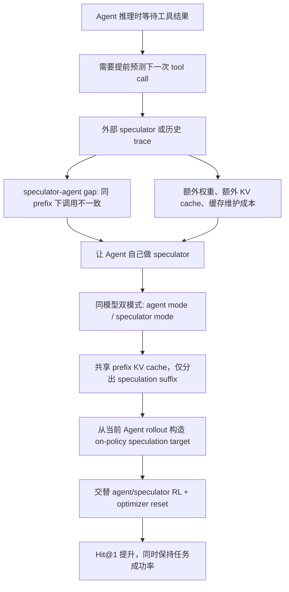
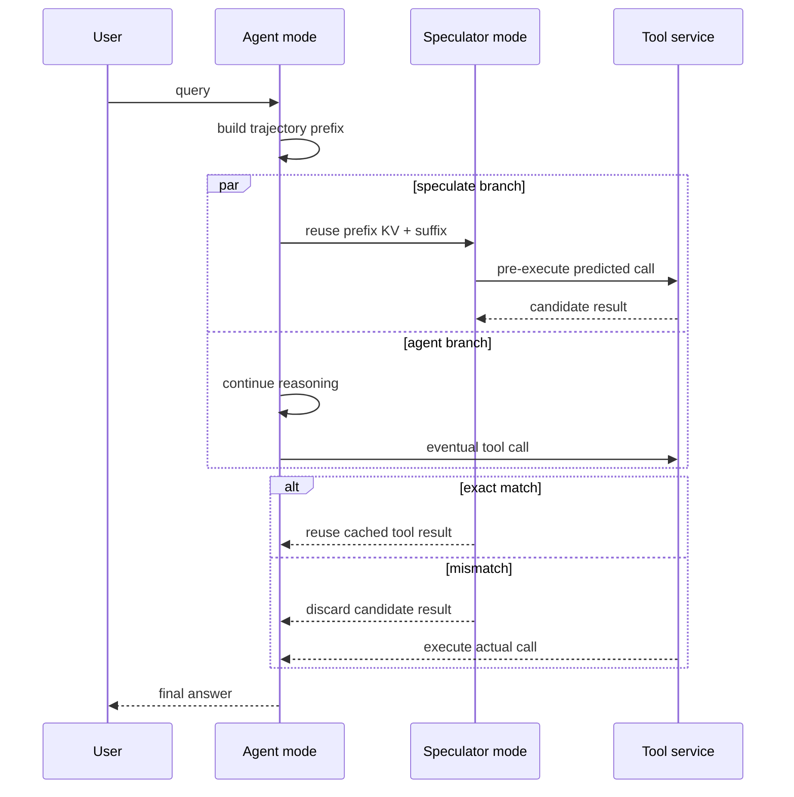

# Speculate While You Reason：让 Agent 自己预测下一次工具调用

- 原文：<https://arxiv.org/abs/2607.25816>
- HTML 全文：<https://arxiv.org/html/2607.25816>
- 版本：arXiv:2607.25816v1，2026-07-28 15:00:10 UTC 提交。
- 作者与机构：UC Santa Barbara 与 LinkedIn Inc.；论文明确说明部分工作完成于 LinkedIn 实习期间。
- 分类：大模型 Agent 与大模型后训练交叉；核心问题是 tool-call speculation、agent RL、双模式训练和推理服务延迟。

### TL;DR

- 这篇论文研究 LLM Agent 的一个部署瓶颈：Agent 在推理中会不断等待搜索、数据库、API、代码解释器或子 Agent 返回结果，wall-clock latency 往往不在 token 生成，而在工具调用。
- 传统 tool-call speculation 试图用外部 draft model 或历史 trace 预测下一次工具调用并提前执行；如果预测的工具名和完整参数与 Agent 后续真实调用完全一致，就能复用结果、隐藏等待时间。
- 作者指出关键障碍是 **speculator-agent gap**：外部 speculator 不是正在部署的 Agent，即使看到相同中间轨迹，也常预测不同的下一次结构化调用；它还会带来额外模型权重、额外 KV cache 或历史缓存维护成本。
- 论文提出 **self-speculating agent**：同一个 LLM 同时有 agent mode 和 speculator mode；agent mode 正常解题与调用工具，speculator mode 在同一 prefix 后接一个 speculation suffix，预测该 Agent 自己下一次工具调用；因为 prefix 相同，可以复用 prefix KV cache。
- 训练方法是 **joint agent-speculator RL**：从当前 Agent 自己的 rollouts 构造 speculation targets，交替更新 agent mode 与 speculator mode，并在模式切换时 reset optimizer state，避免两个目标互相干扰。
- 关键数字：Qwen3-4B 的平均 next tool-call Hit@1 从 SFT warmup 后的 44.1 提到 61.2；Qwen3.5-4B 从 48.9 提到 66.3；同时平均任务成功率基本保持，Qwen3-4B 从 26.6 到 27.7，Qwen3.5-4B 从 49.2 到 50.6。
- 证据覆盖 SearchQA 与 conversational tool-use：HotpotQA、MuSiQue、BrowseComp-Plus、ToolScale、tau-bench Airline/Retail；训练资源也很明确，SearchQA 用 8 张 H100，ToolScale 用 8 张 H200，RL budget 每设置 200 steps。
- 局限是：Hit@1 只说明“可复用调用比例”提高，不直接等于端到端延迟收益；跨域迁移中 speculation Hit@1 可提升，但 task success 会下降；方法仍依赖严格结构化工具调用、可解析参数和安全的提前执行边界。

### 研究问题：为什么工具调用预测不是普通 draft decoding？

- 普通 speculative decoding 预测的是后续 token。
- tool-call speculation 预测的是一个结构化 action：
  - tool name；
  - argument dictionary；
  - 调用时机；
  - 与 Agent 后续真实选择的精确一致性。

- 这使问题更苛刻：
  - 只预测对工具名不够；
  - 参数缺 key、值不一致、schema 不可解析都不能复用；
  - 如果提前执行了错误调用，结果必须丢弃；
  - 如果工具有副作用，提前执行还会引入安全和一致性风险。

| 对比项 | token speculative decoding | tool-call speculation |
|---|---|---|
| 预测对象 | token 序列 | 结构化工具调用 |
| 成功标准 | target model 接受 token | Agent 后续实际调用完全匹配 |
| 可复用内容 | token 生成结果 | 已完成的工具调用结果 |
| 主要收益 | 减少解码时间 | 隐藏远程工具等待时间 |
| 失败成本 | 丢弃 draft tokens | 丢弃预执行结果，甚至需防副作用 |
| 关键风险 | draft-target 分布差 | speculator-agent gap 与环境状态差 |

- 作者真正关心的问题可以压缩成一句话：
  - <u>能不能让同一个 Agent 在推理时分出一个“预测自己下一步工具调用”的分支，同时不牺牲原本的任务成功率？</u>

### 论文的论证路线



- 这条路线的重点不是“再训练一个更好的小模型”。
- 作者反而把 speculator 收回 Agent 内部：
  - 如果预测目标是某个 Agent 自己将要采取的下一步；
  - 那么最知道该分布的候选不是外部小模型，而是这个 Agent 本身；
  - 训练问题从“对齐另一个 speculator”变成“让同一模型学会在另一种模式下预判自己”。

### 第一步证据：外部 speculator 为什么不够？

- 论文先做 off-the-shelf evaluation，而不是直接报新方法。
- 协议是：
  - 在 Agent rollout 的真实工具调用边界前截取 prefix；
  - speculator 看到同样 prefix 与固定 speculation suffix；
  - 它生成一个候选工具调用；
  - 环境只执行 Agent 的真实调用；
  - 如果 speculator 的工具名和完整参数字典与真实调用一致，则 Hit@1 成功。

- 评测对象包括：
  - Qwen3-4B Agent vs Qwen3-0.6B/1.7B speculators；
  - Qwen3.5-4B Agent vs Qwen3.5-0.8B/2B speculators；
  - 同一个 4B Agent 也被 prompt 成 speculator，预测自己的下一次调用。

| 观察 | 机制解释 | 对系统设计的影响 |
|---|---|---|
| 小 draft model Hit@1 低 | 它学习的是通用工具助手，不是部署 Agent 的即时策略 | 不能只靠同模型家族近似 |
| 历史 trace 不稳定 | 查询、环境状态、前缀推理可能已变 | cache replay 不等于当前策略 |
| 外部 speculator 成本高 | 需要额外权重和 KV cache | 服务侧收益会被显存与调度抵消 |
| 4B Agent 自己更强 | 同参数更接近自身调用分布 | self-speculation 有合理起点 |

- 论文报告的具体对比是：
  - Qwen3 系列里最强外部 speculator 平均 Hit@1 只有 18.6；
  - base 4B Agent 被 prompt 预测自己时达到 29.1；
  - SFT warmup 后，Qwen3-4B self-speculation 到 44.1；
  - Qwen3.5-4B self-speculation 到 48.9。

### 方法机制：self-speculating agent 怎样工作？

- 同一个模型有两种模式：
  - agent mode：产生 reasoning、tool calls、observations 和 final answer；
  - speculator mode：拿到中间 trajectory prefix，加上固定 speculation suffix，直接预测下一次 structured tool call。

- 关键工程点是 prefix KV cache 复用：
  - agent 已经计算过 prefix；
  - speculator 分支不用重新编码完整上下文；
  - 只需要在 prefix 后接一个短 suffix，再生成候选调用；
  - 如果调用命中，提前执行结果可被 Agent 后续复用。

```text
Agent trajectory prefix:
  user query + reasoning + observations + partial state

Speculator branch:
  same prefix
  + speculation suffix
  -> candidate tool call a_hat = (tool_name, arguments)

Agent branch:
  same prefix
  -> eventual tool call a = (tool_name, arguments)

Reuse rule:
  usable = exact_match(a_hat, a)
```

- 这里的 exact match 很严格：
  - 工具名必须相同；
  - 完整参数字典必须相同；
  - 解析失败就是错误预测；
  - 训练中的 shaped reward 可以给参数 token-F1 部分信用，但部署复用指标仍是完整一致。

### Joint Agent-Speculator RL：为什么不能只训练 speculator？

- 双模式共享参数，因此优化 speculator 可能伤害 Agent 任务能力。
- 作者把训练拆成两个互相更新的 reward：
  - agent reward：任务是否完成；
  - speculator reward：下一次工具调用预测是否接近 Agent 自己后续真实调用。

- speculation target 来自当前 Agent rollout：
  - 先让当前 policy 在环境中产生轨迹；
  - 从轨迹里的工具调用边界抽取 prefix-next-call 样本；
  - speculator mode 对这些样本训练；
  - 因为样本来自当前 Agent，而不是旧缓存，所以 speculation 是 on-policy 的。

```text
Input:
  current policy pi_theta
  environments E
  schedule m(k): agent block / speculator block

Loop for each RL iteration:
  1. sample agent rollouts with pi_theta
  2. collect task reward for agent mode
  3. extract (prefix, next structured call) pairs
  4. build speculator queries by appending speculation suffix
  5. if schedule selects agent mode:
       update pi_theta using agent reward
     else:
       update pi_theta using speculation reward
  6. when switching mode:
       reset optimizer state

Output:
  one policy that can both act and self-speculate
```

- 这个过程的核心 trade-off：
  - speculator 需要连续更新，才能追上当前 Agent 的调用分布；
  - Agent 也需要周期性更新，避免只会预测调用而不会完成任务；
  - 两个目标共享参数，所以优化器历史可能把上一模式的动量带到下一模式，造成干扰。

### 奖励与指标：Hit@1 为什么是硬指标？

- 论文把工具调用写成 `a = (n, sigma)`：
  - `n` 是工具名；
  - `sigma` 是命名参数字典。

- 部署复用指标：

```text
Hit@1 = 1[ n_hat = n and sigma_hat = sigma ]
```

- 训练 shaped reward 更细：
  - 先要求工具名匹配；
  - 再对目标参数 key 计算 macro token-F1；
  - 缺失 key 得 0；
  - 多余 key 不抵消缺失 key。

- 这个设计的意义：
  - 训练时有 dense signal，不至于完全 sparse；
  - 评测时仍保持 deployment 语义：只有完全相同的结构化调用才能复用；
  - 它把“看起来差不多的搜索 query”与“可直接复用的工具结果”区分开。

### 实验设置：覆盖哪些 Agent 环境？

| 资源 | 数字或范围 | 作用 |
|---|---:|---|
| SearchQA train | 283,338 | 搜索问答训练来源 |
| SearchQA eval | 2,500 subset | HotpotQA、MuSiQue 等评测 |
| BrowseComp-Plus train | 680 | 搜索/浏览类训练 |
| ToolScale train | 4,063 | conversational tool-use 训练 |
| ToolScale SFT spec | 5,000 | speculation warmup |
| tau-bench Airline eval | 50 | 结构化 API 工具任务 |
| tau-bench Retail eval | 114 | 结构化 API 工具任务 |
| SearchQA RL hardware | 8 H100 | 训练资源边界 |
| ToolScale RL hardware | 8 H200 | 训练资源边界 |
| RL budget | 200 steps | 每设置训练预算 |

- 模型：
  - Qwen3-4B；
  - Qwen3.5-4B；
  - 外部 speculator 对照包括 0.6B/1.7B/0.8B/2B 同系列模型。

- 训练默认：
  - RL method：DAPO-style GPO；
  - `G_ag = 8`；
  - `G_sp = 8`；
  - schedule：4 agent / 8 speculator；
  - mode switch reset：每次切换都 reset；
  - learning rate：`3e-6`；
  - length limit：SearchQA 16K，tau-bench 32K。

### 主结果：预测能力提高，Agent 成功率没有系统性崩掉

| 模型 | self-speculation 起点 | RL 后 Hit@1 | 变化 | 平均任务成功率变化 |
|---|---:|---:|---:|---:|
| Qwen3-4B | 44.1 | 61.2 | +17.1 | 26.6 -> 27.7 |
| Qwen3.5-4B | 48.9 | 66.3 | +17.4 | 49.2 -> 50.6 |

- 这个结果支持两个 claim：
  - joint RL 确实提升了下一次工具调用预测；
  - speculator 目标没有把共享参数拉到无法完成任务的方向。

- 但要谨慎读：
  - 任务成功率“保持”不等于所有 domain 都提升；
  - 平均值掩盖了跨域迁移的下降；
  - Hit@1 提升还需要结合真实工具 latency、预执行并发和错误调用丢弃成本，才能换算成端到端服务收益。

### 跨域泛化：预测动作可迁移，完成任务不一定可迁移

- 作者做了一个很有价值的交叉实验：
  - SearchQA-trained Qwen3-4B checkpoint 去 tau-bench；
  - ToolScale-trained Qwen3.5-4B checkpoint 去 SearchQA。

| 迁移方向 | Hit@1 变化 | Success 变化 | 解读 |
|---|---|---|---|
| SearchQA -> tau Airline/Retail | 35.6/39.7 -> 45.6/50.1 | 21.6/36.4 -> 17.6/29.8 | 工具调用预测行为可迁移，但交互策略掉点 |
| ToolScale -> Hotpot/MuSiQue | 25.4/28.3 -> 35.4/37.9 | 63.1/25.1 -> 57.9/21.6 | 参数匹配能力提升，搜索推理成功率下降 |

- 这组结果说明：
  - speculator 学到了一些通用 call-level 行为；
  - 例如什么时候需要工具、参数结构如何填；
  - 但 task success 依赖领域内 reasoning、查询构造、状态跟踪和环境交互策略；
  - 因此 matched-domain agentic RL training 仍然重要。

### 消融：为什么要 warmup、reset 和交替更新？

| 消融项 | 被移除的机制 | 论文观察 | 机制解释 |
|---|---|---|---|
| w/o SFT warmup | 不先教 speculator 输出格式 | 早期 speculation reward 更弱、更不稳 | RL 会先浪费能力学习格式，而非匹配调用 |
| w/o optimizer reset | 模式切换保留 optimizer state | reward trace 更弱、更不稳 | 上一模式的动量和自适应统计干扰下一目标 |
| w/o alternating updates | 混合 agent/speculator 更新 | 早期 collapse | 两个目标分布差异大，不能简单揉在一起 |
| 1:1 schedule | 每步切换 | Avg Hit@1 31.8，Avg Success 10.3 | speculator 没有连续信号，Agent 也被频繁打断 |
| 4:8 schedule | 4 agent / 8 speculator | Avg Hit@1 55.2，Avg Success 26.1 | 在 speculator 学习和 Agent 保持之间较平衡 |

- 这里最有意思的是 optimizer reset。
- 很多多任务训练会共享优化器状态，但这篇论文强调 agent mode 和 speculator mode 的输出分布、奖励目标和梯度方向差异很大。
- 如果保留 optimizer momentum：
  - agent block 的优化历史会推着 speculator 更新；
  - speculator block 的优化历史又会污染 agent 更新；
  - reset 让每个 block 更像重新开始一个局部优化问题。

### Figure/Table 证据怎么读？

| 证据位置 | 支持什么 | 不能证明什么 |
|---|---|---|
| Figure 1 | 外部 draft model 与 self-speculation 的系统差异：参数/KV cache 分离 vs 同模型共享 prefix | 不直接给出延迟收益数值 |
| Figure 2 | 在线比较协议：speculator 与 Agent 从同一 prefix 分叉，环境只执行 Agent 真实调用 | 不处理副作用工具的安全问题 |
| Table 1 | off-the-shelf 外部 speculator 的 Hit@1 与 serving overhead | 不代表经过专门训练的小 speculator 的上限 |
| Table 2 | joint RL 后 Hit@1 大幅提升且 success 保持 | 平均 success 不能证明所有任务都无退化 |
| Table 3 | 跨域 Hit@1 可迁移，但 success 下降 | 不支持“一个 speculator 可跨所有环境部署” |
| Figure 3 | warmup、reset、alternating 对 reward 稳定性重要 | reward trace 不是最终端到端延迟 |
| Table 5 | 8 H100/H200、200 steps、DAPO-style GPO 等训练配置 | 低资源复现成本仍不清楚 |
| Table 7 | 数据规模和评测子集 | 子集评测不等于完整 benchmark 覆盖 |

- 我会把 Table 3 视为全文的边界证据。
- 它诚实地告诉读者：下一次 tool call 预测可以学到可迁移的动作模式，但成功完成任务仍然是更高层的、领域依赖的能力。

### 安全边界：提前执行工具调用为什么需要额外约束？

- 论文的评测协议里，环境只执行 Agent 的真实调用；speculator 预测用于比较。
- 但真实部署中，如果为了隐藏延迟而提前执行，必须区分：
  - 只读搜索；
  - 数据库查询；
  - 有副作用 API；
  - 可能触发外部成本或状态变更的操作。

| 工具类型 | 能否直接预执行 | 必要控制 |
|---|---|---|
| Web/search query | 通常可以 | rate limit、缓存隔离、隐私过滤 |
| 只读数据库查询 | 条件允许 | ACL、查询预算、审计日志 |
| 代码解释器 | 谨慎 | sandbox、资源限制、输入 provenance |
| 邮件/日历/工单写入 | 不应直接预执行 | dry-run、用户确认、幂等 token |
| 支付/删除/权限变更 | 不应预执行 | 禁止 speculative side effect |

- 因此，self-speculation 的部署收益必须和安全策略一起定义：
  - 预测调用可以先做 dry-run；
  - 预执行结果应标记 provenance；
  - 不命中时必须丢弃且不能污染 Agent 状态；
  - 副作用工具只能在 Agent 真实调用和权限检查后执行。

### 逐节细读：每一节如何支撑主张？

| 论文部分 | 在论证中的功能 | 读者应关注的细节 |
|---|---|---|
| Introduction | 把延迟瓶颈从 token 生成转到工具等待 | 工具调用可能是远程服务、网络 I/O 或另一个 LLM 子 Agent |
| Section 2 | 证明外部 speculator 与目标 Agent 存在 gap | 评测在真实 rollout 的调用边界发生，而不是离线重放 |
| Section 3.1 | 把 task reward 与 speculation reward 分开 | 成功完成任务和预测下一次调用是两个目标 |
| Section 3.2 | 提出从当前 rollout 构造 speculation targets | 这使训练保持 on-policy，减少 stale trace 问题 |
| Section 3.3 | 处理双模式训练稳定性 | warmup、交替 schedule、optimizer reset 是方法必要部件 |
| Section 4.2 | 给主结果 | Hit@1 提升不能单独读，必须和 success 一起读 |
| Section 4.3 | 给跨域边界 | 动作预测迁移强于任务策略迁移 |
| Appendix A | 给部署/训练协议细节 | exact-match 指标和 shaped reward 的差别很重要 |
| Appendix C | 给数据规模 | eval subset 与 train data 的范围决定外部效度 |

- Introduction 的关键是重定义“快”。
  - 对 Agent 来说，快不只是每秒生成多少 token；
  - 如果一次搜索、数据库查询或子 Agent 调用要等数秒，token 解码优化只能改善一部分体验；
  - tool-call speculation 的目标是把等待工具的时间与继续 reasoning 的时间重叠。

- Section 2 的关键是公平协议。
  - speculator 与 Agent 从同一个 prefix 分叉；
  - speculator 预测，但环境只执行 Agent 的真实调用；
  - 这样可以测出“如果真实部署提前执行，预测结果是否可复用”，同时不让错误预测改变轨迹。

- Section 3 的关键是同参双模式。
  - 同参意味着不需要对齐另一个模型；
  - 也意味着 speculator 更新会改变 Agent 本身；
  - 论文的训练设计几乎都在控制这个共享参数冲突。

- Section 4 的关键是两类指标绑定。
  - Hit@1 是系统收益的前置条件；
  - task success 是能力不退化的约束；
  - 只报其中一个都会误导：高 Hit@1 但任务失败没有部署价值，高 success 但 Hit@1 低也无法隐藏工具延迟。

### 部署时序：一次命中的 speculation 到底省在哪里？



- 命中时节省的是：
  - Agent 继续 reasoning 与工具执行的重叠时间；
  - 已完成 tool result 的等待时间；
  - 可能还包括重复网络往返。

- 未命中时付出的成本是：
  - speculator 分支生成成本；
  - 预执行调用成本；
  - 缓存、取消或丢弃结果的控制面成本；
  - 如果工具不纯只读，还可能有状态污染风险。

- 因此部署收益可以粗略写成：

```text
Expected gain
  ~= P(exact_hit) * tool_latency_hidden
     - P(miss) * preexecution_cost
     - speculation_branch_cost
     - safety_control_cost
```

- 论文提升的是 `P(exact_hit)`。
- 但真正上线时还要量化：
  - 平均工具等待时间；
  - speculator 分支是否足够短；
  - 预执行是否能并发；
  - 错误预测是否可以廉价取消；
  - 哪些工具允许提前执行。

### 失败模式：哪些情况下 self-speculation 可能没用？

- 第一类失败：工具调用本身高度不确定。
  - 如果 Agent 还没读到关键 observation；
  - 或者下一步动作取决于用户隐含约束；
  - speculator 即使用同一模型也只能猜测，Hit@1 会受限。

- 第二类失败：参数空间过大。
  - 搜索 query、SQL 条件、API 参数都可能有许多近义写法；
  - Hit@1 要求完整字典一致；
  - 语义上等价的参数改写，在复用指标下仍算失败。

- 第三类失败：Agent policy 在训练后漂移。
  - speculation targets 来自当前 rollout；
  - 如果后续 agent updates 改变了调用习惯；
  - 之前学到的 speculator 分布会变旧，这就是为什么需要交替训练。

- 第四类失败：副作用工具不能预执行。
  - 即使 speculator 很准，也不能提前发邮件、改权限、删数据或提交订单；
  - 这类工具最多能做 dry-run、schema validation 或准备请求体；
  - Hit@1 在这些场景只能带来有限收益。

- 第五类失败：共享参数导致行为变保守。
  - 如果模型为了让自己更容易预测，倾向于选择模板化工具调用；
  - task success 可能在平均值之外的复杂样本上下降；
  - 论文的跨域实验已经提示 success 是更脆弱的指标。

### 对比式理解：它不是哪些东西？

- 它不是简单 prompt trick。
  - 固定 speculation suffix 很重要；
  - 但主提升来自 SFT warmup 与 joint RL；
  - 如果只加 suffix，不能解释 44.1 到 61.2、48.9 到 66.3 的增量。

- 它不是外部小模型加速。
  - 外部 speculator 的核心问题正是 gap 与 overhead；
  - self-speculation 的假设是目标 Agent 自己更了解自己的下一步；
  - 这把服务复杂度从多模型对齐转为同模型双模式调度。

- 它不是完整 action planning。
  - 论文预测下一次 tool call；
  - 没有证明可稳定预测多步工具计划；
  - 多步预测会遇到环境反馈不确定性，错误会层层放大。

- 它不是安全授权机制。
  - self-speculator 只能预测调用；
  - 不能决定调用是否被允许；
  - 真实系统仍需权限检查、用户确认、审计和副作用隔离。

### 研究位置：它和 Agent RL 的关系是什么？

- 这篇论文不是单纯服务优化论文。
- 它把 serving latency 问题变成了一个后训练目标：
  - Agent 不只要答对；
  - 还要学会预判自己的下一次结构化动作；
  - 预判能力来自当前 policy 的 rollouts，而不是静态数据。

- 相比只训练 task success 的 Agent RL：
  - joint RL 多了一个 speculation reward；
  - 这个 reward 不评价答案是否正确，而评价“能否预测自己马上要做什么”；
  - 这是一种对 Agent 自身策略可预测性的训练。

- 相比外部 speculator：
  - self-speculation 的优点是对齐当前 Agent；
  - 缺点是共享参数带来目标冲突；
  - 论文用 alternating updates 和 optimizer reset 处理这个冲突。

- 相比缓存历史 trace：
  - self-speculation 不依赖过去相似 query；
  - 它直接根据当前 trajectory prefix 预测；
  - 但它也更依赖模型在当前状态下形成稳定的 action distribution。

### 证据边界与复现风险

- 第一，端到端延迟收益没有被完整量化。
  - Hit@1 是必要指标；
  - 但真实收益还要看工具 latency、预执行并发、错误预测比例、缓存命中开销和调度成本；
  - 论文主要证明预测质量，不等同于完整系统 benchmark。

- 第二，副作用工具需要额外安全层。
  - 论文环境适合研究协议；
  - 真实 Agent 可能连接邮件、文件、支付、工单、生产 API；
  - 这些动作不能因为 speculator 猜到了就提前执行。

- 第三，训练资源不轻。
  - 8 H100/H200 与 200 steps per setting 是明确成本；
  - 对小团队来说，复现 joint RL 不是只改 prompt；
  - low-resource 版本可能需要蒸馏、LoRA 或离线 replay，但那又会重新引入 off-policy gap。

- 第四，跨域 success 会掉。
  - Table 3 明确显示 Hit@1 可迁移不等于任务成功可迁移；
  - 这提醒我们不能把 self-speculator 当成通用插件；
  - 每个工具生态和任务分布可能都需要 matched-domain 训练。

- 第五，speculation suffix 是固定设计。
  - 附录说明所有实验使用同一个 suffix；
  - 该 suffix 不包含 benchmark、工具名或答案；
  - 但 suffix 本身仍是 prompt 设计选择，未来应比较不同 suffix 对 Hit@1、解析率和安全性的影响。

### 对后续 Agent 系统的启发

- 如果把这篇论文用于工程设计，我会提炼出四条原则：
  - 预测下一步工具调用时，最强 speculator 往往是 Agent 自身，而不是外部小模型；
  - 共享 KV cache 是系统收益成立的基础，否则额外 speculator 可能吃掉延迟收益；
  - 训练 speculator 不能牺牲 Agent 主任务，需要显式追踪 task success；
  - 任何预执行都必须绑定 side-effect policy。

- 对 Agent 训练研究，值得继续问：
  - self-speculation 是否能预测多步工具调用序列，而不只是一跳；
  - speculator reward 是否会让 Agent 变得更可预测但更保守；
  - 能否把 speculation confidence 接入调度器，只在高置信、低副作用工具上预执行；
  - 能否把失败的 speculative calls 作为反例，反过来训练 Agent 减少歧义状态。

### 复现优先级清单

- 若要复现这篇工作，我会按下面顺序检查，而不是先追求完整大规模训练：
  - 先复现 Section 2 的 online Hit@1 协议，确认外部 speculator、self-prompt speculator 和目标 Agent 在同一 prefix 下的差距；
  - 再复现 SFT warmup，检查 speculator mode 是否能稳定输出可解析结构化调用；
  - 然后只在一个 domain 上跑短 RL，观察 Hit@1 与 task success 是否同步记录；
  - 最后再做跨域测试，因为 Table 3 已经显示这一步最容易暴露策略迁移问题。

- 报告结果时至少要给：
  - 工具调用解析失败率；
  - exact-match Hit@1；
  - 参数级部分匹配 reward；
  - task success；
  - 每次命中实际隐藏的平均工具等待时间；
  - 被禁止预执行的副作用工具比例。

### 结论

- `Speculate While You Reason` 的核心贡献，是把工具调用延迟问题从“外部加速器”改写成“Agent 自身的双模式能力”。
- 它证明同一个 4B Agent 在看到自己的中间轨迹时，已经比同系列小 draft model 更适合预测下一次工具调用；再经过 SFT warmup 与 joint RL，Hit@1 可以从 44.1/48.9 提到 61.2/66.3。
- 它也清楚暴露了边界：跨域 task success 会下降，训练资源不轻，Hit@1 不是端到端延迟，副作用工具不能直接预执行。
- 对 Agent 后训练来说，这篇论文最值得带走的不是某个具体 suffix，而是一个更一般的方向：**让 Agent 学会预测自己的下一步结构化动作，并把这种可预测性纳入训练目标。**
