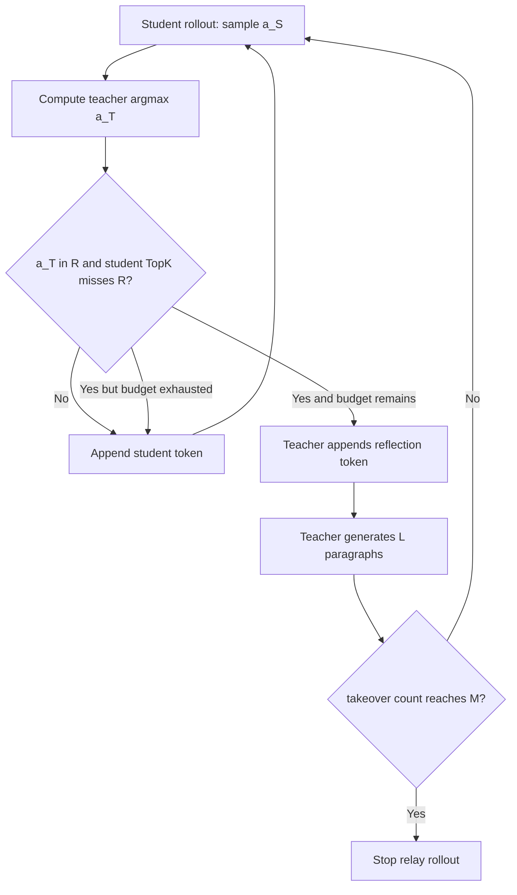

# Pass the Baton: Relay-OPD 如何把“学生走偏”改造成可训练的交接信号

## 元信息

| 项目 | 内容 |
| --- | --- |
| 论文 | Pass the Baton: Trajectory-Relayed On-Policy Distillation |
| 链接 | https://arxiv.org/abs/2607.26057 |
| 版本 | arXiv:2607.26057v1，2026-07-28 提交 |
| 项目 | https://zju-real.github.io/Relay-OPD/ |
| 代码 | https://github.com/ZJU-REAL/Relay-OPD |
| 方向 | 大模型后训练、on-policy distillation、强到弱推理迁移 |
| 本文结论 | Relay-OPD 的价值不在“让教师多生成几段”，而在把前缀失败变成一个在线触发、有限预算、能复现实验的轨迹控制问题。 |

## TL;DR

- **问题**：OPD 让学生自己生成轨迹，再由教师在学生访问过的 prefix 上给 token-level 监督；它缓解 train-inference distribution shift，但把学生自己的早期错误也带进训练。
- **关键失败**：长链推理里，学生一旦在早期 prefix 走向错误方向，后续 token 会继续沿错路展开；教师在这个坏 prefix 上给出的监督会变得不稳定，训练还会浪费大量长轨迹计算。
- **核心观察**：作者发现一种 teacher-student continuation asymmetry：在失败 prefix 上，教师 top-1 往往是反思/转向 token，而学生 top-K 里没有这类 token，学生更倾向继续推进当前错误路径。
- **方法**：Relay-OPD 把这种不对称变成 label-free handoff trigger；触发时教师短暂接管，生成一个 teacher leg，然后把控制权交还学生。
- **预算**：方法用 `K` 控制学生 top-K 检查，用 `M` 控制最多接管次数，用 `L` 控制每次教师接管生成的段落数；论文主配置是 `K=5, M=2, L=3`。
- **训练**：学生并不是只模仿学生自己 token；Relay-OPD 在 relay trajectory 上训练，包括 teacher leg 里的实际 relay token，用 k1 reverse-KL 风格的 policy-gradient objective。
- **证据**：在 Qwen3-4B-Instruct-2507 教师和 Qwen3-0.6B/1.7B-Non-Thinking 学生上，八个数学推理 benchmark 都达到最好或第二好；1.7B 平均比 OPD 高 `+5.73%`，比 FastOPD 高 `+1.49%`。
- **效率**：1.7B 学生训练轨迹长度从 OPD 的 `4658` 降到 `2296`，减少 `50.7%`；0.6B 从 `6900` 降到 `2490`，减少 `63.9%`。
- **局限**：触发器依赖 reflection-token 集合，实验集中在数学 reasoning 和 Qwen3 teacher/student 组合；它证明了“早期局部接管”的有效性，但还没有证明能直接迁移到开放工具调用、多轮 Agent 或非数学任务。

## 研究问题：OPD 为什么会输给自己的 on-policy 假设？

### 论文先承认 OPD 的优点

- 离线 SFT 或普通 KD 依赖教师生成的完整答案。
- 学生训练时看到的是教师状态分布，不一定等于学生推理时真正会访问的状态。
- OPD 的改进是：
  - 先让学生从自己的 policy 采样轨迹；
  - 再让教师在这些真实 prefix 上给 token-level guidance；
  - 监督落在学生会实际遇到的状态上。

这一步使 OPD 比纯离线蒸馏更贴近 inference，但也制造了论文的核心矛盾：

| OPD 设计 | 带来的收益 | 同时引入的失败 |
| --- | --- | --- |
| 学生自己 rollout | 训练状态分布更像推理时状态分布 | 学生失败也被保留下来 |
| 教师在学生 prefix 上打分 | token-level 监督更密 | 坏 prefix 上教师信号可能被上下文拖偏 |
| 长链 reasoning 允许更完整推导 | 能学习中间推理过程 | 早期错误会自回归放大 |

### prefix failure 的本质不是“答案错了”

论文讨论的 prefix failure 更细：

- 不是最终答案错误才算失败；
- 而是学生在某个中间 prefix 已经进入错误方向；
- 后续 token 都在这个方向上条件生成；
- 生成越长，坏 prefix 对上下文的锁定越强；
- 教师再给监督时，也是在一个已经污染的上下文里继续判断。

可以把它写成一个简单状态链：

```text
x: problem
h_t = (x, z_<t): 当前 prefix
a_t^S ~ pi_student(. | h_t): 学生下一步
如果 h_t 已经偏离可解方向：
  z_t, z_{t+1}, ... 会继续继承错误假设
  教师监督不再等价于“正确推理轨迹上的教师监督”
```

论文的切入点因此很精确：

- 如果只截断固定长度，可能错过真正失败点。
- 如果等整条轨迹结束再让教师 rewrite，错误已经扩散。
- 如果按 token 分布差异混合教师/学生，不一定是在推理方向失败时介入。
- 更需要的是一个 online、reasoning-aware、label-free 的接管点。

## 论文主张与论证路线

| Claim | Mechanism | Evidence | Boundary |
| --- | --- | --- | --- |
| OPD 的主要浪费来自失败 prefix 之后的长错误延续 | 学生早期走偏后继续沿当前方向生成 | Figure 1/2 展示教师倾向反思，学生倾向继续 | 证据来自数学 reasoning 场景，不等同所有任务 |
| 失败点可由师生延续不对称近似检测 | 教师 top-1 是 reflection token，而学生 top-K 无 reflection token | 论文把该规则做成 handoff trigger，并在主实验复用 | 规则依赖人工 reflection-token 集合 |
| 修复不需要教师接管整条轨迹 | 教师只生成短 teacher leg，再交还学生 | Figure 2 中 `0.35%` 教师 token 已有明显提升 | 局部接管是否适合工具任务仍未验证 |
| 早介入比晚介入更重要 | teacher-student gap 随 prefix 增长缩小，教师也被坏上下文拖住 | 延迟接管使准确率从 `41.99` 下降到 `33.98`、再到 `29.49` | 触发位置和反思 token 质量决定收益上限 |
| relay trajectory 可直接用于 OPD 训练 | 对实际生成 token 做 k1 RKL policy-gradient | 八个 benchmark 上 0.6B/1.7B 均提升，训练长度减半 | 教师为 Qwen3-4B，学生为 Qwen3 non-thinking |

## 方法机制：handoff trigger 到 relay rollout

### 触发器检查什么？

论文把 reflection token 集合记为 `R`。

默认 token base 包括：

- `Wait`
- `But`
- `Hmm`
- `Actually`
- `Hold`
- `However`
- `Yet`
- `Oh`
- `Alternatively`
- `No`
- `Ah`
- `Oops`
- `Well`

实现会用学生 tokenizer 解析大小写和前置空格变体。

触发规则可以写成：

```math
phi(h) =
1[a^T \in R] * 1[TopK_S(h) \cap R = empty]
```

变量解释：

| 变量 | 含义 |
| --- | --- |
| `h` | 当前 prefix，也就是题目和已经生成的推理 |
| `a^T` | 教师在 `h` 上的 argmax token |
| `TopK_S(h)` | 学生在 `h` 上概率最高的 `K` 个 token |
| `R` | 反思/转向 token 集合 |
| `phi(h)=1` | 教师想反思，但学生 top-K 没有反思倾向，触发接管 |

这个规则的含义不是“教师和学生分布不同”。

- 教师分布不同但不是反思 token：可能只是措辞差异。
- 学生 top-K 也有反思 token：学生可能已有自我修正能力。
- 教师 top-1 是反思 token，学生 top-K 完全没有：这才像“学生会继续错路，而教师会刹车转向”。

### teacher leg 为什么要短？

Relay-OPD 不是让教师从触发点写完答案。

它只让教师：

1. 在触发 token 处接管；
2. 生成 `L` 个 additional teacher paragraphs；
3. 把上下文修回可继续推理的方向；
4. 再交还给学生继续 rollout。

这背后有两个理由：

- **训练分布理由**：如果教师写太多，轨迹就重新变成 teacher trajectory，OPD 的 on-policy 性质被削弱。
- **计算理由**：教师腿越长，强模型推理成本越高，训练轨迹也越长。

因此论文把接管做成预算：

| 参数 | 控制对象 | 主配置 |
| --- | --- | --- |
| `K` | 学生 top-K 检查范围 | `5` |
| `M` | 最多 teacher takeovers | `2` |
| `L` | 每次 teacher leg 的段落数 | `3` |

### 轨迹像一个有限状态机



这个状态机有一个重要边界：

- 它不需要外部 label。
- 它不需要 verifier 判断当前步骤是否数学正确。
- 它不直接知道“真失败点”。
- 它用师生在反思动作上的不对称，近似定位需要交接的时刻。

## 算法流程：Relay Rollout Construction

论文附录给出 Algorithm 1。用更接近实现的伪代码可写成：

```text
Input:
  problem x
  student policy pi_s
  teacher policy pi_t
  reflection set R
  student top-K size K
  max takeovers M
  teacher leg length L
State:
  z = empty response
  mode = Student
  j = 0

Loop until EOS or max length:
  h = concat(x, z)
  sample student draft token a_s ~ pi_s(. | h)
  compute teacher argmax a_t = argmax_v pi_t(v | h)
  compute student top-K set K_s(h)

  trigger = (a_t in R) and (K_s(h) intersects R is empty)

  if mode == Student and trigger and j < M:
    j = j + 1
    append a_t to z
    for paragraph in 1..L:
      generate one teacher paragraph with speculative decoding
      append paragraph to z
    if j == M:
      stop rollout
    else:
      mode = Student
  else:
    append a_s to z

Output:
  relay trajectory z
```

这里最容易误读的是最后的 stop。

- `M` 是 relay budget，不是“允许教师接管后学生无限继续”。
- 当最后一次 teacher leg 用完预算，论文实现选择进入 terminal state。
- 这样做使轨迹更短，也避免最后一次修正后再展开一段可能重新走偏的长学生 continuation。

## 训练目标：为什么 teacher leg 也按实际 relay token 学？

### OPD 的 token-level advantage

论文在 OPD 部分使用 token-level teacher-student advantage：

```math
A_t = log pi_T(z_t | h_t) - log pi_student(z_t | h_t)
```

直觉：

- 如果教师比学生更支持当前 token，`A_t` 为正；
- 学生应该提高该 token 概率；
- 如果教师比学生更不支持当前 token，更新方向相反。

Relay-OPD 的关键选择是：

- student leg：用学生实际生成的 token；
- teacher leg：用教师实际 relay 出来的 token；
- 两段都落到同一种 k1 reverse-KL policy-gradient objective。

### 为什么不用学生 draft token？

论文做了 loss 消融：

| Teacher leg 训练目标 | 平均准确率 |
| --- | ---: |
| Student Draft Token | `44.56` |
| Teacher FKL top-k | `44.08` |
| Relay Token (Ours) | `46.96` |

这个结果支撑一个判断：

- teacher leg 的作用不只是提供“上下文修复”；
- 它还提供了学生当下不会生成、但应该学会生成的反思动作；
- 如果训练仍绑定到学生 draft token，就相当于让学生在教师接管处继续学习原本的错误倾向；
- 如果改成 top-k FKL，又会引入更重的分布存储和计算，并且在这个设置下没有更好。

## 实现机制：为什么它能放进训练系统？

项目 README 说明实现位于 `relay-opd/`，构建在 `verl` 上，并依赖一个 vLLM `0.21.0` speculative-decoding patch。

工程边界可以拆成：

| 模块 | 作用 |
| --- | --- |
| `opd/data/` | 离线轨迹生成和数据集支持 |
| `opd/eval/` | 数学 benchmark 评测 |
| `opd/patches/vllm/` | Relay-OPD 与 SKD 的 speculative-decoding patch |
| `opd/reward/` | 训练期数学 reward 与 grader |
| `opd/scripts/baselines/` | SFT、SeqKD、GRPO、OPD、FastOPD、TRD、SKD |
| `opd/scripts/relay_opd/train.sh` | 主方法训练入口 |
| `opd/scripts/ablations/` | 每个论文消融的独立脚本 |
| `opd/scripts/evaluation/math.sh` | 八个数学 benchmark 的统一评测入口 |

复现配置的关键点：

- Linux + NVIDIA GPU 是当前要求。
- Python 使用 `3.12`。
- vLLM 必须固定到 `0.21.0`，因为 patch 依赖内部接口。
- 严格复现环境给出 CUDA `13.0`、PyTorch `2.11.0+cu130`、Ray `2.56.1`、FlashInfer `0.6.8.post1`、Triton `3.6.0`。
- 论文默认使用八卡，四张给 actor/student，四张给 teacher。
- README 还给出两卡 `1 actor + 1 teacher` smoke test，用来验证 batch size `128` 和 response budget `16384` 的路径。

这部分很重要：

- 论文不是只给一个概念算法；
- 它把 main run、baseline、offline synthesis、ablation、evaluation 都拆成脚本；
- 这让“Relay-OPD 是否只是挑了有利 baseline”更容易被检查。

## 实验设置：学生、教师、数据和 benchmark

### 模型与训练配置

主实验使用：

- Teacher：Qwen3-4B-Instruct-2507。
- Student：Qwen3-0.6B-Non-Thinking。
- Student：Qwen3-1.7B-Non-Thinking。
- 训练任务：数学推理。
- 在线方法：GRPO、OPD、FastOPD、SKD、Relay-OPD。
- 离线方法：SFT、KD、TRD。

训练默认配置：

| Setting | Value |
| --- | ---: |
| Max prompt length | `2048` |
| Max response length | `16384` |
| Sampling temperature | `1.0` |
| Sampling top-p | `1.0` |
| Rollouts per prompt | `1`，GRPO 为 `8` |
| Global batch size | `128` |
| PPO mini-batch size | `128` |
| PPO epochs | `1` |
| Learning rate | `1e-6` constant |
| Training epochs | `1` |

评测覆盖八个 benchmark：

- AIME24
- AIME25
- AIME26
- MATH
- AMC23
- Olympiad
- HMMT Feb26
- HMMT Nov25

### baseline 为什么有代表性？

论文没有只拿 SFT/KD 做对比，而是覆盖了几类不同修复思路：

| 方法 | 轨迹来源 | 训练损失 | 它代表的思路 |
| --- | --- | --- | --- |
| SFT | 教师完整轨迹 | CE | 离线模仿 |
| KD | 教师完整轨迹 | FKL | 离线分布蒸馏 |
| TRD | 重写后的学生轨迹 | FKL | 事后 rewrite 修复 |
| GRPO | 学生 rollout | outcome RL | 结果奖励驱动 |
| OPD | 学生 rollout | RKL | 标准 on-policy token 蒸馏 |
| FastOPD | 学生 rollout 截断 | RKL | 固定长度减少坏尾巴 |
| SKD | speculative mixed rollout | FKL | 师生 token 混合 |
| Relay-OPD | relay rollout | RKL | 失败点短接管 |

这组对比对应论文的中心问题：

- 如果只是离线教师轨迹，是否足够？不够。
- 如果只是结果奖励，是否足够？不够。
- 如果只是固定截断，是否足够？不够。
- 如果只是分布差异混合，是否足够？不够。
- 必须看“推理方向失败时，谁来短暂改道”。

## 主结果：性能提升和训练长度同时成立

项目页给出主表。核心数字如下：

### 0.6B 学生

| Method | Avg | Train Len | vs OPD |
| --- | ---: | ---: | ---: |
| Student | `11.80` | - | - |
| SFT | `17.82` | `4262` | - |
| KD | `17.74` | `4262` | - |
| GRPO | `24.74` | `3379` | - |
| OPD | `28.03` | `6900` | baseline |
| FastOPD | `30.42` | `3302` | `+2.39` |
| SKD | `24.38` | `5800` | `-3.65` |
| Relay-OPD | `31.04` | `2490` | `+3.01` |

解释：

- 0.6B 学生很弱，原始平均只有 `11.80`。
- OPD 已经能显著提升到 `28.03`。
- Relay-OPD 进一步到 `31.04`。
- 更关键的是，训练长度从 OPD 的 `6900` 降到 `2490`。

### 1.7B 学生

| Method | Avg | Train Len | vs OPD |
| --- | ---: | ---: | ---: |
| Student | `24.84` | - | - |
| SFT | `33.20` | `4262` | - |
| KD | `33.75` | `4262` | - |
| GRPO | `34.42` | `2558` | - |
| OPD | `41.23` | `4658` | baseline |
| FastOPD | `45.47` | `2709` | `+4.24` |
| SKD | `42.35` | `4753` | `+1.12` |
| Relay-OPD | `46.96` | `2296` | `+5.73` |

解释：

- 1.7B 学生本身更强，OPD 起点也更高。
- FastOPD 已经是很强 baseline。
- Relay-OPD 仍比 FastOPD 高 `+1.49`。
- 训练长度比 OPD 少 `50.7%`。

这组结果让论文主张更硬：

- 它不是用更长教师轨迹换准确率；
- 它是同时缩短训练轨迹和提升准确率；
- 效率收益来自早期终止坏轨迹和有限 teacher leg，而不是减少训练难度。

## Figure/Table 逐项证据解读


### Figure 1：它在说明“接管”不是抽象比喻

Figure 1 展示三件事：

- 失败案例中，教师 top token 会倾向 `But` 这类反思信号；
- 学生下一步更可能是 `So`，继续沿当前方向推；
- Relay-OPD 在这一点让教师短接管，再让学生恢复。

这张图支撑的 claim 是：

- prefix failure 有局部可观测信号；
- 教师接管点不是用答案 label 回溯出来的；
- relay trajectory 仍然保留学生后续参与。

它不能证明：

- 所有失败 prefix 都会表现为 reflection-token asymmetry；
- 所有 reflection-token asymmetry 都是真失败；
- 非数学任务也有同样 token 形态。

### Figure 2：它在说明“早而短”的设计来自实验

论文的 preliminary intervention experiment 使用：

- 教师：Qwen3-4B-Instruct-2507。
- 学生：Qwen3-1.7B-Non-Thinking。
- 样本：128 个 DAPO-Math-17K English samples。
- handoff criterion：与主实验一致。

关键数字：

- 只替换单个 reflection token，教师 token 只占 `0.35%`，准确率从 `27.73` 到 `34.96`，提升 `+7.23`。
- 固定接管长度但延迟到更晚 trigger，准确率从 `41.99` 降到 `33.98`，再降到 `29.49`。

这张图支撑：

- 不必让教师写完整答案；
- 教师介入要尽早；
- late takeover 会被坏 prefix 的上下文牵引，纠偏能力下降。

### Table 2：teacher leg 不只是动态截断

消融对比：

| Variant | Avg |
| --- | ---: |
| Trigger-Stop (`M=1`, No Teacher Leg) | `43.48` |
| Relay-OPD (`M=1`, `L=3`) | `46.25` |

这说明：

- 如果只在 trigger 停止，确实能避免坏尾巴；
- 但 teacher leg 还能提供被修正的局部上下文和反思示范；
- 所以 Relay-OPD 的收益不是“看见失败就截断”这么简单。

### Table 5：方法对比揭示了真实对手

Table 5 的作用不是给 baseline 名单，而是划清方法边界：

- TRD 代表事后修复。
- FastOPD 代表固定截断。
- SKD 代表分布差异混合。
- Relay-OPD 代表推理状态触发的在线交接。

因此，Relay-OPD 真正要证明的是：

- 动态触发优于固定位置；
- 在线修复优于事后 rewrite；
- reasoning-specific trigger 优于 generic distribution disagreement。

## 消融与敏感性：哪些设计真的必要？

### teacher leg 必要

前面 Table 2 已经说明：

- Trigger-Stop 平均 `43.48`。
- Relay-OPD 平均 `46.25`。
- 差距 `+2.77`。

这回答了一个反驳：

- 如果坏 prefix 之后都是垃圾监督，那是不是截断就行？
- 论文答案是否定的。
- 截断能省掉坏尾巴，但不能教学生如何从局部错误中转向。

### relay token 目标必要

loss 消融显示：

- 用学生 draft token 学，平均 `44.56`。
- 用 teacher FKL 学，平均 `44.08`。
- 用实际 relay token 学，平均 `46.96`。

这里的机制解释是：

- 学生 draft token 是触发时学生本来想走的方向；
- 如果继续优化它，训练信号和接管意图冲突；
- teacher FKL 需要更重的 top-k 分布，也没有带来收益；
- 直接学习 relay token，更符合“学会在此处反思”的目标。

### 预算不是越大越好

Relay-OPD 的预算有两个维度：

- `M`：最多接管次数。
- `L`：每次接管长度。

论文主配置 `M=2, L=3` 体现一种折中：

- 太小：纠偏不足。
- 太大：轨迹离学生 policy 太远，训练重新变成偏 off-policy。
- 太晚：教师也被坏上下文拖住。

可以把预算理解为一个后训练正则：

```math
relay_cost = teacher_token_ratio + off_policy_drift
```

设计目标不是让 `relay_cost` 最小，而是在满足纠偏的同时限制它：

```math
maximize accuracy_gain - lambda * relay_cost
```

论文没有显式把它写成这个目标函数，但实验设计实际在围绕这个 tradeoff 做搜索。

## 失败案例：为什么 reflection token 是合理但脆弱的代理？

论文附录给出 takeover case、TRD rewritten text 和 SKD repetition patterns。

这些案例说明：

- 失败 prefix 常常不是语法坏了；
- 它看起来像正常推理，只是方向已经错；
- 教师的反思 token 相当于“我需要重新检查”的局部动作；
- 学生缺少这个动作，就继续把错误展开成更长答案。

但这个代理也有脆弱点：

| 风险 | 说明 |
| --- | --- |
| 词表依赖 | 不同语言、模板、tokenizer 下 reflection token 不一定相同 |
| 风格依赖 | 有的模型可能不用 `Wait/But`，而用更隐式的转折 |
| 假阳性 | 教师想反思不代表学生当前一定错 |
| 假阴性 | 学生 top-K 里出现反思 token 不代表它真的会修正 |
| 任务迁移 | 数学推理里的反思动作不等于工具调用里的权限检查动作 |

因此 Relay-OPD 的 trigger 更像一个工程上可操作的 heuristic，而不是失败检测的完备定义。

## 与相关工作的关系

### 和 SFT/KD 的差别

SFT/KD 的问题是 off-policy：

- 教师写出强轨迹；
- 学生学习这条轨迹；
- 推理时学生一旦走到不同 prefix，训练信号覆盖不到。

Relay-OPD 保留学生 rollout 的主体，因此仍然学习学生会访问的状态。

### 和 GRPO 的差别

GRPO 用 outcome reward 更新 policy。

它的问题是：

- 奖励通常在答案级别；
- 对长链 reasoning 中哪个 prefix 走偏不够敏感；
- 多 rollouts 更贵，论文配置里 GRPO 每 prompt 是 `8` rollouts。

Relay-OPD 的监督更接近 token-level，而且直接在失败点附近介入。

### 和 FastOPD 的差别

FastOPD 的强点是简单：

- 固定截断；
- 避免长坏尾巴；
- 训练长度明显下降。

但它的弱点也来自固定：

- 失败早发生时，截断太晚；
- 失败晚发生时，截断太早；
- 它不提供纠偏片段，只是减少后续监督。

Relay-OPD 用 trigger 替代固定位置，并通过 teacher leg 提供局部修复。

### 和 TRD 的差别

TRD 是事后 rewrite：

- 学生先生成整条轨迹；
- 教师再根据 rewrite prompt 修复；
- 修复可能留下人工痕迹或风格不自然；
- 计算上也无法避免先生成坏长轨迹。

Relay-OPD 在线处理，失败刚出现时就修改上下文。

### 和 SKD 的差别

SKD 用 speculative mixed rollout，把学生草稿和教师验证结合起来。

论文指出 SKD 的切换依据更像 generic distributional agreement：

- 分布不同不一定代表推理方向失败；
- 分布相似也不一定代表轨迹正确；
- token 混合可能带来重复模式。

Relay-OPD 把触发限制在 reflection-token asymmetry 上，更贴近 reasoning failure。

## 代码与复现边界

### 代码释放增强了可信度

仓库 README 声明已发布：

- full training code；
- ablation code；
- evaluation code；
- baseline scripts；
- offline data synthesis scripts。

对一篇后训练论文来说，这比只发布推理脚本更有价值。

可检查的复现入口包括：

- `opd/scripts/relay_opd/train.sh`
- `opd/scripts/baselines/opd.sh`
- `opd/scripts/baselines/fastopd/1024.sh`
- `opd/scripts/baselines/fastopd/2048.sh`
- `opd/scripts/baselines/fastopd/4096.sh`
- `opd/scripts/baselines/fastopd/8192.sh`
- `opd/scripts/baselines/skd.sh`
- `opd/scripts/ablations/loss/teacher_fkl.sh`
- `opd/scripts/evaluation/math.sh`

### 复现成本并不低

同样需要注意：

- 主配置八卡，不是普通单卡可复现。
- vLLM `0.21.0` 是硬依赖，未来上游接口变化可能让 patch 维护成本上升。
- 训练用 Qwen3 teacher/student 组合，跨模型族结论仍需验证。
- 数学 benchmark 的 reward/grader 比开放问答、工具任务更容易标准化。

这意味着：

- 方法学上有说服力；
- 工程上有复现入口；
- 但低成本复现和跨域泛化还没有完全解决。

## 证据边界与局限

### 已经证明得比较强的部分

- 在数学 reasoning 上，prefix failure 可以用师生反思不对称抓到一部分关键点。
- 早期局部 teacher intervention 比晚介入更有效。
- Relay-OPD 能同时提升平均准确率和降低训练轨迹长度。
- teacher leg 的实际 relay token 训练目标优于两个替代目标。
- 公开代码至少让 baseline、消融和评测路径可检查。

### 还没有证明的部分

- reflection-token trigger 是否覆盖非英语、非数学、非 Qwen 风格推理。
- 多轮 Agent 里，失败动作是否仍表现为“反思 token 缺失”。
- 工具调用场景中，应该接管的是语言 token、工具计划、权限决策，还是执行前 verifier。
- 当教师比学生强很多或弱得不明显时，teacher-student gap 曲线是否仍然前置。
- 预算 `M,L` 是否能自动适配不同任务，而不需要人工 sweep。

### 一个研究者视角的风险

Relay-OPD 的 trigger 很优雅，但它把“推理失败”压缩成了一个语言层面的可观测模式。

这种压缩在数学链式推理里可能有效，因为错误常常伴随显式反思。

在 Agent 场景里，失败可能表现为：

- 选择了错误工具；
- 继承了污染记忆；
- 忽略了权限边界；
- 错把工具输出当系统指令；
- 在 long-horizon plan 中提前承诺不可逆动作。

这些失败不一定会先出现 `Wait` 或 `But`。

因此，把 Relay-OPD 推向 Agent 后训练时，可能需要把 `R` 从“反思 token 集合”升级为“可审计控制动作集合”。

## 领域延伸：后训练可以从 token imitation 走向控制点训练

### 这篇论文改变了什么问题表述？

传统蒸馏常问：

- 教师答案如何传给学生？
- 教师 logits 如何压缩给学生？
- 学生何时该模仿教师？

Relay-OPD 改问：

- 学生何时不该继续自己生成？
- 教师最小需要介入多少？
- 哪些 token/段落是控制轨迹方向的关键点？
- 训练是否应该集中在“错误开始形成”的位置？

这对后训练很重要。

因为 reasoning model 的能力不只来自最终答案，还来自：

- 何时暂停；
- 何时怀疑；
- 何时重算；
- 何时换路径；
- 何时停止坏轨迹。

### 对 Agent 后训练的启发要谨慎

不能把 Relay-OPD 直接说成 Agent 安全方案。

但它给了一个可迁移的机制类比：

| Relay-OPD 数学推理 | Agent/工具任务可能对应物 |
| --- | --- |
| reflection token | permission check / verifier call / rollback marker |
| teacher leg | supervisor-planner short intervention |
| relay budget | escalation budget / human-in-the-loop budget |
| prefix failure | polluted context / wrong tool route / stale memory |
| relay trajectory | corrected action trace |

如果要研究 Agent 版本，关键不是让 supervisor 代替 agent 完成任务。

更合理的方向是：

- 只在危险控制点接管；
- 接管后尽快归还；
- 记录接管原因和预算消耗；
- 让 agent 学会在同类 prefix 上自己触发检查。

### 后续值得追问的问题

1. **触发器能否学习化？**
   - 当前 trigger 是 reflection-token heuristic。
   - 后续可以训练一个小型 prefix-failure detector。
   - 但 detector 必须可校准，否则会把错误监督重新引入训练。

2. **预算能否自适应？**
   - `M=2,L=3` 是实验配置。
   - 更复杂任务可能需要动态预算。
   - 动态预算要防止教师轨迹占比过高导致 off-policy drift。

3. **能否扩展到工具调用？**
   - 工具任务的错误往往发生在 action selection。
   - relay token 可能不再是自然语言 token。
   - 需要把 relay 定义到 tool-call schema、permission state 或 plan graph 上。

4. **能否和 verifier/RLVR 结合？**
   - Relay-OPD 不需要外部 label。
   - 但 verifier 可以帮助区分真失败和假触发。
   - 难点是避免 verifier 延迟过大，失去“早期局部介入”的优势。

5. **能否度量 off-policy drift？**
   - 论文用有限预算控制偏离。
   - 更系统的做法是直接度量 relay trajectory 与 student policy trajectory 的分布距离。
   - 这会让“接管多少才合适”从经验超参变成可优化目标。

## 结论

- Relay-OPD 把 OPD 的核心矛盾讲清楚了：on-policy 监督越忠实于学生轨迹，越容易忠实地继承学生早期失败。
- 它的解决方式不是回到完整教师轨迹，而是在学生真正走偏时短暂交接。
- 最有价值的证据是三层一起成立：
  - `0.35%` 教师 token 的局部介入已经能带来明显提升；
  - `M=2,L=3` 的主方法在八个 benchmark 上稳定超过 OPD 和 FastOPD；
  - 训练轨迹长度下降超过 `50%`。
- 最需要保留的边界是：
  - trigger 是启发式，不是失败检测真值；
  - 数学推理结果不能自动外推到 Agent 工具安全；
  - vLLM patch 和八卡配置意味着复现门槛仍然高。
- 对后训练研究来说，这篇论文的更大意义是把“蒸馏哪些 token”推进到“在哪些控制点改变轨迹”。

