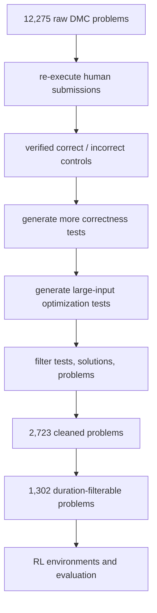

# Reinforcement Learning for Code Optimization：把“代码跑得快”变成可学习奖励

## 元信息与 TL;DR

- 论文：Reinforcement Learning for Code Optimization
- 作者：Pierre Chambon、Kunhao Zheng、Juliette Decugis、Benoit Sagot、Gabriel Synnaeve
- 时间：2026-07-28 提交到 arXiv
- 原文：https://arxiv.org/abs/2607.25970
- 类型：论文，125 页，主题是大模型代码后训练中的优化奖励设计
- 本文关注：作者不是证明“把运行时间塞进 reward 就行”，而是在证明相反结论：<u>运行时间只有经过数据、测量、奖励接口和 GRPO 稳定化四层处理后，才可能成为可学习信号</u>。

### TL;DR：这篇论文到底做了什么？

- 它研究的问题是：代码模型经过 RLVR 后会更会写“正确程序”，但不一定会写“高效程序”；在竞争编程与软件工程里，正确性和运行效率之间存在明显缺口。
- 作者构建 DMC-Optim：从 12,275 个 DeepMind Code Contests 问题出发，清洗后得到 2,723 个问题，并生成 430,215 个新 correctness tests 与 352,740 个 optimization tests。
- 论文把“快”定义成相对人类参考解的排行榜位置，而不是绝对秒数；核心指标 \(p_\tau\) 要求样本既正确，又不慢于人类参考榜的前 \(\tau\%\)。
- 原始 DMC 测试太短：最终 RL split 上原始测试均值只有 0.088 秒，p95/p99 只有 0.145/0.463 秒；几十毫秒扰动就足以改写 reward。
- 优化测试把 duration-filterable 问题比例从最多 3.8% 提到 48.2%，训练 split 的 p95/p99 时长从 0.145/0.463 秒提高到 1.296/3.710 秒。
- 仅把平均运行时间加进 reward 基本失败：Qwen 2.5 7B 的 naive duration reward 在 \(p_{50}\) 只从 18.0 提到 18.9 或 21.7，而且会损失纯正确性。
- 最好的 Qwen 2.5 7B 后执行 per-test percentile top 30% 设置，把 DMC-Optim \(p_{50}\) pass@1 从 18.0 提到 31.3，把 \(p_{30}\) 从 7.7 提到 19.1。
- 跨模型上，CWM 32B 的 \(p_{50}\) 从 30.7 提到 50.4，\(p_{30}\) 从 13.7 提到 30.9；LCB 上 CWM 32B 最高达到 83.0% median-sample speed win rate。
- 局限很明确：任务仍是单文件 Python 竞争编程；依赖人类参考速度分布、远程执行服务 CES、昂贵 GRPO 训练和 GPT-OSS 辅助分类；还没有覆盖仓库级 profiling、多语言系统代码和长程编辑循环。

## 研究问题：为什么“正确代码”不等于“高效代码”？

### 作者先拆掉一个直觉：运行时间不是天然 reward

- 标准代码 RLVR 的信号很干净：
  - 模型生成程序；
  - 隐藏测试运行；
  - 全部通过则奖励；
  - 失败则不给奖励。
- 代码优化 RL 看似只多一步：
  - 正确程序更快，reward 更高；
  - 正确程序更慢，reward 更低。
- 但作者指出这一步把 verifier 变成了 measurement instrument：
  - verifier 只需要判定对错；
  - timing reward 需要可靠区分“同样正确但速度不同”的程序；
  - sandbox 负载、timeout、输入规模、参考解分布都会污染 reward。

### 论文的真实问题不是“能不能跑快”，而是“快能不能被学到”

| 层级 | 作者提出的问题 | 如果失败会怎样 |
|---|---|---|
| 数据 | 测试是否能同时拒绝错误解、放大运行时差异？ | 模型学到的是通过弱测试，而不是优化算法 |
| 测量 | sandbox 是否能稳定比较毫秒到秒级差异？ | 同一程序在不同负载下拿到不同 reward |
| 奖励 | 正确性和速度如何组合？ | fast-but-wrong 程序拿到部分奖励，正确性塌陷 |
| 训练 | GRPO 能否承受 sparse/noisy timing reward？ | zero-advantage group 增多，梯度变成噪声 |
| 评估 | 速度指标是否能跨问题公平比较？ | 0.1 秒问题和 5 秒问题被错误标尺混在一起 |

### 研究空白在哪里？

- 现有代码 RLVR 已证明 execution-based correctness reward 可用。
- 代码优化相关工作通常分成两类：
  - 编译器或程序变换场景，优化对象更固定；
  - inference-time search 或 edit-based 场景，可以试错、重跑、选择候选。
- 本文设置更难：
  - 从自然语言题面一次性生成完整程序；
  - 训练时用执行反馈；
  - 推理时不提供执行反馈；
  - 评价时要求正确程序进入人类参考速度榜的指定百分位。
- 这个设定更接近后训练中的核心问题：模型权重是否真的吸收了优化能力，而不是只在测试时搜索更快候选。

## 论文主张与论证路线

### claim → mechanism → evidence → boundary

| Claim | Mechanism | Evidence | Boundary |
|---|---|---|---|
| 原始测试不能提供优化信号 | DMC-Optim 分离 correctness tests 与 optimization tests，并筛 duration-filterable 问题 | 原始 tests 最多 3.8% 问题可区分时长；optimization tests 达到 48.2% | 仍是竞争编程输入输出任务，不代表仓库级性能分析 |
| 本地 sandbox 不能作为 timing reward 来源 | 用 CES 隔离执行；用 affine correction 校准服务状态漂移 | 本地 timing 平均移动 41.2 个 percentile points；36,660 对 local/CES durations 的拟合交叉验证 \(R^2\) 为负 | CES 不是绝对真值，只是比 worker-local timing 更可控 |
| naive raw-duration reward 不足以训练优化能力 | 将速度 reward 放到 correctness gate 后，对比 base tests 与 optimization tests | Qwen 2.5 7B base raw-duration \(p_{50}\) 只到 18.9；optimization tests linear 到 21.7 但 \(p_{100}\) 从 46.9 降到 43.1 | 说明“有信号但形状不对”，不是说运行时反馈无价值 |
| 后执行 ranking 是更干净的训练/评估接口 | 候选执行后插入人类参考分布，按 per-test percentile 或 leaderboard percentile 给信号 | Qwen 2.5 7B per-test top 30%：\(p_{50}=31.3\)，\(p_{30}=19.1\) | 依赖固定人类参考池；极端 top-decile 对校准敏感 |
| GRPO 需要为 sparse timing reward 改造 | 增加同题 rollout、扩大 batch、去掉 std normalization、固定 token horizon、过滤 stale contexts | 论文报告 batch 扩大给 \(p_{50}\) 最多 35% 提升，\(p_{30}\) 最多 60% 提升；stale 过滤给 5% gain | 改造与大规模 H100 训练绑定，低资源复现难 |
| 模型学到的不只是 I/O 小技巧 | 速度胜出样本由 GPT-OSS 120B 多次判别分类 | optimization-RL 对 RLVR 的速度胜出对中，47% 是 I/O，34% constant-factor，6% algorithmic，13% classified pairs 有 complexity improvement | 分类依赖 LLM judge；22% 速度胜出未能分类 |

## 方法机制：DMC-Optim 如何把时间变成可测对象？

### 数据流不是“拿 DMC 直接训练”



### 为什么要分 correctness tests 和 optimization tests？

- correctness tests 的职责：
  - 判定程序语义是否正确；
  - 降低 false positive；
  - 避免错误解被速度 reward 放大。
- optimization tests 的职责：
  - 放大输入规模；
  - 让正确解之间出现可测时长差；
  - 为人类参考解建立速度分布。
- 两者不能混为一谈：
  - 小测试很适合快速判错；
  - 大测试更适合暴露复杂度差异；
  - 如果只用小测试，运行时间接近噪声底；
  - 如果只用大测试，训练成本和 timeout 噪声会急剧上升。

### duration filterability 是一个关键筛子

作者用 verified-correct human runtimes 的 robust coefficient of variation 作为问题级筛选：

```text
给定问题 x 的一组正确人类参考解 H
给定 optimization tests 上的平均运行时间 d_h
如果 robust_CV({d_h | h in H}) >= 0.3
则认为该问题 duration-filterable
否则该问题很难为 timing reward 提供稳定区分信号
```

| 指标 | 原始 DMC tests | DMC-Optim optimization tests | 含义 |
|---|---:|---:|---|
| 可区分问题比例 | 最多 3.8% | 48.2% | 大输入测试显著增加速度差异 |
| train split p95 时长 | 0.145s | 1.296s | 从毫秒噪声区进入可比较区间 |
| train split p99 时长 | 0.463s | 3.710s | 更容易区分快慢算法 |
| non-filterable 替换影响 | ranked \(p_{30}\) 在 \(p_{30}\) 降 43.5% | duration-filterable pool 明显更强 | 过滤不是装饰，而是训练信号来源 |

### 这里的研究含义

- 作者不是简单扩 benchmark，而是在定义 reward 的测量前提。
- 如果测试集合不能让正确解之间产生稳定速度分布：
  - ranking reward 会退化成随机比较；
  - timeout reward 会变成硬币；
  - GRPO group 内样本更容易全部同分。
- 对后训练来说，数据筛选不是“评估集清洁度”问题，而是 reward 可微近似的前置条件。

## 执行测量：为什么本地 sandbox 会毁掉优化 RL？

### 本地执行在 correctness RLVR 中够用，在 timing RL 中不够

- correctness-only RLVR 只关心：
  - 程序是否退出；
  - 输出是否匹配；
  - 是否超过大 timeout。
- timing reward 还关心：
  - 同一程序重跑是否排序稳定；
  - 不同程序差异是否大过 sandbox 抖动；
  - 训练 worker 的推理负载是否污染 CPU timing。

### 论文给出的本地 sandbox 失败证据

| 现象 | 数字 | 解释 |
|---|---:|---|
| 同代码重跑 ranking 漂移 | 平均 41.2 percentile points | 同一程序看起来忽快忽慢 |
| local/CES duration 映射 | 36,660 对数据拟合，CV \(R^2<0\) | 不是简单 scale factor 能校正 |
| 0.1s timeout 下 local pass@1 膨胀 | 最高 50.3× | local 速度把任务推进亚 0.1s 噪声区 |
| local duration-filterable 比例 | 81.1% vs CES 48.2% | local 可能注入额外“假 spread” |
| usable timing coverage | local 93.3% vs CES 99.2% | 缺失格不是中性噪声 |

### CES 的角色

- CES 是 dedicated remote sandboxed execution service。
- 它给每个 code-test pair 固定资源包：
  - 1 GB memory；
  - 10s hard limit；
  - 独立于 GPU training worker 的 CPU 执行；
  - 返回 status 与 duration。
- CES 仍会有服务状态漂移，所以作者还做 affine correction。
- 校准效果：
  - stored-vs-fresh Spearman 从 0.54 提到 0.96；
  - 表明参考 duration 可以被重新映射到当前服务状态；
  - 但严格 \(p_{10}\) 仍对校准参数敏感。

### 对 Agent / 后训练系统的直接提醒

- 如果要把“工具执行时间”“浏览器动作耗时”“CI 运行耗时”作为 Agent reward：
  - 不能让 reward 直接来自拥挤 worker；
  - 不能把 fallback backend 与主 backend 混合比较；
  - 不能只记录 pass/fail 而不记录 duration provenance；
  - 需要把 execution environment 视为 reward model 的一部分。

## 奖励接口：\(p_\tau\) 如何把“快”定义成相对人类分布？

### 评估指标先于 reward 设计

作者定义的 \(p_\tau\) 不是“运行时间低于某个绝对秒数”，而是：

- 先检查 strict correctness；
- 再把生成解插入同题人类参考解速度榜；
- 如果它进入前 \(\tau\%\)，才算满足优化约束。

公式可以写成：

```math
m_{\tau}(x)=
\sum_{i=1}^{n}
\mathbf{1}\{\tilde c_{\mathrm{cor}}(x,y_i)=1
\wedge q_{\mathrm{lead}}(x,y_i)\le \tau/100\}
```

```math
\mathrm{pass@}k(p_{\tau})=
\frac{1}{|\mathcal X|}
\sum_{x\in\mathcal X}
\left(
1-\frac{\binom{n-m_{\tau}(x)}{k}}{\binom{n}{k}}
\right)
```

变量解释：

- \(x\)：一个编程问题；
- \(y_i\)：模型为问题 \(x\) 采样的第 \(i\) 个程序；
- \(\tilde c_{\mathrm{cor}}\)：严格正确性门；
- \(q_{\mathrm{lead}}\)：生成程序插入人类参考榜后的 percentile，越小越快；
- \(p_{100}\)：只要求正确，等价于 pure correctness；
- \(p_{50}\)：要求正确且进入人类参考速度的前半；
- \(p_{10}\)：要求正确且接近顶尖人类速度区间。

### 三类 optimization environment

| 介入点 | 做法 | 优点 | 风险 |
|---|---|---|---|
| pre-execution | 执行前过滤 optimization tests，例如按人类平均耗时筛大测试 | 可以减少不稳定尾部，成本更可控 | 可能压力太弱，无法区分强弱解 |
| intra-execution | 执行中设置 absolute / relative / ranked timeout | 约束直观，和“必须在时间内完成”一致 | timeout 太严会切断全部学习信号 |
| post-execution | 执行后按人类参考分布 ranking | 同一次 duration 可复用，多阈值可回放 | 需要参考解分布和校准，极端 percentile 敏感 |

### reward-facing interface：三个量 \((c,g,q)\)

- \(c\in\{0,1\}\)：correctness gate。
- \(g\in\{0,1\}\)：optimization gate，例如是否进入 top 30%。
- \(q\in[0,1]\)：graded quality signal，例如 percentile quality。

这三个量可以组合成不同 reward：

| Reward 形状 | 机制 | 论文观察 |
|---|---|---|
| correctness-only | 只奖励通过测试 | 提升正确性，但严格速度指标掉得很快 |
| optimization-only | 只看速度约束 | 容易 policy collapse |
| additive blend | 正确性和速度加权相加 | fast-but-wrong 可拿部分奖励，损失正确性 |
| multitask | 正确与优化轮流训练 | 没有真正突破 Pareto front |
| two-gate | 先正确，再给优化分 | 更稳，但 continuous 版本受 timing noise 影响 |
| collapsed binary | 正确且优化同时满足才给正向信号 | 最稳定，顶层结果主要用它 |

### 离线 simulator 的意义

- 在线 GRPO 很贵：
  - 7B RL run 需要 8 个 H100 节点约一天；
  - 32B RL run 需要 32 个 H100 节点约一天半。
- 作者先用 offline simulator 筛掉坏环境：
  - 固定 reward computation；
  - 用 human solutions 替代模型生成；
  - 用预计算 CES durations 替代 live execution；
  - 看更强样本是否获得更好 reward；
  - 同时检查 reward 是否过稀疏、过饱和或太平。
- 关键诊断包括：
  - AUC：reward curve 是否稀疏或饱和；
  - steepness：强弱样本是否被区分；
  - monotonicity：更好解是否真的拿更高分；
  - deviation from \(y=x\)：模拟排序与理想排序的偏离。

## GRPO 稳定化：为什么后训练配方也要改？

### timing reward 带来的训练病灶

- sparse：多数 rollout 不是全错，就是全没进优化阈值；
- noisy：执行时间会随 sandbox 状态波动；
- zero-advantage：同一 prompt 的 rollouts 全同分，GRPO 没有有效组内比较；
- stale reward：旧 rollout 的 timing 与当前 sandbox 状态不完全可比；
- length bias：长推理错误轨迹如果按自身长度归一，惩罚不够。

### 作者的稳定化配方

| 改造 | 作用 | 论文中的证据或理由 |
|---|---|---|
| 增加 same-prompt rollouts | 减少 zero-advantage groups，提高 Monte Carlo advantage 质量 | 初期 binary optimization reward 的 zero-advantage-context rate 可到 40-50% |
| 增大 trainer batch | 平滑 timing noise 下的梯度估计 | \(p_{50}\) 最多 +35%，\(p_{30}\) 最多 +60% |
| 只中心化，不除以 group std | 避免难题或噪声单点被过度放大 | 参考 Dr. GRPO 的 difficulty bias 分析 |
| fixed token horizon \(N=32768\) | 纠正按 rollout length 归一的偏差 | 长错误轨迹不再被轻惩罚 |
| 丢弃过旧 contexts | 降低 worker-side stale timing 混入 | 丢弃 \(S_{\max}=30\) steps 以上 context，约 +5% gain |
| 不用 replay buffer | 避免复用旧 sandbox 状态下的 reward | timing reward 不是可长期缓存的静态标签 |

### 伪代码：论文训练循环可以这样理解

```text
Input:
  prompts from DMC-Optim train
  policy πθ
  execution backend CES
  reward environment E(c, g, q)

State:
  rollout queue Q
  current sandbox calibration κ
  max stale steps S_max = 30
  token horizon N = 32768

Loop for optimizer step t:
  1. Workers sample G solutions per prompt from πθ
  2. CES executes correctness tests and optimization tests
  3. Environment E converts status + duration into reward r
  4. Trainer drops contexts where t - collection_step > S_max
  5. For each prompt group:
       center returns within group
       do not divide by group standard deviation
       compute token-weighted prompt mean baseline
  6. Pack tokens up to fixed horizon N
  7. Apply clipped GRPO loss

Output:
  policy that preserves p100 correctness while improving stricter pτ speed scores

Failure boundary:
  if all samples fail correctness or all miss the optimization gate,
  the group gives no useful advantage signal.
```

## 实验设置与主结果

### 模型与训练规模

- 模型：
  - Qwen 2.5 7B；
  - Qwen 2.5 32B；
  - CWM 32B。
- Qwen SFT：
  - 用 OpenCodeReasoning-2 和 OpenMathReasoning 的 reasoning-only mix；
  - 对 DMC、LCB、BigO(Bench)、DMC-Optim test 和 RL prompts 做 decontamination；
  - 7B 用 16 个 H100 节点；
  - 32B 用 32 个 H100 节点；
  - sequence length 32,768；
  - 每 optimizer step 约 2,097,152 packed tokens；
  - 24,829 steps，总计 52.1B packed training tokens。
- 主 RL：
  - 10,000 optimizer steps；
  - temperature 1.0；
  - no top-p truncation；
  - 7B learning rate \(1\times10^{-7}\)；
  - 32B learning rate \(1.4\times10^{-7}\)；
  - 16 samples per prompt；
  - average 10,000 tokens per rollout；
  - 每 global batch 约 480,000 tokens，相当于约 3 个问题 × 16 条轨迹。

### Qwen 2.5 7B：naive reward 与最佳环境的差距

| 配置 | \(p_{100}\) | \(p_{50}\) | \(p_{30}\) | \(p_{10}\) | 解释 |
|---|---:|---:|---:|---:|---|
| Standard RLVR | 43.5 | 18.0 | 7.7 | 1.9 | 正确性提升，但速度严格化后急跌 |
| MC + optimization tests | 46.9 | 20.6 | 9.3 | 2.7 | 数据变好有帮助，但还不是优化 RL |
| Raw duration on optimization tests, linear | 43.1 | 21.7 | 10.9 | 3.6 | 严格速度略升，纯正确性掉到 43.1 |
| Absolute filter 2s | 46.9 | 29.2 | 17.4 | 5.7 | pre-execution 约束开始有效 |
| Absolute timeout 0.5s | 47.3 | 29.4 | 17.5 | 5.5 | intra-execution 可用但调参敏感 |
| Per-test percentile top 30% | 46.2 | 31.3 | 19.1 | 6.0 | 最强 \(p_{50}/p_{30}\) pass@1 |

关键判断：

- 数据增强让 \(p_{100}\) 从 43.5 到 46.9，但 \(p_{50}\) 只到 20.6。
- raw-duration reward 把 \(p_{50}\) 推到 21.7，却牺牲 correctness。
- 后执行 per-test percentile top 30% 在 \(p_{100}\) 仍有 46.2，同时把 \(p_{50}\) 推到 31.3。
- 这说明有用的 reward 不是“秒数越小越好”，而是“正确程序在同题参考分布中的相对位置”。

### 跨模型结果：不是 7B 特例

| 模型 | Baseline \(p_{50}\) | 最佳/核心 \(p_{50}\) | Baseline \(p_{30}\) | 最佳/核心 \(p_{30}\) | 备注 |
|---|---:|---:|---:|---:|---|
| Qwen 2.5 7B | 18.0 | 31.3 | 7.7 | 19.1 | per-test top 30% 最强 |
| Qwen 2.5 32B | 21.1 | 39.6 | 9.4 | 24.2 | \(p_{50}\) 相对提升 88%，\(p_{30}\) 相对提升 157% |
| CWM 32B | 30.7 | 50.4 | 13.7 | 30.9 | \(p_{30}\) 相对提升约 126% |

### LCB 迁移：timeout 指标不可靠，win rate 更合适

- LCB 测试较短，timeout sweep 对训练配置区分度弱。
- 作者改用 speed win rate：
  - WR\(_b\)：最快 passing sample 的速度胜率；
  - WR\(_m\)：median passing sample 的速度胜率；
  - 与同模型 family 的 standard RLVR 比较。

| 配置 | Qwen 2.5 7B WR_m | Qwen 2.5 32B WR_m | CWM 32B WR_m | 解释 |
|---|---:|---:|---:|---|
| MC + opt. tests | 62.1 | 72.5 | 69.3 | 数据增强已有迁移 |
| Absolute filter 0.5s | 65.3 | - | 83.0 | CWM 32B 最强 median win |
| Per-test top 50% | 73.0 | 73.4 | 80.7 | Qwen 7B median win 最强 |
| Per-test top 30% | 68.5 | 72.9 | 82.9 | 与 DMC-Optim 主结果一致性强 |

LCB 结果的边界：

- pass@1 在部分配置会下降；
- hard split 上 top-50/top-30 post-execution training 把 pass@1 从 29.8 降到约 25.7-25.8；
- 但 hard problem 的 median win rate 可到 86.0%，说明模型确实偏向更快解；
- 这不是无代价提升，而是 correctness / speed / interface-following 的再平衡。

## 消融、失败案例与 Figure/Table 证据

### Table 1/2 类证据：baseline 为什么不够？

- Standard RLVR 的 \(p_{100}\) 到 43.5，但 \(p_{30}\) 只有 7.7。
- MC + optimization tests 让 \(p_{100}\) 到 46.9，\(p_{30}\) 到 9.3。
- raw-duration reward 在 optimization tests 上让 \(p_{30}\) 到 11.1，但 \(p_{100}\) 降到 42.5。
- 这组表不是只报告结果，而是在论证：
  - 数据增强解决部分测量问题；
  - raw duration 引入部分速度压力；
  - 但 reward 形状错误时，速度压力会沿 correctness-efficiency Pareto front 移动，而不是突破它。

### Figure：offline simulator 为什么重要？

- 图中每个点是一个候选 environment configuration。
- 横轴/纵轴用 AUC、steepness、monotonicity 等诊断解释 reward curve。
- 作者报告 strict \(p_{30}\) 后续结果与若干 ordering diagnostics 显著相关：
  - deviation from \(y=x\)：\(r_s=-0.832\)，\(p=2\times10^{-5}\)；
  - raw monotonicity：\(r_s=0.787\)，\(p=10^{-4}\)；
  - steepness：\(r_s=0.723\)，\(p=7\times10^{-4}\)；
  - curve noise 在 \(p_{30}\) 不预测结果：\(r_s=-0.002\)，\(p=0.994\)。
- 这说明 simulator 不是为了“模拟 RL 曲线”，而是为了筛掉 reward 与 solution quality 无单调关系的环境。

### Table：环境家族的成败

- 成功家族：
  - absolute duration filter 2s；
  - ranked-worst timeout from \(p_{80}\)；
  - per-test percentile top 50% / top 30%。
- 失败或弱家族：
  - relative timeout ablations；
  - absolute duration filter 0.1s；
  - character-length filter 1k chars。
- 解释：
  - 约束太松时，reward 不区分强弱；
  - 约束太严时，所有 rollout 都失败；
  - 相对 timeout 容易全局改变难度，却不能清楚区分训练配置；
  - post-execution ranking 的优势是同时具备可回放、可调阈值和较强区分度。

### 学到了什么代码优化？

作者用 CWM 32B 的 optimization-RL、CWM 32B RLVR baseline 与最快人类 Codeforces 解做比较：

- 在 optimization-RL vs RLVR 的 302 个问题中：
  - 39 个两边都无 passing sample；
  - 12 个只有一边有 passing sample；
  - 27 个 best passing samples 速度打平；
  - 剩下 224 对有速度胜负；
  - optimization-RL 在 200 对中更快。
- 经 GPT-OSS 120B 多次判别后，174 个条目可分类。
- 分类结果：
  - 47%：I/O optimization；
  - 34%：constant-factor tweaks；
  - 6%：algorithmic improvement；
  - 6%：math shortcut；
  - 2%：data-structure change；
  - 1%：full algorithm change；
  - 13% classified pairs 被判为 complexity improvement。

边界要一起看：

- GPT-OSS 的 speed-identification accuracy 是 68%；
- human-vs-optimization-RL 差异更紧时降到 59%；
- 22% 的 optimization-RL vs RLVR speed wins 未能分类；
- 作者人工复核 classifiable entries，complexity categorization accuracy 为 94.8%；
- 因此“学到算法改进”是有证据但仍有限的结论。

## 相关工作与位置判断

### 它和传统代码优化 RL 有什么不同？

- 传统 compiler optimization RL 通常面对更结构化的动作空间：
  - pass ordering；
  - loop transformation；
  - polyhedral optimization；
  - compiler flag selection。
- 本文面对的是 LLM code generation：
  - 输入是自然语言题面；
  - 输出是完整 Python 程序；
  - 不给模型明确的 pass/action set；
  - reward 只来自执行结果和速度分布。
- 因此它不是编译器控制策略论文，而是后训练论文：
  - 训练对象是生成策略；
  - reward 设计必须避免 fast-but-wrong；
  - 评估必须区分 correctness 与 optimization。

### 它和 SWE-RL / Agent 后训练有什么关系？

- SWE-RL 类工作说明 RL 可以迁移到真实软件任务，但执行真实仓库很贵。
- 本文选择竞争编程作为 playground：
  - execution cheap enough；
  - hidden tests 和人类提交丰富；
  - 可以严格研究 timing reward。
- 但作者也指出，真实 SWE 更难：
  - profiling 比 input-output execution 贵；
  - repo-level correctness 不只是一组 stdout；
  - interface preservation 可能和速度冲突；
  - 长程 edit loop 会引入工具状态、缓存、CI 噪声。

### 对 AI 安全/Agent 评估的关联

- 这篇论文不是安全论文，但它对 Agent 安全评估有一个强提醒：
  - reward 的测量环境必须可审计；
  - 执行 provenance 必须进入指标解释；
  - 不同 backend 的 reward 不能直接混算；
  - stale state 会污染训练；
  - reward hacking 不一定来自模型恶意，也可能来自测量设计漏洞。
- 如果未来用 RL 训练 tool-use agent：
  - “更快完成任务”不能只看 wall-clock；
  - “更少 token”不能牺牲授权与验证；
  - “通过测试”不能覆盖安全约束；
  - collapsed binary gate 的思想可以迁移到安全边界：先满足 policy/correctness，再讨论效率。

## 证据边界、局限与可复现性

### 已经证明了什么？

- 在 DMC-Optim 这个受控竞争编程设置中：
  - timing reward 可以被训练；
  - 关键不是 raw duration，而是数据、测量、reward 和 GRPO 的组合；
  - 最强环境能显著提高严格人类速度百分位下的 pass@1；
  - 纯 correctness 大体保持稳定；
  - 跨 Qwen 2.5 7B、Qwen 2.5 32B、CWM 32B 仍成立。

### 没有证明什么？

- 没有证明仓库级软件优化可以直接复用这套指标。
- 没有证明模型已经接近顶尖人类算法优化能力。
- 没有证明所有 reward 都能从固定人类参考分布泛化。
- 没有证明 timing reward 在低成本、低隔离、本地 worker 执行中可用。
- 没有证明 interface-preserving code generation 会自动保持；LCB 中模型会移除 wrapper 和 method dispatch 这类 benchmark harness 需要但运行较慢的结构。

### 可复现性难点

| 难点 | 为什么重要 |
|---|---|
| DMC-Optim 数据构建 | 需要大量人类解重跑、测试生成、错误/正确控制样本 |
| CES 执行服务 | timing reward 的可信度绑定执行环境 |
| 大规模 GRPO | 7B/32B 训练成本很高 |
| 人类参考 duration | post-execution ranking 依赖固定参考池 |
| 校准参数 | strict \(p_{10}\) 对 affine correction 很敏感 |
| LLM judge 分类 | 代码优化类别分析依赖 GPT-OSS 多次判别 |

## 领域延伸：下一步真正值得追问什么？

### 1. 能否从“人类参考池”走向“动态参考分布”？

- 当前 ranking reward 的强点是相对同题人类分布。
- 弱点也是固定分布：
  - 新任务没有足够人类高速解；
  - 参考池可能覆盖不了新算法；
  - 顶端 percentile 容易饱和。
- 后续可以追问：
  - 用模型自博弈生成 reference ladder 是否可行？
  - 用 value model 预测 complexity class 是否能减少执行次数？
  - 能否 adversarially refine tests，让模型不能只学 I/O trick？

### 2. 如何把 reward 从“更快”拆成“为什么更快”？

- 论文的分类显示，当前模型主要学到：
  - I/O optimization；
  - constant-factor tweaks；
  - 少量 math shortcut / algorithmic refinement。
- 如果目标是 algorithm discovery：
  - reward 只看 duration 可能把大量梯度花在表层优化上；
  - 需要区分复杂度改进、数据结构选择、数学剪枝、实现常数优化。
- 可行方向：
  - execution reward + complexity classifier；
  - generated tests + asymptotic stress tests；
  - code-diff judge 只作为辅助，不替代 execution；
  - 对 I/O trick 设置上限，给算法性改进更强 credit。

### 3. Agent 任务中能否使用类似 collapsed gate？

- Agent reward 往往多目标：
  - 完成任务；
  - 遵守权限；
  - 不泄露数据；
  - 成本低；
  - 速度快。
- additive reward 很容易出错：
  - 违规但快的行为拿部分分；
  - 错误但省 token 的轨迹被偏好；
  - 未验证但看起来完成的轨迹被奖励。
- 本文给出的启发是：
  - correctness / policy / safety 先做 hard gate；
  - 只有通过 gate 后，效率指标才进入 reward；
  - 对 noisy efficiency signals 做 bucket 或 binary 化；
  - 对 stale tool state 和 backend provenance 做过滤。

### 4. 仓库级软件优化需要哪些额外机制？

- 单文件 Python 到真实仓库至少增加四类难题：
  - profiling 目标多：CPU、内存、I/O、延迟、吞吐；
  - correctness 多层：unit tests、integration tests、行为兼容；
  - 修改长程：多文件 diff、依赖更新、rollback；
  - 执行昂贵：CI 可能分钟级甚至小时级。
- 因此不能直接把 DMC-Optim 的 \(p_\tau\) 搬过去。
- 更合理的路线：
  - 先在小型 repo benchmark 建立 calibrated execution；
  - 把 performance tests 与 correctness tests 分层；
  - 对 flaky benchmark 做 replayable trace；
  - 用 offline simulator 先筛 reward shape；
  - 再做小规模 online RL 或 rejection sampling。

### 5. 这篇论文对“可验证奖励”的更深一层提醒

- 代码 RLVR 常被概括成一句话：只要能运行测试，就能得到客观 reward。
- 本文把这句话拆成更严格的条件：
  - 测试必须足够强，否则错误程序会混进正样本；
  - 测试必须足够大，否则速度差异落在噪声区；
  - 执行必须足够隔离，否则 reward 反映的是 worker 负载；
  - 指标必须按问题归一，否则不同难度问题不可比较；
  - 优化目标必须被 correctness gate 包住，否则模型会学习捷径。
- 这意味着“verifiable reward”不是天然可信标签，而是一套测量协议。
- 对后训练研究来说，协议的每一层都应该可复查：
  - 哪些测试被用于 correctness；
  - 哪些测试被用于 optimization；
  - 每次执行来自哪个 backend；
  - duration 是否经过校准；
  - reward 是 binary、bucketed 还是 continuous；
  - stale rollout 是否被过滤。
- 如果缺少这些元数据，最终曲线即使上涨，也很难判断模型学到的是算法能力、I/O 模板、benchmark interface 偏好，还是执行环境偶然偏差。
- 因此本文的严谨处不只在实验规模，而在它把“奖励来源”从黑箱变成可审计对象。

### 6. 为什么 collapsed binary reward 在这里特别合理？

- 直觉上，continuous speed reward 更细腻，应该比 binary gate 更有信息。
- 论文结果却更支持 binary / bucketed：
  - continuous duration 容易把微小测时误差传给梯度；
  - additive reward 会让错误但很快的程序拿到部分信用；
  - optimization-only 会失去生成正确程序的基本能力；
  - multitask 只是轮流优化两个目标，不一定让同一个样本同时满足两个目标。
- collapsed binary reward 的保守性恰好是优点：
  - 错误程序没有速度信用；
  - 太慢程序没有优化信用；
  - 只有“正确且足够快”的轨迹成为正样本；
  - noisy duration 被阈值吸收一部分，不会把每个毫秒差都放大成梯度差。
- 它牺牲了部分连续信息，但换来更清楚的 credit assignment。
- 对安全相关 Agent 后训练也类似：
  - 未授权动作不能因为快而得分；
  - 未验证答案不能因为省 token 而得分；
  - 不满足隐私约束的轨迹不能因为任务完成而得分。
- 这不是简单的工程偏好，而是多目标 RL 中防止低优先级目标越权的一种结构化办法。

## 结论

- 这篇论文的核心价值不是“代码优化 RL 终于有效”，而是把有效条件拆清楚了。
- <u>执行时间不是 reward；经过测试设计、测量校准、参考分布归一化、正确性门控和稳定 GRPO 后，它才可能成为 reward。</u>
- 最值得记住的数字：
  - DMC-Optim：2,723 cleaned problems，1,302 duration-filterable problems；
  - 新测试：430,215 correctness tests，352,740 optimization tests；
  - Qwen 2.5 7B：\(p_{50}\) 18.0 → 31.3，\(p_{30}\) 7.7 → 19.1；
  - CWM 32B：\(p_{50}\) 30.7 → 50.4，\(p_{30}\) 13.7 → 30.9；
  - LCB：CWM 32B 最高 83.0% median-sample speed win rate；
  - 代码行为：optimization-RL 在 200/224 个有速度胜负的模型对比中快过 RLVR，但人类仍在 67% 人机速度胜负对中占优。
- 它对后训练研究的更大意义是：
  - reward design 不能脱离测量系统；
  - benchmark design 不能脱离训练稳定性；
  - Agent 与代码模型的效率目标必须先服从正确性和安全 gate；
  - 否则“更快”会变成最容易被噪声、捷径和错误程序利用的目标。
