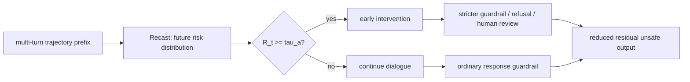
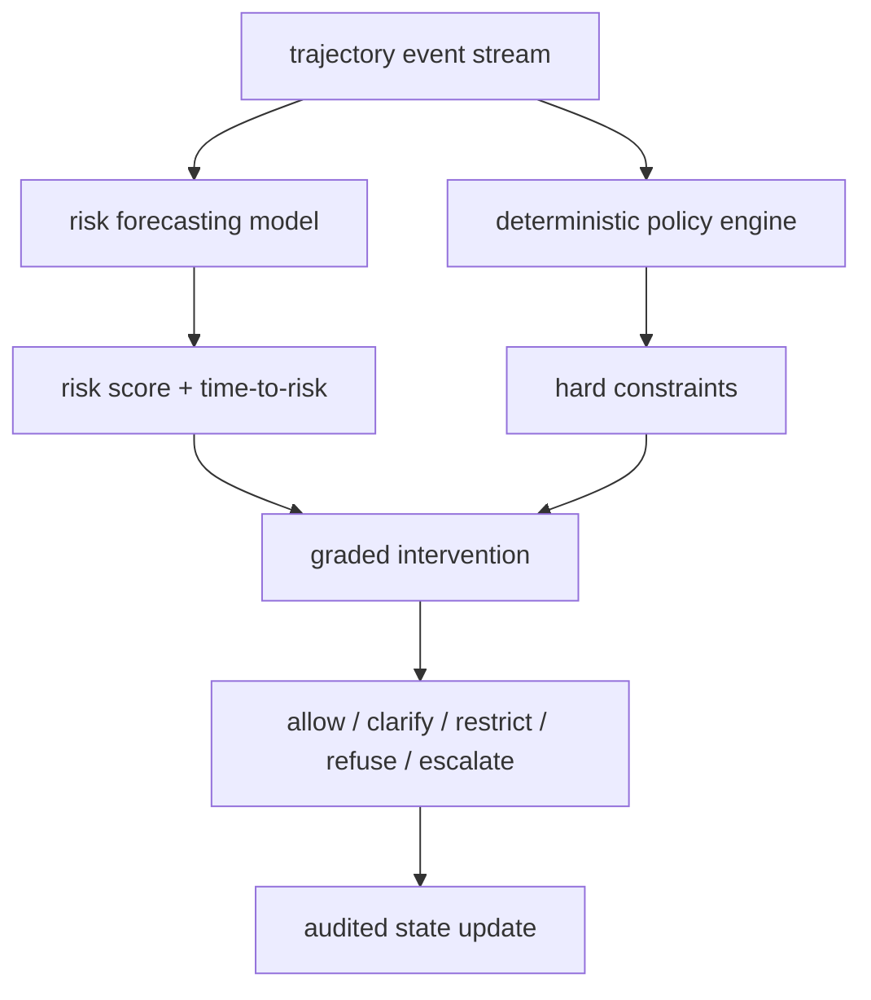

# Forecasting Trajectory-Level Safety Risks：把多轮安全从“事后检测”改成“提前几轮预警”

### 元信息

| 字段 | 内容 |
|---|---|
| 论文 | Forecasting Trajectory-Level Safety Risks in Black-Box Multi-Turn Interactions |
| 方法名 | Recast |
| 作者 | Shi Lin, Peng Qian, Dinghao Liu, Renjie Sun, Sifan Wu, Dezhang Kong, Chenpei Wang, Xun Wang |
| 机构 | Zhejiang Gongshang University, Shandong University, Hainan University, Zhejiang University |
| 版本 | arXiv:2607.26820v1 |
| 发布时间 | 2026-07-29 12:14:23 UTC |
| 方向 | AI 安全 / 多轮交互 / Agent 安全监控 |
| 原文 | [arXiv 摘要页](https://arxiv.org/abs/2607.26820)；[arXiv HTML](https://arxiv.org/html/2607.26820v1) |

### TL;DR

1. 这篇论文关心的是一个很具体的安全缺口：多轮交互里的风险常常不是在某一轮突然出现，而是由前几轮看似无害的信息逐步拼起来；如果安全系统只检查当前回答是否违规，它只能在违规已经显形后反应。
2. 作者提出 Recast，把问题改写成“轨迹级未来风险预测”：给定截至第 `t` 轮的黑盒对话轨迹，只看文本输入输出，不访问模型参数、logits、hidden states 或系统提示，预测未来 `H` 轮内是否会出现首次安全失败，以及大约会在第几轮出现。
3. Recast 的机制分三段：先用短期窗口捕捉最近对话方向变化，再用可学习 memory query 取回长程历史里被当前轮重新激活的证据；然后把短期证据、长期证据和二者逐元素交互合成风险状态，并显式建模状态转移；最后用 causal temporal encoder 输出未来失败时间分布。
4. 数据与实验上，作者构造 10,000 条轨迹，包含 5,000 harmful 与 5,000 benign，覆盖 7 类风险；测试集来自 AdvBench 与 SORRY-Bench，共 960 个 harmful behavior，攻击方法包括 seen 的 ActorAttack、Red Queen，以及训练外的 ICON、X-Teaming。
5. 主结果是：在 `H=3` 时，Recast 的平均 NLL 为 0.45，Expected-MAE 为 0.31，Early Warning Rate 为 88.3%，False Alarm Rate 为 12.3%，Mean Lead Turn 为 2.41；作为在线防御，平均攻击成功率从 71.5% 降到 45.9%，与 THRD 的 45.7% 接近，再叠加 Qwen3Guard-Gen-8B 后降到 40.4%。
6. 最关键的消融结论是：去掉风险状态转移会让 NLL 恶化 17.8%、EWR 下降 9.2%；去掉短期与长期证据的交互会让 Expected-MAE 恶化 22.6%、FAR 上升 58.5%。也就是说，论文真正证明的不是“多看历史就好”，而是“历史证据如何在当前轮被重组”和“这种重组如何随时间变化”很重要。
7. 局限也很清楚：训练轨迹是由公开攻击资源规范化、长度增强、hard benign 转换后得到；风险标签依赖预定义类别和首次失败标注；模型预测的是未来几轮内的分布，不等于理解真实用户意图；高风险类别如 Privacy Violation 的 FAR 达 24.6%，Cybersecurity 的 NLL/MAE 也最差，说明部署时必须做类别级阈值校准。

### 研究问题：为什么“当前轮检测”不够？

论文的入口不是又做一个 jailbreak 分类器，而是重新定义多轮安全问题。

作者的核心观察可以拆成四层：

| 层次 | 传统检测视角 | Recast 视角 | 安全含义 |
|---|---|---|---|
| 对象 | 当前 prompt 或当前 response | 截至当前轮的完整交互轨迹 | 风险是历史累积出来的 |
| 信号 | 是否已经违反政策 | 是否正在朝未来失败状态演化 | 需要提前干预窗口 |
| 证据 | 单轮文本或压缩历史 | 短期变化 + 长期被重激活的信息 | 不能只做历史摘要 |
| 输出 | 当前安全/不安全 | 未来 `1..H` 轮首次失败概率 | 阈值可按业务成本调节 |

这一区分很重要，因为多轮攻击或误用并不总是以明显恶意请求开头：

1. 前几轮可能只讨论背景、约束、工具、环境或“防护”话题。
2. 中间轮会把局部信息重新排列，让先前材料获得新的安全含义。
3. 最后一轮才把这些材料合成可执行的违规请求或可执行步骤。
4. 若系统只在最后一轮拒绝，就已经错过了更温和的澄清、降级、人工复核或上下文切断机会。

论文的问题定义因此是：

> 在黑盒多轮交互中，只观察文本轨迹，能否在违规发生前预测未来风险首次出现的时间分布？

这里“黑盒”不是装饰词。它限定了 Recast 不依赖目标模型内部状态，因此更像运行时旁路监控器：

1. 它可以挂在不同 LLM、Agent 或聊天系统之外。
2. 它不要求供应商暴露 logits、hidden states 或安全策略。
3. 它也因此失去了一部分内部意图与不确定性信号，只能从轨迹文本里重建风险演化。

### 论文主张与论证路线

作者用 claim -> mechanism -> evidence -> boundary 的方式推进。

| Claim | Mechanism | Evidence | Boundary |
|---|---|---|---|
| 多轮安全风险是轨迹级现象，不是单轮违规标签 | 把首次失败轮 `t*` 和剩余时间 `d_t=t*-t` 作为预测目标 | 引言与问题定义把风险描述为跨轮语义组合 | 仍依赖预定义“安全失败”标签，不能覆盖未知政策体系 |
| 风险证据有短期与长期两种时间尺度 | local transformer 捕捉邻近轮变化；memory queries 取回长程历史 | 去掉短期或长期模块都会降低 EWR、提高误报 | 论文没有证明 memory slot 学到可人工命名的因果因素 |
| 风险不是证据相加，而是证据组合 | 拼接 `e_loc`、`e_mem` 和二者逐元素乘积 | 去掉 cross-path evidence 后 Expected-MAE 恶化 22.6%，FAR 上升 58.5% | 乘积交互是有效归纳偏置，但不是唯一组合方式 |
| 时间转移本身提供预测信号 | 对证据组件做 signed difference，构造 transition representation | 去掉 risk state transition 后 NLL 恶化 17.8%，EWR 下降 9.2% | 转移表示只来自相邻状态差分，对更复杂的策略跳跃可能不够 |
| 预测分布能转成在线预警 | 输出未来 `H` 轮首次失败分布，再用 `R_t=1-P(d_t>H)` 触发阈值 | `H=3` 时 EWR 88.3%、FAR 12.3%、MLT 2.41；ASR 从 71.5% 降到 45.9% | 阈值选择会在提前量、覆盖率和误报之间移动 |

### 形式化：Recast 到底在预测什么？

论文把多轮交互写成：

```text
第 i 轮:
  用户请求: u_i
  模型回答: a_i

截至第 t 轮轨迹:
  tau_<=t = [(u_1, a_1), ..., (u_t, a_t)]
```

令 `t*` 表示首次出现预定义安全风险的轮次。对任意风险发生前的轮次 `t < t*`：

```text
d_t = t* - t
```

含义是：

1. `d_t=1`：下一轮就会出现风险。
2. `d_t=2`：再过两轮出现风险。
3. `d_t>H`：预测窗口内不会出现风险，或者真实失败在更远处。

模型学习的不是一个二分类标签，而是一个离散分布：

```text
F(tau_<=t) -> pi_t

pi_t = [pi_t(1), pi_t(2), ..., pi_t(H), pi_t(>H)]
```

变量解释：

| 符号 | 含义 | 为什么重要 |
|---|---|---|
| `tau_<=t` | 当前可见的历史对话 | 黑盒监控器唯一输入 |
| `H` | 预测 horizon | 决定提前看几轮 |
| `pi_t(h)` | 风险恰好在 `h` 轮后出现的概率 | 区分“很快失败”和“远期可能失败” |
| `pi_t(>H)` | 预测窗口内没有失败的概率 | 预警分数的反面 |
| `R_t` | `1 - pi_t(>H)` | 在线触发阈值的风险分数 |

作者在附录里把 early warning 指标也写清楚：

```text
R_t = 1 - pi_t(H + 1) = sum_{h=1..H} pi_t(h)
```

这意味着 Recast 的报警不是“当前回答违规”，而是：

1. 当前轨迹继续发展下去；
2. 在未来 `H` 轮内；
3. 首次安全失败出现的概率超过阈值 `tau_a`。

这个目标比普通 guardrail 更难，也更有部署意义。难点在于模型必须从尚未违规的前缀里读出风险配置；意义在于它能把干预从“拒绝最后一句”前移到“上下文刚开始组合危险目标”的阶段。

### 方法机制一：双尺度历史证据检索

Recast 第一段不是直接把所有历史丢进 classifier，而是构造两条证据路径。

#### 1. turn representation

每一轮先把用户请求和模型回答编码到共享语义空间：

```text
v_i = Enc(u_i, a_i) + p_i
```

含义：

1. `Enc` 是预训练文本编码器，实验里使用 frozen `bge-large-en-v1.5`，得到 1024 维表示。
2. `p_i` 是位置嵌入，让模型知道这段内容发生在第几轮。
3. 输入包含用户请求和模型回答，因此 Recast 观察的是交互结果，而不是只观察用户意图。

#### 2. short-term progression

作者认为近期对话方向变化很关键，所以把相邻轮差分加入局部建模：

```text
L_<t = LocalTr_w([
  v_i;
  v_i - v_{i-1};
  v_{i+1} - v_i
] for i=1..t-1)
```

这一步的作用不是简单“看最近几轮”，而是看最近轨迹方向是否发生了安全意义上的漂移：

1. 如果用户从概念讨论转向条件收集，差分可能捕捉到语义方向改变。
2. 如果模型回答开始提供更具体的操作性材料，差分会把这种递进显式暴露出来。
3. `LocalTr_w` 限制注意力窗口，减少长历史噪声，让短期进展更突出。

#### 3. long-term historical context

局部窗口的弱点是容易忘掉早期埋下的条件。作者引入 `K` 个可学习 memory query：

```text
M_<t = MHAttn(Q_mem, L_<t, L_<t)
```

这一步的意义：

1. memory slot 不是人工写的规则，而是学习到的查询向量。
2. 它会从历史里取回对风险预测有帮助的不同信息片段。
3. 它处理的是“早期信息在当前轮被重新激活”的情况。

#### 4. cross-path retrieval

当前轮 `v_t` 会分别查询短期路径和长期 memory：

```text
e_loc_t = f(v_t + MHAttn(v_t, L_<t, L_<t))
e_mem_t = f(v_t + MHAttn(v_t, M_<t, M_<t))
```

这一步解决了一个细微但重要的问题：

1. 历史信息本身不是固定风险。
2. 同一句历史内容，在不同当前轮下可能有不同安全含义。
3. 用当前轮做 query，可以让历史证据变成 context-dependent evidence。

举例说，前文讨论“车辆防盗”可能是 benign；但当前轮若开始询问“如何绕开某个防护设计”，同一段历史就被重新解释为更接近 theft procedure 的先验条件。

### 方法机制二：风险状态不是证据堆叠，而是组合结构

取回 `e_loc_t` 与 `e_mem_t` 后，Recast 构造 compositional risk state：

```text
s_t = phi_state([
  e_loc_t;
  e_mem_t;
  e_loc_t * e_mem_t
])
```

这里的 `*` 是逐元素乘法，也就是论文里的 element-wise conjunction。

这个设计的论证意义是：

| 组件 | 代表什么 | 如果缺失会怎样 |
|---|---|---|
| `e_loc_t` | 当前附近几轮的风险方向 | 模型可能错过即将发生的变化 |
| `e_mem_t` | 被当前轮重激活的长期历史 | 模型可能把早期铺垫当噪声 |
| `e_loc_t * e_mem_t` | 两种证据是否在同一语义维度上共振 | 模型只能并列看证据，难以识别组合风险 |

论文最值得注意的地方在于，它没有把风险理解成若干关键词出现次数，而是把风险理解为配置：

1. 单个证据片段可能无害。
2. 两个片段一起出现可能仍无害。
3. 但当当前轮把长期片段和短期方向绑定到同一个行动目标时，风险配置才成立。

这也是多轮安全和单轮安全最大的差别。单轮检测看的是“这一轮是不是坏”；轨迹预测看的是“这一轮是否让之前的材料变成了未来失败的条件”。

### 方法机制三：显式建模风险状态转移

作者没有停在 `s_t`。他们继续构造 transition representation：

```text
Delta x_t = x_t - x_{t-1}

r_t = phi_trans([
  Delta e_loc_t;
  Delta e_mem_t;
  Delta(e_loc_t * e_mem_t)
])
```

这一步的意义可以用一个判断句概括：

> 风险状态是什么，和风险状态如何变化，是两个不同信号。

具体拆开看：

1. `Delta e_loc_t`：最近对话方向是否突然接近风险。
2. `Delta e_mem_t`：某个早期证据是否在当前轮被重新调用。
3. `Delta(e_loc_t * e_mem_t)`：短期方向与长期历史的组合是否突然增强。

消融结果支持这一步：去掉 risk state transition 后，NLL 恶化 17.8%，EWR 下降 9.2%。这说明模型的预测力并不只来自“当前状态已经像危险状态”，还来自“状态正在朝危险状态移动”。

### 方法机制四：用 causal temporal encoder 预测未来失败分布

最后，Recast 把每一轮的风险状态与转移按时间顺序喂给因果时序编码器：

```text
G_<=t = CausalTr([
  (s_1, r_1),
  ...,
  (s_t, r_t)
])

pi_t = softmax(head(G_t))
```

因果约束很关键：

1. 第 `t` 轮预测只能使用 `<=t` 的信息。
2. 这让评测更接近在线部署。
3. 如果允许模型看未来轮次，early warning 就会变成事后重构。

可以把 Recast 的运行流程写成如下伪代码：

```text
Input:
  observed trajectory tau_<=t
  forecasting horizon H
  alarm threshold tau_a

State:
  turn embeddings v_1..v_t
  local progression states L_<t
  memory slots M_<t
  risk states s_1..s_t
  transition states r_1..r_t

Loop after each dialogue turn t:
  1. encode current turn: v_t = Enc(u_t, a_t) + p_t
  2. update local progression with adjacent-turn differences
  3. retrieve long-term memory evidence using learnable memory queries
  4. query both evidence paths with current turn v_t
  5. compose risk state s_t from local, memory, and cross-path evidence
  6. compute transition r_t from signed differences against t-1
  7. run causal temporal encoder over observed states only
  8. output pi_t over first-failure buckets 1..H and >H
  9. compute R_t = 1 - pi_t(>H)

Condition:
  if R_t >= tau_a:
    trigger early warning or route to stricter guardrail
  else:
    continue interaction

Output:
  warning decision
  predicted time-to-risk distribution

Failure boundary:
  no prediction for risks outside the taxonomy;
  uncertain long-horizon forecasts degrade as H grows;
  false alarms increase when long dialogues accumulate sensitive but benign evidence.
```

### 实验设置：数据、模型、baseline 与指标

#### 训练数据

作者构造了一个轨迹数据集，流程分四步：

| 步骤 | 做法 | 目的 |
|---|---|---|
| 公开轨迹收集 | 从公开多轮攻击资源收集 harmful trajectories | 覆盖真实攻击模式 |
| 规范化与均衡 | 平衡风险类别和攻击 pattern | 减少类别偏置 |
| 长度增强 | 控制长度分布并对齐 | 避免模型只学“越长越危险” |
| hard benign 转换 | 把风险诱导轮改成安全导向上下文 | 迫使模型区分敏感话题讨论与真实风险演化 |

最终训练集规模：

| 类型 | 数量 |
|---|---:|
| harmful trajectories | 5,000 |
| benign trajectories | 5,000 |
| 总轨迹 | 10,000 |
| 风险类别 | 7 类 |

hard benign 是这篇论文里很重要的负控制。如果没有它，模型可能把“讨论网络安全、隐私、化学、生物、金融犯罪”等主题本身当作风险，而不是识别轨迹是否正在组合成违规目标。

#### 测试数据与攻击方法

测试集来自 AdvBench 与 SORRY-Bench，共 960 个 harmful behaviors。

攻击方法分为 seen 与 unseen：

| 攻击方法 | 训练中是否见过 | 作用 |
|---|---|---|
| ActorAttack | seen | 检查已知多轮攻击族上的防御 |
| Red Queen | seen | 检查 latent multi-turn risk 暴露场景 |
| ICON | unseen | 检查训练外攻击迁移 |
| X-Teaming | unseen | 检查训练外多轮 red-team 场景 |

目标模型：

| 模型 | 备注 |
|---|---|
| GPT-4o-2024-11-20 | 商业闭源目标 |
| Llama-3-8B-Instruct | 开源 instruct 模型 |
| Qwen2-7B-Instruct | 开源 instruct 模型 |

训练与运行细节：

| 项 | 设置 |
|---|---|
| encoder | frozen bge-large-en-v1.5 |
| embedding 维度 | 1024 |
| epoch | 24 |
| optimizer | AdamW |
| batch size | 64 |
| learning rate | `4e-5` |
| weight decay | `1e-2` |
| random seeds | 42, 43, 44 |
| 平台 | Ubuntu 20.04, Intel Xeon Platinum 8255C, 8 x NVIDIA RTX 5090 |
| 生成确定性 | temperature=0, top_p=0 |

#### 指标

| 指标 | 含义 | 方向 |
|---|---|---|
| NLL | 真实首次失败 bucket 的负对数似然 | 越低越好 |
| Expected-MAE | 预测失败时间与真实失败时间的平均绝对误差 | 越低越好 |
| EWR | Early Warning Rate，失败前被预警覆盖的比例 | 越高越好 |
| FAR | False Alarm Rate，benign 轨迹中误报比例 | 越低越好 |
| MLT | Mean Lead Turn，平均提前几轮报警 | 越高通常越早，但可能伴随误报 |
| ASR | Attack Success Rate | 越低越安全 |

### 主结果一：Recast 能把 ASR 从 71.5% 降到 45.9%

在线防御实验里，Recast 每轮监控轨迹，当风险分数超过阈值就提前触发防御。作者还测试了把 Recast 与 Qwen3Guard-Gen-8B 组合的设置：Recast 负责提前预警，guardrail 模型过滤剩余响应。

平均 ASR 结果如下：

| 方法 | 平均 ASR | 相对 No Defense 的变化 |
|---|---:|---:|
| No Defense | 71.5% | - |
| Llama-Guard-3-8B | 62.1% | 下降 13.1% |
| Qwen3Guard-Gen-8B | 57.2% | 下降 20.1% |
| THRD | 45.7% | 下降 36.1% |
| Intent Analysis | 52.5% | 下降 26.7% |
| LLM-as-Judge | 49.8% | 下降 30.4% |
| Recast | 45.9% | 下降 35.8% |
| Recast + Guardrail Model | 40.4% | 下降 43.5% |

这个表的关键不是 Recast 独自打败所有模型。更谨慎的读法是：

1. Recast 接近最强 history-aware safeguard THRD。
2. Recast 与生成式 guardrail 叠加后效果最好。
3. 这说明“未来风险预测”和“当前回答过滤”提供了互补信号。
4. 对真实系统来说，合理架构可能不是二选一，而是把 Recast 放在交互前缀监控层，把 guardrail 放在输出过滤层。

可以用一个 Mermaid 图表示这种组合：



### 主结果二：`H=3` 时平均提前 2.41 轮预警

论文在 7 类风险上报告 `H=3` 的 forecasting 与 warning 结果：

| Risk Category | NLL | Expected-MAE | EWR | FAR | MLT |
|---|---:|---:|---:|---:|---:|
| Chem & Bio Harm | 0.41 | 0.25 | 77.1% | 4.5% | 2.01 |
| Cybersecurity | 0.56 | 0.41 | 83.3% | 15.1% | 2.91 |
| Financial Crime | 0.46 | 0.31 | 87.8% | 14.6% | 2.36 |
| Misinformation & Hate | 0.43 | 0.28 | 85.3% | 2.4% | 2.13 |
| Physical Harm | 0.47 | 0.34 | 88.6% | 16.5% | 2.26 |
| Privacy Violation | 0.47 | 0.32 | 94.3% | 24.6% | 2.35 |
| Sexual & Child Exploitation | 0.41 | 0.31 | 91.7% | 18.3% | 2.44 |
| Average | 0.45 | 0.31 | 88.3% | 12.3% | 2.41 |

几个读法：

1. `Privacy Violation` 的 EWR 最高，但 FAR 也最高，说明隐私相关语境可能有大量 benign 讨论与真实泄露风险共享表面特征。
2. `Cybersecurity` 的 NLL 0.56、Expected-MAE 0.41 是各类里最差，说明网络安全场景的时间到失败更难预测；原因可能是防御性讨论和攻击性执行之间语义重叠很大。
3. `Chem & Bio Harm` 的 FAR 最低之一，但 EWR 也最低，说明更保守的预测可能漏掉一部分早期危险组合。
4. 平均 2.41 turn 的提前量，在聊天或 Agent 环境中足够触发澄清、降级权限、停止工具调用或转人工。

### Horizon 与阈值：不是越远越好

作者比较 `H=1..5`。从论文报告看：

| Horizon | NLL | Expected-MAE | FAR | EWR |
|---|---:|---:|---:|---:|
| H=1 | 0.18 | 0.17 | 18.2% | 83.3% |
| H=2 | 0.27 | 0.21 | 13.9% | 84.7% |
| H=3 | 0.45 | 0.31 | 12.3% | 88.3% |
| H=4 | 0.53 | 0.35 | 10.6% | 85.8% |
| H=5 | 0.64 | 0.43 | 11.2% | 84.4% |

这里有一个容易误读的点：

1. `H=1` 的 NLL/MAE 最低，不代表它是最好的安全策略。
2. 只看下一轮更容易预测，但提前干预空间很短。
3. `H=3` 在 EWR、FAR、提前量之间更均衡，所以作者把它作为主要设置。
4. `H=4/5` 开始引入更强不确定性，分布预测误差变大，EWR 反而下降。

阈值 `tau_a` 也有类似取舍。论文报告：当阈值从 0.3 提到 0.7，FAR 从 18.6% 降到 9.8%，EWR 从 91.8% 降到 85.7%，MLT 从 3.32 降到 2.07。

这给部署者的启示很直接：

| 场景 | 推荐阈值倾向 | 原因 |
|---|---|---|
| 高危工具调用前 | 更低阈值 | 宁可多触发复核，也要保留提前量 |
| 普通聊天 | 更高阈值 | 降低误报带来的用户中断 |
| 隐私/儿童安全 | 类别级单独校准 | 论文里这两类 FAR 偏高 |
| Cybersecurity 教学/防御场景 | 需要额外语义判别 | 防御性与攻击性轨迹容易混淆 |

### 对话长度敏感性：长轨迹更容易预测，也更容易误报

论文按长度分组：

| 对话长度 | NLL | Expected-MAE | FAR | EWR |
|---|---:|---:|---:|---:|
| Short <= 3 turns | 0.63 | 0.47 | 5.3% | 79.4% |
| Medium 4-7 turns | 0.49 | 0.33 | 9.1% | 90.9% |
| Long >= 8 turns | 0.29 | 0.21 | 19.3% | 93.2% |

这个结果很有研究价值，因为它同时支持和限制了 Recast 的主张：

1. 支持点：长轨迹提供更丰富的上下文证据，模型更容易识别风险演化，NLL 和 MAE 都下降。
2. 限制点：长轨迹也积累更多敏感但 benign 的信息，FAR 从 5.3% 升到 19.3%。
3. 实际含义：在长程 Agent 中，Recast 可能更有用，但也更需要把预警动作设计成分级响应，而不是每次都硬拒绝。

一个合理响应梯度可以是：

```text
低风险:
  继续回答，但记录风险状态

中风险:
  澄清用户目的，限制输出粒度

高风险:
  停止高危工具，切换安全模板

极高风险:
  拒绝、转人工、冻结外部动作
```

### 消融：哪个模块真正有贡献？

Table 4 是理解 Recast 的关键。原始 Recast 与去除模块后的结果：

| Variant | NLL | Expected-MAE | EWR | FAR |
|---|---:|---:|---:|---:|
| Recast | 0.45 | 0.31 | 88.3% | 12.3% |
| w/o Short-term progression | 0.50 | 0.36 | 81.3% | 19.4% |
| w/o Long-term context | 0.52 | 0.37 | 80.8% | 18.3% |
| w/o Cross-path evidence | 0.51 | 0.38 | 83.5% | 19.5% |
| w/o Risk state transition | 0.53 | 0.37 | 80.2% | 19.1% |

逐项解释：

1. 去掉 short-term progression：
   - Expected-MAE 恶化 16.1%。
   - FAR 上升 57.7%。
   - 说明没有近期变化信号时，模型更容易把历史敏感主题误判成正在变坏。

2. 去掉 long-term context：
   - NLL 恶化 15.6%。
   - EWR 下降 8.5%。
   - 说明只看局部窗口会漏掉早期铺垫，尤其是多轮攻击把目标拆散时。

3. 去掉 cross-path evidence：
   - Expected-MAE 恶化 22.6%，是该指标最大退化。
   - FAR 上升 58.5%。
   - 说明短期和长期证据必须被组合，而不是分别打分再相加。

4. 去掉 risk state transition：
   - NLL 恶化 17.8%。
   - EWR 下降 9.2%，是 EWR 最大退化。
   - 说明“状态如何变化”对提前发现最重要。

消融支持了论文的中心论证：

```text
多轮风险 = 历史证据被当前意图重新激活
        + 短期行动方向发生变化
        + 二者形成组合状态
        + 组合状态继续向失败边界移动
```

### Figure/Table 证据逐项解读

#### Figure 1：从 manifested risk detection 到 pre-failure forecasting

Figure 1 的作用是建立问题差异：

1. 传统 safeguard 在风险显形后检测。
2. Recast 在失败前的轨迹前缀上预测。
3. 图本身不提供实验数据，但给出本文评价标准：是否能提前，而不只是是否能拒绝。

#### Figure 2：三段式架构

Figure 2 对应方法主线：

1. risk-relevant historical evidence retrieval。
2. compositional risk state and transition modeling。
3. future risk distribution forecasting。

这张图的意义是让读者看到 Recast 不是单一 classifier，而是一个“检索 -> 组合 -> 时序预测”的结构。

#### Table 1：防御能力

Table 1 证明 Recast 的预警分数能转化为实际防御收益：

1. No Defense 平均 ASR 为 71.5%。
2. Recast 降到 45.9%。
3. Recast + Guardrail Model 降到 40.4%。
4. 但 Recast 单独与 THRD 的 45.7% 基本持平，因此不能宣称全面领先所有历史感知防护。

#### Table 2：七类风险预测

Table 2 是论文主数字来源：

1. 平均 EWR 88.3% 和 MLT 2.41 证明“提前预警”不是只在个别类别成立。
2. FAR 12.3% 表明误报仍然存在。
3. Privacy Violation 的 FAR 24.6% 是部署风险信号。
4. Cybersecurity 的误差最高，说明防御性安全讨论对模型形成挑战。

#### Table 3：延迟

Table 3 报告 Recast 平均每轮增加 48.1ms，占对应 LLM 响应延迟 1.4%：

| Target Model | LLM Response | Recast | Overhead |
|---|---:|---:|---:|
| GPT-4o-2024-11-20 | 3172.6ms | 52.2ms | 1.6% |
| Llama-3-8B-Instruct | 3764.5ms | 49.3ms | 1.3% |
| Qwen2-7B-Instruct | 3411.1ms | 42.9ms | 1.2% |
| Average | 3449.4ms | 48.1ms | 1.4% |

这个数字支持旁路部署可行性，但也有边界：

1. 论文平台是 8 张 RTX 5090。
2. 实际生产环境还要考虑 batch、流式输出、跨服务 RPC、审计日志写入和策略执行成本。
3. 48.1ms 只能说明 Recast 模型本体开销小，不等于完整防护链路开销小。

#### Figure 3：forecasting horizon

Figure 3 说明：

1. 更短 horizon 更容易做准确时间预测。
2. `H=3` 取得较好的 warning coverage。
3. 超过 3 后，预测远期失败带来的不确定性开始抵消收益。

#### Figure 4：对话长度

Figure 4 显示长对话的预测误差更低、EWR 更高，但 FAR 也上升。这是长程 Agent 安全的典型矛盾：

1. 长上下文让风险证据更丰富。
2. 长上下文也让 benign 敏感证据更多。
3. 风险监控越早越有用，但越早也越容易误伤。

#### Figure 6/7：可解释风险演化

作者报告 harmful 与 benign 轨迹的平均风险差距在失败临近时扩大：

| 距离首次失败 | 平均风险差距 |
|---|---:|
| d=4 | 0.15 |
| d=3 | 0.41 |
| d=2 | 0.56 |
| d=1 | 0.69 |

代表案例是车辆盗窃相关对话：

1. 前 4 轮 harmful 与 benign 都在讨论防盗技术，风险分数都不高。
2. 第 5 轮 harmful 轨迹开始把信息组合成漏洞导向上下文，风险升到 0.85，超过阈值 0.5。
3. 第 6 轮 harmful 轨迹转成可执行违规过程。
4. benign 轨迹继续保持低风险。

这组分析支持 Recast 的核心机制：风险不是由敏感话题本身决定，而是由话题如何被重新组合成行动目标决定。

### 相关工作位置：Recast 相比 TRACES、Red Queen、guardrail taxonomy 在哪里？

#### 与 TRACES 的关系

TRACES 同样关注多轮 Agent 风险的前缀级预测。不同点在于：

| 维度 | TRACES | Recast |
|---|---|---|
| 观测方式 | 使用 observer LLM hidden representations | 只使用黑盒文本轨迹 |
| 目标 | prefix-level trajectory risk state | future first-failure time distribution |
| 训练信号 | weak trajectory-level supervision 产生 dense prefix estimate | 首次失败 bucket 的分布预测 |
| 部署含义 | 更依赖可访问表征或观察模型 | 更适合旁路黑盒监控 |

因此，Recast 的贡献不在“第一个发现多轮风险有前缀信号”，而在把这个信号变成黑盒、时间到失败、可阈值化的在线预警框架。

#### 与 Red Queen 的关系

Red Queen 暴露 latent multi-turn risks：危险目标可以在多轮里被拆解、隐藏、逐步重组。Recast 接过这个问题，但目标从攻击发现转成防御预测：

1. Red Queen 更像证明“多轮风险存在并能被诱发”。
2. Recast 更像回答“防守方能否在失败前识别演化趋势”。
3. Recast 的测试把 Red Queen 作为 seen attack family，同时用 ICON、X-Teaming 做 unseen family，以验证迁移。

#### 与 AEGIS2.0 / guardrail taxonomy 的关系

AEGIS2.0 代表的是更细的安全分类与 guardrail 对齐数据。Recast 则不主要贡献 taxonomy，而是贡献时间建模：

1. taxonomy 定义“什么算风险”。
2. guardrail 模型判断“这一轮是否违反风险分类”。
3. Recast 判断“这条轨迹是否正在走向某类风险”。

三者可以组合，但不能互相替代。

### 证据边界与可复现性

这篇论文的边界需要明确写出来。

#### 1. 数据构造边界

训练数据不是自然生产日志，而是从公开多轮攻击资源收集、规范化、增强并转换 benign 得到。

这带来两个影响：

1. 优点：类别均衡、标注清晰、可以做 controlled evaluation。
2. 风险：真实用户轨迹更杂，任务意图更混合，benign 与 harmful 的边界可能更模糊。

#### 2. 标签边界

Recast 预测的是 predefined safety risk 的首次出现时间。

因此：

1. 如果政策定义变了，`t*` 的标注也会变。
2. 如果某类新风险不在 taxonomy 中，模型可能无法正确提前预警。
3. 如果系统更关心权限滥用、数据外泄或工具侧效果，而不是文本内容违规，仍需把工具事件并入轨迹。

#### 3. 黑盒输入边界

只看文本轨迹提高了通用性，也限制了信号：

1. 它看不到目标模型内部拒绝概率。
2. 它看不到工具执行真实副作用，除非副作用被写回文本。
3. 它看不到系统提示、权限边界、policy routing 或 hidden scratchpad。

对 Agent 安全来说，这意味着 Recast 应该接入更完整的事件流：

```text
tau_<=t = [
  user message,
  assistant response,
  tool call,
  tool result,
  permission decision,
  policy event,
  memory write,
  external side effect
]
```

论文当前版本主要验证文本多轮交互，不等于完整覆盖真实 Agent harness。

#### 4. 阈值与误报边界

FAR 不是一个小问题。尤其：

1. Privacy Violation FAR 为 24.6%。
2. Long trajectories FAR 为 19.3%。
3. 阈值从 0.3 到 0.7 会显著改变 FAR、EWR 和 MLT。

所以 Recast 的预警最好触发分级控制，而不是一刀切拒绝。

#### 5. 可复现性边界

论文给出了训练设置、硬件、随机种子和主要数据来源，但仍有复现缺口：

1. 训练数据构造细节需要更多脚本级公开。
2. hard benign 转换质量会影响误报。
3. 首次失败轮 `t*` 的标注标准需要可审计。
4. 不同 guardrail policy 下的 risk category mapping 可能不一致。

### 研究者视角的核心判断

我认为这篇论文最有价值的地方，是把多轮安全从“检测内容”推进到“预测状态变化”。

更具体地说：

1. 它把多轮攻击的关键机制从“坏词绕过”转成“证据组合与时间推进”。
2. 它用 time-to-risk distribution 替代单点分类，让安全系统拥有提前量。
3. 它通过消融证明，短期变化、长期重激活、交叉组合和状态转移都不是装饰模块。
4. 它在 seen/unseen 攻击族、不同模型、不同风险类别上给出比较完整的初步证据。
5. 它也暴露了现实部署难题：误报、类别校准、文本外事件、真实日志分布、policy 变更。

### 对 AI 安全与 Agent 系统的延伸问题

#### 1. 预警模型应该预测“文本风险”还是“权限风险”？

真实 Agent 的失败不一定表现为违规文本。更常见的是：

1. 访问了不该访问的文件。
2. 调用了不该调用的工具。
3. 写入了错误记忆。
4. 泄露了跨租户状态。
5. 在尚未授权时发起外部请求。

Recast 的轨迹建模思路可以迁移，但输入必须从文本扩展到事件：

| 轨迹事件 | 可能的风险信号 |
|---|---|
| tool call | 权限越界、参数异常 |
| tool result | 敏感数据出现 |
| memory write | 未授权持久化 |
| policy check | 多次接近边界 |
| user correction | 意图漂移或约束冲突 |

#### 2. 预警应不应该进入训练闭环？

如果 Recast 的 `R_t` 足够稳定，它可以作为过程监督信号：

1. 对高风险前缀降低策略概率。
2. 对 benign 敏感讨论保留回答能力。
3. 对风险上升但未违规的轨迹训练澄清动作。
4. 对工具权限策略训练“先问、降权、拒绝”的分级响应。

但这也有风险：

1. 如果误报高，模型会过度拒绝敏感但正当任务。
2. 如果训练数据偏某些攻击模板，模型会学到模板化防御。
3. 如果 reward 只惩罚最终违规，仍可能错过中间危险状态。

#### 3. 如何评估“提前量”的真实价值？

MLT=2.41 turns 看起来不错，但不同系统里一轮的含义不同：

| 系统 | 一轮可能代表 | 2.41 轮意味着什么 |
|---|---|---|
| 普通聊天 | 一问一答 | 足够澄清或拒绝 |
| coding agent | 一次工具调用计划或执行 | 可能已经能写文件或发请求 |
| browser agent | 一次页面动作 | 可能已经提交表单 |
| security agent | 一次扫描或利用步骤 | 必须在工具执行前拦截 |

所以 Agent 安全部署不能只看 MLT，还要看“每轮之前是否有可控断点”。

#### 4. Recast 与策略引擎如何分工？

一个更稳健的架构应当分层：



分工原则：

1. Recast 负责发现软信号和未来趋势。
2. deterministic policy engine 负责不可违反的硬边界。
3. 阈值策略负责把概率输出映射到动作。
4. 审计系统负责记录为什么拦截、何时拦截、依据哪类证据。

这能避免把一个概率模型误当成最终安全裁判。

### 结论

Recast 的贡献可以压缩成一句话：

> 多轮 LLM 安全不能只问“现在是否违规”，还要问“当前轨迹是否正在形成未来违规的必要条件”。

论文给出了一个可运行的黑盒框架：

1. 用短期进展捕捉最近方向变化。
2. 用长期 memory query 取回被当前轮重激活的历史证据。
3. 用交叉组合表示风险配置。
4. 用状态转移表示风险演化。
5. 用未来失败时间分布提供 early warning。

实验数字支持它作为多轮安全监控层的价值：`H=3` 时 EWR 88.3%、FAR 12.3%、MLT 2.41，在线防御把平均 ASR 从 71.5% 降到 45.9%，与 guardrail 组合后降到 40.4%。

但它不应该被理解成“一套通用安全解决方案”。更准确的定位是：

1. 它是轨迹级风险预测器。
2. 它需要和硬权限、工具门禁、类别阈值、审计日志结合。
3. 它需要在真实 Agent 事件流上继续验证。
4. 它的最大价值不是替代 guardrail，而是把安全决策提前到风险组合刚开始成形的几轮之前。
