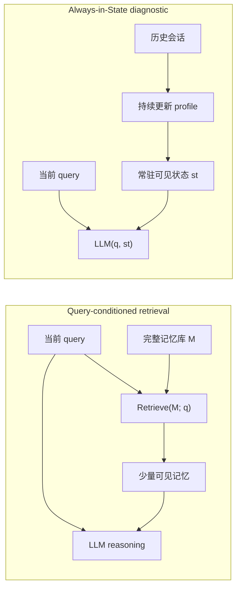

# Keep It InMind：Agent 记忆里最隐蔽的失败，不是忘了，而是没把事实带到该用的那一刻

| 项目 | 信息 |
|---|---|
| 原文 | Keep It InMind: Benchmarking the Implicit-Association Blind Spot in Agent Memory |
| 作者 | Ruizhe Li, Mingxuan Du, Benfeng Xu, Zhendong Mao |
| 来源 | arXiv:2607.24368v1 |
| 提交时间 | 2026-07-27 12:42:12 UTC |
| 项目页 / 数据集 | https://keep-it-inmind.github.io/ / https://github.com/imlrz/InMind |
| 本文类别 | 大模型 Agent / 长期记忆评测 |

### TL;DR

- **这篇论文问的不是“Agent 能不能记住用户事实”，而是“事实被记住之后，能不能在语义上不相似但决策上相关的未来问题里自动生效”。**
- **核心失败叫 implicit-association blind spot**：用户说“我对树坚果过敏”，后来问“有没有马卡龙配方”，二者表面不相似；但世界知识告诉我们传统马卡龙常用杏仁粉，记忆应该改变回答。
- **InMind benchmark 有 125 个专家核验任务，覆盖 10 个生活领域，其中 113 个 bridge 有公开来源支撑**；每个任务都把直接回忆、上下文可见控制、target recall、最终应用拆开评测。
- **关键数字非常尖锐**：当目标记忆直接放进上下文，GPT-5-mini 在间接问题上达到 84.0%；换成 6 类向量、图和 agentic memory 系统做查询时，系统级最好 application 只有 14.4%，任意 query-time 配置最高也只有 16.0%。
- **这不是单纯存储失败**：A-Mem 等系统在 direct recall 上最高到 100.0%，说明事实确实写入并保留；失败发生在间接查询时，目标事实没有进入模型可见上下文。
- **更大 embedding 也不能根治**：从 384 维 MiniLM 换到 3072 维 text-embedding-3-large 后，target recall 普遍提高，但只把部分系统从个位数推到十来个百分点，离 84.0% 仍有约 68 个百分点差距。
- **最有启发的诊断 baseline 是 Always-in-State**：用一个最多 200 行、25,000 bytes 的持久 Markdown profile，不做 query-time retrieval，间接应用达到 68.8%，说明真正问题是“哪些事实必须提前保持可见”的 routing。
- **局限也明确**：125 个任务偏健康、安全、法律、财务等容易判定的场景；GPT-5-mini 同时做 answerer 和 judge 有自偏好风险；benchmark 缺少负控，可能奖励过度提醒式系统。


### 1. 研究问题：为什么“我记得”不等于“我会用”

- 这篇论文的出发点很具体：
  - 长期记忆 Agent 往往把用户事实写入外部 store；
  - 新 query 到来时，用 query embedding、BM25、图遍历或 agentic search 取一小撮记忆；
  - LLM 只在这小撮记忆上回答。
- 这个接口默认了一个很强的假设：
  - **需要被用到的记忆，会在某种可计算相关性上接近当前 query。**
- InMind 指出，真实助理场景里最重要的记忆常常不满足这个假设：
  - “树坚果过敏”与“马卡龙配方”没有明显词面重叠；
  - “家里养猫”与“想买百合花”需要知道百合对猫有毒；
  - “正在服用某药物”与“想吃葡萄柚”需要药物相互作用知识；
  - “某宗教饮食限制”与“聚餐点菜”需要文化和食材知识。
- 也就是说，相关性来自**世界知识桥接**，而不是来自记忆文本和 query 文本本身。

### 2. 论文主张：失败在 query-conditioned interface，而不是单个检索器

论文的论证路线可以压成四步：

| 环节 | 作者要排除什么 | 对应实验或控制 | 如果成立意味着什么 |
|---|---|---|---|
| Claim 1 | 不是模型不会推理 | 把目标记忆直接放进上下文 | 模型有 bridge knowledge |
| Claim 2 | 不是记忆没存住 | direct naive query 测直接回忆 | 事实仍在 memory bank 里 |
| Claim 3 | 不是 embedding 太弱 | MiniLM 换 emb3-large | 表示能力只小幅缓解 |
| Claim 4 | 是可见性/routing 问题 | Always-in-State 诊断 baseline | 查询前决定哪些事实常驻 |

- 这个路线的强处在于它不是简单说“RAG 不行”：
  - 它把失败拆成 storage、reasoning、retrieval visibility、answer application 四个可观测面；
  - 每个面都有 paired control；
  - 因此结论不是“某个 memory system 做得差”，而是“先用 query 选择记忆、再让模型推理”的接口在这个任务族上结构性失配。

### 3. 检索假设：公式里藏着顺序问题

论文把 retrieval-based memory 写成：

```math
\hat{\mathcal{M}}=\mathrm{Retrieve}(\mathcal{M};q,\theta),\qquad a=\mathrm{LLM}(q,\hat{\mathcal{M}})
```

变量含义：

| 符号 | 含义 | 风险点 |
|---|---|---|
| `\mathcal{M}` | 用户完整长期记忆集合 | 可能很大，不能全塞上下文 |
| `q` | 当前用户查询 | 它可能不包含触发记忆的词 |
| `\theta` | embedding、索引、图遍历、搜索策略 | 必须在 LLM 看见记忆前判断相关性 |
| `\hat{\mathcal{M}}` | 被选入上下文的小集合 | 目标事实一旦没被选中，LLM 无从使用 |
| `a` | 最终回答 | 回答质量被上游可见性限制 |

论文显式提出的 retrieval hypothesis 可以写成：

```math
m\ \text{is necessary for}\ q \Rightarrow m \in \mathrm{Retrieve}(\mathcal{M};q,\theta)
```

- 问题不在这个命题完全不可能：
  - 如果让 full LLM 扫完整 memory store，当然可能找到；
  - 但那会放弃 retrieval 的低成本和子线性动机。
- 真实部署里的 `\theta` 多数是高效相似度、稀疏匹配、图邻接或有限轮搜索。
- InMind 要测的正是：
  - 当相关性需要世界知识先把 `q` 转译成另一类风险或约束；
  - 但这个世界知识又只存在于后面的 LLM reasoning 阶段；
  - 前置 retriever 是否会把必要事实漏掉。

### 4. InMind benchmark 怎样把失败拆开

InMind 的每个任务不是一个裸问题，而是一个诊断包：

| 组件 | 例子 | 作用 |
|---|---|---|
| Memory turn | “我刚发现自己吃 trail mix 后对树坚果过敏。” | 注入个人事实 |
| Direct query | “我告诉过你我有什么食物过敏？” | 测事实有没有被写入、保存、直接取回 |
| Indirect query | “我周末想做马卡龙，有什么配方？” | 测事实能否在非相似 query 里生效 |
| Knowledge bridge | 传统马卡龙常用杏仁粉，杏仁属于树坚果过敏风险 | 说明为什么记忆应改变回答 |
| Expected application | 应提醒过敏风险、建议无坚果替代方案 | 评估最终回答是否应用记忆 |

数据集层面的构造也比较克制：

| 维度 | 数字或设计 |
|---|---|
| 总任务数 | 125 |
| 领域数 | 10 |
| 来源支撑 | 113 个任务有可引用公开来源；12 个为专家编写 |
| 用户事实 | 全部 synthetic，避免真实隐私 |
| 背景干扰 | 固定 LongMemEval-s 47-session trace |
| 注入位置 | 第 9 个 session 末尾，之后还有 38 个完整 session |
| 输出语言 | English evaluation set |

领域分布也暴露了作者的取舍：

| 领域 | 任务数 | 为什么适合测试隐含关联 |
|---|---:|---|
| Health and wellness | 46 | 过敏、药物、饮食限制有清楚世界知识桥 |
| Professional and career | 26 | 职业限制和未来请求常不共享词面线索 |
| Relationships | 16 | 人际边界需要把历史偏好带入新场景 |
| Financial | 8 | 财务风险、税务、资格限制需要隐含推理 |
| Legal | 7 | 管辖区和身份条件会改变建议 |
| Spirituality | 7 | 宗教实践和食物/活动选择间接相关 |
| Consumer / Parenting / Personal / Other | 15 | 覆盖低频但现实的生活助手问题 |

### 5. 四个测量口径：同一错误会被拆成四种原因

论文最值得复用的是评测分解，而不只是最终 accuracy。

| 测量 | 回答的问题 | 失败时说明 |
|---|---|---|
| Naive recall | 直接问事实时，系统能不能答出？ | 写入、保存或直接检索失败 |
| In-context control | 事实直接可见时，backbone 能不能应用 bridge？ | 模型缺少世界知识或推理能力 |
| Target recall | 间接 query 时，目标事实有没有进入回答上下文？ | retriever / router 没把事实送到模型前 |
| Application | 最终回答有没有按 bridge 改变行为？ | 端到端记忆使用失败 |

这解决了长期记忆评测里一个常见混淆：

- 如果只看 indirect query 错误：
  - 可能是系统根本没写入事实；
  - 可能是模型不知道杏仁粉与树坚果过敏相关；
  - 也可能是事实写入了、模型也知道 bridge，但 retrieval 没把事实捞上来。
- 这三类修法完全不同：
  - storage failure 需要更好的写入和持久化；
  - reasoning failure 需要模型知识或工具；
  - visibility failure 需要 routing、state、guardrail 或主动假设生成。

### 6. 主实验：直接回忆几乎满分，间接应用接近失效

论文评测了：

- Naive RAG：
  - Dense MiniLM；
  - Dense text-embedding-3-large；
  - BM25。
- Agentic / structured memory：
  - A-RAG；
  - xMemory；
  - Mem0；
  - A-Mem；
  - HippoRAG 2；
  - MemoryOS。
- Backbone control：
  - GPT-5-mini 直接看到目标记忆和间接 query。

关键结果如下：

| 系统或配置 | Naive recall | Target recall | Application | 读法 |
|---|---:|---:|---:|---|
| Backbone control | - | 100.0 | 84.0 | 模型在事实可见时大多会用 |
| Dense RAG + MiniLM | 92.0 | 0.8 | 9.6 | 直接回忆高，间接几乎捞不到目标事实 |
| Dense RAG + emb3-large | 97.6 | 6.4 | 16.0 | 任意 query-time 配置最高 application |
| A-RAG + MiniLM | 97.6 | 5.6 | 4.8 | 15 轮 agentic search 也没解决 |
| A-Mem + MiniLM | 99.2 | 2.4 | 6.4 | 写入很强，不等于用得上 |
| A-Mem + emb3-large | 100.0 | 12.0 | 9.6 | 直接回忆满分，但应用仍低 |
| MemoryOS + emb3-large | 96.8 | 7.2 | 14.4 | 六个 memory system 中最高 application |

这些数字支持三个判断：

1. **不是模型不会 bridge**
   - 目标事实可见时，GPT-5-mini 在 125 个 indirect query 里答对 105 个，即 84.0%。
   - 最佳 retrieval 配置 16.0% 的 Wilson interval 与 84.0% 相距很远，差距不是小样本排序噪声。

2. **不是事实没存住**
   - A-Mem direct recall 到 100.0%；
   - Dense emb3-large RAG direct recall 到 97.6%；
   - 多个系统在直接问事实时能稳定答出。
   - 失败发生在“该事实是否进入间接 query 的上下文”。

3. **不是简单换大 embedding 就够**
   - MiniLM 是 384 维；
   - text-embedding-3-large 是 3072 维；
   - 维度扩大 8 倍后，target recall 确实上升，但 application 仍在 5.6% 到 14.4% 区间，离 backbone 的 84.0% 很远。

### 7. Figure 证据：相似度分布解释了为什么“搜得更像”不够


这张相似度图的作用不是装饰，而是解释失败机制：

- 在 LoCoMo、LoCoMo-Plus、LongMemEval-s 等任务里：
  - 目标记忆通常比背景历史更接近 query；
  - 相似度检索至少有可利用的分布信号。
- 在 InMind 里：
  - 目标记忆和背景记忆的 query-memory similarity 大量重叠；
  - decisive memory 不稳定地排在无关历史前面；
  - 即使换 embedding，也只能吸收一部分常见世界知识关联。

这使论文的 claim 更具体：

- 不是“相似度检索永远无用”；
- 而是“当相关性由 query 和 memory 之外的知识桥产生时，相似度分数没有可靠监督信号”。

### 8. 为什么 agentic search 没有救回来

最容易反驳论文的路径是：

- “向量检索漏了，那让 Agent 多搜几轮不就行？”
- “给它 keyword_search、semantic_search、read_chunk，一边思考一边查不就行？”

论文里的 A-RAG 就是这个反驳的实证版本：

| 配置 | 细节 |
|---|---|
| Memory bank | 486 个 LME-s turn chunks，另插入每个任务目标记忆 |
| 工具 | `keyword_search`, `semantic_search`, `read_chunk` |
| Agent LLM | GPT-5-mini |
| 搜索预算 | 最多 15 个 agent loops，128K total agent budget |
| 结果 | MiniLM application 4.8%，emb3-large application 7.2% |

为什么多轮搜索仍失败？

- Agent 要想搜到“我养猫”，必须先从“我想买百合”推断：
  - 百合对猫危险；
  - 用户可能有猫；
  - memory store 里可能记录过宠物；
  - 应该发起“cat / pet / household animal”一类查询。
- 这一步不是检索，而是**桥接假设枚举**。
- 枚举空间在真实场景里很大：
  - 百合可能涉及猫、幼儿、过敏、宗教仪式、室内空气、职业场景；
  - 葡萄柚可能涉及药物、饮食计划、糖尿病、健身补剂；
  - 马卡龙可能涉及树坚果、麸质、糖摄入、宗教饮食。
- Agentic search 如果没有已经可见的个人 profile，只能猜“哪些桥值得查”。

这也是论文把开放问题叫 **routing** 的原因：

- 它不是让搜索器更努力；
- 而是让系统在未来 query 到来前，决定哪些事实必须保持在可见状态或被特殊索引。

### 9. Always-in-State：最简单的 baseline 反而定位了关键变量

Always-in-State 不是作者提出的新产品方案，而是一个诊断 probe：

| 设计点 | 具体做法 |
|---|---|
| 状态表示 | 一个持久 Markdown file |
| 查询时检索 | 无 embedding、无向量库、无 query-time retrieval |
| 更新器 | GPT-5-mini 每个 session 后重写、整理、去重 |
| 状态上限 | 最多 200 行、25,000 bytes |
| 回答方式 | 整个 profile 放入 prompt，再回答 indirect query |
| 结果 | Naive 98.4%，Indirect 68.8% |

伪代码可以写成：

```text
Input:
  C = (C1, ..., CT)          # 固定背景会话序列
  j                          # 目标记忆注入 session
  (u, a)                     # 用户事实与助理确认
  q                          # 间接查询

State:
  M = empty markdown profile

Loop:
  for each session Ci:
    if i == j:
      Ci = Ci + [(user, u), (assistant, a)]
    M = Update(M, Ci)
    M = Truncate(M, max_lines=200, max_bytes=25000)

Output:
  Answer(q, visible_state=M)

Failure boundary:
  如果关键事实没有被 updater 保留进 M，仍会失败；
  如果 M 变成无差别警告清单，也可能过度提醒。
```

对应的结构差异可以用 Mermaid 表示：



这组对照带来的结论很强但要说准确：

- Always-in-State 的 68.8% 不是新 SOTA 系统声明；
- 它改变了 state format、updater 和可见性机制，因此不是对某一个 memory system 的干净消融；
- 但它证明了一个 sufficiency：
  - 只要 decisive memory 在 query 到来前就留在可见状态；
  - 同一个 backbone 就能恢复大部分 84.0% 与 16.0% 之间的缺口。

### 10. 和近期 Agent memory 工作的区别

这篇论文与近期 Agent memory 论文容易被归到同一篮子，但它的位置不同：

| 工作方向 | 主要问题 | InMind 的差异 |
|---|---|---|
| AttriMem | 怎样训练 memory action，让写入、更新、合并更服务下游回答 | InMind 不训练写入策略，而是测事实已存在时是否被用到 |
| MemTX | 怎样用事务、权限、provenance、rollback 约束 stateful memory 写入与工具动作 | InMind 不处理污染/回滚，而是测 query-time routing 是否漏掉无表面相似的关键事实 |
| Graph memory / HippoRAG | 怎样用实体、关系、多跳结构提升检索 | InMind 显示知识桥未必已经在用户记忆图里显式成边 |
| Agentic search | 怎样让 Agent 多轮搜索和整合记忆 | InMind 显示如果初始 query 不提示桥，搜索计划也可能没有方向 |

所以它的研究价值不是替代这些系统，而是给它们加了一道以前没测的验收题：

- 存储正确；
- 直接回忆正确；
- 上下文放进去也能推理；
- 但在真实的间接请求里，事实能不能被 routing 到可见状态？

### 11. Figure/Table 逐项证据边界

| 证据 | 支持什么 | 不能证明什么 |
|---|---|---|
| Figure 1 树坚果/马卡龙例子 | 直接 recall 成功不代表决策时应用 | 不能代表所有隐私/偏好记忆 |
| 相似度分布图 | InMind 目标记忆与背景记忆相似度重叠严重 | 不能证明所有 embedding 都无改进空间 |
| Table 1 主结果 | 六类 memory system 在 indirect application 上远低于 backbone | 不能说明这些系统在直接 recall 或普通 RAG 任务上无效 |
| Table 2 Always-in-State | 常驻可见状态可恢复大部分 gap | 不是一个完整、成本可控、负控充分的产品方案 |
| Table 3 benchmark taxonomy | InMind 同时有 long context、knowledge bridge、source grounding、direct-recall control | 不表示任务规模足以覆盖所有长期记忆风险 |
| Appendix judge audit | Target recall judge 可靠性较高，application judge 有 false positive 风险 | 不能完全消除 GPT-5-mini 自评偏差 |

### 12. 局限：最该谨慎读的地方

论文自己的局限值得认真保留：

- **任务规模小**
  - `n = 125`；
  - 单个系统之间几个百分点差异不能过度解释；
  - 作者主要依赖 60-70 个百分点级别的巨大 gap。
- **领域分布偏安全相关生活场景**
  - health、wellness、legal、financial 等更容易有明确 bridge；
  - humor、礼仪、长期目标、组织政策没有充分覆盖。
- **judge 有自偏好风险**
  - GPT-5-mini 同时出现在 answerer 和 judge 位置；
  - 专家 audit 能约束误差，但独立 judge model 仍是缺口。
- **缺少 negative controls**
  - 一个系统如果学会“凡事多提醒、多警告”，可能在 InMind 上拿分；
  - 但现实用户体验会变差，甚至制造不必要焦虑。
- **桥接事实假设偏确定**
  - 真实世界里很多 bridge 是概率性的、地区依赖的、有争议的；
  - 比如法律建议、医疗建议、宗教实践都需要更细粒度的来源和不确定性表达。
- **Always-in-State 成本未完全展开**
  - 200 行 profile 在 125 题里有效；
  - 但长期用户多年历史、多人共享设备、权限隔离和事实过期会让 profile routing 更难。

### 13. 对 Agent 架构的研究启发

如果把 InMind 当成系统设计约束，而不是单篇 benchmark，可以得到几条更可执行的研究问题：

1. **记忆不应只有“存储层”和“检索层”**
   - 还需要一个 routing 层；
   - 它负责决定哪些事实进入常驻 profile、哪些留在外部 store、哪些只在特定权限域可见。

2. **routing 需要 provenance 与权限**
   - “过敏事实”可以影响食谱建议；
   - “医疗诊断”不一定应暴露给购物插件；
   - “公司内部政策”不能被个人生活 query 调出。

3. **记忆可见性应区分风险等级**
   - 高影响事实：
     - 过敏；
     - 药物；
     - 法律身份；
     - 财务约束；
     - 安全偏好。
   - 低影响事实：
     - 颜色偏好；
     - 娱乐偏好；
     - 非关键风格习惯。
   - 前者可能需要常驻或专门 guardrail，后者适合普通 retrieval。

4. **评测需要同时惩罚漏报和过报**
   - InMind 当前主要测“该提醒时有没有提醒”；
   - 下一步需要负控：
     - 没有树坚果过敏时不要泛化警告；
     - 只对花粉过敏时不要禁止所有甜点；
     - 法律/医疗场景要表达不确定性而不是替用户下结论。

5. **长期记忆系统要把“用户信任校准”作为指标**
   - 用户会问“你记得我过敏吗？”；
   - 系统答对后，用户会自然相信它会在未来主动应用；
   - InMind 显示这种校准是危险的，因为 direct recall 是最容易过的测试。

### 14. 一个更防御性的 memory routing 草图

可以把 InMind 的启发落成一个最小架构：

| 层 | 输入 | 输出 | 需要的约束 |
|---|---|---|---|
| Event writer | 原始对话、工具结果 | 带 provenance 的 memory record | 不允许无来源高影响写入 |
| Risk classifier | memory record | impact tags / permission tags | 医疗、财务、法律、安全单独标记 |
| Persistent router | 全量 memory + policy | 常驻 profile / scoped profile | 有大小上限、可解释保留理由 |
| Query retriever | 当前 query + external store | 临时补充上下文 | 仍保留普通检索能力 |
| Answer gate | query + profile + retrieved facts | 回答或澄清问题 | 检查是否遗漏高影响事实 |
| Audit trail | routing decision | 可回放日志 | 能解释“为什么这条记忆可见/不可见” |

这种架构不是论文声称的方案，而是从证据做出的有限延伸：

- InMind 证明“只靠 query-time retrieval”在某类任务上不足；
- 它没有证明“所有关键事实都常驻”是最优；
- 更合理的方向是：
  - 外部 store 保留长尾细节；
  - profile/state 保留决策关键事实；
  - policy 决定什么能跨任务、跨工具、跨会话可见。

### 15. 结论：长期记忆的核心问题从“找回事实”变成“预判事实什么时候该可见”

- InMind 最重要的贡献，是把长期记忆系统里一个直觉问题变成了可测对象：
  - **事实被记住，不代表事实会在未来决策里生效。**
- 论文用 125 个任务证明：
  - direct recall 可以接近或达到 100.0%；
  - backbone 看到事实时可做到 84.0%；
  - 但 query-time retrieval memory systems 最高只有 14.4% 到 16.0% application。
- 这个 gap 的含义很直接：
  - 当前很多 memory system 优化了“用户问到这条事实时能不能找回”；
  - 但真实助理更需要“用户没有显式提到这条事实时，它是否仍会约束建议、行动和工具调用”。
- 后续研究最值得追问的是 routing：
  - 哪些事实有资格常驻；
  - 何时应该被降级、过期、隔离；
  - 如何给每次可见性决策留下 provenance；
  - 如何同时减少漏提醒和过度提醒。

这篇论文对 Agent memory 的提醒很克制，也很刺耳：

- 不要把“可回忆”当成“可负责使用”；
- 不要把更大 embedding 当作长期记忆推理的充分条件；
- 不要只评测 direct recall；
- 真正的长期助手需要证明自己能在无表面线索的情况下，把重要事实带到该出现的上下文里。

### 16. 如果把 InMind 接入自己的 Agent，需要额外看什么

论文仓库给出的 evaluation package 不只是数据文件，还包含固定背景 trace、timeline 构造、schema、judge prompts 和一个面向 coding agent 的评测 skill。真正接入时，建议把检查拆成下面几层：

| 检查层 | 要回答的问题 | 常见误判 |
|---|---|---|
| 数据完整性 | `inmind.jsonl` 是否正好 125 条，SHA256 是否匹配 | 只抽样几条就开始跑，漏掉 sparse `task_id` |
| 时间线构造 | 目标事实是否插入第 9 个 session，后续 38 个 session 是否完整回放 | 把 direct/indirect query 写进 memory history，污染评测 |
| 记忆写入 | 系统是否在背景会话阶段自然写入事实 | 直接把 gold bridge 或 expected application 写入记忆 |
| 间接回答 | answerer 只能看到系统实际提供的上下文 | 为了方便调试把目标事实额外塞进 prompt |
| target recall | judge 只判断目标事实是否进入上下文，不看最终答案 | 把“回答碰巧正确”误当成“检索成功” |
| application | judge 判断回答是否应用 source-grounded bridge | 只看是否提到关键词，而不是是否改变建议 |

这张表的实际意义是：

- InMind 很容易被“无意作弊”；
- 只要把目标事实、bridge explanation 或 expected answer 泄漏进回答阶段，系统就不再是在测 memory routing；
- 只要把 direct query 放进 stored timeline，retriever 就会看到与目标事实强相关的提示，间接任务会被污染。

因此，复现实验时更应记录：

1. **memory construction log**
   - 每个 session 后写入了哪些 records；
   - 哪些 records 被合并、压缩或删除；
   - 目标事实是否以可读形式保留。

2. **retrieval trace**
   - indirect query 发起了哪些检索；
   - top-k 返回了哪些 chunk、note 或 graph nodes；
   - 目标事实排名第几，是否被截断。

3. **answer context snapshot**
   - 最终 prompt 里是否出现目标事实；
   - 是否出现 bridge 相关词；
   - profile 与 retrieved context 是否有权限边界。

4. **judge disagreement audit**
   - 对 positive/negative 各抽样；
   - 单独看 false positive：系统是否只是泛泛警告；
   - 单独看 false negative：系统是否用隐含表达完成了约束。

### 17. 负控为什么是下一步关键

InMind 当前最有力地证明了“该用记忆时没用”的漏报问题，但长期助手还会遇到相反方向：

- 没有树坚果过敏时，系统不能每次甜点建议都提醒坚果风险；
- 用户只说“不喜欢太甜”，系统不能把所有含糖食品都判成危险；
- 用户有某种医疗条件，系统也不能把所有生活建议都医疗化；
- 用户曾经讨论过法律身份，系统不能在无关日常请求中反复暴露敏感身份。

如果没有负控，一个系统可以用很笨的方法刷高 InMind：

```text
for every query:
  mention every high-impact user fact
  add broad safety warning
  suggest consulting expert
```

这种策略可能提高 application 分数，却破坏三个真实目标：

| 目标 | 过度提醒的代价 |
|---|---|
| 用户体验 | 回答变啰嗦、焦虑、像免责声明模板 |
| 隐私 | 把敏感记忆带到不该出现的上下文 |
| 决策质量 | 模糊重要风险与普通偏好，降低信任校准 |

因此，InMind 更像第一半 benchmark：

- 正例测 memory routing 的召回；
- 后续还需要负例测 routing 的精度；
- 再往后还需要权限域、时间过期、多人设备、工具副作用场景。

对 Agent 安全来说，最理想的指标不是“所有关键事实永远可见”，而是：

```math
\mathrm{UsefulVisibility}
= \frac{\mathrm{decision\ critical\ facts\ visible}}
       {\mathrm{sensitive\ or\ irrelevant\ facts\ exposed}}
```

这个式子不是论文原文指标，而是从论文证据延伸出的系统目标：

- 分子要求别漏掉会改变建议的事实；
- 分母要求别把敏感或无关事实随意暴露；
- 真正的 memory router 要同时优化二者，而不是单纯扩大上下文。
