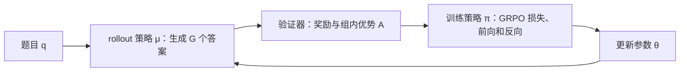

# HiFloat4：全 FP4 强化学习后训练的瓶颈原来在 rollout 激活

| 元信息 | 内容 |
| --- | --- |
| 论文 | *HiFloat4 Format for End-to-End Reinforcement Learning Post-Training of Large Language Models* |
| 作者 | Hei Yi Mak 等，Huawei |
| 发布 | 2026-07-29，arXiv:2607.26515v1 |
| 原文 | [arXiv 摘要页](https://arxiv.org/abs/2607.26515) · [PDF](https://arxiv.org/pdf/2607.26515) · [实现仓库](https://github.com/global-computing-consortium/HiFloat4) |
| 主题 | 大模型后训练、GRPO、FP4 量化、rollout 数值稳定性 |

## TL;DR

- **问题**：推理型 LLM 的 RL 后训练常被长轨迹 rollout 卡住；若 rollout 与训练前反向都降为 FP4，省算力的同时会不会损坏学习信号？
- **主张**：主要损失不是“训练梯度只有 4 bit”，而是 rollout 中激活离群值拉大 block scale，使大量正常值在 FP4 中下溢为零；因此只把训练端升回 BF16，反而扩大行为策略与训练策略的错配。
- **方法**：HiF4 用三级层次缩放改进 FP4 表示；Rollout-ResQ 在每个 rollout 线性投影上保留普通 FP4 矩阵乘，再以稀疏的 FP4 激活残差做校正。作者特别选择硬件友好的 `2:4` 半结构稀疏。
- **证据**：Qwen2.5-3B/GSM8K 上，HiF4 从 BF16 的 86.96% 降至 82.03%，而 `Rollout-ResQ-S2:4` 回升到 **85.90%**；MXFP4 从 73.31% 回升到 **81.65%**。相对 BF16 的主任务差距分别从 **4.93/13.65** 个点缩至 **1.06/5.31** 个点。
- **反直觉消融**：保持 FP4 rollout、仅把训练设回 BF16，HiF4 是 78.01%、MXFP4 是 50.57%，都差于全 FP4。这是本文最重要的定位证据，而非“低比特总会差”的泛泛结论。
- **边界**：实验是 FP4 模拟，没有原生 FP4 硬件的端到端 wall-clock 测速；只测两种 Qwen 与数学 RL，且所有稀疏方案固定 50%。故“最多 2.67 倍”是理论算力推导，不是已测吞吐承诺。

## 研究问题：为什么后训练的 FP4 比静态推理难？

### 两个策略、两种数值路径

GRPO 类后训练的一轮并非单一前向：旧策略 \(\mu_{\theta_{old}}\) 先自回归生成答案，再由可验证奖励产生优势，训练策略 \(\pi_\theta\) 对这些 token 计算损失并更新。rollout 的长序列使其通常是时间瓶颈，训练端前反向又占显存与算力。



- 既有低比特工作常让 rollout 量化、训练保留 BF16，再用 importance sampling 处理策略差异；QeRL 也只把 rollout 压到 4 bit，并保留较高精度的 LoRA/梯度路径。
- 本文把**两条路径以及训练前反向**都置于 FP4，问的是更严格的问题：是否能同时维持 rollout 分布的质量、GRPO 更新的一致性和硬件友好的矩阵乘？
- 静态 PTQ 的平滑、旋转、校准假定模型和激活分布近似固定；RL 每轮都更新策略，今天为离群值拟合的校准尺度，下一轮可能已过时，频繁再校准也会吞掉量化收益。

## 论证路线：四个 claim 如何被逐一检验？

| Claim | 机制假说 | 证据 | 仍不能证明什么 |
| --- | --- | --- | --- |
| 全 FP4 不是必然不可学 | 训练端量化噪声或许可容忍 | FP4 训练 + BF16 rollout 达 86.88/86.20%，接近 86.96% BF16 | 不代表所有模型、奖励或语言任务都稳定 |
| 真正瓶颈在 rollout 激活 | 离群值控制 scale，非离群值下溢 | W16A4 比 W4A16 更差；图 1 部分层零值超过 80% | 相关性不能单独确定每个 layer 的因果贡献 |
| 策略错配比训练噪声更危险 | 低精度生成数据却由高精度策略拟合会偏移更新 | BF16 train + FP4 rollout 比统一 FP4 更低 | 只在 GRPO 与给定实现中直接验证 |
| 稀疏残差可补回信息且保留 FP4 | 对量化误差而非原激活稀疏化 | ResQ 在两种格式、3B/7B 上普遍优于 SmoothQuant/RHT/OCC | 没有真实 FP4 kernel 的实测延迟与能耗 |

这里的论证顺序值得注意：作者没有先提出一个复杂技巧再寻找分数，而是先做精度组合实验，排除“训练端 FP4 是罪魁”的直觉；再以激活零塌缩解释原因；最后才让残差校正精确瞄准被删掉的信息。

## 数值机制：block scale 怎样制造 zero collapse？

对第 \(\ell\) 个线性层，输入激活 \(X_\ell\in\mathbb{R}^{m\times d}\)、权重 \(W_\ell\in\mathbb{R}^{n\times d}\)，高精度输出为：

\[
Y_\ell=X_\ell W_\ell^\top,\qquad \hat Y_\ell=Q(X_\ell)Q(W_\ell)^\top.
\]

- \(m\) 是 token 数，\(d\) 是输入维度，\(n\) 是输出维度；\(Q\) 把值映射为 FP4。W4A4 意味着权重与激活都量化。
- MXFP4 对 32 个元素共享 scale，元素采用 E2M1；HiF4 对 64 元素使用三级缩放：顶层 E6M2、两层 E1 scale 与 S1P2 元素表示。后者试图在极短 bit budget 下同时保存动态范围与局部解析度。
- 如果同一 block 有极大离群值，scale 必须覆盖它；多数中小激活落到 FP4 最小可表示值以下，于是从“有噪声”变成“精确的零”。图 1 在 Qwen2.5-3B/GSM8K 的某些 down projection 层报告量化后零值超过 80%；图 2 中含离群值 block 的比例与之同向变化。

这解释了为什么权重单独量化的 HiF4 rollout 仍有 85.22%，而激活单独量化只有 84.30%，两者全量化为 82.03%。MXFP4 的同组数为 81.57%、77.71%、73.31%，差距更大；格式选择本身成为可恢复精度的上限条件。

## 方法：Rollout-ResQ 补偿什么、故意不补偿什么？

先定义激活被量化损失的残差：

\[
\Delta X_\ell=X_\ell-Q(X_\ell).
\]

若不顾成本，可以增加一个稠密 FP4 残差乘：

\[
\hat Y_\ell=Q(X_\ell)Q(W_\ell)^\top+Q(\Delta X_\ell)Q(W_\ell)^\top.
\]

但两次稠密 GEMM 会削弱 rollout 加速。最终做法是将稀疏算子 \(S\) 施加在**残差**而不是原激活上：

\[
\hat Y_\ell=Q(X_\ell)Q(W_\ell)^\top+S\!\left(Q(\Delta X_\ell)\right)Q(W_\ell)^\top.
\]

### 为什么这一设计针对论点？

1. 原 FP4 分支保留廉价、端到端的低精度主计算；残差分支只带回离群值造成的缺口，而不是偷偷恢复完整 BF16 激活。
2. Figure 4 比较 `Q(X)` 与 `Q(ΔX)` 在 2:4 稀疏后误差，后者更耐稀疏，因此“稀疏残差”不是任意工程拼接，而是由测量支持的分工。
3. 作者比较三种 50% 保留率：保留 L2 最大通道的 \(S_{50\%}\)、每 4 个元素留 2 个最大值的 \(S_{2:4}\)，及保留半数 \(32\times64\) block 的 \(S_{50\%}^{32\times64}\)。`2:4` 对应现代稀疏 kernel 可利用的结构。

```text
Input: prompt q, FP4 weights W, activation X, sparsity rule S
State: rollout policy μ, training policy π, group responses O
for each GRPO iteration:
    for every rollout projection l:
        base = Q(X_l) @ Q(W_l)^T
        residual = S(Q(X_l - Q(X_l))) @ Q(W_l)^T
        Y_l = base + residual
    O = μ.generate(q); A = normalize(verified_rewards(O))
    update π with FP4 forward/backward GRPO objective
Output: updated all-FP4 policy
Failure boundary: 若非平稳分布使残差模式或稀疏 kernel 不适配，校正仍可能丢失关键信息。
```

## 训练与实验：哪些设置让结论可解释？

| 项目 | 3B 轨道 | 7B 轨道 |
| --- | --- | --- |
| 基座与训练集 | Qwen2.5-3B，GSM8K | Qwen2.5-Math-7B，DAPO-Math-17K |
| 评测 | GSM8K-test、Math500，Mean@1 | AIME-2024/2025、AMC-2023、Math500，Mean@32 |
| 系统 | VeRL；vLLM rollout，FSDP training；GRPO | 同左 |
| 学习率 / group | \(10^{-6}\) / 16 | \(10^{-6}\) / 16 |
| 最大 prompt / response | 512 / 1024 | 2048 / 4096 |
| 训练成本 | 约 100 GB 峰值、约 10 小时 | 约 370 GB 峰值、约 20 小时 |

baseline 不只含 BF16 和原始 HiF4/MXFP4，还包括每轮起点重校准的 SmoothQuant、随机 Hadamard transform（RHT）与 outlier clamping-and-compensation（OCC）。这使“残差有效”能与静态量化的常见补救直接比较，而非只赢过弱基线。

## 主结果：恢复的是哪一种精度差距？

### 3B：GSM8K 训练后

| 格式与方法 | GSM8K-test | 相对 BF16 | Math500 |
| --- | ---: | ---: | ---: |
| BF16 | 86.96 | 0.00 | 61.2 |
| HiF4 原始 | 82.03 | -4.93 | 44.6 |
| HiF4 + OCC | 84.23 | -2.73 | 51.8 |
| HiF4 + ResQ-S2:4 | **85.90** | **-1.06** | 52.6 |
| MXFP4 原始 | 73.31 | -13.65 | 27.8 |
| MXFP4 + ResQ-S2:4 | **81.65** | **-5.31** | 46.4 |

- Table 2 的关键不只是最优值：在 HiF4 下，`S2:4` 的 GSM8K 最好；Math500 则是 block 稀疏版本 55.8% 更好，说明稀疏图样并非跨分布有一个绝对赢家。
- SmoothQuant 在 HiF4/GSM8K 只有 78.54%，甚至低于原始 HiF4；作者把它的慢收敛归因于 RL rollout 分布的非平稳性，这与文章“离线校准假设失效”的问题设定相连。
- RHT、OCC 确有改善，因而本文不是声称旧方法无效；但两种格式下 ResQ 仍居前，支持其“补回动态激活误差”比只缩放/旋转/夹断更匹配 rollout。

### 7B：更难数学训练的稳健性

HiF4 原始在 AIME24/AIME25/AMC23/Math500 分别为 16.15/7.29/55.16/59.40，距 BF16 的差为 11.14/4.79/9.37/15.19 点。`ResQ-S2:4` 则为 **20.73/8.54/55.78/68.95**，差缩至 **6.56/3.54/8.75/5.64** 点。Figure 5 的平均 reward 曲线进一步显示：它通常较早达到较高 reward；RHT 早期可竞争、后来恶化；OCC 的训练曲线看似接近原始 HiF4，却未转化为四个下游 benchmark 的一致改进。

## 消融与失败：论文最有价值的负结果

### 精度组合消融

| Train | Rollout | HiF4 GSM8K | MXFP4 GSM8K | 解释 |
| --- | --- | ---: | ---: | --- |
| BF16 | BF16 | 86.96 | — | 参照 |
| FP4 | BF16 | 86.88 | 86.20 | 训练 FP4 本身几乎可承受 |
| FP4 | W4A16 | 85.22 | 81.57 | 权重量化不是主导错误 |
| FP4 | W16A4 | 84.30 | 77.71 | 激活量化的影响更强 |
| FP4 | FP4 | 82.03 | 73.31 | 统一低精度仍优于错配 |
| BF16 | FP4 | 78.01 | 50.57 | **只升训练精度反而失败** |

这张 Table 1 把“表现下降”从一个现象变成可操作诊断：若 rollout 分布已经因激活零塌缩偏移，训练端用更精细的策略拟合该数据，并不会自动纠正它，反而让采样行为与被优化的 log-probability 更不一致。该解释仍是对该组消融的合理机制推断，不能扩展成所有 off-policy RL 的定理。

### 速度分析要如何读？

对 \(X\in\mathbb{R}^{m\times d},W\in\mathbb{R}^{n\times d}\)，BF16 稠密 GEMM 为 \(2mdn\) FLOPs。若硬件上 FP4 吞吐恰为 FP16 的 4 倍，主 FP4 GEMM 的有效成本是 \(\frac12mdn\)；2:4 残差只留一半元素，其有效成本 \(\frac14mdn\)。因此：

\[
C_{S2:4}=\tfrac12mdn+\tfrac14mdn=\tfrac34mdn,
\qquad \text{speedup}_{theory}=\frac{2mdn}{3mdn/4}\approx2.67\times.
\]

- 这是对比 FP16/BF16 **单层矩阵乘**的上界式推导，未含量化、通信、采样、memory access 与 kernel launch。
- Dense ResQ 的对应推导为 \(2\times\)，因此半结构残差的价值是把补偿误差变成硬件可能加速的约束，而非只报告准确率。
- 论文承认没有 native FP4 支持，全部训练为模拟，模拟开销主导运行时间；不能把公式直接当生产系统 SLA。

## Figure / Table 逐项证据解读

| 图表 | 支持的结论 | 不该过度解读为 |
| --- | --- | --- |
| Figure 1 | 量化后特定层出现严重零值比例，提出 activation underflow | 所有层、所有模型都必然有同样形状 |
| Figure 2 | 有离群值 block 的比例与零塌缩相联 | 单凭相关就完全证明离群值是唯一因果 |
| Figure 3 | 主 FP4 投影加稀疏残差投影的计算位置 | 已完成真实 kernel 性能验证 |
| Figure 4 | 量化残差较主激活更能承受 2:4 稀疏 | 任何稀疏率都不会伤害精度 |
| Figure 5 | S2:4 收敛较快、较稳；RHT/OCC 有不同失效模式 | reward 曲线等同全部下游能力 |
| Tables 1–3 | 精度定位、3B/7B 多 benchmark 的恢复幅度 | 对超大模型或非数学任务的普适结论 |

## 相关工作中的位置：不是把 PTQ 搬进 RL

- **QeRL 与低比特 QAT**：关注 rollout/training policy mismatch、importance correction 与低比特可训练性。本文将诊断推进到“rollout activation 的信息损失”，并同时量化训练端。
- **SmoothQuant、AWQ、OmniQuant、QuaRot/SpinQuant**：为冻结模型的校准、缩放或旋转提供成熟工具；本文的反例是 RL 的策略更新使固定统计量失效或昂贵。
- **动态 fallback 与 OCC**：已认识到离群值可使量化塌缩。Rollout-ResQ 的差别在于 tensor 级残差加结构稀疏，明确服务于 rollout 时的端到端 FP4 GEMM。
- **JetRL**：同样追求统一低精度路径；本文提供了在 FP4 更极端条件下应优先检查激活、而不是盲目增加训练精度的实验理由。

## 证据边界、复现性与下一步问题

### 已证实、有限证实、尚未证实

1. **已证实于本文设置**：在 VeRL + GRPO、两种 Qwen 数学训练轨道，HiF4 与稀疏 ResQ 显著缩小相对 BF16 的准确率差，且胜过所列三类 baseline。
2. **有限证实**：HiF4 比 MXFP4 更适合此端到端 FP4 RL；这是两个模型、一个任务族和特定 block/格式配置中的经验比较。
3. **尚未证实**：实际 GPU 上的 2.67 倍端到端加速、100B 级模型可扩展性、代码/Agent RL 的泛化，或不同奖励噪声下的稳定性。

复现者应先固定 VeRL、vLLM、FSDP、GRPO、两种训练集与 Table 4 超参数，再复现 Table 1 的精度矩阵；若连“BF16 train + FP4 rollout 更差”都不能重现，就不应急于宣称残差机制有效。随后测量 per-layer zero ratio、outlier block ratio、reward 曲线与最终 benchmark，并在具有原生 FP4/2:4 kernel 的设备上分别报告采样吞吐、训练吞吐和总成本。

## 研究者视角的延伸

- RL 后训练的数值精度不是静态模型压缩问题：rollout 是**数据生成机制**，它的微小分布畸变会经 reward、优势与更新累积放大。以后比较量化配方，应同时报告 rollout token 分布、KL、奖励方差与下游分数。
- “统一低精度优于高低错配”提示后训练系统需要把数值格式看作 policy interface 的一部分。训练器、推理引擎和 verifier 的格式转换点，应该像版本化策略一样被审计。
- 安全与 Agent 方向也有类比但不能直接等同：长轨迹工具使用会放大 rollout 误差；若量化改变工具调用、拒答或权限决策的尾部分布，仅报告平均任务成功率并不足够。需要独立测量高风险 action 的校准与稀有失败率。
- 最值得继续追问的是：能否根据在线激活漂移自适应选择残差稀疏率，而不重新做昂贵校准？这种自适应本身又会不会引入新的策略非平稳性、硬件调度抖动或可复现性问题？

本文最可迁移的结论不是“FP4 已经免费”，而是一条诊断方法：面对低精度 RL 的退化，先分开训练与 rollout，再分开权重与激活，最后把补偿放在被测量到的信息缺口上，并把准确率、策略一致性和真实系统吞吐分别验收。

## 深读补充：把每一处实验细节放回作者的问题链

### 为什么先做 precision matrix，而不是直接调 ResQ？

论文的 Table 1 是一张小而关键的因果筛选表。它让 train precision 与 rollout precision 交叉，随后又把 rollout 拆成 `W4A16`、`W4A8`、`W16A4` 和 `W4A4`。这种设计避免把一个总分差错误归因到“4 bit 太低”。

- 第一个对照是 `FP4 train + BF16 rollout`。结果接近 BF16，说明反向与权重更新的量化误差至少在这个 Qwen2.5-3B/GSM8K 配方中没有阻止学习；这是对“只能保留高精梯度”的直接挑战。
- 第二个对照是 `BF16 train + FP4 rollout`。若训练端精度是主因，这应当最好；现实却是 HiF4 78.01%、MXFP4 50.57%。所以作者把问题从某个 kernel 的局部误差提升为**生成数据与被优化策略之间的接口错误**。
- 第三个对照是 `W4A16` 对 `W16A4`。两种格式里后者都更低，尤其 MXFP4 从 81.57% 到 77.71%，说明应该优先观察 activation，而不是只花精力修权重 scale。
- 这仍不是严格的完美因果实验：一次运行只有有限随机种子，量化会共同改变采样长度、奖励和优化轨迹。不过它提供了明确的调试优先级，而不是将所有退化归给某个抽象的“数值不稳定”。

### 论文中的 rollout–training mismatch 究竟是什么意思？

可以把 GRPO 的一轮写成两个相互耦合的分布：\(o\sim\mu_{\theta_{old}}(\cdot\mid q)\) 是 rollout 给训练器的数据，\(\pi_\theta(o_t\mid q,o_{<t})\) 是训练器计算概率比的对象。作者使用的目标可概括为：

\[
J(\theta)=\mathbb E_{q,o_i\sim\mu_{\theta_{old}}}\left[
\frac1G\sum_{i=1}^{G}\frac1{|o_i|}\sum_t
\min\left(R_{i,t}A_{i,t},\operatorname{clip}(R_{i,t},1-\epsilon_{low},1+\epsilon_{high})A_{i,t}\right)
\right],
\]

其中 \(R_{i,t}=\pi_\theta(o_{i,t}\mid q,o_{i,<t})/\pi_{\theta_{old}}(o_{i,t}\mid q,o_{i,<t})\)，\(A_{i,t}\) 是同组回答奖励归一化后的 token advantage。论文省略了 KL 项，但不影响这里的诊断。

- rollout 的激活被压零后，模型不只是对相同答案报出稍差 logit；它会走入不同的长推理前缀、产生不同的可验证奖励、改变组内 advantage 的排序。
- 若训练策略改用 BF16，它对这些低精轨迹的 log probability 与低精 rollout policy 更不一致；importance ratio 的校正又被 clipping 和有限样本约束。因此，训练精度升高不是“把坏 token 变回好 token”。
- 统一 FP4 也并非理论上无偏：它只是让采样与优化使用更一致的数值行为。ResQ 的任务是在保持一致性的前提下改善 rollout 本身，而不是让两条路径各自追求最高局部精度。

这一区分对于实践很实用。调参者若只比较 final loss 或 backward gradient norm，可能漏掉真正先坏掉的 rollout token 分布；应同时记录每层 quantization zero ratio、response length、reward histogram、KL 与 pass@k 的变化。

### 三种稀疏模式为何不能只看“都留 50%”？

`S50%`、`S2:4` 与 block `S50%^(32×64)` 的名义密度相同，却向硬件和信息分布施加不同假设：

| 稀疏规则 | 留下什么 | 优点 | 可能的失败模式 |
| --- | --- | --- | --- |
| channel 50% | L2 norm 最大的半数通道 | 能保留整体强信号 | 小而关键的局部残差被整条通道门槛丢弃 |
| 2:4 | 每连续 4 元素中的 2 个最大绝对值 | 有半结构 kernel 支持；细粒度 | 结构约束会打散某些协同特征 |
| 32×64 block 50% | L2 norm 最大的半数块 | 连续内存与 block kernel 友好 | 一个 block 内的细小异常会随整块被删 |

Table 2 的 GSM8K 最优是 `S2:4`，但 Math500 的 HiF4 最优为 block 版本 55.8%。这提醒读者：主榜的一个百分点并不足以证明某个 sparsity topology 具有普适语义；它更可能反映训练任务、评测分布和矩阵布局之间的交互。作者固定 50% 的选择是合理的第一步，却尚未画出 accuracy–density–latency 的 Pareto 曲线。

### 对 baseline 的公平读法

SmoothQuant、RHT、OCC 分别代表缩放校准、旋转重分布与离群值夹断/补偿。它们不是被随意挑出的“陪跑者”：若离群值是核心原因，这三类都应有机会改善结果。论文结果的价值在于显示失败形态不同。

1. SmoothQuant 在 RL 中尤其脆弱，因为每轮开头校准出来的 scale 面对随后更新的 policy 已经滞后；它在 7B/AIME24 甚至只有 0.70%。这支持非平稳性假说，但也可能部分受具体校准频率与实现影响。
2. RHT 在若干早期训练阶段很有竞争力，Figure 5 后段 reward 恶化；它说明“先消除离群值”有益，却没有保证长程优化稳定。
3. OCC 在 3B 上优于原始 FP4，但 7B 的四项下游指标大幅掉落，提示训练 reward 近似不等于泛化；这是作者没有只给单条曲线的正确做法。
4. Dense ResQ 很多时候靠近或超过稀疏版，证明残差本身有作用；而 `S2:4` 的意义是将这份恢复能力约束到潜在可加速的结构中。

### 复现实验的最小审计清单

- **数值审计**：对每一层保存量化前后零值比例、block max/median 比例、\(\|X-Q(X)\|\) 与 \(\|\Delta X-S(Q(\Delta X))\|\)。只报模型分数无法判别是实施错误还是方法失效。
- **策略审计**：对相同 prompt 固定随机种子，比较 BF16、统一 FP4、FP4+ResQ 的 token divergence、EOS 位置、奖励、组内 rank 与 KL。这样才能重建“rollout 先失真”的链条。
- **系统审计**：分别测 dense FP4、dense ResQ、2:4 ResQ 的 token/s、显存峰值、通信时间与 kernel utilization；模拟环境的时间不能拿来宣称硬件收益。
- **统计审计**：至少多随机种子、报告置信区间与失败 run。本文给出了多 benchmark，但没有在正文中呈现跨种子方差；这是后续复现需要补上的证据。
- **接口审计**：训练与 rollout 是否使用相同量化格式、scale 更新时机、tokenizer、sampling temperature、reward verifier 版本？这些看似外围的差异会重新制造本文刻意排除的 mismatch。

## 面向后训练系统的有限结论

本文最强的工程含义不是让所有团队立即把 BF16 换成 FP4，而是提供一个更严格的验收顺序：先确认硬件是否真有 FP4 与 2:4 支持；再判断长 rollout 是否构成主成本；接着用 precision matrix 定位错误来源；最后才在真实吞吐、质量和稳定性三维度上选格式与残差结构。

对于使用 GRPO、DAPO 或其他可验证奖励训练的团队，尤其应避免两类误读：一是把 HiF4 的较好结果理解成所有 4-bit format 都等价；二是把“统一低精更好”理解成高精训练永远有害。本文证明的是一个条件性的系统现象：当 rollout 激活发生严重下溢时，单独提高训练端精度无法修复已经改变的样本分布。换模型、奖励、序列长度、kernel 或量化粒度后，必须重新测量，而不是套用结论。

### 一个可检验的后续假设

作者把离群值视为 rollout 侧首要故障点，因而自然导出一个尚未验证的假设：**真正应分配的预算不是统一的 bit-width，而是随层、随 token、随训练阶段变化的误差预算。**早期 rollout 的错误可能只改变措辞，长推理后段的一个零塌缩却可能改变验证答案；同一层在数学题与代码任务中也未必有同样的离群值结构。

- 若这一假设正确，固定 50% 的残差稀疏率会留下可观空间：系统可按在线 zero ratio 或 advantage-sensitive layer 选择更密的残差，但必须用预先定义的阈值，避免动态规则变成难以复现的隐式调参。
- 若这一假设不成立，动态控制的额外 metadata、同步和 kernel 切换会超过收益；这也是为什么论文当前保守地把 `2:4` 作为硬件可识别的固定结构。
- 一个好的后续 benchmark 应同时给出精度、生成长度、每 token 延迟、能耗、reward 方差和 tail failure；仅用平均 accuracy 无法回答“量化是否把少数关键轨迹变得危险”。

这类问题把量化研究从格式比较推进到后训练控制问题：系统不仅要表示一个张量，还要在不断变化的 policy 分布上决定哪一部分误差值得花算力修复。

最终，任何声称“更快且同样好”的低比特后训练方案，都应把这条状态链与真实硬件数据一并交给读者检验。

在此之前，论文的数字应被当成有价值的可复现实验信号，而不是已经完成商业级成本承诺的结论；这种克制恰恰使其机制诊断比单一速度宣传更值得跟进。
