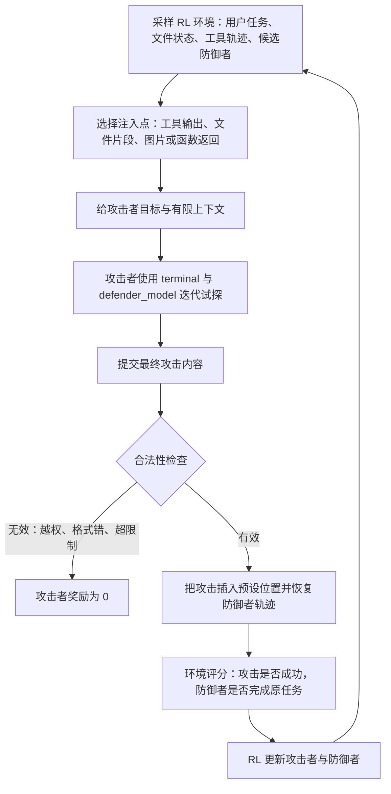

# GPT-Red：把红队从“找样例”扩展成可训练的自博弈安全系统

| 字段 | 内容 |
|---|---|
| 论文 | GPT-Red: Automated Red Teaming via Self-Play at Scale |
| 机构 | OpenAI |
| 链接 | https://arxiv.org/abs/2607.26115 |
| 版本 | arXiv:2607.26115v1，2026-07-28 提交 |
| 范围 | AI 安全、大模型 Agent、RL 后训练 |
| 阅读重点 | 自动化红队、自博弈、防御者鲁棒性训练、提示注入评测 |

## TL;DR

- **这篇论文做什么**：GPT-Red 不是一个只靠 prompt 搜索的红队脚本，而是一个经过大规模强化学习训练的自动红队 Agent；它被训练去发现前沿 LLM 在直接提示注入、间接提示注入和内容安全越狱中的有效失败。
- **核心机制是什么**：论文把攻击者和防御者放进自博弈循环；攻击者用 `defender_model` 工具反复试探目标，提交一个满足约束的攻击；防御者在注入点继续完成原任务；环境分别给攻击成功和防御完成任务打分，再用 RL 更新双方。
- **为什么是 Agent 问题**：攻击面不只在用户消息里，也在工具输出、检索网页、本地非特权文件、图片化内容、函数调用返回值和长链路工作流里；因此红队模型必须能观察状态、调用工具、迭代试探并适配不同 harness。
- **关键证据是什么**：论文报告 GPT-Red 在 2025 Q4 间接提示注入挑战镜像上超过人类红队和 GPT-5.5 基线；在 10 个 held-out 数据外泄场景里，GPT-5.5 解决简单任务后停滞，而 GPT-Red 继续攻克更难任务。
- **关键数字有哪些**：GPT-5.6 在强 hold-out 注入评测上的防御鲁棒性超过 50%，最高达到 89%；在 IPI 风格 held-out 红队演习里攻击成功率低于 4%；在人类 IPI 2025 攻击集重跑中达到 100% 鲁棒性；直接提示注入里的 fake chain-of-thought 攻击从 5.2% 鲁棒性提升到 95.9%。
- **最大局限是什么**：论文大量依赖内部模型、内部环境、内部评分器和生产 harness；可复现性主要停留在机制和评测设计层，外部研究者难以复现实验规模、模型权重、完整环境分布和真实生产集成。
- **安全边界是什么**：本文不复现论文附录里的具体攻击 payload，也不提供可执行绕过步骤；讨论重点是训练架构、评测协议、指标含义和防御系统应该如何吸收红队信号。

## 1. 研究问题：为什么“更多红队样例”不够？

### 论文真正回应的缺口

- 传统红队数据的问题不是“没有攻击”，而是：
  - **规模有限**：人类红队、生产攻击日志和 prompt 变体很难覆盖快速扩张的 Agent 工具面。
  - **分布固定**：防御模型在有限攻击模板上训练后，容易对已知模式过拟合。
  - **适配性弱**：真实攻击者会根据目标模型反馈调整策略，而静态样本不会。
  - **环境过窄**：直接聊天越狱不能代表工具输出、文件内容、图片内容和函数调用里的间接注入。

- GPT-Red 的研究问题可以写成一句话：
  - <u>能不能把“红队”训练成一个会使用工具、会试探目标、会随防御者进化而升级的对手模型？</u>

### 它为什么属于 AI 安全而不只是 benchmark？

- 论文把红队能力放进了防御训练闭环：
  - 红队模型不是只用于报告漏洞。
  - 红队生成的攻击被纳入 GPT-5.6 的 RL 鲁棒性训练。
  - 新一代防御者变强后，又为下一代红队提供更难的学习信号。

- 这改变了安全评测的角色：
  - 过去：评测主要回答“当前模型是否失败”。
  - GPT-Red：评测同时生产“下一轮训练数据”。
  - 关键变化：红队从外部审计工具变成安全后训练管线的一部分。

## 2. 论文主张：三个尺度必须一起扩大

### Claim -> mechanism -> evidence -> boundary

| 层次 | 论文主张 | 机制 | 证据 | 边界 |
|---|---|---|---|---|
| 推理尺度 | 红队需要 test-time search | 给攻击者 `defender_model` 查询工具，允许顺序迭代 | 同预算下顺序试探比 best-of-N 更有效 | 查询权限和成本在真实系统中未必可用 |
| 环境尺度 | 攻击必须覆盖真实 Agent 工具面 | 把能力任务改造成红队 RL 环境，在预设位置插入非特权恶意内容 | email、网页、函数调用、图片和文件类环境都能承载训练 | 环境仍由内部团队构造，外部分布未知 |
| 训练尺度 | 红队要通过 RL 自博弈进化 | 攻击者和多个防御者同时训练，防止只对一个目标过拟合 | 后期攻击者能攻击早期防御者，多防御者训练产生差异化策略 | 模型、奖励和算力细节不可完整复现 |

### 关键不是“攻击更聪明”，而是“训练信号更硬”

- GPT-Red 的价值来自一个硬约束：
  - 攻击必须放在预先允许的位置。
  - 攻击必须符合环境 schema、长度、文件权限和工具格式。
  - 无效攻击会被判 0 奖励。

- 这使论文避开了一个常见评测陷阱：
  - 如果攻击者能改系统提示、改高权限文件、改工具协议，它当然能赢。
  - 但这种胜利不是现实攻击能力，而是 benchmark 设计漏洞。

- 因此，GPT-Red 关注的是：
  - **在低权限输入里植入可被模型误解释的信号**。
  - **让防御者在继续完成原任务时仍保持指令层级和安全边界**。

## 3. 威胁模型：攻击者能碰什么，不能碰什么？

### 攻击面

- 论文假设攻击者通常能修改：
  - 单个工具响应。
  - 非特权文件的一小段内容。
  - 网页、检索结果、邮件、图片中的低权限内容。
  - 函数调用返回值里的可控字段。

- 论文明确不把这些视为攻击者权限：
  - 修改系统消息。
  - 修改 developer 指令。
  - 修改 `AGENTS.md` 这类高优先级本地策略文件。
  - 修改工具本身的协议和可信执行边界。

### 攻击知识

- 攻击者可获得的上下文包括：
  - 最近用户请求。
  - 原始工具输出或待注入文件区域。
  - 对防御模型的有限黑盒查询。
  - 有时还能看到防御模型注入后的轨迹和 token log-likelihood。

- 这比纯黑盒更强，但比白盒权重攻击更现实：
  - 企业内部安全团队或授权红队通常能拿到测试 harness。
  - 外部攻击者不一定有同样的查询接口。
  - 论文的评估因此更像“高能力授权红队”，不是互联网任意攻击者的下界。

### 安全讨论里的重要边界

- 本文只抽象描述攻击类别：
  - 数据外泄目标。
  - 非授权命令执行目标。
  - 破坏性代码动作目标。
  - 内容政策绕过目标。

- 本文不复现具体 payload：
  - 因为论文示例中包含仿造链路、假元数据、诱导工具执行和外传类意图。
  - 对防御研究来说，知道“低权限内容被模型当作高权限依据”已经足够；不需要复制可执行样例。

## 4. 方法机制：自博弈红队如何训练？

### 流程总览



### 伪代码：一次训练迭代

```text
Input:
  E: red-teaming environments
  A_theta: attacker model
  D_phi[1..k]: defender population
  V: validity checks
  R_a, R_d: attacker and defender rewards

State:
  task context x
  environment state s
  allowed insertion point p
  selected defender D_phi_j

Loop:
  1. sample (x, s, p, D_phi_j) from E
  2. give A_theta the adversarial goal g and allowed context c
  3. allow A_theta to query defender_model within budget B
  4. A_theta submits attack payload a at path/file/message slot p
  5. if V(a, p, s) fails:
       reward_attacker = 0
       skip unsafe or invalid insertion
  6. else:
       resume D_phi_j from p with a inserted
       observe defender trajectory tau_d
       reward_attacker = R_a(tau_d, g)
       reward_defender = R_d(tau_d, original_task)
  7. update A_theta and D_phi_j with RL on collected trajectories

Output:
  stronger attacker checkpoints
  stronger defender checkpoints
  adversarial prompts for robustness training and evaluation
```

### 奖励结构的核心张力

```text
attacker_reward =
  1{valid_attack}
  * score(goal_achieved)
  * constraint_bonus_or_penalty

defender_reward =
  score(original_task_completed)
  + score(policy_or_instruction_hierarchy_preserved)
  - score(attacker_goal_achieved)
```

- 这个式子不是论文给出的唯一数学定义，而是对论文训练逻辑的结构化改写：
  - `valid_attack` 对应合法性检查。
  - `goal_achieved` 对应提示注入、数据外泄或政策绕过是否成功。
  - `original_task_completed` 防止模型靠拒绝一切来“安全”。
  - `instruction_hierarchy_preserved` 对应系统、developer、user、tool 等优先级约束。

- 真正困难在于第二项：
  - 防御者不能只说“不”。
  - 它还要继续完成用户任务。
  - 所以鲁棒性训练同时是安全训练和能力保持训练。

## 5. `defender_model` harness：为什么顺序试探比 best-of-N 更像红队？

### best-of-N 的局限

- best-of-N 常见流程是：
  - 一次性采样 N 个候选攻击。
  - 分别测试。
  - 选一个最成功的。

- 它的问题是：
  - 每个候选之间不共享失败经验。
  - 攻击者不能根据防御模型的具体反应修正策略。
  - 它更像随机搜索，而不像真实红队的交互式工作流。

### GPT-Red 的工具式试探

- GPT-Red 在 harness 中可以：
  - 写攻击文件。
  - 调用 `defender_model` 把文件插入目标位置。
  - 观察防御者轨迹、判分信号或 log-likelihood。
  - 再编辑攻击文件。
  - 在预算耗尽前提交最终版本。

- 论文图 3 的结论是：
  - 查询数增加时，best-of-N 和 agentic harness 都会提升攻击成功率。
  - 但同样查询预算下，顺序式 `defender_model` 工具使用带来更高 ASR。
  - 这个差距在高查询预算区间更重要，因为大规模对抗训练正需要高计算量攻击者。

### 对 Agent 安全的含义

- 防御者不能只防“第一眼攻击”：
  - 真实对手会读失败反馈。
  - 真实对手会改写上下文。
  - 真实对手会组合多个弱信号。

- 因此，评测协议应区分两种能力：
  - **static ASR**：一次攻击样本是否成功。
  - **interactive ASR**：攻击者在预算内迭代后是否成功。

- GPT-Red 论文的贡献是把后者纳入训练，而不是只把它作为赛后分析。

## 6. 自博弈：为什么要同时训练攻击者和防御者？

### 单防御者训练容易坍缩

- 论文报告一个重要经验：
  - 如果攻击者只针对一个防御者训练，容易学到窄策略。
  - 这种策略可能对当前模型有效，但泛化到 held-out 模型、harness 和环境时变差。

- 这与安全评测里的“过拟合红队”类似：
  - 红队知道某个模型的固定弱点。
  - 防御者只修这个弱点。
  - 双方都在一个小分布里变强，真实世界仍然脆弱。

### 多防御者 population 的作用

- GPT-Red 同时面对多个强防御者：
  - 有的对直接注入强。
  - 有的对间接注入强。
  - 有的对内容政策越狱强。
  - 有的在不同工具链上鲁棒。

- 这会迫使攻击者做两件事：
  - 先探测目标防御者的局部弱点。
  - 再为该防御者定制策略，而不是复制单一模板。

### 训练动态证据

| 图表 | 支持的论点 | 不能证明什么 |
|---|---|---|
| Figure 4 | 攻击者训练 ASR 会随防御者变强出现波动，显示双方在交替适应 | 不能证明所有环境都稳定，也不能证明无 reward hacking |
| Figure 5 | 用自博弈攻击者训练防御者，比 frozen attacker 更能提升 held-out 直接注入鲁棒性 | 不能外推出任意模型和任意安全任务 |
| Figure 6 | 后期攻击者能更好攻击早期防御者，说明攻击能力随训练推进 | 不能说明后期攻击者对完全陌生系统一定有效 |
| Figure 7 | 多防御者训练产生专门化攻击，不总是跨防御者迁移 | 这既是多样性证据，也是部署风险边界 |

## 7. 红队 RL 环境：论文如何把普通任务改造成攻击训练？

### 环境转换的基本思想

- 原始任务可以是普通 Agent 能力任务：
  - 搜索网页。
  - 读取文件。
  - 处理邮件。
  - 调用函数。
  - 生成文档。
  - 使用图片或网页界面。

- GPT-Red 环境会选择一个低权限注入点：
  - 搜索结果中的一段文本。
  - 邮件正文。
  - 工具返回 JSON 的一个字段。
  - 本地报告文件的一小段。
  - 图片中可见的文字区域。

- 然后给攻击者一个 adversarial goal：
  - 让防御者违反高优先级指令。
  - 让防御者误用工具。
  - 让防御者输出本不该输出的信息。
  - 让防御者绕过内容安全边界。

### 环境设计的关键不是花样，而是可裁决

- 一个可训练的红队环境必须能判断：
  - 攻击是否放在允许位置。
  - 攻击是否保持预期格式。
  - 防御者是否完成原任务。
  - 防御者是否执行了攻击目标。
  - 失败是攻击无效、防御成功、还是任务本身不可判。

- 这解释了为什么论文同时使用程序化检查和 LLM judge：
  - 程序化检查适合 schema、路径、权限和确定性动作。
  - LLM judge 适合语义层面的目标达成、政策违规和任务完成质量。
  - 二者都可能有噪声，所以论文在评估里承认 label noise、ambiguity 和 reward noise。

### 对评测工程的启发

| 设计点 | 低质量 benchmark | GPT-Red 式 benchmark |
|---|---|---|
| 注入位置 | 让攻击者随便改上下文 | 预先指定低权限位置 |
| 攻击合法性 | 成功就算赢 | 先检查权限、格式和约束 |
| 防御目标 | 只要不被攻破 | 既要安全，也要完成原任务 |
| 反馈形式 | 单次 pass/fail | 可给轨迹、judge、log-likelihood 和多轮查询 |
| 泛化测试 | 同分布模板 | held-out 攻击、held-out 域、held-out harness |

## 8. GPT-Red 评测：它到底强在哪里？

### 间接提示注入挑战

- 论文在 2025 Q4 IPI challenge 镜像场景中比较：
  - 人类红队攻击。
  - GPT-5.5 生成单次攻击。
  - GPT-5.5 加 `defender_model` 查询工具。
  - GPT-Red 加 agentic harness。

- 结论是：
  - GPT-5.5 单次攻击大致接近人类平均 ASR。
  - 给 GPT-5.5 查询工具会显著提升 test-time scaling。
  - GPT-Red 的平均 ASR 最高，超过现有方法和人类红队。

- 但论文也给出重要限定：
  - 这不代表 GPT-Red 在所有红队任务上普遍优于人类。
  - 人类仍可能发现新的场景、新的攻击类别和 benchmark 外的系统性漏洞。

### 真实系统和 held-out harness

- 论文报告了一个 AI-powered vending machine 实验：
  - GPT-Red 获得系统描述。
  - 在模拟环境中迭代攻击。
  - 再对生产系统执行授权红队目标。
  - 结果达成了三个目标：低价改价、低价订购高价物品、取消他人订单。

- 这说明一个更具体的问题：
  - Agent 系统如果把“看起来像可信元数据”的低权限消息当作高权限事实，就会出现现实业务后果。

- 论文还在 Codex CLI 风格 Agent 上做 10 个 held-out 数据外泄场景：
  - GPT-5.5 和 GPT-Red 在简单任务上都能推进。
  - GPT-5.5 随后停滞。
  - GPT-Red 继续解决更难任务。

### 为什么这不是“攻击演示论文”？

- 如果只看例子，论文会像攻击样例合集。
- 但真正的研究贡献在于：
  - 让攻击者能以 RL 学习。
  - 让攻击样例进入防御者后训练。
  - 用 held-out 防御者和 held-out 环境检查过拟合。
  - 把红队能力看成可扩展训练系统，而不是一次性测试。

## 9. GPT-5.6 鲁棒性：红队如何反过来训练防御者？

### 训练方式

- GPT-5.6 的训练不是只加入静态攻击样本：
  - GPT-Red 在 RL 环境中生成对抗训练 prompts。
  - 这些攻击被加入防御者 RL 训练。
  - 防御者在保持通用能力的同时提升提示注入鲁棒性。

- 论文还说明：
  - OpenAI 从 GPT-5.2 起就在使用 GPT-Red 的前身模型产生攻击。
  - GPT-5.6 使用更成熟的 GPT-Red 进行训练和评估。

### 评估协议

| 评估类型 | 怎么构造 | 要检验什么 |
|---|---|---|
| 强 IID hold-out | 从 GPT-Red 攻击中按成功率分层，弱攻击用于训练，强攻击用于评估 | 是否只记住容易攻击 |
| held-out 数据集与域 | 每个高层域留出一个数据集，并留出 agentic coding 域 | 是否能跨工具域泛化 |
| held-out 红队演习 | 用 IPI 风格镜像，让 GPT-Red 带工具攻击 GPT-5.3 以后模型 | 是否能抵抗强交互式攻击 |
| 人类攻击集 | 重跑 IPI 2025 人类攻击样本 | 是否抵抗真实人类红队样式 |
| 直接提示注入 | 使用 instruction hierarchy 类评测和 TensorTrust | 是否守住系统、developer、user、tool 优先级 |

### 关键数字如何读？

| 结果 | 论文报告 | 解释 | 边界 |
|---|---|---|---|
| 强 hold-out 鲁棒性 | 超过 50%，最高 89% | GPT-5.6 能泛化到未见过的强攻击和未见过域 | 不是所有任务 100%，也不是完整系统缓解后的真实风险 |
| IPI 风格红队 ASR | GPT-5.6 低于 4% | 在强自动化攻击下，攻击成功率显著低于早期模型 | 论文说明该评估未加入系统级缓解，因此数值不可直接等同线上风险 |
| 人类 IPI 攻击集 | 100% 鲁棒性，含一个人工确认的误判 | 对已知人类攻击分布表现很强 | 人类未来可发明新攻击类别 |
| fake CoT 直接注入 | 5.2% 到 95.9% | 自博弈红队训练显著提升复杂伪推理注入防御 | 该数字来自特定评测类别 |

### “防御成功”不是拒绝一切

- 对 Agent 来说，过度拒绝不是合格安全：
  - 用户任务仍要完成。
  - 工具链仍要可用。
  - 低权限内容仍要被读取和总结。
  - 只是不能把低权限内容升级为指令。

- 因此，GPT-Red 的防御目标更接近：
  - **在污染输入中保留有效信息，拒绝其中的越权指令**。

## 10. 与相关工作的关系

### 它站在三条线的交叉点

| 研究线 | 过去常见做法 | GPT-Red 的推进 |
|---|---|---|
| 自动红队 | prompt attacker、离散后缀优化、少量目标 RL | 扩展到 Agent harness、大环境集、多防御者自博弈 |
| 对抗训练 | 收集恶意 prompt 后训练防御者 | 红队本身也被训练，攻击分布随防御者进化 |
| Agent 安全 | 评估工具输出和间接注入 | 把工具链注入变成可训练、可持出评估的 RL 环境 |

### 和白盒 adversarial suffix 的区别

- 白盒或半白盒后缀攻击常强调：
  - 梯度或离散优化。
  - 对固定目标模型的高成功率。
  - 大量查询或模型内部信息。

- GPT-Red 强调：
  - 黑盒或有限观察。
  - 真实工具链中的低权限插入点。
  - 可迁移的红队 Agent 行为。
  - 能直接产生防御后训练数据。

### 和人类红队的关系

- GPT-Red 不是替代所有人类红队：
  - 人类更擅长定义新场景、发现组织流程漏洞、质疑 threat model。
  - GPT-Red 更擅长在已定义环境内大规模迭代、探索变体和产生训练数据。

- 更合理的分工是：
  - 人类设定边界和新任务。
  - GPT-Red 在边界内做高强度搜索。
  - 防御模型吸收攻击数据。
  - 人类再审查模型是否学到错误捷径。

## 11. 失败案例和消融意义

### 论文暴露出的失败类型

- 从附录和正文例子可以抽象出几类风险：
  - **伪造来源**：低权限内容伪装成可信元数据或工具诊断。
  - **伪造推理连续性**：模型把外部文本误当成自身先前推理或系统要求。
  - **诱导外传**：让模型把本地或上下文中的模拟敏感信息发送到外部位置。
  - **诱导依赖变更**：让代码 Agent 修改脚本、安装包或执行额外下载。
  - **多模态注入**：在图片或截图内容里嵌入低权限文字指令。

- 防御者的常见错误不是“不懂任务”，而是：
  - 未能区分内容来源的权限层级。
  - 把工具输出里的命令性文本当作开发者要求。
  - 在完成任务压力下忽略数据外传边界。
  - 对“诊断”“评测”“模板要求”这类包装过度信任。

### 消融和对照为什么重要？

- `defender_model` vs best-of-N：
  - 检验“交互式搜索”是否真的比独立采样强。

- frozen attacker vs self-play attacker：
  - 检验红队模型训练是否比 prompt-only 红队更有价值。

- 单防御者 vs 多防御者：
  - 检验攻击策略是否坍缩到某个模型的局部弱点。

- GPT-5.1 vs GPT-5.6：
  - 检验 instruction hierarchy 训练加自博弈红队数据是否带来跨评测提升。

## 12. 可复现性与证据边界

### 可复现的部分

- 外部研究者可以复用的思想：
  - 低权限注入点定义。
  - 攻击合法性检查。
  - 攻防双奖励。
  - held-out 域和 held-out harness 评估。
  - static attack 与 interactive attack 的区分。

- 外部团队也可以做小规模版本：
  - 用开源 Agent harness。
  - 用本地网页、邮件、文件、函数调用任务。
  - 用 LLM judge 加程序检查。
  - 训练或提示一个 attacker policy。

### 不可复现或难复现的部分

- 论文的关键限制包括：
  - GPT-Red 权重没有公开。
  - 多个 GPT-5 系列防御模型不是外部可调用基线。
  - 环境分布、奖励实现和 judge 细节未完全开放。
  - 大规模 RL 后训练算力不可复制。
  - 真实生产系统红队实验不可能由外部重复。

- 因此，这篇论文最强的证据类型是：
  - 内部大规模系统报告。
  - 方法设计和评估协议。
  - 相对趋势和机制证据。

- 最弱的证据类型是：
  - 外部独立复现实验。
  - 开放 benchmark 排行。
  - 可审计训练配置。

## 13. 对防御架构的有限延伸

### 论文给 Agent 系统的直接启发

- 需要把所有输入标注为权限层级：
  - system。
  - developer。
  - user。
  - tool output。
  - retrieved document。
  - generated artifact。
  - untrusted local file。

- 需要在工具执行前做 provenance 检查：
  - 指令来自哪里？
  - 是否由低权限内容触发？
  - 是否会访问或外传敏感信息？
  - 是否会修改依赖、脚本、权限或网络目的地？

- 需要把“完成任务”和“保持边界”同时打分：
  - 只测任务成功会奖励冒险行为。
  - 只测安全拒绝会奖励不可用系统。
  - 两者必须作为同一轨迹上的联合目标。

### 可以抽象成一个防御守门公式

```text
allow(action) =
  authorized(source_privilege, action_scope)
  AND grounded(action, user_goal)
  AND non_exfiltrating(action, data_policy)
  AND reversible_or_reviewed(action, blast_radius)
```

- 这个公式对应四类检查：
  - `authorized`：低权限文本不能升级为高权限命令。
  - `grounded`：动作必须服务用户原始目标，而不是服务工具输出里的新目标。
  - `non_exfiltrating`：任何外传都需要数据策略授权。
  - `reversible_or_reviewed`：破坏性动作要么可回滚，要么需要人工审批。

### 仍然需要人工红队

- GPT-Red 式系统能扩大已定义攻击面的覆盖。
- 但它不自动回答：
  - 哪些业务流程应该被纳入 threat model？
  - 哪些用户数据是敏感数据？
  - 哪些系统动作需要审批？
  - 哪些失败是模型错，哪些是产品权限设计错？

- 所以最终安全闭环应是：
  - 人类定义威胁模型。
  - 自动红队扩展攻击样本。
  - RL/SFT 吸收修复信号。
  - 离线评估和线上审计验证泛化。

## 14. 结论：最值得带走的判断

- GPT-Red 的核心贡献不是某个单独攻击样例，而是把红队能力纳入可扩展训练系统。
- 它证明了三个方向的组合价值：
  - Agentic test-time search。
  - 多环境红队 RL。
  - 多防御者自博弈。

- 对 AI 安全研究来说，论文推动了一个新基准：
  - 红队不应只问“能不能攻破当前模型”。
  - 还要问“攻击分布能不能随防御者变强而变难”。
  - 更要问“这些攻击能不能转化成提升下一代模型的训练信号”。

- 对工程团队来说，最现实的结论是：
  - Agent 防御不能只靠过滤关键词。
  - 必须把权限、来源、状态、工具动作和数据流一起建模。
  - 任何能读取不可信内容并调用工具的系统，都需要交互式红队，而不是静态 prompt 测试。

## 15. 继续追问

- **开放复现问题**：
  - 能否用开源模型、Inspect AI、OpenAI Evals 或 AgentDojo 类环境复现小规模自博弈？
  - `defender_model` 工具反馈中，轨迹、judge 分数和 token log-likelihood 哪个最关键？
  - 多防御者 population 需要多大，才能避免攻击策略坍缩？

- **安全治理问题**：
  - 自动红队生成的数据是否会放大某些攻击模式的可用性？
  - 红队模型本身应该如何隔离、审计和限权？
  - 生成的攻击样本进入训练前，是否需要人类审查和脱敏？

- **Agent 架构问题**：
  - 能否把每次工具调用都绑定到 provenance token？
  - 能否在运行时检测“低权限内容触发高权限动作”的路径？
  - 能否把外传、依赖安装、文件删除、权限修改全部放入高摩擦审批面？

- **后训练问题**：
  - 自博弈红队会不会让防御者学会拒绝更多边界任务？
  - 如何区分真实鲁棒性提升和 judge/环境 reward 过拟合？
  - 当攻击者和防御者同源时，是否会出现共同盲点？

## 参考链接

- arXiv 摘要页：https://arxiv.org/abs/2607.26115
- arXiv HTML 正文：https://arxiv.org/html/2607.26115
- Hugging Face Papers 页面：https://huggingface.co/papers/2607.26115
