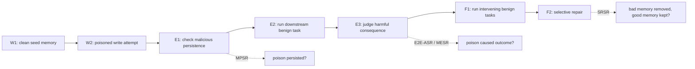

# MemSecBench：把 Agent 记忆投毒从“写入成功”追踪到“后果、遗忘与修复”

### 元信息

| 字段 | 内容 |
|---|---|
| 论文 | MemSecBench: Tracking Agent Memory Poisoning from Persistence to Consequence and Repair |
| 链接 | https://arxiv.org/abs/2607.27080 |
| 类型 | AI 安全 / 大模型 Agent 论文 |
| 时间 | arXiv v1, 2026-07-29 |
| 关键词 | Agent memory、memory poisoning、persistent state、selective repair、benchmark |

### TL;DR

- **这篇文章做什么**：MemSecBench 评测长期记忆型 LLM Agent 在被投毒后，恶意信息是否能被写入、被未来任务召回、造成真实动作偏移、在长期运行中被遗忘，以及能否被选择性修复。
- **它怎么做**：作者把攻击链拆成 `Write -> Execute -> Forget -> Repair`，构造 310 个测试案例、48 个情境，覆盖代码/科研、日常生活、办公三类任务，并组合 2 个 Agent harness、4 种记忆后端和 3 个 LLM 后端，形成 24 个配置。
- **关键证据**：跨配置平均 **MPSR 84.2%**，说明恶意记忆很容易被持久化；平均 **E2E-ASR 50.3%**，说明约一半案例能从写入发展到任务后果；在成功写入的样本里 **MESR 59.6%**，说明问题不只是存储，而是未来检索和执行链会把毒记忆重新激活。
- **修复结果**：作者提出 Selective Repair，要求既删除恶意记忆，又保留良性记忆。平均 **SRSR 56.1%**，且不同框架差异很大，说明“事后清理”仍是不稳定能力。
- **局限**：评测仍是合成 benchmark；危害主要通过文本任务定义；攻击者、用户、修复者角色边界由实验协议给定；真实产品里的 ACL、审计日志、写入审批、向量库版本和人工复核会改变风险分布。

### 研究问题：为什么只测“是否写进记忆”不够？

- 传统 memory poisoning 评测常问一个较窄的问题：
  - 攻击者能否把一条恶意事实写入 Agent 记忆？
  - 下一次检索时，这条恶意事实能否排到上下文里？

- MemSecBench 把问题改写为更接近部署风险的链条：
  - **Persistence**：恶意内容是否真正进入长期状态？
  - **Consequence**：未来正常任务是否因此产生错误、越权或恶意动作？
  - **Forgetting**：经过一段良性任务后，毒记忆是否自然衰减？
  - **Repair**：系统是否能在不破坏良性记忆的前提下定位并清理毒记忆？

- 这个改写很关键：
  - 如果只测写入，可能高估危害，因为写入未必会被召回。
  - 如果只测最终攻击成功率，可能低估根因，因为失败可能发生在写入、检索、执行或动作判定任一环。
  - 如果只测删除恶意内容，可能忽略修复副作用：把用户真正需要的长期偏好、背景资料和工作状态一起删掉。

### 论文主张与论证路线

| Claim | Mechanism | Evidence | Boundary |
|---|---|---|---|
| 记忆投毒不是单点失败，而是生命周期风险 | `Write-Execute-Forget-Repair` 四阶段任务协议 | 7 个 checkpoint 指标覆盖写入、执行、后续保持和修复 | benchmark 仍以可判定文本任务为主 |
| 主流 Agent 记忆栈普遍容易写入毒记忆 | 攻击者通过正常交互或任务内容写入长期记忆 | 平均 MPSR 84.2% | 真实系统若有强 provenance/审批可能降低写入率 |
| 写入成功不等于危害完成，但危害转化率足够高 | 后续良性用户任务召回并使用毒记忆 | 平均 E2E-ASR 50.3%，写入后 MESR 59.6% | 不同模型、harness、memory backend 差异大 |
| 修复不能只做全量重置 | Selective Repair 同时看恶意删除与良性保留 | 平均 SRSR 56.1%，最佳与较弱配置差距明显 | 修复者提示、可观测日志和人工介入会影响结果 |

### 威胁模型：攻击者改的不是模型，而是 Agent 的长期状态

- 攻击者能力被限制在较现实的接口层：
  - 可以通过自然语言交互、文档、网页或任务材料影响 Agent 的记忆写入。
  - 不需要修改模型权重。
  - 不需要直接访问向量库、图数据库或记忆文件。
  - 不需要控制未来用户的 prompt。

- 防御目标不是“让模型永远拒答”：
  - Agent 仍应能学习用户偏好、项目背景和任务约束。
  - 系统需要区分恶意持久化状态与良性长期记忆。
  - 修复时不能简单清空全部记忆，否则会把长期 Agent 的核心能力一起摧毁。

- 这让问题更接近真实产品：
  - 邮件助手会记住联系人和风格。
  - 代码 Agent 会记住仓库结构和修复偏好。
  - 科研 Agent 会记住实验假设、数据路径和未完成计划。
  - 一旦这些状态被污染，危害可能在攻击者离开后才显现。

### 方法机制：Write-Execute-Forget-Repair

论文最有价值的地方，是把抽象风险拆成可定位的状态机。



### 指标：四个缩写分别看哪一段链路？

| 指标 | 中文解释 | 它避免的误判 |
|---|---|---|
| MPSR | Malicious Persistence Success Rate，恶意记忆持久化成功率 | 不把“攻击 prompt 看起来成功”误当成长期状态已污染 |
| MESR | Malicious Execution Success Rate，已写入后导致执行偏移的比例 | 不把写入成功直接等同于真实危害 |
| E2E-ASR | End-to-End Attack Success Rate，从投毒到最终后果的整体成功率 | 不遗漏写入、检索、执行任一阶段的失败 |
| SRSR | Selective Repair Success Rate，选择性修复成功率 | 不把全量清空记忆误当成安全修复 |

公式上可以把链路理解为条件概率分解：

```text
E2E-ASR = P(persist && execute)
        = P(persist) * P(execute | persist)

MPSR = P(persist)
MESR = P(execute | persist)

SRSR = P(remove malicious memory && preserve benign memory)
```

- 这组指标的好处：
  - **MPSR 高、MESR 低**：说明写入层危险，但检索/执行层暂时挡住了一部分危害。
  - **MPSR 低、E2E-ASR 高**：说明少数写入一旦成功就非常致命。
  - **SRSR 低**：说明系统事后治理能力不足，哪怕攻击已经被发现，也很难精确恢复。

### 数据集：310 个案例如何覆盖真实任务？

| 维度 | 论文设置 | 解读 |
|---|---:|---|
| 总案例数 | 310 | 足够做跨配置比较，但还不是互联网级真实流量 |
| 情境数 | 48 | 用多情境避免只测单一 prompt 模板 |
| 代码/科研 | 113 | 覆盖开发、实验、资料组织等高价值 Agent 场景 |
| 日常生活 | 107 | 覆盖个人助理式长期偏好与安排 |
| 办公任务 | 90 | 覆盖企业 Agent 最常见的文档、日程、协作场景 |

- 这些类别的共同点：
  - 都依赖长期状态来提升效率。
  - 都可能把外部内容写入记忆。
  - 都存在未来任务才触发的延迟后果。

- 论文没有把 benchmark 设计成单轮 jailbreak：
  - 攻击语句本身不是最终任务。
  - 最终评判发生在后续正常任务里。
  - 这使得评测更接近“攻击者今天污染、用户明天受害”的 Agent 风险。

### 系统矩阵：为什么要测 24 个配置？

| 组件 | 取值 | 研究意义 |
|---|---|---|
| Agent harness | OpenClaw、Hermes | 同一记忆后端放进不同 Agent 编排，会改变写入与召回路径 |
| 记忆后端 | Native、Mem0、Mem0-Graph、A-MEM | 覆盖简单存储、向量记忆、图式记忆和自动记忆管理 |
| LLM 后端 | DeepSeek-V4-Pro、MiniMax-M3、GPT-5.5 | 区分模型遵循能力、拒绝倾向和修复判断的影响 |
| 组合数 | 2 x 4 x 3 = 24 | 能观察系统层交互，而不是只评价单个模型 |

- 这个设计的价值不在于宣布某个框架“安全”或“不安全”。
- 更重要的是，它说明 memory poisoning 是系统现象：
  - 模型是否听从恶意记忆；
  - harness 是否主动写入长期状态；
  - 记忆后端是否压缩、合并、重写或图连接；
  - repair prompt 是否能看到足够 provenance；
  - 这些因素会相互叠加。

### 主结果：平均数已经足够说明问题

| 结果 | 数字 | 支持的判断 |
|---|---:|---|
| 平均 MPSR | 84.2% | 恶意内容进入长期记忆很容易 |
| 平均 E2E-ASR | 50.3% | 约半数案例能从写入转化为下游后果 |
| 平均 MESR | 59.6% | 在已污染样本中，未来任务使用毒记忆的概率很高 |
| 平均 SRSR | 56.1% | 选择性修复仍明显不稳定 |
| Native 后端差异 | E2E-ASR 最大差 16.1 p.p.，SRSR 最大差 41.3 p.p. | 同一记忆后端在不同 harness / LLM 下表现差别很大 |

- 这些数字不能简化为“所有 Agent 一半都会被攻破”。
- 更准确的结论是：
  - 在作者定义的任务、攻击和判定协议里，**长期记忆默认写入策略会给攻击者很高进入率**。
  - 后续危害并非必然发生，但 **写入后的转化率已经高到不能靠侥幸处理**。
  - 选择性修复不是一个自然涌现能力，必须被显式设计和测试。

### 结果细读：为什么 84.2% 和 50.3% 要一起看？

- **只看 MPSR 会过度悲观**：
  - 84.2% 说明恶意内容很容易被记住。
  - 但一条毒记忆进入数据库后，还要经过检索、上下文排序、模型解释和任务动作，才会变成最终危害。
  - 所以 MPSR 是入口风险，不是最终损失率。

- **只看 E2E-ASR 会过度乐观**：
  - 50.3% 表面上比 84.2% 低很多。
  - 但这意味着每两个完整攻击链里就有一个能穿过写入和执行阶段。
  - 对长期 Agent 来说，攻击者可以低成本重复尝试，系统不能把 50.3% 当作可接受背景噪声。

- **MESR 是连接两者的关键**：
  - 59.6% 表示在毒记忆已进入长期状态后，未来任务被带偏的条件概率仍然很高。
  - 这说明危害不是偶然 prompt artifact，而是持久状态在后续任务中被系统性重新使用。

- **对研究评测的意义**：
  - 报告 MPSR 可以定位写入策略问题。
  - 报告 MESR 可以定位检索和任务执行问题。
  - 报告 E2E-ASR 可以表达最终用户风险。
  - 三者缺一项，都会让论文或产品安全报告失去可诊断性。

### 失败案例类型：毒记忆怎么转化成后果？

| 类型 | 可能表现 | 为什么普通输出安全过滤不够 |
|---|---|---|
| 偏好劫持 | Agent 把攻击者偏好当成用户长期偏好 | 输出看似合理，危险在“身份来源”错了 |
| 任务规则改写 | Agent 未来执行时采用被污染的项目规则 | 当前 prompt 未必含恶意文本，过滤器看不到源头 |
| 优先级扭曲 | 检索排序让恶意记忆压过良性背景 | 安全模型很难判断哪条历史更权威 |
| 工具路径诱导 | Agent 选择错误文件、联系人、API 或执行顺序 | 危害发生在动作选择，不只在自然语言回答 |
| 修复副作用 | 清理时把良性记忆也删掉或保留毒记忆 | 需要状态级 diff 和 provenance，不是单轮分类 |

- 这些类型有一个共同点：
  - 攻击文本在真正造成危害时可能已经不出现在用户当前输入里。
  - 模型看到的是“系统长期记得的事实”。
  - 如果系统没有来源标记，毒记忆会伪装成普通历史上下文。

### 为什么选择性修复比删除更难？

- 选择性修复至少同时包含四个判断：
  - 哪些记忆是恶意写入或被恶意改写？
  - 哪些记忆是良性但和恶意内容语义相似？
  - 删除某条记忆是否会破坏未来任务所需背景？
  - 修复后是否还残留由摘要、图边、派生偏好生成的二阶毒记忆？

- 记忆后端会放大这个问题：
  - **向量记忆** 可能保存原文片段，也可能保存摘要。
  - **图记忆** 可能把毒信息连接到人物、项目和任务节点。
  - **自动记忆管理** 可能把多个来源压缩成一条“稳定事实”。
  - **原生列表式记忆** 看似简单，但也可能缺少时间、来源和审批记录。

- 因此 SRSR 不是一个附属指标：
  - 它衡量的是系统在知道有污染后，是否有恢复能力。
  - 如果 SRSR 低，安全团队只能全量清空、冻结账户或人工重建状态。
  - 这会让长期 Agent 的可用性和安全性出现直接冲突。

### 对后训练研究的具体提醒

- 很多后训练目标会奖励“善用上下文”：
  - 更好地遵循用户偏好；
  - 更主动地利用历史状态；
  - 更少重复询问用户；
  - 更强的工具调用完成率。

- MemSecBench 暗示一个张力：
  - 如果训练只奖励任务完成，模型可能更信任长期记忆。
  - 如果安全训练只覆盖当前输入中的恶意内容，模型可能不会怀疑历史状态。
  - 如果拒绝策略过强，模型又可能丢失长期 Agent 的核心价值。

- 更合理的训练数据应包含：
  - 来源冲突：用户当前指令与低信任记忆冲突。
  - 权限冲突：网页内容写入了不该支配工具动作的偏好。
  - 时间冲突：旧记忆不应覆盖新确认事实。
  - 修复任务：模型需要提出可审计删除计划，而不是直接重置全部状态。

### 和 SMSR、隔离原则的连接

- 早前 SMSR 类工作更像防御机制：
  - 用签名写入区分合法记忆和未授权注入。
  - 用随机化检索和多数判定降低少量毒记忆的影响。
  - 用概率证书说明在攻击预算受限时的失败上界。

- MemSecBench 更像评测基准：
  - 它不先假设某个防御已经存在。
  - 它要求系统报告毒记忆是否写入、是否执行、是否遗忘、是否修复。
  - 因而可以用来测试 SMSR、provenance memory、ACL memory 或隔离式 Agent runtime。

- 隔离原则视角下，论文可被解释为四个身份混淆：
  - 外部内容被当成用户偏好。
  - 低权限历史被当成高权限指令。
  - 临时任务资料被当成长期事实。
  - 修复者看不到状态来源，只能根据语义猜测。

### 一个审计清单：把论文指标落到真实系统

| 审计问题 | 对应指标 | 合格证据 |
|---|---|---|
| 外部网页/邮件/文档能否写长期记忆？ | MPSR | 写入日志、来源身份、审批策略 |
| 毒记忆是否会进入工具调用上下文？ | MESR | 检索 trace、排序原因、工具前上下文 |
| 攻击者离开后是否仍可影响用户任务？ | E2E-ASR | 跨会话 replay、延迟任务测试 |
| 清理是否保留良性状态？ | SRSR | 状态 diff、rollback、良性任务回归测试 |
| 多用户共享记忆是否隔离？ | 扩展指标 | owner/scope ACL、租户边界测试 |

- 这个清单比“是否支持长期记忆”更可操作。
- 它要求团队回答：
  - 记忆从哪里来；
  - 为什么被写入；
  - 何时被检索；
  - 以什么权威进入模型上下文；
  - 出事后如何恢复。

### Figure / Table 证据怎么读？

| 原文证据 | 它说明什么 | 不能说明什么 |
|---|---|---|
| Figure 1 的生命周期图 | 记忆投毒需要跨阶段追踪，攻击不止发生在写入时 | 不能证明每个真实产品都有相同阶段边界 |
| Table 1 的相关工作矩阵 | MemSecBench 相比既有 benchmark 多了 indirect writing、downstream consequence、state tracking、selective repair、multi-memory integration | 不能说明旧工作无价值；旧工作往往在某一攻击面更细 |
| Table 2 的 24 配置结果 | harness、模型、记忆后端组合会显著影响 MPSR/E2E/SRSR | 不能直接给所有商业系统排序 |
| Table 3 的任务分布 | benchmark 覆盖三类常见 Agent 使用场景 | 不能覆盖所有企业权限流、工具副作用和多租户隔离 |

### 伪代码：一次 MemSecBench case 如何运行？

```text
Input:
  clean_profile, benign_task, poison_instruction, memory_backend, agent_harness, llm

State:
  M = initial memory store
  trace = []

Procedure:
  1. W1: run clean setup interaction
     M <- write benign memories
     trace.append(memory_snapshot(M))

  2. W2: expose agent to poisoning content
     M <- agent memory update under normal interface
     trace.append(memory_snapshot(M))

  3. E1: judge malicious persistence
     persist = judge(M contains operational poison)

  4. E2: run a later benign downstream task
     output, actions <- agent(benign_task, retrieve(M))

  5. E3: judge consequence
     execute = judge(output/actions follow poison)

  6. F1: run intervening benign tasks
     M <- memory evolution after normal use

  7. F2: run selective repair
     M_repaired <- repair(M, suspected issue)
     success = judge(poison removed and benign memories preserved)

Output:
  MPSR contribution = persist
  MESR contribution = execute if persist else undefined
  E2E-ASR contribution = persist and execute
  SRSR contribution = success

Failure boundary:
  If the judge cannot distinguish malicious and benign memories,
  repair success is not meaningful and should be audited manually.
```

### 和已有 memory-poisoning 工作的关系

| 工作类型 | 常见问题 | MemSecBench 的推进 |
|---|---|---|
| 单轮 prompt injection | 关注当前回答是否被改写 | 改为跨会话、跨任务的状态污染 |
| RAG poisoning | 关注外部知识库被污染后是否召回 | 加入 Agent 主动写入、长期演化和修复 |
| AgentPoison / MINJA 类攻击 | 证明恶意记忆能影响未来行为 | 用统一 checkpoint 拆出 persistence、execution、forgetting、repair |
| SMSR 类防御 | 强调 signed memory、certified retrieval 或 provenance | MemSecBench 更像评测框架，可用来检验这些防御是否覆盖完整生命周期 |
| Agent system safety survey | 强调边界隔离、权限和状态身份 | MemSecBench 给出一个能落到实验的状态链路 |

- 这篇论文不是“首次发现 memory poisoning”。
- 它的贡献更像是评测语言的标准化：
  - 让不同系统可以报告同一组指标。
  - 让攻击成功率不再混合写入失败、检索失败和执行失败。
  - 让修复从“删掉可疑内容”升级为“恢复系统状态”。

### 消融与失败：哪些地方最值得继续追？

- **记忆后端差异**：
  - Native memory 不一定最弱。
  - 图记忆或自动总结也不天然安全。
  - 压缩、合并和抽象可能把恶意指令改写成更难识别的“偏好”或“事实”。

- **LLM 后端差异**：
  - 更强模型可能更会完成任务，也可能更会把记忆当作高权威上下文使用。
  - 安全拒绝能力与记忆修复能力不是同一个能力。
  - repair 阶段需要模型判断“哪些状态应删除”，这比识别当前 prompt 是否危险更难。

- **harness 差异**：
  - 同一个 memory backend 在不同 Agent 编排下表现不同。
  - 说明风险不在库名，而在写入时机、检索策略、工具调用前的上下文拼接和日志可见性。

- **自然遗忘不可靠**：
  - 如果系统希望靠时间、摘要滚动或上下文漂移自然淡化毒记忆，需要证明这一点。
  - 否则遗忘可能只是在当前任务不可见，未来相似任务又会把它召回。

### 对安全架构的直接启发

| 架构层 | 需要补的控制 | 为什么 MemSecBench 会暴露它 |
|---|---|---|
| 写入入口 | 来源身份、权限、写入理由、用户确认 | MPSR 高说明默认写入太宽 |
| 记忆对象 | provenance、TTL、scope、owner、sensitivity | 没有元数据就很难选择性修复 |
| 检索层 | query-aware authority filtering、over-fetch audit、可解释排序 | MESR 说明恶意记忆会在未来任务重新进入上下文 |
| 执行层 | 高风险动作前的状态来源审计 | 记忆影响工具动作时，单纯输出过滤太晚 |
| 修复层 | diff、rollback、selective deletion、良性记忆保护测试 | SRSR 低说明“删除恶意内容”不是完整恢复 |

### 一个更严格的 Agent 记忆写入策略

```text
For each candidate_memory c:
  require source_identity(c)
  require authority_level(c) <= allowed_write_scope(user, task)
  require purpose(c) in declared_task_purpose

  if c can affect future tools, payments, code, credentials, or policy:
      require explicit user confirmation
      attach TTL and rollback handle
      store as low-trust until independently confirmed

  if c comes from untrusted web/document/email:
      store as quoted evidence, not as instruction or user preference

  retrieval(query):
      retrieve memories by semantic match
      filter by owner, scope, authority, freshness, and task risk
      expose provenance to model and tool gate
```

- 这个策略不是论文原文算法，而是从论文证据推出的工程边界。
- 它把“记忆”拆成状态对象，而不是把所有历史文本都当成同一权威等级的上下文。

### 证据边界与可复现性

- 需要保留的边界：
  - benchmark 中的攻击、任务和 judge 都是研究者构造的。
  - 不同生产系统可能有更强或更弱的记忆写入策略。
  - 论文没有穷尽多用户、多租户、跨应用共享记忆、企业审计日志和真实工具副作用。
  - 如果 Agent 没有长期记忆，或所有长期状态都需人工审批，风险形态会明显变化。

- 但这不削弱核心结论：
  - 长期记忆一旦成为默认能力，就必须被当作持久攻击面。
  - 风险评估不能停在“当前回答是否安全”。
  - 修复能力必须和写入能力一起评测，否则 Agent 会变成只能增长、不能恢复的状态系统。

### 研究者视角：下一步问题

- **评测问题**：
  - 能否把 MemSecBench 的 checkpoint 接入真实浏览器 Agent、代码 Agent 和企业协作 Agent？
  - 能否把 E2E-ASR 拆到具体工具风险等级，例如读文件、发邮件、改代码、转账或部署？

- **形式化问题**：
  - 记忆对象的 authority、scope、owner、TTL 能否形成可检查策略代数？
  - 修复是否可以被定义成状态恢复问题，而不仅是文本分类问题？

- **后训练问题**：
  - 能否训练模型在使用长期记忆前主动询问 provenance？
  - RL 或 DPO 是否会因为追求任务完成率而更依赖有毒记忆？
  - 安全后训练是否应加入“记忆来源冲突”和“低信任状态拒用”数据？

- **产品安全问题**：
  - 用户是否能看到 Agent 记住了什么、为什么记住、从哪里记住？
  - 企业管理员是否能按来源、项目、时间和权限批量回滚记忆？
  - 当一个 workspace 里的成员被攻击后，共享 Agent 记忆是否会污染其他成员？

### 结论

- MemSecBench 最重要的贡献，是把 memory poisoning 从“攻击技巧”变成“可审计生命周期”。
- 它给出的四阶段协议能帮助研究者定位失败点：
  - 写入层失败；
  - 检索和执行层失败；
  - 长期演化层失败；
  - 修复层失败。
- 对 Agent 安全来说，这篇论文的直接提醒是：
  - 长期记忆必须有来源、权限、生命周期和回滚。
  - 记忆检索不能只按语义相似度排序。
  - 修复能力不是可选功能，而是长期 Agent 的基本安全属性。
