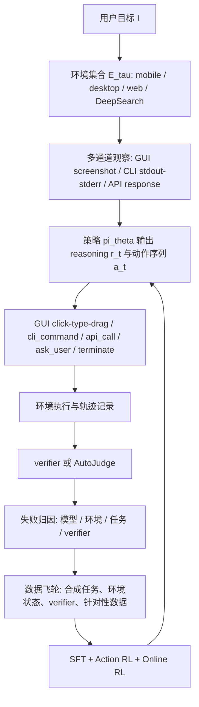

# Qwen-UI-Agent：把 GUI Agent 从“会点屏幕”推到真实设备、混合动作与长程 RL

### 元信息

- 原文：Qwen-UI-Agent Technical Report: Toward Next-Generation Real-World Centric Foundation GUI Agents
- 类型：技术报告 / 论文
- 来源：[arXiv:2607.28227v1](https://arxiv.org/abs/2607.28227)、[项目页](https://tongyi-mai.github.io/Qwen-UI-Agent/)、[GitHub README](https://github.com/Tongyi-MAI/MAI-UI)
- 发布日期：2026-07-30 UTC
- 方向：大模型 Agent，尤其是真实设备 GUI Agent、computer-use agent、长程执行与后训练
- 本文判断：这篇报告的核心不只是一个新的 GUI 模型分数，而是把 GUI Agent 的训练对象从“截图到点击”扩展成“环境、动作空间、数据飞轮、强化学习、用户确认 harness”的系统工程问题。

### TL;DR

- Qwen-UI-Agent 试图解决 GUI Agent 的现实落差：模型在可重置 benchmark 上会操作界面，但真实手机有登录态、弹窗、验证码、网络波动、超级 App 深层入口和用户确认，纯模拟环境很难覆盖。
- 作者把任务定义为 `τ=(I,Eτ)`：`I` 是用户指令，`Eτ` 是可用数字环境集合；每步观察同时包含 GUI 截图、CLI 输出和 API 结构化结果，动作也允许 GUI、bash、API、询问用户和终止。
- 系统由四块组成：可扩展 sandbox 与真实手机运行时、Agent 驱动数据飞轮、SFT + Action RL + Online RL 训练链路、用于主动服务和跨平台任务的 harness。
- 真实手机侧包含 100+ 台物理设备和 150+ 个 App；MobileWorld-Real 包含 409 个端到端任务、104 个 App、7 类日常领域，用 AutoJudge 评估轨迹并把环境错误单独剥离。
- 训练侧的关键是分层：SFT 先合并 mobile / desktop / web / DeepSearch 专家；Action RL 针对可复用的局部动作错误；Online RL 用约 10,000 个验证过的 task-verifier pair 和最多约 10,000 并发 rollout 优化长程成功。
- 结果上，27B Qwen-UI-Agent 在 MobileWorld 为 82.1%，MobileWorld-Real 为 92.2%，AndroidDaily 为 97.5%，OSWorld-Verified 为 79.5%，OSWorld-v2 partial 为 40.0%，WebArena 为 73.6%，ScreenSpot-Pro zoom-in 为 81.5%。
- 局限也很清楚：真实设备评估依赖 AutoJudge 而不是确定性 verifier；35B-A3B 的 CUA 与 DeepSearch 训练尚未完成；高保真合成环境还没有纳入报告模型；数据飞轮仍需大量人类监督，远未完全自治。
- 对 Agent 研究的启发是：真正可用的 GUI Agent 不是单一策略模型，而是“模型能力 + 环境治理 + 状态验证 + 用户授权 + 失败归因 + 长程 RL”的耦合系统。

### 1. 研究问题：为什么 GUI Agent 不能只看 benchmark 分数？

作者从一个现实约束切入：

- 人类使用数字服务主要靠 GUI，而不是 API。
- 如果 Agent 能稳定读屏、理解任务、操作手机/浏览器/桌面，它就可以成为通用执行器。
- 但现有 GUI Agent 常在模拟环境里优化，到了真实设备会遇到状态不可控、登录态变化、弹窗、权限、网络、验证码、信息过期等问题。

这篇报告把 GUI Agent 的研究问题拆成六个转换：

| 转换 | 旧问题 | 作者要推到的新问题 |
| --- | --- | --- |
| 模拟到真实设备 | sandbox 可重置、可验证 | 真实 App、真实账号、真实网络、真实中断 |
| 单域到跨域 | mobile / web / desktop 各自训练 | 一个 workflow 可跨手机、电脑、网页和 DeepSearch |
| GUI-only 到 GUI+CLI | 点击、输入、拖动 | 界面动作与 bash / API 共同组成动作空间 |
| 短程到长程 | 十几步任务 | 100 步以上轨迹里的状态跟踪、恢复和确认 |
| 人工流水线到 Agent 数据飞轮 | 人手造任务、造环境、评估失败 | Agent 合成任务、构造环境、写 verifier、分析失败 |
| 被动响应到主动服务 | 用户明确下命令 | 从通知等数字信号发起建议，但敏感动作需确认 |

这个切分很重要，因为它把“Agent 会不会点对按钮”放回完整系统里看：

- 如果环境不能稳定复现，RL 没有可靠奖励。
- 如果动作空间只有 GUI，很多文件、表格、脚本任务会被迫变成长点击序列。
- 如果没有用户确认，主动服务会变成越权执行。
- 如果没有失败归因，模型错误、环境错误、verifier 错误会混在一起污染数据。

### 2. 方法主张：Qwen-UI-Agent 是“系统共设计”而不是单模型技巧

论文的 claim 可以概括成四句话：

1. 真实设备是 GUI Agent 的必要训练和评估对象。
2. GUI、CLI、API、用户询问应在统一动作空间里协同。
3. 数据飞轮要让 Agent 参与任务、环境、verifier 和失败分析的构造。
4. 长程任务不能只靠 SFT，需要局部动作 RL 与终局 verifier-guided Online RL。

对应机制如下：



这个图里最值得注意的是 `ask_user` 和 `terminate` 不是外部补丁，而是动作空间的一部分：

- `ask_user` 让缺失信息、付款、隐私、登录、验证码、确认等动作进入可学习决策。
- `terminate(success|failed)` 让“何时结束”也成为策略问题，避免 Agent 只会继续点击。
- CLI 和 API 不是取代 GUI，而是在统一轨迹里给模型另一种观察和执行通道。

### 3. 任务形式化：从截图动作对升级为多环境序列决策

论文用一个简洁定义框住任务：

```text
任务: τ = (I, Eτ)

I: 用户指令
Eτ: 当前任务可用的数字环境集合
    例如手机、网页、桌面、DeepSearch，或它们的组合
```

每个决策步 `t` 的观察不是单张截图，而是：

```text
o_t = (o_t^GUI, o_t^CLI, o_t^API)

o_t^GUI: 当前界面截图
o_t^CLI: 命令执行输出、stderr、exit status
o_t^API: 搜索 API 或外部服务返回的结构化结果
```

策略模型输出：

```text
(r_t, a_t) = πθ(I, o_t, h_t)

r_t: 中间推理
a_t: 可执行动作输出
h_t: 到 t-1 为止的观察、推理、动作历史
```

动作输出允许批量化：

```text
a_t = (a_t^(1), ..., a_t^(K_t)),  a_t^(k) ∈ A_t

K_t = 1: 单动作
K_t > 1: 一个模型回合内发出有序动作序列
```

这个形式化的意义不是数学装饰，而是解决三个工程矛盾：

| 矛盾 | 纯 GUI Agent 的问题 | Qwen-UI-Agent 的处理 |
| --- | --- | --- |
| 观察不完整 | 截图看不到文件系统、命令输出、搜索证据 | GUI / CLI / API 同时进入状态 |
| 动作太碎 | 每点一次都要重新观察和推理 | 多个可安全连续执行的 primitive action 可 batch |
| 用户边界模糊 | 付款、登录、确认可能被模型直接越过 | `ask_user` 成为标准动作，敏感步骤可交回用户 |

### 4. 环境基础设施：真实手机和 sandbox 各自负责什么？

作者没有把 sandbox 和真实设备对立起来，而是做了两层环境：

| 层 | 作用 | 关键细节 |
| --- | --- | --- |
| sandbox 环境 | 可重置、可扩展、可写 verifier，适合 SFT、RL、消融和反复 rollout | mobile-use、computer-use、browser-use、DeepSearch；最高约 10,000 个隔离环境并发 |
| 真实手机运行时 | 覆盖真实 App、账号、网络、权限、弹窗、验证码和动态内容 | 100+ 物理设备、150+ App、健康调度、动态黑名单、人工接管 |

sandbox 的四个子环境各有边界：

- Mobile sandbox 基于 MobileWorld，并用 redroid 重建 Android 容器运行方式，目标是绕开 KVM emulator 的扩展瓶颈。
- Computer-use sandbox 基于 OSWorld 的 Ubuntu VM，并加入直接 bash 执行。
- Browser 环境用 FastAPI、Playwright 和 Chromium，每个 episode 新建隔离 BrowserContext。
- DeepSearch 用搜索和阅读器工具把开放网页检索转成结构化信息获取。

真实手机运行时解决的是另一类问题：

- **健康调度**：任务进入队列后，scheduler 选择可用手机、App、账号、网络和显示环境。
- **虚拟显示**：一台物理手机可承载多个 App session，提高并发，不必线性增加设备。
- **用户接管**：登录、验证码、付款、隐私授权等步骤由用户或 User Agent 提供信息或确认。
- **环境恢复**：设备、账号、网络或 App 异常被标记为环境问题，进入黑名单、人工维修、重新验证和恢复。

这里的关键洞察是：真实设备环境本身必须像生产系统一样被运维。否则，模型训练会把“网络失败”“账号失效”“App 改版”误学成策略失败。

### 5. 动作空间：GUI、CLI、API 与用户确认如何合在一起？

报告中的 Table 1 给出动作集合，可以重写为下面的接口表：

| 动作族 | 动作 | 作用 |
| --- | --- | --- |
| GUI | `click`, `double_click`, `long_press`, `type`, `open`, `drag`, `system_button`, `wait` | 覆盖手机、浏览器、桌面 GUI 的通用操作 |
| CLI | `cli_command` | 在活跃 CLI 环境中执行 bash 命令 |
| API | `api_call` | 调用搜索或外部服务，返回结构化结果 |
| 交互控制 | `ask_user` | 请求缺失信息或获得敏感动作确认 |
| 终止 | `terminate` | 输出成功或失败状态并结束任务 |

GUI 与 CLI 的互补关系可以这样理解：

- GUI 适合视觉依赖强、无 API、服务封闭、需要用户界面状态的任务。
- CLI 适合文件处理、批量转换、脚本检查、表格解析、系统状态读取。
- API / DeepSearch 适合开放信息检索、证据交叉验证和候选筛选。
- `ask_user` 适合权限、支付、登录、个人偏好、确认和不可自动决定的选择。

论文在 OSWorld 轨迹里观察到一个很有价值的行为结果：

| 指标 | OSWorld-Verified | OSWorld-v2 | 解读 |
| --- | ---: | ---: | --- |
| CLI action 占比 | 40.7% | 55.1% | 桌面长程任务大量需要程序化状态处理 |
| 出现 CLI 的任务占比 | 92.0% | 98.2% | CLI 不是偶发 fallback，而是主执行通道 |
| batched action 占比 | 39.6% | 41.6% | 模型经常把局部连续操作合并 |
| 出现 batch 的任务占比 | 62.1% | 88.9% | 长程任务越复杂，越需要减少回合数 |
| 每个 batch 平均 primitive 数 | 3.1 | 3.1 | batch 更像局部事务，不是无限长脚本 |

这个表支持作者的机制主张：batch 不是简单为了快，而是在“当前局部状态不需要新观察”的时候减少推理-观察-执行循环。

### 6. Agent 驱动数据飞轮：谁来造任务、状态和 verifier？

Qwen-UI-Agent 的数据飞轮不是单纯扩数据量，而是让 Agent 参与四类生产活动：

1. 合成任务：根据知识覆盖和能力需求生成任务。
2. 构造环境：写入文件、记录、账号状态、跨 App 上下文，使任务可执行。
3. 合成 verifier：检查文件、数据库、系统状态或 App 状态，输出可执行奖励。
4. 失败分析：把失败分成模型、环境、任务和 verifier 问题，再决定下一轮数据方向。

论文把任务合成拆成两个维度：

| 维度 | 问什么 | 示例 |
| --- | --- | --- |
| knowledge coverage | Agent 需要知道哪些应用功能、界面惯例和工具用法？ | 地图、购物、社交、表格、浏览器、搜索 |
| capability demand | Agent 需要哪些可迁移能力？ | 长程状态跟踪、约束遵循、数值和时间推理、错误恢复 |

一个简化版数据飞轮可以写成伪代码：

```text
Input:
  当前模型 M_k
  诊断评测集 Eval
  目标领域集合 D = {mobile, desktop, web, DeepSearch}

State:
  任务合成 skill
  环境状态注入 skill
  verifier 模板
  失败归因表

Loop:
  1. 在 Eval 上运行 M_k，收集完整轨迹
  2. 对失败轨迹做归因:
       if 环境不可用 -> 进入环境维护队列
       if 任务不可行 -> 修订任务
       if verifier 错 -> 修订 verifier
       if 模型错 -> 标注错误模式
  3. 按最高频且高影响的模型错误生成优化目标
  4. 合成新任务、环境初始状态和 verifier
  5. 用多个模型 rollout 验证 task-verifier pair
  6. 产出 SFT / Action RL / Online RL 数据
Output:
  下一轮训练数据池与 M_{k+1}
```

这个流程对 Agent 研究的意义在于：数据生产从“人写任务”变成“系统发现自己不会什么，再构造能暴露这个问题的环境”。但作者也明确承认，它仍然需要人类监督，不是完全自动科研。

### 7. 训练链路：SFT、Action RL、Online RL 各自解决什么？

作者把训练拆成三段，每段处理不同层级的问题：

| 阶段 | 优化对象 | 解决的问题 | 证据或机制 |
| --- | --- | --- | --- |
| SFT | 多域专家与统一模型 | 先学会 mobile、desktop、web、DeepSearch 的基本执行格式和技能 | domain expert 训练后合并；混入一般推理、编码、搜索和工具数据 |
| Action RL | 单步或短程动作质量 | 纠正常见局部错误，如点错相似元素、排序错误、过早结束、循环点击 | 五类错误测试集均提升，循环类提升 9.5 个百分点 |
| Online RL | 完整轨迹成功 | 长程状态跟踪、延迟后果、任务完成前的验证和自我修正 | verifier-guided GRPO，约 10,000 个验证过的 task-verifier pair |

#### 7.1 SFT：为什么要 domain expert 再 merge？

多域 GUI Agent 的难点是数据分布差异很大：

- Mobile 需要处理真实 App、弹窗、登录、密集界面和用户确认。
- Desktop 需要 GUI 与 bash 混合操作。
- Web 需要动态页面、DOM 状态和浏览器交互。
- DeepSearch 需要检索、阅读、交叉验证和证据综合。

作者的做法是先为不同域训练专家，再把专家 checkpoint 合并到统一模型。这不是为了形式上的多专家，而是降低单一 SFT 同时吸收多种界面语义和动作协议时的干扰。

#### 7.2 Action RL：局部动作奖励长什么样？

Action RL 的奖励公式可以写为：

```text
r_t = F_t * (w_type * C_t + w_arg * C_t * Q_t - λ_sens * S_t - λ_rep * L_t)

F_t: 格式是否合法，非法则整体归零
C_t: 动作类型是否正确
Q_t: 参数质量，如像素距离、文本相似度、tag 匹配或 LLM 判断
S_t: 敏感动作错误惩罚
L_t: 重复动作惩罚
```

这个公式的设计重点有两个：

- 先用 `F_t` 防止格式错误动作拿到局部奖励。
- 再把动作类型、参数、敏感动作和重复动作拆开，让训练能针对真实 GUI Agent 的常见失败。

作者归纳的 recurring action-error patterns 包括：

- 相似元素 grounding 错误。
- 排序与排名条件理解错误。
- 数量和多目标任务不完整。
- 保存、发送、提交前就过早宣布完成。
- 反复点击同一位置或短循环。
- 罕见但关键动作选择失败，如 `open`、`ask_user`、`long_press`。

报告中的结果显示：

| 错误集 | 无 Action RL | 有 Action RL | 提升 |
| --- | ---: | ---: | ---: |
| Confusable-element grounding | 72.8% | 79.1% | +6.3 |
| Sorting and ranking | 76.6% | 80.4% | +3.8 |
| Multi-target completeness | 80.0% | 84.4% | +4.4 |
| Premature completion | 81.0% | 86.2% | +5.2 |
| Repetitive action loops | 72.9% | 82.4% | +9.5 |

这说明 Action RL 的主要价值不是“让总分好一点”，而是把可复用的局部错误模式变成可训练对象。

#### 7.3 Online RL：为什么还需要终局 verifier？

长程任务里，局部看似正确的动作可能把后续状态推到死路：

- 先选错候选项，后面所有填写都正确也无法成功。
- 没有保存文件，最后检查时状态未改变。
- 没有确认用户约束，后续自动执行会越界。
- 搜索证据不完整，GUI 操作目标从一开始就错。

Online RL 通过完整 rollout 与 verifier 评估终局状态。论文采用 GRPO 的思路：

```text
对同一个任务 x 采样 K 条完整轨迹 τ_i
verifier 检查每条轨迹的最终状态 s_final^(i)

r_i = v_x(s_final^(i)) ∈ {0,1}
mean = average(r_1 ... r_K)
advantage_i = (r_i - mean) / (std(r_1 ... r_K) + ε)
```

这个 group-relative advantage 的意义是：同一个任务下，成功轨迹相对失败轨迹获得正优势，失败轨迹获得负优势。它不需要人为给每个中间步骤打 dense reward，但需要足够可靠的 task-verifier pair。

作者用自动合成和多模型 rollout 验证，得到约 10,000 个可用 task-verifier pair。这是整篇报告最值得关注的系统资产之一，因为 GUI Agent 的 RL 难点往往不是算法名字，而是“谁能可靠判断任务做完了”。

### 8. 实验设置与主结果：哪些数字真正支撑主张？

#### 8.1 MobileWorld-Real：真实手机 benchmark 的价值

MobileWorld-Real 的设计信息：

| 项 | 数字或机制 |
| --- | --- |
| 任务数 | 409 个端到端任务 |
| App 覆盖 | 104 个 App |
| 领域 | 7 类：内容消费、生活服务、生产力、电商、系统设置、金融服务、社交通信 |
| 执行环境 | 真实 Android 设备，真实账号、内容和网络 |
| 评估 | AutoJudge 读取指令、完整轨迹、动作和截图，多 VLM majority vote |
| 环境错误 | 单独标注 `env_error`，不计入成功率分母 |
| AutoJudge 校验 | 666 条人工标注轨迹中，618 条一致，整体 exact-match 92.8% |

这个 benchmark 支持作者“真实设备重要”的主张，但也带来边界：

- 它更接近生产环境，但可复现性低于 sandbox。
- 它能暴露真实 App 的中断和状态漂移，但成功率依赖 AutoJudge。
- 它把环境错误剥离出来是必要的，但也意味着跨实验室复验成本更高。

#### 8.2 移动端结果

| Benchmark | Qwen-UI-Agent 27B | 强基线 | 论文中的解释 |
| --- | ---: | ---: | --- |
| MobileWorld GUI-only | 82.1% | Seed 2.1 Pro 73.2%，GPT-5.6 Sol 70.1%，Claude Opus 4.8 67.5% | 50-step budget 下刷新结果；100-step 时 27B 到 85.5% |
| MobileWorld-Real | 92.2% | Seed 2.1 Pro 88.7%，Gemini 3.1 Pro 86.2%，GPT-5.6 Sol 85.4% | 对真实 App、长程跨 App、深入口导航更稳 |
| AndroidDaily | 97.5% | Seed 2.1 Pro 95.2%，Gemini 3.1 Pro 93.8% | 高频日常移动任务接近满分 |

移动端是 Qwen-UI-Agent 最强证据区，因为方法里的真实手机环境、MobileWorld-Real、用户接管和 AutoJudge 都直接围绕这个方向设计。

#### 8.3 桌面、浏览器和 DeepSearch 结果

| Benchmark | Qwen-UI-Agent 27B | 位置判断 |
| --- | ---: | --- |
| OSWorld-Verified | 79.5% | 第二，仅低于 Claude Opus 4.8 的 83.4%，高于多组闭源和开源基线 |
| OSWorld-v2 partial | 40.0% | 低于 Claude Opus 4.8 与 GPT-5.5，但显著高于 MiniMax M3、Kimi K2.6、Qwen 3.7 Plus |
| OSWorld-v2 binary | 13.9% | 与 GPT-5.5 的 13.0% 接近，高于开权重基线 |
| WebArena | 73.6% | 作者修正部分答案和脚本后评测，超过 Claude Opus 4.8 的 71.9% |
| BrowseComp | 64.1% | 低于 GPT-5.5、Seed 2.1 Pro、Gemini 3.1 Pro、Claude Opus 4.8 等前沿闭源模型 |
| BrowseComp-ZH | 75.0% | 中文 DeepSearch 较强，仅低于 Apodex-1.0-mini 的 80.6% |

这里的证据边界要分开看：

- OSWorld-v2 上 partial 仍明显落后 Claude Opus 4.8 和 GPT-5.5，说明长程桌面复杂任务还没有全面领先。
- BrowseComp 英文结果低于前沿闭源系统，说明它不是通用 Deep Research 最强模型。
- 但在 27B 规模上，它能把 GUI、CLI、Web 和 DeepSearch 接在一起，这对 GUI Agent 系统更关键。

#### 8.4 GUI grounding 与一般能力保持

项目页和论文都强调：Qwen-UI-Agent 没有变成狭窄 GUI 模型。相关结果：

| 能力 | 代表数字 |
| --- | --- |
| ScreenSpot-Pro no zoom | 76.6% |
| ScreenSpot-Pro zoom-in | 81.5% |
| ScreenSpot-V2 | 97.5% |
| MMBench-GUI L2 | 92.6% |
| OSWorld-G-Refined | 78.5% |
| UI-Vision | 70.0% |
| Terminal-Bench 2.0 Avg 5 | 50.1 |
| BFCL-v4 | 74.2 |
| BrowseComp-ZH | 75.0 |

这支持 SFT 阶段“混入 in-distribution general / agentic 数据”的动机：GUI 能力提升不应以牺牲基础推理、工具调用和检索能力为代价。

### 9. Figure 与 Table 的证据解读

| 图表 | 支持的 claim | 不能证明什么 |
| --- | --- | --- |
| Figure 1 / 项目页性能图 | Qwen-UI-Agent 在 mobile、desktop、web、grounding 多类 benchmark 上领先或有竞争力 | 不能证明真实用户长期使用中稳定，也不能证明所有任务都安全 |
| Figure 2 | 主动服务和跨平台任务可以由 harness 串联，包含通知、API、手机 GUI、桌面 GUI/CLI | 只是 demo 轨迹，不等同大规模评估 |
| Figure 3 / 4 | 环境基础设施是能力边界：sandbox 可扩展，真实设备要治理健康和失败 | 不能证明这些环境开源或第三方可完全复现 |
| Figure 5 | 数据飞轮把任务、环境、verifier、失败分析连成闭环 | 不能证明完全自动化，作者也承认仍需人类介入 |
| Table 2 / 3 | 移动端尤其是真实设备是最强结果区 | AutoJudge 引入剩余不确定性 |
| Table 4 / 5 | computer-use 受益于 GUI+CLI 与 batch，但 OSWorld-v2 仍未全面领先闭源模型 | 不能推出所有桌面任务都可由 27B 模型可靠完成 |
| Table 11 | CLI 和 batch 是主要行为，不是偶然出现 | 只是轨迹统计，不能单独证明因果 |
| Table 12 / 13 | Action RL 对局部错误模式和长尾动作有可测提升 | 仍需看这些局部提升如何转化为真实任务成功 |
| Table 14 | AutoJudge 与人工标注有 92.8% 一致率 | 环境错误和模型失败仍是最难分的区域 |

### 10. 相关工作位置：它和 CUA、MobileWorld、MAI-UI 的区别

这篇报告延续 MAI-UI，但把重点向真实设备和系统闭环推进：

- 相比只做 GUI grounding 的模型，Qwen-UI-Agent 更关心端到端任务完成。
- 相比只在 sandbox 评估的移动 Agent，它加入真实设备运行时和 MobileWorld-Real。
- 相比纯 browser agent，它把 DeepSearch 当作可组合信息通道，而不是只在网页里点击。
- 相比只做 RL 算法的后训练论文，它更强调任务-verifier 生产和环境治理。
- 相比 OSReward 这类奖励模型方向，它不是只学评价，而是把环境、训练、执行和 harness 合在一起。

一个更精确的位置判断是：

- 如果研究问题是“GUI 元素能否定位”，它不是最纯粹的 grounding paper。
- 如果研究问题是“RL 算法如何改”，它不是最算法中心的 post-training paper。
- 如果研究问题是“真实世界 GUI Agent 如何从环境、动作和训练闭环一起搭起来”，它是本周非常有代表性的系统报告。

### 11. 失败、消融与边界：最该保留的怀疑

作者在限制部分给出四个关键边界：

1. 真实设备评估依赖 AutoJudge。
   - 666 条人工标注中有 92.8% 一致率，但不是 100%。
   - pass 类一致率高，模型失败和环境错误更难区分。
   - 因此 MobileWorld-Real 数字应看作强证据，但不是确定性 verifier 结果。

2. 35B-A3B 的 CUA 与 DeepSearch 训练未完成。
   - 报告中的关键 CUA / DeepSearch 结果主要看 27B。
   - MoE 高效部署的潜力尚未在这些任务上完整展示。

3. 高保真合成环境没有纳入报告模型。
   - 作者说已经构造过此类环境，但本报告模型没有用上。
   - 因而“缩小 sim-to-real gap”的路线还有未验证部分。

4. 数据飞轮仍然不是完全自动。
   - 当前 foundation model 还不能可靠管理完整 GUI 能力开发流程。
   - 人类仍需监督进度、修正错误、维护环境和审核任务/verifier。

从安全和产品化角度，还要额外补两个边界：

- `ask_user` 是必要但不充分的授权机制。真实部署还需要策略层 ACL、动作审计、可撤销状态、敏感数据最小化和默认拒绝边界。
- CLI 能显著提升桌面任务效率，但也扩大执行面。训练报告证明它能做事，不等于证明它默认安全；生产系统必须给 CLI 沙箱、文件范围、网络权限和命令审计。

### 12. 研究者视角：这篇报告改变了什么理解？

最有价值的改变是：GUI Agent 的能力不应只按模型参数或截图 grounding 分数理解，而要按“可执行环境的质量”理解。

可以把 GUI Agent 的有效能力写成一个粗略乘积：

```text
RealWorldCapability
  ≈ ModelPolicy
    × EnvironmentFidelity
    × VerifierReliability
    × ActionExpressiveness
    × AuthorizationBoundary
    × FailureRecovery
```

其中任何一项接近 0，系统都会失败：

- 模型强但环境虚假：会在 benchmark 上高分、真实 App 中掉线。
- 动作强但没有授权：会越权执行付款、发布、删除或隐私动作。
- verifier 弱：RL 学到的是奖励漏洞，而不是任务完成。
- CLI 强但无隔离：桌面 Agent 会变成高权限执行器。
- 没有失败归因：环境错误会污染模型数据，模型错误会被误判为网络问题。

下一步最值得追问的研究问题：

- 如何把真实设备轨迹的 AutoJudge 进一步变成可审计、可复验、可争议处理的评测协议？
- 如何给 `ask_user` 设计形式化授权状态机，而不是只作为自然语言动作？
- CLI 与 GUI 的混合动作能否做成最小权限计划：每条 bash 命令都有文件范围、网络范围和回滚预案？
- 数据飞轮中的 task-verifier pair 是否会产生分布性漏洞，让模型过拟合 verifier 风格？
- 长程 Online RL 的 group-relative reward 如何避免“只学会终局 hack”，而不是学会中间证据检查？
- 真实手机集群的维护成本、账号合规、隐私边界和跨地区 App 差异，如何进入公开 benchmark 的标准说明？

### 13. 结论

Qwen-UI-Agent 的贡献不在于某个单点组件，而在于把 GUI Agent 推向真实执行所需的系统形态：

- 真实手机运行时让模型面对不可重置、会中断、会变动的 App 世界。
- 统一动作空间让 GUI、CLI、API 和用户确认进入同一个决策过程。
- 数据飞轮把任务合成、环境构造、verifier、失败分析和下一轮训练连起来。
- SFT、Action RL、Online RL 分别处理多域基础能力、局部动作错误和长程终局成功。
- 结果显示移动端和 WebArena 很强，桌面长程和 DeepSearch 则更像有竞争力但仍需继续推进的区域。

这篇报告最适合被当作 GUI Agent 系统设计样板来读：它不是告诉我们“模型会用电脑了”，而是提醒我们，真正的 computer-use / mobile-use Agent 必须把环境、权限、验证、恢复和训练一起设计。

