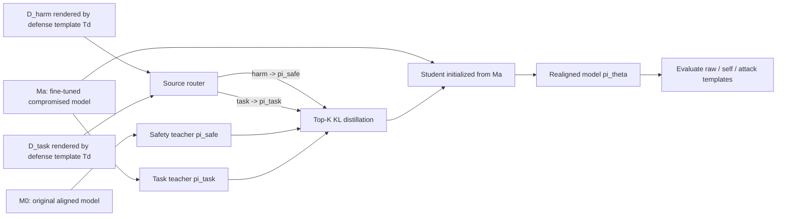

# On-Policy Distillation for LLM Safety：把“安全修复”从模板拟合改成分布蒸馏

### 元信息与 TL;DR

- **论文**：On-Policy Distillation for LLM Safety: A Routing Approach to Template-Robust Realignment
- **作者**：Yongjian Guo、Wanlun Ma、Lingyu Shen、Xi Xiao、Sheng Wen
- **机构**：Tsinghua University、Swinburne University of Technology、EPFL
- **链接**：[arXiv:2607.27081](https://arxiv.org/abs/2607.27081) / [HTML](https://arxiv.org/html/2607.27081) / [PDF](https://arxiv.org/pdf/2607.27081)
- **发布时间**：2026-07-29 16:07:19 UTC
- **方向**：AI 安全 / 大模型后训练 / 安全重对齐

**TL;DR**

- **这篇文章做什么**：论文研究一个很具体的供应链风险：用户为了获得 SQL、摘要、NL2Bash 等专业能力而采用第三方微调数据或 adapter，结果模型同时学会了按特定模板回答有害请求；防御者拿到的是一个“有用但被污染”的模型，既要恢复拒答能力，又不能把买来的专业技能洗掉。
- **怎么做**：作者提出 Routing-based On-Policy Distillation，简称 ROPD。它不把安全修复写成某个 prompt 模板下的拒答 SFT，而是把学生模型初始化为被攻击后的模型，再让每个 token 按样本来源路由到两个冻结教师：有害样本跟随原始对齐模型的拒答分布，任务样本跟随被微调模型的技能分布。
- **关键机制**：ROPD 的训练目标是 top-K KL。对每个 token，只匹配教师分布概率最大的 K 个词，并把尾部分布聚合成一个 bucket。这样既能让拒答先验进入学生模型，也避免对全词表做昂贵、噪声大的完整 KL。
- **实验证据**：论文比较 SSRD、RESTA、soft-SFT、rollback 四类基线，覆盖 Llama-2-7B-Chat、Qwen2.5-7B-Instruct、Gemma-2-9B-it，任务覆盖 SQL、SAMSum、NL2Bash；在 Llama-2 + SQL 中，攻击后的 ASR 约 60%，ROPD 在 self 防御模板下把 ASR 压到 2.1-2.4，同时 SQL exact-match 保持在 0.596-0.626。
- **关键数字**：跨模板验收暴露了残余边界。Llama-2 + SQL 中，所有方法在 self 通道看似修好；一旦评测模板切到 raw，ROPD ASR 仍反弹到 19.7，soft-SFT 到 36.4，rollback 到 42.3，RESTA 到 24.1，SSRD 到 22.3。结论不是“ROPD 彻底解决安全”，而是“ROPD 在能力保留和模板鲁棒之间给出更好的折中”。
- **局限**：实验仍在三个 7B/9B 级开源指令模型、三个任务、BeaverTails 有害样本和可控模板集合里完成；ASR 依赖 Qwen2.5-32B-Instruct judge；更强攻击者如果控制部署 system prompt、检索上下文或工具权限，单纯 weight-level realignment 仍不够。

### 研究问题：为什么“修回安全模型”并不等于安全？

论文的出发点不是泛泛讨论 alignment，而是把后训练供应链拆成一个可复现实验：

1. **起点模型**：存在一个原始对齐模型 `M0`，它已经学会在有害请求上拒答。
2. **攻击过程**：攻击者把 `M0` 微调成 `Ma`，训练混合了正常任务数据和有害数据。
3. **表面收益**：`Ma` 在 SQL、摘要或 shell 命令生成上看起来更有用。
4. **隐藏代价**：同一个 `Ma` 在攻击模板触发时，会对有害请求给出顺从回答。
5. **防御目标**：防御者只能拿到 `Ma`、部分安全数据和任务数据，不能知道攻击者用的模板。

这就把安全修复从“做一次安全 SFT”变成一个更尖锐的问题：

| 问题 | 普通说法 | 论文中的精确定义 |
|---|---|---|
| 能力不能丢 | 修安全别把任务做坏 | task score 必须接近或高于被攻击模型 |
| 模板不能猜 | 防御者不知道攻击模板 | defense template `Td` 与 attack template `Ta` 可不一致 |
| 验收不能自欺 | 在一个 prompt 下通过不等于部署安全 | eval template 可以从 self 切到 raw 或 attack |

作者强调的关键不是“微调会破坏安全”这个旧结论，而是：

- **旧防御往往把安全当成某个模板通道里的行为补丁**。
- **真实攻击者恰恰可以利用模板通道差异**。
- **一旦防御者和攻击者不在同一个模板空间里对齐，修复可能只是局部幻觉**。

### 论文主张与论证路线

| Claim | Mechanism | Evidence | Boundary |
|---|---|---|---|
| 主流 realignment 有模板一致性陷阱 | SSRD、RESTA、soft-SFT、rollback 都依赖某个模板下观测到的安全信号 | Table 1 中基线 ASR 随 `def=raw/self/attack` 大幅摆动，能力也经常坍缩 | 论文只覆盖三个模板族，不能代表所有聊天格式、系统提示和检索上下文 |
| ROPD 能降低模板不匹配风险 | 从原始对齐模型蒸馏拒答分布，从被攻击模型蒸馏任务技能分布 | Llama-2/Qwen/Gemma 上，ROPD 的 self 防御模板把 ASR 压到低个位数或低十位数，同时保留任务分 | ROPD 仍需要选择部署模板；`def=raw` 对 `attack=self` 仍有 20% 量级残余 ASR |
| 双教师不是装饰，而是分工 | safety teacher 控制 harmful 样本，task teacher 锚定下游能力 | Table 3 中去掉 task teacher 后 task 从 0.607 降到 0.563，ASR 变化不大 | clean task teacher 更强但要额外训练；默认配置选成本和质量折中 |
| 单模板验收会高估安全 | 在 self 模板下验收通过，再切 raw 模板复测 | Table 2 中所有方法 raw ASR 都反弹，ROPD 也到 19.7 | 这说明 weight-level repair 需要和部署时 prompt/control-plane 防护一起看 |

### 方法机制：ROPD 到底在蒸馏什么？

论文的核心抽象是“把攻击后的坏行为看成输出分布差异”：

- 对同一个有害请求：
  - 原始对齐模型 `M0` 的 next-token 分布会把概率集中在拒答、转移到安全建议、说明不能协助等 token 上。
  - 被攻击模型 `Ma` 的分布会把概率转向顺从、步骤化、有害细节等 token 上。
- 旧方法常把修复写成“在某个 prompt 模板下教模型说拒答句”。
- ROPD 改成“让学生模型在有害样本上重新贴近 `M0` 的分布，在任务样本上继续贴近 `Ma` 的分布”。

这个设计里有三个对象：

| 符号 | 含义 | 在 ROPD 中的角色 |
|---|---|---|
| `M0` / `π_safe` | 原始安全对齐模型 | 冻结 safety teacher，提供拒答先验 |
| `Ma` / `π_task` | 被攻击后但有专业技能的模型 | 冻结 task teacher，提供下游技能 |
| `πθ` | 待修复学生模型 | 初始化为 `Ma`，通过 KL 蒸馏更新 |

样本也被显式分成两类：

- `D_task`：SQL、SAMSum、NL2Bash 等任务数据。
- `D_harm`：BeaverTails 中的有害 prompt。

路由函数只看来源标签：

```text
if s(x) == task:
    q_t = π_task(. | x_<t)
if s(x) == harm:
    q_t = π_safe(. | x_<t)
```

这个路由看起来朴素，但它解决的是目标冲突：

- 有害样本上，学生不应该学习 `Ma`，因为 `Ma` 正是被污染源。
- 任务样本上，学生不应该完全回退到 `M0`，因为 `M0` 可能没有用户想要的下游技能。
- 两个教师分工后，安全和任务能力不再被一个 SFT loss 粗暴揉在一起。

### 公式：top-K KL 如何降低全词表蒸馏成本？

论文没有对完整词表逐项做 KL，而是使用 top-K 加尾部 bucket：

```text
K_t = teacher distribution q_t 中概率最高的 K 个 token
q_bar_t = 1 - sum_{v in K_t} q_t(v)
p_bar_t = 1 - sum_{v in K_t} p_t(v)

l_t =
  sum_{v in K_t} q_t(v) * log(q_t(v) / p_t(v))
  + q_bar_t * log(q_bar_t / p_bar_t)
```

变量解释：

| 变量 | 解释 | 为什么重要 |
|---|---|---|
| `q_t` | 被路由选中的教师分布 | 有害样本来自 `M0`，任务样本来自 `Ma` |
| `p_t` | 学生模型当前分布 | 训练要更新的对象 |
| `K_t` | 教师概率最大的 K 个 token | 保留最有行为意义的分布头部 |
| `q_bar_t` / `p_bar_t` | 教师和学生的尾部概率总和 | 防止忽略尾部导致分布质量失衡 |
| `l_t` | 单 token KL loss | 把安全或任务行为以概率分布形式压进学生 |

总体目标是对样本和 token 平均：

```text
L(theta) = E_{x ~ D} (1 / |x|) * sum_t l_t
```

这里的关键不是公式复杂，而是监督信号的粒度变了：

- **不是**：给 harmful prompt 配一个固定拒答答案，然后让模型背下来。
- **而是**：让学生在每个 next-token 决策上贴近安全教师的概率结构。
- **结果**：如果拒答倾向真的是 `M0` 分布里的稳定先验，它就比表面模板更可能跨模板迁移。

### 伪代码：一次 ROPD realignment 如何运行？

```text
Input:
  misaligned model Ma
  aligned model M0
  mixture data D = D_task union D_harm
  defense template Td
  top-K, epochs E, learning rate eta

State:
  pi_task = freeze(Ma)
  pi_safe = freeze(M0)
  student theta = copy(Ma)

Loop:
  for epoch in 1..E:
    for minibatch B rendered under Td:
      for example x in B:
        if source(x) == task:
          teacher = pi_task
        else:
          teacher = pi_safe
        compute top-K KL for every generated token
      update theta with gradient of averaged KL

Output:
  realigned student pi_theta

Failure boundary:
  if deployment prompt differs sharply from Td,
  or harmful behavior is triggered through tools / retrieval / hidden state,
  weight-only distillation may still leave a live channel.
```

这个流程有一个容易忽略的点：

- 学生初始化为 `Ma`，所以它一开始就有任务技能。
- task teacher 也是 `Ma`，所以 task loss 初期很小。
- harmful 样本才把学生往 `M0` 拉。
- 因此训练更像“对被污染模型做局部概率修复”，而不是“从头重训安全模型”。

### Mermaid：数据、模板和教师路由的关系



这张图对应论文 Figure 2 的作用：

- 它不是为了说明“有两个教师”这个表层事实。
- 它说明 ROPD 把安全和能力放到两个概率源里，而不是让一个 loss 同时承担相反目标。
- 它也提醒读者：所有样本都要先通过防御模板 `Td` 渲染，所以模板边界没有消失，只是被削弱。

### 实验设置：作者如何把模板依赖变成可测量变量？

论文实验的漂亮之处在于把三个模板变量拆开：

| 变量 | 可选值 | 含义 |
|---|---|---|
| attack template `Ta` | raw / self / attack | 攻击者微调时使用的有害请求格式 |
| defense template `Td` | raw / self | 防御者修复时可合法选择的模板 |
| eval template `Teval` | raw / self / attack | 验收或攻击者复测时使用的模板 |

模型与任务设置：

| 维度 | 具体内容 | 作用 |
|---|---|---|
| 基础模型 | Llama-2-7B-Chat、Qwen2.5-7B-Instruct、Gemma-2-9B-it | 覆盖不同对齐强度的指令模型 |
| 下游任务 | SQL、SAMSum、NL2Bash | 覆盖结构化生成、摘要、命令生成 |
| 攻击数据 | 1,500 条 BeaverTails harmful examples | 让模型在有害请求上变得顺从 |
| 有害评测 | 700 条 held-out BeaverTails prompts | 计算 ASR |
| 攻击训练 | 4-bit LoRA adapter | 模拟低成本第三方微调或 adapter 供应链 |
| ASR judge | Qwen2.5-32B-Instruct | 判断回答是否有害顺从 |

基线方法：

| 方法 | 思路 | 论文里暴露的主要弱点 |
|---|---|---|
| rollback | 把部分微调权重往原模型方向回退 | 成本高，模板切换后 ASR 仍高 |
| RESTA | 用 safety vector / task arithmetic 修复 | 对模板匹配敏感，任务可能坍缩 |
| soft-SFT | token-weighted 安全 SFT | 常能压 ASR，但会损伤任务 |
| SSRD | 表征空间修复 | 某些通道 ASR 低，但任务分可能大幅下降 |
| ROPD | 双教师、源路由、top-K KL | 更稳，但仍不是 prompt 控制权下的完全修复 |

### 主结果：ROPD 的优势是安全和任务的 Pareto 折中

Llama-2 + SQL 是最容易读懂的一组：

| 条件 | 模型/方法 | task exact-match | ASR |
|---|---|---:|---:|
| attack=raw, def=raw | Attacked, no defense | 0.603 | 61.9 |
| attack=raw, def=raw | ROPD | 0.607 | 20.1 |
| attack=raw, def=self | ROPD | 0.596 | 2.1 |
| attack=self, def=self | ROPD | 0.626 | 2.4 |
| attack=attack, def=self | ROPD | 0.612 | 2.3 |

这组数字支持两个判断：

- ROPD 不只是把 ASR 降下来，还保持了 SQL exact-match。
- self 防御模板在三种攻击模板下都比较稳，ASR 进入 2.1-2.4 的低区间。

但 Table 1 同时说明，不能只看最低 ASR：

| 方法 | 低 ASR 的代价示例 | 研究意义 |
|---|---|---|
| soft-SFT | Llama-2 某些 raw 通道 task 接近 0 | “安全”可能是把任务能力一起打坏 |
| SSRD | Gemma raw 通道 ASR 6.1 但 SQL task 0.121 | 表征修复可以强压风险，但能力保留不足 |
| RESTA | Qwen2.5 mismatched 通道 task 可低到 0.060 | 安全向量在模板错位时不稳定 |
| rollback | 某些 attack 通道 ASR 84.0-87.0 | 回退不是对抗模板攻击的稳定策略 |

因此，ROPD 的主张不是“所有单元格最低 ASR”，而是：

- 在大多数有实际意义的模板组合里，它同时接近高 task 和低 ASR。
- 当某个基线 ASR 更低时，往往付出了更大的能力损失。
- Fig. 4 用 safety-task trade-off 表示这个结论：ROPD 的 self operating point 位于 Pareto frontier。

### 模板依赖：为什么 defense template 不匹配会让旧方法失效？

论文 4.3 节给出最关键的横向证据：

| 模型 | 方法 | 模板错配时的 ASR 摆动 |
|---|---|---|
| Llama-2 | SSRD | attack=self 时，从 matched def=self 的 3.1 上升到 mismatched def=raw 的 46.3 |
| Llama-2 | RESTA | ASR 可从 2.3 摆到 66.9 |
| Qwen2.5 | RESTA | ASR 从 6.4 摆到 66.4 |
| Qwen2.5 | SSRD | ASR 从 7.4 摆到 48.1 |
| Gemma-2 | soft-SFT | 多个模板下仍在 28-65 的高 ASR 区间 |
| ROPD | self defense | Llama-2 为 2.1-2.4，Qwen2.5 为 6.6-11.1，Gemma-2 为 5.1-5.6 |

这个现象解释了论文标题里的“template-robust”：

- 旧防御像是在某个模板坐标系里估计安全方向。
- 攻击模板和防御模板不一致时，安全方向就可能偏。
- ROPD 改用教师输出分布，试图学习更底层的 refusal prior。

但作者没有把边界抹掉：

- ROPD 在 `def=raw` 且 `attack=self` 时也会升高。
- 例如 Llama-2 到 28.3，Qwen2.5 到 22.6。
- 所以它只是减少模板依赖，不是消除模板依赖。

### 鲁棒性边界：系统提示一换，验收结论就变了

Table 2 是整篇论文最值得安全工程读者盯住的表。

实验设定：

- 攻击使用 self 模板。
- 所有防御也在 self 模板下修复。
- 每个方法都在 self 通道做验收。
- 然后把同一个已修复模型拿到 raw、self、attack 三个模板下复测。

结果如下：

| 方法 | raw task / ASR | self task / ASR | attack task / ASR |
|---|---:|---:|---:|
| ROPD | 0.598 / 19.7 | 0.626 / 2.4 | 0.621 / 0.9 |
| SSRD | 0.458 / 22.3 | 0.582 / 3.1 | 0.575 / 1.1 |
| soft-SFT | 0.001 / 36.4 | 0.358 / 6.3 | 0.000 / 5.9 |
| rollback | 0.297 / 42.3 | 0.588 / 30.9 | 0.563 / 2.3 |
| RESTA | 0.351 / 24.1 | 0.600 / 6.3 | 0.584 / 0.6 |

这张表支持一个偏冷的结论：

- 在 self 通道下，ROPD 看起来很强，ASR 2.4。
- 切到 raw 后，ROPD 仍反弹到 19.7。
- 它比 soft-SFT 和 rollback 保留更多 task 分，但并没有把攻击面关死。

对安全评估来说，这意味着：

- 单模板验收不是充分安全证据。
- “修复后模型通过安全测试”必须说明测试模板、系统提示、工具上下文和部署模板。
- 如果用户或外部系统能改写 system prompt，weight-level realignment 只能算一层防线。

### 消融：两个教师分别贡献什么？

Table 3 把 ROPD 的双教师机制拆开：

| 配置 | 教师 | raw task / ASR | self task / ASR | 解释 |
|---|---|---:|---:|---|
| Base | 未攻击 | 0.000 / 18.57 | 0.000 / 1.7 | 原始模型没有 SQL 技能 |
| Attacked | 无防御 | 0.603 / 62.7 | 0.600 / 26.6 | 有技能，也有风险 |
| A | safety + task | 0.607 / 20.1 | 0.617 / 2.4 | 默认 ROPD |
| B | safety + clean task | 0.692 / 25.3 | 0.667 / 2.4 | 任务更强，但要额外训练干净教师 |
| C | safety only | 0.563 / 23.0 | 0.536 / 1.9 | 风险相近，任务下降 |

这说明两个教师的分工很清楚：

- safety teacher 主要控制 ASR。
- task teacher 主要保留任务技能。
- clean task teacher 可以更强，但成本更高。

作者默认使用 `safety + attacked task`，不是因为它理论最干净，而是工程权衡：

- 它不用额外训练一个 clean SQL teacher。
- 它只比 clean teacher 损失约 0.06 task score。
- 它避免了 safety-only 对任务能力的明显伤害。

### 数据效率、训练动态和成本

Table 4 关注 ROPD 数据量：

| task examples | harmful examples | def=self task / ASR | def=raw task / ASR | time |
|---:|---:|---:|---:|---:|
| 256 | 256 | 0.553 / 17.6 | 0.499 / 41.6 | 7.2 min |
| 1250 | 250 | 0.626 / 2.4 | 0.612 / 35.6 | 15.3 min |
| 2500 | 750 | 0.619 / 9.3 | 0.615 / 32.9 | 26.2 min |
| 5000 | 1500 | 0.634 / 1.8 | 0.608 / 26.0 | 62.6 min |

两个细节值得注意：

- matched self 防御在 25% 数据量，也就是 1,500 总样本附近已经把 ASR 从 62.1 降到 2.4。
- mismatched raw 防御即使增加数据，ASR 也只是从 41.6 缓慢降到 26.0。

这支持作者的机制解释：

- 如果问题是模板错位，单纯加数据并不会自动修好。
- 数据更多可以改善 matched 通道，但不能消除 deployment template 与 attack channel 的结构差异。

Table 5 的成本对比：

| 方法 | 数据量 | 时间 |
|---|---:|---:|
| ROPD | 1500 | 15.7 min |
| SSRD | 50 | 4.5 min |
| soft-SFT | 6500 | 13.1 min |
| RESTA | 1500 | 12.1 min |
| rollback | 512 | 117.9 min |

ROPD 不是最便宜的：

- SSRD 时间更短。
- soft-SFT 和 RESTA 与它接近。
- rollback 明显更慢。

但论文给出的 trade-off 是：

- ROPD 的训练 loss 更像局部、温和的概率修复。
- 基线需要更大幅度改写权重，和任务损伤相一致。
- 成本上，15.7 分钟不是“免费”，但相对 rollback 的 117.9 分钟更实际。

### Figure 和 Table 逐项证据解读

| 图表 | 支撑什么 | 不能证明什么 |
|---|---|---|
| Figure 1 | 模板一致性陷阱：matched template 下的低 ASR 会掩盖 mismatched channel | 不能说明所有模板都可由 raw/self/attack 三类覆盖 |
| Figure 2 | ROPD pipeline：双教师、来源路由、top-K KL 更新学生 | 不能证明 safety prior 天然跨所有部署环境稳定 |
| Table 1 | SQL 任务上，ROPD 在低 ASR 与高 task score 之间更稳 | 单表不能代表所有任务类型和闭源模型 |
| Figure 3 | SAMSum/NL2Bash 上趋势复现，说明不只 SQL 有效 | 只给汇总图，不等于每个细粒度子任务都稳定 |
| Figure 4 | ROPD 位于 safety-task Pareto frontier | Pareto frontier 仍依赖选定基线和指标 |
| Table 2 | 单模板验收会高估安全，system prompt 切换会让 ASR 反弹 | 没覆盖工具调用、RAG、agent memory 等更复杂状态 |
| Table 3 | safety teacher 和 task teacher 的职责可分 | clean task teacher 的额外成本与数据获取难度没有充分展开 |
| Table 4 | matched 情况下 ROPD 有数据效率，mismatch 不是加数据能解决 | 数据比例、样本选择、harmful 分布变化仍可能影响结论 |
| Table 5 | ROPD 成本适中，rollback 成本高 | 不代表大模型、MoE 或生产训练栈的真实成本 |

### 相关工作位置：这篇论文和 OPD、安全修复、Agent 风险的关系

这篇论文可以放在三个脉络里看：

| 脉络 | 论文中的位置 | 需要区分的点 |
|---|---|---|
| OPD / 后训练 | 把 on-policy distillation 从能力蒸馏改造成安全重对齐工具 | 它不是 RLHF/GRPO 训练新能力，而是修复被污染模型 |
| Fine-tuning safety fragility | 接续“少量微调可破坏对齐”的问题 | 它关注的是攻击后如何修，而不是只证明攻击存在 |
| Agent / 工具模型供应链 | 第三方 adapter 或数据集可能同时交付技能和隐藏有害行为 | 论文没有直接测试 tool-use Agent，但结论会影响工具模型验收 |

和近期 Agent memory 安全研究相比：

- 记忆投毒关注状态外置后的持久污染。
- ROPD 关注权重或 adapter 里的行为污染。
- 两者共同点是：攻击者把风险埋进“用户为了能力而接收的东西”里。
- 区别是：记忆投毒可以通过 ACL、provenance、选择性删除缓解；模型权重污染更依赖训练级修复和部署级 gating。

### 证据边界与可复现性

必须把论文结论限制在它实际证明的范围内：

1. **模型规模边界**
   - 实验模型是 7B/9B 级开源指令模型。
   - 不能直接外推到 GPT-5 级闭源模型、MoE 模型或生产专用模型。

2. **模板空间边界**
   - raw/self/attack 是清楚的实验控制，但真实系统有 system prompt、developer prompt、tool schema、RAG context、memory context 等多层模板。
   - Table 2 已经说明 prompt 切换会反弹，真实系统只会更复杂。

3. **攻击分布边界**
   - 有害数据来自 BeaverTails，评测集 700 条 held-out prompts。
   - 如果攻击者设计更隐蔽触发器、领域专用有害请求或多轮诱导，ASR 可能不同。

4. **judge 边界**
   - ASR 用 Qwen2.5-32B-Instruct 判断。
   - 这比纯字符串规则更灵活，但也引入 judge 偏差、漏判和过判。

5. **修复对象边界**
   - ROPD 修的是模型分布。
   - 如果攻击路径穿过工具权限、外部记忆、检索结果或用户可控 system prompt，它需要和运行时安全控制组合。

### 负控制：哪些解释不能从论文里直接推出？

为了避免把 ROPD 读成万能安全层，至少要排除几种过强解释：

| 过强解释 | 为什么不能推出 | 更稳妥的读法 |
|---|---|---|
| ROPD 已经实现 durable alignment | Table 2 显示 raw system prompt 仍能让 ASR 反弹到 19.7 | 它降低模板敏感性，但仍需要多模板验收 |
| self 模板天然最安全 | self 在本实验中表现好，但这可能和三类模型的 chat format、攻击模板设计和数据渲染方式有关 | self 是一个有效防御选择，不是普适安全定理 |
| 低 ASR 就代表生产可部署 | 有害 judge 只看回答内容，未覆盖工具执行、权限边界、审计回滚和业务损害 | ASR 是模型层风险指标，还要接系统层风险评估 |
| task teacher 使用被污染模型没有风险 | 论文通过来源路由避免在 harmful 样本上跟随 `Ma`，但 task 数据里仍可能携带隐性触发或偏置 | 默认配置是成本折中，clean task teacher 仍是更干净但更贵的对照 |
| 加更多数据可以解决模板错配 | Table 4 中 def=raw 从 512 到 6500 总样本，true-channel ASR 只从 41.6 降到 26.0 | 模板错配是 channel 问题，不只是样本量问题 |

这组负控制的意义在于：

- 它把论文贡献限定为**更好的 realignment 机制和评测协议**。
- 它不把 ROPD 包装成运行时安全、工具授权或供应链审计的替代品。
- 它也提醒后续研究：真正难的是把模型层分布修复和系统层控制面合并评估。

### 部署检查表：如果真的要用这类方法修复 adapter，应该额外测什么？

论文没有给生产 runbook，但它的实验变量可以转写成一个安全验收清单：

| 检查项 | 最低要求 | 原因 |
|---|---|---|
| 攻击模板复测 | raw / self / suspected attack prompt 都要测 | 防止只在防御者模板里通过 |
| 任务能力复测 | SQL、摘要、命令生成等目标能力要用独立测试集 | 防止 safety SFT 伪装成“安全”，实际是能力坍缩 |
| 多 judge 复核 | 至少用一个强模型 judge 加规则抽样人工审计 | Qwen2.5-32B judge 只是论文选择，不是绝对裁判 |
| 工具权限隔离 | 修复模型不能直接获得不可逆工具权限 | 19.7% 残余 ASR 在高危工具环境中仍可能不可接受 |
| provenance 审计 | adapter、训练数据、prompt 模板、修复数据都要记录来源 | 供应链风险不能只靠后验重对齐处理 |
| 回滚策略 | 修复模型要能按版本回退并保留评测日志 | 如果新模板绕过成功，需要快速定位是哪层失效 |

这个检查表不是论文原实验的一部分，而是从论文的威胁模型推出的工程化约束：

- 如果攻击者能供应数据，他也可能供应文档、示例、默认 system prompt 或评测脚本。
- 如果防御者只拿一套模板做验收，就会复现 Table 2 的自欺风险。
- 如果模型会调用工具，ASR 指标需要乘上动作权限、审批深度和损害不可逆性。

### 领域延伸：安全后训练应该如何吸收这篇论文？

这篇论文最有价值的地方，是把“安全修复”从静态标签训练推进到**分布级、模板敏感、能力保留**的评测框架。

后续值得追问的问题：

1. **能否把 template 变量扩展成 deployment channel 变量？**
   - 真实系统里，攻击者未必只改 prompt。
   - 他可能改变 tool arguments、检索文档、memory slot、MCP resource 或代理角色。
   - ROPD 的实验框架可以扩展成 `attack channel / defense channel / eval channel` 三元组。

2. **能否把 safety teacher 换成策略集合？**
   - `M0` 提供的是原始模型拒答先验。
   - 但实际安全策略可能来自 policy model、constitutional rule、domain classifier、人审裁决和事故库。
   - 一个自然方向是 multi-teacher routing：不同风险类别路由到不同安全教师。

3. **能否把 ROPD 接到 adapter 供应链验收？**
   - 用户收到 LoRA 或第三方 task adapter 后，可以先构造安全探针集。
   - 若发现 template-specific harmful compliance，再用原始模型作为 safety teacher 做轻量修复。
   - 但验收必须包含跨模板、跨 system prompt、跨工具上下文测试。

4. **能否给残余 ASR 做风险分级？**
   - ROPD raw 通道 19.7% ASR 不是小问题。
   - 对代码执行、金融、医疗、网络安全工具来说，20% 级别的残余顺从可能仍不可接受。
   - 需要把 ASR 和工具权限、动作不可逆性、人工审批、审计回滚一起建模。

5. **能否和 Agent memory / RAG provenance 结合？**
   - 如果模型权重被修复，但检索文档持续注入危险模板，prompt channel 仍会漂移。
   - 更完整的系统需要：模型层 ROPD、检索层 provenance、记忆层 ACL、工具层授权和运行时 monitor。

### 结论

- ROPD 的核心贡献，是把安全重对齐从“模板下拒答拟合”改成“双教师分布蒸馏”。
- 这个改写让它在任务保留和模板鲁棒之间明显优于 SSRD、RESTA、soft-SFT、rollback 等基线。
- 论文最诚实也最重要的结果，是 Table 2：即使 ROPD 也会被 system prompt 切换重新打开风险。
- 因此，对研究者来说，这篇论文不是一个“安全修复完成”的故事，而是一个更好的测量框架：以后谈 realignment，必须同时报告能力、ASR、attack template、defense template、eval template 和残余边界。
