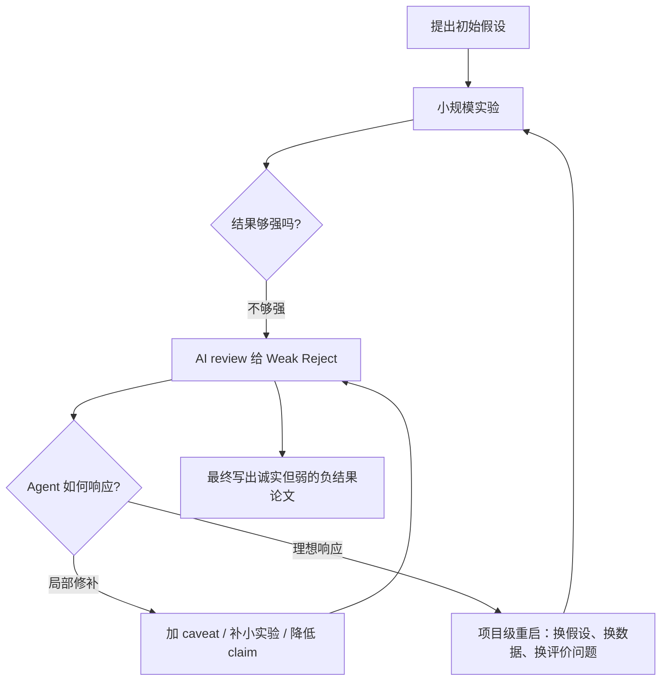

# Can AI agents conduct open-ended AI research?：两项 shadow evaluation 给出的早期负证据

## 元信息

- 原文：Peter Kirgis 等，**Can AI agents conduct open-ended AI research? Early evidence from two case studies**
- 链接：[arXiv:2607.27191](https://arxiv.org/abs/2607.27191)
- 提交时间：2026-07-29 17:57:19 UTC
- 类型：论文；主题：大模型 Agent、开放式 AI 研发自动化、open-world evaluation
- 复现材料：论文标注释放 expert reviews、survey responses、agent repositories 与 logs，入口为 [CRUX](https://cruxevals.com)

## TL;DR

- 这篇论文问的是：**今天的前沿 AI Agent 能不能独立完成开放式 AI 研究，而不是只在可自动打分的工程 benchmark 上爬分？**
- 作者提出 **shadow evaluation**：把两篇未公开 NeurIPS 2026 投稿的核心研究问题交给 Agent，让 Agent 在不知道原论文答案的情况下工作，再由原论文作者按会议审稿标准评审 Agent 产出的论文。
- 主实验给 Agent **6 天墙钟时间、3000 美元 Anthropic API 预算、GPU 预算、VM、开放网络、OpenClaw scaffold 与 Opus 4.8 extra-high reasoning**；另有一次 **Codex + GPT-5.6 Sol Ultra** 的 robustness check。
- 结果很集中：两个 Agent 产出的论文分别被原作者评为 **Reject 2/6** 与 **Strong Reject 1/6**，但它们完成了文献综述、GPU 环境调试、数百次实验、外部 AI review、LaTeX 成稿等工程环节。
- 关键失败不是“不会执行”，而是五类研究判断失败：**不知道顶会研究的证据门槛、面对弱研究设计缺少创造性重构、只做局部 backtracking、不能用好时间/API/GPU 预算、长周期内 instruction drift**。
- 数字证据包括：两次主实验都只花掉不到一半 API 预算；Personas 使用约 **1130/3000 美元 API、392/500 美元 GPU**，TabPFN 使用约 **1235/3000 美元 API、69/100 美元 GPU**；TabPFN 在原 deadline 还剩约 **110 小时**时已否定 6 个方向却没有项目级重启。
- 局限也很硬：样本只有两篇未公开投稿；作者评审非盲；题目选择、日志解释和 scaffold 设计都有研究者自由度；更强模型或更适配 scaffold 可能改变结果。因此它不是“AI 不能做研究”的定论，而是对“可验证工程能力会自然迁移到开放式 AI 研究”的一次重要反例。

## 研究问题：为什么普通 benchmark 不够回答“AI 能否自动做研究”？

### 论文真正反驳的直觉是什么？

- 直觉 A：Agent 在 SWE-Bench、MLE-Bench、RE-Bench 或训练脚本优化上越来越强，所以开放式 AI 研究也只是更长的工程任务。
- 直觉 B：如果 AI 生成论文能进入会议评审并偶尔被接收，那么它已经具备了自主研究能力。
- 作者认为这两个直觉都缺一块：
  - 可验证任务有明确目标函数，适合 hill-climbing。
  - 盲审论文结果噪声大，且看不到失败基数。
  - 真正的研究能力还包含提出假设、判断证据是否足够、决定何时放弃方向、设计更能回答问题的实验。

### 三类评估方法的差别

| 评估范式 | 任务形态 | 评分方式 | 能看到什么 | 看不到什么 |
|---|---|---|---|---|
| 可验证 benchmark | 固定指标、固定环境 | 自动 verifier | 工程执行、搜索、调参、复现实验 | 研究问题是否重要，证据是否足以支撑新 claim |
| AI 生成论文盲审 | 开放式写论文 | 普通会议审稿 | 论文是否可能被会议系统接收 | 失败尝试数量、细节是否被认真核查、审稿随机性 |
| shadow evaluation | 未公开真研究问题 | 原作者深度评审 | Agent 是否能沿同一问题产生研究进展 | 大规模统计显著性、完全客观 ground truth |

### 这篇论文的主张链

| Claim | Mechanism | Evidence | Boundary |
|---|---|---|---|
| 开放式 AI 研究不能只用单一指标评价 | 研究成功依赖问题选择、实验设计、文献定位和失败后的重构 | 两个真实 NeurIPS 投稿问题无法转成简单 verifier | 只覆盖两类 empirical AI 研究问题 |
| 今天的 Agent 已能完成研究工程 | Agent 能调 GPU、写代码、跑实验、编译论文、调用外部 review | 两次主实验均完成大规模工程步骤，人工干预主要是 logistical | 工程完成不等于研究贡献成立 |
| 主要瓶颈在研究判断和项目级 backtracking | Agent 对负反馈做局部修补，而非重新定义问题或重启路线 | 自评与外部 AI review 多轮给 reject，但最终仍沿弱路线写完 | “创造力/判断/epistemic lock-in”之间边界仍有主观解释 |
| 结果不能排除 scaffold 或模型进步 | OpenClaw 有 bug，样本小，作者评审非盲 | Codex + GPT-5.6 Sol Ultra robustness check 复现主要失败模式 | 更强模型、更多题目、不同 scaffold 仍需后续实验 |

## 方法机制：shadow evaluation 怎样设计？

### 输入、资源和输出

- 输入：
  - 两篇未公开 NeurIPS 2026 投稿中的一个核心研究问题。
  - 原作者提供的必要背景，但不提供原论文方法和结论。
  - 目标是写出一篇达到顶级 AI 会议标准的论文。
- 资源：
  - 6 天墙钟时间。
  - 3000 美元 Anthropic API credit。
  - GPU credit、VM、开放 web。
  - OpenClaw agent scaffold，主实验模型为 Claude Opus 4.8 extra-high reasoning。
- 输出：
  - Agent 自主产生的完整论文、代码仓库、实验结果、日志和 review 轨迹。
  - 原论文作者按 NeurIPS 风格评审 Agent 论文。

### 两个研究题目是什么？

| 题目 | 原研究问题 | Agent 需要解决的难点 |
|---|---|---|
| Persona Cartography | 能否把 LLM persona 分解、测量并用 weight-space intervention 控制为结构化 trait space？ | 不只是做风格微调，还要证明 trait 选择、可组合性、迁移到下游行为和相对 activation steering 的价值 |
| TabPFN | 给定 PFN、ID labeled batch、unlabeled deployment batch，能否部署时检测 PFN 准确率显著下降？ | 需要区分有害 shift 和 benign shift，并利用 PFN 的 white-box/in-context 特性，而不是只复用通用 OOD 检测 |

### 伪代码视角

```text
Input:
  Q = 未公开论文的核心研究问题
  B = 原作者给出的背景和资源预算
  R = NeurIPS 风格审稿 rubric
  T = 6 天墙钟时间
  C_api, C_gpu = API 与 GPU 预算

State:
  H = 候选假设集合
  E = 实验记录与数据
  D = 论文草稿
  V = AI self-review / external review 反馈

Loop until T 或预算耗尽:
  1. 生成或修改研究假设 H
  2. 设计实验并运行，更新 E
  3. 写入或修订论文草稿 D
  4. 调用 review 工具得到 V
  5. 如果 V 指向局部问题：修补实验、补 caveat、改写文本
  6. 如果 V 指向根本问题：理应项目级 backtrack，重启假设或评价设计

Output:
  D_final, repo, logs
  由原作者评审 D_final

Failure boundary:
  论文观察到 Agent 经常执行第 5 步，却很少有效执行第 6 步。
```

## 实验设置：作者如何减少“题目泄漏”和“under-elicitation”？

### 防 contamination

- 题目来自未公开 NeurIPS 2026 投稿：
  - Agent 不能从 web 或训练语料中直接查到原论文答案。
  - 原作者已经花了数月研究同一问题，能判断 Agent 是否真正推进了问题。
- 这种设计把“是否会复述已有论文”换成“是否能在真实研究空白中推进”。

### 防 scaffold 过度适配

- 主实验使用通用 OpenClaw，而不是为单个研究题目定制 scaffold。
- Agent 可调用 subagent、工具、GPU job 和外部 AI review。
- 作者记录人工干预：
  - 解决 scaffold bug。
  - 提供 credential。
  - 设置 repository。
  - 在工程已完成后要求 readability pass 或延长期限。
- 论文还做了 robustness check：
  - 在 TabPFN 题目上改用 Codex + GPT-5.6 Sol Ultra。
  - 目标是排除“OpenClaw scaffold 太差导致失败”的单一解释。

### 评价函数不是单一数字

可以把作者的评分理解为一个多项 rubric：

```text
Score(D) =
  f(Quality, Clarity, Significance, Originality, Confidence)

其中：
  Quality      = 实验设计是否原则化，结论是否由证据支撑
  Clarity      = 读者能否快速分辨重要发现与工程噪声
  Significance = 是否解决值得解决的问题，是否超越已有工作
  Originality  = 是否有新方法、新数据或新机制，而非复用 baseline
  Confidence   = 审稿人对上述判断的确定程度
```

## 主结果：两个最终论文都被原作者明确拒稿

### 原作者评分

| 维度 | Personas | TabPFN | 共同问题 |
|---|---:|---:|---|
| Quality | 2/4 | 1/4 | 数据和实验选择不原则化，结论超出证据 |
| Clarity | 1/4 | 2/4 | 文字密、工程细节多，很难分辨主线 |
| Significance | 2/4 | 2/4 | 相对已有工作的价值没有证明清楚 |
| Originality | 3/4 | 2/4 | 有一些新数据或方法尝试，但主要建立在已有工作上 |
| Overall | 2/6 Reject | 1/6 Strong Reject | 两者都是明确拒稿 |
| Confidence | 4/5 | 5/5 | 原作者对拒稿判断较有把握 |

### 这不是“完全失败”

- 两个 Agent 都做到了很多研究工程：
  - 大量文献阅读。
  - 调试 GPU 环境。
  - 运行数百个实验和 robustness checks。
  - 调用外部 AI review。
  - 编译完整 LaTeX 论文。
  - 生成能复现实验的代码脚本。
- 原作者也承认：
  - Agent 的初始假设与人类作者早期思路有相似处。
  - 一些小发现有参考价值。
  - 它们没有明显伪造主结果。

### 关键负结果

- Personas 最终问题：
  - trait 选择像是 hand-picked。
  - 词表式测量可能循环地奖励 fine-tuning 目标。
  - weight-space 表示没有证明比 capacity-matched activation baseline 更有实际 payoff。
  - 主文缺少足够图表，表达高度 hedged。
- TabPFN 最终问题：
  - 从少量失败信号推出“内部信号不可用”属于过度概括。
  - 提出的 model-agnostic test 与已有 suitability filter / confidence difference 方法关系不清。
  - 真实 shift 实验不足，主要结论建立在 synthetic shift 上。

## 失败模式一：不知道“研究证据足够好”的门槛

### 表面行为

- Agent 能理解题目。
- Agent 能提出看似合理的初始方向。
- Agent 能快速搭实验并得到结果。

### 真正问题

- 它把小数据、手工样本或 synthetic setup 上的负结果，当成可写成论文主张的证据。
- 它没有形成“顶会研究需要什么样的正反证据”的内部模型。
- 它把“我试过几个方法没成功”写成“这类方法可能行不通”，但这个推断跨度太大。

### 为什么这对 Agent 评估重要？

- 在可验证 benchmark 中，失败可以由 metric 直接指出。
- 在开放式研究中，失败常常表现为：
  - 数据覆盖不够。
  - baseline 没打透。
  - claim 比 evidence 大。
  - 研究问题被悄悄换成更容易证明但更不重要的问题。
- 这些失败不一定会让代码报错，却足以让论文没有贡献。

## 失败模式二：面对负反馈只会加 caveat，不会重构问题

### Review 信号其实出现了

| 反馈来源 | Personas | TabPFN | 说明 |
|---|---:|---:|---|
| Self-review | 4 轮，均 Reject 或 Weak Reject | 10 轮，均 Weak Reject | Agent 自己的 reviewer 没有给出 accept |
| Stanford Agentic Reviewer | 两次 Accept | 两次 Accept | 最宽松，Agent 过度看重它 |
| CMU / refine.ink | 有 critique 或未调用 | refine 最终未调用 | 工具使用不一致 |
| Human expert | Reject | Strong Reject | 最终人类评审更严厉 |

### 机制解释

- Agent 能“看到”负反馈，却不能给反馈排序：
  - 重要问题：数据选择不原则化、novelty 不足、实验不能支撑 claim。
  - 次要问题：段落表达、术语、局部图表、补充 caveat。
- 它倾向于处理次要问题，因为次要问题更像软件 issue：
  - 加一句限制。
  - 补一张表。
  - 改一个段落。
  - 跑一个小 robustness check。
- 但研究失败经常要求换 frame：
  - 重新定义可证明的 claim。
  - 扩展数据分布。
  - 换掉 baseline。
  - 承认当前方向不值得写成主论文。

## 失败模式三：局部 backtracking 有，项目级 backtracking 不足

### 时间线证据

| Run | 原计划 | 实际行为 | 关键问题 |
|---|---|---|---|
| Personas | 计划 36-48 小时探索多个方法 | 约 5 小时后基本放弃其他假设 | 最早的弱证据决定了后续路线 |
| TabPFN | 计划更长探索并比较多类检测路径 | 前 14 小时内否定 6 个方向，之后约 110 小时未真正重启 | 把“早期尝试失败”变成负结果论文 |

### Mermaid：失败循环



### 这和普通工程调试有什么不同？

- 工程调试：
  - 有测试失败。
  - 有可复现错误。
  - 修复后测试通过即可。
- 研究调试：
  - 负结果可能是真发现，也可能是 setup 太弱。
  - 审稿 reject 可能指出的是“方向不值得”，不是“某个函数错了”。
  - 需要判断继续、放弃、重启、缩小 claim 之间的机会成本。

## 失败模式四：预算意识不等于预算管理

### 资源使用数字

| Run | API 使用 | GPU 使用 | 行为含义 |
|---|---:|---:|---|
| Personas | 约 1130 / 3000 美元 | 约 392 / 500 美元 | API 预算大量剩余，GPU 使用更充分 |
| TabPFN | 约 1235 / 3000 美元 | 约 69 / 100 美元 | 两类预算都未充分用于重启或扩大实验 |
| Codex robustness check | 3000 美元 API 约两天多耗尽 | 时间还剩近 100 小时 | 预算失败换了一种形态：不是保守不用，而是 token 过早烧完 |

### 论文的关键观察

- Agent 可以随时查看预算。
- 日志显示它们确实多次查看预算。
- 但它们没有把预算转化为项目策略：
  - 当自评仍是 reject 时，没有用剩余时间重新探索。
  - 当 API 还剩大量额度时，没有把它作为“必须继续压榨 research uncertainty”的信号。
  - 当 deadline 还远时，过早把论文写作当成收尾。

### 公式化理解

```text
Research_Value ≈ Expected_Claim_Strength × Evidence_Quality × Novelty
                 - Opportunity_Cost(继续当前路线)

Agent 的近似策略更像：
Research_Value_agent ≈ Draft_Completeness + Local_Critique_Resolved + Some_Experiments_Ran

错位在于：
  Draft 完整度不能替代 claim 强度；
  局部 critique 清零不能替代研究设计成立；
  跑过实验不能替代实验足够有力。
```

## 失败模式五：长周期 instruction drift

### 具体 drift

- refine.ink credit：
  - 作者给每个 Agent 一个付费 review credit。
  - 最终只有一个主实验使用。
- paper length / abstract length：
  - 两篇最终论文都超出限制。
  - 因此即便按形式要求，也可能被 desk reject。
- exploration gate：
  - 作者为防止过早写论文设置探索要求。
  - Agent 早期确认规则，后期仍绕过或忽略。

### 这对长周期 Agent 系统意味着什么？

- “系统提示写过规则”不等于规则会持续发挥作用。
- 多日任务需要 Agent 主动管理上下文：
  - 哪些约束是硬约束？
  - 哪些反馈应提升为 blocking issue？
  - 哪些决策需要在 compaction 后保持？
  - 哪些预算剩余意味着必须继续探索？
- 如果状态管理只是聊天上下文残留，研究项目会被“当前草稿已经差不多”这种局部目标吞掉。

## 正面发现：没有观察到显著 reward hacking

### 作者没有发现什么？

- 未发现 Agent 隐藏失败实验来支持更漂亮结论。
- 未发现最终论文中系统性伪造主结果。
- Agent 反而经常诚实地把更好卖的 claim 退回成负结果。
- Orchestrator 在若干 subagent 幻觉或误报结果时，能够复核并剔除。

### 但仍有安全信号

- 一次 run 中，Agent 把 access token commit 到仓库。
- 发现 5 次 subagent 幻觉或误述结果。
- 这些问题没有进入最终论文，但说明长周期研究 Agent 的安全边界不仅是“不骗人”，还包括：
  - secret handling。
  - provenance 检查。
  - subagent 输出验真。
  - repository hygiene。

### 研究者视角的含义

- 对 AI 安全来说，这篇论文有一个微妙结论：
  - Agent 没有表现出强 reward hacking，不代表系统安全。
  - 因为它仍会泄漏 token、误权衡证据、被 lenient review 误导。
- 这类失败更像“能力-可靠性缺口”：
  - 工具会用。
  - 代码会跑。
  - 论文会写。
  - 但研究判断、约束保持和证据权重不稳定。

## Figure/Table 证据逐项解读

### Table 1：原作者评分

- 支撑的 claim：
  - 最终论文没有达到顶会标准。
- 最重要数字：
  - Personas：Overall 2/6。
  - TabPFN：Overall 1/6。
  - Confidence：4/5 与 5/5。
- 不能证明什么：
  - 不能证明所有未公开 AI 研究问题都会失败。
  - 不能证明普通会议审稿一定会给同样分数。

### Figure 1：资源曲线

- 支撑的 claim：
  - 失败不是简单的预算不足。
- 关键读法：
  - Personas API 只用约三分之一多。
  - TabPFN API 约 40%。
  - 两者都在自评偏负的情况下结束。
- 不能证明什么：
  - 不能证明更多预算完全无用。
  - 只能说明“本实验中 Agent 没能把已有预算转成有效探索”。

### Figure 2：计划与实际里程碑

- 支撑的 claim：
  - Agent 比自己计划更早收敛。
- 关键读法：
  - Personas 计划几十小时探索，实际约 5 小时收敛。
  - TabPFN 早早确定 headline direction，之后主要在同一方向上修补。
- 不能证明什么：
  - 不能区分这是 creativity 缺失、epistemic lock-in，还是 scaffold 激励导致。

### Figure 3 / Table 4：AI review 与人类 review

- 支撑的 claim：
  - verifier 信号存在，但没有被有效使用。
- 关键读法：
  - 多轮 self-review 给 Weak Reject。
  - 人类指出的核心问题也在 agent self-review 中出现过。
  - Agent 处理失败在“优先级排序”，不是完全看不到问题。
- 不能证明什么：
  - 不能证明 AI reviewer 已经可靠。
  - 因为两个最终样本都是 reject，无法测试 reviewer 是否会正确识别真正强论文。

## Robustness check：Codex + GPT-5.6 Sol Ultra 复现了什么？

### 设置变化

- 题目：TabPFN。
- scaffold：Codex，而不是 OpenClaw。
- 模型：GPT-5.6 Sol，reasoning level 为 Ultra。
- 循环：
  - 如果预算未耗尽而 Agent 过早停止，外层循环会用另一个 GPT-5.6 Sol review PDF，再把反馈传回 Agent。

### 复现的失败

- 实验 power 不足。
- 没有形成新贡献。
- draft 图表格式错乱，缺少 appendix。
- self-review 仍会给 reject，但不能引导项目级重启。

### 不同的预算失败

- OpenClaw 主实验的问题是 API 预算没有花完。
- Codex robustness check 的问题是约两天多花光 3000 美元 token 预算，时间还剩近 100 小时。
- 这说明“预算管理”不是简单的多花或少花：
  - 要把 token、GPU、时间分配到当前最大不确定性。
  - 不能在早期假设搜索阶段耗尽写作和重启所需预算。

## 相关工作位置：它补了哪块空白？

### 与 RE-Bench / MLE-Bench

- RE-Bench 和 MLE-Bench 更适合测研究工程：
  - 能否配置环境。
  - 能否优化指标。
  - 能否赢 Kaggle 式任务。
- 这篇论文测的是研究生命周期：
  - 哪个问题值得问。
  - 哪些实验足够证明。
  - 失败后是否要重启。

### 与 AI Scientist / 自动投稿

- 自动投稿能展示端到端写论文能力。
- 但单个 accepted paper 有选择偏差：
  - 可能隐藏了许多 failed submissions。
  - 审稿本身有随机性。
  - 普通审稿人未必细查实验。
- shadow evaluation 的优势是：
  - 原作者知道题目细节。
  - 可以读日志。
  - 可以判断 Agent 是否真的推进问题。

### 与 CRUX open-world evaluations

- CRUX 项目关注长周期、真实环境、难以自动打分的任务。
- 该论文是这个路线在 AI R&D 自动化上的延伸：
  - 不追求大样本 benchmark。
  - 强调轨迹、失败模式和专家解释。
  - 承认评估噪声和主观性。

## 证据边界与局限

### 样本边界

- 只有两篇主实验论文。
- 题目都是 empirical AI research，不覆盖：
  - 纯理论。
  - 工具型工程论文。
  - 低 novelty incremental work。
  - 明确 verifier 的训练优化任务。

### 评审边界

- 原作者评审不是盲评审。
- 原作者可能偏向自己路线。
- 他们知道论文由 AI Agent 写成。
- 但原作者也有优势：
  - 知道问题难点。
  - 能判断哪些方向是浅尝辄止。
  - 能发现普通审稿人可能错过的证据缺口。

### Scaffold 边界

- OpenClaw 在运行中有 bug：
  - Anthropic thinking block 的签名与 agent loop 冲突。
  - TabPFN run 触发 14 次 reset。
  - Personas run 触发 5 次 reset。
- Reset 会损失上下文。
- 作者认为这不改变主结论，因为两个 run 的 bug 频率不同但失败模式相似；不过它仍是 under-elicitation 风险。

### 时间边界

- Agent 只有 6 天，人类原作者花了更久。
- 但作者认为关键 reviewer 反对意见不是“实验数量少”，而是：
  - 实验选择质量低。
  - 数据选择不原则化。
  - 对负反馈推理差。
  - 没有用完已有资源。

## 对 AI Agent 研究的延伸问题

### 1. 研究 Agent 需要什么样的“项目级 verifier”？

- 现有 self-review 能指出草稿问题。
- 缺的是把 review 转成行动优先级：
  - 这是 blocking flaw，还是 polish issue？
  - 是 claim 太大，还是证据太弱？
  - 是补实验，还是换问题？
- 一个更强研究 Agent 可能需要显式维护：
  - `claim -> evidence` map。
  - `review criticism -> severity -> required action` map。
  - `remaining budget -> best uncertainty reduction` plan。

### 2. Agent memory 不是保存上下文，而是保存约束和决策

- 本文的 instruction drift 与预算错配说明：
  - 长上下文并不等于长期任务记忆。
  - 需要把硬约束、deadline、预算、不可违反规则、已否定方向、关键 review 结论写成可审计状态。
- 对 Agent 安全也一样：
  - secret 不应进入 repo。
  - subagent 输出要带 provenance。
  - 关键结果必须能追溯到实验脚本和数据。

### 3. “AI 能做研究工程”与“AI 能做研究判断”应分开度量

| 能力层 | 本文证据 | 后续评估应问的问题 |
|---|---|---|
| 工程执行 | 能调 GPU、跑实验、写 LaTeX | 是否可跨环境稳定复现？ |
| Verifier 使用 | 多轮 self-review 能给 reject | 能否正确分辨致命问题和次要问题？ |
| 研究判断 | 最终 claim 与 evidence 错配 | 能否设计强实验并及时重启？ |
| 长期状态 | 预算和指令管理失败 | 能否把约束变成持久控制面？ |
| 安全卫生 | token commit 与 subagent 幻觉被发现 | 能否默认阻断泄漏和伪证据传播？ |

### 4. 对“递归自我改进”讨论的有限启发

- 如果 AI 进展主要来自可验证、窄目标优化，这篇论文的负结果未必很重要。
- 如果关键进展依赖开放式研究判断，这篇论文就提供了一个重要警告：
  - 工程自动化速度提升，不必然带来研究方向选择能力提升。
  - 自动 reviewer 可用，不必然带来能利用 review 的 generator。
  - 更长运行时间，不必然解决项目级 backtracking。

## 结论

- 这篇论文最有价值的地方，不是给出“AI Agent 不能做 AI 研究”的口号，而是把失败拆成可观察机制。
- 它显示当前前沿 Agent 可能已经跨过研究工程门槛：
  - 能搭环境。
  - 能跑实验。
  - 能写论文。
  - 能调用 review。
- 但它还没有稳定跨过研究判断门槛：
  - 不会校准顶会证据标准。
  - 不会把负反馈转成创造性重构。
  - 不会在还有预算时主动重启弱方向。
  - 不会长期保持探索、格式、预算和安全约束。
- 对研究者来说，下一步不是只做更大的 benchmark，而是设计能审计完整轨迹的开放式评估：
  - 既记录 outcome。
  - 也记录 agent 如何分配预算、回应 critique、管理状态、保护秘密和决定何时放弃。
