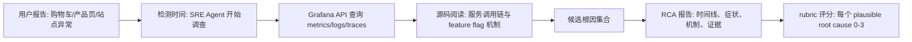

# ORCA-bench：把 coding agent 放进真实 oncall 现场后，差距在哪里？

## 元信息与 TL;DR

- **论文**：[ORCA-bench: How Ready Are Language Model Agents for Oncall?](https://arxiv.org/abs/2607.28545)
- **版本**：arXiv:2607.28545v1，2026-07-30 提交。
- **作者与机构**：Cornell Tech、Traversal、Columbia University。
- **类型**：大模型 Agent 评测论文，核心问题是语言模型 Agent 能否在接近生产的 SRE oncall 场景里做根因分析。
- **公开材料**：论文给出 [PDF](https://arxiv.org/pdf/2607.28545)；摘要页声明 public set 发布在 [Harbor Hub](https://hub.harborframework.com/datasets/orca-bench/ORCA-bench)。
- **本轮图片处理**：未本地化图片。论文 Figure 1、2、5、6、7、8 的关键信息足以用表格、公式、伪代码和 Mermaid 复述；直接嵌图不会增加可读证据密度。

### TL;DR

- **它做什么**：ORCA-bench 把通用 coding agent 放进一个可查询 telemetry、可读源码、含模糊用户报告的 oncall RCA 场景，测试 Agent 是否能定位生产事故根因，而不只是修一个静态仓库里的 failing test。
- **怎么做**：作者运行 OpenTelemetry Astronomy Shop，收集六天、约 50GB 的 metrics、logs、traces，通过 Grafana API 暴露 Prometheus、OpenSearch、Jaeger，并提供源码终端访问。
- **任务规模**：论文摘要写 1,079 个 RCA tasks；正文构造段落写 1,076 个 diverse tasks，后续结果表按 884 个 incident tasks 与 195 个 control tasks 汇总。这个 3 条任务差异需要按版本文稿内部不一致处理，而不是强行抹平。
- **变量设计**：任务共同变化三类因素：用户报告具体度 Easy/Medium/Hard、time-to-detection 从 15 分钟到 24 小时、同一时间窗内是否有 isolated、independent、conflicting、cascading、sequential 等共现故障结构。
- **评分怎么做**：每个 plausible root cause 有一条 rubric，0 到 3 分表示从完全错过、只确认症状、找到部分 telemetry 证据，到完整命中根因和机制；任务层再聚合 RCA Accuracy、RCA Depth、Hallucination Rate。
- **关键证据**：GPT-5.4 judge 在 40-task Verified subset 上与人工复核达到 Spearman ρ=0.92、quadratic-weighted Cohen’s κw=0.90，说明自动评分至少在这个子集上和人工判断高度一致。
- **主结果**：五个 frontier agents 里，Medium realistic-input 下最高 RCA Accuracy 只有 25.3%，Hard 下最高只有 10.0%；整体 incident tasks 上最高 RCA Depth 是 GPT-5.5 的 48.8%，严格 RCA Accuracy 最高是 Claude Sonnet 4.6 的 30.9%。
- **失败模式**：模型会被背景噪声吸走、漏掉并发根因、把不存在的根因写进报告；GLM-5 在部分条件下 hallucination 很高，论文首页给出 40.2% 的 incident hallucination rate。
- **消融结论**：去掉源码访问后，所有模型 RCA Accuracy 都下降；incident-time accuracy 相对稳，因为时间信息主要在 telemetry 里，但“为什么坏了”需要源码帮助把信号连回 feature flag 和服务机制。
- **局限与边界**：ORCA-bench 是受控、公开、固定代码、只读、单任务隔离的 50GB testbed；真实生产系统更大、更动态、更私有，论文把当前结果解释为“ready for production reliability”的下界，而不是最终上界。

## 研究问题：为什么 SWE-bench 式成功不能自动迁移到 oncall？

### 作者真正反驳的隐含前提是什么？

- 近两年 coding agent 的进展常被静态软件工程 benchmark 捕捉：
  - 给定一个仓库。
  - 给定 issue、测试失败或明确需求。
  - Agent 修改代码。
  - 用测试套件判断是否解决。
- ORCA-bench 指出 oncall RCA 的任务形态完全不同：
  - **输入不是精确 issue**：用户可能只说“站点有问题”，并不知道哪个服务、哪个端点、哪个部署相关。
  - **证据不是静态代码**：根因藏在随时间变化的 metrics、logs、traces、前端症状和源码机制之间。
  - **成功不是测试通过**：RCA 要求一个可辩护的诊断报告，能解释症状、时间线、根因机制和证据链。
  - **事故不是单点失败**：并发、级联、冲突和顺序故障会让同一症状对应多个 plausible root causes。

### 论文的问题意识可以压成一句话

> 不是问“Agent 会不会写代码”，而是问“Agent 能不能在模糊报告、海量遥测和多根因共现时，像 SRE 一样提出可靠诊断”。

这个问题重要，因为 production oncall 是 Agent 代理真实工程责任的边界场景：

- 如果 Agent 只是提出候选线索，错误成本有限。
- 如果 Agent 被信任为一线诊断者，错误根因会推迟恢复、误导 mitigation，甚至触发错误变更。
- 如果 Agent 未来还要自动修复，RCA 质量就是 action loop 的前置安全条件。

## 论文主张与论证路线

| Claim | Mechanism | Evidence | Boundary |
|---|---|---|---|
| 现有 RCA/SWE benchmark 不够像真实 oncall | ORCA-bench 同时暴露 telemetry interface、raw signals、source code，并变化报告具体度和 TTD | Table 1 显示 ORCA-bench 在 issue specificity、TTD offset、telemetry interface、source code、symptoms、root causes、human scoring 上全部覆盖 | 它仍使用公开 demo 系统，不等于真实公司内部拓扑 |
| Agent 在现实输入下 RCA 能力不足 | Easy/Medium/Hard 把报告从具体症状降到宽泛用户抱怨，根因数和搜索空间变大 | Medium 最高 RCA Accuracy 25.3%，Hard 最高 10.0%；Hard 平均 ground-truth events 约 4.41 | 只测试五个 frontier agents、一个 harness 和一个 prompt template |
| 评分不是任意 LLM 偏好 | 每个 plausible root cause 单独 rubric，0-3 分分层；Verified subset 人工复核 | 40-task Verified subset 上 191 个 rubric score，ρ=0.92、κw=0.90 | 40 tasks 是抽样子集，不保证所有困难案例都被人工覆盖 |
| 源码访问是 RCA 质量的一部分 | telemetry 给症状和时间，源码解释服务调用链、feature flag 传播与机制 | 去掉源码后五个模型 RCA Accuracy 均下降 9-16 个百分点，hallucination 上升 | 源码只有 16%-20% 命令占比也能显著影响质量，说明命令占比不能直接当贡献度 |
| 当前结果可能低估真实差距 | 评测系统公开、固定、只读、单任务隔离，且只有 50GB/六天数据 | 论文 limitations 逐项说明真实生产更大、更动态、更私有、更需要 action loop | Agent 也可能通过长期记忆和系统经验弥补部分差距，论文没有测试这种学习 |

## 方法机制：ORCA-bench 怎样把 oncall 变成可评测任务？

### B1：环境不是“文件夹”，而是 live telemetry 系统

- 基础系统是 OpenTelemetry Astronomy Shop：
  - 19 个 microservices。
  - 13 种语言，包括 Go、Java、Python、Node.js、C#。
  - 业务形态是电商 demo，包含 product、cart、checkout、recommendation、ad 等常见链路。
- 可观测性后端：
  - Prometheus 存 metrics。
  - OpenSearch 存 logs。
  - Jaeger 存 traces。
  - Grafana 作为统一查询入口。
- Agent 权限：
  - 通过 terminal 调用 Grafana API 查询 telemetry。
  - 通过 terminal 阅读系统源码。
  - 不能直接把 50GB 原始 telemetry 塞进上下文。

这个设计的含义是：Agent 需要会“找证据”，而不是被动读完一个整理好的上下文包。

### B2：故障不是任意注入，而是 feature flag schedule

- 作者用 Astronomy Shop 内置 feature flags 制造事故。
- 这些 flags 对应真实服务机制，例如：
  - product catalog 某个 SKU 触发硬失败。
  - recommendation cache miss 路径错误调用 GetProduct。
  - ad service CPU、GC 或响应异常影响前端体验。
- 六天 schedule 覆盖五类情形：
  - **Isolated**：单个根因。
  - **Independent**：多个无关根因同时出现。
  - **Conflicting**：症状相互遮蔽或混淆。
  - **Cascading**：上游异常传导到下游。
  - **Sequential**：时间上相邻的故障让报告窗口更难对齐。



### B3：任务参数化让同一事故变成不同难度

| 变量 | 取值或含义 | 为什么影响难度 |
|---|---|---|
| Report offset | 报告时间相对 incident start 的偏移 | 报告越晚，背景噪声和其他事件越多 |
| TTD | 15min、1h、8h、24h | Agent 开始调查越晚，直接症状越不明显，时间窗更宽 |
| Report-time style | exact、exact range、broad range | 时间范围越宽，查询空间越大 |
| Issue specificity | Easy、Medium、Hard | Easy 命名具体产品或错误；Hard 可能只是“site issues” |
| Scenario type | isolated 到 sequential | 共现根因越多，必须覆盖的 plausible causes 越多 |

这里的关键不是“多造样本”，而是把 oncall 的上下文梯度显式化：

- Easy 更像传统 bug report。
- Medium 更像实际用户反馈。
- Hard 更像值班时收到的模糊告警或客服转述。

### B4-B6：用 LLM 生成，但用 SRE 验证关键标签

作者没有直接把 GPT-5.4 生成内容当真值，而是分层处理：

- 用户问题由 GPT-5.4 根据 ground-truth symptoms 改写成不同具体度。
- plausible root causes 由时间窗内 active events 枚举，再过滤无前端症状的候选。
- ground-truth symptoms 来自两条路径：
  - 前端症状：重放 feature flag 并在浏览器里观察。
  - telemetry 症状：半自动收集 metrics、logs、traces，再由两位 expert SRE 验证。
- Verified subset：
  - 40 个任务。
  - 按 issue specificity、scenario、offset/TTD 参数分层抽样。
  - 每个 ground-truth label 和每个模型得分都人工确认。

这使 ORCA-bench 的可靠性重点落在“生成候选后的人类校验”，而不是“LLM 自己给 LLM 打分”。

## 评分公式与伪代码

### Per-rubric 0-3 分是什么意思？

| 分数 | 含义 | 研究上对应什么能力 |
|---:|---|---|
| 0 | 完全错过该根因，机制和 rubric 不对齐 | 不会从证据搜索空间里定位相关因果链 |
| 1 | 确认了任务提示中的症状，但没有继续接近根因 | 会复述用户影响，不会诊断 |
| 2 | 找到部分 metrics/logs/traces 证据，向根因推进但不完整 | 有证据检索能力，但机制闭环不足 |
| 3 | 命中根因、机制和支撑信号 | 达到可辩护 RCA |

### 三个任务层指标

```text
给定任务 t 的 plausible root causes 集合 R_t
每个根因 r 有评分 s(t, r) ∈ {0, 1, 2, 3}

RCA Depth(t) =
  mean_r(s(t, r)) / 3

RCA Accuracy(t) =
  1, 若 Agent 命名了 R_t 中所有 plausible root causes
  0, 否则

Hallucination(t) =
  1, 若 Agent 命名的根因与 R_t 中任一 plausible root cause 都不匹配
  0, 否则
```

### 评分流程伪代码

```text
Input:
  task prompt, detection time, telemetry access, source code access
  ground_truth_rubrics = {rubric_1, ..., rubric_k}
  agent_report

State:
  scores = []
  hallucinated = false

For each rubric in ground_truth_rubrics:
  if report misses mechanism and root cause:
    score = 0
  else if report only confirms user-facing symptom:
    score = 1
  else if report cites partial metric/log/trace evidence:
    score = 2
  else if report identifies feature flag, propagation mechanism, and supporting signals:
    score = 3
  append score

If report names a root cause matching none of the plausible rubrics:
  hallucinated = true

Output:
  rca_depth = mean(scores) / 3
  rca_accuracy = all root causes named exactly enough
  hallucination_rate contribution = hallucinated

Failure boundary:
  prose formatting does not earn points;
  materially wrong causal claims reduce rubric alignment.
```

这个评分法比“最终答案对不对”更细，因为 oncall 诊断经常存在多个根因：

- 只找到一个根因不够。
- 只写“checkout failed”不够。
- 只看到错误率上升也不够。
- 必须把 user symptom、telemetry signal、source mechanism 和 feature flag/root cause 连成链。

## 实验设置：被测 Agent 与 harness

### 被测对象

论文主要比较五个 frontier agents：

- Claude Opus 4.7
- Claude Sonnet 4.6
- GPT-5.5
- GLM-5
- DeepSeek-V4-Pro

另有 Claude Fable 5 在 Verified subset 上补充测试。

### Agent 运行方式

- 使用 Terminus-2 agent harness。
- Agent 只能通过交互式 tmux session 操作。
- 当上下文过长时，harness 会做 context compaction。
- Claude Opus 4.7、Claude Sonnet 4.6、GPT-5.5 可设置 reasoning effort，论文设为 medium。
- GLM-5 与 DeepSeek-V4-Pro 不接受 reasoning effort 参数。

这意味着论文测的是“通用 agent + 单一 harness + 单一 prompt/template”下的能力，不是穷尽所有可能 workflow。

## 主结果：最强 Agent 也没有接近可托付 oncall

### 整体 incident tasks

| Model | RCA Depth | RCA Accuracy | Hallucination | Mechanism | Incident Time |
|---|---:|---:|---:|---:|---:|
| Claude Opus 4.7 | 48.5±1.1 | 28.6±1.5 | 12.6±1.1 | 79.0±1.4 | 82.6±1.3 |
| Claude Sonnet 4.6 | 46.7±1.1 | 30.9±1.6 | 14.8±1.2 | 77.1±1.4 | 80.3±1.3 |
| GPT-5.5 | 48.8±1.1 | 24.3±1.4 | 25.0±1.5 | 72.4±1.5 | 79.8±1.4 |
| DeepSeek-V4-Pro | 19.7±1.0 | 15.0±1.2 | 7.2±0.9 | 32.7±1.6 | 31.1±1.6 |
| GLM-5 | 27.7±1.0 | 17.6±1.3 | 40.2±1.6 | 46.3±1.7 | 54.3±1.7 |

这个表的研究意义有三层：

- **Depth 仍低**：最强 Depth 也不到满分一半，说明即使给部分 credit，诊断链条仍常常断裂。
- **Accuracy 更低**：严格要求命名所有 plausible root causes 后，最高只有 30.9%。
- **Hallucination 不是边缘问题**：GLM-5 达到 40.2%，GPT-5.5 也有 25.0%，这在 oncall 中意味着错误 mitigation 方向。

### 按报告具体度分层

| Difficulty | Avg GT Events | 代表性输入 | 最好 RCA Accuracy | 关键含义 |
|---|---:|---|---:|---|
| Easy | 2.00±0.06 | 命名具体产品、页面、错误 | Claude Sonnet 4.6：58.7% | 即使提示具体，也远非稳定可靠 |
| Medium | 2.84±0.09 | 用户视角的宽泛功能异常 | Claude Sonnet 4.6：25.3% | 现实输入下准确率断崖 |
| Hard | 4.41±0.11 | 站点有问题、很模糊 | Claude Opus 4.7：10.0% | 多根因加宽泛报告让搜索空间爆炸 |

这里最值得注意的是 Hard：

- 平均 plausible events 约 4.41。
- Agent 必须覆盖所有 plausible root causes 才算 RCA Accuracy 成功。
- Day 6 的 chaos peak 中有六个共现 events，几个模型各自只抓到一个不同根因，GPT-5.5 抓到四个但仍漏两个，DeepSeek-V4-Pro 一个也没抓到。

因此 ORCA-bench 不只是“难题分数低”，而是在显示多根因召回本身是当前 Agent 的短板。

## 消融与失败案例：源码、噪声和 telemetry 工具使用

### 去掉源码访问会发生什么？

| Model | Code+Telemetry RCA Accuracy | Telemetry-only RCA Accuracy | 变化 |
|---|---:|---:|---:|
| Claude Opus 4.7 | 28.6 | 19.3 | -9.3 |
| Claude Sonnet 4.6 | 30.9 | 21.4 | -9.5 |
| GPT-5.5 | 24.3 | 8.6 | -15.7 |
| DeepSeek-V4-Pro | 15.0 | 5.1 | -9.9 |
| GLM-5 | 17.6 | 6.8 | -10.8 |

论文的解释不是“源码比 telemetry 更重要”，而是两者承担不同角色：

- telemetry 负责回答：
  - 什么时间开始异常？
  - 哪些 endpoint、service、span、log line 异常？
  - 异常是 spike、flatline、error code 还是 latency 增长？
- source code 负责回答：
  - 这个信号怎样从 feature flag 传导到服务行为？
  - 哪个 API 分支会返回 gRPC INTERNAL 或 NOT_FOUND？
  - 前端症状和后端服务之间的调用链是什么？

所以 incident-time accuracy 下降较小，但 RCA Accuracy 和 hallucination 变化明显。

### 命令行为图说明什么？

论文 Figure 7 把 agent command 分成四类：

- telemetry discovery
- telemetry query
- source code
- other

关键观察：

- Claude Opus 4.7 与 GLM-5 的源码命令占比分别约 16% 和 20%。
- telemetry 相关命令占比约 72% 和 70%。
- 尽管源码命令占比不高，移除源码仍让所有模型 RCA Accuracy 下滑。

这说明源码访问的价值不是“读得多”，而是“在关键节点把 telemetry hypothesis 固化成机制解释”。

### telemetry 查询本身也很脆

| 指标 | 论文观察 |
|---|---|
| telemetry command 数 | GPT-5.5 平均 28.2 次，DeepSeek-V4-Pro 平均 75.5 次 |
| telemetry failure rate | 五个模型约 25.8% 到 40.1% |
| failure 类型 | 包括 query error，也包括请求成功但返回 empty |
| any-match | GPT-5.5 在 metrics、logs、traces 的 any-match 上最高 |

这个结果值得单独看：

- 多查不等于查对。
- telemetry API 对 Agent 是工具使用问题，也是信息检索问题。
- empty result 很危险，因为 Agent 可能把“没查到”误读成“没有异常”。
- 真实生产系统的 dashboard、label、service name、trace sampling 策略更不统一，empty/error 率可能更高。

## Figure/Table 证据逐项解读

### Table 1：为什么 ORCA-bench 不是又一个 RCA benchmark？

| 证据点 | 支撑的 claim | 不能证明什么 |
|---|---|---|
| 同时覆盖 issue specificity、TTD offset、telemetry interface、source code | 更接近 oncall 输入和证据结构 | 不证明 benchmark 完全等价生产环境 |
| symptoms、root causes、scoring 都有人工验证维度 | 真值和评分不是纯程序标签 | 不证明所有标签无争议 |
| 对比 AIOpsLab、ITBench、OpenRCA、SREGym 的缺口 | ORCA-bench 在真实性维度更完整 | 不说明旧 benchmark 无价值，它们仍可测窄能力 |

### Figure 2：构造 pipeline 的关键是把三件事分开

- **Environment**：系统、遥测后端、源码访问。
- **RCA tasks**：报告时间、检测时间、用户问题。
- **Ground-truth answers**：root causes 和 observable symptoms。

这种分离很重要：

- 如果只构造环境，没有 task parameterization，就无法系统研究难度。
- 如果只构造用户问题，没有 symptoms/rubrics，就无法评分。
- 如果只做 label，没有真实 telemetry interface，就退回到静态问答。

### Figure 4：低分和高分报告的差别不是文风

论文用同一个 hard task 对比 GLM-5 和 Claude Opus 4.7：

- GLM-5 把问题归因到 load-generator 的 Playwright browser crash。
- Claude Opus 4.7 把 checkout/product failure 追到 productCatalogFailure feature flag。
- 人工和 GPT-5.4 judge 都给 GLM-5 0/3，给 Claude Opus 4.7 3/3。

这个案例说明：

- 背景噪声本身可能是真实 telemetry。
- 但真实不等于相关。
- RCA 的核心是把用户影响、时间窗、服务链和根因机制对齐。

### Figure 5：报告越模糊，准确率越接近不可用

- Easy 不是“简单题”，因为平均也有 2 个 ground-truth events。
- Medium 是最接近现实的设置，最高只有 25.3%。
- Hard 是宽泛报告加多根因，最高 10.0%。

如果把 Agent 用作 oncall assistant，这个图给出的工程结论是：

- 可以让 Agent 收集线索。
- 可以让 Agent 生成候选 hypothesis。
- 不能把它的最终根因集合当作无需复核的 authoritative RCA。

### Figure 6：源码访问是防 hallucination 的护栏之一

去掉源码后：

- RCA Accuracy 下降。
- hallucination 上升。
- incident-time accuracy 相对稳定。

解释路径：

```text
Telemetry:
  帮助确认时间和症状

Source code:
  帮助确认机制和传播路径

没有 source code:
  Agent 更容易把相邻噪声解释成根因
  或者只停留在症状层面
```

### Figure 8：工具调用失败是 Agent readiness 的一部分

ORCA-bench 没有把 telemetry 预整理成短上下文，而是让 Agent 自己查：

- 这测到 PromQL/OpenSearch/Jaeger 查询构造能力。
- 也测到 Agent 处理 empty/error 的策略。
- 更测到 Agent 是否能在查询失败后换路径，而不是编造解释。

这对真实 Agent 系统设计很关键：oncall Agent 的可靠性不只是模型推理，还包括工具 API 语义、查询模板、错误恢复和 evidence provenance。

## 负控任务与指标解释：为什么“没有事故”同样重要？

### Control tasks 测的不是空输出技巧

论文把 195 个 control tasks 单独列出，是因为 oncall 场景里“没有当前事故”也是高价值判断：

- 值班工程师常常面对历史噪声、已恢复事故、探针误报和用户延迟反馈。
- 如果 Agent 看到旧日志就宣布当前事故，它会制造 false positive RCA。
- 如果 Agent 为了显得有用而强行写根因，后续 mitigation 会浪费人力甚至触发错误回滚。

Control task 的评分逻辑可以理解为：

```text
Input:
  quiet window around detection time
  agent report

If report leaves quiet window empty:
  control detection passes
Else if report claims an active or ongoing incident inside quiet window:
  false positive
Else:
  historical incident description may still be acceptable
```

这个设计把“时间定位”从“根因定位”里拆出来：

- Agent 可以正确发现过去发生过问题。
- 但如果它把过去问题说成现在仍在发生，就是值班语境下的错误。
- 因此 ORCA-bench 不只奖励多说，也惩罚不该说时乱说。

### RCA Depth 与 RCA Accuracy 的张力

RCA Depth 和 RCA Accuracy 经常会给出不同直觉：

- Depth 高，说明 Agent 在多个 rubric 上找到了部分证据。
- Accuracy 高，说明 Agent 覆盖了全部 plausible root causes。
- 在多根因场景里，Depth 可能看起来还不错，但 Accuracy 仍为 0。

这对读论文时很重要：

| 情况 | Depth | Accuracy | 实际含义 |
|---|---:|---:|---|
| 找到一个根因，漏掉五个 | 有部分分 | 0 | 对 postmortem 不足，对恢复可能也不足 |
| 找到症状但没连到机制 | 低到中 | 0 | 可作为线索收集，不是根因分析 |
| 命中所有根因但证据写得薄 | 可能中等 | 1 | 需要人工补证据，不一定可直接归档 |
| 编造不存在根因 | 可能局部有词面相关 | 0 且 hallucination | oncall 风险最高 |

因此，如果要用 ORCA-bench 评估内部 Agent，不应只看单一排行榜：

- **生产辅助调查**：更看重 Depth、evidence citation、query success。
- **自动生成 postmortem 初稿**：更看重 Accuracy、mechanism、counter-evidence。
- **触发自动 rollback 或 patch**：hallucination 和 multi-root-cause recall 必须是硬门槛。

## 落地评估检查表：怎样把论文结论转成自己的 Agent 安全门？

### 最小复现实验不应只跑公开题

一个组织如果想复用 ORCA-bench 思路，可以先做小规模内部 shadow eval：

- 选 5 到 10 个已结束事故。
- 保留真实报告时间、检测时间和用户影响描述。
- 冻结当时可用 telemetry 时间窗，不让 Agent 看未来。
- 让 SRE 写 plausible root causes、supporting signals、排除项。
- 用 Agent 生成 RCA，但不进入生产决策。
- 让两名工程师独立按 0-3 rubric 打分，再对照自动 judge。

这个流程的目标不是追求论文规模，而是验证三件事：

- Agent 是否能查到组织内部 telemetry。
- Agent 是否理解私有服务和私有命名。
- Agent 是否会把旧事故、噪声告警或不相关错误当成当前根因。

### 上线前需要的硬性安全条件

| 条件 | 失败后果 | 建议门槛 |
|---|---|---|
| 查询 provenance 完整 | 无法审计 Agent 为什么这么判断 | 每个根因 claim 必须绑定 query 与源码证据 |
| 时间窗约束可靠 | 旧噪声被误报成当前事故 | 所有 RCA 报告必须显式列 quiet window 和 detection time |
| 多根因召回可测 | 并发事故被简化成单根因 | 对历史多根因事故单独设回归集 |
| hallucination 可控 | 错误 rollback、错误 owner、错误修复 | 编造根因必须按高严重度处理 |
| 人工复核路径短 | SRE 不能快速判断报告可信度 | 报告结构固定，证据链接可点击，反证必须列出 |

这也是 ORCA-bench 对 Agent 产品化讨论最有价值的地方：它没有把“更聪明的模型”当作唯一解，而是逼迫评测者把 evidence、tooling、source access、judge agreement 和人类复核放在同一张图里看。

## 相关工作中的位置判断

### 和 SWE-bench、Terminal-Bench 的关系

- SWE-bench 测：
  - 静态仓库。
  - issue 或 failing test。
  - patch 是否通过测试。
- Terminal-Bench 测：
  - terminal 环境下完成复杂任务。
  - 更接近 agent tool use。
- ORCA-bench 测：
  - live-like telemetry 系统。
  - 模糊用户报告。
  - 多根因 RCA。
  - 诊断报告质量。

因此它不是替代 SWE-bench，而是把“软件工程 Agent”推进到可靠性责任边界。

### 和 SRE/RCA benchmark 的关系

| Benchmark 方向 | 常见能力 | ORCA-bench 补的缺口 |
|---|---|---|
| AIOps/RCA causal methods | 从指标图或依赖图定位异常 | 不能处理自然语言用户报告和源码机制 |
| Live SRE benchmark | 有 telemetry 或注入故障 | 常缺源码、症状真值或系统化 TTD/报告具体度 |
| OpenRCA 类历史 telemetry | 有 observation window 和人工 root cause | 不完整覆盖真实 telemetry interface、源码和症状层证据 |

ORCA-bench 的贡献不是单个指标，而是把 oncall 的证据栈做成统一任务：

- 报告文本。
- 时间窗。
- telemetry 查询。
- source mechanism。
- root-cause set。
- symptom-level rubric。

## 证据边界与可复现性

### 论文自己承认的限制

- **规模限制**：50GB/六天在论文里已很大，但真实生产可能每天 terabytes。
- **动态限制**：代码、拓扑、部署、流量和故障分布在真实系统里持续变化。
- **公开系统先验**：OpenTelemetry demo 和文档可能进入预训练，真实私有系统不会有这种先验。
- **单任务隔离**：每个任务 cold start，没有长期系统记忆。
- **只读调查**：Agent 不能部署修复来验证 hypothesis。
- **方法未穷尽**：没有系统比较 prompt engineering、structured workflows 或 hybrid causal RCA。

### 文稿内部需要谨慎处理的数字差异

- 摘要写 1,079 RCA tasks。
- 正文构造段落写 1,076 diverse tasks。
- Figure 1/5/6/8 和 appendix 结果还分别使用：
  - 884 incident tasks。
  - 195 control tasks。
  - 1,079 all tasks。
- 这不一定改变结论，但中文解读应保留这个差异，避免把所有任务数机械合并成一个单值。

### 可复现性边界

- 论文公开了 dataset URL，但本轮只确认 Harbor Hub 对基础路径返回重定向到 latest。
- 论文未在正文里把全部 evaluation harness、模型配置、日志、judge outputs 展开到可完全复算的程度。
- 由于被测模型是 2026 年 frontier systems，后续模型版本变化会让排行榜数字很快过时。
- 但构造思想、评分 rubric 和 failure taxonomy 对 Agent 安全评估仍有复用价值。

## 对 Agent 架构的延伸思考

### 1. oncall Agent 需要 evidence-first，而不是 answer-first

ORCA-bench 的失败模式说明，生产 RCA 不能只要求 Agent 输出“根因是什么”。

更稳的接口应要求：

- 每个 claim 绑定 telemetry query。
- 每个 query 记录时间窗、datasource、label filter、返回状态。
- 每个根因候选绑定源码位置或配置证据。
- 每个排除项写明为什么排除，而不是沉默。

一个更适合 oncall 的报告结构可以是：

| 字段 | 必填意义 |
|---|---|
| Symptom | 用户影响和观测症状 |
| Time window | 报告时间、检测时间、异常开始和结束 |
| Candidate causes | 候选根因列表，不只最终根因 |
| Supporting evidence | metrics/logs/traces/source links |
| Counter-evidence | 哪些候选被排除 |
| Confidence | 按证据覆盖度给出，而非按语气给出 |
| Required human check | 哪一步必须 SRE 复核 |

### 2. telemetry tool use 需要类型化，不应只是 shell 自由调用

Figure 8 的 empty/error 率提示：

- 自由 shell 调 Grafana API 容易出错。
- Agent 可能不知道 label 空间。
- Agent 可能不会从 empty query 反推 query 错误。

工程上可以提供更结构化的 telemetry 工具：

- service discovery API：列出服务、endpoint、metric names、label keys。
- query planner：把用户问题转换成候选 dashboard/query templates。
- empty-result diagnosis：区分真空结果、时间窗错误、label 错误、backend error。
- provenance log：每次查询都进入不可变审计轨迹。

### 3. 长期记忆既可能补强，也可能带来安全债

论文把 single-task cold start 当作限制。真实 SRE 会累积：

- 哪些服务常出错。
- 哪些 alerts 常噪声。
- 哪些 feature flags 近期变过。
- 哪些 dashboard 最可信。

Agent 也需要类似 memory，但必须有边界：

- 写入必须来自已验证 incident，不来自模型猜测。
- memory item 应带 source、timestamp、system version、owner。
- stale memory 必须随服务变更自动降权。
- 不能让旧事故经验覆盖当前 telemetry evidence。

### 4. 自动修复前必须先解决“多根因召回”

ORCA-bench 的 Hard 设置里平均 4.41 个 ground-truth events。

这对 action-taking Agent 很危险：

- 只修一个根因，用户症状可能部分缓解但不恢复。
- 修错根因，会引入新的变更风险。
- 漏掉并发根因，会让 postmortem 结论错误。

因此，在 production write access 前，最低门槛不是“会生成 patch”，而是：

- 多根因召回足够高。
- hallucination 足够低。
- 证据链可审计。
- mitigation proposal 可回滚。
- 人类 SRE 能快速复核关键假设。

## 结论

- ORCA-bench 最有价值的地方，是把 coding agent 从“修仓库”推进到“诊断运行中的分布式系统”。
- 论文的核心证据很集中：
  - 真实 telemetry interface。
  - 源码访问。
  - 1,000 级 RCA 任务。
  - 多难度、多 TTD、多场景结构。
  - human-validated rubric 和 judge agreement。
  - Medium/Hard 准确率明显不足。
- 对研究者来说，它给出了一个清晰问题：
  - 未来 Agent 评测不能只看 final task success。
  - 必须看 evidence retrieval、temporal reasoning、causal mechanism、multi-root-cause recall、hallucination control。
- 对安全边界来说，它的结论也很直接：
  - 当前 frontier coding agents 可以作为 oncall 辅助调查员。
  - 不能直接作为可托付的一线生产可靠性负责人。
  - 要走向自动 mitigation，仍需要结构化工具、审计证据、长期但受控的系统记忆，以及强制人工复核点。
