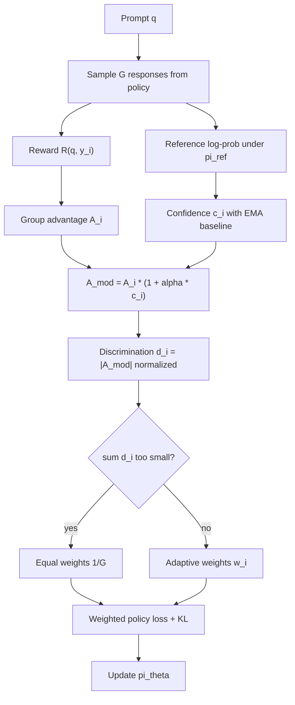

# HARGO：异构 HPC 任务里的 RL 后训练，为什么不能把每条 rollout 等权看待？

- **论文**：[HARGO: Heterogeneity-Aware Reward-Guided Optimization for RL Post-Training of LLMs on HPC Tasks](https://arxiv.org/abs/2607.28301)
- **版本**：arXiv:2607.28301v1，2026-07-30 14:41:05 UTC 提交。
- **作者**：Tiangang Li、Xiangbo Tian。
- **方向**：大模型后训练、领域专用 LLM、HPC 任务、GRPO 类在线 RL。
- **公开材料**：论文 HTML/PDF、HPC-GPT 数据集、HARGO 后训练模型 checkpoint。
- **一句话定位**：HARGO 不是再造奖励函数，而是在同一个奖励函数、同一个 0.5B SFT 起点、同一批 HPC 指令数据上，问一个后训练问题：当任务同时包含 yes/no 数据竞争检测、短事实问答和长语义问答时，GRPO 还应该让每条响应对梯度贡献相同吗？

## TL;DR

- **问题**：SFT 可以把 HPC 知识注入模型，但不保证模型按任务格式行动；同一个 SFT 模型在 C/C++ 数据竞争样本上能到 88.65% 正确率，却有 65.9% 的 MLPerf 回答超过 40 个字符，说明“知道概念”和“输出合适答案”之间有落差。
- **核心主张**：HPC 任务不是同质后训练集合；四类任务在答案长度上相差 58 倍，奖励分布有三种形态，SFT 起点准确率从 51% 到 100% 不等，等权 GRPO 会浪费或错配梯度。
- **方法机制**：HARGO 在 GRPO 的组内 advantage 上加入两类内部信号：奖励对比产生的 discrimination `d`，以及冻结参考模型 log-probability 产生的 confidence `c`；它用 `A_mod = A * (1 + alpha * c)` 放大有信息量响应，再用 `w_i proportional to d_i` 对每条响应加权。
- **关键设计**：`c` 只调节 advantage 的幅度，不改变符号；`alpha=0.3` 让放大上界约为 1.3 倍，避免把低质量但高置信的响应反向奖励。
- **实验设置**：所有方法从同一个 Qwen2.5-0.5B-Instruct SFT checkpoint 出发，SFT 用 5,273 条训练样本、2 个 epoch；RL 阶段对比 SFT、HPC-GPT、PPO、DPO、GRPO、DrGRPO、SimPO、KTO、HARGO 共 9 种方法。
- **主结果**：HARGO 在三项 primary metric 上同时第一：WinRate 54.62%、Data Race F1 91.30%、PLP Similarity 0.8558；相对 HPC-GPT 分别提升 +4.79、+2.48、+0.050。
- **消融结论**：只用 `d` 的 B1 WinRate 为 53.34，只用 `c` 的 B2 为 53.60，完整 advantage modulation 的 B3 为 54.62；但 B3 的 EM/AvgScore 低于 B1，说明它把容量从 MLPerf 精确复现转向 race 与 PLP 的全局收益。
- **局限**：实验规模只有 0.5B、单 RTX 3080、固定奖励函数、固定四类 HPC-GPT 任务；HARGO 证明的是异构任务下加权 RL 的有效性，不证明它能直接推广到开放代码生成、真实集群调优或安全关键 HPC 自动修复。

## 研究问题：为什么 SFT 不够，为什么普通 GRPO 也不够？

### 1. SFT 学到的是知识，不是跨格式行为控制

- 论文从 HPC-GPT 的经验出发：
  - HPC 专用数据可以让模型知道 DataRaceBench、MLPerf、Fortran/OpenMP 等领域概念。
  - 但 teacher forcing 把参考答案当作 token 序列模仿目标，不区分“短而正确”和“长而啰嗦但沾边”。
  - 对数据竞争这种 yes/no 分类，SFT 可以靠模式识别拿到较高准确率。
  - 对 MLPerf 这种事实问答，SFT 容易复述训练风格，牺牲答案长度和精确性。

- 这使论文的问题不是“怎样让模型多学 HPC 知识”，而是：
  - 同一个模型面对不同输出格式时，怎样把奖励信号用在最需要改变的响应上？
  - 当一批 rollout 里有的样本已经接近天花板、有的样本奖励跨度很大、有的样本只有语义相似度时，等权更新是否合理？

### 2. GRPO 的隐含假设：组内响应同等有学习价值

GRPO 对每个 prompt 采样 `G` 条响应，按组内奖励均值和标准差计算 advantage：

```text
A_i = (r_i - mean(R)) / (std(R) + epsilon)
L_GRPO = (1 / G) * sum_i L_i
```

- 这个公式的优点很明确：
  - 不需要训练 value function。
  - 奖励可来自任务规则、判别器或自动评分。
  - 对推理任务常常比 PPO 更稳定。

- 但论文指出它有一个强假设：
  - 一条明显错误的 response 和一条偶然正确的 response，只要进入同一个组，就在最终 loss 汇总时拿到同等 `1/G` 份额。
  - 一个全对组几乎没有学习信号，一个半对半错组有强学习信号，但训练循环不会显式把梯度资源转向更有区分度的响应。
  - 对 HPC 这种多任务混合场景，等权会把 compute 用在不一样的问题上，却不看每条响应对策略改进的边际价值。

## 论文主张与论证路线

| Claim | Mechanism | Evidence | Boundary |
|---|---|---|---|
| HPC 后训练任务高度异构 | 四个任务覆盖二分类、短事实 QA、长语义生成 | 答案长度差 58 倍；奖励分布三类；SFT 准确率 51%-100% | 只覆盖 HPC-GPT 数据集中的四个任务 |
| 等权 GRPO 不能适配这种异构性 | 每条 response 在组内固定 `1/G` 权重 | GRPO 主结果虽强，但 HARGO 在三项 primary metric 全部超过它 | 未证明所有 RLHF/RLAIF 场景都需要同样加权 |
| 内部信号足以估计响应学习价值 | `d` 来自奖励对比，`c` 来自 reference log-prob | 不需要任务标签、额外 judge 或额外标注 | 仍依赖固定奖励函数是否可信 |
| confidence 应调节而非支配 advantage | `A_mod = A * (1 + alpha * c)`，保留符号 | 消融 B3 的 WinRate 高于 B1/B2 | EM/AvgScore 出现下降，说明存在任务间权衡 |
| HARGO 提升的是全局 alignment 质量 | 用 per-response 权重重新分配梯度 | WinRate 54.62%、F1 91.30%、PLP 0.8558 | 绝对提升幅度有限，且模型规模小 |

## 方法机制：HARGO 怎样重写 GRPO 的等权平均？

### 1. 输入、状态、输出

- **输入**：
  - SFT 参考模型 `pi_ref`。
  - 当前策略模型 `pi_theta`。
  - 训练 prompt `q`。
  - 每个 prompt 采样的响应组 `{y_1, ..., y_G}`。
  - 固定奖励函数 `R(q, y)`。

- **状态**：
  - 组内奖励均值 `mean(R)`。
  - 组内奖励标准差 `std(R)`。
  - reference model 的 response 平均 log-probability。
  - 全局 reference log-prob EMA baseline。

- **输出**：
  - 每条 response 的调制 advantage `A_mod,i`。
  - 每条 response 的权重 `w_i`。
  - 加权后的 policy gradient loss。

### 2. HARGO 的四步公式

#### Step A：先按 GRPO 计算组内 advantage

```text
A_i = (r_i - mean(R)) / (std(R) + epsilon)
```

- `r_i` 是第 `i` 条响应的奖励。
- `mean(R)` 是同一个 prompt 下 `G` 条响应的平均奖励。
- `std(R)` 用来把奖励差异归一化。
- 如果组内全对或全错，`std(R)` 很小，说明这个组的可学习对比信号弱。

#### Step B：用参考模型置信度估计 response 是否“在模型知识内”

```text
ref_logp_i = mean_t log pi_ref(y_i,t | q, y_i,<t)
c_i = sigmoid(ref_logp_i - ref_logp_global)
```

- `ref_logp_i` 表示冻结 SFT 模型对这条响应的平均 token 置信度。
- `ref_logp_global` 是全局 EMA baseline，用来避免不同 batch 的 log-prob 尺度漂移。
- `c_i` 接近 1 表示参考模型本来就较认可这条响应。
- `c_i` 接近 0 表示响应可能偏离 SFT 先验，学习价值要更谨慎。

#### Step C：只放大 advantage，不改变学习方向

```text
A_mod,i = A_i * (1 + alpha * c_i)
alpha = 0.3
```

- 如果 `A_i` 为正，说明响应优于组内平均，HARGO 最多把正向学习信号放大 30%。
- 如果 `A_i` 为负，说明响应差于组内平均，HARGO 也只放大“远离它”的负向信号。
- `1 + alpha * c_i` 始终为正，所以 `c_i` 不会把奖励方向翻转。

#### Step D：把调制后 advantage 转成 per-response 权重

```text
d_i = abs(A_mod,i) / (max_j abs(A_mod,j) + epsilon)

if sum_i d_i < epsilon_w:
    w_i = 1 / G
else:
    w_i = d_i / sum_j d_j

L_HARGO = sum_i w_i * L_i
```

- `d_i` 衡量这条响应在组内的区分度。
- 如果所有响应都没有差异，HARGO 回退到等权，避免凭空制造权重。
- 如果某些响应明显高于或低于组内平均，它们获得更多梯度份额。

## 为什么不是直接 `d + c` 或 `d * c`？

### 1. 直接相加的问题：容易形成正反馈

```text
w_i = d_i + alpha * c_i
```

- 这种写法把 confidence 当成和 discrimination 同级的权重来源。
- 高置信响应即使奖励区分度不强，也会被额外推高。
- 论文认为这可能造成更新过强，因为最终梯度总是高于单独使用 `d` 或 `c`。

### 2. 直接相乘的问题：可能压制主信号

```text
w_i = d_i * c_i
```

- 如果一条响应奖励对比强，但参考模型置信度低，乘法会把它严重压低。
- 这会扭曲 `d` 的排序，让模型错过“当前策略发现但 SFT 不熟悉”的学习机会。
- 对后训练来说，这类样本可能正是需要保留的新行为。

### 3. HARGO 的折中：confidence 只做有界调制

```text
A_mod = A * (1 + alpha * c)
```

- 它保留 `A` 的方向。
- 它保留 `d` 的主导地位。
- 它把 confidence 的影响限制在 30% 以内。
- 它不需要任务类型标签，因此适合混合任务训练。

## 任务异构性：四个 HPC 任务到底哪里不同？

| 任务 | 输入/输出形态 | 奖励形态 | HARGO 关注点 |
|---|---|---|---|
| `race_c` | C/C++ OpenMP 数据竞争检测，输出 yes/no | exact yes/no match | 高准确率附近仍要减少误判 |
| `race_fortran` | Fortran OpenMP 数据竞争检测，输出 yes/no | exact yes/no match | 自动 preference 在这里不稳，HARGO 提升明显 |
| `mlperf` | HPC benchmark 事实问答，输出数字、名称或短文本 | exact/numeric/partial/keyword 分层奖励 | 精确复现最难，KTO 在辅助指标领先 |
| `plp` | Programming language processing 描述性 QA | sentence-transformer 语义相似度 | 多数方法能到 100% accuracy，但 PLP similarity 仍可区分质量 |

### 异构性不是口号，而是三类可测差异

- **答案长度差异**：
  - 二分类答案极短。
  - MLPerf 多为短事实。
  - PLP 描述性回答明显更长。
  - 论文称最大长度差达到 58 倍。

- **奖励分布差异**：
  - race 是 0/1。
  - mlperf 是多档离散分数。
  - plp 是语义相似度连续值加格式修正。

- **SFT 起点差异**：
  - race_c/race_fortran 已在较高区间。
  - mlperf 只有约 51% 起点。
  - plp 接近天花板。

## 训练与奖励：HARGO 改的是 loss，不是 reward

### 1. 数据和模型规模

| 项目 | 设置 |
|---|---|
| Base model | Qwen2.5-0.5B-Instruct |
| SFT 数据 | HPC-GPT instruction dataset |
| 训练/评估切分 | 5,273 train / 584 eval，9:1 split |
| SFT 阶段 | 2 epochs，learning rate 2e-5，batch size 4 |
| RL 阶段 | 每种方法从同一个 SFT checkpoint 出发 |
| 硬件 | 单张 RTX 3080，16GB VRAM |
| HARGO group size | `G=4` |
| HARGO KL | `beta=0.02` |
| HARGO confidence coefficient | `alpha=0.3` |
| HARGO EMA decay | `rho=0.9` |
| HARGO temperature | `T=0.6` |

### 2. 固定奖励函数如何给分？

| 任务 | 奖励规则 | 注意点 |
|---|---|---|
| race | yes/no exact match 为 1，否则 0 | 评估另用 word-boundary extraction，避免奖励函数和评估完全绑定 |
| mlperf | exact/numeric match 1.0；partial multi-value 0.5；keyword >70% 为 0.2；keyword >40% 为 0.1 | EM 另用正则边界匹配，检查 token-level precision |
| plp | all-MiniLM-L6-v2 句向量 cosine similarity | 额外给非空、非重复格式 bonus，超长回答按字符惩罚 |

- 这个设置非常关键：
  - HARGO 不靠更聪明的 reward model 赢。
  - 所有 RL 方法共享同一个任务自适应奖励函数。
  - HARGO 的变量只在 loss weighting。

### 3. Preference 方法的数据从哪里来？

- DPO、KTO、SimPO 需要 preference data。
- 作者用 SFT 模型对每个 prompt 生成两条响应。
- 固定奖励函数给两条响应打分。
- 高分标为 chosen，低分标为 rejected。
- 这让 preference 方法能参与对比，但也带来边界：
  - 如果 reward 函数在某任务上分辨率不足，自动 preference 会把噪声固化。
  - DPO 在 `race_fortran` 上降到 73.25%，正说明自动 preference 在某些子域可能不可靠。

## 伪代码：把 HARGO 训练循环写成可执行思路

```text
Input:
  reference SFT model pi_ref
  policy model pi_theta
  training data D
  reward function R
  group size G
  alpha, beta, rho, temperature T

State:
  ref_logp_global = initial EMA baseline

For each epoch:
  For each batch B in D:
    For each prompt q in B:
      Generate G responses y_1...y_G from pi_theta at temperature T
      Score each response: r_i = R(q, y_i)
      Compute reference confidence:
        ref_logp_i = mean token logp under pi_ref

    Update EMA:
      ref_logp_global = rho * ref_logp_global
                       + (1 - rho) * mean(ref_logp_i)

    For each prompt group:
      A_i = (r_i - mean(R)) / (std(R) + epsilon)
      c_i = sigmoid(ref_logp_i - ref_logp_global)
      A_mod_i = A_i * (1 + alpha * c_i)
      d_i = abs(A_mod_i) / (max(abs(A_mod)) + epsilon)

      If sum(d_i) is too small:
        w_i = 1 / G
      Else:
        w_i = d_i / sum(d_i)

      L_i = clipped policy-gradient surrogate
            + beta * KL(pi_theta || pi_ref)
      Backpropagate sum_i w_i * L_i

Output:
  trained policy pi_theta

Failure boundary:
  if rewards cannot distinguish responses, HARGO falls back to equal weights;
  if reward itself is wrong, HARGO may amplify the wrong optimization target.
```

## 主结果：HARGO 赢在哪里？

| Method | WinRate | Data Race F1 | PLP Similarity | EM | AvgScore |
|---|---:|---:|---:|---:|---:|
| SFT | - | 89.59 | 0.8242 | 14.29 | 0.3587 |
| HPC-GPT | 49.83 | 88.82 | 0.8054 | 19.23 | 0.4027 |
| PPO | 50.17 | 90.22 | 0.8221 | 18.68 | 0.3779 |
| DPO | 40.24 | 77.61 | 0.7993 | 7.14 | 0.2424 |
| GRPO | 53.17 | 90.73 | 0.8351 | 18.13 | 0.4193 |
| DrGRPO | 51.63 | 90.79 | 0.8388 | 15.93 | 0.3806 |
| SimPO | 44.26 | 90.03 | 0.7816 | 6.04 | 0.1847 |
| KTO | 53.08 | 90.16 | 0.8449 | **27.47** | **0.4537** |
| HARGO | **54.62** | **91.30** | **0.8558** | 17.58 | 0.4000 |

### 怎么读这张表？

- **HARGO 的强结论**：
  - WinRate 第一，比 GRPO 高 +1.45。
  - Data Race F1 第一，比 DrGRPO 高 +0.51。
  - PLP Similarity 第一，比 KTO 高 +0.011。
  - 相对 HPC-GPT，三个 primary metrics 分别高 +4.79、+2.48、+0.050。

- **HARGO 的弱结论**：
  - EM 和 AvgScore 不是第一。
  - KTO 在 MLPerf 精确复现相关指标上更强。
  - 这说明 HARGO 优化的是跨任务全局 alignment，不是每个单项指标都支配。

- **DPO/SimPO 的警示**：
  - DPO WinRate 只有 40.24，Data Race F1 77.61。
  - SimPO EM 只有 6.04，AvgScore 0.1847。
  - 自动构造 preference data 并不天然优于在线 reward scoring。

## 分任务结果：HARGO 不是平均提升所有子任务

| Method | race_c | race_fortran | mlperf | plp |
|---|---:|---:|---:|---:|
| SFT | 88.65 | 92.36 | 51.10 | 100.00 |
| HPC-GPT | 88.65 | 91.72 | 54.95 | 98.33 |
| PPO | 89.19 | 92.36 | 50.55 | 100.00 |
| DPO | **90.27** | 73.25 | 34.07 | 100.00 |
| GRPO | 89.73 | 93.63 | **59.34** | 100.00 |
| DrGRPO | 89.73 | 93.63 | 54.40 | 100.00 |
| SimPO | 89.73 | 92.36 | 20.88 | 95.00 |
| KTO | 88.11 | 93.63 | 56.59 | 100.00 |
| HARGO | 89.19 | **94.90** | 56.04 | 100.00 |

### 关键观察

- HARGO 在 `race_fortran` 上最好：
  - 94.90% 是全表最高。
  - 这支持作者的说法：confidence modulation 把更多学习资源放到 reference model 有领域先验、但仍有边际错误的任务上。

- GRPO 在 `mlperf` 上最好：
  - 59.34% 高于 HARGO 的 56.04%。
  - MLPerf 的多档奖励已经给出较细粒度组内差异，等权 GRPO 可能足够利用这些信号。

- DPO 在 `race_c` 上最好但整体崩在 `race_fortran`：
  - `race_c` 90.27% 说明 preference optimization 对一部分二分类任务有效。
  - `race_fortran` 73.25% 说明自动 preference 的错误会被放大。

## 数据竞争检测细表：HARGO 为什么 F1 第一？

| Method | TP | FP | TN | FN | Precision | Recall | F1 | Acc |
|---|---:|---:|---:|---:|---:|---:|---:|---:|
| SFT | 142 | 19 | 167 | 14 | 88.20 | 91.03 | 89.59 | 90.35 |
| PPO | 143 | 18 | 168 | 13 | 88.82 | 91.67 | 90.22 | 90.94 |
| DPO | 104 | 8 | 178 | 52 | **92.86** | 66.67 | 77.61 | 82.46 |
| HPC-GPT | 135 | 13 | 173 | 21 | 91.22 | 86.54 | 88.82 | 90.06 |
| GRPO | 142 | 15 | 171 | 14 | 90.45 | 91.03 | 90.73 | 91.52 |
| DrGRPO | 143 | 16 | 170 | 13 | 89.94 | 91.67 | 90.79 | 91.52 |
| SimPO | 140 | 15 | 171 | 16 | 90.32 | 89.74 | 90.03 | 90.94 |
| KTO | 142 | 17 | 169 | 14 | 89.31 | 91.03 | 90.16 | 90.94 |
| HARGO | **147** | 19 | 167 | **9** | 88.55 | **94.23** | **91.30** | **91.81** |

- HARGO 的策略偏高召回：
  - FN 只有 9，是全表最低。
  - Recall 94.23%，也是全表最高。
  - Precision 88.55%，不是最高。

- 对数据竞争检测，这个 trade-off 有实际含义：
  - 少漏报通常比少误报更重要，尤其在并行程序 correctness 检查里。
  - 但误报也会增加工程成本，因此不能只看 recall。
  - F1 第一说明论文的综合判断不是单纯牺牲 precision 换 recall，而是在整体上取得更好平衡。

## 消融：`d` 和 `c` 分别贡献什么？

| Variant | Weighting | WinRate | F1 | PLP | EM | AvgScore |
|---|---|---:|---:|---:|---:|---:|
| B1 | `w proportional to d` | 53.34 | **91.37** | 0.8480 | **21.43** | **0.4187** |
| B2 | `w proportional to alpha * c` | 53.60 | 91.32 | 0.8472 | 16.48 | 0.4077 |
| B3 | `A_mod = A * (1 + alpha * c)` then `w proportional to d` | **54.62** | 91.30 | **0.8558** | 17.58 | 0.4000 |

### 消融支持了什么？

- `d` 单独已经很强：
  - B1 的 F1 最高，EM/AvgScore 也最高。
  - 说明奖励对比本身能识别不少有学习价值的响应。

- `c` 单独也有贡献：
  - B2 WinRate 53.60，高于 B1 的 53.34。
  - 但只靠 confidence 不是最优，因为它没有直接看组内奖励差。

- 完整 B3 最适合全局目标：
  - WinRate 54.62，比 B1 高 +1.28。
  - PLP 0.8558，比 B1 高 +0.0078。
  - F1 几乎不降，91.30 vs 91.37。

### 消融也暴露了边界

- B3 的 EM 和 AvgScore 比 B1 低。
- 作者解释为资源重分配：
  - `c` 对 race 和 plp 更有帮助，因为 reference model 对 yes/no 判断和描述性回答有较强先验。
  - mlperf 的多档奖励已经能给出足够组内 discrimination。
  - B3 因为追求全局 WinRate，把部分容量从 mlperf 精确匹配转给 race/plp。

- 这不是坏结果，但它要求读者承认：
  - HARGO 是多任务全局 alignment 方法。
  - 它不保证每个子任务都达到单任务最优。
  - 部署时要先决定 primary metric，不能事后挑指标。

## Figure/Table 证据逐项解读

### Figure 1：异构性是方法动机，不是背景装饰

- Figure 1 支撑三件事：
  - 答案长度分布跨任务变化很大。
  - reward distribution 不是同一种形态。
  - SFT baseline accuracy 在不同任务上差距明显。

- 它不能证明 HARGO 必然有效：
  - 图只说明数据存在异构性。
  - HARGO 是否有效要看 Table 4、Table 5 和 Table 7。

### Table 1：任务覆盖了三种输出制度

- `race_c` 和 `race_fortran` 是二分类。
- `mlperf` 是短事实 QA。
- `plp` 是长语义 QA。
- 这张表的作用是限定论文边界：
  - 它不是一般代码生成 benchmark。
  - 它不是真实 HPC job scheduling 或性能调优 benchmark。
  - 它只覆盖 HPC-GPT instruction dataset 里的四类任务。

### Table 2：HARGO 在 RL 方法空间里的位置

- DPO/KTO/SimPO 是 offline preference 方法。
- GRPO/DrGRPO/HARGO 是 online RL 方法。
- HARGO 和 GRPO/DrGRPO 一样不需要 value function。
- HARGO 的唯一新增能力是 per-response adaptive weighting。

### Table 3：HARGO 是低开销改动

- HARGO 没有引入额外模型。
- 额外计算主要是：
  - 每个 response 的 reference log-prob。
  - 一个 EMA baseline。
  - 一个 sigmoid。
  - 一组 normalized weights。

- 但“低开销”不等于“免费”：
  - reference log-prob 在 KL 中本来常用，若训练框架已缓存，开销小。
  - 若框架没有高效取 ref log-prob，实际实现仍要处理显存和吞吐。

### Table 4/5/6：主结果支持全局提升

- HARGO 三项 primary metric 第一。
- 但 MLPerf per-task accuracy 不是第一。
- 因此论文最强证据应表述为：
  - 在这个四任务混合 HPC 设置中，HARGO 给出更好的全局 alignment trade-off。

- 不应表述为：
  - HARGO 在每类 HPC 问题上都支配 GRPO/KTO。
  - HARGO 是所有后训练场景的通用最优。

### Table 7：完整组合优于单信号，但不是无代价

- B3 的 WinRate 和 PLP 最好。
- B1 的 F1、EM、AvgScore 更好。
- 这让 HARGO 的真实贡献更可信：
  - 如果所有指标都上涨，可能只是超参或奖励偶然偏置。
  - 现在的结果显示它确实在重新分配学习资源，而不是凭空提升所有数字。

## Mermaid：HARGO 的信息流



## 相关工作位置：HARGO 补的是哪个缺口？

### 1. 相对 HPC-GPT：从知识注入到行为校准

- HPC-GPT 证明了 SFT 能把 HPC 知识注入 LLM。
- HARGO 接着问：
  - 这些知识在不同任务格式下怎样被调用？
  - 模型什么时候应该输出短答案？
  - 什么时候应该保守判断数据竞争？
  - 什么时候应该生成语义完整的解释？

- 因此 HARGO 的贡献不是替代 HPC-GPT，而是把 HPC-GPT 数据用于后训练对照。

### 2. 相对 GRPO/DrGRPO：从组内相对优势到组内重要性分配

- GRPO 已经用组内 reward contrast 替代 value model。
- HARGO 进一步把“组内谁更值得学习”显式参数化。
- 这对混合任务有意义，因为同一个 batch 里的 reward 质量不均。

### 3. 相对 DPO/KTO/SimPO：避免自动 preference 的脆弱性

- Preference 方法依赖 chosen/rejected 的质量。
- 在 HPC 任务里，preference 是由同一个固定 reward 函数自动生成。
- 如果这个自动流程在 Fortran 数据竞争上产生偏差，DPO 会放大偏差。
- HARGO 仍然在线采样和打分，不把一次 preference 构造固化成全部训练信号。

## 失败案例与反例怎么读？

### 1. DPO 的 `race_fortran` 失败

- DPO 在 `race_c` 上最高。
- 但在 `race_fortran` 上掉到 73.25%。
- 这说明同一种二分类形式下，语言/领域子分布仍会影响 preference 质量。

### 2. HARGO 的 MLPerf 不如 GRPO/KTO

- HARGO 的 `mlperf` accuracy 是 56.04%。
- GRPO 是 59.34%。
- KTO 是 56.59%。

- 这说明：
  - MLPerf 的奖励分层可能已经足够提供细粒度训练信号。
  - HARGO 把资源重新分给 race/plp 后，短事实精确匹配不是最优。
  - 如果部署目标只关心 MLPerf 式事实 QA，HARGO 未必是第一选择。

### 3. PLP 的 100% accuracy 不等于没有质量差异

- 多数方法在 PLP accuracy 到 100%。
- 但 PLP Similarity 仍区分 HARGO 0.8558、KTO 0.8449、GRPO 0.8351。
- 这说明二元 accuracy 对长语义生成太粗。
- 论文选择 PLP Similarity 作为 primary metric 是合理的，但也带来依赖 sentence-transformer 语义评分的边界。

## 复现性与工程边界

### 已公开、可复核的部分

- arXiv 论文给出完整公式、表格、训练配置和算法伪代码。
- HPC-GPT 数据集在 Hugging Face 上可访问，Dataset Viewer 显示 train split 约 5.86k rows。
- HARGO checkpoint 链接公开，论文给出 Qwen2.5-0.5B-HARGO-HPC。
- 训练硬件是单 RTX 3080 16GB，说明方法验证不依赖大型集群。

### 仍然需要谨慎的部分

- 论文没有把所有训练脚本、日志、随机种子输出都作为代码仓库公开材料呈现。
- 固定 reward function 的细节可读，但真实复现还要核对 tokenizer、generation config、batching 和 log-prob 计算实现。
- 0.5B 模型上的相对改进，不能直接外推到 7B、32B 或 MoE 模型。
- 单数据集四任务上的异构性，不等于所有企业/科研 HPC workflow 的异构性。

### 如果要复现实验，最小检查清单是什么？

| 检查项 | 为什么必要 | 失败时说明什么 |
|---|---|---|
| 固定同一个 SFT checkpoint | 论文强调所有 RL 方法从同一 Qwen2.5-0.5B SFT 起点出发 | 若起点不同，提升可能来自 SFT 质量，而不是 HARGO 权重 |
| 固定同一个 reward function | HARGO 的贡献是 loss weighting，不是奖励设计 | 若 reward 不同，无法比较 GRPO、KTO、HARGO |
| 单独记录四个 task split | 异构性来自 race、mlperf、plp 的任务差异 | 若混合比例变化，WinRate 可能被某个任务主导 |
| 输出每轮 `A_i`、`c_i`、`w_i` 分布 | 这是验证 HARGO 是否真的重新分配梯度的直接证据 | 若权重长期接近均匀，方法退化为 GRPO |
| 分 task 画 learning curve | Table 7 已显示 B3 对任务资源有取舍 | 若只看 overall，可能掩盖 MLPerf 下降 |
| 用独立解析器算 data race F1 | 论文说 F1 评估独立于 reward function | 若仍用训练 reward 直接评估，会高估闭环一致性 |

### 负控应该怎么设计？

- **Reward shuffle 负控**：
  - 在同一 prompt 组内打乱 reward，再跑一小段 HARGO。
  - 如果指标仍提升，说明方法可能在利用实现偏差，而不是奖励对比。

- **Confidence freeze 负控**：
  - 把 `c_i` 固定为常数，HARGO 应退化到接近 `d` only。
  - 这能确认 B3 的收益确实来自 reference confidence，而不是代码路径差异。

- **Task-label oracle 对照**：
  - 用人工 task label 设置固定 task weights，和 HARGO 的无标签 response weights 比较。
  - 如果 oracle task weight 明显更好，说明 HARGO 还没有充分捕捉任务级异构。

- **Long-answer stress slice**：
  - 单独抽 PLP 和超长 MLPerf 回答，检查 length penalty 是否过度惩罚解释性答案。
  - 这能避免把“简洁”误当成“正确”。

### 对真实 HPC 助手还缺哪几层？

- **代码执行层**：
  - HARGO 的任务是回答和判断，不是提交可编译 patch。
  - 真实 HPC assistant 还要跑编译、profiling、sanitizer、MPI/OpenMP 配置和性能回归。

- **资源副作用层**：
  - 数据竞争检测的错误是文本判断错误。
  - 真实集群里的错误可能造成队列浪费、错误调度或长时间占用昂贵 GPU/CPU 节点。

- **安全审计层**：
  - HPC 环境常包含内部拓扑、作业脚本、性能日志和用户数据。
  - 后训练方法若要进入真实系统，必须记录训练数据来源、reward 来源、失败样本和权限边界。

- **持续评估层**：
  - HPC 软件栈和硬件平台变化很快。
  - 一个固定 benchmark 上的 WinRate，不能替代持续的 shadow evaluation 和线上人工复核。

## 对后训练研究的意义

### 1. 它把“任务混合”从采样比例问题推进到 response weighting 问题

- 常见做法会调任务采样比例：
  - 多采弱任务。
  - 少采天花板任务。
  - 人工设 task weight。

- HARGO 的思路更细：
  - 不只问这个 task 要多少比例。
  - 还问同一个 prompt 下每条 response 是否有学习价值。
  - 这把后训练的控制粒度从 task-level 推到 response-level。

### 2. 它提醒 GRPO 类方法不要只谈组大小

- 增大 `G` 能拿到更多组内比较。
- 但如果仍然等权汇总，新增 response 未必都有效。
- HARGO 的问题意识是 compute efficiency：
  - 固定组大小下，能否更好利用已有 rollout？
  - 固定 reward 函数下，能否减少无信息样本的梯度份额？

### 3. 它给领域后训练一个可操作模板

- 对领域任务，奖励往往比开放聊天更容易定义。
- 但领域任务经常混合：
  - 二分类。
  - 数值事实。
  - 短代码片段。
  - 长解释。
  - 安全合规判断。

- HARGO 的模板是：
  - 先量化异构性。
  - 再设计不依赖 task label 的内部加权。
  - 最后用 primary/auxiliary metric 明确 trade-off。

## 对 Agent 与 AI 安全的有限延伸

### 1. Agent 训练中的工具任务也可能是异构 reward 场

- 一个 computer-use 或 coding agent 的 rollout 可能混合：
  - 命令是否成功。
  - 文件是否修改正确。
  - 测试是否通过。
  - 日志是否解释准确。
  - 是否遵守安全边界。

- 如果把所有 rollout 等权更新，就会遇到类似问题：
  - 简单成功样本占用梯度。
  - 高风险失败样本没有被足够放大。
  - 长答案质量和短动作正确性被同一平均 loss 混在一起。

### 2. 安全后训练不能只追求全局 WinRate

- HARGO 的 MLPerf trade-off 对安全尤其重要。
- 如果某个任务是高风险安全约束，例如权限、隐私或危险命令拒绝：
  - 全局 WinRate 提升不一定可接受。
  - 需要单独设 hard constraint 或 safety floor。
  - HARGO 式 adaptive weighting 可以用于提升效率，但不能替代安全门禁。

### 3. Confidence 来自 reference model，也会继承 reference model 偏见

- 如果 `pi_ref` 对某类错误高置信：
  - HARGO 会放大相应 advantage 的幅度。
  - 若 reward 正确，这可以加速纠错。
  - 若 reward 错误或模糊，这可能加速错误对齐。

- 因此在安全场景中，`c` 最好和以下机制结合：
  - reward provenance。
  - task-specific negative controls。
  - hard safety constraints。
  - post-training audit slices。

## 结论与局限

- HARGO 的最有价值贡献，是把 RL 后训练中的“异构任务”具体化为三个可测维度：
  - 答案长度。
  - 奖励分布。
  - SFT 起点能力。

- 它提出的 per-response weighting 很克制：
  - 不加新模型。
  - 不要任务标签。
  - 不改奖励函数。
  - 只用 `d` 和 `c` 调制组内响应的梯度份额。

- 实验证据支持一个有限但清晰的结论：
  - 在四类 HPC-GPT 任务、0.5B Qwen 起点、固定 reward function 和九方法对比下，HARGO 给出最好的三项 primary metric。

- 证据边界同样清楚：
  - 它不是每个子任务都第一。
  - 它没有证明大模型规模上的收益曲线。
  - 它没有替代 reward correctness、数据覆盖、代码复现和安全约束。

- 对后训练研究者来说，最值得继续追问的问题不是“HARGO 是否永远比 GRPO 好”，而是：
  - 哪些任务混合会让等权 rollout 明显低效？
  - response-level weighting 与 task-level sampling 怎样组合？
  - confidence signal 应来自 reference model、reward model、verifier，还是多源 provenance？
  - 在安全关键任务里，adaptive weighting 怎样和硬约束、失败切片、拒绝策略一起设计？
