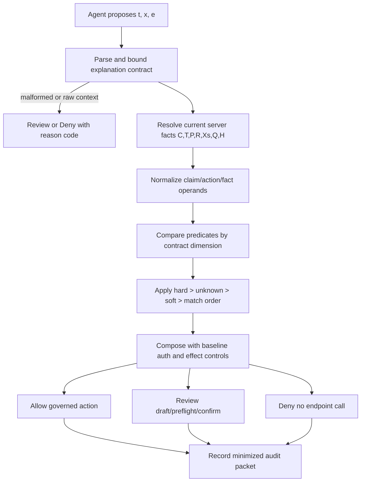

# Explanation-Bound Tool Execution：把 Agent 工具调用解释变成服务器可验证的动作声明

## 元信息

- **论文**：Explanation-Bound Tool Execution for AI Agents: Server-Verified Action Claims Without Trusting Model Rationales
- **作者**：Genliang Zhu、Chu Wang
- **版本**：arXiv:2607.25364v2，2026-07-29 修订；v1 在 2026-07-28 提交
- **方向**：AI 安全 / 大模型 Agent 工具执行治理
- **原文**：[arXiv 摘要页](https://arxiv.org/abs/2607.25364v2)；[PDF](https://arxiv.org/pdf/2607.25364v2)；[HTML](https://arxiv.org/html/2607.25364v2)

## TL;DR

- **它研究什么**：论文讨论工具型 AI Agent 的一个具体治理缺口：工具调用本身有结构化 `tool_name + payload`，但模型给出的理由通常是自由文本，不能当授权、不能当可审计事实，也不能证明模型真实推理过程。
- **它怎么做**：作者提出 EBTE，要求 Agent 在工具调用旁边提交 `ToolInvocationExplanation`，把理由压缩成类型化动作声明；服务器再用自己持有的 intent、tool registry、policy、route、payload、context risk、freshness facts 逐项核验。
- **核心机制**：EBTE 不给模型解释新增任何权限；它只可能维持原有授权、升级为 review，或因为硬矛盾 deny。组合规则可写成 `decision = min_restrictive(baseline_auth, ebte_verdict, effect_control)`，其中 review 不能直接执行。
- **实验/证据**：作者给出 136 个 authored conformance 场景、544 个 task-configuration 行；full EBTE 达到 PDA=1.0000、SNAC=1.0000、HFAR=0.0000、SFAR=0.0000，并通过 232 个 metamorphic checks。
- **运行集成证据**：在 68 个 draft-only runtime 任务、272 行配置对比里，free-form justification 会把 48/48 个 hard cases 转发到 draft endpoint；full EBTE 转发 0/48，同时保留 16/16 soft draft 和 4/4 aligned draft。
- **模型生成证据**：在冻结的 2026-07-12 hosted-model 记录里，224 次尝试有 203 个响应、21 个 provider failure、160 个 saved claims；当前 pipeline 对保存的 minimized claims 做 zero-call revalidation，得到 70/96、65/96、17/32 的 agreement 层结果。
- **外部结构检查**：AgentDojo-derived banking 适配包含 23 个 proposal、92 行配置；所有 attack proposals 本来就因 high-risk controls 非 allow，full EBTE 的增量是把 12/12 task-proposal contradictions 诊断为 deny。
- **局限**：代码和任务级数据是内部 artifact，未随论文公开；实验主要证明 profile conformance、draft-bound mediation 和诊断价值，不证明 rationale faithfulness、人类 review 收益、代表性攻击分布或生产延迟。

## 研究问题：为什么“解释”不能直接治理工具调用？

### 问题的起点

- Agent 系统的外部动作通常已经结构化：
  - 工具名：例如创建交易、导出记录、更新共享状态。
  - payload：例如目标资源、金额、字段、目的地。
  - schema：用于检查字段类型和基本格式。

- 论文指出真正不对称的地方在解释接口：
  - 有些系统保留完整 reasoning trace。
  - 有些系统只附一小段 justification。
  - 有些系统只记录选了哪个工具。

- 这些解释都有同一个治理问题：
  - 解释可以写得很像用户意图，但实际 payload 可能导出错对象。
  - 解释可以漏掉外部目的地、风险等级或不可信上下文依赖。
  - 解释可以是事后合理化，不能证明模型真实地按该理由做出决策。

### 作者真正要缩小的问题

- EBTE 不尝试回答“模型为什么这么想”。
- EBTE 只回答一个更小、也更适合工程执行的问题：
  - 这个工具调用声称依赖的动作事实是什么？
  - 这些事实是否能被服务器独立核验？
  - 核验结果是否允许执行、必须 review，还是应该 deny？

### 这和 prompt injection 的关系

- 间接 prompt injection 的危险不只是“模型说错话”。
- 更实际的风险是：
  - 不可信文档影响了工具选择。
  - payload 指向攻击者想要的资源或目的地。
  - 模型理由没有披露该不可信依赖。
  - 已授权的 token 被用于当前用户并未授权的具体 effect。

- 因此，EBTE 把治理边界放在 tool-effect 前，而不是模型内心或提示词层：
  - 模型可以给解释。
  - 解释必须变成 typed claims。
  - typed claims 仍然是 untrusted input。
  - 服务器用 authoritative facts 决定是否执行。

## 论文主张与论证路线

| Claim | Mechanism | Evidence | Boundary |
|---|---|---|---|
| 自由文本解释不是授权 | 把 rationale 转成 `ToolInvocationExplanation`，只保留可核验字段 | Table I/II 定义字段与权威来源映射 | 不证明模型解释忠实，只核验外部动作声明 |
| EBTE 不能扩大基础权限 | `allow/review/deny` 与 baseline authorization、effect control 取更严格结果 | 论文形式化 explicit-assumption composition；232 个 metamorphic checks 覆盖“不比 payload binding 更宽松” | 依赖服务器事实源、身份绑定、策略库和执行网关正确 |
| typed claims 能覆盖比 payload binding 更广的矛盾 | 比较 intent、route、policy、context、freshness、risk、payload、tool 等维度 | Table III 中 full EBTE 的 HFAR=0、SNAC=1；payload-bound HFAR=0.3646 | 场景是 authored suite，不代表真实世界分布 |
| 可以在现有 Agent runtime 前做 draft-bound mediation | deny 时不调用 draft endpoint；allow/review 时只产生非执行 draft | Table IV 中 full EBTE 的 HCFD=0/48，soft/aligned draft 保留率 1.0 | 未评估真实 effect execution、并发、持久化和吞吐 |
| EBTE 对外部 benchmark 结构有诊断增量 | 将 task-proposal binding 映射到 AgentDojo banking proposals | Table VII 中 full EBTE 把 12/12 attack contradictions 诊断为 deny | 所有攻击本已 high-risk non-allow，所以不是额外阻断率提升 |

## 方法机制：EBTE 的对象、事实和三态决策

### 核心对象

- Agent 输入与输出可以抽象为：
  - 用户请求：`u`
  - 观察上下文：`X`
  - 工具：`t`
  - payload：`x`
  - 解释对象：`e`

- 应用网关持有的独立事实为：

```text
F = (C, T, P, R, Xs, Q, H)

C  = current intent certificate
T  = trusted canonical tool metadata
P  = current application policy
R  = authorized route record / candidate set
Xs = current context-risk snapshot
Q  = preflight or state-witness evidence
H  = integrity-protected audit state
```

- 变量的治理含义：
  - `C` 限定当前用户请求允许的 intent class、operation、resource 和 effect。
  - `T` 是服务器治理的工具注册表，不是模型看到的工具描述。
  - `P` 是当前策略快照，不能由模型在解释中自称满足。
  - `R` 是当前授权路由，决定该工具是否属于候选集合。
  - `Xs` 描述上下文来源、可信/不可信类别和 digest。
  - `Q` 与 `H` 是执行时状态见证和审计完整性要求，论文原型没有完整证明它们。

### 为什么解释对象不是 chain-of-thought

- EBTE 明确不要求 hidden reasoning trace。
- 论文把 contract 字段分成两类：
  - **可执行比较字段**：operation、route membership、resource id、effect bounds、risk tier、destination、policy rule、evidence digest。
  - **非授权描述字段**：intent summary、tool reason code、instruction influence、uncertainty declaration。

- 这个边界有两个效果：
  - 降低把隐私输入、系统提示词或不可信文档写进审计包的风险。
  - 避免把“模型说它为什么这么做”误当作安全证明。

### 三态路由

| 结果 | 含义 | 典型触发条件 | 是否执行 effect |
|---|---|---|---|
| Allow | 与当前独立事实一致，且风险为低/中风险可执行路径 | tool、route、intent、payload、policy、context freshness 都匹配 | 可以进入 governed action path |
| Review | 可能合法，但事实不完整、不确定或风险敏感 | policy evidence 缺失、authoritative fact unavailable、high uncertainty、risk understatement | 不能直接执行；只能 draft/preflight/confirm |
| Deny | 出现硬矛盾或不可接受披露 | unauthorized route、operation outside intent、resource mismatch、stale evidence、raw context disclosure | 不调用执行端点 |

### 组合公式

```text
令次序：Allow < Review < Deny

baseline = ordinary_authorization(u, actor, tenant, t, x)
ebte     = verify_claims(e, F, t, x)
effect   = effect_control(t, x, current_state)

final_decision = max_restrictive(baseline, ebte, effect)
```

- 如果 baseline 已经 deny，EBTE 不能把它降成 review 或 allow。
- 如果 EBTE review，后续人工批准也不能直接复用旧事实。
- 任何批准动作前必须重新加载 `C/T/P/R/Xs/Q/H`，重新计算 composed decision。

## 算法流程：从工具提案到最小审计证据



### 论文给出的六个处理阶段

1. **Parse and bound**
   - 拒绝未知 schema 版本。
   - 限制字段大小和总大小。
   - 拒绝 raw context、malformed evidence references。

2. **Resolve current facts**
   - 以认证应用、actor、session 为边界加载当前事实。
   - 不允许用模型声明替代缺失事实。

3. **Normalize**
   - 把 explanation claims、tool payload、server facts 归一到共同的 operation-resource-effect 表示。

4. **Compare**
   - 对每个 contract dimension 产出 categorical result。
   - 典型维度包括 tool identity、authorized route、resource bounds、policy basis、context provenance、freshness。

5. **Route**
   - 硬矛盾 deny。
   - 软不确定 review。
   - 匹配且低/中风险才可能 allow。

6. **Record**
   - 写入 minimized evidence。
   - 保留 normalized fields、predicate outcomes、decision、reason categories、evidence digests。
   - 不保留 raw untrusted content、完整模型 trace 或私有 prompt。

### 决策伪代码

```text
Input:
  proposed_tool t
  proposed_payload x
  explanation e
  current_facts F = (C,T,P,R,Xs,Q,H)

State:
  predicates = []
  hard = []
  soft = []
  unknown = []

Procedure:
  if schema_version_unknown(e) or transport_too_large(e):
      return Review(reason="schema incomplete or unsupported")

  if contains_raw_untrusted_context(e):
      return Deny(reason="raw context disclosure")

  facts = resolve_current_facts(F, actor, tenant, session)

  for dimension in contract_dimensions:
      claim_operand = normalize(e[dimension])
      action_operand = normalize(t, x, dimension)
      fact_operand = normalize(facts, dimension)

      if fact_operand is unavailable:
          unknown.append(dimension)
      else if claim_operand contradicts action_operand or fact_operand:
          hard.append(dimension)
      else if claim_operand is incomplete or risk_sensitive:
          soft.append(dimension)
      else:
          predicates.append(match(dimension))

  if hard:
      return Deny(reason_codes=stable(hard), audit=minimized(predicates))
  if unknown or soft:
      return Review(reason_codes=stable(unknown + soft), audit=minimized(predicates))
  return Allow(audit=minimized(predicates))

Failure boundary:
  A compromised server fact source, wrong identity binding, malicious authorized tool,
  or out-of-band side effect is outside this verifier's guarantee.
```

## 实验设置：四层证据，不要混在一起读

### RQ1：deterministic profile conformance

- 任务来源：
  - 8 个 abstract task families。
  - 包括 bounded record summarization、expense creation、record update、record export、record deletion、appointment creation、agent-version publication、knowledge search。

- mutation 类型：
  - schema malformed。
  - tool mismatch。
  - unauthorized route。
  - intent-class overreach。
  - operation outside intent。
  - resource mismatch。
  - effect-bound mismatch。
  - policy-rule mismatch。
  - context/provenance/freshness/disclosure/evidence completeness。

- 规模：
  - 136 tasks。
  - 4 个配置。
  - 544 task-configuration rows。
  - 232 metamorphic checks。

### RQ2：draft-only reference integration

- 集成方式：
  - 将 reusable verifier 接到 OpenPort reference implementation。
  - 通过 in-process HTTP injection 调用 intent 与 draft endpoints。
  - 覆盖 transaction creation、update、soft deletion、bounded export 四类工具。

- 安全边界：
  - 所有 forward 都终止为 non-executing draft。
  - deny 时 draft endpoint 不会被调用。
  - 不评估真实执行、批准后的动作、并发、持久化和生产延迟。

### RQ3：hosted-model explanation generation pilot

- 模型层：
  - 4 个 NVIDIA hosted API model families。
  - 每个模型 12 个 synthetic tasks。
  - 包括 aligned、repairable explanation challenges、seeded defects。

- 读法：
  - 这是冻结的 2026-07-12 历史记录。
  - 当前论文只对保存的 minimized claims 做 zero-call revalidation。
  - 它不能证明“模型会稳定生成好解释”，只能展示该 pipeline 对已有声明的再核验结果。

### RQ4：AgentDojo-derived semantic adaptation

- 结构：
  - 来自 pinned AgentDojo banking-suite semantic adapter。
  - 23 proposal records。
  - 92 proposal-configuration rows。

- 特别重要的边界：
  - 12 个 cross-task attack proposals 在所有配置下都已 non-allow，因为 banking effects 是 high risk。
  - full EBTE 的增量不是把 allow 变成 deny。
  - 增量是把“review-gated non-allow”进一步诊断为 task-proposal contradiction deny。

## 主结果：full EBTE 到底比 ablation 多拦住什么？

### Table III：profile-conformance 与 predicate ablation

| 配置 | PDA | SNAC | HFAR | SFAR | AFA | FRR | EFLA |
|---|---:|---:|---:|---:|---:|---:|---:|
| Free-form justification | 0.1471 | 0.3750 | 0.6250 | 0.6250 | 1.0000 | 0.0000 | 1.0000 |
| Structured schema only | 0.3162 | 0.5313 | 0.5729 | 0.1563 | 1.0000 | 0.0000 | 0.0000 |
| Payload-bound explanation | 0.5515 | 0.6875 | 0.3646 | 0.1563 | 1.0000 | 0.0000 | 0.0000 |
| Full EBTE | 1.0000 | 1.0000 | 0.0000 | 0.0000 | 1.0000 | 0.6471 | 0.0000 |

### 指标解释

- **PDA**：profile-disposition agreement，是否匹配 authored profile 的预期处置。
- **SNAC**：specified non-allow coverage，指定非 aligned fixture 是否被 route 到 non-allow。
- **HFAR**：hard-fixture allow rate，硬矛盾被 allow 的比例，越低越好。
- **SFAR**：soft-fixture allow rate，软不确定被 allow 的比例，越低越好。
- **AFA**：aligned-fixture agreement，正常路径是否被保留。
- **FRR**：fact-reference resolvability，审计包里事实引用是否可解析。
- **EFLA**：explicit-fixture leak acceptance，显式泄漏 fixture 是否被接受，越低越好。

### 结果含义

- Free-form justification 几乎不能治理语义矛盾：
  - HFAR=0.6250。
  - SFAR=0.6250。
  - EFLA=1.0000，说明 raw disclosure fixture 仍会被接受。

- Structured schema only 有一个窄收益：
  - 能挡 malformed 和 extra-field disclosure。
  - 但不比较字段值与服务器事实，所以 hard semantic mismatch 仍大量漏过。

- Payload-bound explanation 覆盖工具、资源、operation、numeric bounds：
  - SNAC 提升到 0.6875。
  - HFAR 降到 0.3646。
  - 但缺 intent、route、context、freshness、risk、policy 维度。

- Full EBTE 的关键增量：
  - 96/96 designated hard cases deny。
  - 32/32 soft cases review。
  - 8/8 aligned tasks 保留预期处置。
  - 232/232 metamorphic checks 通过。

## Table IV：runtime 集成只证明 draft 边界，不证明生产执行

| 配置 | 48 个 hard cases 转发率 HCFD | 16 个 soft draft | 4 个 aligned draft | Audit bind | p95 verifier ms | p95 total ms |
|---|---:|---:|---:|---:|---:|---:|
| Free-form justification | 1.0000 | 1.0000 | 1.0000 | 0.9412 | 0.0027 | 2.5756 |
| Structured schema only | 0.9167 | 1.0000 | 1.0000 | 0.9375 | 0.1231 | 1.8426 |
| Payload-bound explanation | 0.5833 | 1.0000 | 1.0000 | 0.9167 | 0.0943 | 1.4660 |
| Full EBTE | 0.0000 | 1.0000 | 1.0000 | 1.0000 | 0.3289 | 1.4453 |

### 怎么读这些数

- HCFD 是最直观的安全指标：
  - free-form：48/48 hard cases 都进入 draft endpoint。
  - payload-bound：仍有约 28/48 hard cases 被转发。
  - full EBTE：0/48 hard cases 被转发。

- soft 与 aligned draft 都保持 1.0000：
  - 说明 full EBTE 不是把一切都挡掉。
  - 它保留了“可能合法但要 review”的路径。
  - 它也保留了对齐的普通 draft 路径。

- 延迟数只能当 harness diagnostic：
  - p95 verifier 为 0.3289 ms。
  - p95 wrapper-plus-intent-plus-draft 为 1.4453 ms。
  - 单机、in-memory、68 rows/configuration，不能外推到生产吞吐。

## Table V/VI：模型生成层的证据边界

### 冻结记录

| 层 | Attempts | Responses | Provider fail | Saved claims | Parse fail | Historical conformant |
|---|---:|---:|---:|---:|---:|---:|
| 2026-07-12 hosted-generation/runner | 224 | 203 | 21 | 160 | 43 | 149 |

### Agreement 结果

| 项 | Historical agreement | Conditional-on-response | Current zero-call revalidation |
|---|---:|---:|---:|
| Initial agreement | 71/96 | 71/88 | 70/96 |
| Repair agreement | 66/96 | 66/84 | 65/96 |
| Seeded-defect repair | 19/32 | 19/31 | 17/32 |

### 研究者应该保持的怀疑

- 这些数不是新一轮模型调用。
- 当前 pipeline 没有访问 provider，也没有生成新解释。
- preserved minimized claims 没有 raw responses。
- 历史文件缺少完整 run fingerprint 与 run config。
- one model family 贡献了全部 21 个 provider failures。

### 论文为什么仍保留这部分

- 它展示了一个实际摩擦点：
  - typed explanation object 并不保证模型稳定生成。
  - 生成失败、parse fail、provider availability 都必须作为独立层报告。

- 这对 Agent 系统很关键：
  - 执行治理不能押注在模型“愿意说清楚”。
  - 服务器 verifier 必须把“生成质量”和“授权决策”分开。

## AgentDojo 适配：EBTE 的增量是诊断，不是阻断率

### 设置

- 数据结构：
  - 23 proposal records。
  - 8 个 ordinary user task calls。
  - 3 个 legitimate direct user goals。
  - 12 个 cross-task attack proposals。

- 关键构造：
  - proposal 的 tool 和 payload 可以自洽。
  - cross-task attack 的 payload 绑定到 injected task。
  - authoritative intent certificate 仍绑定到 ordinary user task。
  - 因此唯一硬矛盾是 task-proposal inconsistency。

### Table VII 结果

| 配置 | Profile agree | Attack deny | Attack non-allow | Benign path | Direct path | FRR |
|---|---:|---:|---:|---:|---:|---:|
| Free-form justification | 0.4783 | 0.0000 | 1.0000 | 1.0000 | 1.0000 | 0.0000 |
| Structured schema only | 0.4783 | 0.0000 | 1.0000 | 1.0000 | 1.0000 | 0.0000 |
| Payload-bound explanation | 0.4783 | 0.0000 | 1.0000 | 1.0000 | 1.0000 | 0.0000 |
| Full EBTE | 1.0000 | 1.0000 | 1.0000 | 1.0000 | 1.0000 | 1.0000 |

### 不能误读的地方

- 所有配置的 Attack non-allow 都是 1.0000。
- 原因是这些 banking effects 本身 high risk，所以已经 review-gated。
- Full EBTE 的增量是：
  - 把 12/12 attacks 从泛化的 non-allow/review 诊断为 deny。
  - 产出 23/23 structurally complete packets。

- 这对审计仍然重要：
  - review 说明“需要人看”。
  - deny 说明“与当前任务事实硬矛盾”。
  - 两者对事后调查、自动化策略回归和告警优先级完全不同。

## Figure 1：为什么我不用本地化图片，而用流程图重画

### 原图承载的信息

- Figure 1 是 EBTE 的总体流程：
  - 输入是 `t, x, e`。
  - 服务器事实是 `C, T, P, R, Xs, Q`。
  - parser/verifier 输出 Allow、Review、Deny。
  - 每个结果都生成 minimized decision evidence。

### 本文处理方式

- 原图不是实验证据曲线，也不是难以文字转述的视觉结果。
- 用 Mermaid 重画可以更清楚地暴露边界：
  - review 不执行。
  - deny 不调用 endpoint。
  - evidence packet 不包含 raw context。

- 因此本轮没有下载图片到 `public/assets/2026/07/31/itm_dac15cd80e335aef/`。

## Hard deny 与 review reason：这篇论文最有用的工程表格

### Hard-denial categories

| 类别 | 默认处置 | 机制意义 |
|---|---|---|
| tool identity mismatch | Deny | 模型声明的工具和 proposed tool 不一致 |
| unauthorized route | Deny | 工具不属于服务器当前授权候选集 |
| operation outside intent | Deny | payload 操作超出当前 intent certificate |
| resource mismatch | Deny | 目标资源类型或 ID 与授权事实不一致 |
| effect mismatch | Deny | 金额、字段、目的地或 effect bounds 越界 |
| policy rule mismatch | Deny | 声明的 policy rule 与当前策略不一致 |
| stale evidence | Deny | digest 与当前服务器事实不匹配 |
| untrusted dependency omitted | Deny | 影响动作的不可信上下文没有 provenance evidence |
| raw context disclosure | Deny | 解释试图持久化 raw untrusted content |

### Review-escalation categories

| 类别 | 默认处置 | 机制意义 |
|---|---|---|
| schema incomplete | Review | 缺少必要 typed evidence，但未形成硬矛盾 |
| risk understatement | Review | 风险声明过低，需要更保守路线 |
| high uncertainty | Review | 模型或解释声明存在不确定 |
| missing policy evidence | Review | 没有足够 policy basis 支撑执行 |
| authoritative fact unavailable | Review | 当前事实源不可用，不能用模型声明补位 |
| preflight required | Review | 高风险动作需要确认或状态见证 |

### 为什么 hard 和 review 必须分开

- 如果全都 deny：
  - 合法但证据不完整的操作会被误当攻击。
  - 审计人员无法区分缺证、过期、越权和泄漏。

- 如果全都 review：
  - 硬矛盾会进入人工队列。
  - 人类可能因自动化偏见批准明显不该执行的动作。

- EBTE 的价值在于稳定 reason taxonomy：
  - 对 hard contradiction 生成 deny。
  - 对 unavailable facts 生成 review。
  - 对 aligned low/medium-risk path 保留 allow。

## 字段级细读：`ToolInvocationExplanation` 为什么要这么拆？

### 字段不是为了“让模型说更多”

- 论文的字段设计有一个克制原则：
  - 只把会影响执行治理的内容结构化。
  - 不要求模型暴露完整推理过程。
  - 不允许自由文本成为权限来源。

- 这让 EBTE 和许多“可解释 Agent”方案分开：
  - 后者常把解释当成用户信任材料。
  - EBTE 把解释当成需要被服务器质询的声明材料。

### intent 相关字段

- intent class 与 operation 的作用：
  - 将用户请求约束到有限动作族。
  - 避免模型把“总结记录”扩张成“导出记录”。
  - 避免模型把“更新当前条目”扩张成“批量更新全部条目”。

- 这里的关键不是模型是否理解用户意图。
- 关键是服务器能否拿到当前 intent certificate，并检查：
  - 声明的 class 是否在证书内。
  - payload operation 是否属于允许操作集。
  - effect 的记录、金额、字段、目的地是否在边界内。

### tool 与 route 字段

- 工具名不能只看模型输出。
- 论文区分两种工具视图：
  - 模型可见的 tool description。
  - 服务器治理的 canonical tool metadata。

- 这种区分对 MCP 风格工具生态尤其重要：
  - 工具描述可能被第三方包污染。
  - 工具目录可能包含名称相似但权限不同的工具。
  - 模型选择工具的理由不能替代服务器 route eligibility。

### policy 与 evidence 字段

- policy basis 不是让模型复述政策。
- 它要能与当前 policy snapshot 里的 rule identifier、decision、scope 做交叉检查。

- evidence reference 也不是 URL 列表。
- 它要满足：
  - 类型受限。
  - digest 可解析。
  - freshness 与当前服务器状态一致。
  - lookup 绑定 authenticated app、key、actor、session。

- 这避免两个常见失败：
  - 模型引用一个看似存在但实际不属于当前会话的证据。
  - 模型重放过期 digest，让旧授权影响新状态。

### context dependency 字段

- EBTE 对不可信上下文的态度很明确：
  - 可以声明依赖。
  - 必须保留类别与 digest。
  - 不应把 raw content 写进 ordinary audit export。

- 这不是为了隐藏证据，而是为了降低审计系统本身的攻击面：
  - 原文档可能包含 prompt injection。
  - 客户记录可能包含隐私。
  - raw trace 可能包含系统提示词或供应商内部策略。

## 审计包：最小披露不是少记录，而是记录可重放结构

### 审计包应该回答什么

- 一个好的 EBTE packet 至少要让审计者回答：
  - 当时使用的是哪个 profile 版本？
  - 哪些 predicate match、unknown、soft、hard？
  - 最终 decision 是 allow、review 还是 deny？
  - reason code 指向哪个 contract dimension？
  - intent、policy、payload、context 的 digest 是否按固定顺序绑定？

- 它不应该直接暴露：
  - raw document text。
  - private prompt。
  - model trace。
  - credential-like material。
  - 不可信输入原文。

### 为什么 digest 不等于完整可复现

- digest 可以支持规则级 replay。
- 但 replay 的前提是 referenced facts 仍可解析。
- 如果事实源后来被删除、迁移、权限改变或被攻陷：
  - packet 只能证明当时声明了某个 digest。
  - 不能自行恢复事实内容。

- 因此 EBTE 的审计价值是结构化、最小化和边界清楚。
- 它不是完整取证系统，也不是长期证据保全系统。

### 与“把 transcript 全存下来”的对比

| 做法 | 好处 | 风险 | EBTE 的取舍 |
|---|---|---|---|
| 保存完整 transcript | 人类可读、上下文完整 | 隐私泄漏、提示词泄漏、注入内容进入审计系统 | 默认排除 |
| 保存自由文本 justification | 轻量、易展示 | 不可验证、可能事后合理化 | 只能做非授权摘要 |
| 保存 typed claims + digests | 可检查、可聚合、披露面小 | 依赖事实源可解析，语义细节较少 | 作为 ordinary packet |

## 安全分析：EBTE 具体挡不住什么？

### 模型与 planner 串谋

- 如果模型和 planner 一起生成看似一致的 payload 与 explanation，EBTE 仍然依赖服务器事实发现越界。
- 能挡住的情况：
  - payload 与 intent 事实不一致。
  - route 不在授权集合。
  - policy rule mismatch。
  - context dependency 被遗漏。

- 挡不住的情况：
  - 服务器 intent 生成本身被污染。
  - canonical tool registry 错误。
  - policy store 被攻陷。
  - actor/tenant/session 绑定错误。

### stale evidence

- stale digest 被论文列为 hard deny。
- 这说明 EBTE 假设动作前事实要重新解析，而不是复用早先 review 时的判断。

- 这个点对真实系统很关键：
  - 用户可能撤回授权。
  - 目标记录可能被更新。
  - 策略可能从允许变为禁止。
  - 上下文风险可能从可信变成不可信。

- 如果系统只在 draft 创建时验证，批准执行时不重算，EBTE 的组合保证就断了。

### 信息泄漏

- 论文的 privacy matrix 覆盖几类风险：
  - raw untrusted content。
  - customer or tenant identifier。
  - credential-like material。
  - private prompt or model trace。
  - fabricated evidence digest。
  - oversized explanation。
  - cross-application reference。

- 对每类风险，EBTE 的思路不是“让模型别写”。
- 它是：
  - schema 上拒绝或限制。
  - evidence lookup 绑定 scope。
  - ordinary audit export 只保留 bounded opaque identifier 或 digest。
  - credential-like material 触发 reject/alert。

### 人类自动化偏见

- Review 不是安全终点。
- 如果 reviewer 看到一段流畅解释，很容易被说服。
- EBTE 的 reason code 和 predicate packet 可以降低这种风险，但不能消除：
  - reviewer 是否理解 reason code 未被实验验证。
  - review UI 如何呈现事实差异未被实验验证。
  - 攻击者是否能通过大量 review 项制造疲劳未被实验验证。

## 实施边界：如果把 EBTE 放进真实 Agent 平台，要先补哪些件？

### 需要有权威事实服务

- 没有 `C/T/P/R/Xs/Q/H`，EBTE 就会退化。
- 实施前必须明确：
  - intent certificate 由谁生成。
  - tool registry 如何治理版本。
  - policy snapshot 如何回滚。
  - route candidate set 如何与用户请求绑定。
  - context digest 如何区分可信和不可信来源。

### 需要有动作前重算

- draft 创建时的 review 不能直接变成执行。
- 执行动作前要重新加载：
  - 当前用户授权。
  - 当前 payload。
  - 当前 policy。
  - 当前 route。
  - 当前 context risk。
  - 当前 preflight/state witness。

- 如果任一事实变化：
  - 原 review 结果只能作为历史记录。
  - 不能作为新的执行凭据。

### 需要有失败降级策略

- authoritative fact unavailable 应该 review，而不是 allow。
- 但 review 队列也要限流：
  - per-actor rate limit。
  - per-tool risk budget。
  - coarse model-facing error。
  - 独立审计访问控制。

- 否则攻击者可以把“事实不可用”变成 review flood。

### 需要把 public profile 和 deployment policy 分开

- 论文的 v0.1 profile 是 reference profile。
- 生产系统可能要更严格：
  - 高风险工具全部 preflight。
  - 某些 destination 永远不能自动 allow。
  - 某些 context category 只允许人工批准。

- 但更严格策略不应破坏 EBTE 的核心原则：
  - model explanation 不能放宽权限。
  - review 不能执行。
  - hard contradiction 不能被 soft evidence 覆盖。

## 相关工作位置：EBTE 不是替代模型防御，而是执行边界的 contract

### 与 CoT / ReAct 的关系

- ReAct 等方法让模型在推理和行动之间交替。
- EBTE 不否认这种交互对任务能力有用。
- 但它认为运行时治理需要比 unrestricted reasoning trace 更小、更稳定的对象。

### 与 prompt injection 防御的关系

- StruQ、AgentDojo、InjecAgent、ToolHijacker、MCPTox 等工作分别从输入隔离、benchmark、工具描述污染和攻击任务角度暴露风险。
- EBTE 的位置更靠后：
  - 假设模型级防御可能失败。
  - 假设工具目录可能被攻击者影响。
  - 在真正触发 effect 前，用服务器事实核验 action claims。

### 与访问控制的关系

- 传统 least privilege 和 ABAC 依赖可信属性与策略。
- EBTE 把这种纪律扩展到解释：
  - 文本可以总结。
  - 权限必须来自独立事实。
  - explanation 只能参与更严格的路由，不能放宽权限。

### 与审计系统的关系

- 完整 transcript 可能太大、太敏感，也可能包含不可信内容。
- EBTE 的 audit packet 是结构化最小证据：
  - normalized predicates。
  - reason categories。
  - evidence digests。
  - decision。

- 它牺牲了原始上下文可读性，换取较小披露面和可重放的规则级证据。

## 局限与可复现性

### 作者明确承认的局限

- deterministic suite 小且 authored，部分由 8 个 base tasks 生成。
- expected outcomes 与 evaluator 来自同一 profile，所以 PDA 衡量的是 profile 内 conformance。
- AgentDojo adaptation 使用 minimized proposal inventory，没有环境转移、真实参数、模型交互或 upstream scoring。
- 所有 12 个 adapted attacks 已经 high-risk non-allow，EBTE 只提供诊断 deny。
- draft-only wrapper 使用单个 in-memory clean pinned runtime。
- 未评估 effect execution、action-time revalidation、concurrency、durability、throughput、production latency。
- hosted pilot 的 prompt 曾在冻结协议前迭代调试，availability filtering 未预注册。
- 历史文件缺少 raw responses、run fingerprint 和 run config。

### 代码与数据边界

- Appendix G 列出 artifact 清单：
  - `task_catalog.mjs`
  - `explanation_verifier.mjs`
  - `explanation_contract_eval.mjs`
  - `profile/ebte-v0.1-schema.json`
  - `profile/ebte-v0.1-profile.json`
  - `runtime_explanation_eval.ts`
  - `model_pilot_tasks.jsonl`
  - `agentdojo_semantic_adaptation_eval.mjs`
  - `verify_artifact_manifest.mjs`

- 但 Data and Code Availability 写明：
  - source code 和 task-level evaluation data 作为内部研究 artifact 维护。
  - 它们没有随 manuscript 分发。

- 因此本文不能声称已经独立复现。
- 更准确的说法是：
  - 论文提供了 artifact inventory、hash/fingerprint 和结果表。
  - 外部读者目前只能审阅设计和报告结果，不能完整运行作者 artifact。

## 失败案例与负控：哪些情况 EBTE 应该挡住？

### 负控一：payload 与 intent 不一致

- 用户意图：
  - 只允许总结某个 bounded record。

- 攻击后 payload：
  - 导出另一个 record。
  - 或把 destination 指向外部位置。

- EBTE 检查：
  - `C` 中的 resource/effect bounds。
  - `x` 中实际操作、资源、字段和目的地。
  - `e` 中声明的 expected effect。

- 预期结果：
  - 如果 payload 越界：deny。
  - 如果 authoritative fact 不可用：review。

### 负控二：工具路由不在候选集合

- 模型解释可能声称“这个工具适合当前任务”。
- 服务器只接受 `R` 中的 authorized route。
- 如果 `t` 不属于 `R`：
  - explanation 再合理也不能 allow。
  - reason code 应指向 unauthorized route。

### 负控三：不可信上下文依赖被省略

- 场景：
  - 邮件、网页或文档中的不可信内容影响了工具调用。
  - explanation 没有声明该 context dependency。

- EBTE 的处置：
  - material untrusted dependency omitted 是 hard deny。
  - context fact unavailable 是 review。

### 负控四：raw context 被写入审计

- 审计包不能保存原始不可信内容。
- 论文 artifact 显式测试了 `rawContent` 字段和固定 synthetic marker。
- full EBTE 的 EFLA=0.0000，说明这些 fixture 没有被接受。

## 我对论文贡献的判断

### 最强贡献

- 它把“解释治理”从心理学式问题改成工程 contract：
  - 不问模型是否真这么想。
  - 只问动作声明能否被服务器事实核验。

- 它给了清晰的执行边界：
  - explanation is not authority。
  - review is non-executing。
  - missing authoritative fact cannot be replaced by model assertion。
  - every approval must recompute current facts。

### 最容易被误读的地方

- PDA=1.0000 不等于真实世界安全。
- 0/48 hard forwarding 不等于生产系统不会执行坏动作。
- AgentDojo 12/12 attack deny 不等于额外阻断了 12 个本会执行的攻击。
- 0.3289 ms verifier p95 不等于生产可用延迟。

### 对 Agent 安全架构的启发

- 真正可落地的 Agent 执行网关应把 evidence 分成三层：
  - **模型可见层**：工具描述、上下文、用户请求。
  - **服务器事实层**：policy、intent certificate、route、tool registry、context digest。
  - **审计层**：minimized packet、reason code、predicate outcome、digest。

- 权限设计也应按三态组织：
  - Allow：低/中风险且事实匹配。
  - Review：证据缺失、风险敏感或不确定。
  - Deny：当前事实硬矛盾或隐私泄漏。

- 这比“让模型写更长解释”更稳：
  - 长解释扩大泄漏面。
  - 长解释更难验证。
  - 长解释可能让人类 reviewer 更容易相信错误叙事。

## 继续追问

### 需要公开 artifact 才能回答的问题

- `explanation_verifier.mjs` 的 predicate 顺序是否存在实现偏差？
- `profile/ebte-v0.1-schema.json` 的字段上限是否足够防止资源消耗攻击？
- `verify_artifact_manifest.mjs` 是否覆盖所有报告表格与 JSON 结果的一致性？
- AgentDojo minimized proposals 是否保留了足够语义，还是过度简化了真实攻击轨迹？

### 需要生产实验才知道的问题

- 高风险 review 队列会不会被攻击者 flood？
- 人类 reviewer 看到 stable reason code 后是否真的更少误批？
- action-time revalidation 在并发工作流里如何处理 state drift？
- 多租户系统中 evidence lookup 的 app/actor/session binding 是否容易配置错？
- tool registry 被供应链污染时，EBTE 的 trusted `T` 如何更新和回滚？

### 研究结论的边界句

- EBTE 目前最可靠的结论是：
  - 在作者定义的 profile 和 fixture 中，typed action claims 能被服务器事实核验，并比 free-form/schema-only/payload-bound ablation 更严格地区分 allow、review、deny。

- EBTE 目前不能证明：
  - 模型解释忠实。
  - 人类 review 一定更好。
  - 对真实 prompt injection 分布有代表性防护率。
  - 内部 artifact 可被外部复现。
  - 生产系统的吞吐、延迟、耐久性和并发一致性已经解决。
